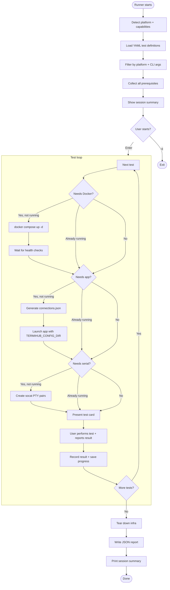
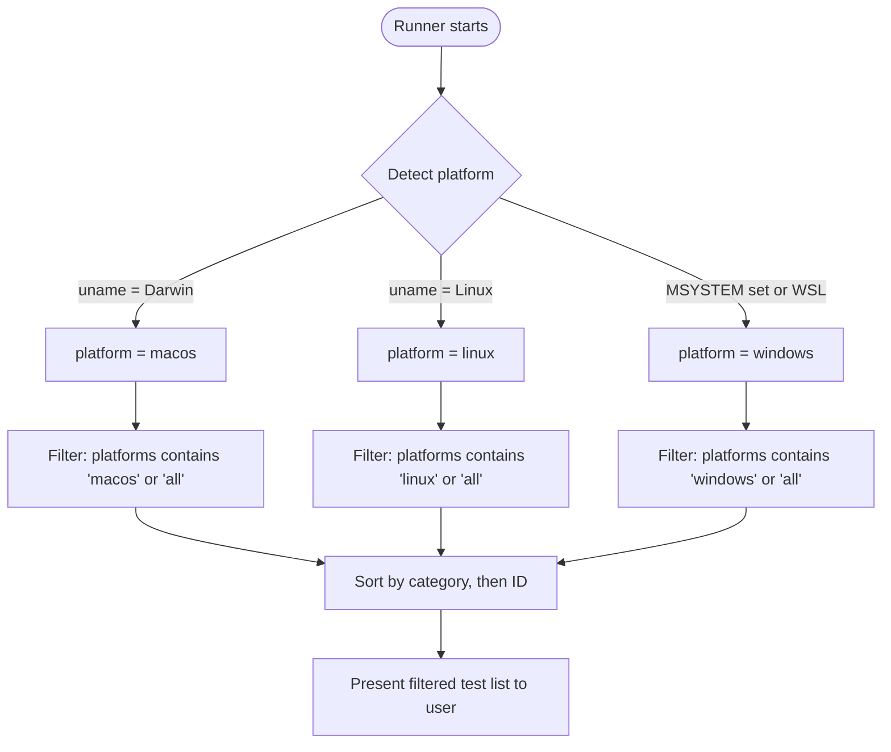
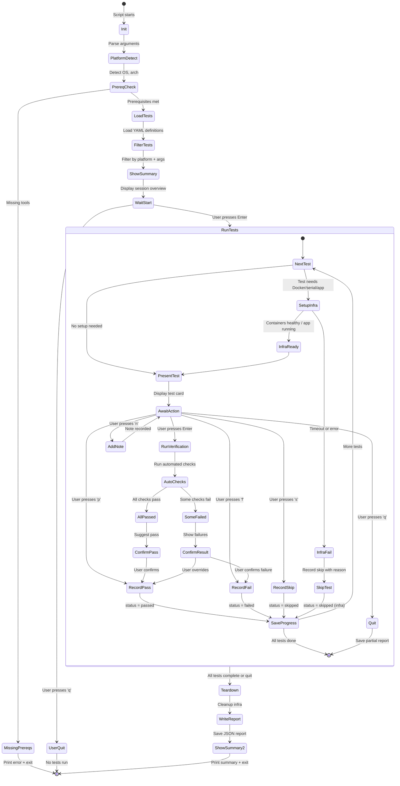
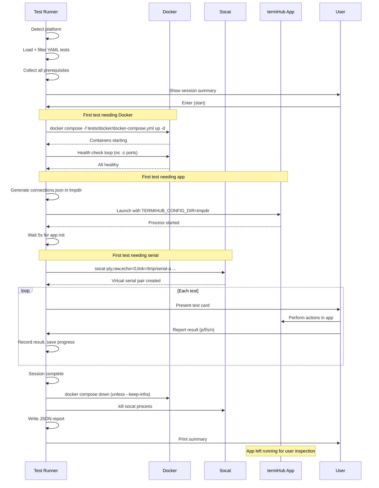
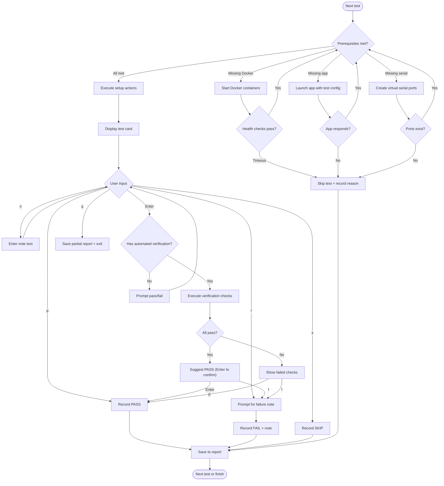
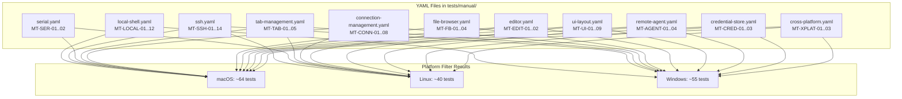

# Guided Manual Testing

**GitHub Issue:** TBD

---

## Overview

termiHub has 97 manual test items in `docs/testing.md` that cannot be fully automated. These tests verify platform-specific behavior (macOS key repeat, WSL shell detection, Windows shells), native OS dialogs (file picker, save, import/export), visual rendering (Powerline glyphs, white flash timing, 1px panel borders), external application integration (VS Code), and OS-level features (Keychain, app icon). Currently, a developer must read the testing document, mentally filter for their platform, manually set up infrastructure, perform each test, and track results in their head — a tedious, error-prone process.

### Motivation

- **Manual testing is slow and inconsistent**: Each release requires walking through ~97 items across up to 4 platforms. Different developers may interpret instructions differently or skip steps.
- **No structured tracking**: Results live in a developer's head or scattered checkboxes. There is no persistent record of what was tested, when, by whom, or on which OS version.
- **Infrastructure setup is ad hoc**: Some tests require Docker containers, some require the app running, some need specific connections pre-created. The developer must figure this out each time.
- **Platform filtering is manual**: A developer on macOS must scan the entire list to find the ~50 macOS-relevant items, mentally skipping Windows/WSL tests.

### Goals

- Provide a **YAML-based test definition format** that mirrors the structure in `docs/testing.md`, adding machine-readable metadata (platform, category, prerequisites, verification steps)
- Build a **shell-script guided test runner** (`scripts/test-manual.sh`) that presents applicable tests one at a time
- **Automate infrastructure setup** by reusing existing Docker compose files and the `TERMIHUB_CONFIG_DIR` mechanism for pre-creating connections
- Support **automated verification** where possible (file existence checks, JSON validation, process/port checks) with fallback to user confirmation (pass/fail/skip)
- Generate a **JSON report** with timestamps, platform info, and per-test results that can be attached to release checklists or PR reviews
- **Integrate with existing infrastructure** — reuse `tests/docker/docker-compose.yml`, `tests/fixtures/ssh-keys/`, and `examples/` without duplicating any setup logic

### Non-Goals

- Replacing the existing automated E2E test suite (WebdriverIO + tauri-driver)
- Full automation of visual verification (screenshot diffing, pixel comparison)
- A GUI-based test runner (the CLI is sufficient for developer workflows)
- Cross-machine test coordination (each developer runs the runner locally)

---

## UI Interface

This is a developer-facing CLI tool. The "UI" is the terminal output during a guided test session.

### Session Overview

When the runner starts, it displays a session summary showing the platform, applicable test count, and infrastructure status:

```
┌──────────────────────────────────────────────────────────────────┐
│  termiHub Guided Manual Tests                                    │
│  Platform:  macOS 14.5 (aarch64)                                │
│  App:       v0.12.0 (release build)                             │
│  Date:      2026-02-25T14:30:00Z                                │
├──────────────────────────────────────────────────────────────────┤
│                                                                  │
│  Test categories for this platform:                              │
│    Local Shell .................. 12 tests                       │
│    SSH .......................... 14 tests                       │
│    Serial .......................  2 tests                       │
│    Tab Management ...............  5 tests                       │
│    Connection Management ........  8 tests                       │
│    File Browser .................  4 tests                       │
│    UI / Layout ..................  9 tests                       │
│    Remote Agent .................  4 tests                       │
│    Credential Store .............  3 tests                       │
│    Cross-Platform ...............  3 tests                       │
│                                                                  │
│  Total applicable: 64 of 97 tests                               │
│                                                                  │
│  Infrastructure:                                                 │
│    Docker ............. available                                │
│    Virtual serial ..... available (socat)                        │
│    USB serial ......... not detected                             │
│    App binary ......... found (release build)                   │
│                                                                  │
└──────────────────────────────────────────────────────────────────┘

Press Enter to begin, or 'q' to quit.
```

### Individual Test Card

Each test is presented in a structured card with clear phases:

```
┌──────────────────────────────────────────────────────────────────┐
│  [12/64]  MT-LOCAL-03  macOS key repeat fix                     │
│  Category: Local Shell   Platform: macOS   PR: #48              │
├──────────────────────────────────────────────────────────────────┤
│                                                                  │
│  SETUP (automated):                                              │
│    [done] App launched with test config                          │
│    [done] Local shell connection "Key Repeat Test" created       │
│                                                                  │
│  INSTRUCTIONS:                                                   │
│    1. Switch to the "Key Repeat Test" tab in the app             │
│    2. Hold any letter key (e.g., 'k') for 3 seconds             │
│    3. Observe the terminal output                                │
│                                                                  │
│  EXPECTED:                                                       │
│    - Key repeats continuously (kkkkkkkkkkkk...)                  │
│    - Accent picker does NOT appear                               │
│    - No delay before repeat starts                               │
│                                                                  │
│  RESULT: [p]ass  [f]ail  [s]kip  [n]ote  [q]uit                │
│                                                                  │
└──────────────────────────────────────────────────────────────────┘
```

### Test With Automated Verification

Some tests include automated verification steps that the runner executes after the manual action:

```
┌──────────────────────────────────────────────────────────────────┐
│  [28/64]  MT-CONN-05  Export connections to file                │
│  Category: Connection Management   Platform: all   PR: #33     │
├──────────────────────────────────────────────────────────────────┤
│                                                                  │
│  SETUP (automated):                                              │
│    [done] App launched with 3 test connections pre-loaded        │
│                                                                  │
│  INSTRUCTIONS:                                                   │
│    1. In the app, click the gear icon menu > "Export"            │
│    2. In the native save dialog, save to:                        │
│       /tmp/termihub-test-export.json                             │
│    3. Press Enter here when done (or 's' to skip)               │
│                                                                  │
│  VERIFICATION (automated):                                       │
│    [ ] File /tmp/termihub-test-export.json exists                │
│    [ ] File contains valid JSON                                  │
│    [ ] JSON has "connections" array with >= 3 entries            │
│    [ ] No "password" fields contain non-null values              │
│                                                                  │
└──────────────────────────────────────────────────────────────────┘

Press Enter to run verification...

  VERIFICATION:
    [pass] File exists
    [pass] Valid JSON
    [pass] 3 connections found
    [pass] No passwords in export

  All checks passed. Mark as [p]ass? (Enter to confirm)
```

### Session Summary

At the end, the runner prints a summary and writes the report:

```
┌──────────────────────────────────────────────────────────────────┐
│  Session Complete                                                │
├──────────────────────────────────────────────────────────────────┤
│                                                                  │
│  Results:                                                        │
│    Passed .................. 51                                  │
│    Failed .................  3                                   │
│    Skipped ................  8                                   │
│    Not run ................  2                                   │
│                                                                  │
│  Failed tests:                                                   │
│    MT-UI-01  No white flash on startup                          │
│      Note: "Brief 50ms white flash visible on cold start"       │
│    MT-SSH-07  Powerline glyph rendering                         │
│      Note: "Black rectangle behind user@host segment"           │
│    MT-CRED-02  Keychain integration                             │
│      Note: "No entry found in Keychain Access"                  │
│                                                                  │
│  Report saved to:                                                │
│    tests/reports/manual-2026-02-25T143000-macos-arm64.json      │
│                                                                  │
│  Duration: 28m 14s                                               │
│                                                                  │
└──────────────────────────────────────────────────────────────────┘
```

### Command-Line Interface

```
Usage: python scripts/test-manual.py [OPTIONS]

Options:
  --category <name>     Run only tests in a specific category
                        (local-shell, ssh, serial, tab-management,
                         connection-management, file-browser, ui-layout,
                         remote-agent, credential-store, cross-platform,
                         config-recovery)
  --test <id>           Run a single test by ID (e.g., MT-LOCAL-03)
  --platform <os>       Override platform detection (macos, linux, windows)
  --skip-setup          Skip infrastructure setup (assume already running)
  --skip-infra          Skip Docker container management
  --keep-infra          Keep Docker containers running after session
  --app-path <path>     Path to app binary (overrides auto-detection)
  --report-dir <dir>    Output directory for reports (default: tests/reports/)
  --resume <file>       Resume a previous session from a report file
  --list                List all tests for the current platform (no run)
  --help, -h            Show this help message
```

---

## General Handling

### Test Definition Format

Tests are defined in YAML files organized by category, living in `tests/manual/`. Each file corresponds to one section of the manual testing checklist in `docs/testing.md`.

#### Example: Local Shell Tests

```yaml
# tests/manual/local-shell.yaml
category: local-shell
display_name: "Local Shell"

tests:
  - id: MT-LOCAL-01
    name: "PowerShell input works on new connection"
    pr: 198
    platforms: [windows]
    prerequisites:
      - app: true
    setup:
      - create_connection:
          name: "PowerShell Input Test"
          type: local
          config:
            shellType: powershell
      - connect: "PowerShell Input Test"
    instructions:
      - "Observe the terminal tab that just opened"
      - "Type any text (e.g., 'hello') — it should appear immediately"
      - "You should NOT need to click the terminal area first"
    expected:
      - "Keyboard input works immediately without clicking the terminal"
    verification: manual

  - id: MT-LOCAL-03
    name: "macOS key repeat fix"
    pr: 48
    platforms: [macos]
    prerequisites:
      - app: true
    setup:
      - create_connection:
          name: "Key Repeat Test"
          type: local
          config:
            shellType: zsh
      - connect: "Key Repeat Test"
    instructions:
      - "Switch to the 'Key Repeat Test' tab in the app"
      - "Hold any letter key (e.g., 'k') for 3 seconds"
      - "Observe the terminal output"
    expected:
      - "Key repeats continuously (kkkkkkkkkkkk...)"
      - "Accent picker does NOT appear"
      - "No delay before repeat starts"
    verification: manual
```

#### Example: Connection Management Tests (with automated verification)

```yaml
# tests/manual/connection-management.yaml
category: connection-management
display_name: "Connection Management"

tests:
  - id: MT-CONN-05
    name: "Export connections to file"
    pr: 33
    platforms: [all]
    prerequisites:
      - app: true
    setup:
      - create_connection:
          name: "Export Test SSH"
          type: ssh
          config:
            host: "192.168.1.100"
            port: 22
            username: "admin"
            authMethod: password
      - create_connection:
          name: "Export Test Local"
          type: local
          config:
            shellType: bash
      - create_connection:
          name: "Export Test Telnet"
          type: telnet
          config:
            host: "10.0.0.50"
            port: 23
    instructions:
      - "In the app, click the gear icon menu > 'Export'"
      - "In the native save dialog, save to: /tmp/termihub-test-export.json"
      - "Press Enter here when done"
    expected:
      - "Native save dialog opens"
      - "File is written with connection data"
      - "No passwords in exported file"
    verification:
      type: combined
      automated:
        - type: file_exists
          path: "/tmp/termihub-test-export.json"
          description: "Export file exists"
        - type: json_check
          path: "/tmp/termihub-test-export.json"
          jq: ".connections | length >= 3"
          description: "At least 3 connections in export"
        - type: json_check
          path: "/tmp/termihub-test-export.json"
          jq: "[.connections[].config.config.password // empty] | length == 0"
          description: "No passwords in export"
      manual_prompt: "Did the native save dialog appear correctly?"
```

#### Test Definition Fields

| Field           | Type       | Required | Description                                                     |
| --------------- | ---------- | -------- | --------------------------------------------------------------- |
| `id`            | string     | yes      | Unique ID, format `MT-<CATEGORY>-<NN>`                          |
| `name`          | string     | yes      | Human-readable test name                                        |
| `pr`            | number     | no       | PR reference for traceability                                   |
| `platforms`     | list       | yes      | `[macos]`, `[windows]`, `[linux]`, or `[all]`                   |
| `prerequisites` | map        | yes      | Required infrastructure (see below)                             |
| `setup`         | list       | no       | Automated setup steps (see Setup Actions)                       |
| `instructions`  | list       | yes      | Steps for the human to perform                                  |
| `expected`      | list       | yes      | What the human should observe                                   |
| `verification`  | string/map | yes      | `manual` or automated check definition                          |
| `tags`          | list       | no       | Additional tags for filtering (e.g., `visual`, `native-dialog`) |

#### Prerequisite Types

| Key          | Type      | Description                                                                 |
| ------------ | --------- | --------------------------------------------------------------------------- |
| `app`        | bool      | App must be running                                                         |
| `docker`     | bool/list | Docker containers needed (true = default profile, list = specific profiles) |
| `serial`     | bool      | Virtual serial ports needed                                                 |
| `usb_serial` | bool      | Physical USB-to-serial hardware needed                                      |

#### Setup Actions

| Action              | Description                                                                       |
| ------------------- | --------------------------------------------------------------------------------- |
| `create_connection` | Write a connection to the test `connections.json` (name, type, config)            |
| `connect`           | Instruction to double-click a named connection (displayed to user, not automated) |
| `start_docker`      | Ensure specific Docker compose profiles are running                               |
| `start_serial`      | Ensure virtual serial ports are running via socat                                 |
| `navigate`          | Instruction to navigate to a specific screen (settings, file browser, etc.)       |
| `wait`              | Pause for a specified duration in ms                                              |
| `cleanup_file`      | Remove a file from a previous test run (e.g., `/tmp/termihub-test-export.json`)   |

#### Verification Types

```yaml
# Manual confirmation only — user decides pass/fail
verification: manual

# File existence check
verification:
  type: file_exists
  path: "/tmp/termihub-test-export.json"
  description: "Export file was created"

# JSON content check via jq
verification:
  type: json_check
  path: "/tmp/termihub-test-export.json"
  jq: ".connections | length >= 3"
  description: "At least 3 connections in export"

# Process running check
verification:
  type: process_running
  name: "termiHub"
  description: "App is still running (no crash)"

# TCP port listening (for tunnel tests)
verification:
  type: port_listening
  port: 18080
  description: "Tunnel local port is listening"

# Combined: automated checks + manual confirmation for visual aspects
verification:
  type: combined
  automated:
    - type: file_exists
      path: "/tmp/termihub-test-export.json"
      description: "Export file exists"
  manual_prompt: "Did the native save dialog appear correctly?"
```

### Infrastructure Lifecycle

The runner manages infrastructure in three phases using lazy initialization — resources are only started when the first test requiring them is encountered.



### Connection Pre-Creation

The runner pre-creates connections by:

1. Scanning all tests that will be run and collecting `create_connection` setup actions
2. Generating a `connections.json` in a temporary config directory
3. Launching the app with `TERMIHUB_CONFIG_DIR` pointing to that directory

This reuses the same mechanism as `examples/scripts/start-test-environment.sh`. The generated file follows the exact `ConnectionStore` format:

```json
{
  "version": "1",
  "folders": [
    {
      "id": "folder-manual-test",
      "name": "Manual Test Connections",
      "parentId": null,
      "isExpanded": true
    }
  ],
  "connections": [
    {
      "id": "mt-conn-001",
      "name": "Key Repeat Test",
      "config": {
        "type": "local",
        "config": { "shellType": "zsh" }
      },
      "folderId": "folder-manual-test"
    },
    {
      "id": "mt-conn-002",
      "name": "SSH Password Test",
      "config": {
        "type": "ssh",
        "config": {
          "host": "127.0.0.1",
          "port": 2201,
          "username": "testuser",
          "authMethod": "password"
        }
      },
      "folderId": "folder-manual-test"
    }
  ],
  "agents": []
}
```

### Platform-Aware Filtering

Each test declares its supported platforms. The runner detects the current platform at startup and filters accordingly:



### Report Format

The JSON report captures full context for reproducibility and can be attached to release checklists or PR reviews:

```json
{
  "version": "1",
  "session": {
    "id": "session-2026-02-25T143000",
    "started_at": "2026-02-25T14:30:00Z",
    "completed_at": "2026-02-25T14:58:14Z",
    "duration_seconds": 1694
  },
  "environment": {
    "platform": "macos",
    "arch": "aarch64",
    "os_version": "macOS 14.5",
    "app_version": "0.12.0",
    "docker_available": true,
    "serial_available": true
  },
  "summary": {
    "total": 64,
    "passed": 51,
    "failed": 3,
    "skipped": 8,
    "not_run": 2
  },
  "results": [
    {
      "id": "MT-LOCAL-03",
      "name": "macOS key repeat fix",
      "category": "local-shell",
      "status": "passed",
      "timestamp": "2026-02-25T14:32:15Z",
      "duration_seconds": 45,
      "note": null,
      "verification_type": "manual"
    },
    {
      "id": "MT-UI-01",
      "name": "No white flash on startup",
      "category": "ui",
      "status": "failed",
      "timestamp": "2026-02-25T14:45:30Z",
      "duration_seconds": 30,
      "note": "Brief 50ms white flash visible on cold start",
      "verification_type": "manual"
    }
  ]
}
```

### Resume Support

If a session is interrupted (Ctrl+C, quit, or crash), the in-progress report is saved after every test result. The `--resume <file>` flag allows continuing from where the session left off, skipping already-completed tests. This is important because a full manual test session can take 30-60 minutes — an interruption should not require starting over.

### Relationship to docs/testing.md

The YAML test definitions are the **machine-readable counterpart** to the manual testing section in `docs/testing.md`. They should be kept in sync:

- When a new manual test is added to `docs/testing.md`, a corresponding YAML definition should be added to the appropriate file in `tests/manual/`
- The YAML files become the **source of truth** for guided testing; `docs/testing.md` provides the human-readable overview and E2E coverage analysis
- A future CI check could validate that every manual test ID in the YAML files has a corresponding entry in `docs/testing.md`

---

## States & Sequences

### Test Runner State Machine



### Infrastructure Lifecycle Sequence



### Single Test Execution Flow



### Test Categories and ID Mapping



---

## Preliminary Implementation Details

### File Structure

```
tests/
  manual/                             # YAML test definitions
    local-shell.yaml                  # ~20 tests (macOS key repeat, WSL, doubled text, etc.)
    ssh.yaml                          # ~35 tests (Powerline, X11, key auth, monitoring, tunnels)
    serial.yaml                       #  ~2 tests (Nerd Font glyphs)
    tab-management.yaml               # ~17 tests (drag, save to file, horizontal scroll, split views)
    connection-management.yaml        # ~31 tests (import/export, icons, external files, validation)
    file-browser.yaml                 # ~20 tests (SFTP, VS Code, WSL paths, editor)
    ui-layout.yaml                    # ~20 tests (white flash, theme, borders, app icon)
    remote-agent.yaml                 #  ~8 tests (cleanup, setup wizard, error dialog)
    credential-store.yaml             #  ~8 tests (keychain, master password, auto-lock)
    cross-platform.yaml               #  ~3 tests (shell list, serial ports, X11)
    config-recovery.yaml              # ~12 tests (corrupt settings, nested tree data model)
  reports/                            # Generated JSON reports (gitignored)
    .gitkeep
scripts/
  test-manual.py                      # Cross-platform Python guided test runner
```

### Runner Implementation

The runner is a single Python script (`scripts/test-manual.py`), chosen over the originally planned bash + jq + .cmd wrapper approach because:

- **Cross-platform natively**: Python runs on macOS, Linux, and Windows without requiring Git Bash or WSL
- **No extra dependencies**: Python handles YAML (PyYAML), JSON, and interactive I/O natively — no `jq` needed
- **Single file**: Eliminates the need for a separate YAML-to-JSON helper and Windows .cmd wrapper
- **Cleaner logic**: argparse for CLI arguments, `socket` for port checks, `subprocess` for Docker/socat management

Python 3.8+ with PyYAML is already a project prerequisite (used by the serial echo server).

**Key structure:**

```python
#!/usr/bin/env python3

# 1. Parse arguments (argparse: --category, --test, --platform, etc.)
# 2. Detect platform (platform module -> macos/linux/windows)
# 3. Check prerequisites (Docker, socat availability)
# 4. Load YAML test definitions directly (yaml.safe_load)
# 5. Filter tests by platform and CLI args
# 6. Show session summary, wait for user
# 7. Infrastructure management (lazy start, atexit cleanup)
# 8. Main loop: present tests one at a time, collect results
# 9. Verification engine (automated checks + manual confirmation)
# 10. Save progress after each test (resume support)
# 11. Generate JSON report + print summary
```

### Verification Engine

Implemented as Python functions using only the standard library:

```python
def run_verification(verification):
    """Dispatch to the appropriate check based on type."""
    checks = []
    vtype = verification.get("type", "")

    if vtype == "file_exists":
        checks.append({
            "description": verification["description"],
            "passed": os.path.isfile(verification["path"]),
        })

    elif vtype == "json_check":
        # Uses json.load for validation; optionally jq if available
        try:
            with open(verification["path"]) as f:
                json.load(f)
            passed = True
        except (json.JSONDecodeError, FileNotFoundError):
            passed = False
        checks.append({"description": verification["description"], "passed": passed})

    elif vtype == "process_running":
        # Uses subprocess: pgrep on Unix, tasklist on Windows
        ...

    elif vtype == "port_listening":
        # Uses socket.create_connection with timeout
        try:
            with socket.create_connection(("127.0.0.1", port), timeout=2):
                passed = True
        except (ConnectionRefusedError, socket.timeout, OSError):
            passed = False
        checks.append({"description": verification["description"], "passed": passed})

    elif vtype == "combined":
        for auto_check in verification.get("automated", []):
            checks.extend(run_verification(auto_check))

    return checks
```

### App Binary Detection

The runner auto-detects the app binary based on platform:

| Platform | Binary Path                                                                  |
| -------- | ---------------------------------------------------------------------------- |
| macOS    | `src-tauri/target/release/bundle/macos/termiHub.app/Contents/MacOS/termiHub` |
| Linux    | `src-tauri/target/release/termihub`                                          |
| Windows  | `src-tauri/target/release/termihub.exe`                                      |

If the binary is not found, the runner prompts the user to build first (`pnpm tauri build`) or to provide a path via `--app-path`.

### Integration with Existing Infrastructure

| Existing Asset                    | How the Runner Uses It                                                                        |
| --------------------------------- | --------------------------------------------------------------------------------------------- |
| `tests/docker/docker-compose.yml` | Started directly via `docker compose up -d` for tests needing SSH/telnet containers           |
| `tests/fixtures/ssh-keys/`        | Referenced in instructions (e.g., "use the ed25519 key at `tests/fixtures/ssh-keys/ed25519`") |
| `TERMIHUB_CONFIG_DIR` env var     | Used to inject pre-created connections into the app at launch                                 |
| `examples/` patterns              | Infrastructure lifecycle patterns reused from `start-test-environment.sh`                     |

### Test-to-YAML Migration from docs/testing.md

Every manual test item in `docs/testing.md` maps to a YAML entry:

| testing.md Section           | YAML File                    | ID Prefix      | ~Count |
| ---------------------------- | ---------------------------- | -------------- | ------ |
| Local Shell                  | `local-shell.yaml`           | `MT-LOCAL`     | 20     |
| SSH                          | `ssh.yaml`                   | `MT-SSH`       | 35     |
| Serial                       | `serial.yaml`                | `MT-SER`       | 2      |
| Tab Management + Split Views | `tab-management.yaml`        | `MT-TAB`       | 17     |
| Connection Management        | `connection-management.yaml` | `MT-CONN`      | 31     |
| File Browser + Editor        | `file-browser.yaml`          | `MT-FB`        | 20     |
| UI / Layout                  | `ui-layout.yaml`             | `MT-UI`        | 20     |
| Remote Agent                 | `remote-agent.yaml`          | `MT-AGENT`     | 8      |
| Credential Store             | `credential-store.yaml`      | `MT-CRED`      | 8      |
| Cross-Platform               | `cross-platform.yaml`        | `MT-XPLAT`     | 3      |
| Configuration Recovery       | `config-recovery.yaml`       | `MT-RECOVERY`  | 12     |

### Dependencies

| Tool                 | Purpose                  | Required                  | Notes                                               |
| -------------------- | ------------------------ | ------------------------- | --------------------------------------------------- |
| `python3` + `PyYAML` | Runner + YAML parsing    | yes                       | Already a project prerequisite (serial echo server) |
| `jq`                 | JSON verification checks | optional                  | Used for `json_check` if available; graceful fallback |
| `docker`             | Container infrastructure | for SSH/telnet/SFTP tests | Already used by test-system scripts                 |
| `socat`              | Virtual serial ports     | for serial tests          | Already used by test-system scripts                 |

### Future Enhancements (Out of Scope)

- **Screenshot capture**: Auto-capture at each test step via `screencapture` (macOS) / `scrot` (Linux), attach to report
- **HTML report viewer**: Render JSON reports with filtering, sorting, and charts
- **CI integration**: Run guided tests in CI with a "manual approval" gate
- **Test definition validation**: CI check ensuring YAML definitions stay in sync with `docs/testing.md`
- **Notification hooks**: Slack/email alerts when manual test sessions are needed for a release
