# Agent Concept

> Design concept for the termiHub remote agent — a persistent, auto-deployed daemon that mirrors local termiHub capabilities on any remote host.

---

## Overview

The termiHub agent is a standalone daemon that runs on remote hosts (build servers, NAS devices, ARM boards, any Linux/macOS machine) and acts as **termiHub's persistent backend on that machine**. It provides the same capabilities as the local termiHub desktop — shells, serial ports, Docker containers, SSH connections to other hosts — but keeps sessions alive independently of the desktop app.

The agent has the **full capabilities of the local machine** in terms of connections: local shells, serial ports, SSH to other hosts, Docker containers, and file browsing. The only restriction is that **an agent cannot deploy another agent** — there is no recursive agent chaining.

**Core motivations:**

- **Session persistence** — A developer starts a long-running build on a remote build server, shuts down their laptop for the night, and reconnects the next morning to find the terminal still running with full output history.
- **Unified experience** — Whether working locally or remotely, the UI behaves identically. The agent supports the same prepared connections, folders, and session model as the local desktop.
- **Zero setup** — termiHub auto-deploys the agent when connecting to a new host. No manual installation, no version mismatches.
- **Multi-host orchestration** — A developer can have agents on multiple machines, each managing their own sessions, all visible in one termiHub sidebar.

```mermaid
graph LR
    Desktop[termiHub Desktop]

    subgraph "Build Server"
        AgentA[Agent]
        ShellA1[bash: cargo build]
        ShellA2[bash: htop]
    end

    subgraph "ARM Device"
        AgentB[Agent]
        SerialB1["/dev/ttyUSB0"]
        ShellB1["bash: journalctl -f"]
        SSHTarget["SSH → Other Host"]
    end

    Desktop -- SSH --> AgentA
    Desktop -- SSH --> AgentB
    AgentA --> ShellA1
    AgentA --> ShellA2
    AgentB --> SerialB1
    AgentB --> ShellB1
    AgentB -- SSH --> SSHTarget
```



**Capability comparison — local vs. agent:**

| Capability                               | Local Desktop | Agent  |
|------------------------------------------|:-------------:|:------:|
| Local shells                             | Yes           | Yes    |
| Serial ports                             | Yes           | Yes    |
| SSH connections                          | Yes           | Yes    |
| Docker containers                        | Yes           | Yes    |
| File browsing (SFTP/local)               | Yes           | Yes    |
| Prepared connections + folders           | Yes           | Yes    |
| Session persistence (survive disconnect) | No            | Yes    |
| Session persistence (survive restart)    | No            | Yes    |
| Deploy an agent on a target              | Yes           | **No** |

---

## UI Interface

### Prepared Connections vs. Running Sessions

The agent uses the same two-tier model as the local desktop:

- **Prepared connections** are saved, reusable configurations (SSH host, serial port config, Docker container, local shell). They are organized in **folders** for grouping. They appear in the sidebar and persist on disk. The user double-clicks or right-clicks "Connect" to create a session from a prepared connection.

- **Running sessions** are active, live instances created from a prepared connection. They appear as **children** of their parent prepared connection in the tree and as **tabs** in the terminal area. On the local desktop, sessions are ephemeral (closing the app kills them). On an agent, sessions are **persistent** — they survive desktop disconnects and even agent restarts.


**On the agent**, this same model is fully replicated. The agent stores its own prepared connections and folders, just like the local desktop stores them locally. Prepared connections are **created manually** by the user through the desktop UI — there is no auto-discovery of serial ports, Docker containers, or other resources. The user explicitly defines what connections the agent should manage, just as they would for local connections. The one exception is that a freshly deployed agent starts with a **"Default Shell"** prepared connection pre-created (using the host's default shell), so the user can immediately open a terminal without any setup.

This means a user can:

- Create folders on the agent to organize connections (e.g., "Test Rigs", "Serial Devices")
- Save prepared connections on the agent (e.g., SSH to a sensor node, serial to /dev/ttyUSB0)
- Open multiple running sessions from one prepared connection
- Reconnect later and find both prepared connections and running sessions intact

### Connection Tree (Sidebar)

The sidebar is divided into **separate sections** for each connection source. Each section contains its own tree of prepared connections (organized by folders) with running sessions nested under their parent.

```
LOCAL CONNECTIONS
│
├── 📁 Hardware
│   ├── 🔌 Serial: /dev/tty.usbmodem1    ← prepared (not connected)
│   └── 🔌 Serial: /dev/tty.usbserial    ← prepared (not connected)
│
├── 🐚 Default Shell                      ← prepared connection
│   └── ▶ bash                            ← running session (active tab)
│
├── 🐳 Docker: my-dev-container           ← prepared connection
│   ├── ▶ zsh — cargo build              ← running session
│   └── ▶ zsh                            ← running session
│
└── 📡 staging-server                     ← prepared SSH (no agent)
    └── (not connected)

─────────────────────────────────────────

EXTERNAL: team-connections.json           ← imported file
│
├── 📁 Team Servers
│   ├── 📡 CI Runner                      ← prepared SSH
│   └── 📡 Staging DB                     ← prepared SSH
│
└── 📡 Shared Test Host                   ← prepared SSH

─────────────────────────────────────────

AGENT: pi-workshop (● online)
│
├── 📁 Serial Devices
│   ├── 🔌 /dev/ttyUSB0 · 115200         ← prepared connection
│   │   └── ▶ ttyUSB0 — connected [14h]  ← running session
│   └── 🔌 /dev/ttyACM0 · 9600           ← prepared (not connected)
│
├── 🐚 Default Shell                      ← prepared connection
│   ├── ▶ bash — make test       [14h]   ← running session
│   └── ▶ bash — htop            [2h]    ← running session
│
└── 📡 SSH → sensor-node                  ← prepared connection (jump host)
    └── ▶ bash — tail -f log     [6h]    ← running session on target

─────────────────────────────────────────

AGENT: build-server (● online)
│
├── 🐚 Default Shell                      ← prepared connection
│   ├── ▶ bash — cargo build     [22h]   ← running session (overnight!)
│   └── ▶ bash                   [22h]   ← running session
│
└── 📁 Deploy Targets
    ├── 📡 SSH → prod-1                   ← prepared connection
    └── 📡 SSH → prod-2                   ← prepared connection

─────────────────────────────────────────

AGENT: nas-backup (○ offline)             ← not currently reachable
│
└── (connect to see sessions)
```

**Key principles:**

- **Separate sections** for each connection source: local connections, each external file, and each remote agent. They are visually distinct and independently collapsible.
- **Prepared connections** are always visible in the tree, whether or not they have active sessions. They define *what can be connected to*.
- **Running sessions** appear as children of their parent prepared connection. They show the running command and uptime. They are the *active instances*.
- **Folders** organize prepared connections within each section. The agent supports the same folder hierarchy as the local desktop.
- **Agent status** is shown in the section header: `online`, `offline`, `deploying`, `updating`.
- **Offline agents** show only their name and status — no tree content. The agent's prepared connections and sessions are only visible after connecting. There is no local cache of the agent's state.
- **No agent on a host** — plain SSH/telnet connections without an agent appear under "Local Connections" since they have no persistence and no remote state.

### Session Detail & Monitoring

When a connection (host) is selected in the tree, a detail panel can show:

```
┌────────────────────────────────────────────────┐
│ 📡 pi-workshop                                 │
│ Host: 192.168.1.42 · Agent v0.3.0 · Up 3d 14h │
│                                                │
│ ┌──── Monitoring ────────────────────────────┐ │
│ │ CPU: ████████░░ 78%    MEM: ██████░░░░ 62% │ │
│ │ Disk: ███░░░░░░░ 28%   Net: ↓12 KB/s ↑3   │ │
│ └────────────────────────────────────────────┘ │
│                                                │
│ Sessions (3 active)                            │
│ ┌────────────────────────────────────────────┐ │
│ │ 🔌 /dev/ttyUSB0  · 115200 baud · 14h      │ │
│ │ 🐚 make test     · running     · 14h      │ │
│ │ 🐚 htop          · running     · 2h       │ │
│ └────────────────────────────────────────────┘ │
│                                                │
│ [+ New Shell]  [+ New Serial]  [Kill All]      │
└────────────────────────────────────────────────┘
```

**Monitoring context:**

- For a directly connected host, monitoring shows **that host's** stats (CPU, memory, disk, network).
- For a **jump host connection** (SSH from agent to another target), monitoring shows the **final target's** stats, but the agent performs the calculation.


### Tab Management

- Each session opens as a **tab** in the main terminal area (same as local tabs).
- Remote tabs show a subtle **host badge** (e.g., small colored dot or hostname label) to distinguish which host they belong to.
- **Split views** work across local and remote tabs.
- **Tab state is persisted**: when reconnecting to an agent, tabs restore in their previous positions (tab order, split layout).

### Reconnection Flow (User Experience)

When the user opens termiHub after being disconnected:

```
┌─────────────────────────────────────────┐
│        Reconnecting to 3 hosts...       │
│                                         │
│  ● pi-workshop      ████████░░  80%     │
│    Reattaching 3 sessions...            │
│                                         │
│  ● build-server     ██████████  Done ✓  │
│    1 session restored                   │
│                                         │
│  ○ nas-backup        Connection failed  │
│    Will retry in 30s                    │
│                                         │
│  [Reconnect All]  [Skip Offline]        │
└─────────────────────────────────────────┘
```

- **Automatic**: termiHub tries to reconnect to all known agents on startup.
- **Progressive**: Each host reconnects independently; fast hosts restore first.
- **Graceful failure**: Unreachable hosts are marked offline; the user can retry later.
- **Tab restoration**: As each session reattaches, its tab appears in the previous position with buffered output replayed.
- **Prepared connections available after connect**: Once reconnected to an agent, all prepared connections and folders are fetched from the agent. If the agent was rebooted and sessions are gone, the prepared connections are still there — just with no running sessions underneath.

### Agent Deployment UI

When connecting to a host that doesn't have an agent (or has an outdated version):

```
┌─────────────────────────────────────────┐
│  Agent Setup: pi-workshop               │
│                                         │
│  No compatible agent found on host.     │
│  Current: (none) · Required: v0.3.0     │
│                                         │
│  termiHub will:                         │
│  1. Download agent binary for aarch64   │
│  2. Install to ~/.local/bin/            │
│  3. Start the agent                     │
│                                         │
│  [Install Agent]  [Connect Without]     │
└─────────────────────────────────────────┘
```

- **"Connect Without"** falls back to plain SSH (no persistence, no monitoring).
- For updates, the dialog shows current vs. required version.
- The installation progress is shown in a terminal tab so the user can see what's happening.

---

## General Handling

### Auto-Deployment Workflow


**Version matching strategy:**

- The agent version must be **compatible** with the desktop version (same major version, agent minor >= desktop expected minor).
- Released termiHub versions download the matching agent from GitHub Releases.
- Development builds bundle the agent binary (compiled for the developer's own architecture) to avoid requiring internet access from the remote host.
- Architecture detection: the desktop runs `uname -m` on the remote host to determine which binary to deploy (x86_64, aarch64, armv7, etc.).

### Session Persistence

Sessions must survive **two types of disconnections**:

1. **Desktop disconnect** (network loss, laptop sleep, app closed) — the agent keeps all sessions alive. Output is buffered in ring buffers. Desktop reconnects and reattaches.

2. **Agent restart** (crash, manual restart) — shell sessions survive via the **Session Daemon** architecture (see Implementation Details). Serial sessions are re-opened from persisted configuration.

**Host reboot** kills all sessions — session daemons do not survive a full OS restart. This is an acceptable trade-off. The agent and its prepared connections are restored on the next connection, but running sessions are gone.


**State definitions:**

| State        | Desktop | Agent | Daemon | Description                                        |
|--------------|:-------:|:-----:|:------:|----------------------------------------------------|
| **Running**  | Yes     | Yes   | Yes    | Normal operation, output streaming to desktop      |
| **Detached** | No      | Yes   | Yes    | Desktop disconnected, output buffered in ring buf. |
| **Orphaned** | No      | No    | Yes    | Agent died, session daemon keeps shell alive       |
| **Closed**   | —       | —     | No     | Session terminated, resources released             |
| **Dead**     | —       | —     | —      | Host rebooted, all sessions lost                   |

### Multi-User Isolation

When multiple developers connect to the same remote host, each user runs **their own agent process**. The desktop SSH-execs `termihub-agent --stdio` under each user's OS account, so each agent instance is fully isolated — separate process, separate config directory, separate session daemons.


**Isolation rules:**

- Each SSH connection spawns an agent process under the connecting user's UID.
- Each user has their own config directory (`~/.config/termihub-agent/`), their own socket directory, and their own session daemons.
- There is no shared agent process — isolation is enforced at the OS level by running separate processes under separate users.
- Users cannot see or interact with each other's sessions, prepared connections, or files.


### Agent as Connection Hub (Jump Host)

The agent has the full capabilities of the local machine — except it **cannot deploy another agent**. Just as the local app can open SSH connections to remote hosts, an agent can open connections **from its host** to other targets. This makes the agent a natural jump host.


All of these connections — local shells, serial ports, SSH to other hosts — are **prepared connections** stored on the agent, organized in folders. In the connection tree, the agent section shows both prepared connections and their running sessions:

```
AGENT: build-server (● online)
│
├── 🐚 Default Shell                      ← prepared connection
│   ├── ▶ bash — cargo build     [22h]   ← running session
│   └── ▶ bash                   [22h]   ← running session
│
├── 🔌 /dev/ttyUSB0 · 115200              ← prepared connection
│   └── ▶ ttyUSB0 — connected   [22h]   ← running session
│
├── 📁 Deploy Targets                     ← folder on the agent
│   ├── 📡 SSH → sensor-node              ← prepared connection
│   │   └── ▶ bash — tail -f    [6h]    ← running session on target
│   └── 📡 SSH → test-rig                 ← prepared connection
│       ├── ▶ bash — pytest      [3h]    ← running session on target
│       └── ▶ serial /dev/ttyACM0 [3h]   ← serial tunneled via SSH
```

**Monitoring behavior:**

- Selecting "build-server" in the tree shows build-server's CPU/memory/disk.
- Selecting "SSH → sensor-node" shows sensor-node's stats (commands run by agent over SSH, parsed by agent, sent to desktop).
- The desktop never directly contacts the target — everything goes through the agent.

### File Browsing Through the Agent

File browsing is handled through **agent-side RPC methods** rather than a separate SFTP channel from the desktop. This keeps all agent interactions flowing through the same JSON-RPC protocol and — critically — enables file browsing on jump host targets that the desktop cannot reach directly.

The file browsing scope is **connection-scoped**: each prepared connection can have a "Browse Files" action, and the agent resolves which filesystem to browse based on the connection type:

| Connection Type | File Browsing Method                                  |
|-----------------|-------------------------------------------------------|
| Local shell     | Agent reads its own local filesystem directly         |
| SSH to target   | Agent SFTPs to the target and relays results via RPC  |
| Serial          | Not applicable (no filesystem access)                 |
| Docker          | Agent execs into the container to list/read files     |


**Why RPC over direct SFTP:**

- **Uniform protocol** — All agent communication (sessions, monitoring, files) uses the same JSON-RPC channel. No extra SFTP credential management or separate connections.
- **Jump host support** — The desktop cannot SFTP to a target behind the agent. The agent acts as the relay, SFTPing to the target on behalf of the desktop.
- **Security model** — File access inherits the agent's per-user isolation. No additional authentication needed beyond the existing SSH session.

### Prepared Connections & Running Sessions Relationship

Prepared connections define *how* to connect. Running sessions are *active instances* created from those settings. This relationship is the same on the local desktop and on the agent.

```mermaid
graph TD
    subgraph "Stored on Agent (persistent)"
        F1[Folder: Deploy Targets]
        PC1["Prepared Connection<br/>Default Shell<br/>shell: /bin/bash"]
        PC2["Prepared Connection<br/>/dev/ttyUSB0<br/>baud: 115200"]
        PC3["Prepared Connection<br/>SSH → sensor-node<br/>host: 10.0.0.5"]
        F1 --> PC3
    end

    subgraph "Running on Agent (live)"
        S1[Session: bash — make test<br/>running 14h]
        S2[Session: bash — htop<br/>running 2h]
        S3[Session: ttyUSB0<br/>connected 14h]
        S4[Session: bash — tail -f<br/>running 6h]
    end

    PC1 --> S1
    PC1 --> S2
    PC2 --> S3
    PC3 --> S4
```



- A user can create **multiple sessions** from one prepared connection.
- **Prepared connections** are stored on the agent (persisted to disk, survive restarts and reboots).
- **Running sessions** are managed by the agent (survive desktop disconnects and agent restarts, but not host reboots).
- On reconnect, the desktop matches its saved tab layout to agent sessions by session ID.

---

## States & Sequences

### Agent Lifecycle


### Full Connection Sequence


### Agent Update Sequence

```mermaid
sequenceDiagram
    participant Desktop as termiHub Desktop
    participant Agent as Agent (old version)
    participant SD as Session Daemons
    participant NewAgent as Agent (new version)
    participant GitHub as GitHub Releases

    Desktop->>Agent: initialize
    Agent-->>Desktop: {version: "0.2.0"}
    Note over Desktop: Expected: 0.3.0 — mismatch!

    Desktop->>Desktop: Show update dialog to user

    Desktop->>Agent: shutdown (graceful)
    Note over Agent: Detach from all session daemons
    Note over Agent: Save state to disk
    Agent-->>Desktop: Shutdown ACK
    Note over Agent: Process exits
    Note over SD: Daemons keep running (orphaned)

    Desktop->>GitHub: Download v0.3.0 for target arch
    GitHub-->>Desktop: Binary
    Desktop->>Desktop: SFTP upload + chmod

    Desktop->>NewAgent: termihub-agent --stdio
    Desktop->>NewAgent: initialize {version: "0.3.0"}
    NewAgent->>SD: Scan for orphaned daemons
    SD-->>NewAgent: Found 3 orphaned sessions
    NewAgent-->>Desktop: {version: "0.3.0", sessions: 3}

    Note over Desktop: Seamless — sessions survived the update
```



### Session Daemon Lifecycle


### Monitoring Data Flow


---

## Preliminary Implementation Details

> Based on the project architecture at the time of concept creation (February 2026). The codebase may evolve between concept creation and implementation.

### Session Daemon Architecture

To achieve session persistence across agent restarts **without external dependencies** (no tmux/screen), each shell session is managed by an independent **Session Daemon** process.


**How it works:**

1. **Session creation**: The agent forks a session daemon process. The daemon:
   - Creates a Unix domain socket at a well-known path (e.g., `/tmp/termihub/<user>/session-<id>.sock`)
   - Allocates a PTY pair (`openpty`)
   - Spawns the shell as a child process attached to the PTY slave
   - Enters a loop: read from PTY master → store in ring buffer (configurable size, default 1 MiB) + forward to connected agent (if any)

2. **Agent connection**: The agent connects to the daemon's Unix socket. Protocol between agent and daemon is minimal:
   - Agent → Daemon: input data, resize commands
   - Daemon → Agent: output data, exit notifications
   - Daemon → Agent: ring buffer replay on attach

3. **Agent dies**: The daemon detects the socket disconnect. It continues running, buffering all PTY output. The shell process is unaffected (it's a child of the daemon, not the agent).

4. **Agent restarts**: The agent scans `/tmp/termihub/<user>/` for existing daemon sockets. For each socket found, it reconnects, gets a buffer replay, and resumes management.

5. **Shell exits**: The daemon detects the child process exit, records the exit code, notifies the agent (if connected), cleans up the socket file, and exits.

**Serial sessions** do not use daemons — they are managed directly by the agent process since serial port file descriptors cannot survive process restarts in the same way. On agent restart, serial sessions are re-opened from persisted configuration and the ring buffer is lost (acceptable trade-off; the ring buffer is primarily for surviving desktop disconnects, not agent restarts).

**Docker sessions** — The agent manages container lifecycle: it can **create** a session (start a container or exec into an existing one), **reattach** to a running container session after disconnect, and **stop** a container when requested. Without explicit stop, containers continue running. The agent tracks container IDs in `state.json` and reconnects to them on restart.

**Terminal resize on reconnect** — When a desktop reconnects with a different terminal size (e.g., switching from a 120x40 monitor to an 80x24 laptop), the agent **resizes the PTY to the new client's dimensions**. This is normal terminal behavior — programs that handle `SIGWINCH` (like vim, htop, less) adapt their layout, and those that don't simply continue with the new size. No special viewport mapping or scroll handling is needed.

**Ring buffer configuration** — The ring buffer size defaults to 1 MiB per session but is **configurable per session** via the prepared connection settings. For long-running sessions producing heavy output (e.g., 22+ hours of build logs), users can increase the buffer. The setting is stored in the session's config in `state.json`.

### State Persistence

The agent persists critical state to disk so it can recover after restarts:

**Persisted (survives agent restart and host reboot):**

| Data                     | Location                                       | Format |
|--------------------------|-------------------------------------------------|--------|
| Prepared connections     | `~/.config/termihub-agent/connections.json`     | JSON   |
| Folders                  | `~/.config/termihub-agent/connections.json`     | JSON   |
| Session definitions      | `~/.config/termihub-agent/sessions.json`        | JSON   |
| Active session metadata  | `~/.config/termihub-agent/state.json`           | JSON   |

**Ephemeral (survives agent restart, lost on host reboot):**

| Data                        | Location                                  | Format       |
|-----------------------------|-------------------------------------------|--------------|
| Session daemon sockets      | `/tmp/termihub/<user>/session-*.sock`     | Unix sockets |
| Session daemon PIDs         | Referenced in `state.json`                | —            |

**Prepared connections** (`connections.json`) mirrors the desktop's connection store:
```json
{
  "version": "1",
  "folders": [
    { "id": "folder-1", "name": "Serial Devices", "parentId": null, "isExpanded": true },
    { "id": "folder-2", "name": "Deploy Targets", "parentId": null, "isExpanded": true }
  ],
  "connections": [
    {
      "id": "conn-1",
      "name": "Default Shell",
      "folderId": null,
      "config": { "type": "local", "config": { "shell": "/bin/bash" } }
    },
    {
      "id": "conn-2",
      "name": "/dev/ttyUSB0",
      "folderId": "folder-1",
      "config": { "type": "serial", "config": { "port": "/dev/ttyUSB0", "baud_rate": 115200 } }
    },
    {
      "id": "conn-3",
      "name": "SSH to sensor-node",
      "folderId": "folder-2",
      "config": { "type": "ssh", "config": { "host": "10.0.0.5", "username": "pi" } }
    }
  ]
}
```

**Active session metadata** (`state.json`) tracks running sessions:
```json
{
  "sessions": {
    "abc-123": {
      "type": "shell",
      "title": "cargo build",
      "parent_connection_id": "conn-1",
      "created_at": "2026-02-19T08:30:00Z",
      "daemon_socket": "/tmp/termihub/alice/session-abc-123.sock",
      "config": { "shell": "/bin/bash", "cols": 120, "rows": 40, "ring_buffer_size": 1048576 }
    },
    "def-456": {
      "type": "serial",
      "title": "/dev/ttyUSB0",
      "parent_connection_id": "conn-2",
      "created_at": "2026-02-19T08:30:00Z",
      "config": { "port": "/dev/ttyUSB0", "baud_rate": 115200 }
    }
  }
}
```

**On agent startup:**

1. Load `connections.json` — prepared connections and folders are always available
2. Load `state.json` — check for sessions from before the restart
3. For shell sessions: scan for daemon sockets, reconnect to living daemons, mark dead sessions as closed
4. For serial sessions: attempt to re-open serial ports from saved config
5. Report recovered sessions in `initialize` response

### Agent Binary Distribution


**Architecture detection**: Desktop runs `uname -m` on the remote host via SSH to determine the correct binary.

**Bundling strategy:**

- **Development builds**: Bundle the agent binary for common architectures (same as dev machine). No internet required from remote host.
- **Release builds**: Desktop downloads the matching agent binary from GitHub Releases. The desktop knows which release tag matches its own version.
- **Fallback**: If GitHub is unreachable, fall back to any bundled binary that matches the target architecture.

### Protocol Extensions (Beyond Current v0.1.0)

The current JSON-RPC protocol needs these additions to support the full agent vision:

**Agent lifecycle:**

| Method               | Direction | Purpose                                                  |
|----------------------|-----------|----------------------------------------------------------|
| `agent.shutdown`     | D→A       | Graceful shutdown (orphan sessions to daemons)           |
| `agent.update`       | D→A       | Prepare for update (same as shutdown + update intent)    |
| `session.recover`    | D→A       | Trigger recovery scan for orphaned session daemons       |

**Prepared connections & folders (mirroring desktop model):**

| Method                       | Direction | Purpose                                  |
|------------------------------|-----------|------------------------------------------|
| `connections.list`           | D→A       | List all prepared connections and folders |
| `connections.create`         | D→A       | Create a prepared connection on the agent |
| `connections.update`         | D→A       | Update a prepared connection's config     |
| `connections.delete`         | D→A       | Delete a prepared connection              |
| `connections.folders.create` | D→A       | Create a folder on the agent              |
| `connections.folders.update` | D→A       | Rename/move a folder                      |
| `connections.folders.delete` | D→A       | Delete a folder                           |

**File browsing (connection-scoped):**

| Method                       | Direction | Purpose                                                  |
|------------------------------|-----------|----------------------------------------------------------|
| `files.list`                 | D→A       | List directory contents (scoped to a connection)         |
| `files.read`                 | D→A       | Read file content                                        |
| `files.write`                | D→A       | Write file content                                       |
| `files.delete`               | D→A       | Delete a file or directory                               |
| `files.rename`               | D→A       | Rename/move a file or directory                          |
| `files.stat`                 | D→A       | Get file metadata (size, permissions, modified time)     |

**Monitoring:**

| Method                    | Direction | Purpose                                      |
|---------------------------|-----------|----------------------------------------------|
| `monitoring.subscribe`    | D→A       | Start receiving monitoring data for a host   |
| `monitoring.unsubscribe`  | D→A       | Stop monitoring data stream                  |

**New notification types:**

| Notification           | When                | Data                               |
|------------------------|---------------------|------------------------------------|
| `monitoring.data`      | Periodic            | CPU, memory, disk, network stats   |
| `session.recovered`    | After agent restart | List of recovered session IDs      |
| `agent.shutting_down`  | Before shutdown     | Reason, estimated recovery time    |

### Desktop-Side Changes

The Tauri desktop app needs modifications to support the full agent experience:

1. **Sidebar refactor** — The sidebar needs separate, collapsible sections for each connection source: local connections, each external source file, and each remote agent. Each section renders the same tree model (folders → prepared connections → running sessions).

2. **Agent connection tree sync** — When connected to an agent, the desktop fetches the agent's prepared connections and folders (`connections.list`) and renders them in the agent's sidebar section. Changes to prepared connections on the agent (create, edit, delete, reorder) go through the agent's JSON-RPC API.

3. **Tab state persistence** — The desktop must save tab layout (positions, split views, which session each tab shows) per agent, so tabs restore in the correct positions on reconnect.

4. **Agent manager expansion** — `agent_manager.rs` needs to handle:
   - Auto-deployment workflow (version check, binary upload, restart)
   - Session recovery on reconnect (match saved tabs to recovered sessions)
   - Prepared connection CRUD via JSON-RPC
   - Monitoring subscription management

5. **File browser integration** — The existing SFTP file browser needs to be adapted to work through the agent's `files.*` RPC methods instead of opening a direct SFTP connection. For local connections, the desktop continues using its own local filesystem API. For agent connections (including jump host targets), all file operations route through the agent's JSON-RPC channel.

6. **No offline cache** — The desktop does not cache agent state. Agent sections in the sidebar show only name and status when offline. The full tree (prepared connections, folders, running sessions) is fetched live from the agent on each connect.

### Security Considerations

- **Session isolation**: Session daemons run under the connecting user's UID. OS-level permissions prevent cross-user access to Unix sockets and PTYs.
- **Socket permissions**: Daemon sockets are created with `0700` permissions in a user-owned directory.
- **No privilege escalation**: The agent never runs as root. Each user's agent instance runs under their own account.
- **Transport security**: All communication is encrypted by the SSH tunnel. No additional TLS layer needed.
- **Agent binary integrity**: Released binaries should be signed or checksum-verified before deployment.

---

## Design Decisions

> Resolved during concept design.

| # | Question | Decision |
| - | -------- | -------- |
| 1 | Ring buffer size | Configurable per session (default 1 MiB). Stored in prepared connection settings. |
| 2 | Windows agent support | Not in initial implementation. Noted for future — would require named pipes and ConPTY instead of Unix sockets and PTYs. |
| 3 | Docker session persistence | Agent manages container lifecycle: create, reattach, and stop. Containers run until explicitly stopped. |
| 4 | External connection sources on agents | Desktop-only feature. Agents only have locally created prepared connections. |
| 5 | Terminal resize on reconnect | Standard resize — PTY is resized to new client dimensions. Programs handle `SIGWINCH` as usual. |
