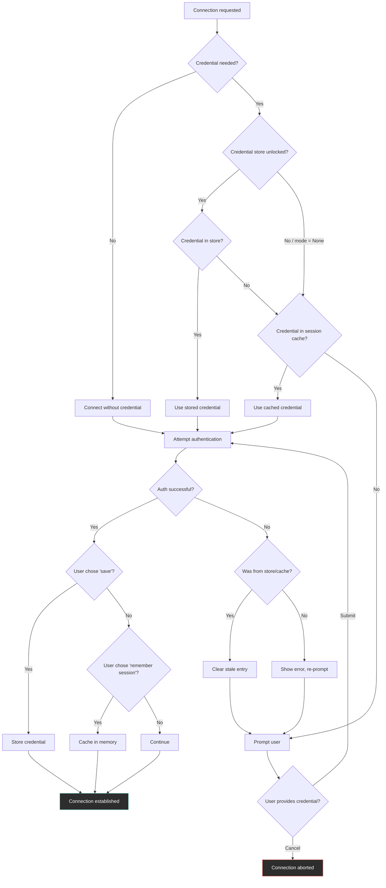
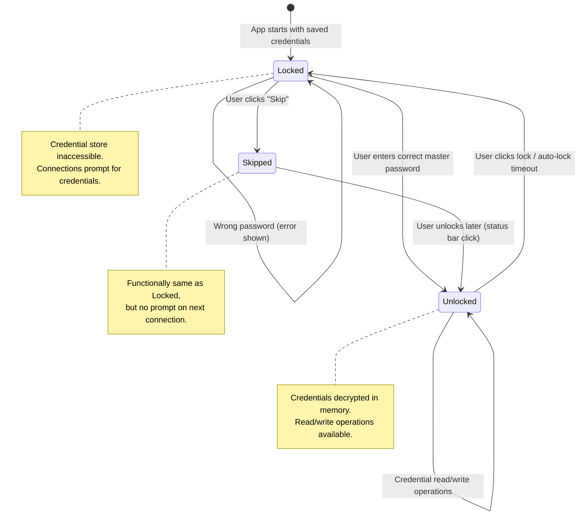
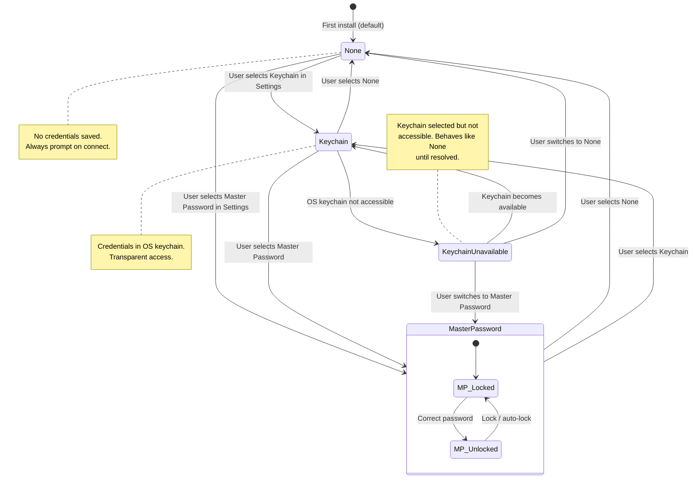
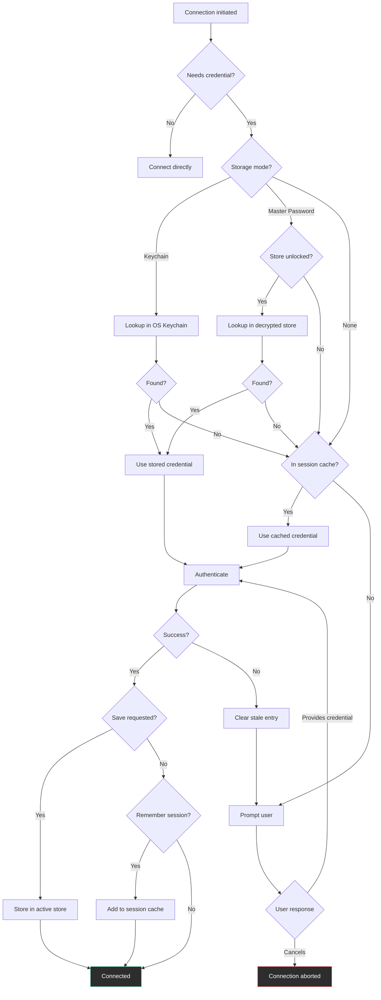
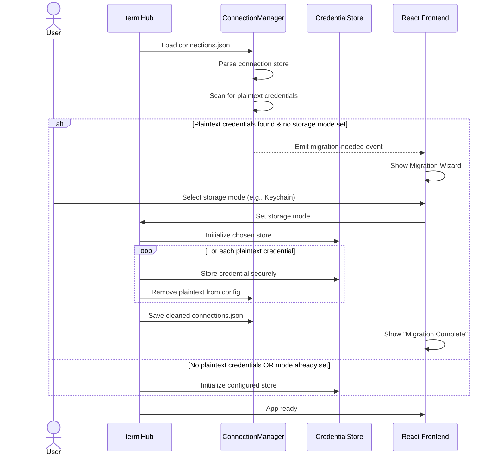
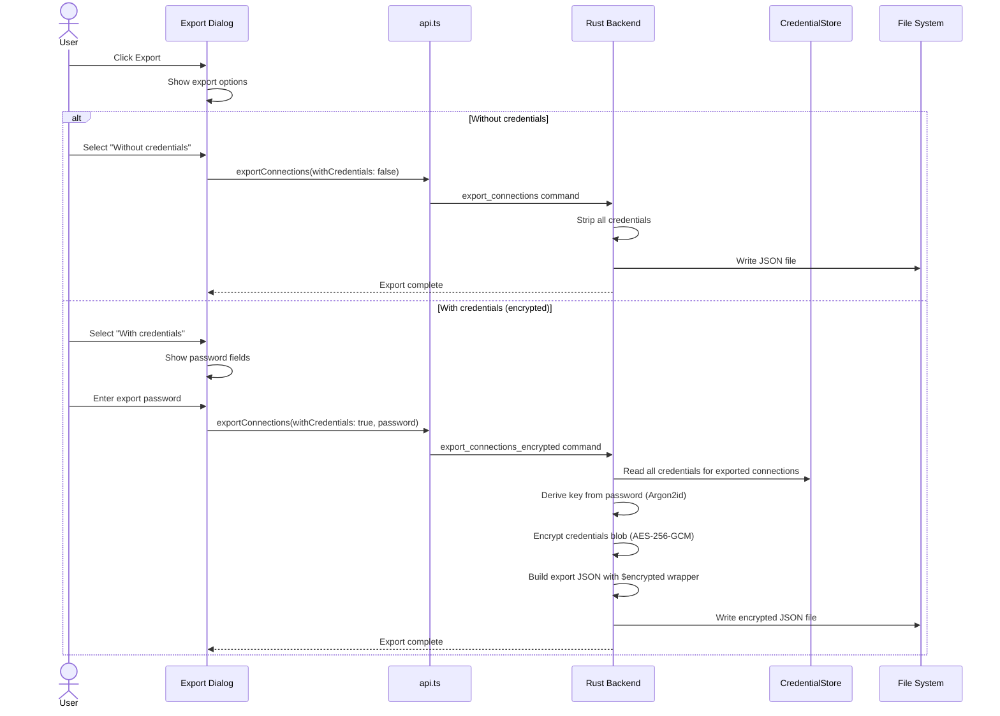

# Credential Encryption

**GitHub Issue:** [#25](https://github.com/armaxri/termiHub/issues/25)

---

## Overview

termiHub stores connection configurations in a JSON file (`connections.json`). Currently, credentials are handled with a simple safety measure: SSH passwords are stripped before persistence (ADR-6), so password-authenticated connections always prompt at connection time. However, this approach has several limitations:

1. **Key passphrases can end up in plaintext** — The SSH Key Passphrase concept (#121) introduces `keyPassphrase` and `saveKeyPassphrase` fields. When a user opts to save a passphrase, it is written as plaintext to `connections.json`. Anyone with filesystem access can read it.
2. **No way to save passwords securely** — Users who want password-authenticated SSH connections must re-enter their password every time. There is no middle ground between "not saved at all" and "saved in plaintext."
3. **Export includes no credential option** — The export/import flow always strips passwords. Users who want to transfer connections between machines must reconfigure credentials manually.
4. **No OS integration** — Modern operating systems provide secure credential storage (Windows Credential Manager, macOS Keychain, Linux Secret Service/GNOME Keyring/KWallet), but termiHub does not use them.

This concept designs a credential encryption system that addresses these gaps, providing secure-at-rest storage with multiple strategies to accommodate different platforms and portability needs.

### Goals

- **Secure at rest** — Credentials encrypted when stored on disk, decrypted only at connection time
- **OS keychain integration** — Use platform-native credential storage where available (Windows Credential Manager, macOS Keychain, Linux Secret Service)
- **Master password fallback** — For environments where OS keychains are unavailable (headless Linux, portable installs), offer a master-password-based encrypted store
- **Encrypted export/import** — Allow users to export connections with credentials, protected by a user-chosen password
- **Migration from plaintext** — Detect existing plaintext credentials and guide users to migrate them to secure storage
- **Backward compatibility** — Users who prefer the current behavior (no saved credentials) can continue without change

### Non-Goals

- SSH agent integration — the SSH agent manages its own credentials; this concept covers credentials termiHub stores directly
- Certificate-based authentication — a separate feature
- Cloud-based credential sync — out of scope; users can use encrypted export/import for cross-machine transfer
- Hardware security module (HSM) or FIDO2/WebAuthn integration — these are niche and can be added later as additional `CredentialStore` implementations
- Encrypting non-credential connection fields (host, username, etc.) — only secrets need encryption

### Relationship to SSH Key Passphrase Concept (#121)

The SSH Key Passphrase concept (#121) introduces the `keyPassphrase` and `saveKeyPassphrase` fields on `SshConfig`, along with a session-level in-memory passphrase cache. This credential encryption concept builds on that foundation:

- The passphrase session cache from #121 continues to work unchanged — it is an in-memory cache independent of persistent storage
- When `saveKeyPassphrase` is `true`, the passphrase is routed to the active credential store (Keychain, Master Password, or plaintext fallback) instead of being written as plaintext JSON
- The same `CredentialStore` abstraction handles both SSH passwords and key passphrases
- The credential resolution chain from #121 (config → session cache → prompt) gains a new first step: credential store → config → session cache → prompt

---

## UI Interface

### Security Settings Panel

A new **Security** category is added to the Settings panel, appearing between "Terminal" and "External Files" in the sidebar navigation.

```
┌──────────────────────────────────────────────────────────────────┐
│  Settings                                                        │
│─────────────────────────────────────────────────────────────────│
│  ┌──────────┐  ┌──────────────────────────────────────────────┐ │
│  │ General   │  │  Security                                    │ │
│  │ Appearance│  │                                              │ │
│  │ Terminal  │  │  Credential Storage                          │ │
│  │►Security  │  │  ──────────────────                          │ │
│  │ Ext Files │  │  Choose how termiHub stores saved            │ │
│  │ Advanced  │  │  credentials (passwords, key passphrases).   │ │
│  │           │  │                                              │ │
│  │           │  │  Storage Mode:                               │ │
│  │           │  │  ○ OS Keychain (Recommended)                 │ │
│  │           │  │    Uses Windows Credential Manager, macOS    │ │
│  │           │  │    Keychain, or Linux Secret Service.        │ │
│  │           │  │    Credentials are managed by the OS.        │ │
│  │           │  │                                              │ │
│  │           │  │  ○ Master Password                           │ │
│  │           │  │    Encrypts credentials with a password you  │ │
│  │           │  │    choose. Portable across machines.         │ │
│  │           │  │                                              │ │
│  │           │  │  ○ None                                      │ │
│  │           │  │    Credentials are not saved. You will be    │ │
│  │           │  │    prompted each time.                       │ │
│  │           │  │                                              │ │
│  │           │  │  Status: ✓ OS Keychain available             │ │
│  └──────────┘  └──────────────────────────────────────────────┘ │
└──────────────────────────────────────────────────────────────────┘
```

When the OS Keychain is not available (e.g., headless Linux without a secret service running), the status line changes:

```
│  Status: ⚠ OS Keychain not available (no secret service found) │
│          Master Password or None recommended.                   │
```

### Keychain Mode — Minimal UI

In Keychain mode, credential storage is transparent. No additional UI is needed beyond the status indicator in Security Settings. Credentials are stored and retrieved via the OS keychain automatically when the user saves a connection with "Save password" or "Save passphrase" checked.

### Master Password Mode — Unlock Dialog

When Master Password mode is active, the app prompts for the master password on startup if there are any saved credentials:

```
┌──────────────────────────────────────────────┐
│  Unlock Credential Store                     │
│──────────────────────────────────────────────│
│                                              │
│  termiHub has saved credentials that are     │
│  encrypted with your master password.        │
│                                              │
│  Master Password:  [                    ]    │
│                                              │
│  [Skip]                       [Unlock]       │
│                                              │
│  Skip: credentials will be unavailable       │
│  until you unlock.                           │
└──────────────────────────────────────────────┘
```

**Wrong password:**

```
┌──────────────────────────────────────────────┐
│  Unlock Credential Store                     │
│──────────────────────────────────────────────│
│                                              │
│  ✗ Incorrect master password.                │
│                                              │
│  Master Password:  [                    ]    │
│                                              │
│  [Skip]                       [Unlock]       │
└──────────────────────────────────────────────┘
```

### Master Password — Status Bar Indicator

When Master Password mode is active, a lock/unlock indicator appears in the bottom status bar:

```
┌──────────────────────────────────────────────────────────────┐
│  [🔓 Credentials unlocked]              termiHub v1.0.0     │
└──────────────────────────────────────────────────────────────┘
```

Clicking the indicator toggles lock state. When locked:

```
┌──────────────────────────────────────────────────────────────┐
│  [🔒 Credentials locked]                termiHub v1.0.0     │
└──────────────────────────────────────────────────────────────┘
```

### Master Password — Setup and Change

When first selecting Master Password mode in Security Settings:

```
┌──────────────────────────────────────────────┐
│  Set Master Password                         │
│──────────────────────────────────────────────│
│                                              │
│  Choose a master password to encrypt your    │
│  saved credentials. This password is never   │
│  stored — if you forget it, saved            │
│  credentials cannot be recovered.            │
│                                              │
│  New Password:      [                    ]   │
│  Confirm Password:  [                    ]   │
│                                              │
│  Password Strength:  ████████░░  Strong      │
│                                              │
│  [Cancel]                     [Set Password] │
└──────────────────────────────────────────────┘
```

Changing the master password (available in Security Settings when Master Password mode is active):

```
┌──────────────────────────────────────────────┐
│  Change Master Password                      │
│──────────────────────────────────────────────│
│                                              │
│  Current Password:  [                    ]   │
│  New Password:      [                    ]   │
│  Confirm Password:  [                    ]   │
│                                              │
│  Password Strength:  ████████░░  Strong      │
│                                              │
│  [Cancel]                   [Change Password]│
└──────────────────────────────────────────────┘
```

### Master Password — Auto-Lock Settings

Within the Security Settings panel, when Master Password mode is selected:

```
│  Auto-Lock                                    │
│  ──────────                                   │
│  Automatically lock the credential store      │
│  after a period of inactivity.                │
│                                               │
│  Auto-lock timeout:  [15 minutes       ▾]    │
│                                               │
│  Options: Never, 5 min, 15 min, 30 min, 1 hr │
```

### Connection Editor Changes

The connection editor's SSH settings adapt based on the active credential storage mode. The "Save password" and "Save passphrase" checkboxes now route to secure storage instead of plaintext:

**Keychain or Master Password mode active:**

```
┌─────────────────────────────────────────────────────────┐
│  Auth Method:  [Password         ▾]                     │
│                                                         │
│  Password:  [••••••••••••            ]                  │
│  ☑ Save password                                        │
│     Stored securely in OS Keychain.                     │
└─────────────────────────────────────────────────────────┘
```

```
┌─────────────────────────────────────────────────────────┐
│  Auth Method:  [SSH Key           ▾]                    │
│                                                         │
│  Key Path:     [~/.ssh/id_ed25519         ] [Browse]    │
│  🔒 OpenSSH private key (encrypted).                    │
│                                                         │
│  Key Passphrase:  [••••••••••••            ]            │
│  ☑ Save passphrase                                      │
│     Stored securely in OS Keychain.                     │
└─────────────────────────────────────────────────────────┘
```

**No secure storage mode (None):**

```
┌─────────────────────────────────────────────────────────┐
│  Auth Method:  [Password         ▾]                     │
│                                                         │
│  Password:  [                             ]             │
│  Password will be prompted on each connection.          │
│  Enable secure storage in Settings > Security to save.  │
└─────────────────────────────────────────────────────────┘
```

### Export Dialog

The existing export flow gains an option to include encrypted credentials:

```
┌──────────────────────────────────────────────────────────┐
│  Export Connections                                       │
│──────────────────────────────────────────────────────────│
│                                                          │
│  Export Mode:                                            │
│  ○ Without credentials (default)                         │
│    Connections only — passwords and passphrases are      │
│    excluded. Safe to share.                              │
│                                                          │
│  ○ With credentials (encrypted)                          │
│    Includes saved passwords and passphrases, encrypted   │
│    with a password you choose.                           │
│                                                          │
│──────────────────────────────────────────────────────────│
│                                                          │
│  Export Password:      [                           ]     │
│  Confirm Password:     [                           ]     │
│                                                          │
│  ⚠ This password is needed to import the credentials.    │
│    It is not stored anywhere.                            │
│                                                          │
│  [Cancel]                              [Export]          │
└──────────────────────────────────────────────────────────┘
```

The export password fields only appear when "With credentials (encrypted)" is selected.

### Import Dialog

When importing a file that contains encrypted credentials, the import flow detects the encryption and prompts:

```
┌──────────────────────────────────────────────────────────┐
│  Import Connections                                      │
│──────────────────────────────────────────────────────────│
│                                                          │
│  File: my_connections.json                               │
│  Connections found: 12                                   │
│  🔒 This file contains encrypted credentials.            │
│                                                          │
│  Enter the password used when exporting:                 │
│                                                          │
│  Password:  [                                      ]     │
│                                                          │
│  ☐ Import without credentials                            │
│    Skip encrypted credentials and import connections     │
│    only.                                                 │
│                                                          │
│  [Cancel]                              [Import]          │
└──────────────────────────────────────────────────────────┘
```

If the password is wrong:

```
│  ✗ Incorrect password. Credentials could not be          │
│    decrypted. Try again or import without credentials.   │
```

### Migration Wizard

On first launch after the credential encryption feature is available, if existing plaintext credentials are detected (e.g., `keyPassphrase` values in `connections.json`), a one-time migration wizard is shown:

```
┌──────────────────────────────────────────────────────────┐
│  Secure Your Credentials                                 │
│──────────────────────────────────────────────────────────│
│                                                          │
│  termiHub found saved credentials in plaintext:          │
│                                                          │
│    • 2 SSH key passphrases                               │
│                                                          │
│  Choose how to secure them:                              │
│                                                          │
│  ○ OS Keychain (Recommended)                             │
│    Move credentials to Windows Credential Manager.       │
│    They will be removed from the connection file.        │
│                                                          │
│  ○ Master Password                                       │
│    Encrypt credentials with a password you choose.       │
│    Portable across machines.                             │
│                                                          │
│  ○ Keep as-is                                            │
│    Leave credentials in plaintext. You can migrate       │
│    later in Settings > Security.                         │
│                                                          │
│  [Migrate]                                               │
└──────────────────────────────────────────────────────────┘
```

After migration:

```
┌──────────────────────────────────────────────────────────┐
│  Migration Complete                                      │
│──────────────────────────────────────────────────────────│
│                                                          │
│  ✓ 2 credentials moved to OS Keychain.                   │
│  ✓ Plaintext credentials removed from connection file.   │
│                                                          │
│  You can change your credential storage mode anytime     │
│  in Settings > Security.                                 │
│                                                          │
│  [Done]                                                  │
└──────────────────────────────────────────────────────────┘
```

---

## General Handling

### Credential Resolution Chain

When a connection requires a credential (password or key passphrase), the backend resolves it through a priority chain:



The resolution order is:
1. **Credential store** (Keychain or Master Password store) — checked first if the store is unlocked
2. **Session cache** (in-memory, from #121) — checked next
3. **User prompt** — shown as last resort

### Three Storage Modes

| Mode | Backend | Portability | Requires | Security Level |
|------|---------|-------------|----------|----------------|
| **OS Keychain** | Windows Credential Manager, macOS Keychain, Linux Secret Service | Per-machine | OS credential service | Highest — OS-managed |
| **Master Password** | Argon2id KDF + AES-256-GCM encrypted file | Portable (copy config dir) | User remembers password | High — user-chosen entropy |
| **None** | No persistence | N/A | Nothing | Credentials not saved |

### OS Keychain Mode

- Uses the `keyring` crate, which abstracts over Windows Credential Manager, macOS Keychain, and Linux Secret Service (D-Bus)
- Each credential is stored as a separate entry, keyed by `termihub:<connection_id>:<credential_type>` (e.g., `termihub:conn-abc123:password`, `termihub:conn-abc123:key_passphrase`)
- The service name is `termihub`
- **Storing**: when a connection is saved with "Save password/passphrase" checked, the credential is written to the keychain and excluded from `connections.json`
- **Retrieving**: at connection time, the credential is looked up from the keychain by connection ID
- **Deleting**: when a connection is deleted, its keychain entries are removed
- **Keychain unavailability**: if the keychain is not accessible (locked, permission denied, no service), the operation fails gracefully with a user-visible warning. The user can unlock the OS keychain manually or switch to Master Password mode.

### Master Password Mode

The Master Password mode encrypts all saved credentials into a single file (`credentials.enc`) in the config directory.

**Key derivation:**
- Algorithm: Argon2id (memory-hard, resistant to GPU/ASIC attacks)
- Parameters: 64 MB memory, 3 iterations, 1 parallelism (tuned for ~0.5s on modern hardware)
- Salt: 32 random bytes, generated once and stored alongside the encrypted data
- Output: 256-bit key

**Encryption:**
- Algorithm: AES-256-GCM (authenticated encryption)
- Nonce: 12 random bytes, generated per encryption operation
- Associated data: version byte (for future format changes)
- The encrypted file contains all credentials as a single JSON object, encrypted as one blob

**File format (`credentials.enc`):**

```json
{
  "version": 1,
  "kdf": {
    "algorithm": "argon2id",
    "salt": "<base64>",
    "memory_cost": 65536,
    "time_cost": 3,
    "parallelism": 1
  },
  "nonce": "<base64>",
  "data": "<base64 of AES-256-GCM ciphertext>"
}
```

The decrypted `data` is a JSON object mapping credential keys to values:

```json
{
  "conn-abc123:password": "my-ssh-password",
  "conn-abc123:key_passphrase": "my-key-passphrase",
  "conn-def456:password": "another-password"
}
```

**Lock/unlock lifecycle:**



**Auto-lock:**
- Configurable timeout (default: 15 minutes of inactivity)
- Inactivity = no terminal input, no mouse movement in the app window
- When locked, the in-memory decrypted credentials are securely cleared
- Connections that are already established remain connected (credentials are no longer needed after authentication)
- New connections or reconnections will prompt for the master password

### Session Lock/Unlock Lifecycle

```mermaid
sequenceDiagram
    actor User
    participant UI as React Frontend
    participant Store as Zustand Store
    participant API as api.ts
    participant BE as Rust Backend
    participant CS as CredentialStore

    Note over UI,CS: App startup — Master Password mode with saved credentials

    BE->>BE: Load settings, detect master password mode
    BE->>BE: Check credentials.enc exists & non-empty
    BE-->>UI: Emit credential-store-locked event
    UI->>Store: Set credentialStoreLocked = true
    UI->>UI: Show UnlockDialog

    User->>UI: Enter master password
    UI->>API: unlockCredentialStore(password)
    API->>BE: unlock_credential_store command
    BE->>CS: Decrypt credentials.enc with password

    alt Correct password
        CS-->>BE: Decrypted credentials map
        BE->>BE: Hold decrypted map in memory
        BE-->>UI: Success
        UI->>Store: Set credentialStoreLocked = false
        UI->>UI: Dismiss dialog
    else Wrong password
        CS-->>BE: Decryption error
        BE-->>UI: Error: incorrect password
        UI->>UI: Show error in dialog
    end

    Note over UI,CS: Later — auto-lock timeout

    BE->>BE: Inactivity timer expires
    BE->>BE: Clear in-memory credentials
    BE-->>UI: Emit credential-store-locked event
    UI->>Store: Set credentialStoreLocked = true
    UI->>UI: Show lock indicator in status bar
```



### External Connection Files

External connection files (configured in Settings > External Files) follow the same credential handling rules:

- When loading external connections, `strip_ssh_password()` behavior is replaced by `prepare_for_storage()` which routes credentials to the active store
- Credentials from external files are stored in the same credential store (keyed by connection ID), not in the external file itself
- When exporting to an external file, credentials are excluded by default (current behavior preserved)
- External file connections can opt into credential saving the same way main connections do

### Edge Cases

- **Keychain access revoked mid-session**: If the OS keychain becomes inaccessible after app start (e.g., keychain locked, screen lock on macOS), credential lookups fail gracefully. Existing connections remain active. New connections fall back to prompting.
- **Master password forgotten**: There is no recovery mechanism. The user must delete `credentials.enc` and re-enter all credentials. A warning about this is shown during master password setup.
- **Corrupted encrypted data**: If `credentials.enc` is corrupted (invalid JSON, truncated ciphertext), the app shows an error and offers to reset the credential store (delete the file and start fresh).
- **Switching storage modes**: When switching from one mode to another (e.g., Keychain → Master Password), existing credentials are migrated: read from the old store, written to the new store, then removed from the old store. If the old store is inaccessible, credentials must be re-entered.
- **Connection ID collision on import**: Imported connections that have the same ID as existing connections are skipped (existing behavior). Their credentials are also skipped to avoid overwriting.
- **Multiple termiHub instances**: The credential store uses file locking (`credentials.enc`) and keychain operations are atomic. Two instances running simultaneously will not corrupt the store, though they may see stale data.
- **App crash during migration**: Migration is performed as old-store-read → new-store-write → old-store-delete. If the app crashes after write but before delete, credentials exist in both stores. On next launch, the migration detects this and completes the cleanup.

---

## States & Sequences

### Credential Storage Mode State Machine



### Connection Credential Resolution Flowchart



### App Startup with Migration Sequence



### Export with Encryption Sequence



### Import with Decryption Sequence

```mermaid
sequenceDiagram
    actor User
    participant UI as Import Dialog
    participant API as api.ts
    participant BE as Rust Backend
    participant CS as CredentialStore
    participant CM as ConnectionManager

    User->>UI: Select import file
    UI->>API: previewImport(filePath)
    API->>BE: preview_import command
    BE->>BE: Parse JSON, detect $encrypted field

    alt File has encrypted credentials
        BE-->>UI: Preview with encrypted flag
        UI->>UI: Show password prompt
        User->>UI: Enter password
        UI->>API: importConnections(filePath, password)
        API->>BE: import_connections command
        BE->>BE: Derive key from password (Argon2id)
        BE->>BE: Decrypt credentials blob

        alt Decryption succeeds
            BE->>CM: Import connections
            BE->>CS: Store decrypted credentials
            BE-->>UI: Import success (N connections, M credentials)
        else Decryption fails
            BE-->>UI: Error: incorrect password
            UI->>UI: Show error, offer retry or skip
        end
    else No encrypted credentials
        BE-->>UI: Preview without encrypted flag
        User->>UI: Confirm import
        UI->>API: importConnections(filePath)
        API->>BE: import_connections command
        BE->>CM: Import connections (no credentials)
        BE-->>UI: Import success
    end
```



### Keychain Fallback Flowchart

```mermaid
flowchart TD
    A[Keychain operation requested] --> B{Keychain available?}
    B -->|Yes| C[Execute keychain operation]
    C --> D{Operation succeeded?}
    D -->|Yes| E[Return result]
    D -->|No| F{Error type?}

    F -->|Permission denied| G[Show OS permission dialog hint]
    F -->|Keychain locked| H[Prompt user to unlock OS keychain]
    F -->|Item not found| I[Return None — credential not stored]
    F -->|Other error| J[Log error, return None]

    B -->|No| K{First time detecting unavailability?}
    K -->|Yes| L[Show notification: Keychain unavailable]
    L --> M[Suggest switching to Master Password]
    K -->|No| N[Silent fallback]

    G --> O[Fall back to prompt]
    H --> O
    I --> O
    J --> O
    M --> O
    N --> O

    style E fill:#2d2d2d,stroke:#4ec9b0,color:#fff
    style O fill:#2d2d2d,stroke:#cca700,color:#fff
```



### Storage Mode Switch Sequence

```mermaid
sequenceDiagram
    actor User
    participant UI as Security Settings
    participant API as api.ts
    participant BE as Rust Backend
    participant OldCS as Old CredentialStore
    participant NewCS as New CredentialStore

    User->>UI: Switch storage mode (e.g., Keychain → Master Password)
    UI->>UI: Show confirmation dialog
    User->>UI: Confirm switch

    UI->>API: switchCredentialStore(newMode, masterPassword?)
    API->>BE: switch_credential_store command

    BE->>OldCS: Read all stored credentials

    alt Old store accessible
        OldCS-->>BE: All credentials
        BE->>NewCS: Initialize new store

        loop For each credential
            BE->>NewCS: Store credential
        end

        BE->>OldCS: Remove all credentials
        BE->>BE: Update settings (storage mode)
        BE-->>UI: Switch complete (N credentials migrated)
    else Old store not accessible
        OldCS-->>BE: Error
        BE-->>UI: Warning: old credentials not accessible
        UI->>UI: Show warning — credentials must be re-entered
        BE->>NewCS: Initialize new store (empty)
        BE->>BE: Update settings (storage mode)
    end
```



---

## Preliminary Implementation Details

Based on the current project architecture at the time of concept creation. The codebase may evolve between concept creation and implementation.

### 1. New Dependencies

**Rust (`src-tauri/Cargo.toml`):**

| Crate | Purpose | Version |
|-------|---------|---------|
| `keyring` | Cross-platform keychain abstraction (Windows Credential Manager, macOS Keychain, Linux Secret Service via D-Bus) | ^3 |
| `argon2` | Argon2id key derivation for master password mode | ^0.5 |
| `aes-gcm` | AES-256-GCM authenticated encryption for master password mode | ^0.10 |
| `rand` | Cryptographically secure random salt/nonce generation (already a transitive dep) | ^0.8 |
| `base64` | Encoding encrypted data for JSON storage | ^0.22 |
| `zeroize` | Secure memory clearing for passwords and keys | ^1 |

No new frontend dependencies are needed — the UI changes use existing React patterns and components.

### 2. New Module: `src-tauri/src/credential/`

```
src-tauri/src/credential/
  mod.rs              — CredentialStore trait, CredentialKey type, factory function
  keychain.rs         — KeychainStore implementation
  master_password.rs  — MasterPasswordStore implementation
  null.rs             — NullStore implementation (current behavior)
  types.rs            — CredentialStoreStatus, StorageMode enum
```

**`CredentialStore` trait:**

```rust
use anyhow::Result;

/// Identifies a specific credential within a connection.
pub struct CredentialKey {
    pub connection_id: String,
    pub credential_type: CredentialType,
}

pub enum CredentialType {
    Password,
    KeyPassphrase,
}

/// Status of the credential store.
pub enum CredentialStoreStatus {
    /// Store is ready for read/write operations.
    Unlocked,
    /// Store exists but requires a master password to unlock.
    Locked,
    /// Store is not configured (NullStore, or Keychain unavailable).
    Unavailable,
}

/// Abstraction over credential storage backends.
pub trait CredentialStore: Send + Sync {
    /// Retrieve a credential. Returns None if not found.
    fn get(&self, key: &CredentialKey) -> Result<Option<String>>;

    /// Store a credential, overwriting any existing value.
    fn set(&self, key: &CredentialKey, value: &str) -> Result<()>;

    /// Remove a credential.
    fn remove(&self, key: &CredentialKey) -> Result<()>;

    /// Remove all credentials for a given connection ID.
    fn remove_all_for_connection(&self, connection_id: &str) -> Result<()>;

    /// List all credential keys in the store.
    fn list_keys(&self) -> Result<Vec<CredentialKey>>;

    /// Get the current store status.
    fn status(&self) -> CredentialStoreStatus;
}
```

**`KeychainStore` implementation:**

```rust
use keyring::Entry;

pub struct KeychainStore;

impl KeychainStore {
    const SERVICE: &'static str = "termihub";

    fn entry_for(key: &CredentialKey) -> Result<Entry> {
        let username = format!("{}:{}", key.connection_id, key.credential_type.as_str());
        Entry::new(Self::SERVICE, &username)
            .map_err(|e| anyhow::anyhow!("Keychain entry error: {}", e))
    }
}

impl CredentialStore for KeychainStore {
    fn get(&self, key: &CredentialKey) -> Result<Option<String>> {
        match Self::entry_for(key)?.get_password() {
            Ok(pw) => Ok(Some(pw)),
            Err(keyring::Error::NoEntry) => Ok(None),
            Err(e) => Err(anyhow::anyhow!("Keychain read error: {}", e)),
        }
    }

    fn set(&self, key: &CredentialKey, value: &str) -> Result<()> {
        Self::entry_for(key)?.set_password(value)
            .map_err(|e| anyhow::anyhow!("Keychain write error: {}", e))
    }

    fn remove(&self, key: &CredentialKey) -> Result<()> {
        match Self::entry_for(key)?.delete_credential() {
            Ok(()) | Err(keyring::Error::NoEntry) => Ok(()),
            Err(e) => Err(anyhow::anyhow!("Keychain delete error: {}", e)),
        }
    }
    // ... list_keys and status ...
}
```

**`MasterPasswordStore` implementation outline:**

```rust
use std::collections::HashMap;
use std::sync::RwLock;
use aes_gcm::{Aes256Gcm, KeyInit, Nonce};
use aes_gcm::aead::Aead;
use argon2::Argon2;
use zeroize::Zeroize;

pub struct MasterPasswordStore {
    file_path: PathBuf,
    /// Decrypted credentials, present only when unlocked.
    credentials: RwLock<Option<HashMap<String, String>>>,
    /// Derived encryption key, present only when unlocked.
    derived_key: RwLock<Option<Vec<u8>>>,
}

impl MasterPasswordStore {
    /// Attempt to unlock with the given master password.
    pub fn unlock(&self, password: &str) -> Result<()> {
        let file_data = std::fs::read_to_string(&self.file_path)?;
        let envelope: EncryptedEnvelope = serde_json::from_str(&file_data)?;

        let salt = base64_decode(&envelope.kdf.salt)?;
        let mut key = [0u8; 32];
        Argon2::default().hash_password_into(
            password.as_bytes(), &salt, &mut key
        )?;

        let cipher = Aes256Gcm::new_from_slice(&key)?;
        let nonce = Nonce::from_slice(&base64_decode(&envelope.nonce)?);
        let ciphertext = base64_decode(&envelope.data)?;
        let plaintext = cipher.decrypt(nonce, ciphertext.as_ref())?;

        let credentials: HashMap<String, String> =
            serde_json::from_slice(&plaintext)?;

        *self.credentials.write().unwrap() = Some(credentials);
        *self.derived_key.write().unwrap() = Some(key.to_vec());
        key.zeroize();
        Ok(())
    }

    /// Lock the store, clearing decrypted data from memory.
    pub fn lock(&self) {
        if let Ok(mut creds) = self.credentials.write() {
            if let Some(ref mut map) = *creds {
                for value in map.values_mut() {
                    value.zeroize();
                }
            }
            *creds = None;
        }
        if let Ok(mut key) = self.derived_key.write() {
            if let Some(ref mut k) = *key {
                k.zeroize();
            }
            *key = None;
        }
    }
}
```

**`NullStore` implementation:**

```rust
/// No-op credential store. Always returns None for lookups.
/// Matches current behavior where credentials are never saved.
pub struct NullStore;

impl CredentialStore for NullStore {
    fn get(&self, _key: &CredentialKey) -> Result<Option<String>> { Ok(None) }
    fn set(&self, _key: &CredentialKey, _value: &str) -> Result<()> { Ok(()) }
    fn remove(&self, _key: &CredentialKey) -> Result<()> { Ok(()) }
    fn remove_all_for_connection(&self, _id: &str) -> Result<()> { Ok(()) }
    fn list_keys(&self) -> Result<Vec<CredentialKey>> { Ok(Vec::new()) }
    fn status(&self) -> CredentialStoreStatus { CredentialStoreStatus::Unavailable }
}
```

### 3. Settings Changes

**Rust — `AppSettings` gains:**

```rust
/// Credential storage mode: "keychain", "master_password", or "none".
#[serde(default, skip_serializing_if = "Option::is_none")]
pub credential_storage_mode: Option<String>,

/// Auto-lock timeout in minutes for master password mode. None = never.
#[serde(default, skip_serializing_if = "Option::is_none")]
pub credential_auto_lock_minutes: Option<u32>,
```

**TypeScript — `AppSettings` gains:**

```typescript
credentialStorageMode?: "keychain" | "masterPassword" | "none";
credentialAutoLockMinutes?: number;
```

### 4. Connection Config Changes

**Rust — `SshConfig` gains:**

```rust
/// Whether to persist the password to the credential store.
#[serde(default, skip_serializing_if = "Option::is_none")]
pub save_password: Option<bool>,
```

This is in addition to the `key_passphrase`, `save_key_passphrase` fields from #121.

**Rust — `RemoteAgentConfig` gains:**

```rust
/// Whether to persist the password to the credential store.
#[serde(default, skip_serializing_if = "Option::is_none")]
pub save_password: Option<bool>,
```

**TypeScript — mirror in corresponding interfaces:**

```typescript
// SshConfig
savePassword?: boolean;

// RemoteAgentConfig
savePassword?: boolean;
```

### 5. ConnectionManager Changes

The `strip_ssh_password()` function is replaced by `prepare_for_storage()`:

```rust
/// Prepare a connection for persistence.
/// Routes credentials to the active credential store and strips them
/// from the connection config so they are not written to connections.json.
pub(crate) fn prepare_for_storage(
    mut connection: SavedConnection,
    store: &dyn CredentialStore,
) -> Result<SavedConnection> {
    if let ConnectionConfig::Ssh(ref mut ssh_cfg) = connection.config {
        // Handle password
        if let Some(ref password) = ssh_cfg.password {
            if ssh_cfg.save_password == Some(true) {
                store.set(
                    &CredentialKey::new(&connection.id, CredentialType::Password),
                    password,
                )?;
            }
            ssh_cfg.password = None; // Always strip from config file
        }

        // Handle key passphrase (from #121)
        if let Some(ref passphrase) = ssh_cfg.key_passphrase {
            if ssh_cfg.save_key_passphrase == Some(true) {
                store.set(
                    &CredentialKey::new(&connection.id, CredentialType::KeyPassphrase),
                    passphrase,
                )?;
            }
            ssh_cfg.key_passphrase = None; // Always strip from config file
        }
    }
    Ok(connection)
}
```

Similarly, `prepare_agent_for_storage()` replaces `strip_agent_password()`.

### 6. Tauri Commands

New commands in `src-tauri/src/commands/`:

```rust
/// Get the current credential store status.
#[tauri::command]
pub fn get_credential_store_status(
    credential_store: State<'_, Arc<dyn CredentialStore>>,
) -> CredentialStoreStatus {
    credential_store.status()
}

/// Unlock the master password credential store.
#[tauri::command]
pub async fn unlock_credential_store(
    password: String,
    credential_store: State<'_, Arc<Mutex<MasterPasswordStore>>>,
) -> Result<(), String> {
    credential_store.lock().unwrap().unlock(&password)
        .map_err(|e| e.to_string())
}

/// Lock the credential store (clears decrypted data from memory).
#[tauri::command]
pub fn lock_credential_store(
    credential_store: State<'_, Arc<Mutex<MasterPasswordStore>>>,
) {
    credential_store.lock().unwrap().lock();
}

/// Change the master password. Requires the current password.
#[tauri::command]
pub async fn change_master_password(
    current_password: String,
    new_password: String,
    credential_store: State<'_, Arc<Mutex<MasterPasswordStore>>>,
) -> Result<(), String> {
    let store = credential_store.lock().unwrap();
    store.verify_password(&current_password)?;
    store.reencrypt(&new_password)
        .map_err(|e| e.to_string())
}

/// Switch credential storage mode, migrating credentials.
#[tauri::command]
pub async fn switch_credential_store(
    new_mode: String,
    master_password: Option<String>,
    // ... state handles ...
) -> Result<MigrationResult, String> {
    // Read from old store, write to new store, update settings
}
```

### 7. Frontend Components

**New components:**

| Component | Location | Purpose |
|-----------|----------|---------|
| `SecuritySettings.tsx` | `src/components/Settings/` | Security settings panel with storage mode selection |
| `UnlockDialog.tsx` | `src/components/` | Master password unlock modal |
| `MasterPasswordSetup.tsx` | `src/components/` | Setup/change master password dialog |
| `CredentialStoreIndicator.tsx` | `src/components/` | Status bar lock/unlock indicator |

**Modified components:**

| Component | Changes |
|-----------|---------|
| `SettingsPanel.tsx` | Add "Security" category to navigation |
| `SettingsNav.tsx` | Add Security entry |
| `SshSettings.tsx` | Update "Save password" / "Save passphrase" hint text based on active store |
| `AgentSettings.tsx` | Same credential hint updates |
| `ConnectionEditor.tsx` | Pass credential store status to SSH/Agent settings |
| `App.tsx` | Listen for credential store events, render `UnlockDialog` |

**Store changes (`appStore.ts`):**

```typescript
// New state
credentialStoreStatus: "unlocked" | "locked" | "unavailable";
credentialStorageMode: "keychain" | "masterPassword" | "none";

// New actions
setCredentialStoreStatus: (status: string) => void;
setCredentialStorageMode: (mode: string) => void;
```

### 8. Encrypted Export Format

The exported JSON file gains an optional `$encrypted` section when credentials are included:

```json
{
  "version": "1",
  "folders": [...],
  "connections": [...],
  "$encrypted": {
    "version": 1,
    "kdf": {
      "algorithm": "argon2id",
      "salt": "<base64>",
      "memoryCost": 65536,
      "timeCost": 3,
      "parallelism": 1
    },
    "nonce": "<base64>",
    "data": "<base64 of AES-256-GCM ciphertext>"
  }
}
```

The `data` field, when decrypted, contains a JSON object mapping `connectionId:credentialType` to values:

```json
{
  "conn-abc123:password": "my-password",
  "conn-def456:key_passphrase": "my-passphrase"
}
```

This format allows the connections themselves to remain readable even when credentials are encrypted, so a tool that doesn't support the encryption format can still import the structural data.

### 9. Migration Detection

On startup, `ConnectionManager::new()` is enhanced to detect plaintext credentials:

```rust
pub fn new(app_handle: &AppHandle) -> Result<Self> {
    let storage = ConnectionStorage::new(app_handle)?;
    let store = storage.load()?;

    // Check for plaintext credentials
    let has_plaintext = store.connections.iter().any(|conn| {
        if let ConnectionConfig::Ssh(ref ssh) = conn.config {
            ssh.password.is_some() || ssh.key_passphrase.is_some()
        } else {
            false
        }
    }) || store.agents.iter().any(|a| a.config.password.is_some());

    let settings = settings_storage.load()?;
    let needs_migration = has_plaintext
        && settings.credential_storage_mode.is_none();

    // If migration needed, emit event for frontend to show wizard
    if needs_migration {
        app_handle.emit("credential-migration-needed", MigrationInfo {
            plaintext_password_count: /* count */,
            plaintext_passphrase_count: /* count */,
        })?;
    }

    // ... rest of initialization ...
}
```

### 10. Keychain Key Naming Convention

Keychain entries follow a consistent naming pattern:

| Field | Value |
|-------|-------|
| **Service** | `termihub` |
| **Username** (key) | `{connection_id}:{credential_type}` |

Examples:
- `termihub` / `conn-abc123:password`
- `termihub` / `conn-abc123:key_passphrase`
- `termihub` / `agent-def456:password`
- `termihub` / `agent-def456:key_passphrase`

This naming ensures uniqueness and allows termiHub to enumerate its own entries without conflicting with other applications.

### 11. File Changes Summary

| File | Change |
|------|--------|
| `src-tauri/Cargo.toml` | Add `keyring`, `argon2`, `aes-gcm`, `base64`, `zeroize` dependencies |
| `src-tauri/src/credential/mod.rs` | New: `CredentialStore` trait, factory, `CredentialKey` |
| `src-tauri/src/credential/keychain.rs` | New: `KeychainStore` implementation |
| `src-tauri/src/credential/master_password.rs` | New: `MasterPasswordStore` implementation |
| `src-tauri/src/credential/null.rs` | New: `NullStore` implementation |
| `src-tauri/src/credential/types.rs` | New: `CredentialStoreStatus`, `StorageMode`, envelopes |
| `src-tauri/src/main.rs` | Register credential store as Tauri managed state |
| `src-tauri/src/connection/manager.rs` | Replace `strip_ssh_password` with `prepare_for_storage`; add migration detection |
| `src-tauri/src/connection/settings.rs` | Add `credential_storage_mode`, `credential_auto_lock_minutes` |
| `src-tauri/src/terminal/backend.rs` | Add `save_password` to `SshConfig` and `RemoteAgentConfig` |
| `src-tauri/src/commands/` | New: `unlock_credential_store`, `lock_credential_store`, `get_credential_store_status`, `change_master_password`, `switch_credential_store` |
| `src-tauri/src/events/` | New: `credential-store-locked`, `credential-store-unlocked`, `credential-migration-needed` events |
| `src/types/terminal.ts` | Add `savePassword` to `SshConfig` and `RemoteAgentConfig` |
| `src/services/api.ts` | Add credential store commands |
| `src/services/events.ts` | Add credential store event types and listeners |
| `src/store/appStore.ts` | Add credential store state and actions |
| `src/components/Settings/SecuritySettings.tsx` | New: Security settings panel |
| `src/components/Settings/SettingsPanel.tsx` | Add Security category |
| `src/components/Settings/SettingsNav.tsx` | Add Security entry |
| `src/components/Settings/SshSettings.tsx` | Update credential save hints |
| `src/components/Settings/AgentSettings.tsx` | Update credential save hints |
| `src/components/UnlockDialog.tsx` | New: Master password unlock modal |
| `src/components/MasterPasswordSetup.tsx` | New: Setup/change master password dialog |
| `src/components/CredentialStoreIndicator.tsx` | New: Status bar indicator |
| `src/components/App.tsx` | Credential store event listeners, render UnlockDialog |

### 12. Implementation Order

The implementation is split into 7 PRs, ordered to build incrementally with each PR being independently shippable:

1. **`CredentialStore` trait + `NullStore`** — Extract current password-stripping behavior into the `CredentialStore` trait. `NullStore` replicates current behavior. All tests pass with no user-visible change. This PR establishes the abstraction that all subsequent PRs build on.

2. **`KeychainStore` implementation + Security Settings UI** — Add the `keyring` dependency and `KeychainStore`. Create the Security Settings panel with storage mode selection (Keychain / None). When Keychain is selected, credentials are stored in the OS keychain. Connection editor hints update to reflect the active mode.

3. **`MasterPasswordStore` implementation + unlock/lock UI** — Add `argon2`, `aes-gcm`, `zeroize` dependencies. Implement `MasterPasswordStore` with `credentials.enc` file. Add `UnlockDialog`, `MasterPasswordSetup`, and `CredentialStoreIndicator` components. Implement auto-lock timeout.

4. **Migration wizard** — Detect plaintext credentials on startup. Show the Migration Wizard to guide users to choose a storage mode and migrate existing credentials. Add migration event handling.

5. **Encrypted export/import** — Extend the export dialog with "With credentials (encrypted)" option. Extend the import flow to detect encrypted exports and prompt for the decryption password. Define the `$encrypted` JSON format.

6. **External connection files integration** — Update `prepare_for_storage` to handle external connection files. Ensure credentials from external files route to the same credential store.

7. **Polish: auto-lock timeout, status bar indicator, edge case handling** — Refine auto-lock behavior, improve error messages, handle concurrent access, keychain unavailability notifications, and comprehensive edge case testing.
