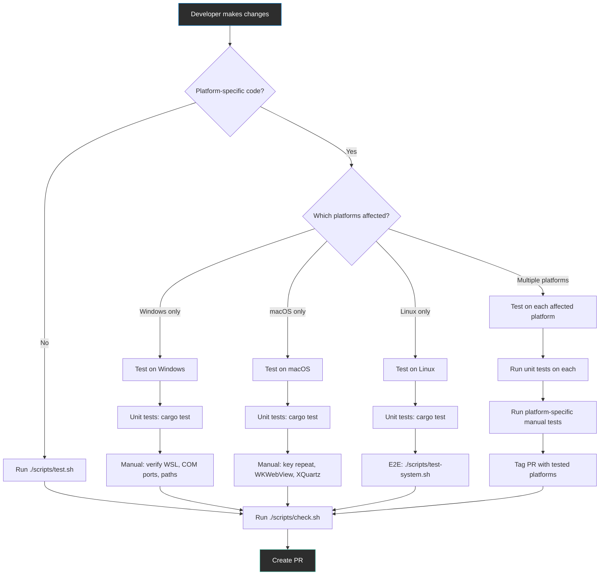
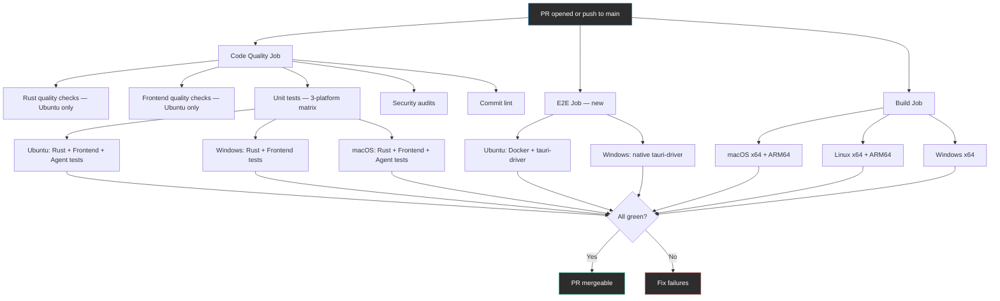
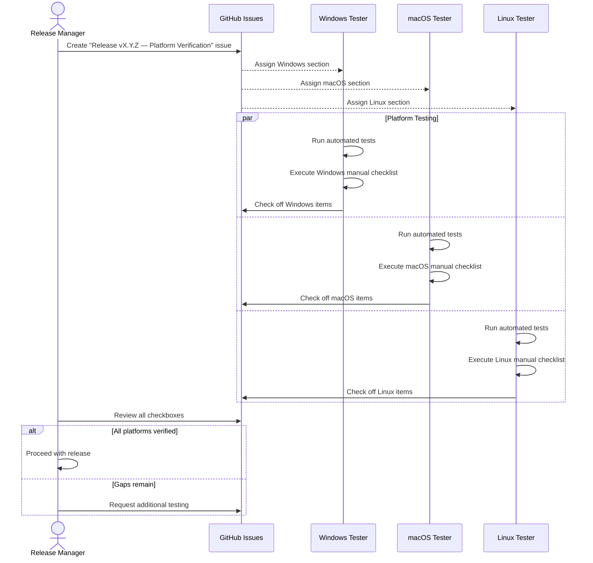
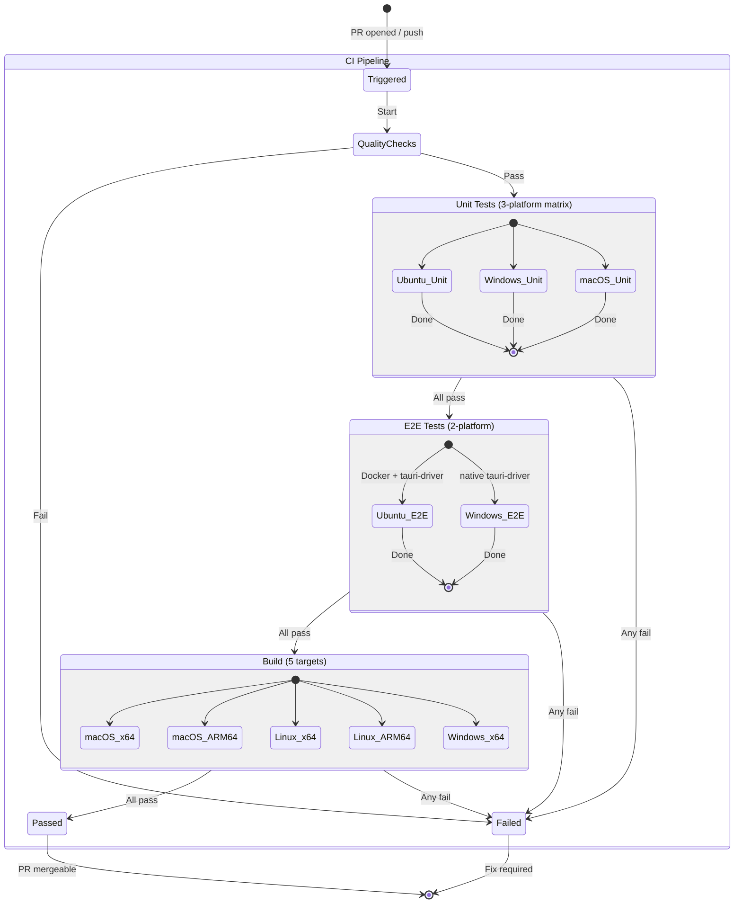
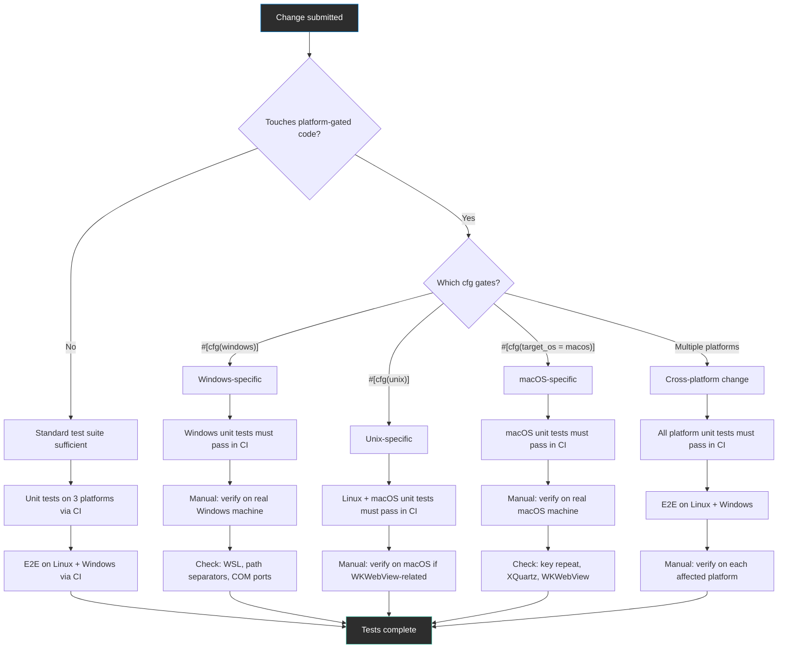
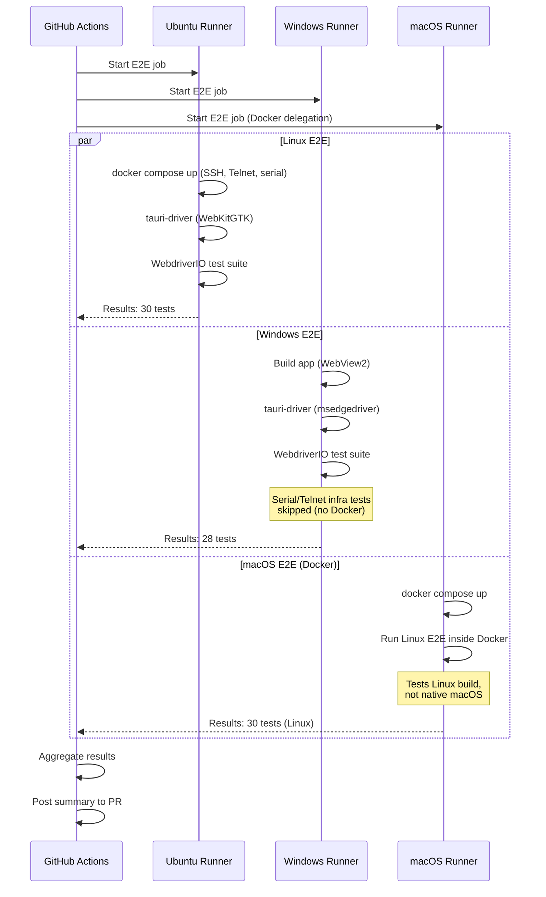
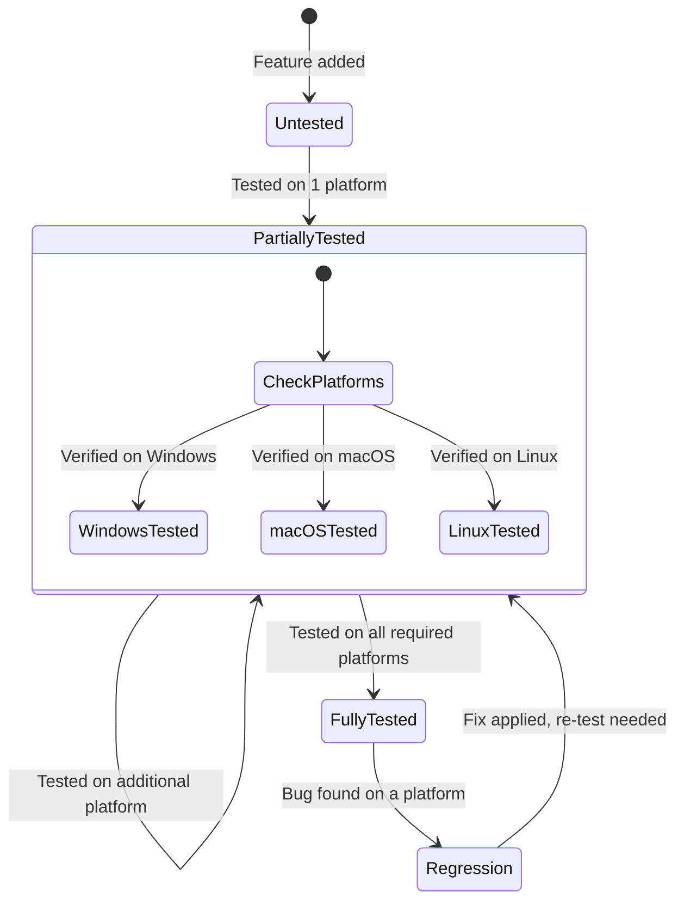
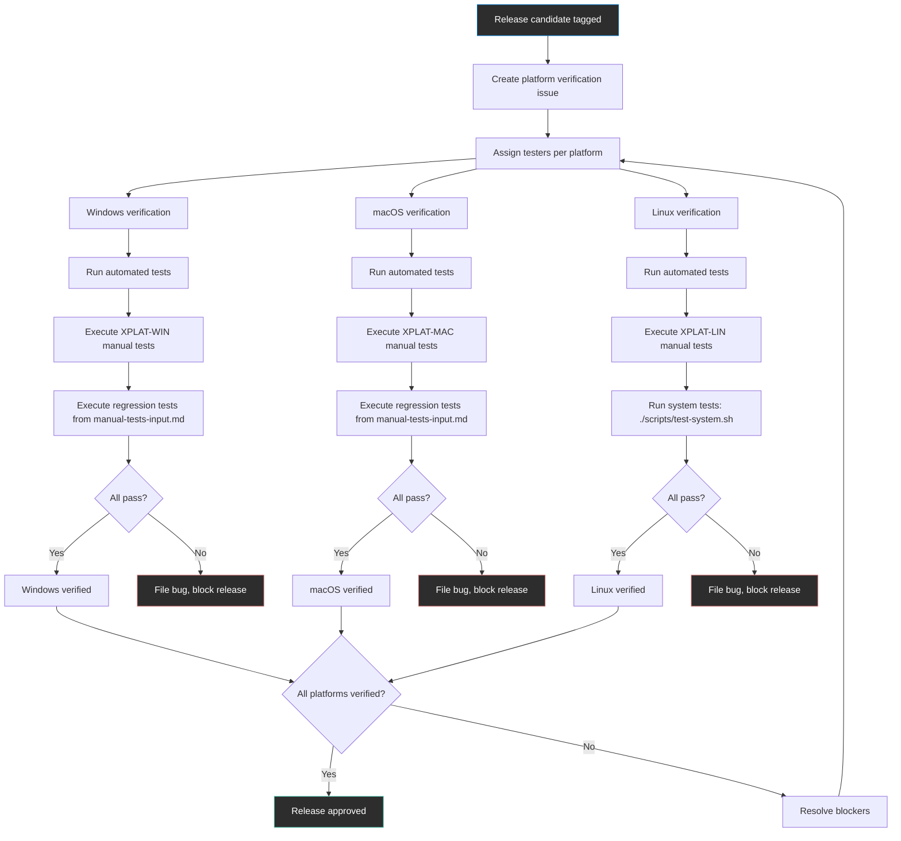
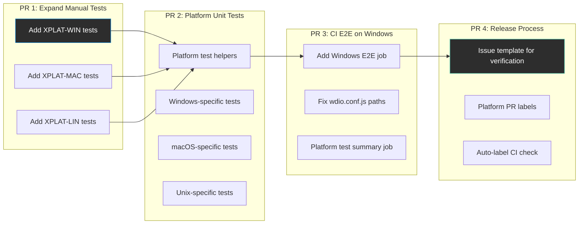
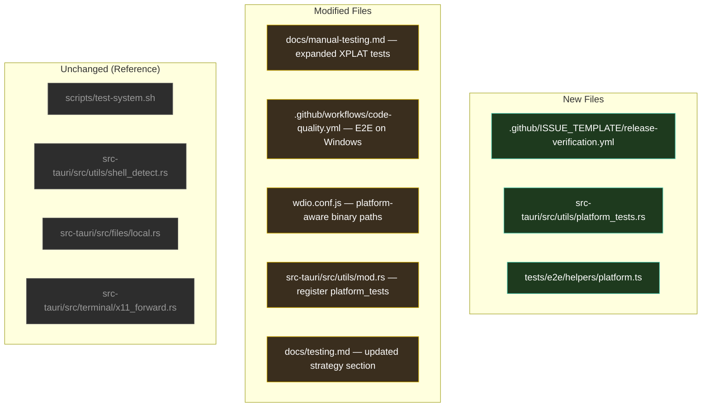

# Cross-Platform Testing

**GitHub Issue:** [#15](https://github.com/armaxri/termiHub/issues/15)

---

## Overview

termiHub is a cross-platform terminal hub that runs on Windows, macOS, and Linux. The Tauri 2 architecture — a Rust backend paired with a React/TypeScript frontend rendered in a platform-native WebView — means each platform introduces its own behavior differences, runtime quirks, and integration challenges. Platform-specific bugs have historically been among the hardest to catch and the most disruptive to users (e.g., SSH key paths breaking on Windows due to mixed path separators, shell detection launching WSL instead of PowerShell, WSL file browser showing "access denied" on drive-mounted paths).

Today, CI runs unit tests on all three platforms via a GitHub Actions matrix (`ubuntu-latest`, `windows-latest`, `macos-latest`), and builds are produced for five targets (macOS x64/ARM64, Linux x64/ARM64, Windows x64). However, several gaps remain:

- **E2E tests run only on Linux** (via Docker with `tauri-driver`). Windows E2E is technically supported by `tauri-driver` but not yet wired into CI. macOS has no native E2E support (ADR-5: no WKWebView driver).
- **Manual cross-platform tests are minimal** — only three tests (XPLAT-01 to XPLAT-03) exist in `docs/manual-testing.md`, covering shell detection, serial port paths, and X11 forwarding.
- **Platform-specific test coverage is implicit** — the CI matrix runs the same test suite everywhere, but there are no tests that explicitly verify platform-divergent behavior (e.g., `\\wsl$\` path conversion, `COM*` vs `/dev/tty*` enumeration, macOS key repeat fix).
- **No systematic tracking** of which features have been verified on which platforms.

This concept defines a comprehensive cross-platform testing strategy that closes these gaps.

### Goals

- Define a platform-specific test matrix that maps every feature area to its required platforms and test type (automated unit, automated E2E, manual)
- Expand CI to run E2E tests on Windows in addition to Linux
- Introduce platform-specific unit tests that explicitly exercise divergent behavior (path handling, shell detection, serial port enumeration)
- Create a platform verification tracking system so release managers know which platforms have been tested
- Establish clear workflows for developer local testing, CI automated testing, and pre-release verification
- Document macOS-specific testing procedures that compensate for the lack of native E2E support

### Non-Goals

- Migrating away from WebdriverIO or `tauri-driver` — the existing E2E framework is retained
- Achieving native macOS E2E testing — this remains blocked on upstream `tauri-driver` support (ADR-5); Docker-based E2E and manual testing fill the gap
- Testing mobile platforms — termiHub is desktop-only
- Changing the test framework (Vitest, cargo test) — the focus is on coverage and process, not tooling changes

---

## UI Interface

This is a testing infrastructure concept, not a user-facing feature. The "UI" here refers to developer-facing interfaces: CI dashboards, test reports, and local testing workflows.

### CI Dashboard (GitHub Actions)

The enhanced CI pipeline presents platform-specific results in the GitHub Actions summary view. Each workflow run shows a matrix of platform × test-type results:

```
┌─────────────────────────────────────────────────────────────────┐
│  Code Quality — Run #247                                        │
├─────────────────────────────────────────────────────────────────┤
│                                                                 │
│  UNIT TESTS                                                     │
│  ┌──────────────┬──────────┬──────────┬──────────┐              │
│  │ Platform     │ Rust     │ Frontend │ Agent    │              │
│  ├──────────────┼──────────┼──────────┼──────────┤              │
│  │ Ubuntu x64   │ ✓ 142    │ ✓ 89     │ ✓ 23    │              │
│  │ Windows x64  │ ✓ 138    │ ✓ 89     │ — skip  │              │
│  │ macOS ARM64  │ ✓ 140    │ ✓ 89     │ ✓ 23    │              │
│  └──────────────┴──────────┴──────────┴──────────┘              │
│                                                                 │
│  PLATFORM-SPECIFIC TESTS                                        │
│  ┌──────────────┬──────────────────────────────────┐            │
│  │ Ubuntu x64   │ ✓ 12 (unix paths, shell detect)  │            │
│  │ Windows x64  │ ✓ 18 (WSL, COM ports, UNC paths) │            │
│  │ macOS ARM64  │ ✓ 8 (key repeat, zsh default)    │            │
│  └──────────────┴──────────────────────────────────┘            │
│                                                                 │
│  E2E TESTS                                                      │
│  ┌──────────────┬──────────────────────────────────┐            │
│  │ Ubuntu x64   │ ✓ 30 (Docker + tauri-driver)     │            │
│  │ Windows x64  │ ✓ 28 (native tauri-driver)       │            │
│  │ macOS ARM64  │ ✓ 30 (Docker delegation)          │            │
│  └──────────────┴──────────────────────────────────┘            │
│                                                                 │
└─────────────────────────────────────────────────────────────────┘
```

### Platform Verification Checklist

For releases, a platform verification checklist is generated as a GitHub issue template. This checklist tracks manual tests that must be executed on each platform before a release:

```
┌─────────────────────────────────────────────────────────────────┐
│  Release v0.5.0 — Platform Verification                         │
├─────────────────────────────────────────────────────────────────┤
│                                                                 │
│  WINDOWS                                    Tester: ________    │
│  [x] Shell detection (PowerShell, cmd, Git Bash, WSL)           │
│  [x] Serial ports (COM* enumeration)                            │
│  [ ] SSH key auth (Ed25519, RSA)                                │
│  [ ] WSL file browser path conversion                           │
│  [ ] Nerd Font / Powerline rendering                            │
│                                                                 │
│  macOS                                      Tester: ________    │
│  [ ] Shell detection (zsh default, bash, sh)                    │
│  [ ] Key repeat (no accent picker)                              │
│  [ ] X11 forwarding (XQuartz)                                   │
│  [ ] WKWebView rendering quirks                                 │
│  [ ] No doubled terminal text                                   │
│                                                                 │
│  LINUX                                      Tester: ________    │
│  [ ] Shell detection (bash, zsh, sh)                            │
│  [ ] Serial ports (/dev/tty* enumeration)                       │
│  [ ] X11 forwarding (native X server)                           │
│  [ ] Docker test environment                                    │
│                                                                 │
└─────────────────────────────────────────────────────────────────┘
```

### Developer Local Testing Workflow

Developers working on platform-specific code see a clear guide for what to test locally:

```
┌─────────────────────────────────────────────────────────────────┐
│  Developer Local Testing Guide                                   │
├─────────────────────────────────────────────────────────────────┤
│                                                                 │
│  1. Run platform-agnostic tests:                                │
│     $ ./scripts/test.sh                                         │
│                                                                 │
│  2. Run platform-specific unit tests:                           │
│     $ cd src-tauri && cargo test --features platform-tests      │
│                                                                 │
│  3. Run E2E tests (Linux/Windows native, macOS via Docker):     │
│     $ ./scripts/test-system.sh                                  │
│                                                                 │
│  4. For cross-platform changes, test on at least two platforms  │
│     before creating a PR. Tag the PR with platform labels:      │
│     [tested-windows] [tested-linux] [tested-macos]              │
│                                                                 │
└─────────────────────────────────────────────────────────────────┘
```

---

## General Handling

### Platform-Specific Feature Matrix

The following matrix maps feature areas to their platform-divergent behavior and the required testing approach on each platform:

| Feature Area | Windows | macOS | Linux | Test Type |
|---|---|---|---|---|
| **Shell detection** | PowerShell, cmd, Git Bash, WSL distros | zsh (default), bash, sh | bash/zsh/sh | Unit (per-platform) + Manual |
| **Local shell spawn** | Absolute paths to avoid WSL interception | Standard exec | Standard exec | Unit + E2E |
| **File paths** | `\` separators, UNC paths (`\\wsl$\`), drive letters | `/` separators | `/` separators | Unit (per-platform) |
| **Serial ports** | `COM*` enumeration | `/dev/tty.*`, `/dev/cu.*` | `/dev/ttyUSB*`, `/dev/ttyACM*` | Unit + Manual (hardware) |
| **X11 forwarding** | Not supported | XQuartz (TCP on `localhost:N`) | Native Unix socket or TCP | Manual + E2E (Docker) |
| **SSH key paths** | `C:\Users\<user>\.ssh\` with `\` separators | `~/.ssh/` | `~/.ssh/` | Unit (per-platform) |
| **Key repeat** | Standard | Requires `ApplePressAndHoldEnabled=false` | Standard | Manual (macOS only) |
| **WebView rendering** | Edge WebView2 | WKWebView | WebKitGTK | Manual |
| **Font rendering** | Bundled Nerd Font required | System fonts | System fonts | Manual |
| **Agent daemon** | Not supported (no `fork`) | `daemon(3)` via libc | `daemon(3)` via libc | Unit (unix-only) |
| **WSL integration** | WSL distro detection, path conversion, OSC 7 injection | N/A | N/A | Unit + Manual (Windows) |
| **Tilde expansion** | `%USERPROFILE%` | `$HOME` | `$HOME` | Unit (per-platform) |
| **Process exit codes** | Windows exit codes | POSIX signals | POSIX signals | Unit |

### Developer Local Testing Workflow



### CI Automated Testing Workflow



### Pre-Release Verification Workflow



### Edge Cases

- **WSL on Windows**: WSL introduces a Linux-like environment inside Windows. Shell detection must find WSL distros, file browser must convert between `\\wsl$\<distro>\` UNC paths and Linux paths, and OSC 7 `PROMPT_COMMAND` injection must work across the boundary. Tests must cover both WSL 1 and WSL 2.
- **XQuartz on macOS**: X11 forwarding on macOS requires XQuartz, which uses TCP on `localhost:N` rather than Unix sockets. This is tested manually because it requires a running XQuartz instance.
- **Virtual serial ports**: Serial port testing requires hardware or virtual ports (`socat` on Linux/macOS). Windows virtual serial ports use tools like `com0com`. The CI environment cannot easily provide serial hardware, so serial tests remain manual or use platform-specific virtual port setups in Docker.
- **ARM64 builds**: Linux ARM64 and macOS ARM64 builds are cross-compiled in CI. Unit tests run natively on the CI runner's architecture (x64 for Linux, ARM64 for macOS-latest). ARM64-specific bugs (if any) require manual testing on ARM hardware.
- **CI runner differences**: `macos-latest` in GitHub Actions is ARM64 (Apple Silicon) since late 2024. This means macOS CI tests natively exercise the ARM64 code path but not x64. The reverse was true historically. Platform tests should not assume a specific architecture.
- **Docker on macOS**: The `test-system.sh` script delegates to Docker on macOS for E2E tests. This tests the Linux build inside Docker, not the native macOS build. macOS-specific rendering (WKWebView) must be verified manually.
- **Agent on Windows**: The remote agent's daemon mode uses Unix `fork`/`setsid` and is not supported on Windows. Agent tests that exercise daemon behavior should be `#[cfg(unix)]`-gated.

---

## States & Sequences

### Test Execution Pipeline



### Platform Test Decision Flow

This diagram shows how to decide which tests are needed for a given change:



### E2E Test Execution Per Platform



### Platform Coverage Tracking State



### Release Verification Flow



---

## Preliminary Implementation Details

Based on the current project architecture at the time of concept creation. The codebase may evolve between concept creation and implementation; this section captures the planned approach given the current state.

### 1. Expand the Manual Test Plan with Platform-Specific Tests

The current `docs/manual-testing.md` has three cross-platform tests (XPLAT-01 to XPLAT-03). This should be expanded into platform-specific subsections with comprehensive coverage:

**New Windows-specific tests (XPLAT-WIN series):**

| ID | Test | Steps | Expected Result |
|---|---|---|---|
| XPLAT-WIN-01 | WSL distro detection | Open connection editor, select Local | WSL distros listed (if WSL installed) |
| XPLAT-WIN-02 | PowerShell via absolute path | Create PowerShell connection, connect | PowerShell launches (not WSL) |
| XPLAT-WIN-03 | Git Bash via absolute path | Create Git Bash connection, connect | Git Bash launches (not WSL) |
| XPLAT-WIN-04 | WSL file browser paths | Open WSL tab, `cd /mnt/c/Users` | File browser shows `C:/Users` |
| XPLAT-WIN-05 | COM port enumeration | Open serial connection editor | COM ports listed |
| XPLAT-WIN-06 | SSH key paths with backslashes | Set SSH key to `~/.ssh/id_ed25519`, connect | Key path resolved correctly |
| XPLAT-WIN-07 | Nerd Font rendering | Open PowerShell with Agnoster theme | Powerline glyphs render correctly |

**New macOS-specific tests (XPLAT-MAC series):**

| ID | Test | Steps | Expected Result |
|---|---|---|---|
| XPLAT-MAC-01 | Zsh as default shell | Open connection editor, select Local | Zsh marked as "(default)" |
| XPLAT-MAC-02 | Key repeat works | Open terminal, hold a letter key | Key repeats without accent picker |
| XPLAT-MAC-03 | No doubled text | Open terminal, type commands | Single characters, no duplication |
| XPLAT-MAC-04 | X11 via XQuartz | Enable X11 forwarding, run `xclock` | Window appears via XQuartz |
| XPLAT-MAC-05 | Serial port paths | Open serial connection editor | `/dev/tty.*` and `/dev/cu.*` listed |
| XPLAT-MAC-06 | WKWebView rendering | Inspect terminal rendering, scrolling | No visual artifacts |

**New Linux-specific tests (XPLAT-LIN series):**

| ID | Test | Steps | Expected Result |
|---|---|---|---|
| XPLAT-LIN-01 | Shell detection | Open connection editor, select Local | bash/zsh/sh listed |
| XPLAT-LIN-02 | X11 forwarding native | Enable X11, run `xclock` via SSH | Window on local X display |
| XPLAT-LIN-03 | Serial ports | Open serial connection editor | `/dev/ttyUSB*`, `/dev/ttyACM*` listed |
| XPLAT-LIN-04 | Docker test environment | Run `./scripts/test-system.sh` | All system tests pass |
| XPLAT-LIN-05 | E2E with tauri-driver | Run `pnpm test:e2e` | All E2E tests pass |

### 2. Add Platform-Specific Unit Tests

Create dedicated test modules that exercise platform-divergent code paths. These tests use `#[cfg]` gates so they only compile and run on the relevant platform.

**New test file: `src-tauri/src/utils/platform_tests.rs`**

This module aggregates platform-specific tests that verify divergent behavior:

- **Windows tests** (`#[cfg(windows)]`):
  - WSL distro detection returns distro names
  - `normalize_separators` converts `\` to `/` and back
  - `expand_tilde` uses `%USERPROFILE%`
  - Shell detection finds PowerShell at its absolute path
  - COM port name pattern validation

- **Unix tests** (`#[cfg(unix)]`):
  - `expand_tilde` uses `$HOME`
  - Serial port path patterns (`/dev/tty*`)
  - Shell detection finds default shell from `$SHELL`
  - File permissions parsing (rwx)

- **macOS tests** (`#[cfg(target_os = "macos")]`):
  - `ApplePressAndHoldEnabled` key repeat configuration
  - XQuartz TCP display detection

Many of these tests already exist scattered across `shell_detect.rs`, `local.rs`, and `expand.rs`. The implementation consolidates them and fills the gaps.

### 3. CI Workflow Changes

#### Add Windows E2E to CI

Extend `.github/workflows/code-quality.yml` (or a new `e2e.yml`) to run E2E tests on Windows:

```yaml
e2e-tests:
  name: E2E Tests
  runs-on: ${{ matrix.os }}
  strategy:
    matrix:
      os: [ubuntu-latest, windows-latest]
  steps:
    - uses: actions/checkout@v4
    - uses: dtolnay/rust-toolchain@stable
    - uses: pnpm/action-setup@v4
    - uses: actions/setup-node@v4
      with:
        node-version: '20'
        cache: 'pnpm'
    # Linux: install system deps + tauri-driver
    - name: Install system dependencies (Ubuntu)
      if: matrix.os == 'ubuntu-latest'
      run: |
        sudo apt-get update
        sudo apt-get install -y libwebkit2gtk-4.1-dev ...
        cargo install tauri-driver
    # Windows: install tauri-driver
    - name: Install tauri-driver (Windows)
      if: matrix.os == 'windows-latest'
      run: cargo install tauri-driver
    - run: pnpm install --frozen-lockfile
    - run: pnpm tauri build
    - run: pnpm test:e2e:ci
```

**Key considerations for Windows E2E:**

- `tauri-driver` on Windows uses `msedgedriver` (Edge WebView2 driver), which must be available on the runner. GitHub's `windows-latest` includes Edge.
- Docker is available on `windows-latest` runners but uses Windows containers by default. Linux containers (needed for SSH/Telnet test targets) require `--platform linux` or a separate Linux Docker daemon configuration. Infrastructure tests (SSH, Telnet, serial) may be skipped on Windows CI initially.
- The `wdio.conf.js` must handle platform differences in binary paths (e.g., `src-tauri/target/release/termiHub.exe` on Windows vs `src-tauri/target/release/termi-hub` on Linux).

#### Add Platform Test Summary to CI

Add a job that aggregates test results across platforms and posts a summary:

```yaml
platform-summary:
  name: Platform Test Summary
  needs: [tests, e2e-tests, build]
  runs-on: ubuntu-latest
  if: always()
  steps:
    - name: Generate platform matrix summary
      run: |
        echo "## Platform Test Matrix" >> $GITHUB_STEP_SUMMARY
        echo "" >> $GITHUB_STEP_SUMMARY
        echo "| Platform | Unit | E2E | Build |" >> $GITHUB_STEP_SUMMARY
        echo "|----------|------|-----|-------|" >> $GITHUB_STEP_SUMMARY
        # ... populate from job results
```

### 4. Platform Detection in Test Code

#### Rust: Platform Test Helpers

Add a test utility module that provides platform detection helpers for tests:

```rust
// src-tauri/src/utils/test_helpers.rs (test-only)

/// Returns true if running on a CI environment
pub fn is_ci() -> bool {
    std::env::var("CI").is_ok()
}

/// Returns true if the current platform has Docker available
pub fn has_docker() -> bool {
    std::process::Command::new("docker")
        .arg("info")
        .output()
        .map(|o| o.status.success())
        .unwrap_or(false)
}

/// Returns true if WSL is available (Windows only)
#[cfg(windows)]
pub fn has_wsl() -> bool {
    std::process::Command::new("wsl")
        .arg("--list")
        .output()
        .map(|o| o.status.success())
        .unwrap_or(false)
}
```

#### TypeScript: Platform-Aware E2E Tests

The WebdriverIO test suite should skip tests that cannot run on the current platform:

```typescript
// tests/e2e/helpers/platform.ts
export const isWindows = process.platform === 'win32';
export const isMacOS = process.platform === 'darwin';
export const isLinux = process.platform === 'linux';
export const hasDocker = /* check docker availability */;

// Usage in tests:
describe('Serial Port Tests', () => {
  it('should enumerate COM ports', function () {
    if (!isWindows) this.skip();
    // Windows-specific test
  });

  it('should enumerate /dev/tty* ports', function () {
    if (isWindows) this.skip();
    // Unix-specific test
  });
});
```

### 5. Release Verification Issue Template

Create `.github/ISSUE_TEMPLATE/release-verification.yml`:

```yaml
name: Release Platform Verification
description: Checklist for verifying a release across all platforms
title: "Release vX.Y.Z — Platform Verification"
labels: ["release", "testing"]
body:
  - type: markdown
    attributes:
      value: |
        ## Platform Verification Checklist
        Complete all items on each platform before approving the release.

  - type: checkboxes
    id: windows
    attributes:
      label: Windows
      options:
        - label: "Automated tests pass (unit + E2E)"
        - label: "Shell detection: PowerShell, cmd, Git Bash, WSL"
        - label: "Serial ports: COM* enumeration"
        - label: "SSH key auth with Ed25519"
        - label: "WSL file browser path conversion"
        - label: "Nerd Font / Powerline rendering"
        # ... more items

  - type: checkboxes
    id: macos
    attributes:
      label: macOS
      options:
        - label: "Automated tests pass (unit)"
        - label: "Key repeat works (no accent picker)"
        - label: "No doubled terminal text"
        - label: "X11 forwarding via XQuartz"
        # ... more items

  - type: checkboxes
    id: linux
    attributes:
      label: Linux
      options:
        - label: "Automated tests pass (unit + E2E)"
        - label: "System tests pass (./scripts/test-system.sh)"
        - label: "Serial ports: /dev/tty* enumeration"
        - label: "X11 forwarding with native X server"
        # ... more items
```

### 6. Test Reporting and Tracking

#### PR Labels for Platform Testing

Introduce GitHub labels to track which platforms a PR has been tested on:

- `tested-windows` — PR verified on Windows
- `tested-macos` — PR verified on macOS
- `tested-linux` — PR verified on Linux
- `needs-platform-testing` — PR touches platform-specific code but hasn't been verified on all affected platforms

A CI check or GitHub Action can automatically apply `needs-platform-testing` when a PR modifies files containing `#[cfg(windows)]`, `#[cfg(unix)]`, or `#[cfg(target_os =` patterns.

#### Platform Test Coverage Tracking

Add a section to `docs/manual-testing.md` that tracks the last verified date per platform for each feature area. This can be maintained manually or generated from closed release verification issues:

```markdown
## Platform Verification Status

| Feature | Windows | macOS | Linux | Last Release |
|---------|---------|-------|-------|-------------|
| Shell detection | v0.4.0 | v0.4.0 | v0.4.0 | v0.4.0 |
| Serial ports | v0.3.0 | v0.3.0 | v0.4.0 | v0.4.0 |
| X11 forwarding | N/A | v0.4.0 | v0.4.0 | v0.4.0 |
| WSL integration | v0.4.0 | N/A | N/A | v0.4.0 |
```

### 7. Implementation Roadmap



### File Changes Summary


