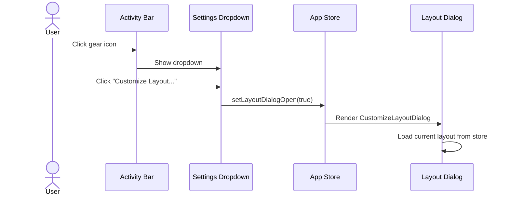
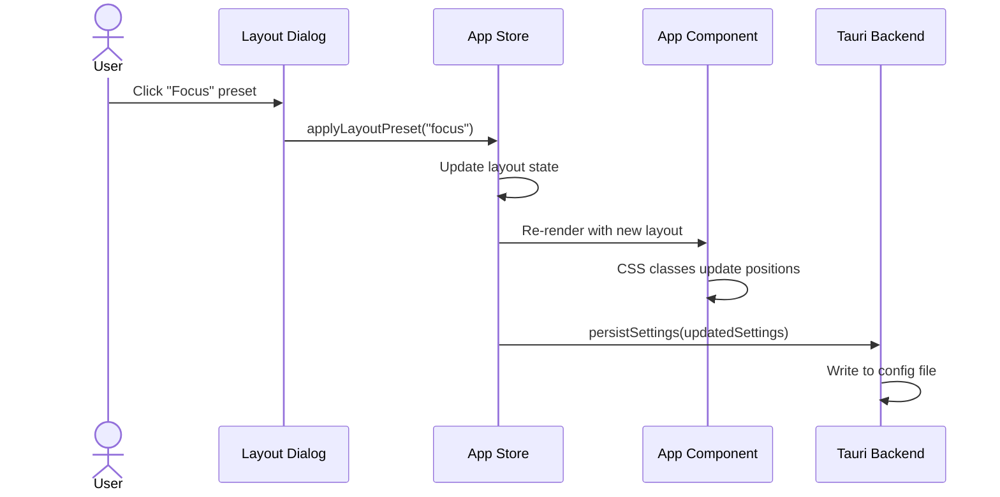
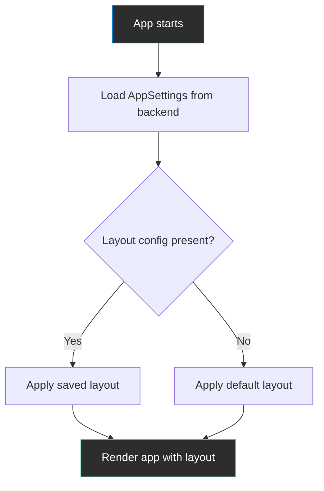
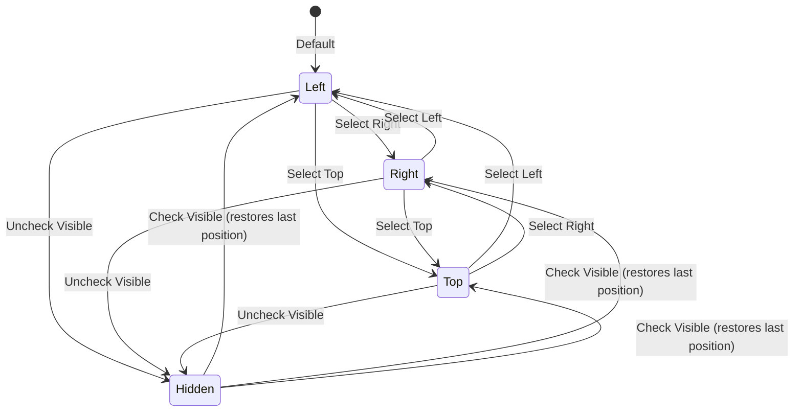
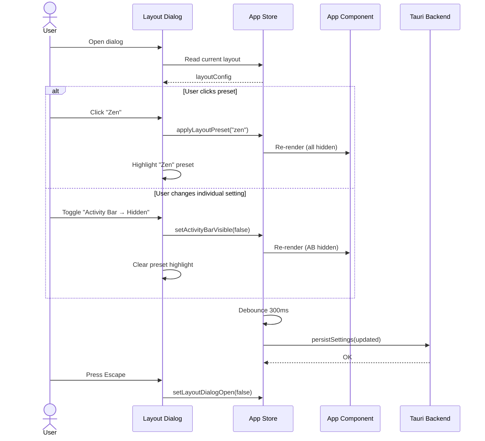
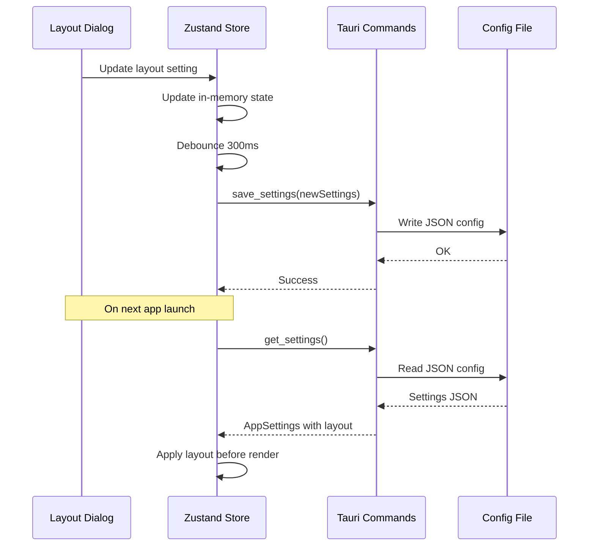
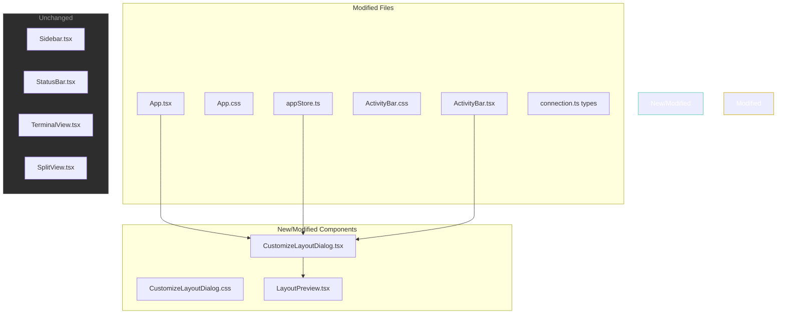
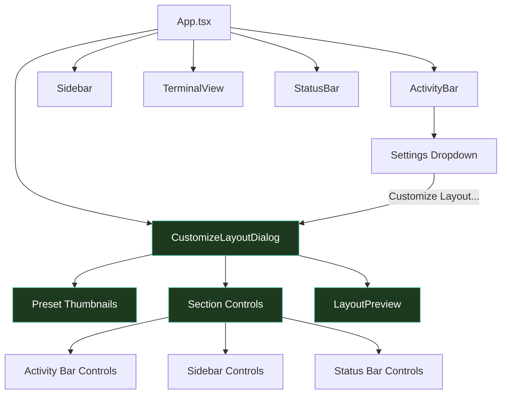

# Customize Layout

**GitHub Issue:** [#196](https://github.com/armaxri/termiHub/issues/196)

---

## Overview

termiHub currently has a fixed layout: Activity Bar on the left, Sidebar next to it, terminal area filling the remaining space, and a Status Bar at the bottom. Users cannot reposition these elements, hide them persistently, or switch between layout presets. VS Code provides a "Customize Layout" feature that gives users fine-grained control over where UI sections appear and how much space they occupy.

This concept introduces a **Customize Layout** dialog accessible from the Activity Bar that lets users:

- **Toggle visibility** of major UI sections (Activity Bar, Sidebar, Status Bar)
- **Reposition** the Activity Bar (left, right, top, hidden) and Sidebar (left, right)
- **Apply layout presets** (Default, Focus, Zen) for quick workspace switching
- **Save and restore** custom layout configurations that persist across sessions

### Goals

- Give users control over their workspace without requiring manual config file editing
- Support different workflows (e.g., "Zen mode" with maximum terminal space, "Focus mode" with no sidebar)
- Persist layout preferences across application restarts
- Maintain the existing VS Code-inspired dark aesthetic
- Keep the feature lightweight — pure CSS/state changes, no DOM restructuring

### Non-Goals

- Fully detachable/floating panels (complex window management beyond current scope)
- Per-connection or per-tab layout profiles (layout is global)
- Custom ordering of Activity Bar items (separate concern)

---

## UI Interface

### Customize Layout Dialog

The dialog opens as a modal overlay, centered on the application window. It provides a visual preview of the current layout alongside controls for each UI section.

```
┌─────────────────────────────────────────────────────────┐
│  Customize Layout                                   [X] │
├─────────────────────────────────────────────────────────┤
│                                                         │
│  PRESETS                                                │
│  ┌──────────┐ ┌──────────┐ ┌──────────┐                │
│  │ ┌─┬──┬──┐│ │ ┌──┬─────┐│ │ ┌───────┐│                │
│  │ │A│SB│T ││ │ │  │  T  ││ │ │       ││                │
│  │ │ │  │  ││ │ │  │     ││ │ │   T   ││                │
│  │ └─┴──┴──┘│ │ └──┴─────┘│ │ │       ││                │
│  │ Default  │ │  Focus    │ │   Zen   ││                │
│  └──────────┘ └──────────┘ └──────────┘                │
│                                                         │
│  ─────────────────────────────────────────              │
│                                                         │
│  ACTIVITY BAR                                           │
│  Visibility:  [x] Visible                               │
│  Position:    ( ) Left  (•) Right  ( ) Top              │
│                                                         │
│  SIDEBAR                                                │
│  Visibility:  [x] Visible                               │
│  Position:    (•) Left  ( ) Right                       │
│                                                         │
│  STATUS BAR                                             │
│  Visibility:  [x] Visible                               │
│                                                         │
│  ─────────────────────────────────────────              │
│                                                         │
│  LAYOUT PREVIEW                                         │
│  ┌──────────────────────────────────────┐               │
│  │ ┌──┐┌─────┐┌──────────────────────┐ │               │
│  │ │AB││ SB  ││     Terminal Area    │ │               │
│  │ │  ││     ││                      │ │               │
│  │ │  ││     ││                      │ │               │
│  │ └──┘└─────┘└──────────────────────┘ │               │
│  │ ┌──────────────────────────────────┐│               │
│  │ │           Status Bar            ││               │
│  │ └──────────────────────────────────┘│               │
│  └──────────────────────────────────────┘               │
│                                                         │
│                              [Reset to Default] [Close] │
└─────────────────────────────────────────────────────────┘
```

### Layout Presets

Three built-in presets provide quick workspace configurations:

| Preset      | Activity Bar  | Sidebar       | Status Bar | Description                                                                              |
| ----------- | ------------- | ------------- | ---------- | ---------------------------------------------------------------------------------------- |
| **Default** | Left, visible | Left, visible | Visible    | Standard termiHub layout — all UI elements in their default positions                    |
| **Focus**   | Left, visible | Hidden        | Visible    | Activity Bar remains for navigation, but sidebar is collapsed to maximize terminal space |
| **Zen**     | Hidden        | Hidden        | Hidden     | Maximum terminal area — all chrome removed for distraction-free work                     |

Each preset is represented by a small thumbnail showing a schematic of the layout. The active preset is highlighted with the accent color border. Clicking a preset immediately applies it.

If the user modifies individual settings after selecting a preset, the preset selection indicator is cleared (no preset is "active" — the layout is custom).

### Activity Bar Position Options

```
Left (default):            Right:                  Top:
┌──┬──────────────┐       ┌──────────────┬──┐     ┌──────────────────┐
│AB│  Content     │       │  Content     │AB│     │  AB (horizontal) │
│  │              │       │              │  │     ├──────────────────┤
│  │              │       │              │  │     │  Content         │
└──┴──────────────┘       └──────────────┴──┘     └──────────────────┘
```

When positioned at the **top**, the Activity Bar renders horizontally with icons in a row instead of a column. The sidebar (if visible) sits below the top bar and to the left or right of the terminal area as configured.

When **hidden**, the Activity Bar is not rendered at all. Sidebar views can still be toggled via keyboard shortcut or the toolbar button.

### Sidebar Position Options

```
Left (default):            Right:
┌──┬──────┬────────┐      ┌──┬────────┬──────┐
│AB│  SB  │Terminal │      │AB│Terminal │  SB  │
│  │      │        │      │  │        │      │
└──┴──────┴────────┘      └──┴────────┴──────┘
```

The sidebar retains its current resizable behavior regardless of position. The resize handle moves to the appropriate edge.

### Status Bar Visibility

The Status Bar can be toggled on or off. When hidden, the terminal area extends to the full bottom of the window.

### Accessing the Dialog

The Customize Layout dialog is accessible from two places:

1. **Activity Bar** — a new item in the settings dropdown menu (gear icon): "Customize Layout..."
2. **Keyboard shortcut** — no default shortcut assigned initially; users can discover the feature via the menu

### Live Preview

All changes are applied immediately (live preview). There is no "Apply" button — the dialog acts as a direct manipulation interface. The "Reset to Default" button reverts all layout settings to factory defaults. The "Close" button (or pressing Escape) dismisses the dialog.

---

## General Handling

### Opening the Customize Layout Dialog



### Applying a Preset



### Changing Individual Settings

1. User toggles a visibility checkbox or selects a position radio button
2. The change is applied immediately to the store
3. The App component re-renders with updated CSS classes
4. The layout preview in the dialog updates to reflect the change
5. If the current layout no longer matches any preset, the preset selection is cleared
6. Settings are debounce-persisted (300ms) to the backend

### Persistence

Layout preferences are stored as part of the existing `AppSettings` and persisted through the same Tauri backend mechanism. On application startup, the layout state is loaded from the config and applied before the first render to prevent layout jumps.



### Keyboard Shortcut Interactions

- **Ctrl+B / Cmd+B** (Toggle Sidebar): continues to work regardless of layout configuration. If the sidebar position changes, the toggle still works as expected.
- **Escape**: closes the Customize Layout dialog
- The toolbar sidebar toggle button remains functional even when the Activity Bar is hidden

### Edge Cases

- **Activity Bar hidden + Sidebar visible**: The sidebar still appears, but there is no Activity Bar to switch views. Users can switch sidebar views via the sidebar header or use the Activity Bar keyboard shortcut (if one exists). The toolbar's sidebar toggle button remains available.
- **All sections hidden (Zen mode)**: Only the terminal toolbar and terminal area are visible. The toolbar always remains visible as it contains essential controls (new terminal, split, sidebar toggle). Users can exit Zen mode via the Customize Layout keyboard shortcut or by accessing the settings through the toolbar context menu.
- **Window too narrow for top Activity Bar**: The top Activity Bar scrolls horizontally or collapses icons. Minimum window width requirements are not changed.
- **Layout dialog open during resize**: The live preview updates correctly as the dialog itself may need to reflow.
- **Preset partially matches current settings**: A preset is only highlighted as "active" if ALL its settings match the current layout. Partial matches do not highlight any preset.
- **First launch / missing config**: Default layout is applied (Activity Bar left, Sidebar left and visible, Status Bar visible).

---

## States & Sequences

### Layout State Machine

```mermaid
stateDiagram-v2
    [*] --> Default: First launch / no config

    Default --> Custom: User changes any setting
    Default --> Focus: Apply Focus preset
    Default --> Zen: Apply Zen preset

    Focus --> Custom: User changes any setting
    Focus --> Default: Apply Default preset
    Focus --> Zen: Apply Zen preset

    Zen --> Custom: User changes any setting
    Zen --> Default: Apply Default preset
    Zen --> Focus: Apply Focus preset

    Custom --> Default: Apply Default preset
    Custom --> Focus: Apply Focus preset
    Custom --> Zen: Apply Zen preset
    Custom --> Custom: Change another setting
```

### Activity Bar Position State



### Dialog Interaction Sequence



### App Render Flow with Layout

```mermaid
flowchart TD
    A[App renders] --> B{Activity Bar position?}

    B -->|Left| C[Flexbox: AB | Sidebar? | Terminal]
    B -->|Right| D[Flexbox: Sidebar? | Terminal | AB]
    B -->|Top| E[Column: AB | Row: Sidebar? + Terminal]
    B -->|Hidden| F[Flexbox: Sidebar? | Terminal]

    C --> G{Status Bar visible?}
    D --> G
    E --> G
    F --> G

    G -->|Yes| H[Render StatusBar at bottom]
    G -->|No| I[Skip StatusBar]

    H --> J[Final layout]
    I --> J

    style A fill:#2d2d2d,stroke:#007acc,color:#fff
    style J fill:#2d2d2d,stroke:#4ec9b0,color:#fff
```

### Settings Persistence Sequence



---

## Preliminary Implementation Details

Based on the current project architecture at the time of concept creation. The codebase may evolve between concept creation and implementation.

### 1. Extend `AppSettings` with Layout Config

Add layout fields to the existing `AppSettings` interface in `src/types/connection.ts`:

```typescript
export interface LayoutConfig {
  activityBarPosition: "left" | "right" | "top" | "hidden";
  sidebarPosition: "left" | "right";
  sidebarVisible: boolean;
  statusBarVisible: boolean;
}

export interface AppSettings {
  // ... existing fields ...
  layout?: LayoutConfig;
}
```

The `layout` field is optional — when absent, the default layout is applied (backward compatible). The defaults are:

```typescript
const DEFAULT_LAYOUT: LayoutConfig = {
  activityBarPosition: "left",
  sidebarPosition: "left",
  sidebarVisible: true,
  statusBarVisible: true,
};
```

### 2. Add Layout State to Zustand Store

Extend `appStore.ts` with layout-specific state and actions:

```typescript
// New state fields
layoutConfig: LayoutConfig;
layoutDialogOpen: boolean;

// New actions
setLayoutDialogOpen: (open: boolean) => void;
updateLayoutConfig: (partial: Partial<LayoutConfig>) => void;
applyLayoutPreset: (preset: "default" | "focus" | "zen") => void;
```

The `updateLayoutConfig` action merges partial updates, debounces persistence, and re-renders the app. The `applyLayoutPreset` action sets all layout fields at once.

Preset definitions:

```typescript
const LAYOUT_PRESETS: Record<string, LayoutConfig> = {
  default: {
    activityBarPosition: "left",
    sidebarPosition: "left",
    sidebarVisible: true,
    statusBarVisible: true,
  },
  focus: {
    activityBarPosition: "left",
    sidebarPosition: "left",
    sidebarVisible: false,
    statusBarVisible: true,
  },
  zen: {
    activityBarPosition: "hidden",
    sidebarPosition: "left",
    sidebarVisible: false,
    statusBarVisible: false,
  },
};
```

### 3. Modify `App.tsx` Layout Rendering

The `App` component currently renders a fixed flexbox structure:

```tsx
<div className="app">
  <div className="app__main">
    <ActivityBar />
    <Sidebar />
    <TerminalView />
  </div>
  <StatusBar />
</div>
```

This needs to become layout-aware, using CSS classes driven by the store's `layoutConfig`:

```tsx
function App() {
  const layout = useAppStore((s) => s.layoutConfig);

  const appMainClass = ["app__main", `app__main--ab-${layout.activityBarPosition}`].join(" ");

  return (
    <div className="app">
      {layout.activityBarPosition === "top" && <ActivityBar horizontal />}
      <div className={appMainClass}>
        {layout.activityBarPosition === "left" && <ActivityBar />}
        {layout.sidebarPosition === "left" && layout.sidebarVisible && <Sidebar />}
        <TerminalView />
        {layout.sidebarPosition === "right" && layout.sidebarVisible && <Sidebar />}
        {layout.activityBarPosition === "right" && <ActivityBar />}
      </div>
      {layout.statusBarVisible && <StatusBar />}
    </div>
  );
}
```

The sidebar collapse toggle (`Ctrl+B`) should still work independently of the layout config — `sidebarCollapsed` is a runtime toggle, while `sidebarVisible` in the layout config controls the default/configured visibility. The interaction between these two states: when `sidebarVisible` is `false` in layout config, the sidebar never renders regardless of `sidebarCollapsed`. When `sidebarVisible` is `true`, the existing `sidebarCollapsed` toggle works as before.

### 4. CSS Changes

Add conditional layout classes in `App.css`:

```css
/* Activity bar on right */
.app__main--ab-right {
  flex-direction: row;
}

/* Activity bar on top — main area becomes a column */
.app__main--ab-top {
  flex-direction: row; /* sidebar + terminal remain row */
}

/* No status bar — terminal extends to bottom */
.app--no-statusbar .terminal-view {
  /* Already handled by conditional render */
}
```

The `ActivityBar` component needs a `horizontal` prop variant:

```css
.activity-bar--horizontal {
  flex-direction: row;
  width: 100%;
  height: var(--activity-bar-width); /* same size, rotated */
}
```

### 5. New Components

| Component               | Location                                            | Purpose                                                  |
| ----------------------- | --------------------------------------------------- | -------------------------------------------------------- |
| `CustomizeLayoutDialog` | `src/components/Settings/CustomizeLayoutDialog.tsx` | Modal dialog with preset thumbnails and section controls |
| `LayoutPreview`         | `src/components/Settings/LayoutPreview.tsx`         | Small SVG/CSS preview of the current layout              |

The dialog uses the existing Radix UI `Dialog` primitive (already used for `RenameDialog`, `ColorPickerDialog`) for consistent modal behavior.

### 6. ActivityBar Changes

The `ActivityBar` component (`src/components/ActivityBar/ActivityBar.tsx`) needs:

1. A `horizontal` prop that switches between vertical (default) and horizontal rendering
2. A new "Customize Layout..." entry in the settings dropdown menu
3. CSS for horizontal mode (icons in a row, reduced height)



### 7. Backend Changes

No new Tauri commands are needed. The existing `get_settings` / `save_settings` commands already handle `AppSettings` as an opaque JSON blob. The new `layout` field is optional, so existing config files remain valid. The Rust `AppSettings` struct in the backend needs the new optional field added:

```rust
#[derive(Debug, Clone, Serialize, Deserialize)]
pub struct LayoutConfig {
    pub activity_bar_position: String,  // "left" | "right" | "top" | "hidden"
    pub sidebar_position: String,       // "left" | "right"
    pub sidebar_visible: bool,
    pub status_bar_visible: bool,
}

#[derive(Debug, Clone, Serialize, Deserialize)]
pub struct AppSettings {
    // ... existing fields ...
    #[serde(default)]
    pub layout: Option<LayoutConfig>,
}
```

### 8. Migration Path

1. **First PR**: Add `LayoutConfig` type, store actions, and basic `App.tsx` layout switching (Activity Bar left/right/hidden, Sidebar left/right, Status Bar toggle). No dialog yet — changes applied via store for testing.
2. **Second PR**: Add `CustomizeLayoutDialog` with preset thumbnails and section controls. Wire up to Activity Bar menu.
3. **Third PR**: Add Activity Bar horizontal/top mode with CSS and responsive behavior.
4. **Fourth PR**: Add `LayoutPreview` component inside the dialog.
5. **Fifth PR**: Polish, keyboard accessibility, and documentation.

### Component Hierarchy


