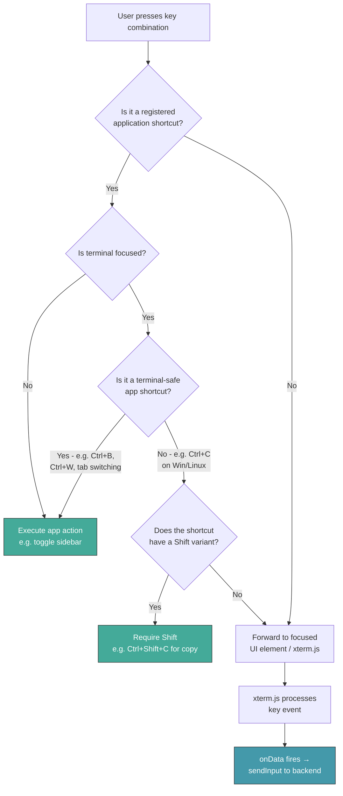
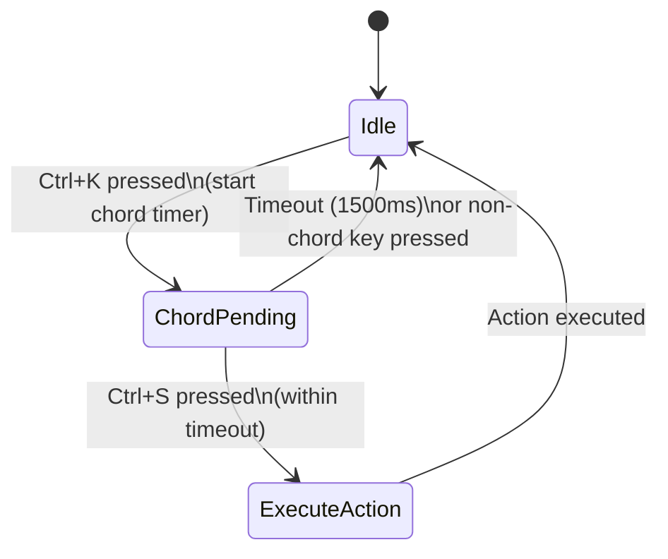
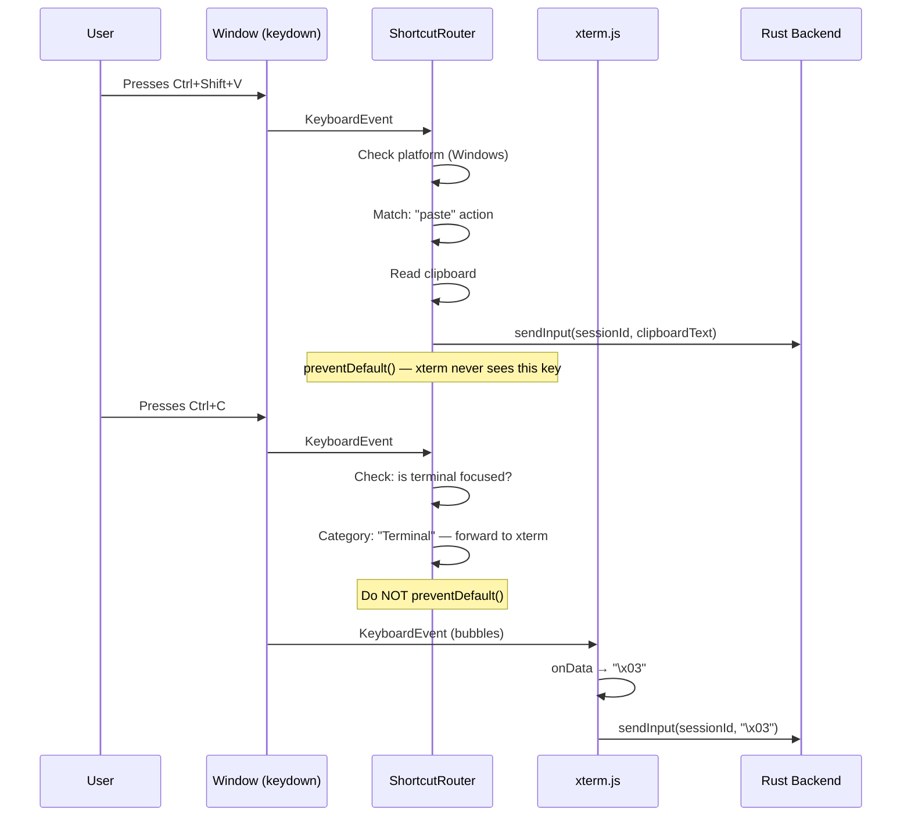
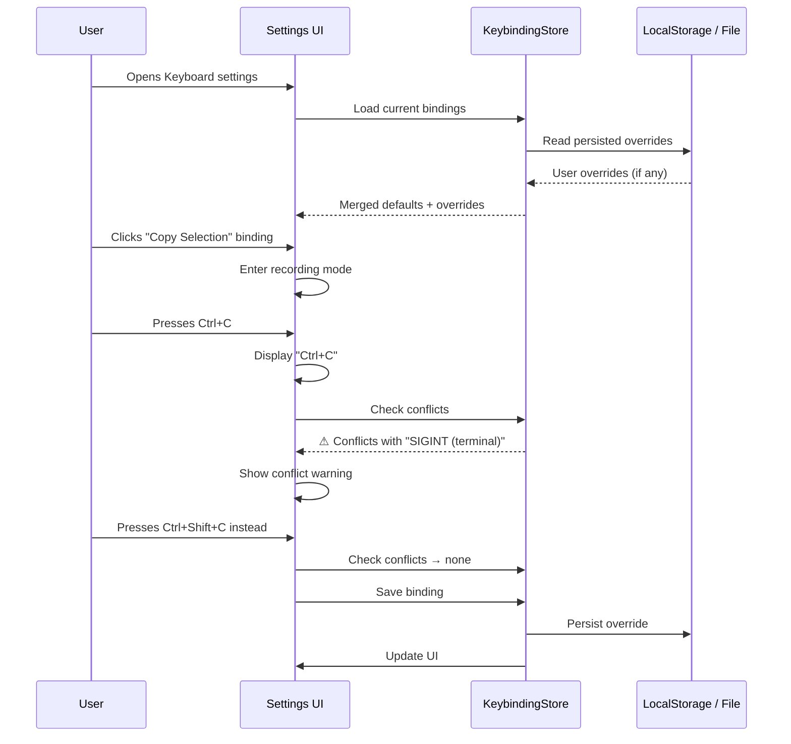
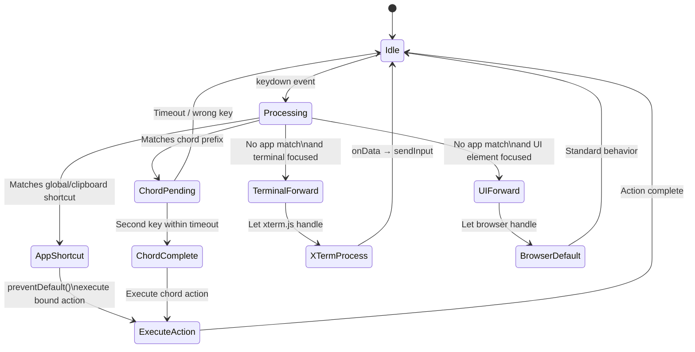
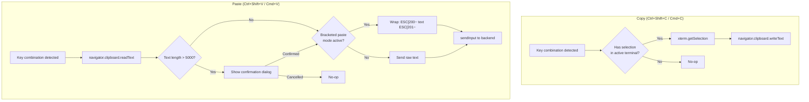
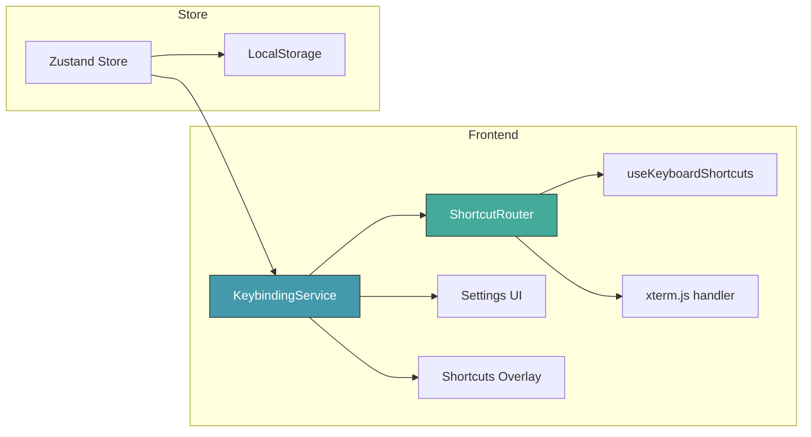

# Key Combinations

**GitHub Issue:** [#418](https://github.com/armaxri/termiHub/issues/418)

---

## Overview

termiHub currently handles keyboard shortcuts through a single React hook (`useKeyboardShortcuts`) with hard-coded bindings and relies on xterm.js defaults for terminal-level key handling. This leads to problems — most notably Ctrl+V not pasting on Windows — because the interaction between the browser/webview layer, xterm.js, the application-level shortcuts, and the OS-native expectations is not clearly defined or consistently handled.

This concept defines a structured approach to key combination handling that works correctly across Windows, macOS, and Linux, covering application shortcuts, terminal input, clipboard operations, and future user customization.

## Motivation

- **Ctrl+V doesn't paste on Windows**: xterm.js intercepts Ctrl+V and sends it as a raw control character (`\x16`) to the terminal backend instead of pasting from the clipboard. This is the correct VT100 behavior but violates user expectations on Windows.
- **Platform inconsistency**: macOS users expect Cmd-based shortcuts (Cmd+C, Cmd+V), while Windows/Linux users expect Ctrl-based ones. The current code uses `e.metaKey || e.ctrlKey` everywhere, which doesn't distinguish between "app shortcut modifier" and "terminal control character."
- **No clipboard keyboard shortcuts**: Copy and paste are only available via the right-click context menu — there are no keyboard shortcuts for these operations.
- **Hard-coded shortcuts**: All bindings are in `useKeyboardShortcuts.ts` with no way for users to view, change, or extend them.
- **No conflict resolution**: When both the application and xterm.js want to handle the same key combination, there is no clear priority system.

## Goals

- Define correct clipboard shortcuts (copy/paste) that work on all platforms
- Establish a clear priority model for key event routing (application vs. terminal)
- Document all default key bindings and their platform-specific behavior
- Design an architecture for user-customizable key bindings
- Ensure terminal control characters (Ctrl+C for SIGINT, etc.) remain functional

## Non-Goals

- Implementing vim/emacs modal keybinding schemes
- System-wide (OS-level) global hotkeys outside the application window
- Input Method Editor (IME) composition handling (separate concern)
- Macro recording and playback

---

## UI Interface

### Keyboard Shortcut Reference

Users can view all active keyboard shortcuts via a quick-reference overlay, opened with `Ctrl+K Ctrl+S` (Windows/Linux) or `Cmd+K Cmd+S` (macOS) — matching VS Code's convention:

```
┌──────────────────────────────────────────────────────────┐
│  Keyboard Shortcuts                              [×]     │
├──────────────────────────────────────────────────────────┤
│  🔍 Search shortcuts...                                  │
│                                                          │
│  ── General ─────────────────────────────────────────    │
│  Toggle Sidebar          Ctrl+B          Cmd+B           │
│  Open Settings           Ctrl+,          Cmd+,           │
│  Keyboard Shortcuts      Ctrl+K Ctrl+S   Cmd+K Cmd+S    │
│                                                          │
│  ── Terminal ────────────────────────────────────────    │
│  New Terminal            Ctrl+Shift+`    Cmd+Shift+`     │
│  Close Tab               Ctrl+W          Cmd+W           │
│  Next Tab                Ctrl+Tab        Ctrl+Tab        │
│  Previous Tab            Ctrl+Shift+Tab  Ctrl+Shift+Tab  │
│  Copy Selection          Ctrl+Shift+C    Cmd+C           │
│  Paste                   Ctrl+Shift+V    Cmd+V           │
│  Clear Terminal          Ctrl+Shift+K    Cmd+K           │
│  Find in Terminal        Ctrl+Shift+F    Cmd+F           │
│                                                          │
│  ── Split View ──────────────────────────────────────    │
│  Split Right             Ctrl+\          Cmd+\           │
│  Focus Next Panel        Ctrl+Alt+→      Cmd+Alt+→      │
│  Focus Previous Panel    Ctrl+Alt+←      Cmd+Alt+←      │
│                                                          │
│  Win/Linux column      macOS column                      │
└──────────────────────────────────────────────────────────┘
```

The overlay shows two columns — one for Windows/Linux bindings, one for macOS — so users always see the relevant shortcut for their OS (with the current OS column highlighted).

### Settings UI: Keyboard Section

A "Keyboard" section in the existing Settings panel allows users to rebind shortcuts:

```
┌──────────────────────────────────────────────────────────┐
│  Settings > Keyboard                                     │
├──────────────────────────────────────────────────────────┤
│                                                          │
│  🔍 Search shortcuts...                                  │
│                                                          │
│  Action               Binding              [Reset]       │
│  ─────────────────────────────────────────────────────   │
│  Toggle Sidebar       [ Ctrl+B           ]  [  ↺  ]     │
│  New Terminal          [ Ctrl+Shift+`     ]  [  ↺  ]     │
│  Close Tab            [ Ctrl+W           ]  [  ↺  ]     │
│  Copy Selection       [ Ctrl+Shift+C     ]  [  ↺  ]     │
│  Paste                [ Ctrl+Shift+V     ]  [  ↺  ]     │
│  Clear Terminal       [ Ctrl+Shift+K     ]  [  ↺  ]     │
│  ...                                                     │
│                                                          │
│  Click a binding to record a new key combination.        │
│  Press Escape to cancel. Press Backspace to unbind.      │
│                                                          │
│  [Reset All to Defaults]                                 │
│                                                          │
│  ⚠ Conflict: "Ctrl+Shift+C" is already bound to         │
│    "Copy Selection". Saving will unbind the previous     │
│    action.                                               │
└──────────────────────────────────────────────────────────┘
```

When the user clicks a binding field, it enters recording mode — the next key combination pressed is captured and displayed. Conflicts are shown inline with a warning.

---

## General Handling

### Platform-Aware Modifier Key Strategy

The fundamental problem is that Ctrl has dual meaning:

| Context                | Ctrl on Windows/Linux                     | Cmd on macOS               |
| ---------------------- | ----------------------------------------- | -------------------------- |
| Application shortcuts  | Ctrl+B (toggle sidebar)                   | Cmd+B (toggle sidebar)     |
| Clipboard operations   | Ctrl+C (copy) — **conflicts with SIGINT** | Cmd+C (copy) — no conflict |
| Terminal control chars | Ctrl+C → `\x03` (SIGINT)                  | Ctrl+C → `\x03` (SIGINT)   |

**Resolution strategy by platform:**

**macOS:**

- `Cmd` = application/clipboard modifier (no conflict with terminal)
- `Ctrl` = terminal control characters (always forwarded to PTY)
- Clipboard: `Cmd+C` = copy, `Cmd+V` = paste (standard macOS behavior)
- This is straightforward — Cmd and Ctrl are distinct keys with distinct roles

**Windows / Linux:**

- `Ctrl` = both application modifier AND terminal control character source → conflict
- Resolution: use `Ctrl+Shift` for clipboard operations in the terminal context
  - `Ctrl+Shift+C` = copy selection (matches GNOME Terminal, Windows Terminal, VS Code)
  - `Ctrl+Shift+V` = paste (matches GNOME Terminal, Windows Terminal, VS Code)
  - `Ctrl+C` (without Shift) = SIGINT (forwarded to terminal as `\x03`)
  - `Ctrl+V` (without Shift) = literal `\x16` (forwarded to terminal)

This follows the established convention used by Windows Terminal, GNOME Terminal, Konsole, and VS Code's integrated terminal.

### Key Event Routing Model

Key events flow through multiple layers. The routing priority determines which layer handles a given key combination:



### Shortcut Categories

Shortcuts are classified into categories that determine their routing behavior:

| Category       | Description                                                      | Examples                                        | Routing                                                  |
| -------------- | ---------------------------------------------------------------- | ----------------------------------------------- | -------------------------------------------------------- |
| **Global**     | Always handled by the app, never forwarded to terminal           | Toggle sidebar, tab switching, open settings    | App intercepts at `window` level                         |
| **Clipboard**  | Platform-dependent, use Shift on Win/Linux when terminal focused | Copy, Paste                                     | App intercepts; uses Ctrl+Shift on Win/Linux in terminal |
| **Terminal**   | Always forwarded to the terminal backend                         | Ctrl+C (SIGINT), Ctrl+D (EOF), Ctrl+Z (SUSPEND) | xterm.js default handler                                 |
| **Navigation** | Handled by app when terminal is not capturing                    | Arrow keys, Page Up/Down in UI contexts         | Conditional routing                                      |

### Default Key Bindings

Complete default binding table:

| Action               | Windows / Linux  | macOS            | Category  |
| -------------------- | ---------------- | ---------------- | --------- |
| Toggle Sidebar       | `Ctrl+B`         | `Cmd+B`          | Global    |
| New Terminal         | `Ctrl+Shift+``   | `Cmd+Shift+``    | Global    |
| Close Tab            | `Ctrl+W`         | `Cmd+W`          | Global    |
| Next Tab             | `Ctrl+Tab`       | `Ctrl+Tab`       | Global    |
| Previous Tab         | `Ctrl+Shift+Tab` | `Ctrl+Shift+Tab` | Global    |
| Copy Selection       | `Ctrl+Shift+C`   | `Cmd+C`          | Clipboard |
| Paste                | `Ctrl+Shift+V`   | `Cmd+V`          | Clipboard |
| Select All           | `Ctrl+Shift+A`   | `Cmd+A`          | Clipboard |
| Clear Terminal       | `Ctrl+Shift+K`   | `Cmd+K`          | Global    |
| Find in Terminal     | `Ctrl+Shift+F`   | `Cmd+F`          | Global    |
| Open Settings        | `Ctrl+,`         | `Cmd+,`          | Global    |
| Keyboard Shortcuts   | `Ctrl+K Ctrl+S`  | `Cmd+K Cmd+S`    | Global    |
| Split Right          | `Ctrl+\`         | `Cmd+\`          | Global    |
| Focus Next Panel     | `Ctrl+Alt+→`     | `Cmd+Alt+→`      | Global    |
| Focus Previous Panel | `Ctrl+Alt+←`     | `Cmd+Alt+←`      | Global    |
| Zoom In              | `Ctrl+=`         | `Cmd+=`          | Global    |
| Zoom Out             | `Ctrl+-`         | `Cmd+-`          | Global    |
| Reset Zoom           | `Ctrl+0`         | `Cmd+0`          | Global    |
| SIGINT               | `Ctrl+C`         | `Ctrl+C`         | Terminal  |
| EOF                  | `Ctrl+D`         | `Ctrl+D`         | Terminal  |
| Suspend              | `Ctrl+Z`         | `Ctrl+Z`         | Terminal  |

### Chord (Multi-Key) Shortcuts

Some shortcuts use a chord pattern (press a sequence of key combinations). For example, `Ctrl+K Ctrl+S` means: press Ctrl+K, release, then press Ctrl+S.



The chord system:

1. First key in chord is detected → enter "chord pending" state
2. A status bar indicator shows the pending chord (e.g., `(Ctrl+K) was pressed. Waiting for second key...`)
3. If the second key arrives within 1500ms → execute the bound action
4. If timeout or unrelated key → cancel chord, forward original key to terminal if applicable

### Edge Cases

- **Focus not on terminal**: When focus is on a text input (e.g., settings, connection editor, rename dialog), standard browser Ctrl+C/V/X behavior is preserved. Application shortcuts that conflict with text editing are suppressed in these contexts.
- **Modal dialogs**: When a modal is open, only Escape and dialog-specific shortcuts are active. All other shortcuts are suppressed.
- **Multiple terminals**: Clipboard operations always target the active (focused) terminal panel.
- **Empty clipboard**: Paste is a no-op when clipboard is empty — no error shown.
- **Large paste**: When pasting text exceeding 5,000 characters, show a confirmation dialog: "You are about to paste N characters. Proceed?" This prevents accidental paste of large content into a shell.
- **Bracketed paste**: When the terminal has bracketed paste mode enabled (modern shells), wrap pasted text in `\x1b[200~...\x1b[201~` escape sequences so the shell can distinguish pasted text from typed input.

---

## States & Sequences

### Key Event Processing Sequence



### Shortcut Customization Sequence



### Shortcut Resolution State Machine



### Clipboard Operation Flow



---

## Preliminary Implementation Details

Based on the current project architecture, here is the planned implementation approach.

### Architecture Overview



### New and Modified Files

| File                                                    | Change                                                                                                      |
| ------------------------------------------------------- | ----------------------------------------------------------------------------------------------------------- |
| `src/services/keybindings.ts`                           | **New** — KeybindingService: default bindings, platform detection, conflict checking, serialization         |
| `src/hooks/useKeyboardShortcuts.ts`                     | **Modify** — Refactor to consume KeybindingService instead of hard-coded bindings                           |
| `src/components/Terminal/Terminal.tsx`                  | **Modify** — Add `attachCustomKeyEventHandler` to intercept clipboard shortcuts before xterm processes them |
| `src/components/Terminal/TerminalRegistry.tsx`          | **Modify** — Extend with clipboard keyboard shortcut support (copy/paste via keyboard)                      |
| `src/components/Settings/KeyboardSettings.tsx`          | **New** — Settings panel for viewing and rebinding shortcuts                                                |
| `src/components/KeyboardShortcuts/ShortcutsOverlay.tsx` | **New** — Quick-reference overlay component                                                                 |
| `src/store/appStore.ts`                                 | **Modify** — Add keybinding state (user overrides, chord state)                                             |
| `src/types/keybindings.ts`                              | **New** — Type definitions for shortcuts, bindings, categories                                              |

### KeybindingService Design

```typescript
// src/types/keybindings.ts

interface KeyBinding {
  /** Unique action identifier */
  action: string;
  /** Human-readable label */
  label: string;
  /** Category for grouping and routing */
  category: "global" | "clipboard" | "terminal" | "navigation";
  /** Platform-specific key combinations */
  keys: {
    windows: string; // e.g. "Ctrl+Shift+C"
    macos: string; // e.g. "Cmd+C"
    linux: string; // e.g. "Ctrl+Shift+C"
  };
  /** Whether this can be rebound by the user */
  configurable: boolean;
}

interface KeybindingOverride {
  action: string;
  key: string; // Platform-specific override
}
```

### xterm.js Integration: `attachCustomKeyEventHandler`

The key to fixing the Ctrl+V problem is xterm.js's `attachCustomKeyEventHandler`. This callback is invoked **before** xterm processes a key event, and returning `false` prevents xterm from handling it (allowing the application to handle it instead).

```typescript
// In Terminal.tsx, after creating the xterm instance:
xterm.attachCustomKeyEventHandler((event: KeyboardEvent): boolean => {
  // Let the application's ShortcutRouter handle clipboard shortcuts
  // On Windows/Linux: intercept Ctrl+Shift+C, Ctrl+Shift+V
  // On macOS: intercept Cmd+C, Cmd+V
  if (keybindingService.isAppShortcut(event)) {
    return false; // Prevent xterm from processing — app will handle
  }
  return true; // Let xterm process normally (terminal control chars, etc.)
});
```

This is the critical mechanism: it lets clipboard shortcuts bypass xterm without affecting terminal control characters.

### Persistence

User keybinding overrides are stored in the Zustand store and persisted to `localStorage` (matching the existing pattern for other settings like theme, sidebar state, etc.). The data model is minimal — only overrides are stored, not the full binding set:

```json
{
  "keybindingOverrides": [{ "action": "copy-selection", "key": "Ctrl+Shift+X" }]
}
```

On load, the KeybindingService merges defaults with overrides. Resetting a binding removes it from the overrides array, reverting to the default.

### Platform Detection

```typescript
function getPlatform(): "windows" | "macos" | "linux" {
  const ua = navigator.userAgent;
  if (ua.includes("Mac")) return "macos";
  if (ua.includes("Win")) return "windows";
  return "linux";
}
```

This is already effectively done in the codebase via `e.metaKey || e.ctrlKey`, but should be formalized into a utility so platform-specific binding lookup is consistent and testable.

### Bracketed Paste Mode

xterm.js tracks whether the terminal has enabled bracketed paste mode (via `\x1b[?2004h`). When active, pasted text must be wrapped in bracket sequences. The xterm.js API provides `xterm.modes.bracketedPasteMode` (with `allowProposedApi: true`, which is already enabled in the codebase) to check this state.

### Implementation Order

1. **Phase 1 — Fix Ctrl+V paste (immediate fix)**: Add `attachCustomKeyEventHandler` to Terminal.tsx to intercept Ctrl+Shift+V (Win/Linux) and Cmd+V (macOS), trigger paste via `TerminalRegistry.pasteToTerminal`. Similarly handle Ctrl+Shift+C / Cmd+C for copy. This alone resolves issue #418's core problem.
2. **Phase 2 — KeybindingService**: Extract hard-coded shortcuts into a data-driven service with platform-aware defaults.
3. **Phase 3 — Settings UI**: Add the Keyboard section to Settings for viewing and rebinding shortcuts.
4. **Phase 4 — Shortcuts Overlay**: Add the quick-reference overlay with search.
5. **Phase 5 — Chord support and advanced features**: Implement multi-key chord sequences, large-paste confirmation, bracketed paste.
