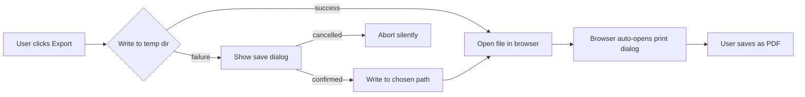
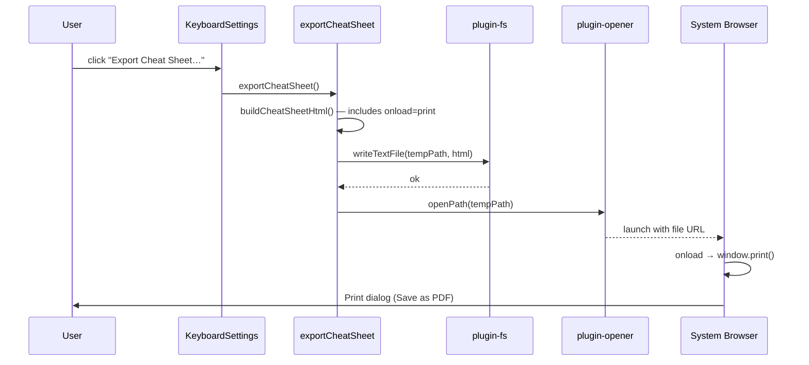
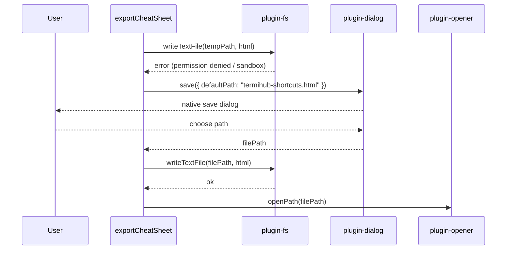
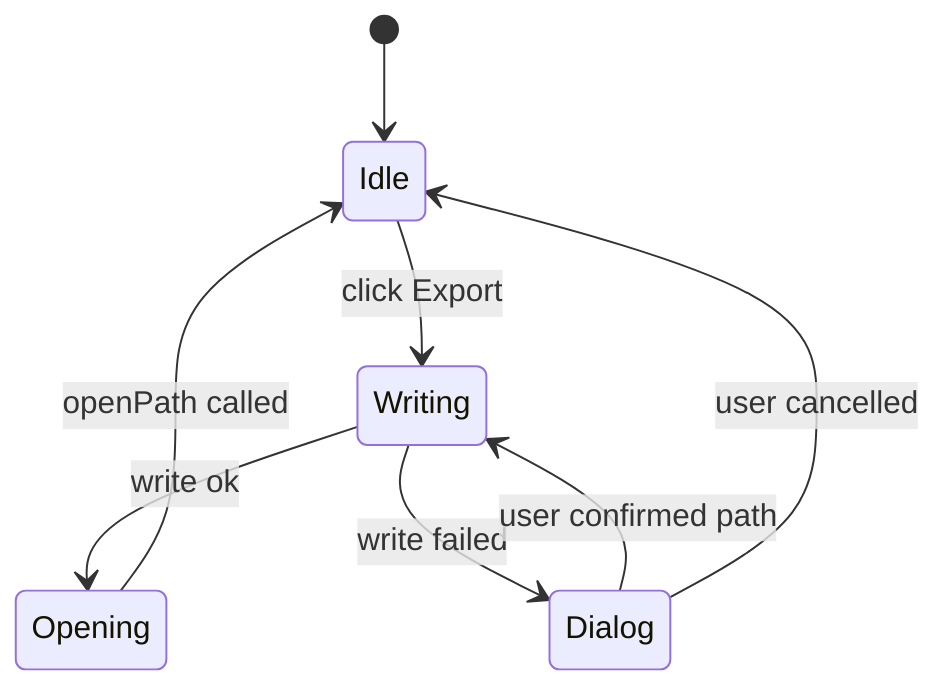

# Keyboard Shortcut Cheat Sheet Export

> Concept document — not yet assigned a GitHub issue

---

## Overview

Users want a one-page printable reference of all keyboard shortcuts, including any
customisations they have made. The goal is to produce a PDF cheat sheet with minimal
friction: one click, and the result is either on screen ready to print or already saved
as a PDF.

The technical constraint is that **`window.print()` is blocked inside Tauri's WebView**
(WKWebView on macOS, WebView2 on Windows). Any print or PDF action must therefore
involve the system browser or a native dialog.

---

## UI Interface

### Entry point

A single button labelled **"Export Cheat Sheet…"** sits at the bottom of the
_Settings → Keyboard Shortcuts_ panel, next to the existing _Reset All to Defaults_
button. It carries a `FileDown` icon.

```
┌──────────────────────────────────────────────────┐
│  Keyboard Shortcuts                              │
│  ─────────────────────────────────────────────  │
│  [search…]                                       │
│                                                  │
│  General                                         │
│    Toggle Sidebar          Cmd+B          [↺]   │
│    Open Settings           Cmd+,          [↺]   │
│    Keyboard Shortcuts      Cmd+K Cmd+S    [↺]   │
│  …                                               │
│                                                  │
│  [↺ Reset All to Defaults]  [⬇ Export Cheat Sheet…] │
└──────────────────────────────────────────────────┘
```

### Interaction flow (recommended — Option B below)

1. User clicks **Export Cheat Sheet…**
2. A native _Save_ dialog opens, pre-filled with `termihub-shortcuts.html` and an
   HTML filter. User chooses location and confirms.
3. The HTML file is written to disk and immediately opened in the system browser.
4. The browser displays the cheat sheet formatted for print (A4 landscape, compact
   3-column grid). The user presses **Cmd+P** / **Ctrl+P** and selects _Save as PDF_.

Alternatively (Option A, zero-friction):

1. User clicks **Export Cheat Sheet…**
2. No dialog — a file is written to the OS temp directory.
3. The system browser opens immediately.
4. The page auto-triggers the browser's print dialog (`window.onload = print`).

---

## General Handling

### Content of the cheat sheet

- All shortcuts from `DEFAULT_BINDINGS`, grouped by category (General, Clipboard,
  Terminal, Navigation / Split, Tab Groups)
- Each row: action label + effective key binding (user override if present, else
  platform default)
- Overridden bindings marked with `†` + a legend at the bottom
- Generation date in the header

### User overrides

The cheat sheet always reflects the _effective_ binding at export time, so it stays
accurate regardless of how many overrides the user has set.

### Platform defaults

`serializeBinding` already handles the Cmd/Ctrl distinction via `isMac()`, so the
correct key labels are rendered for the current platform.

---

## Options comparison

|                                 | Option A — Temp + auto-print          | Option B — Save dialog + open   | Option C — In-app window         |
| ------------------------------- | ------------------------------------- | ------------------------------- | -------------------------------- |
| **Clicks to PDF**               | 2 (click + confirm print)             | 3 (click + save dialog + print) | 2 (click + print in new window)  |
| **User controls save location** | No                                    | Yes                             | No                               |
| **File survives session**       | No (temp dir)                         | Yes                             | No                               |
| **Works without browser**       | No                                    | No                              | Yes (needs Tauri changes)        |
| **Implementation effort**       | Low                                   | Low (already done)              | High (new Tauri window)          |
| **Risk**                        | Temp file may be blocked by OS policy | None                            | Requires Rust-side window config |

### Recommended approach: Option A with Option B as fallback

Auto-write to a temp file and open in browser for zero friction. Fall back to a save
dialog if writing the temp file fails (e.g. temp dir not writable, OS sandboxing).
The auto-print trigger (`window.onload = () => { window.print(); }`) in the HTML
means the user lands directly in the browser's print dialog, which has a "Save as PDF"
destination on all supported platforms.



---

## States & Sequences

### Happy path — temp file



### Fallback path — save dialog



### State diagram for the button



---

## Preliminary Implementation Details

### `exportCheatSheet()` (updated)

```typescript
export async function exportCheatSheet(): Promise<void> {
  const html = buildCheatSheetHtml({ autoPrint: true }); // adds onload=print

  const tempPath = await resolvePath("termihub-shortcuts.html", BaseDirectory.Temp);

  try {
    await writeTextFile(tempPath, html, { baseDir: BaseDirectory.Temp });
    await openPath(tempPath);
    return;
  } catch {
    // Fall through to save dialog
  }

  const chosenPath = await save({
    title: "Save Keyboard Shortcuts Cheat Sheet",
    defaultPath: "termihub-shortcuts.html",
    filters: [{ name: "HTML File", extensions: ["html"] }],
  });
  if (!chosenPath) return;

  // Strip auto-print for saved files so reopening later doesn't trigger print
  const htmlNoAutoPrint = buildCheatSheetHtml({ autoPrint: false });
  await writeTextFile(chosenPath, htmlNoAutoPrint);
  await openPath(chosenPath);
}
```

### `buildCheatSheetHtml({ autoPrint })` addition

When `autoPrint: true`, the generated HTML includes:

```html
<script>
  window.addEventListener("load", () => window.print());
</script>
```

This fires the browser's native print dialog immediately on page load. The user can
cancel it and the page remains open for viewing.

### Tauri permissions

All required permissions are already present in `capabilities/default.json`:

| Permission                 | Plugin        | Already granted |
| -------------------------- | ------------- | --------------- |
| `fs:allow-write-text-file` | plugin-fs     | ✓               |
| `opener:default`           | plugin-opener | ✓               |
| `dialog:default`           | plugin-dialog | ✓               |

The only new permission needed is `fs:allow-app-temp-dir` (or equivalent scope for
`BaseDirectory.Temp`) — this must be verified against the Tauri 2 fs plugin scope
documentation at implementation time, as the exact scope token may differ across
plugin versions.

### Temp file lifecycle

The temp file (`termihub-shortcuts.html`) is written to the OS temp directory and is
not cleaned up by termiHub. The OS manages temp directory cleanup. If this is
undesirable, a `setTimeout` cleanup after a brief delay (e.g. 30 s) can be added,
but this risks deleting the file before slow browsers finish loading it.
