# Light Color Theme & User Themes

**GitHub Issue:** [#193](https://github.com/armaxri/termiHub/issues/193)

---

## Overview

termiHub currently ships a single hardcoded dark color theme (VS Code Dark-inspired). All colors are defined as CSS custom properties in `src/styles/variables.css`, and the xterm.js terminal uses its own hardcoded ANSI color palette in `Terminal.tsx`. There is no mechanism to switch themes, detect the OS preference, or allow users to define custom palettes.

This concept introduces a **theme system** that:

1. Ships two built-in themes: **Dark** (current) and **Light**
2. Supports **System** preference — auto-switching based on the OS `prefers-color-scheme` media query
3. Provides a foundation for **user-defined custom themes** — users can create, edit, import, and export theme files
4. Applies themes consistently across the entire UI — CSS variables, xterm.js terminal, status indicators, and inline-styled elements

### Goals

- Let users switch between Dark, Light, and System themes from the Appearance settings (see [Nicer Settings concept](nicer-settings.md))
- Provide a polished, accessible Light theme that matches the existing VS Code Light aesthetic
- Ensure all color definitions flow through a single theme system — no scattered hardcoded values
- Allow power users to create fully custom themes via JSON theme files
- Keep the theme switch instant with no page reload

---

## UI Interface

### Theme Selector (Appearance Settings)

The theme setting lives in the **Appearance** category of the Settings panel (as described in the [Nicer Settings concept](nicer-settings.md)):

```
┌─ Appearance ──────────────────────────────────────────┐
│                                                       │
│  THEME                                                │
│  [Dark ▾]                                             │
│   ┌──────────────┐                                    │
│   │ ● Dark       │                                    │
│   │ ○ Light      │                                    │
│   │ ○ System     │                                    │
│   │ ─────────────│                                    │
│   │ ○ My Custom  │  ← user-defined themes             │
│   │ + New Theme  │  ← opens theme editor              │
│   └──────────────┘                                    │
│                                                       │
│  FONT FAMILY                                          │
│  [MesloLGS Nerd Font Mono, ...]                       │
│                                                       │
│  FONT SIZE                                            │
│  [14]                                                 │
│                                                       │
└───────────────────────────────────────────────────────┘
```

The dropdown shows:

1. **Built-in themes**: Dark, Light, System — always present
2. **Separator line**
3. **User-defined themes**: listed by name, if any exist
4. **"+ New Theme"** action — opens the theme editor with the current theme as a starting template

### Theme Preview

When hovering over a theme in the dropdown, a brief preview tooltip shows the theme's primary colors:

```
┌──────────────────────────┐
│ ■ Background   #ffffff   │
│ ■ Foreground   #383a42   │
│ ■ Accent       #0366d6   │
│ ■ Terminal BG  #ffffff   │
└──────────────────────────┘
```

This gives users a quick sense of the theme without committing to it.

### Theme Editor

The theme editor opens as a new tab (similar to the connection editor pattern). It presents all editable theme colors grouped by section:

```
┌─────────────────────────────────────────────────────────────┐
│  Theme Editor: My Custom Theme                              │
│  Based on: Dark                                       [×]   │
├─────────────────────────────────────────────────────────────┤
│                                                             │
│  NAME                                                       │
│  [My Custom Theme_____________]                             │
│                                                             │
│  BASE THEME                                                 │
│  [Dark ▾]    ← inherits all values, user overrides specific │
│                                                             │
│  ─── Backgrounds ───────────────────────────────────────    │
│  Primary BG        [■ #1e1e1e]  [Reset]                     │
│  Secondary BG      [■ #252526]  [Reset]                     │
│  Tertiary BG       [■ #2d2d2d]  [Reset]                     │
│  ...                                                        │
│                                                             │
│  ─── Text ──────────────────────────────────────────────    │
│  Primary Text      [■ #cccccc]  [Reset]                     │
│  Secondary Text    [■ #969696]  [Reset]                     │
│  ...                                                        │
│                                                             │
│  ─── Terminal ANSI ─────────────────────────────────────    │
│  Black             [■ #1e1e1e]  [Reset]                     │
│  Red               [■ #cd3131]  [Reset]                     │
│  ...all 16 ANSI colors...                                   │
│                                                             │
│  ─── Status ────────────────────────────────────────────    │
│  Success           [■ #89d185]  [Reset]                     │
│  Warning           [■ #cca700]  [Reset]                     │
│  Error             [■ #f48771]  [Reset]                     │
│                                                             │
│  ──────────────────────────────────────────────────────     │
│  [Save Theme]  [Export JSON]  [Delete Theme]                │
│                                                             │
└─────────────────────────────────────────────────────────────┘
```

Each color swatch is clickable and opens a color picker (reusing the existing `ColorPickerDialog` pattern from tab coloring). The **Reset** button next to each color reverts it to the base theme's default.

### Live Preview

While editing a theme, changes are applied **live** to the application. A small banner at the top reminds the user they are in theme preview mode:

```
┌─────────────────────────────────────────────────────────┐
│ ⓘ Previewing theme "My Custom Theme" — unsaved changes │
│                                         [Revert] [Save] │
└─────────────────────────────────────────────────────────┘
```

If the user navigates away without saving, the previous theme is restored.

### Import / Export

- **Export**: Saves the theme as a `.json` file via a system save dialog
- **Import**: An "Import Theme" button in the Appearance settings opens a system file dialog. The imported theme appears in the user themes list. Duplicate names get a `(2)` suffix.

### Light Theme Appearance

The built-in Light theme follows VS Code's Light+ aesthetic:

```
┌─────────────────────────────────────────────────────────────┐
│  ┌──────────┐ ┌──────────┐ ┌──────────┐                    │
│  │ Activity │ │  Sidebar │ │ Terminal panel                 │
│  │   Bar    │ │          │ │                                │
│  │ #2c2c2c │ │ #f3f3f3 │ │  $ ls -la                     │
│  │ (stays  │ │          │ │  drwxr-xr-x  user group       │
│  │  dark)  │ │ Connec-  │ │  -rw-r--r--  user group       │
│  │          │ │ tions    │ │                                │
│  │          │ │          │ │  bg: #ffffff                   │
│  │          │ │          │ │  fg: #383a42                   │
│  └──────────┘ └──────────┘ └────────────────────────────────┘
│  ┌──────────────────────────────────────────────────────────┐
│  │ Status Bar                                   bg: #007acc │
│  └──────────────────────────────────────────────────────────┘
```

Key design decisions for the Light theme:

- The **activity bar stays dark** (like VS Code) — it provides a strong visual anchor regardless of theme
- The **sidebar** uses a light gray background (`#f3f3f3`) with dark text
- The **terminal area** uses white background with dark foreground text
- The **accent color** remains blue (`#0366d6`) but adjusted for light-on-light contrast
- **Status colors** are slightly adjusted for readability on light backgrounds (darker saturation)
- **Borders** become lighter gray lines rather than dark separators

---

## General Handling

### Theme Application Flow

When the user selects a theme, the following happens:

1. The theme selection is stored in `AppSettings.theme` (persisted to the config file)
2. CSS custom properties on `:root` are updated to the new theme's values
3. xterm.js instances are re-themed via `xterm.options.theme = { ... }`
4. The Zustand store emits the change so all subscribed components can re-render if needed

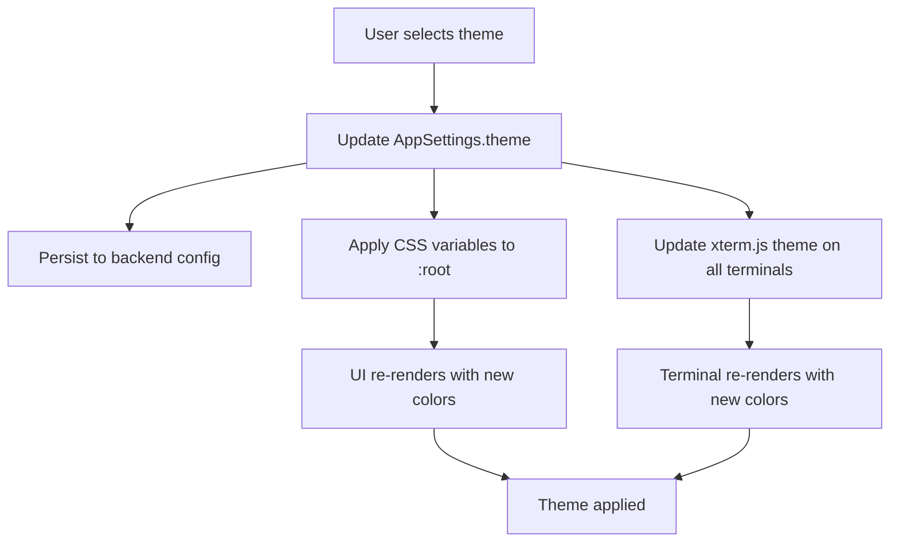

### System Theme Detection

When the user selects "System":

1. The app reads `window.matchMedia('(prefers-color-scheme: dark)')`
2. It registers a listener for changes (user changes OS dark/light mode while app is running)
3. On change, the resolved theme (dark or light) is applied automatically
4. The stored value remains `"system"` — only the applied theme changes

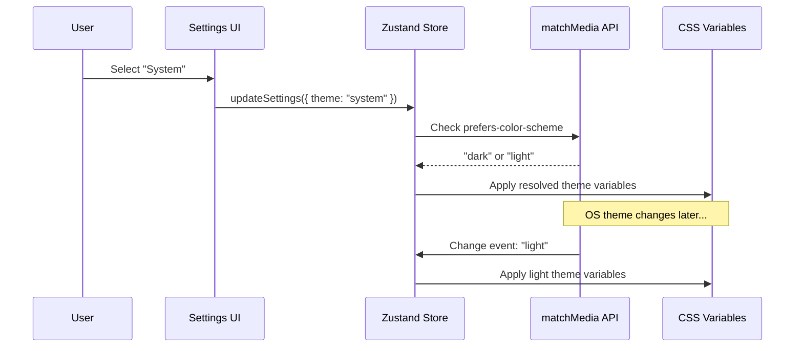

### Custom Theme Lifecycle

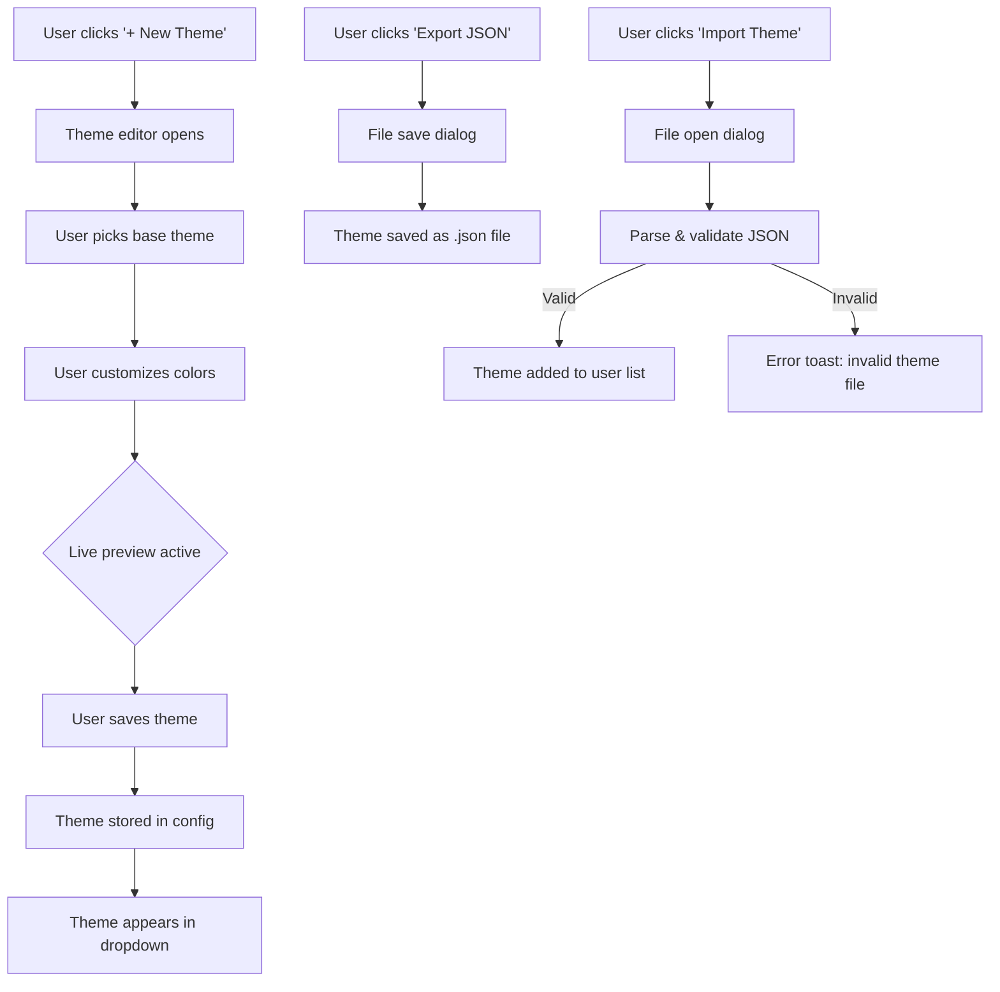

### Edge Cases

- **Deleted active theme**: If the user deletes the theme they're currently using, the app falls back to Dark
- **Imported theme name conflict**: Appends `(2)`, `(3)`, etc. to avoid collisions
- **Corrupt custom theme file**: Invalid or missing color values fall back to the base theme's defaults for those values. A warning toast notifies the user about the fallback.
- **Multiple terminals open**: All open xterm.js instances are re-themed simultaneously when the theme changes
- **Theme during connection**: Theme changes are purely cosmetic — they never interrupt active terminal sessions
- **High contrast**: Custom themes are unconstrained — users may create themes with poor contrast. A future enhancement could add WCAG contrast warnings, but this is out of scope for the initial implementation.
- **Tab colors**: Per-tab colors (from the tab coloring feature) are user-chosen and remain independent of the theme. They are not affected by theme switching.
- **Inline-styled elements**: Components like the error boundary (`App.tsx`) and agent state dots (`AgentNode.tsx`) currently use hardcoded colors. These must be refactored to use CSS variables before the theme system can work correctly.

---

## States & Sequences

### Theme System State Machine

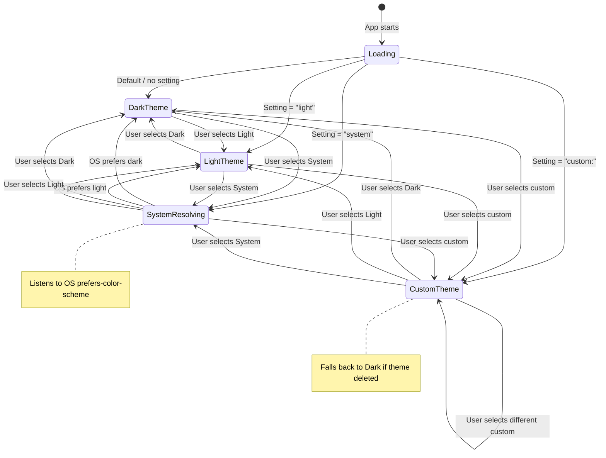

### Theme Application Sequence

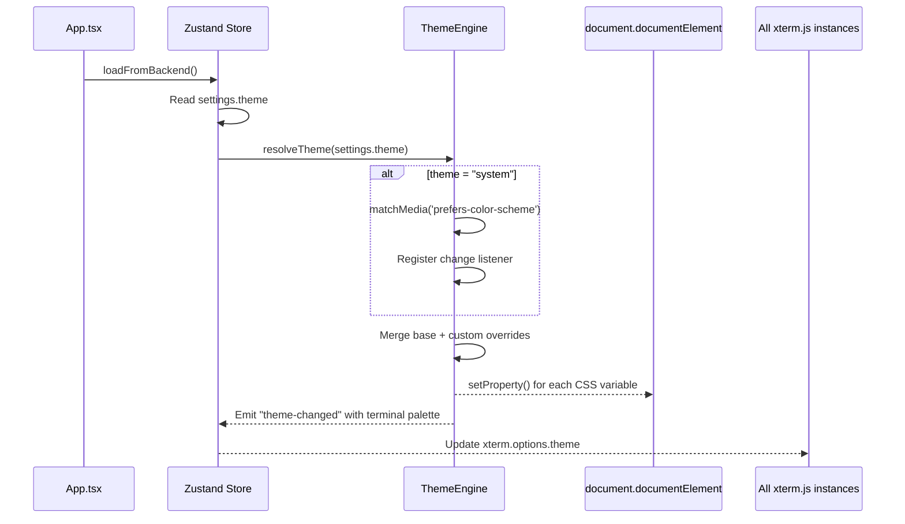

### Theme Editor State Machine

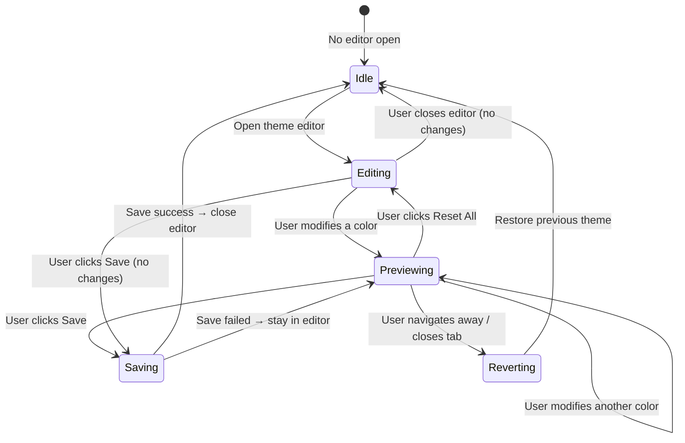

### Custom Theme Import Sequence

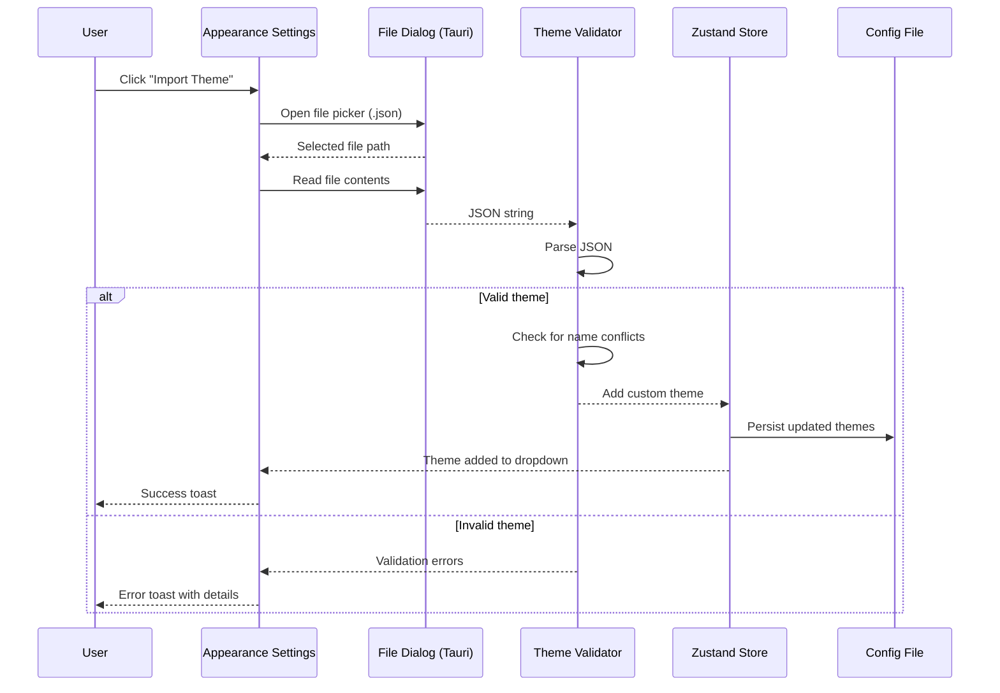

### OS Theme Change (System Mode) Sequence

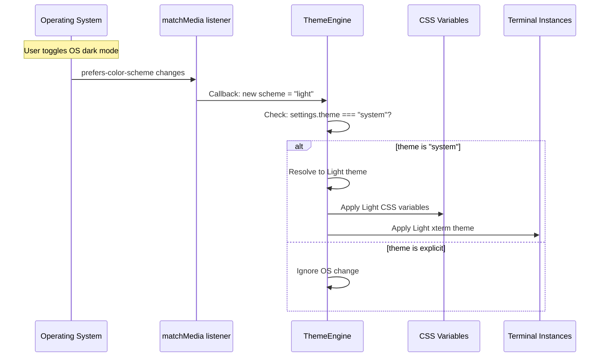

---

## Preliminary Implementation Details

Based on the current project architecture at the time of concept creation. The codebase may evolve between concept creation and implementation.

### Architecture Overview

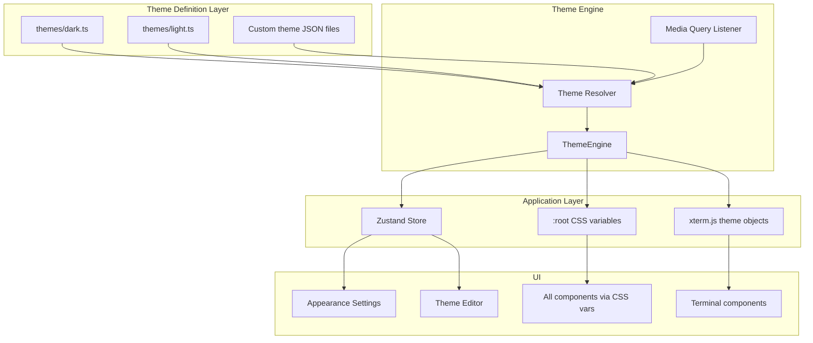

### 1. Theme Definition Format

Each theme is a TypeScript object (for built-in) or JSON file (for custom):

```typescript
interface ThemeDefinition {
  id: string; // unique identifier
  name: string; // display name
  type: "builtin" | "custom"; // cannot delete built-in themes
  baseTheme?: string; // custom themes inherit from a base
  colors: {
    // Backgrounds
    bgPrimary: string;
    bgSecondary: string;
    bgTertiary: string;
    bgHover: string;
    bgActive: string;
    bgInput: string;
    bgDropdown: string;

    // Activity bar
    activityBarBg: string;
    activityBarActive: string;
    activityBarInactive: string;
    activityBarIndicator: string;

    // Sidebar
    sidebarBg: string;
    sidebarHeaderBg: string;

    // Tab bar
    tabBg: string;
    tabActiveBg: string;
    tabBorder: string;

    // Text
    textPrimary: string;
    textSecondary: string;
    textDisabled: string;
    textAccent: string;
    textLink: string;

    // Borders
    borderPrimary: string;
    borderSecondary: string;

    // Accent
    accentColor: string;
    accentHover: string;
    focusBorder: string;

    // Status
    colorSuccess: string;
    colorWarning: string;
    colorError: string;
    colorInfo: string;

    // Terminal
    terminalBg: string;
    terminalFg: string;
    terminalCursor: string;
    terminalSelection: string;

    // Terminal ANSI (16 colors)
    ansiBlack: string;
    ansiRed: string;
    ansiGreen: string;
    ansiYellow: string;
    ansiBlue: string;
    ansiMagenta: string;
    ansiCyan: string;
    ansiWhite: string;
    ansiBrightBlack: string;
    ansiBrightRed: string;
    ansiBrightGreen: string;
    ansiBrightYellow: string;
    ansiBrightBlue: string;
    ansiBrightMagenta: string;
    ansiBrightCyan: string;
    ansiBrightWhite: string;

    // Scrollbar
    scrollbarThumb: string;
    scrollbarThumbHover: string;
  };
}
```

### 2. Built-In Theme Values

**Dark theme** (current values extracted from `variables.css` and `Terminal.tsx`):

| Token                   | Value     |
| ----------------------- | --------- |
| `bgPrimary`             | `#1e1e1e` |
| `bgSecondary`           | `#252526` |
| `bgTertiary`            | `#2d2d2d` |
| `textPrimary`           | `#cccccc` |
| `accentColor`           | `#007acc` |
| `terminalBg`            | `#1e1e1e` |
| `terminalFg`            | `#cccccc` |
| _...all current values_ |           |

**Light theme** (VS Code Light+ inspired):

| Token                  | Value                      |
| ---------------------- | -------------------------- |
| `bgPrimary`            | `#ffffff`                  |
| `bgSecondary`          | `#f3f3f3`                  |
| `bgTertiary`           | `#e8e8e8`                  |
| `bgHover`              | `#e8e8e8`                  |
| `bgActive`             | `#d6d6d6`                  |
| `bgInput`              | `#ffffff`                  |
| `bgDropdown`           | `#ffffff`                  |
| `activityBarBg`        | `#2c2c2c`                  |
| `activityBarActive`    | `#ffffff`                  |
| `activityBarInactive`  | `#858585`                  |
| `activityBarIndicator` | `#ffffff`                  |
| `sidebarBg`            | `#f3f3f3`                  |
| `sidebarHeaderBg`      | `#f3f3f3`                  |
| `tabBg`                | `#ececec`                  |
| `tabActiveBg`          | `#ffffff`                  |
| `tabBorder`            | `#f3f3f3`                  |
| `textPrimary`          | `#383a42`                  |
| `textSecondary`        | `#6a737d`                  |
| `textDisabled`         | `#a0a0a0`                  |
| `textAccent`           | `#0366d6`                  |
| `textLink`             | `#0366d6`                  |
| `borderPrimary`        | `#d1d5da`                  |
| `borderSecondary`      | `#e1e4e8`                  |
| `accentColor`          | `#0366d6`                  |
| `accentHover`          | `#0350a0`                  |
| `focusBorder`          | `#0366d6`                  |
| `colorSuccess`         | `#22863a`                  |
| `colorWarning`         | `#b08800`                  |
| `colorError`           | `#cb2431`                  |
| `colorInfo`            | `#0366d6`                  |
| `terminalBg`           | `#ffffff`                  |
| `terminalFg`           | `#383a42`                  |
| `terminalCursor`       | `#526eff`                  |
| `terminalSelection`    | `rgba(3, 102, 214, 0.2)`   |
| `ansiBlack`            | `#383a42`                  |
| `ansiRed`              | `#e45649`                  |
| `ansiGreen`            | `#50a14f`                  |
| `ansiYellow`           | `#c18401`                  |
| `ansiBlue`             | `#4078f2`                  |
| `ansiMagenta`          | `#a626a4`                  |
| `ansiCyan`             | `#0184bc`                  |
| `ansiWhite`            | `#fafafa`                  |
| `ansiBrightBlack`      | `#4f525e`                  |
| `ansiBrightRed`        | `#e06c75`                  |
| `ansiBrightGreen`      | `#98c379`                  |
| `ansiBrightYellow`     | `#e5c07b`                  |
| `ansiBrightBlue`       | `#61afef`                  |
| `ansiBrightMagenta`    | `#c678dd`                  |
| `ansiBrightCyan`       | `#56b6c2`                  |
| `ansiBrightWhite`      | `#ffffff`                  |
| `scrollbarThumb`       | `rgba(100, 100, 100, 0.3)` |
| `scrollbarThumbHover`  | `rgba(100, 100, 100, 0.5)` |

### 3. File Structure

```
src/
  themes/
    types.ts              # ThemeDefinition interface
    dark.ts               # Built-in dark theme definition
    light.ts              # Built-in light theme definition
    engine.ts             # ThemeEngine: applies themes, manages listeners
    index.ts              # Re-exports
  components/
    Settings/
      AppearanceSettings.tsx   # Theme dropdown + import button
    ThemeEditor/
      ThemeEditor.tsx          # Theme editor tab component
      ThemeEditor.css
      ColorGroup.tsx           # Grouped color swatches
      ThemePreviewTooltip.tsx  # Hover preview for theme dropdown
  types/
    connection.ts              # AppSettings gets theme field
  store/
    appStore.ts                # Theme state + resolvedTheme
```

### 4. AppSettings Changes

Extend the `AppSettings` interface in `src/types/connection.ts`:

```typescript
export interface AppSettings {
  version: string;
  externalConnectionFiles: ExternalFileConfig[];
  powerMonitoringEnabled: boolean;
  fileBrowserEnabled: boolean;
  // New: theme selection
  theme?: "dark" | "light" | "system" | `custom:${string}`;
  // New: user-defined custom themes
  customThemes?: ThemeDefinition[];
}
```

The `theme` field defaults to `"dark"` when absent (backward compatible). Custom theme references use the `custom:<id>` prefix pattern.

### 5. ThemeEngine Implementation

The `ThemeEngine` is a singleton module (not a React component) that:

1. **Resolves** the active theme from settings (handling `"system"` via `matchMedia`)
2. **Applies** CSS variables to `document.documentElement.style`
3. **Exposes** the resolved xterm.js theme object for terminal components to consume
4. **Listens** for OS theme changes when in `"system"` mode

```typescript
// src/themes/engine.ts (pseudocode)
class ThemeEngine {
  private mediaQuery: MediaQueryList | null = null;
  private currentThemeId: string = "dark";

  applyTheme(themeSetting: string, customThemes: ThemeDefinition[]): void {
    const resolved = this.resolve(themeSetting, customThemes);
    this.setCssVariables(resolved.colors);
    this.currentThemeId = resolved.id;
  }

  getXtermTheme(): ITheme {
    // Returns current theme's terminal colors as xterm ITheme
  }

  private resolve(setting: string, customs: ThemeDefinition[]): ThemeDefinition {
    if (setting === "system") {
      return this.mediaQuery?.matches ? darkTheme : lightTheme;
    }
    if (setting === "light") return lightTheme;
    if (setting.startsWith("custom:")) {
      const id = setting.slice(7);
      const custom = customs.find((t) => t.id === id);
      return custom ? this.mergeWithBase(custom) : darkTheme;
    }
    return darkTheme;
  }

  private setCssVariables(colors: ThemeDefinition["colors"]): void {
    const root = document.documentElement;
    root.style.setProperty("--bg-primary", colors.bgPrimary);
    root.style.setProperty("--bg-secondary", colors.bgSecondary);
    // ... all CSS variable mappings
  }
}
```

### 6. Refactoring Hardcoded Colors

Before the theme system can work end-to-end, these hardcoded color locations must be refactored:

| Location                     | Current                                                      | Change                                                                                 |
| ---------------------------- | ------------------------------------------------------------ | -------------------------------------------------------------------------------------- |
| `Terminal.tsx:240-262`       | Hardcoded xterm theme object                                 | Read from `ThemeEngine.getXtermTheme()`                                                |
| `AgentNode.tsx:39-44`        | Hardcoded state dot colors (`#0dbc79`, `#e5e510`, `#cd3131`) | Use CSS variables `var(--color-success)`, `var(--color-warning)`, `var(--color-error)` |
| `TabBar.css:111-122`         | Hardcoded state dot colors in CSS                            | Use CSS variables                                                                      |
| `App.tsx:35-60`              | Inline error boundary styles                                 | Use CSS class with CSS variables                                                       |
| `ColorPickerDialog.tsx:6-15` | Hardcoded preset color swatches                              | These are independent of the theme (user-chosen tab colors) — no change needed         |

### 7. CSS Variable Application Strategy

Rather than maintaining separate CSS files per theme, the theme engine writes CSS variables directly to `:root` via JavaScript. This approach:

- Avoids CSS file duplication
- Works with dynamic custom themes (no build step needed)
- Keeps a single `variables.css` as the default/fallback (dark theme)
- Is the same approach VS Code uses internally

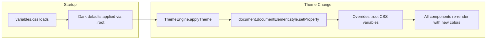

### 8. Terminal Theme Integration

The xterm.js terminal needs special handling since it doesn't use CSS variables directly. The approach:

1. `ThemeEngine` exposes a `getXtermTheme()` method returning an xterm `ITheme` object
2. When the theme changes, the store emits an event (or the `useTerminal` hook subscribes to theme state)
3. Each `Terminal.tsx` instance calls `xterm.options.theme = ThemeEngine.getXtermTheme()` to update live

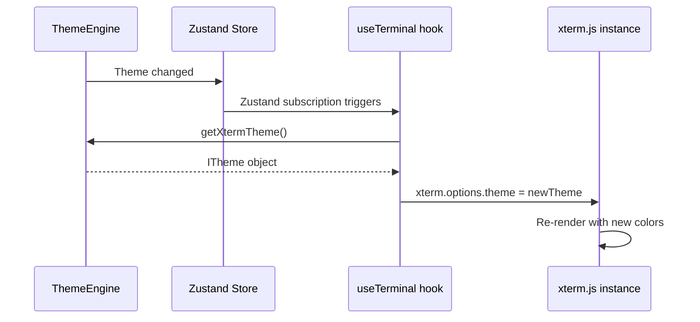

### 9. Custom Theme File Format (JSON)

Exported/imported theme files use this JSON structure:

```json
{
  "$schema": "termihub-theme-v1",
  "name": "My Custom Theme",
  "baseTheme": "dark",
  "colors": {
    "bgPrimary": "#1a1b26",
    "textPrimary": "#a9b1d6",
    "accentColor": "#7aa2f7"
  }
}
```

Only overridden colors need to be specified — missing values inherit from `baseTheme`. The `$schema` field enables future format versioning.

### 10. Migration & Backward Compatibility

- The `theme` field in `AppSettings` is optional with a default of `"dark"`
- Existing config files without a `theme` field continue to work — the app behaves exactly as before
- The `customThemes` array is optional and defaults to empty
- No backend migration is needed — the Rust `AppSettings` struct just gains optional fields

### 11. Implementation Order

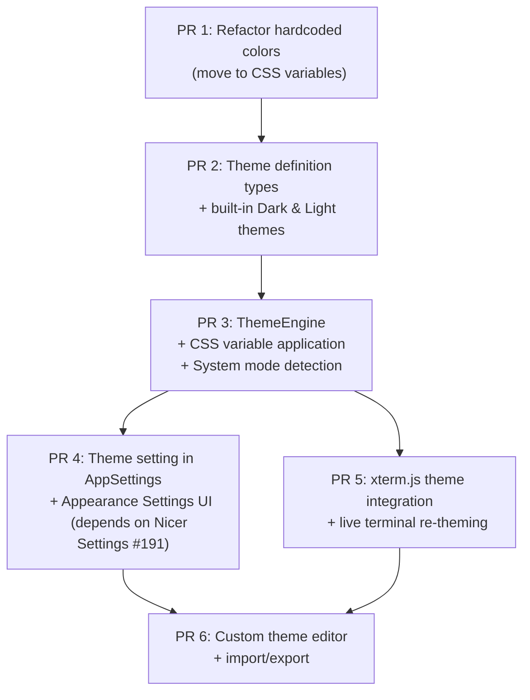

1. **PR 1 — Hardcoded color refactoring**: Move all hardcoded colors to CSS variables. This PR has zero visual change but unblocks theming.
2. **PR 2 — Theme definitions**: Create the `ThemeDefinition` type and the two built-in theme objects (Dark + Light).
3. **PR 3 — ThemeEngine**: Implement the engine that applies themes via CSS variables and handles `"system"` mode.
4. **PR 4 — Settings UI**: Add the theme dropdown to Appearance settings (requires Nicer Settings #191).
5. **PR 5 — Terminal integration**: Wire xterm.js instances to the ThemeEngine for live re-theming.
6. **PR 6 — Custom themes**: Theme editor tab, import/export, custom theme persistence.

PRs 4 and 5 can be developed in parallel after PR 3 is merged.
