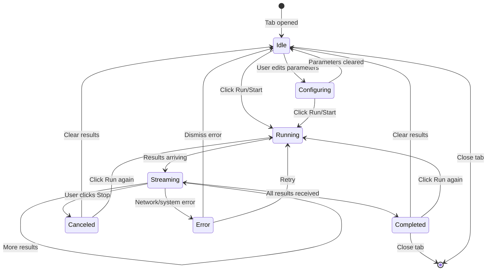
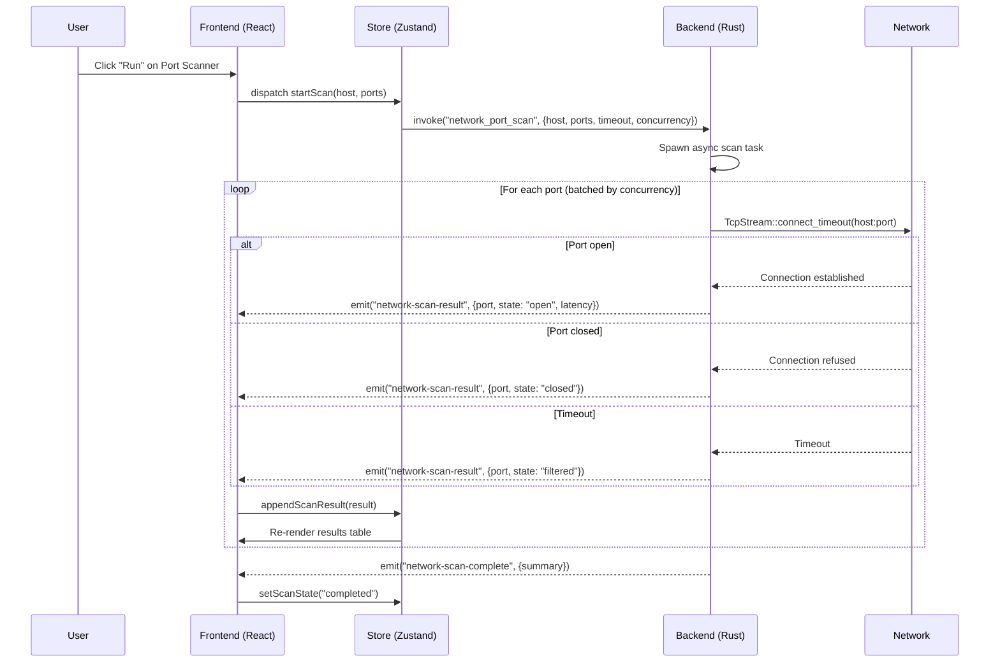
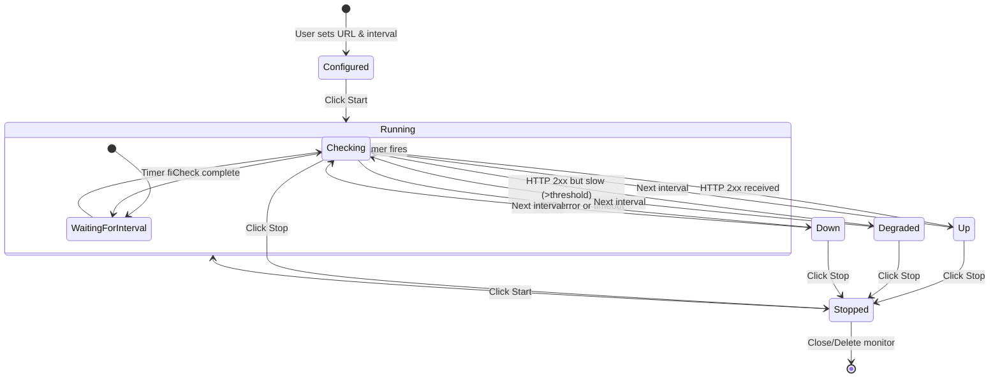
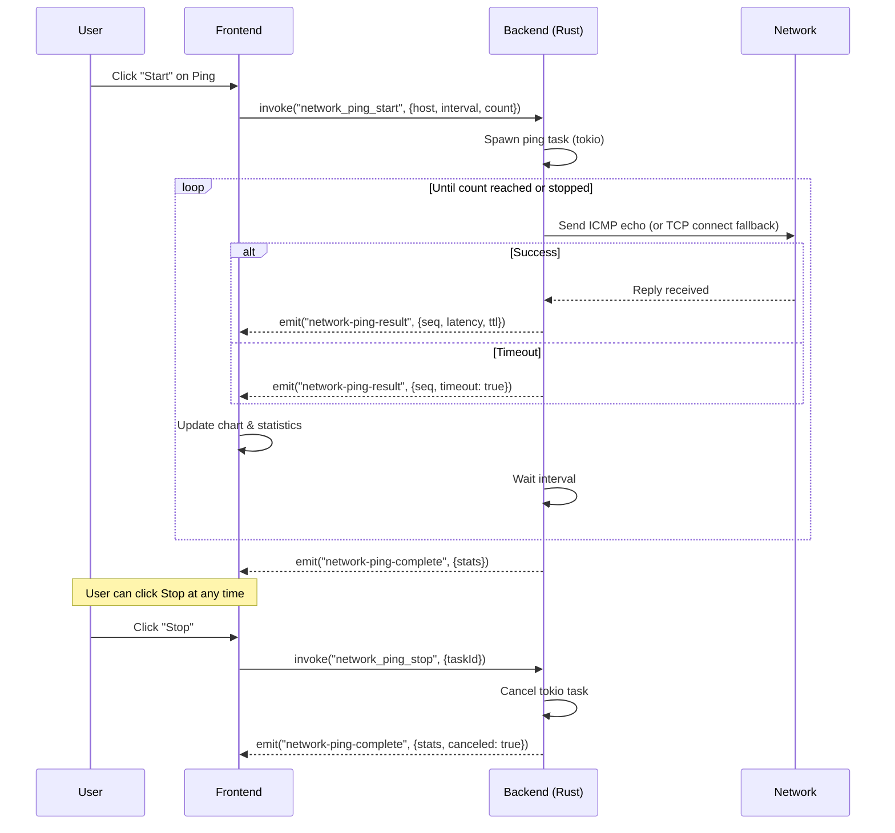
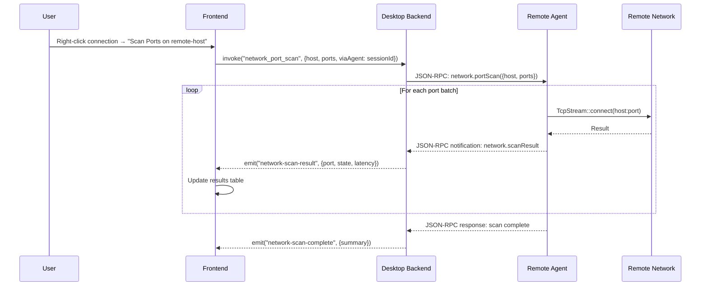
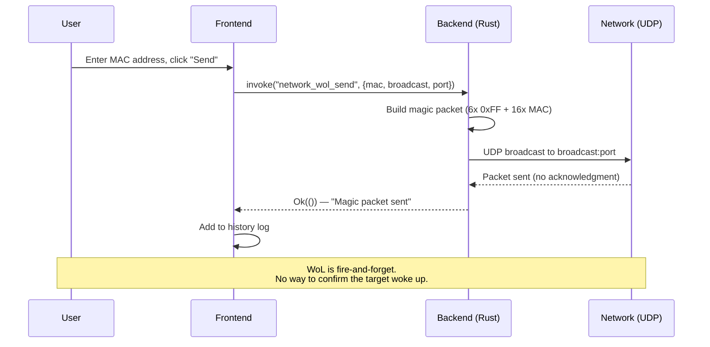
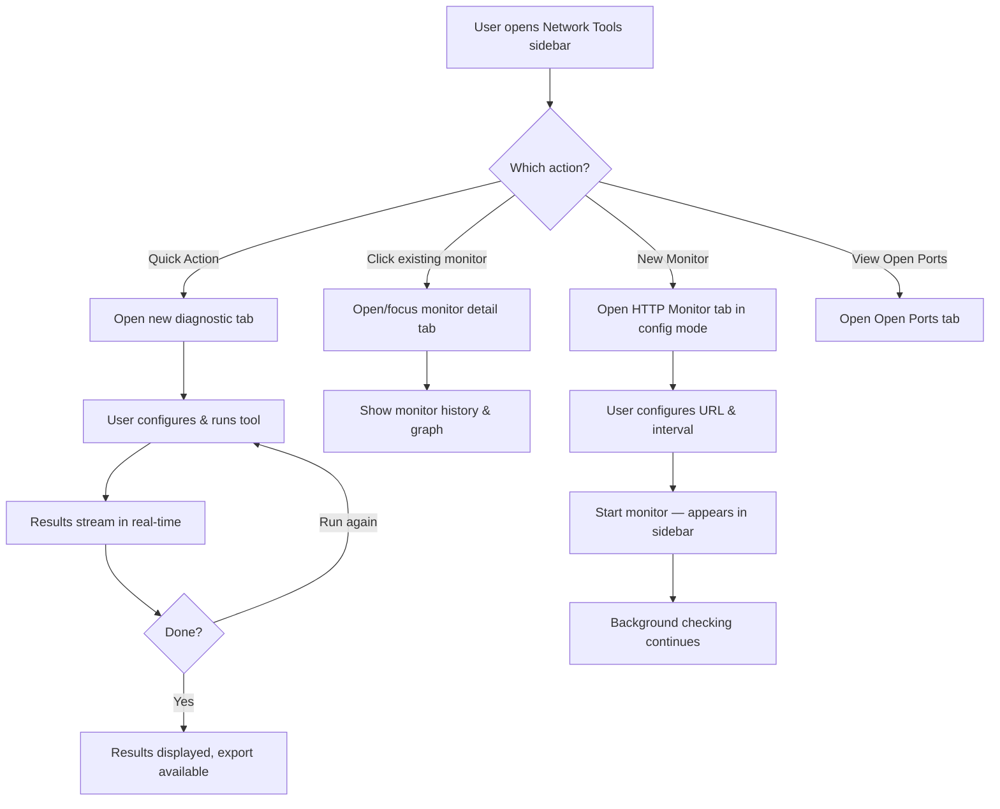
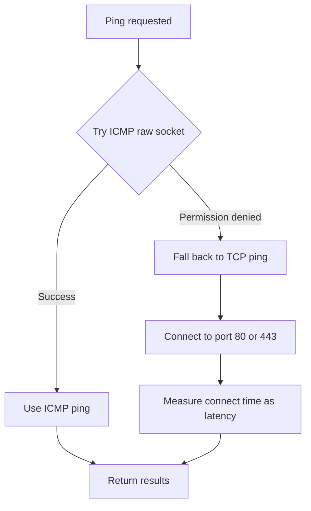
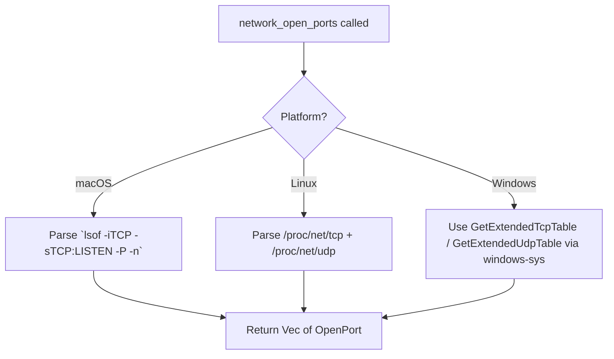

# Built-in Network Diagnostic Utilities

> GitHub Issue: [#525](https://github.com/armaxri/termiHub/issues/525)

## Overview

Add built-in network diagnostic tools to termiHub — port scanning, open ports viewer, ping/traceroute, HTTP monitoring, bandwidth testing, DNS lookup, and Wake-on-LAN — accessible from the UI without requiring external CLI tools.

**Motivation**: Terminal applications like MobaXterm bundle network utilities (TCPCapture, MobaListPorts, httping, iperf) that let users troubleshoot network issues without switching tools. termiHub already has SSH system monitoring; network diagnostics complement this with connection-level and host-level troubleshooting.

**Key goals**:

- **Zero-install diagnostics**: Run common network checks directly from the UI without installing external tools
- **Visual output**: Latency graphs, color-coded status, real-time streaming results — not just raw text
- **Context-aware**: Launch diagnostics pre-filled with hosts/ports from existing connections
- **Cross-platform**: All tools work on Windows, macOS, and Linux using Rust's networking APIs
- **Privilege-aware**: Gracefully handle tools that need elevated permissions (e.g., raw sockets for ICMP)

### Tool Priority

| Priority | Tool              | Description                                                   |
| -------- | ----------------- | ------------------------------------------------------------- |
| P0       | Port Scanner      | TCP connect scan on specific host:port ranges                 |
| P0       | Open Ports Viewer | List listening ports on the local machine                     |
| P0       | Ping              | ICMP echo with latency graph over time                        |
| P1       | DNS Lookup        | Resolve hostnames, show A/AAAA/MX/CNAME records               |
| P1       | HTTP Monitor      | Periodic HTTP requests with response time and status tracking |
| P2       | Traceroute        | Hop-by-hop path with latency per hop                          |
| P2       | Wake-on-LAN       | Send magic packets to wake remote machines                    |
| P3       | Bandwidth Test    | iperf-like client/server for throughput measurement           |

## UI Interface

### Activity Bar & Sidebar

A new **Network Tools** entry appears in the Activity Bar with a `Stethoscope` (or `Activity`) icon. Clicking it opens the Network Tools sidebar.

```
┌─────────────────────────────────┐
│ NETWORK TOOLS                   │
│                                 │
│ ─── Quick Actions ───           │
│  ▶ Ping Host...                 │
│  ▶ Scan Ports...                │
│  ▶ DNS Lookup...                │
│  ▶ Wake-on-LAN...               │
│                                 │
│ ─── Monitors ───                │
│  ● HTTP Monitor: api.example    │
│    200 OK — 142ms (running)     │
│  ○ HTTP Monitor: staging        │
│    (stopped)                    │
│                                 │
│ ─── Local ───                   │
│  ▶ View Open Ports              │
│                                 │
│ [+ New Monitor]                 │
└─────────────────────────────────┘
```

The sidebar has three sections:

1. **Quick Actions** — one-click launchers that open a diagnostic tab with a form
2. **Monitors** — persistent HTTP monitors showing live status with start/stop controls
3. **Local** — local machine utilities (open ports viewer)

Right-clicking a connection in the Connections sidebar adds a context menu entry **"Network Diagnostics ▸"** with sub-items:

- Ping `<host>`
- Scan Ports on `<host>`
- DNS Lookup `<host>`

These open the corresponding tool tab pre-filled with the connection's host.

### Diagnostic Tabs

Each diagnostic tool opens as a **tab** (new `TabContentType: "network-diagnostic"`), similar to the Settings or Log Viewer tabs. Multiple diagnostic tabs can be open simultaneously.

#### Common Tab Layout

Every diagnostic tab follows a consistent layout:

```
┌─────────────────────────────────────────────────────────────┐
│ 🔍 Port Scanner                                    [▶ Run] │
│─────────────────────────────────────────────────────────────│
│ Host: [192.168.1.1        ]  Ports: [22,80,443,8080  ]     │
│ Timeout: [2000ms ▾]          Threads: [100 ▾]              │
│─────────────────────────────────────────────────────────────│
│ Results                                          [Export ↓] │
│                                                             │
│  PORT    STATE     SERVICE    LATENCY                       │
│  22      ● Open    ssh        12ms                          │
│  80      ● Open    http       8ms                           │
│  443     ● Open    https      9ms                           │
│  8080    ○ Closed  —          —                             │
│                                                             │
│  Scanned 4 ports in 2.1s — 3 open, 1 closed                │
└─────────────────────────────────────────────────────────────┘
```

Structure: **header** (tool name + run button) → **input form** (tool-specific parameters) → **results area** (streaming output with export).

#### Ping Tab

```
┌─────────────────────────────────────────────────────────────┐
│ 📶 Ping                                   [▶ Start] [Stop] │
│─────────────────────────────────────────────────────────────│
│ Host: [example.com       ]  Count: [∞ ▾]  Interval: [1s ▾] │
│─────────────────────────────────────────────────────────────│
│ Latency Graph                                               │
│  50ms ┤                                                     │
│  40ms ┤          ╭─╮                                        │
│  30ms ┤    ╭─╮╭──╯ ╰──╮                                    │
│  20ms ┤╭───╯ ╰╯       ╰──╮     ╭──╮                        │
│  10ms ┤╯                  ╰─────╯  ╰──                      │
│   0ms ┤─────────────────────────────────                    │
│       └──────────────────────────────── time →              │
│                                                             │
│ Statistics: sent=24 recv=24 loss=0%                          │
│ RTT: min=11ms avg=23ms max=47ms jitter=8ms                  │
└─────────────────────────────────────────────────────────────┘
```

Features:

- Real-time latency line chart (last 60 seconds visible, scrollable)
- Running statistics below the chart
- Continuous mode (infinite) or fixed count
- Color-coded: green for normal latency, yellow for high, red for packet loss

#### Open Ports Viewer Tab

```
┌─────────────────────────────────────────────────────────────┐
│ 🖥 Open Ports                              [↻ Refresh]      │
│─────────────────────────────────────────────────────────────│
│ Filter: [          ] Protocol: [All ▾] State: [Listening ▾] │
│─────────────────────────────────────────────────────────────│
│  PROTO  LOCAL ADDRESS       PID     PROCESS                 │
│  TCP    0.0.0.0:22          1234    sshd                    │
│  TCP    127.0.0.1:5432      5678    postgres                │
│  TCP    0.0.0.0:8080        9012    node                    │
│  UDP    0.0.0.0:5353        345     mDNSResponder           │
│  TCP    :::443              6789    nginx                   │
│                                                             │
│  5 listening ports                                          │
└─────────────────────────────────────────────────────────────┘
```

#### DNS Lookup Tab

```
┌─────────────────────────────────────────────────────────────┐
│ 🔤 DNS Lookup                                      [▶ Run] │
│─────────────────────────────────────────────────────────────│
│ Hostname: [example.com     ]  Type: [A ▾]  Server: [auto ] │
│─────────────────────────────────────────────────────────────│
│ Results                                     Query time: 12ms│
│                                                             │
│  TYPE   NAME              VALUE              TTL            │
│  A      example.com       93.184.216.34      3600           │
│  A      example.com       93.184.216.35      3600           │
│  AAAA   example.com       2606:2800:220:1::  3600           │
│                                                             │
│ ─── Additional Records ───                                  │
│  NS     example.com       a.iana-servers.net 172800         │
│  NS     example.com       b.iana-servers.net 172800         │
└─────────────────────────────────────────────────────────────┘
```

Record type selector: A, AAAA, MX, CNAME, NS, TXT, SRV, SOA, PTR, ANY.

#### HTTP Monitor Tab

```
┌─────────────────────────────────────────────────────────────┐
│ 🌐 HTTP Monitor                            [▶ Start] [Stop]│
│─────────────────────────────────────────────────────────────│
│ URL: [https://api.example.com/health]  Interval: [30s ▾]   │
│ Method: [GET ▾]  Expected Status: [200]  Timeout: [5s ▾]   │
│─────────────────────────────────────────────────────────────│
│ Status: ● UP (200 OK)             Uptime: 99.7% (24h)      │
│                                                             │
│ Response Time Graph                                         │
│ 500ms ┤                                                     │
│ 400ms ┤                                                     │
│ 300ms ┤      ╭╮                                             │
│ 200ms ┤  ╭╮╭─╯╰╮    ╭╮                                     │
│ 100ms ┤──╯╰╯   ╰────╯╰───────                              │
│   0ms ┤─────────────────────────                            │
│       └─────────────────────────── time →                   │
│                                                             │
│ History (last 10)                                           │
│  12:30:00  200 OK     142ms                                 │
│  12:29:30  200 OK     138ms                                 │
│  12:29:00  200 OK     312ms  ⚠ slow                        │
│  12:28:30  503 Error  —      ✗ down                         │
└─────────────────────────────────────────────────────────────┘
```

#### Traceroute Tab

```
┌─────────────────────────────────────────────────────────────┐
│ 🗺 Traceroute                                      [▶ Run] │
│─────────────────────────────────────────────────────────────│
│ Host: [example.com       ]  Max Hops: [30 ▾]               │
│─────────────────────────────────────────────────────────────│
│  HOP  HOST                    RTT1    RTT2    RTT3          │
│  1    router.local            1ms     1ms     1ms           │
│  2    isp-gw.example.net      8ms     9ms     8ms           │
│  3    core-rtr.isp.net        15ms    14ms    16ms          │
│  4    * * *                   —       —       —             │
│  5    peer.cdn.net            22ms    23ms    22ms          │
│  6    93.184.216.34           28ms    27ms    29ms          │
│                                                             │
│  Trace complete: 6 hops, avg 28ms                           │
└─────────────────────────────────────────────────────────────┘
```

#### Wake-on-LAN Tab

```
┌─────────────────────────────────────────────────────────────┐
│ ⏻ Wake-on-LAN                                     [▶ Send] │
│─────────────────────────────────────────────────────────────│
│ MAC Address: [AA:BB:CC:DD:EE:FF]                            │
│ Broadcast:   [255.255.255.255  ]  Port: [9   ]             │
│                                                             │
│ ─── Saved Devices ───                                       │
│  Dev Server    AA:BB:CC:DD:EE:FF    [Wake] [Edit] [Delete] │
│  NAS           11:22:33:44:55:66    [Wake] [Edit] [Delete] │
│                                                             │
│ [+ Save Current]                                            │
│                                                             │
│ History:                                                    │
│  12:30:15  Sent magic packet to AA:BB:CC:DD:EE:FF           │
│  12:25:00  Sent magic packet to 11:22:33:44:55:66           │
└─────────────────────────────────────────────────────────────┘
```

### Theme Integration

All diagnostic tabs use the existing theme system (CSS variables). Charts use theme-aware colors:

- `--vscode-charts-green` for success/open
- `--vscode-charts-red` for failure/closed
- `--vscode-charts-yellow` for warnings/slow
- `--vscode-editor-foreground` for text and axes

## General Handling

### User Journeys

#### Quick Diagnostic from Sidebar

1. User clicks **Network Tools** in the Activity Bar
2. Clicks **"Ping Host..."** in Quick Actions
3. A new Ping tab opens in the main area
4. User types hostname, clicks **Start**
5. Real-time latency graph streams results
6. User clicks **Stop** when done, or closes the tab

#### Context-Aware Diagnostic from Connection

1. User right-clicks an SSH connection in the Connections sidebar
2. Selects **"Network Diagnostics" → "Scan Ports on dev-server.example.com"**
3. A Port Scanner tab opens pre-filled with `dev-server.example.com`
4. User adjusts port range if needed, clicks **Run**
5. Results stream in as ports are scanned

#### Persistent HTTP Monitoring

1. User opens Network Tools sidebar, clicks **"+ New Monitor"**
2. Fills in URL, interval, expected status
3. Clicks **Start** — the monitor appears in the sidebar's Monitors section with live status
4. Monitor persists across tab switches (runs in the backend)
5. If the status changes (e.g., 200 → 503), a notification appears
6. User can click the monitor entry to open its detail tab

#### Remote Diagnostics via Agent

1. User has an SSH connection with the remote agent deployed
2. Right-clicks the connection → "Network Diagnostics" → "View Open Ports"
3. The Open Ports Viewer tab opens, showing ports on the **remote** machine
4. Backend routes the request through the agent's JSON-RPC protocol

### Edge Cases & Error Handling

| Scenario                       | Handling                                                                                                               |
| ------------------------------ | ---------------------------------------------------------------------------------------------------------------------- |
| **ICMP requires root/admin**   | Fall back to TCP ping (connect to port 80/443). Show info banner: "Using TCP ping — ICMP requires elevated privileges" |
| **Host unreachable**           | Show clear error with suggestion: "Host unreachable. Check hostname and network connectivity."                         |
| **Scan canceled mid-run**      | Stop immediately, show partial results with "(scan canceled)" footer                                                   |
| **Very large port range**      | Warn before starting: "Scanning 65535 ports may take several minutes. Continue?"                                       |
| **No network connection**      | Detect offline state, show "No network connection" banner on all tools                                                 |
| **Remote agent not available** | Fall back to desktop-side execution where possible; show "Agent required" for remote-only tools                        |
| **Firewall blocks results**    | Results show as "filtered" rather than "closed" when connection times out vs refused                                   |
| **HTTP monitor target down**   | Visual indicator changes (red dot), optional desktop notification                                                      |
| **Rate limiting**              | Configurable concurrent connections for port scanner (default: 100)                                                    |
| **IPv6 support**               | All tools support both IPv4 and IPv6 addresses                                                                         |

### Export & Sharing

All diagnostic results can be exported:

- **Copy to clipboard** — plain text summary
- **Export as CSV** — tabular results (port scan, DNS, open ports)
- **Export as JSON** — structured data for scripting
- **Screenshot** — for graphs (ping, HTTP monitor) via canvas-to-image

## States & Sequences

### Diagnostic Tool Lifecycle



### Port Scan Sequence



### HTTP Monitor Lifecycle



### Ping Continuous Flow



### Remote Diagnostics via Agent



### Wake-on-LAN Flow



### Tab & Sidebar Interaction



## Preliminary Implementation Details

> Based on the current project architecture as of the time of concept creation. The codebase may evolve before implementation.

### Backend (Rust)

#### New Module: `src-tauri/src/network/`

```
src-tauri/src/network/
  mod.rs           # NetworkManager — holds active tasks, monitors
  port_scan.rs     # TCP connect scanner with configurable concurrency
  ping.rs          # ICMP ping (via `surge-ping` crate) with TCP fallback
  dns.rs           # DNS resolver (via `trust-dns-resolver` / `hickory-resolver`)
  http_monitor.rs  # Periodic HTTP checker with history
  traceroute.rs    # TTL-based traceroute
  wol.rs           # Wake-on-LAN magic packet sender
  open_ports.rs    # Local listening ports (platform-specific)
```

#### Key Crate Dependencies

| Crate                                   | Purpose                                                        |
| --------------------------------------- | -------------------------------------------------------------- |
| `surge-ping`                            | Cross-platform ICMP ping (raw sockets)                         |
| `hickory-resolver` (formerly trust-dns) | Async DNS resolution with record types                         |
| `reqwest`                               | HTTP client for HTTP monitor (already in workspace)            |
| `tokio`                                 | Async runtime for concurrent operations (already in workspace) |
| `netstat2` or platform APIs             | List local open ports with process info                        |
| `socket2`                               | Low-level socket operations for WoL, traceroute                |

#### Tauri Commands (`src-tauri/src/commands/network.rs`)

```rust
// Port scanning
#[tauri::command] fn network_port_scan(host, ports, timeout, concurrency, manager) -> Result<String>  // returns task_id
#[tauri::command] fn network_port_scan_cancel(task_id, manager) -> Result<()>

// Ping
#[tauri::command] fn network_ping_start(host, interval, count, manager) -> Result<String>  // returns task_id
#[tauri::command] fn network_ping_stop(task_id, manager) -> Result<()>

// DNS
#[tauri::command] fn network_dns_lookup(hostname, record_type, server, manager) -> Result<DnsResult>

// HTTP Monitor
#[tauri::command] fn network_http_monitor_start(url, interval, method, expected_status, manager) -> Result<String>
#[tauri::command] fn network_http_monitor_stop(monitor_id, manager) -> Result<()>
#[tauri::command] fn network_http_monitor_list(manager) -> Result<Vec<HttpMonitorState>>

// Traceroute
#[tauri::command] fn network_traceroute(host, max_hops, manager) -> Result<String>  // returns task_id
#[tauri::command] fn network_traceroute_cancel(task_id, manager) -> Result<()>

// Wake-on-LAN
#[tauri::command] fn network_wol_send(mac, broadcast, port) -> Result<()>
#[tauri::command] fn network_wol_devices_list(manager) -> Result<Vec<WolDevice>>
#[tauri::command] fn network_wol_device_save(device, manager) -> Result<()>
#[tauri::command] fn network_wol_device_delete(device_id, manager) -> Result<()>

// Open Ports
#[tauri::command] fn network_open_ports(manager) -> Result<Vec<OpenPort>>
```

#### Event-Based Streaming

Long-running tools (port scan, ping, traceroute, HTTP monitor) use Tauri events to stream results to the frontend, following the same pattern as terminal output:

- `network-scan-result` — individual port result
- `network-scan-complete` — scan finished
- `network-ping-result` — individual ping response
- `network-ping-complete` — ping session ended
- `network-traceroute-hop` — individual hop result
- `network-traceroute-complete` — trace finished
- `network-http-monitor-check` — individual check result

#### NetworkManager State

```rust
pub struct NetworkManager {
    active_tasks: HashMap<String, JoinHandle<()>>,
    http_monitors: HashMap<String, HttpMonitorHandle>,
    wol_devices: Vec<WolDevice>,  // persisted to disk
    app_handle: AppHandle,        // for emitting events
}
```

Registered as Tauri managed state alongside existing managers (ConnectionManager, MonitoringManager, TunnelManager).

#### ICMP Privilege Handling



On macOS, `surge-ping` works without root for unprivileged ICMP. On Linux, it requires `CAP_NET_RAW` or `sysctl net.ipv4.ping_group_range`. On Windows, ICMP is available via `IcmpSendEcho` without admin. The backend attempts ICMP first and transparently falls back to TCP connect-based ping.

#### Open Ports: Platform Abstraction



#### Remote Agent Extension

For remote diagnostics, extend the agent's JSON-RPC protocol (`agent/src/protocol/methods.rs`) with a `network.*` namespace:

- `network.portScan` — scan ports from the agent's perspective
- `network.ping` — ping from the remote machine
- `network.openPorts` — list open ports on the remote machine
- `network.dnsLookup` — resolve DNS from the remote machine

The desktop backend proxies these requests through the existing agent session when `viaAgent: sessionId` is specified.

### Frontend (React/TypeScript)

#### New Components

```
src/components/NetworkTools/
  NetworkToolsSidebar.tsx    # Sidebar panel (Quick Actions, Monitors, Local)
  PortScannerPanel.tsx       # Port scanner tab content
  PingPanel.tsx              # Ping tab content with chart
  DnsLookupPanel.tsx         # DNS lookup tab content
  HttpMonitorPanel.tsx       # HTTP monitor tab content with chart
  TraceroutePanel.tsx        # Traceroute tab content
  WolPanel.tsx               # Wake-on-LAN tab content
  OpenPortsPanel.tsx         # Open ports viewer tab content
  LatencyChart.tsx           # Reusable latency line chart component
  DiagnosticResultsTable.tsx # Reusable results table with export
```

#### Store Extensions (`src/store/appStore.ts`)

- Add `"network-tools"` to `SidebarView` type
- Add `openNetworkDiagnosticTab(tool, meta?)` action following the `openSettingsTab` pattern
- Add HTTP monitor state slice: `httpMonitors: HttpMonitorState[]`

#### Types (`src/types/network.ts`)

New type file for network diagnostic types:

- `NetworkTool` — union type: `"port-scanner" | "ping" | "dns-lookup" | "http-monitor" | "traceroute" | "wol" | "open-ports"`
- `PortScanResult`, `PingResult`, `DnsResult`, `HttpCheckResult`, `TracerouteHop`, `OpenPort`, `WolDevice`
- `NetworkDiagnosticMeta` — tab metadata: `{ tool: NetworkTool, host?: string, connectionId?: string }`

#### Tab Content Type

Extend `TabContentType` with `"network-diagnostic"`. Extend `TerminalTab` with `networkDiagnosticMeta?: NetworkDiagnosticMeta`. Add rendering branch in `SplitView.tsx`:

```typescript
tab.contentType === "network-diagnostic" && tab.networkDiagnosticMeta ? (
  <NetworkDiagnosticPanel
    key={tab.id}
    meta={tab.networkDiagnosticMeta}
    isVisible={tab.id === panel.activeTabId}
  />
)
```

`NetworkDiagnosticPanel` is a router component that renders the appropriate tool panel based on `meta.tool`.

#### API Layer (`src/services/api.ts`)

Add wrapper functions for all `network_*` Tauri commands following existing patterns. Add event listeners for streaming results via `listen()` from `@tauri-apps/api/event`.

#### Charting

Use a lightweight chart library for latency graphs. Candidates:

- **uPlot** — minimal, fast, good for real-time time-series (preferred for performance)
- **Chart.js** — well-known, more features but heavier
- Canvas-based custom chart — maximum control, no dependency

The chart component (`LatencyChart.tsx`) should support:

- Real-time append of new data points
- Auto-scrolling time axis
- Threshold lines (e.g., "acceptable latency" marker)
- Theme-aware colors from CSS variables

### Data Persistence

| Data                 | Storage          | Location                         |
| -------------------- | ---------------- | -------------------------------- |
| WoL saved devices    | JSON file        | `~/.termihub/wol-devices.json`   |
| HTTP monitor configs | JSON file        | `~/.termihub/http-monitors.json` |
| Diagnostic results   | Not persisted    | In-memory only (tab lifetime)    |
| Export files         | User-chosen path | Via Tauri save dialog            |

### Implementation Phases

```mermaid
gantt
    title Network Utilities Implementation Phases
    dateFormat X
    axisFormat %s

    section Phase 1 — Core
    Backend NetworkManager & infrastructure :a1, 0, 2
    Port Scanner (backend + frontend)      :a2, 2, 3
    Open Ports Viewer                      :a3, 3, 2
    Ping with TCP fallback                 :a4, 3, 3

    section Phase 2 — Extended
    DNS Lookup                             :b1, 6, 2
    HTTP Monitor                           :b2, 6, 3
    Sidebar & Activity Bar integration     :b3, 8, 2

    section Phase 3 — Advanced
    Traceroute                             :c1, 10, 2
    Wake-on-LAN                            :c2, 10, 2
    Latency charting (uPlot)               :c3, 10, 3
    Export functionality                   :c4, 12, 1

    section Phase 4 — Remote
    Agent protocol extension               :d1, 13, 2
    Remote diagnostics via agent           :d2, 15, 3
    Context menu integration               :d3, 15, 2
```



### Security Considerations

- **Port scanning**: Only TCP connect scans — no SYN/stealth scans that require raw sockets. Users are responsible for ensuring they have permission to scan target hosts.
- **No packet capture**: Excluded from scope. Packet capture requires elevated privileges and complex platform-specific implementations (libpcap/npcap). Better left to dedicated tools like Wireshark.
- **Input validation**: Validate all host/IP inputs before passing to network operations. Reject obviously invalid inputs (empty strings, local file paths, etc.).
- **Rate limiting**: Port scanner defaults to 100 concurrent connections. HTTP monitor minimum interval is 5 seconds. These prevent accidental DoS.
- **Timeout enforcement**: All network operations have configurable timeouts with sensible defaults (2s for port scan, 5s for HTTP, 10s for DNS).
