# Nicer Settings

**GitHub Issue:** [#191](https://github.com/armaxri/termiHub/issues/191)

---

## Overview

The current Settings tab in termiHub is a single flat page that only manages external connection files. There is no central place for general application settings (default user, default SSH key, appearance preferences, terminal defaults, etc.), and the existing layout — a top-to-bottom list — does not scale as settings grow.

This concept redesigns the settings experience with a **categorized two-panel layout** inspired by VS Code's settings UI. A navigation sidebar on the left lets users jump between categories, while the right panel displays the settings for the selected category in a scrollable, well-grouped form. A search bar at the top enables quick filtering across all settings.

### Goals

- Provide a scalable structure that accommodates current and future settings
- Group related settings into discoverable categories
- Maintain the VS Code-inspired dark aesthetic already used throughout termiHub
- Keep the settings tab lightweight — no full page reload, instant category switching
- Introduce useful general settings that are currently missing (default user, default SSH key, appearance, etc.)

---

## UI Interface

### Overall Layout

The settings tab replaces the current flat `SettingsPanel` with a two-panel layout inside the same tab area:

```
┌──────────────────────────────────────────────────────────────┐
│  🔍 Search settings...                                       │
├──────────────┬───────────────────────────────────────────────┤
│              │                                               │
│  Categories  │  Settings Content                             │
│              │                                               │
│  ● General   │  ┌─ General ──────────────────────────────┐   │
│  ○ Appearance│  │                                        │   │
│  ○ Terminal  │  │  DEFAULT USER                          │   │
│  ○ External  │  │  [________________________]            │   │
│    Files     │  │                                        │   │
│              │  │  DEFAULT SSH KEY                       │   │
│              │  │  [/home/user/.ssh/id_rsa] [Browse]     │   │
│              │  │                                        │   │
│              │  │  DEFAULT SHELL                         │   │
│              │  │  [bash ▾]                              │   │
│              │  │                                        │   │
│              │  └────────────────────────────────────────┘   │
│              │                                               │
├──────────────┴───────────────────────────────────────────────┤
│  termiHub v1.2.3                                             │
└──────────────────────────────────────────────────────────────┘
```

### Search Bar

- Positioned at the top, spanning the full width of the settings tab
- Placeholder text: "Search settings..."
- As the user types, all categories are scanned and only matching settings are shown
- Matching is case-insensitive against setting labels, descriptions, and category names
- When a search is active, the category sidebar highlights categories that contain matches and the content panel shows a flat filtered list grouped by category
- Clearing the search restores the normal category view

### Category Sidebar

A narrow left panel (~180 px) listing all setting categories as clickable items:

| Category           | Icon             | Description                                                         |
| ------------------ | ---------------- | ------------------------------------------------------------------- |
| **General**        | `Settings2`      | Default user, default SSH key, default shell                        |
| **Appearance**     | `Palette`        | Theme, font family, font size                                       |
| **Terminal**       | `TerminalSquare` | Default terminal behavior (scrolling, scrollback buffer)            |
| **External Files** | `FileJson`       | External connection file management (current SettingsPanel content) |

- The active category is highlighted with the accent color left-border indicator (similar to VS Code's activity bar active indicator)
- Clicking a category instantly switches the right panel content (no page transition)
- Keyboard navigation: `↑`/`↓` arrows move between categories, `Enter` selects

### Settings Content Panel

The right panel shows the settings for the currently selected category. Each category is rendered as a scrollable section with the following structure:

#### General

| Setting         | Control                         | Default        | Description                                                            |
| --------------- | ------------------------------- | -------------- | ---------------------------------------------------------------------- |
| Default User    | Text input                      | _(empty)_      | Pre-filled as username when creating new SSH/Telnet connections        |
| Default SSH Key | File path + Browse button       | _(empty)_      | Pre-filled as key path when creating new SSH connections with key auth |
| Default Shell   | Dropdown (auto-detected shells) | System default | Shell used for new local terminal tabs                                 |

#### Appearance

| Setting     | Control                         | Default     | Description                  |
| ----------- | ------------------------------- | ----------- | ---------------------------- |
| Theme       | Dropdown: Dark / Light / System | Dark        | Application color theme      |
| Font Family | Text input                      | `monospace` | Terminal font family         |
| Font Size   | Number input (8–32)             | 14          | Terminal font size in pixels |

#### Terminal

| Setting                      | Control                           | Default | Description                                                  |
| ---------------------------- | --------------------------------- | ------- | ------------------------------------------------------------ |
| Default Horizontal Scrolling | Toggle                            | Off     | Default for new terminals (can be overridden per-connection) |
| Scrollback Buffer            | Number input (100–100000)         | 5000    | Lines of terminal scrollback history                         |
| Cursor Style                 | Dropdown: Block / Underline / Bar | Block   | Terminal cursor appearance                                   |
| Cursor Blink                 | Toggle                            | On      | Whether the cursor blinks                                    |

#### External Files

This is the existing external connection file management, moved into its own settings category. The UI remains largely the same (file list with toggles, add/create/reload buttons), but is now presented within the categorized layout rather than being the entire settings page.

### Footer

A small footer at the bottom of the settings panel shows the application version string (e.g., "termiHub v1.2.3"). This is purely informational — gives users a quick way to check their version.

### Responsive Behavior

- When the settings tab area is narrower than **480 px**, the category sidebar collapses into a horizontal tab bar at the top of the settings panel (similar to a mobile-responsive nav pattern)
- The content panel takes the full width below the tab bar
- Settings forms already have `max-width: 640px` so they remain readable at any width

```
Narrow layout (< 480px):
┌──────────────────────────────────┐
│  🔍 Search settings...           │
├──────────────────────────────────┤
│ General│Appear│Terminal│External  │
├──────────────────────────────────┤
│                                  │
│  Settings Content                │
│  (full width)                    │
│                                  │
└──────────────────────────────────┘
```

---

## General Handling

### Opening Settings


### Category Navigation

1. User clicks a category in the sidebar
2. The selected category is stored in component state (and optionally persisted to `localStorage` so the last-viewed category is remembered)
3. The content panel renders the corresponding settings form
4. No data is lost — all settings changes are applied immediately (auto-save pattern, no explicit "Save" button needed for simple settings)

### Settings Persistence


- Simple value settings (text, dropdowns, toggles) use a **debounced auto-save** — changes are applied after 300 ms of inactivity
- External file operations (add, remove, toggle, create) persist immediately as they do today
- A subtle "Saved" indicator flashes briefly near the setting that was changed, confirming persistence
- If persistence fails, a warning icon appears next to the setting with a tooltip explaining the error

### Search Workflow


- Each setting has metadata: `label`, `description`, `category`, and `keywords` (optional extra terms for searchability)
- The search index is built statically from the settings registry — no backend call needed
- When search is active, clicking a result scrolls to and highlights the setting within its category

### Edge Cases

- **No default shell detected**: The "Default Shell" dropdown shows a text input fallback, same as the current ConnectionSettings behavior
- **File browse cancelled**: No change is made, the setting retains its previous value
- **Backend unreachable**: Settings changes are queued in memory and retried when the backend becomes available again. A warning banner appears at the top of the settings panel: "Settings changes could not be saved. They will be retried automatically."
- **Concurrent settings tabs**: Only one settings tab can exist at a time (existing behavior). `openSettingsTab()` reuses the existing tab if one is already open.
- **Unknown settings in config file**: Ignored on load, preserved on save (forward compatibility)

---

## States & Sequences

### Settings Panel State Machine


### Category Navigation State


### Settings Save Sequence


### Search Interaction Flow

```mermaid
sequenceDiagram
    actor User
    participant Search as Search Bar
    participant Registry as Settings Registry
    participant Sidebar as Category Nav
    participant Content as Content Panel

    User->>Search: Type "font"
    Search->>Search: Debounce 150ms
    Search->>Registry: filterSettings("font")
    Registry-->>Search: [Font Family, Font Size]
    Search->>Sidebar: Highlight "Appearance" category
    Search->>Content: Show filtered results
    Content->>Content: Render matching settings with highlight

    User->>Search: Clear search (Esc or ×)
    Search->>Sidebar: Remove highlights
    Search->>Content: Restore normal category view
```



---

## Preliminary Implementation Details

Based on the current project architecture at the time of concept creation. The codebase may evolve between concept creation and implementation.

### File Changes Overview


### 1. Expand `AppSettings` Type

The `AppSettings` interface in `src/types/connection.ts` needs new fields:

```typescript
interface AppSettings {
  version: string;
  externalConnectionFiles: ExternalFileConfig[];
  // New fields:
  defaultUser?: string;
  defaultSshKeyPath?: string;
  defaultShell?: string;
  theme?: "dark" | "light" | "system";
  fontFamily?: string;
  fontSize?: number;
  defaultHorizontalScrolling?: boolean;
  scrollbackBuffer?: number;
  cursorStyle?: "block" | "underline" | "bar";
  cursorBlink?: boolean;
}
```

All new fields are optional with sensible defaults to maintain backward compatibility with existing config files.

### 2. Restructure `SettingsPanel.tsx`

Transform the current single-section panel into the two-panel layout:

- Add `activeCategory` state (default: `"general"`, persisted to `localStorage`)
- Render `<SettingsNav>` sidebar + content area
- Move external files UI into a dedicated `<ExternalFilesSettings>` sub-component (extracted from current `SettingsPanel`)
- Add `<GeneralSettings>`, `<AppearanceSettings>`, `<TerminalSettings>` components

### 3. New Components

| Component            | Location                                         | Purpose                                          |
| -------------------- | ------------------------------------------------ | ------------------------------------------------ |
| `SettingsNav`        | `src/components/Settings/SettingsNav.tsx`        | Category sidebar with icons and active indicator |
| `SettingsSearch`     | `src/components/Settings/SettingsSearch.tsx`     | Search bar with filtering logic                  |
| `GeneralSettings`    | `src/components/Settings/GeneralSettings.tsx`    | Default user, SSH key, shell settings            |
| `AppearanceSettings` | `src/components/Settings/AppearanceSettings.tsx` | Theme, font family, font size                    |
| `TerminalSettings`   | `src/components/Settings/TerminalSettings.tsx`   | Scrolling, scrollback, cursor settings           |

Each settings component follows the existing pattern: receives settings via props, calls `onChange` for updates.

### 4. Settings Registry for Search

Create `src/components/Settings/settingsRegistry.ts`:

```typescript
interface SettingDefinition {
  id: string;
  label: string;
  description: string;
  category: SettingsCategory;
  keywords: string[];
}
```

A flat array of all setting definitions enables the search bar to filter across categories without each component needing to implement search logic.

### 5. Backend Changes

The Rust backend already persists `AppSettings` via JSON. Since all new fields are optional, no migration is needed — the existing `get_settings` / `save_settings` Tauri commands work as-is. The backend just needs to pass through the new fields.

If specific settings require backend behavior (e.g., applying font size to xterm.js, changing theme), those are handled on the frontend side by reading from the store. No new Tauri commands are needed for the initial implementation.

### 6. CSS Approach

Continue using the existing BEM + CSS variables approach:

- `SettingsPanel.css` gets the two-panel layout styles
- `SettingsNav.css` for the sidebar
- Each new settings component reuses the existing `.settings-form` classes from `ConnectionEditor.css`
- Responsive breakpoint at 480 px handled via `@media` query or `ResizeObserver` (preferred, since the panel width depends on split-view, not viewport)

### 7. Migration Path

1. First PR: Restructure `SettingsPanel` into two-panel layout, extract `ExternalFilesSettings`, add `SettingsNav` — no new settings, just the layout change
2. Second PR: Add `GeneralSettings` with default user, SSH key, shell
3. Third PR: Add `AppearanceSettings` with theme, font settings
4. Fourth PR: Add `TerminalSettings` with cursor and scrollback settings
5. Fifth PR: Add search functionality

This incremental approach keeps PRs reviewable and allows each step to be tested independently.

### Component Hierarchy


