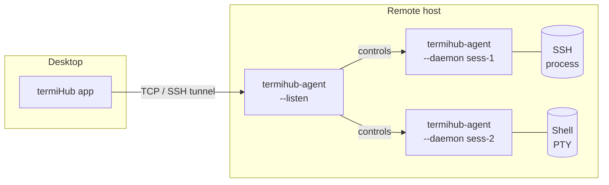
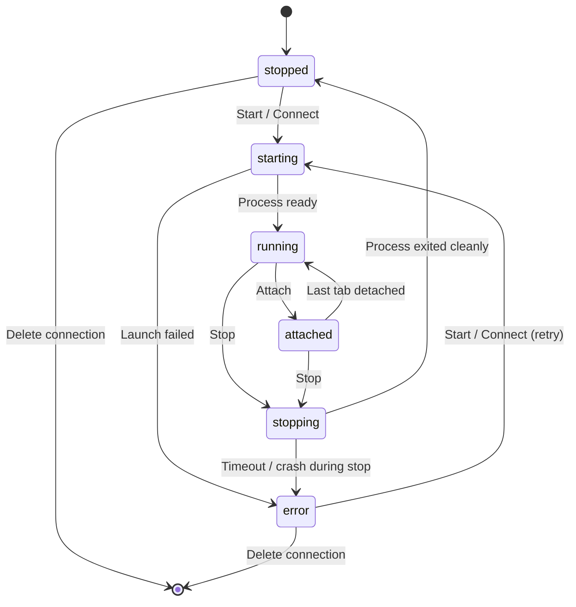
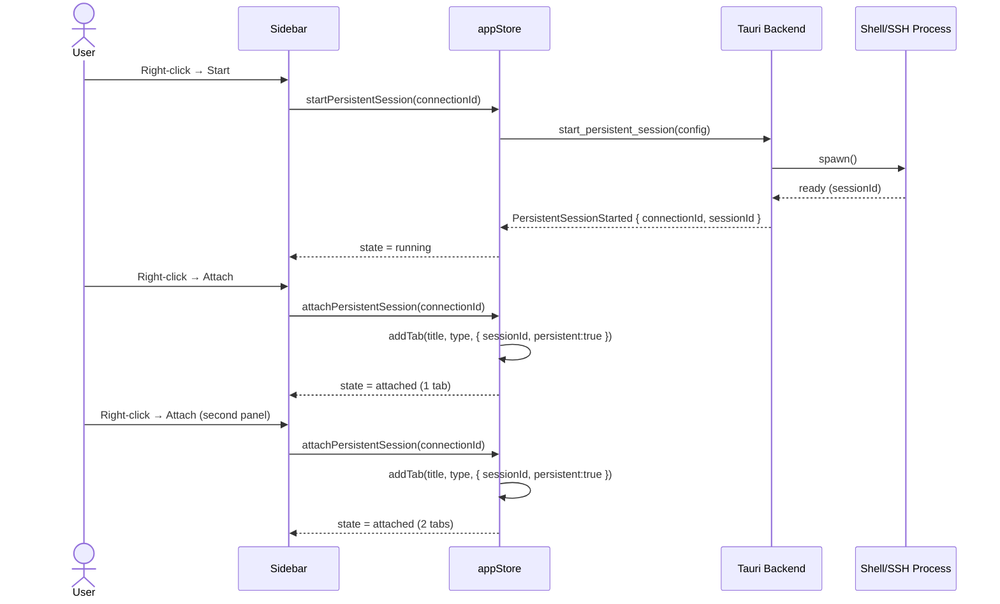
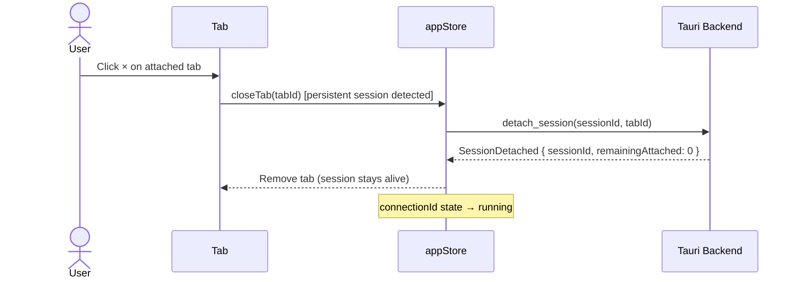
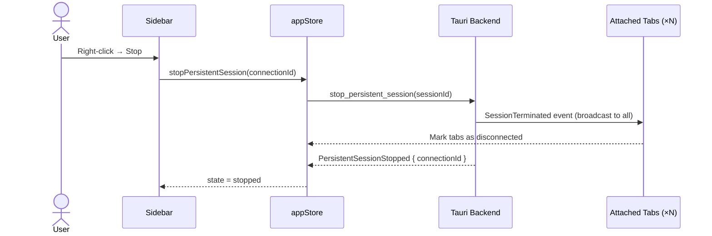
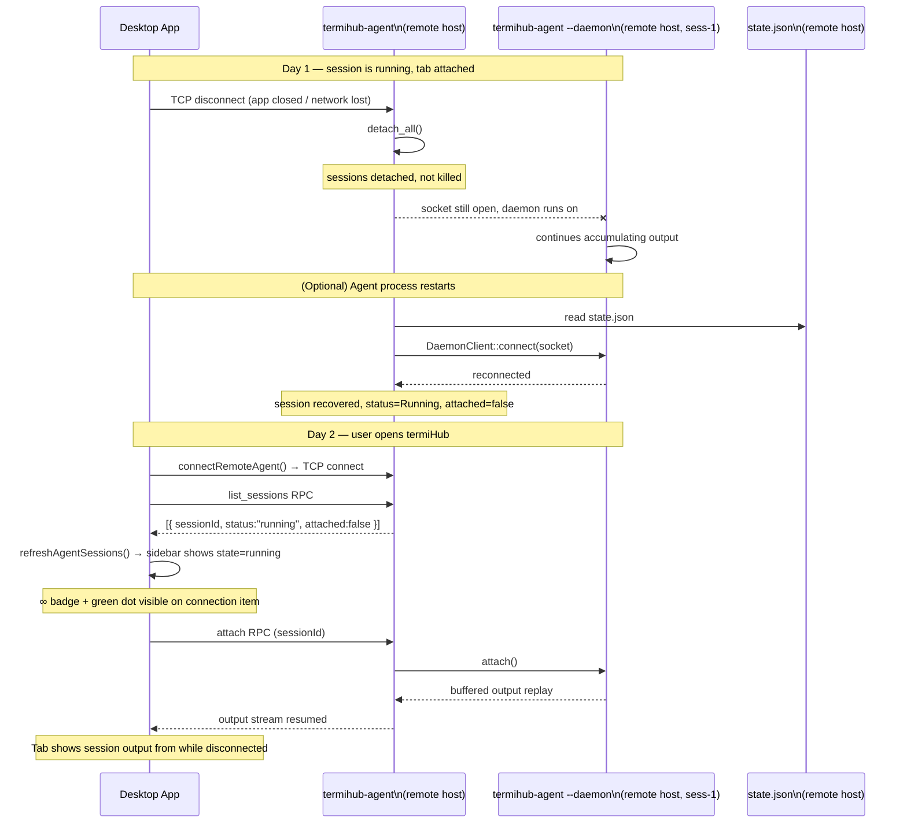

# Persistent Connection Status Indicator and Attach/Stop/Start Mechanics

> GitHub Issue: [#666](https://github.com/armaxri/termiHub/issues/666)

## Overview

Several connection types in termiHub — SSH, Docker, WSL, and Serial — carry the `persistent: true`
capability flag. This means their underlying processes can survive beyond a single tab's lifetime.
Currently the sidebar gives no visual hint that a connection is persistent, and there is no way to
start a session without immediately attaching to it, stop a running session short of killing the
tab, or attach a second tab to an already-running process.

This concept introduces a **Start / Attach / Stop** lifecycle model for persistent-capable
connections, mirroring the pattern already used by the remote agent (connect/disconnect). Users
will be able to see at a glance whether a saved persistent connection is stopped, starting, running
in the background, or attached to one or more tabs — and act accordingly.

---

## UI Interface

### Connection Item Appearance

Each saved connection item in the sidebar gains two new visual elements when its type is
persistent-capable:

1. **Persistence badge** — a small pill or icon (e.g., `∞` infinity symbol or the label `PRS`)
   shown to the left of the connection type chip. It is always visible and tells the user "this
   connection can run in the background."

2. **State dot** — a small circle to the right of the connection name. Colour and tooltip reflect
   the live run state:

   | State      | Colour           | Tooltip                       |
   | ---------- | ---------------- | ----------------------------- |
   | `stopped`  | grey             | "Not running"                 |
   | `starting` | amber (pulsing)  | "Starting…"                   |
   | `running`  | green            | "Running – not attached"      |
   | `attached` | bright green     | "Running – N tab(s) attached" |
   | `stopping` | orange (pulsing) | "Stopping…"                   |
   | `error`    | red              | "Terminated unexpectedly"     |

   Non-persistent connections show neither element.

**Annotated wireframe (stopped vs. attached state):**

```
 [∞] 🖥  My SSH Server      ssh  ● (grey)
 [∞] 🖥  Dev Docker         docker  ● (bright green, badge "2")
     🖥  Local Shell        local
```

### Attached-Tab Count Badge

When `attached` and more than one tab is connected to the same session, a small numeric badge
overlays the state dot (e.g., `●²`). Hovering shows the names of the attached tabs.

### Context Menu

The context menu adapts its primary action set to the current state:

| State                   | Primary Actions                         | Secondary Actions                  |
| ----------------------- | --------------------------------------- | ---------------------------------- |
| `stopped` / `error`     | **Start**, **Connect** (Start + Attach) | Edit, Duplicate, Ping Host, Delete |
| `starting` / `stopping` | _(disabled, show spinner)_              | —                                  |
| `running`               | **Attach**, **Stop**                    | Edit, Duplicate, Ping Host, Delete |
| `attached`              | **Attach** (new tab), **Stop**          | Edit, Duplicate, Ping Host, Delete |

**"Connect"** (the current default double-click action) is kept as a convenience shortcut: if the
session is already running it performs **Attach**, otherwise it performs **Start + Attach**. This
preserves the familiar one-click workflow while making the separate primitives available.

### Inline Quick-Action Buttons (hover)

On hover, two icon buttons appear on the right side of the connection item (styled like the agent
node's inline buttons):

- **Stopped / Error**: `▶ Start` and `⚡ Connect`
- **Running / Attached**: `⊕ Attach` and `■ Stop`
- **Transitioning (Starting / Stopping)**: a spinner only, no buttons

### Tab Decoration

Tabs that are attached to a persistent session display a small `∞` superscript on the tab title
to signal that closing the tab will **detach**, not terminate, the background process.

When the user closes such a tab via the `×` button, a one-time tooltip confirmation appears:

> "This session will keep running in the background. Use Stop in the sidebar to terminate it."

A "Don't show again" checkbox suppresses future confirmations (stored as a user preference).

---

## General Handling

### Start

- Launches the backend process for the saved connection without opening a terminal tab.
- The sidebar item transitions to `starting` → `running`.
- If credentials are required (e.g., SSH password or key passphrase), the existing credential
  resolution dialog is shown before the process is launched.
- Starting a connection that is already `running` or `attached` is a no-op (with a brief toast
  notification: "Already running").

### Attach

- Opens a new terminal tab pointing to the already-running process.
- The sidebar item transitions to `running` → `attached` (or stays `attached` and increments the
  badge).
- Attach is only available when the session is `running` or `attached`.
- Multiple concurrent tabs from different panels or tab groups can all attach to the same process.

### Detach (closing an attached tab)

- Closing an attached tab removes that tab from the process but leaves the process alive.
- If this was the last attached tab, the state reverts to `running` (not `stopped`).
- The process continues to accumulate output in its ring buffer; a freshly attached tab sees the
  buffered history.

### Stop

- Sends a graceful shutdown signal to the running process.
- All tabs attached to that session receive a "Connection closed" notification and are marked as
  disconnected (the tab is kept open to preserve scroll history, consistent with existing
  behaviour).
- The sidebar item transitions `stopping` → `stopped`.
- Stop on an already-stopped connection is a no-op.

### Connect (convenience shortcut)

- If the session is `stopped` or `error`: equivalent to **Start + Attach** (existing double-click).
- If the session is `running` or `attached`: equivalent to **Attach**.
- Preserves current UX for users who do not need the separate primitives.

### Error / Unexpected Termination

- If the process exits without an explicit Stop command, the state transitions to `error`.
- The state dot turns red and the last exit code or error message is shown in the tooltip.
- The user can **Start** again from the error state; this resets the state machine.

### Non-Persistent Connections

No changes. `local` and `telnet` connections retain their current behaviour: opening always
creates a new session, closing the tab always terminates it.

### Agent-Hosted Sessions: Desktop Disconnect and Reconnect

For connections that run through a **remote agent** (SSH, Docker, WSL, Serial sessions launched
from an agent node), persistence is backed by the agent's **daemon subprocess model**, not by
the desktop app. This gives a much stronger guarantee: sessions stay alive even when the desktop
is closed entirely and reconnected the next day.

#### How the daemon model works

When the desktop creates a persistent session via a connected agent, the agent spawns a
separate `termihub-agent --daemon <session-id>` child process on the remote host (Unix only).
That daemon holds the actual connection — the shell PTY, the Docker exec, the SSH session. Its
Unix socket path is written to `~/.config/termihub-agent/state.json`.



#### Desktop disconnect

When the desktop drops its TCP connection to the agent (app closed, network lost, sleep), the
agent calls `detach_all()`. Sessions are **detached, not killed**. The daemon subprocesses keep
running on the remote host, accumulating output in their ring buffers.

#### Agent restart (optional, transparent)

If the agent process itself restarts (intentional upgrade, crash), it calls `recover_sessions()`
on startup. This reads `state.json` and reconnects to surviving daemon Unix sockets. Sessions
whose sockets no longer exist are pruned. The recovered sessions are immediately queryable — the
desktop does not need to know a restart occurred.

#### Desktop reconnect (next day)

1. Desktop calls `connectRemoteAgent()` → establishes SSH tunnel → TCP to agent.
2. Desktop calls `refreshAgentSessions()` → `list_sessions` RPC.
3. Agent returns all running sessions with `attached: false`.
4. The sidebar shows these sessions under their parent agent node with state `running`.
5. User clicks **Attach** → new tab → session is live again.

#### Platform scope

| Platform             | Session survives desktop disconnect | Session survives agent restart        |
| -------------------- | ----------------------------------- | ------------------------------------- |
| Unix (Linux / macOS) | ✓ daemon subprocess                 | ✓ `recover_sessions()` via socket     |
| Windows              | ✓ (in-process, agent keeps running) | ✗ in-process sessions lost on restart |

#### Desktop-local persistent sessions (non-agent)

Sessions started directly from the desktop (e.g., SSH launched from the desktop's own Tauri
process, not via a remote agent) run inside the Tauri backend process. They persist across
**tab closes within the same app session** (the new behaviour added by this concept) but are
**lost when the desktop app exits**. There is no daemon subprocess layer on the desktop side.

The sidebar must make this distinction clear: desktop-local persistent sessions show the `∞`
badge but the tooltip clarifies "Runs while the app is open. Use an agent for across-session
persistence."

---

## States & Sequences

### State Machine



### Sequence: Start then Attach from a second panel



### Sequence: Tab close (detach, not stop)



### Sequence: Stop with attached tabs



### Sequence: Agent disconnect and reconnect next day (agent-hosted sessions)

This sequence shows what happens to an agent-hosted persistent session when the desktop app is
closed and reopened the following day. No user action is required for the session to survive.



---

## Preliminary Implementation Details

> Note: this section reflects the codebase at the time of concept creation. The codebase may
> evolve between concept creation and implementation.

### Frontend

**`src/types/connection.ts`**

Add a new `PersistentSessionState` type and extend `AppState`:

```typescript
export type PersistentRunState =
  | "stopped"
  | "starting"
  | "running"
  | "attached"
  | "stopping"
  | "error";

export interface PersistentSessionEntry {
  connectionId: string;
  sessionId: string | null;
  state: PersistentRunState;
  attachedTabIds: string[];
  errorMessage?: string;
}
```

**`src/store/appStore.ts`**

New state slice:

```typescript
persistentSessions: Record<string, PersistentSessionEntry>; // keyed by connectionId
```

New actions:

```typescript
startPersistentSession(connectionId: string): Promise<void>
attachPersistentSession(connectionId: string): void
stopPersistentSession(connectionId: string): Promise<void>
```

Modify `closeTab` / `removeTab` to call `detachPersistentSession` instead of terminating the
backend session when `tab.config.persistent === true` and a corresponding entry exists in
`persistentSessions`.

**`src/components/Sidebar/ConnectionList.tsx`**

- `ConnectionItem` reads `persistentSessions[connection.id]` from the store.
- Renders the persistence badge (when `capabilities.persistent === true`) and the state dot.
- Replaces the single "Connect" context-menu item with the state-dependent set described above.
- Adds inline hover buttons.

**`src/components/Terminal/TerminalTab.tsx` (or equivalent tab header)**

- Reads `persistentSessions` to detect if the tab is attached to a persistent session.
- Shows `∞` superscript.
- Intercepts tab close to show the one-time tooltip and call detach instead of terminate.

### Tauri Backend (`src-tauri/src/`)

New Tauri IPC commands (in `src-tauri/src/commands/`):

| Command                              | Description                                             |
| ------------------------------------ | ------------------------------------------------------- |
| `start_persistent_session(config)`   | Spawns the process, returns `sessionId`                 |
| `stop_persistent_session(sessionId)` | Gracefully terminates the process                       |
| `detach_session(sessionId, tabId)`   | Unregisters a tab from the session; keeps process alive |
| `list_persistent_sessions()`         | Returns all running persistent sessions and their state |

The session manager (`src-tauri/src/session/manager.rs`) needs a new registry of
"detachable" sessions: a map from `connectionId → (process_handle, attached_tab_set)`.

Closing a tab currently calls `close_session` (which kills the process). This must be changed to
`detach_session` for sessions that are flagged as persistent. The process is only killed when
`stop_persistent_session` is called explicitly or when `attached_tab_set` is empty and the user
has not explicitly started the session in "background" mode.

> **Design decision TBD at implementation time**: Should a session auto-stop when the last tab
> detaches, or remain running until explicitly stopped? The issue requires the second behaviour
> (explicit Stop only), but this should be validated with the user at implementation time.

### Event Flow

A new Tauri event `persistent-session-state-changed` emitted to the frontend whenever a session
transitions state:

```json
{
  "connectionId": "abc-123",
  "sessionId": "sess-456",
  "state": "running",
  "attachedTabCount": 0
}
```

The frontend listens for this event (in `src/services/events.ts`) and updates
`persistentSessions` in the store, which triggers reactive re-renders in `ConnectionItem`.

### Relationship to Agent Definitions

Remote agent definitions already have a `persistent: bool` field and a `handleAttachSession`
callback in `AgentNode.tsx`. The changes needed here differ by connection scope:

#### Agent-hosted persistent connections

The backend infrastructure already exists. The agent's `SessionManager` already implements:

- `detach_all()` — called on TCP disconnect; leaves daemon subprocesses alive
  (`agent/src/io/tcp.rs:85`)
- `recover_sessions()` — called on agent startup; reconnects to surviving daemon Unix sockets
  (`agent/src/session/manager.rs:468`)
- `AgentState` / `state.json` — persists daemon socket paths across agent restarts
  (`agent/src/state/persistence.rs`)
- `attach()` / `detach()` — fine-grained per-session control (`agent/src/session/manager.rs`)

What is missing is **frontend wiring**: `AgentNode.tsx` shows active sessions and saved
definitions as two separate lists with no link between them. The implementation needs to:

1. Cross-reference each `AgentDefinitionInfo` (saved definition) against the live
   `AgentSessionInfo` list to determine whether a running session for that definition exists.
2. Render the state dot and `∞` badge on the definition row in `AgentNode.tsx` (not the
   session row — the session row is the "legacy" view that may be collapsed once definitions
   show state directly).
3. Wire **Start** (create session from definition), **Attach** (attach to running session),
   and **Stop** (stop the running session) into the context menu and inline buttons of
   `AgentNode.tsx`.

The `persistent-session-state-changed` event on the agent side can be emitted via the
existing notification channel (`NotificationSender`) whenever a session is created, detached,
or terminated.

#### Desktop-local persistent connections

This is the new work. No daemon subprocess layer currently exists on the desktop. The
`src-tauri/src/session/manager.rs` needs the detachable session registry described above.
On app exit, the Tauri backend should call a new `shutdown_persistent_sessions()` that
detaches all sessions cleanly (the processes will still be killed when the app process exits,
but this allows graceful cleanup and correct state dot display before the window closes).

Both scopes should use the same CSS classes, badge, and tooltip conventions so the UX is
uniform regardless of whether a connection runs locally or through an agent.

---

## Implementation Status

**Status: Not implemented.** The concept issue is closed; no implementation issues have been created yet.

### What exists

- The `persistent: boolean` field is present in the `SavedRemoteAgent` connection definition
  (`src/types/terminal.ts`, `src/components/ConnectionEditor/ConnectionEditor.tsx`).
- The `persistent` capability flag is propagated through workspace layouts
  (`src/utils/workspaceLayout.ts`).
- A tooltip on `AgentNode` shows `"persistent"` in the connection title when the flag is set.

### What is missing

- **Persistence badge** in the sidebar (∞ pill / icon) — not rendered anywhere.
- **Start / Attach / Stop** lifecycle for persistent connections — the only action today is
  "open tab" which always starts a new session. There is no way to start without attaching,
  attach to an already-running session, or stop a session without closing the tab.
- **Connection state tracking** (stopped / starting / running / attached) in the Zustand store.
- **Sidebar status dot** showing running-in-background vs. attached vs. stopped.
- **Status bar integration** showing the count of background-running persistent sessions.
- The concept's `connection.start()`, `connection.attach(sessionId)`, and `connection.stop()`
  IPC commands do not exist.

### To consider before implementing

- The remote agent already has a well-established connect/disconnect/reconnect lifecycle;
  reuse those patterns rather than designing a separate system.
- The `persistent` flag currently only appears on remote agent sub-connections, not on
  local SSH, Docker, WSL, or Serial connections — the concept covers all of these.
- Implementation issue: none open yet — create one referencing this concept when ready to start.
