# Plugin System

**GitHub Issue:** [#28](https://github.com/armaxri/termiHub/issues/28)

---

## Overview

termiHub currently supports a fixed set of terminal backends (local shell, SSH, serial, telnet, Docker, remote agent) and two built-in themes (dark and light). All functionality is compiled into the application binary — there is no mechanism for users or the community to extend termiHub without modifying its source code and rebuilding.

A plugin system would allow third-party extensions to add new terminal backends, protocol parsers, themes, and UI components at runtime, without recompiling the core application. This opens termiHub to community-driven specialization: industrial serial protocols, cloud shell integrations, accessibility themes, or custom status bar widgets.

### Goals

- Define a clear **Plugin API** with versioned contracts for each extension point
- Support **custom terminal backends** via plugins (e.g., a Kubernetes exec backend, a cloud shell backend)
- Support **custom protocol parsers** that can transform or annotate terminal output (e.g., ANSI art detection, log highlighting)
- Support **theme extensions** — community-created color themes loaded at runtime
- Provide a **Plugin Manager UI** for discovering, installing, enabling/disabling, and removing plugins
- Maintain **sandboxed execution** — plugins should not be able to crash the core application or access resources beyond their declared permissions
- Keep the **core application lean** — plugins are optional, and termiHub works fully without any plugins installed

### Non-Goals

- A full marketplace or plugin store (out of scope for initial concept — local install and sideloading only)
- Hot-reloading plugins while terminals are active (restart required for backend plugins)
- Plugins modifying core UI layout (Activity Bar, Sidebar structure) — only designated extension slots
- Cross-plugin dependencies or plugin-to-plugin communication
- Mobile platform support for plugins (desktop only: Windows, macOS, Linux)

---

## UI Interface

### Plugin Manager View

The Plugin Manager is accessible as a new view in the **Activity Bar** (puzzle-piece icon). It appears in the Sidebar when selected, similar to the existing Connections and Files views.

```
┌──┬──────────────────┬────────────────────────────────────┐
│  │  PLUGINS          │                                    │
│  │──────────────────│          Terminal Area              │
│  │  [Search...]      │                                    │
│  │                   │                                    │
│  │  INSTALLED (3)    │                                    │
│🔌│  ┌──────────────┐ │                                    │
│  │  │ 🟢 K8s Exec  │ │                                    │
│  │  │ v1.2.0       │ │                                    │
│  │  └──────────────┘ │                                    │
│  │  ┌──────────────┐ │                                    │
│  │  │ 🟢 Dracula   │ │                                    │
│  │  │ v2.0.1       │ │                                    │
│  │  └──────────────┘ │                                    │
│  │  ┌──────────────┐ │                                    │
│  │  │ ⚪ Log Color  │ │                                    │
│  │  │ v0.3.0 (off) │ │                                    │
│  │  └──────────────┘ │                                    │
│  │                   │                                    │
│  │  [Install from    │                                    │
│  │   file...]        │                                    │
│  │                   │                                    │
└──┴──────────────────┴────────────────────────────────────┘
```

### Plugin Detail Panel

Clicking an installed plugin expands its detail panel within the sidebar:

```
┌──────────────────┐
│  K8s Exec        │
│  v1.2.0          │
│  by k8s-contrib  │
│──────────────────│
│  Terminal backend │
│  for Kubernetes  │
│  pod exec        │
│  sessions.       │
│                  │
│  Permissions:    │
│  - Terminal      │
│  - Network       │
│                  │
│  [Disable]       │
│  [Uninstall]     │
│  [Settings...]   │
│──────────────────│
│  Extension Points│
│  ● Terminal      │
│    Backend       │
│  ● Connection    │
│    Config UI     │
└──────────────────┘
```

### Plugin Settings

Plugins that declare configuration options get a dedicated section in the Settings view. Plugin settings appear under a "Plugins" category, grouped by plugin name.

```
┌─────────────────────────────────────────────┐
│  Settings                                   │
│─────────────────────────────────────────────│
│  General                                    │
│  Terminal                                   │
│  Appearance                                 │
│  ▼ Plugins                                  │
│    ▶ K8s Exec                               │
│      ┌─────────────────────────────────┐    │
│      │ Default namespace: [default   ] │    │
│      │ Kubeconfig path:   [~/.kube/.. ]│    │
│      │ Container shell:   [/bin/bash ] │    │
│      └─────────────────────────────────┘    │
│    ▶ Log Colorizer                          │
│      ┌─────────────────────────────────┐    │
│      │ Highlight errors:  [x]          │    │
│      │ Timestamp format:  [ISO 8601  ] │    │
│      └─────────────────────────────────┘    │
└─────────────────────────────────────────────┘
```

### Plugin-Provided Connection Types

When a plugin provides a custom terminal backend, it appears in the connection type selector alongside built-in types. Plugin-provided types are visually distinguished with a small plugin badge.

```
┌─────────────────────────────────┐
│  New Connection                 │
│─────────────────────────────────│
│  Type:                          │
│  ┌─────────────────────────────┐│
│  │ Local Shell                 ││
│  │ SSH                         ││
│  │ Serial                      ││
│  │ Telnet                      ││
│  │ Docker                      ││
│  │───────────── Plugins ───────││
│  │ K8s Exec            🔌      ││
│  │ AWS CloudShell      🔌      ││
│  └─────────────────────────────┘│
│                                 │
│  Configuration:                 │
│  (plugin-provided form fields)  │
└─────────────────────────────────┘
```

### Plugin-Provided Themes

Theme plugins appear in the theme selector in Settings alongside built-in themes. They are loaded dynamically and previewed on hover.

```
┌─────────────────────────────────┐
│  Theme:                         │
│  ┌─────────────────────────────┐│
│  │ ● Dark (built-in)          ││
│  │ ○ Light (built-in)         ││
│  │ ○ System                    ││
│  │─────────── Plugins ─────────││
│  │ ○ Dracula              🔌  ││
│  │ ○ Solarized Dark       🔌  ││
│  │ ○ Nord                 🔌  ││
│  └─────────────────────────────┘│
└─────────────────────────────────┘
```

### Install from File Dialog

Users can install plugins from local `.termihub-plugin` package files via a native file picker dialog:

```
┌──────────────────────────────────────────┐
│  Install Plugin                          │
│──────────────────────────────────────────│
│                                          │
│  Selected file:                          │
│  [k8s-exec-1.2.0.termihub-plugin]       │
│                                          │
│  Plugin: K8s Exec                        │
│  Version: 1.2.0                          │
│  Author: k8s-contrib                     │
│  Type: Terminal Backend                  │
│                                          │
│  Requested Permissions:                  │
│  ⚠ Terminal — Create terminal sessions   │
│  ⚠ Network — Make network connections    │
│  ⚠ FileSystem — Read kubeconfig files    │
│                                          │
│  [Cancel]              [Install & Enable]│
└──────────────────────────────────────────┘
```

---

## General Handling

### Plugin Lifecycle

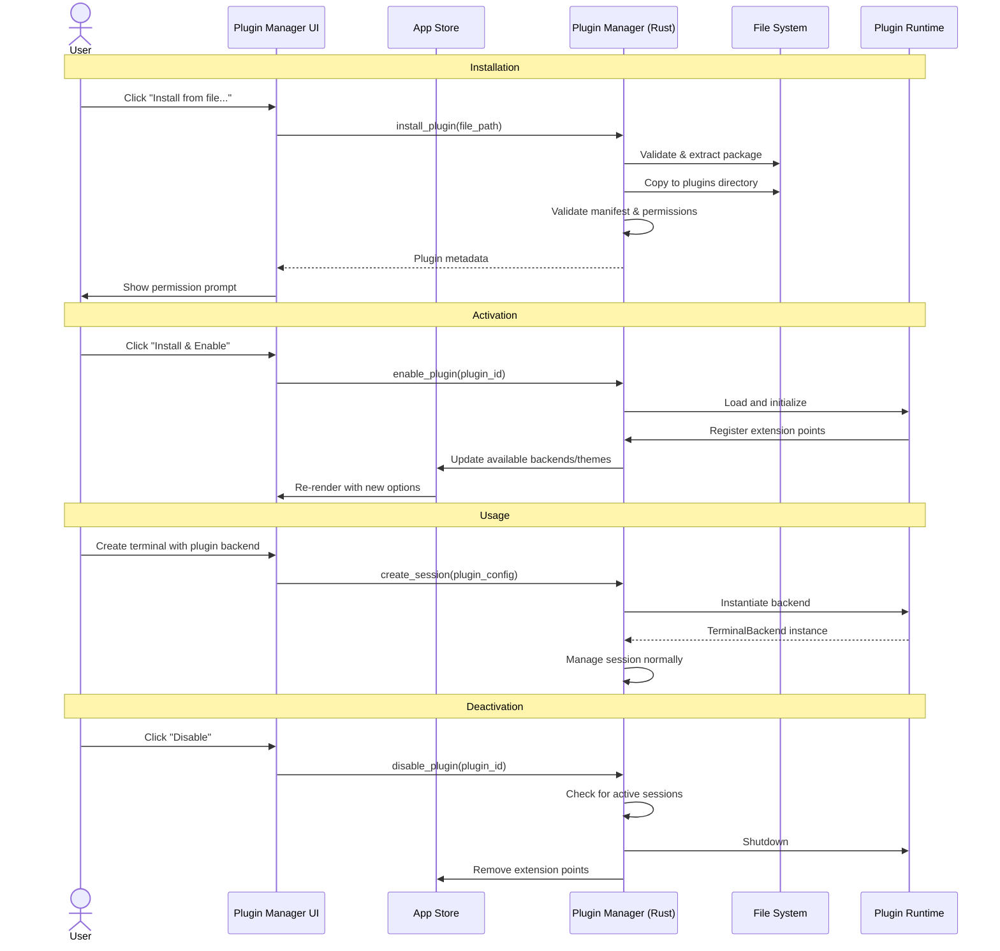

### Plugin Discovery and Loading

On application startup, the Plugin Manager scans the plugins directory for installed plugins:

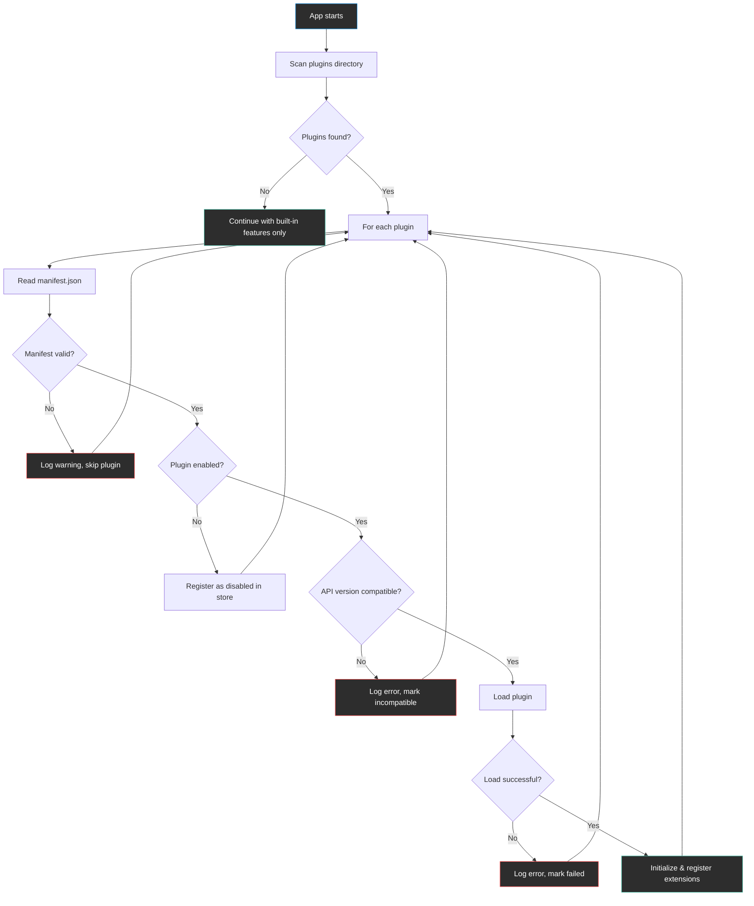

### Plugin Types and Extension Points

Each plugin declares one or more extension points in its manifest. The following types are supported:

| Extension Point       | Description                                     | Runtime                | Registration                                              |
| --------------------- | ----------------------------------------------- | ---------------------- | --------------------------------------------------------- |
| **Terminal Backend**  | New connection type with full terminal I/O      | Rust (dynamic library) | Registers a factory function with TerminalManager         |
| **Protocol Parser**   | Transforms or annotates terminal output streams | JavaScript (WebView)   | Registers as output filter in terminal rendering pipeline |
| **Theme**             | Custom color theme definition                   | JSON (static data)     | Registers ThemeDefinition with theme engine               |
| **Status Bar Widget** | Adds information to the status bar              | JavaScript (WebView)   | Registers component in status bar slot                    |

### Installing a Plugin

1. User selects a `.termihub-plugin` file (ZIP archive with specific structure)
2. Backend validates the archive structure and manifest
3. Manifest is parsed and displayed to the user (name, version, permissions)
4. User reviews permissions and confirms installation
5. Plugin files are extracted to `<app-data>/plugins/<plugin-id>/`
6. Plugin state is set to "installed, disabled" (not active until explicitly enabled)
7. User enables the plugin, which triggers loading and initialization

### Uninstalling a Plugin

1. If plugin has active terminal sessions, warn user that sessions will be closed
2. Plugin is deactivated (shutdown callback called)
3. Extension points are unregistered
4. Plugin directory is deleted
5. Plugin configuration is removed from settings

### Plugin Permissions

Plugins declare required permissions in their manifest. The user is prompted to grant these permissions during installation. Permissions are coarse-grained to keep the model simple:

| Permission   | Grants Access To                                  |
| ------------ | ------------------------------------------------- |
| `terminal`   | Creating and managing terminal sessions           |
| `network`    | Making outbound network connections               |
| `filesystem` | Reading/writing files (scoped to declared paths)  |
| `ui`         | Rendering UI components in designated slots       |
| `settings`   | Storing and reading plugin-specific configuration |

### Error Handling

- **Plugin fails to load**: Marked as "error" in Plugin Manager, error message shown in detail panel, core app continues normally
- **Plugin crashes during session**: Terminal session is marked as disconnected, error event emitted, other sessions unaffected
- **Incompatible API version**: Plugin marked as "incompatible", not loaded, user prompted to update
- **Missing permissions**: Plugin functionality gracefully degraded (e.g., backend plugin without `network` permission cannot open connections)

### Edge Cases

- **Multiple plugins providing same connection type name**: Second plugin's type is suffixed with plugin name to disambiguate
- **Plugin and core theme with same name**: Core themes always take precedence; plugin theme is prefixed with plugin name
- **Plugin directory permissions**: On failure to write to plugins directory, show clear error with path and required permissions
- **Plugin installed but dependency missing**: Show clear error in plugin detail panel with instructions (e.g., "Requires kubectl in PATH")
- **App update changes plugin API version**: Incompatible plugins are automatically disabled with a notification to the user
- **Large plugin file**: Installation validates file size (<50 MB limit), shows progress for extraction
- **Concurrent plugin operations**: Installation/uninstallation operations are serialized to prevent race conditions

---

## States & Sequences

### Plugin Lifecycle State Machine

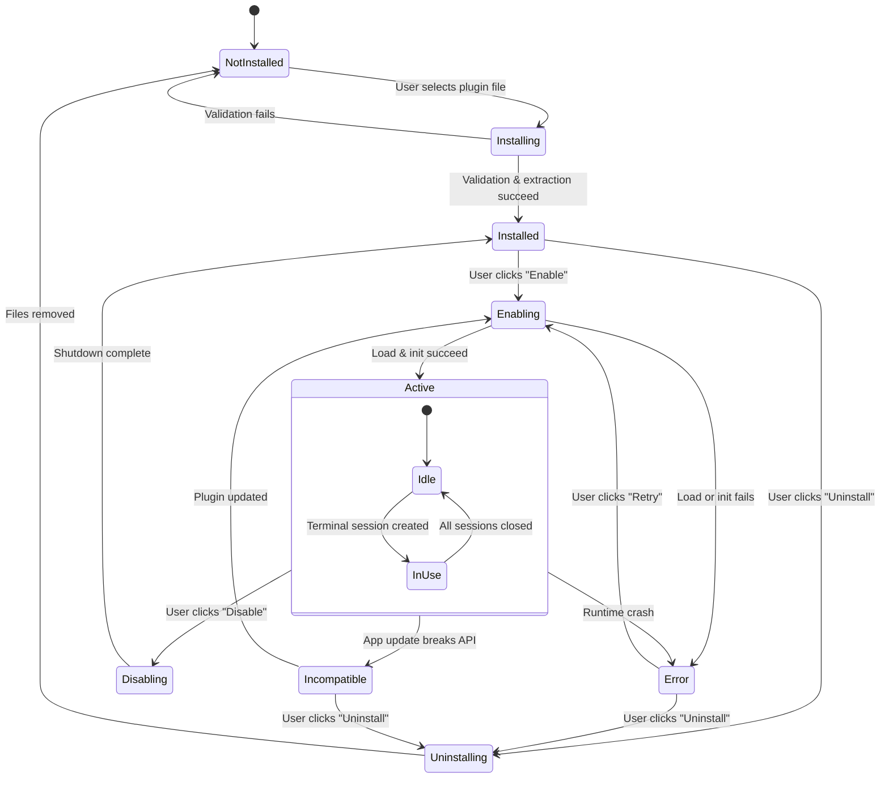

### Terminal Backend Plugin Session Flow

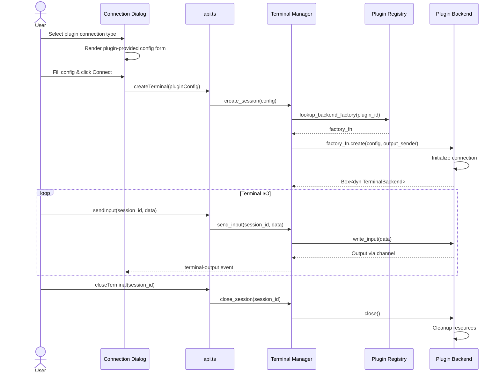

### Protocol Parser Plugin Data Flow

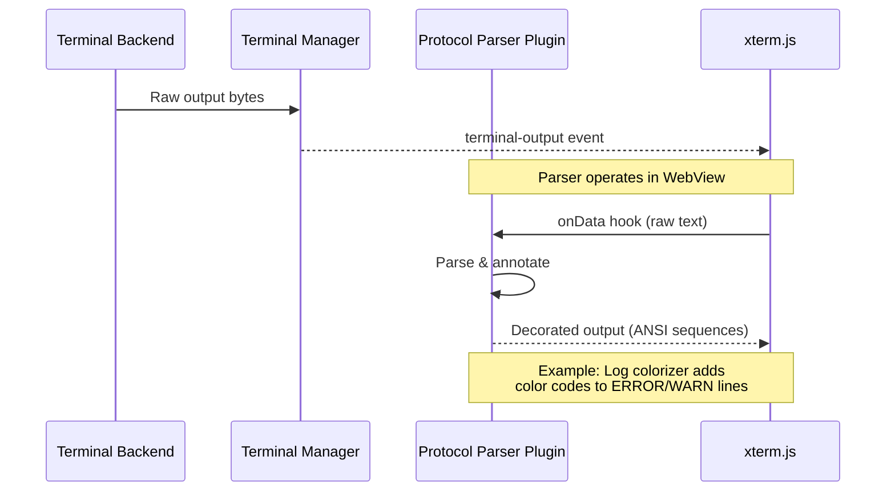

### Theme Plugin Loading

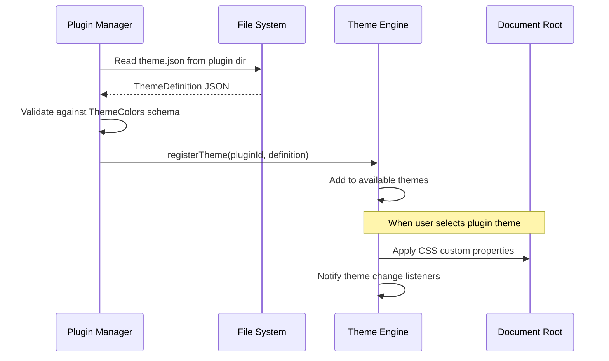

### Plugin Installation Sequence

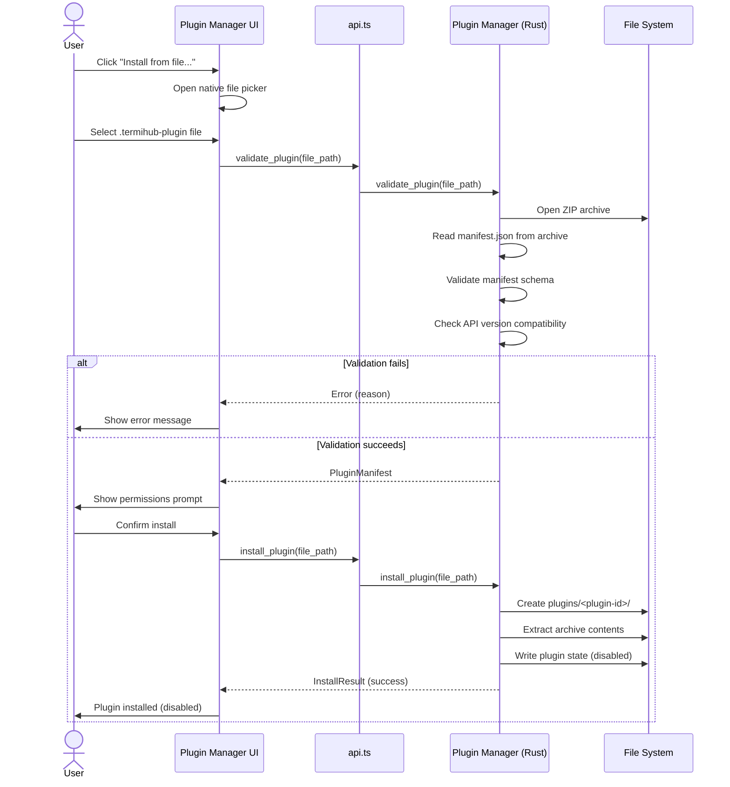

### Plugin Manager Startup Sequence

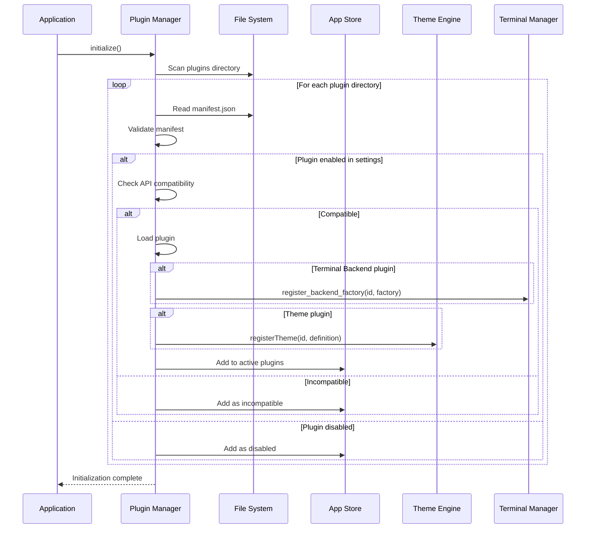

### Error Recovery State Machine

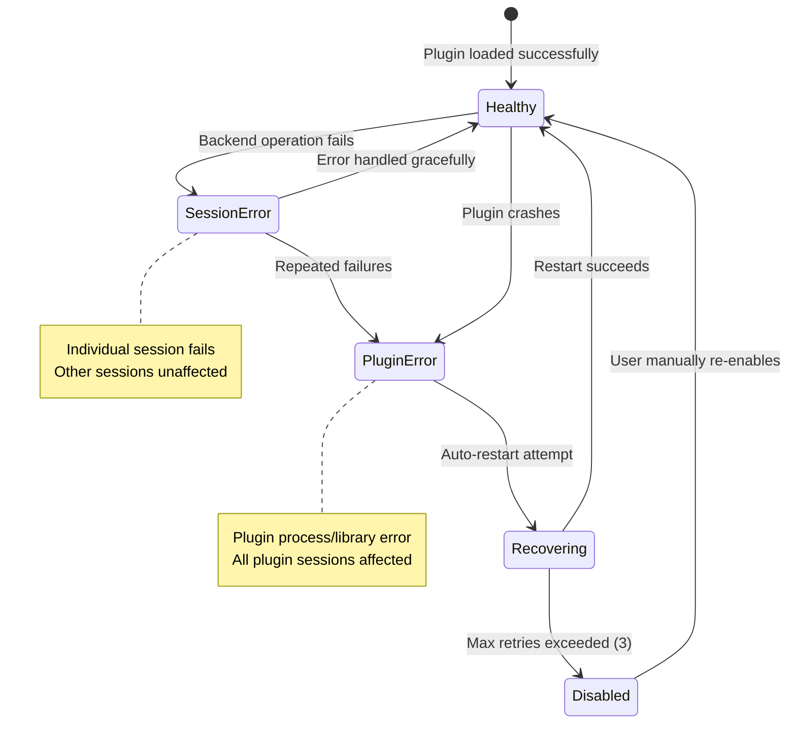

---

## Preliminary Implementation Details

Based on the current project architecture at the time of concept creation. The codebase may evolve between concept creation and implementation.

### 1. Plugin Package Format

Plugins are distributed as `.termihub-plugin` files, which are ZIP archives with a defined structure:

```
my-plugin.termihub-plugin (ZIP)
├── manifest.json           # Plugin metadata and declarations
├── backend/                # Rust dynamic library (optional)
│   ├── my_plugin.dll       # Windows
│   ├── libmy_plugin.so     # Linux
│   └── libmy_plugin.dylib  # macOS
├── frontend/               # JavaScript/CSS assets (optional)
│   ├── index.js            # Plugin frontend entry point
│   └── styles.css          # Plugin styles
├── themes/                 # Theme definitions (optional)
│   └── dracula.json        # ThemeDefinition JSON
└── README.md               # Plugin documentation
```

### 2. Plugin Manifest

The `manifest.json` defines the plugin's identity, capabilities, and requirements:

```json
{
  "id": "k8s-exec",
  "name": "Kubernetes Exec",
  "version": "1.2.0",
  "author": "k8s-contrib",
  "description": "Terminal backend for Kubernetes pod exec sessions",
  "license": "MIT",
  "apiVersion": "1.0",
  "platforms": ["windows", "linux", "macos"],
  "permissions": ["terminal", "network", "filesystem"],
  "extensions": {
    "terminalBackend": {
      "connectionType": "k8s-exec",
      "displayName": "Kubernetes Exec",
      "configSchema": {
        "type": "object",
        "properties": {
          "namespace": { "type": "string", "default": "default" },
          "pod": { "type": "string" },
          "container": { "type": "string" },
          "shell": { "type": "string", "default": "/bin/sh" },
          "kubeconfig": { "type": "string", "default": "~/.kube/config" }
        },
        "required": ["pod"]
      }
    }
  },
  "settings": {
    "defaultNamespace": {
      "type": "string",
      "default": "default",
      "description": "Default Kubernetes namespace"
    },
    "kubeconfigPath": {
      "type": "string",
      "default": "~/.kube/config",
      "description": "Path to kubeconfig file"
    }
  }
}
```

### 3. Rust Plugin Host — Dynamic Library Loading

Terminal backend plugins are Rust dynamic libraries that implement a C-compatible plugin interface. This is necessary because terminal backends require direct system access (PTY, network sockets, serial ports) that cannot be achieved through JavaScript alone.

```rust
// Plugin API crate: termihub-plugin-api (published separately)

/// Plugin metadata returned during initialization.
pub struct PluginInfo {
    pub id: String,
    pub name: String,
    pub version: String,
    pub api_version: u32,
}

/// Configuration for a plugin-provided terminal session.
/// The config_json field contains the JSON configuration
/// matching the plugin's declared configSchema.
pub struct PluginSessionConfig {
    pub config_json: String,
}

/// Output sender for plugin backends to write terminal data.
pub struct PluginOutputSender {
    sender: std::sync::mpsc::SyncSender<Vec<u8>>,
}

impl PluginOutputSender {
    pub fn send(&self, data: &[u8]) -> Result<(), PluginError> {
        self.sender
            .send(data.to_vec())
            .map_err(|_| PluginError::ChannelClosed)
    }
}

/// The trait that plugin backends must implement.
pub trait PluginTerminalBackend: Send {
    fn write_input(&self, data: &[u8]) -> Result<(), PluginError>;
    fn resize(&self, cols: u16, rows: u16) -> Result<(), PluginError>;
    fn close(&self) -> Result<(), PluginError>;
    fn is_alive(&self) -> bool;
}

/// Functions exported by the plugin dynamic library.
/// These are resolved via libloading at runtime.
extern "C" {
    fn plugin_init() -> *mut PluginInfo;
    fn plugin_create_backend(
        config: *const PluginSessionConfig,
        output: *mut PluginOutputSender,
    ) -> *mut dyn PluginTerminalBackend;
    fn plugin_shutdown();
}
```

### 4. Plugin Registry in Terminal Manager

The `TerminalManager` needs a plugin registry to support dynamic backend types alongside built-in ones:

```rust
use libloading::Library;

/// A loaded plugin with its dynamic library handle and factory function.
struct LoadedPlugin {
    _library: Library,  // Prevent unloading while in use
    info: PluginInfo,
    create_backend: unsafe extern "C" fn(
        *const PluginSessionConfig,
        *mut PluginOutputSender,
    ) -> *mut dyn PluginTerminalBackend,
    shutdown: unsafe extern "C" fn(),
}

/// Registry of available backend plugins.
struct PluginRegistry {
    plugins: HashMap<String, LoadedPlugin>,
}

impl PluginRegistry {
    fn register(&mut self, plugin_path: &Path) -> Result<String> {
        let library = unsafe { Library::new(plugin_path) }
            .context("Failed to load plugin library")?;

        let init: unsafe extern "C" fn() -> *mut PluginInfo =
            unsafe { *library.get(b"plugin_init")? };

        let info = unsafe { Box::from_raw(init()) };

        // Validate API version compatibility
        if info.api_version != CURRENT_API_VERSION {
            return Err(anyhow!("Incompatible API version"));
        }

        let create_backend = unsafe {
            *library.get(b"plugin_create_backend")?
        };
        let shutdown = unsafe {
            *library.get(b"plugin_shutdown")?
        };

        let plugin_id = info.id.clone();
        self.plugins.insert(plugin_id.clone(), LoadedPlugin {
            _library: library,
            info: *info,
            create_backend,
            shutdown,
        });

        Ok(plugin_id)
    }

    fn create_backend(
        &self,
        plugin_id: &str,
        config: &str,
        output_sender: SyncSender<Vec<u8>>,
    ) -> Result<Box<dyn TerminalBackend>> {
        let plugin = self.plugins.get(plugin_id)
            .context("Plugin not found")?;

        let session_config = PluginSessionConfig {
            config_json: config.to_string(),
        };
        let mut plugin_output = PluginOutputSender {
            sender: output_sender,
        };

        let backend = unsafe {
            Box::from_raw((plugin.create_backend)(
                &session_config,
                &mut plugin_output,
            ))
        };

        Ok(Box::new(PluginBackendWrapper(backend)))
    }
}
```

### 5. Extending ConnectionConfig for Plugins

The `ConnectionConfig` enum currently has a fixed set of variants. To support plugin backends, add a generic plugin variant:

```rust
#[derive(Debug, Clone, Serialize, Deserialize)]
pub enum ConnectionConfig {
    // ... existing variants ...

    /// Plugin-provided terminal backend.
    #[serde(rename = "plugin")]
    Plugin(PluginConnectionConfig),
}

#[derive(Debug, Clone, Serialize, Deserialize)]
#[serde(rename_all = "camelCase")]
pub struct PluginConnectionConfig {
    /// ID of the plugin providing this backend.
    pub plugin_id: String,
    /// Plugin-specific configuration as JSON.
    pub config: serde_json::Value,
}
```

The `create_session` match in `TerminalManager` gains a new arm:

```rust
ConnectionConfig::Plugin(cfg) => {
    self.plugin_registry
        .create_backend(&cfg.plugin_id, &cfg.config.to_string(), sender)
        .context("Failed to create plugin backend")?
}
```

### 6. Frontend Plugin Types

New TypeScript types for the plugin system:

```typescript
// src/types/plugin.ts

export interface PluginManifest {
  id: string;
  name: string;
  version: string;
  author: string;
  description: string;
  license: string;
  apiVersion: string;
  platforms: ("windows" | "linux" | "macos")[];
  permissions: PluginPermission[];
  extensions: PluginExtensions;
  settings?: Record<string, PluginSettingSchema>;
}

export type PluginPermission = "terminal" | "network" | "filesystem" | "ui" | "settings";

export interface PluginExtensions {
  terminalBackend?: TerminalBackendExtension;
  protocolParser?: ProtocolParserExtension;
  theme?: ThemeExtension;
  statusBarWidget?: StatusBarWidgetExtension;
}

export interface TerminalBackendExtension {
  connectionType: string;
  displayName: string;
  configSchema: JsonSchema;
}

export interface ProtocolParserExtension {
  name: string;
  description: string;
  entryPoint: string; // Path to JS file within plugin
}

export interface ThemeExtension {
  themes: { id: string; name: string; file: string }[];
}

export interface StatusBarWidgetExtension {
  entryPoint: string;
  position: "left" | "right";
}

export type PluginState = "installed" | "active" | "disabled" | "error" | "incompatible";

export interface InstalledPlugin {
  manifest: PluginManifest;
  state: PluginState;
  errorMessage?: string;
  installedAt: string;
}

export interface PluginSettingSchema {
  type: "string" | "number" | "boolean";
  default: unknown;
  description: string;
  enum?: string[];
}
```

### 7. Plugin Manager Tauri Commands

New Tauri commands for plugin management:

```rust
// src-tauri/src/commands/plugin.rs

#[tauri::command]
pub async fn list_plugins(
    manager: State<'_, PluginManager>,
) -> Result<Vec<InstalledPlugin>, String>

#[tauri::command]
pub async fn validate_plugin(
    file_path: String,
) -> Result<PluginManifest, String>

#[tauri::command]
pub async fn install_plugin(
    file_path: String,
    manager: State<'_, PluginManager>,
) -> Result<InstalledPlugin, String>

#[tauri::command]
pub async fn uninstall_plugin(
    plugin_id: String,
    manager: State<'_, PluginManager>,
    terminal_manager: State<'_, TerminalManager>,
) -> Result<(), String>

#[tauri::command]
pub async fn enable_plugin(
    plugin_id: String,
    manager: State<'_, PluginManager>,
) -> Result<(), String>

#[tauri::command]
pub async fn disable_plugin(
    plugin_id: String,
    manager: State<'_, PluginManager>,
    terminal_manager: State<'_, TerminalManager>,
) -> Result<(), String>

#[tauri::command]
pub async fn get_plugin_settings(
    plugin_id: String,
    manager: State<'_, PluginManager>,
) -> Result<serde_json::Value, String>

#[tauri::command]
pub async fn update_plugin_settings(
    plugin_id: String,
    settings: serde_json::Value,
    manager: State<'_, PluginManager>,
) -> Result<(), String>
```

### 8. Frontend Protocol Parser Plugins

Protocol parser plugins run in the WebView as JavaScript. They hook into the terminal output rendering pipeline via a registration API exposed on `window`:

```typescript
// Plugin API exposed to frontend plugins
interface TermiHubPluginAPI {
  registerProtocolParser(parser: {
    id: string;
    name: string;
    /**
     * Called for each chunk of terminal output.
     * Returns transformed output or null to pass through unchanged.
     */
    transform(data: string, sessionId: string): string | null;
    /**
     * Optional: called when a session starts.
     */
    onSessionStart?(sessionId: string): void;
    /**
     * Optional: called when a session ends.
     */
    onSessionEnd?(sessionId: string): void;
  }): void;

  registerStatusBarWidget(widget: {
    id: string;
    position: "left" | "right";
    render(): HTMLElement;
    dispose(): void;
  }): void;
}

// Exposed on window for plugins to access
declare global {
  interface Window {
    termihub: TermiHubPluginAPI;
  }
}
```

Frontend plugins are loaded by dynamically injecting a `<script>` tag with the plugin's `index.js` entry point. Each plugin's script runs in the same WebView context but is expected to only interact through the registered API.

### 9. Theme Plugin Loading

Theme plugins are the simplest extension type — they are pure JSON data matching the existing `ThemeDefinition` structure:

```typescript
// Theme plugin loading in theme engine
async function loadPluginThemes(
  pluginId: string,
  themeFiles: { id: string; name: string; file: string }[]
): Promise<void> {
  for (const entry of themeFiles) {
    const themeJson = await invoke<string>("read_plugin_file", {
      pluginId,
      filePath: `themes/${entry.file}`,
    });
    const definition: ThemeDefinition = JSON.parse(themeJson);

    // Validate all required color tokens are present
    validateThemeColors(definition.colors);

    registerTheme(`plugin:${pluginId}:${entry.id}`, {
      ...definition,
      id: `plugin:${pluginId}:${entry.id}`,
      name: `${entry.name}`,
    });
  }
}
```

### 10. Store Extensions

The Zustand store needs a new section for plugin state:

```typescript
// New store section in appStore.ts
plugins: InstalledPlugin[];
pluginBackendTypes: { pluginId: string; connectionType: string; displayName: string }[];

// Actions
loadPlugins: () => Promise<void>;
installPlugin: (filePath: string) => Promise<void>;
uninstallPlugin: (pluginId: string) => Promise<void>;
enablePlugin: (pluginId: string) => Promise<void>;
disablePlugin: (pluginId: string) => Promise<void>;
```

### 11. New Components

| Component                | Location                                             | Purpose                                             |
| ------------------------ | ---------------------------------------------------- | --------------------------------------------------- |
| `PluginManagerView`      | `src/components/Plugins/PluginManagerView.tsx`       | Sidebar view listing installed plugins              |
| `PluginDetailPanel`      | `src/components/Plugins/PluginDetailPanel.tsx`       | Expanded detail view for selected plugin            |
| `PluginInstallDialog`    | `src/components/Plugins/PluginInstallDialog.tsx`     | Permission review and install confirmation dialog   |
| `PluginSettingsSection`  | `src/components/Settings/PluginSettingsSection.tsx`  | Settings UI for plugin-specific configuration       |
| `PluginConnectionConfig` | `src/components/Settings/PluginConnectionConfig.tsx` | Dynamic form renderer for plugin connection configs |

### 12. File System Layout

Plugins are stored in the application data directory:

```
<app-data>/
├── plugins/
│   ├── k8s-exec/
│   │   ├── manifest.json
│   │   ├── backend/
│   │   │   └── libk8s_exec.so
│   │   └── README.md
│   ├── dracula-theme/
│   │   ├── manifest.json
│   │   └── themes/
│   │       └── dracula.json
│   └── log-colorizer/
│       ├── manifest.json
│       └── frontend/
│           ├── index.js
│           └── styles.css
├── plugin-state.json        # Enabled/disabled state per plugin
└── plugin-settings.json     # Per-plugin configuration values
```

### 13. Security Considerations

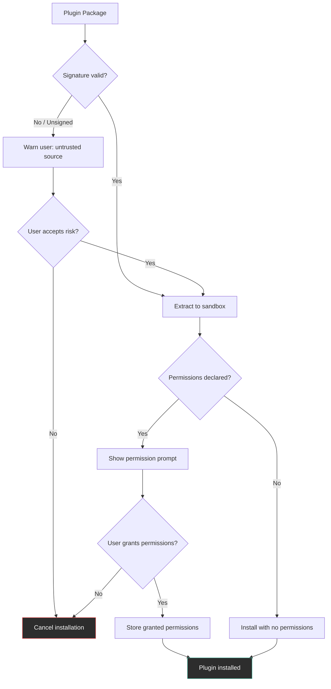

- **Dynamic library safety**: Rust plugin backends run in the same process as the host. A malicious or buggy plugin can crash the host. Mitigations: code signing validation, permission prompts, and clear warnings for unsigned plugins.
- **JavaScript plugin isolation**: Frontend plugins share the WebView context. They can access the DOM but should only interact through the registered API. A future improvement could use Web Workers or iframes for stronger isolation.
- **File system access**: Plugins requesting `filesystem` permission must declare which paths they need. The Plugin Manager enforces path restrictions.
- **No network by default**: Plugins must explicitly request the `network` permission. The host can deny network access even if requested.

### 14. Architecture Overview

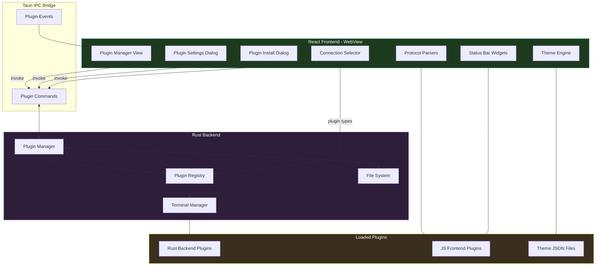

### 15. Migration Path

1. **First PR — Plugin infrastructure**: Add `PluginManager` struct in Rust, plugin directory scanning, manifest parsing, and Tauri commands. No actual plugin loading yet — just the management layer.
2. **Second PR — Theme plugins**: Implement theme plugin loading (JSON-only, no dynamic libraries). Add theme registration to the theme engine. Add Plugin Manager sidebar view.
3. **Third PR — Plugin Manager UI**: Complete Plugin Manager view with install dialog, detail panel, enable/disable, uninstall. Plugin settings section in Settings.
4. **Fourth PR — Backend plugins**: Implement dynamic library loading via `libloading`. Add `PluginConnectionConfig` variant. Wire plugin backends into `TerminalManager`.
5. **Fifth PR — Frontend plugins**: Implement JavaScript plugin loading for protocol parsers and status bar widgets. Add `window.termihub` API.
6. **Sixth PR — Plugin connection config UI**: Dynamic form rendering from JSON Schema for plugin-provided connection types.
7. **Seventh PR — Security and polish**: Code signing validation, permission enforcement, error recovery, documentation.
