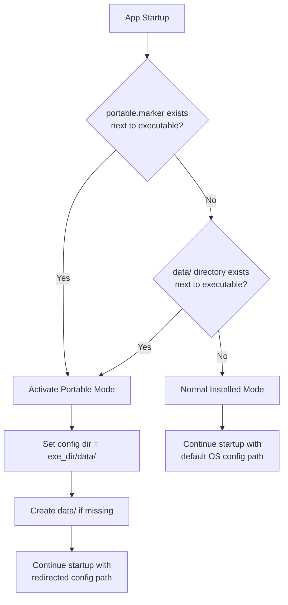
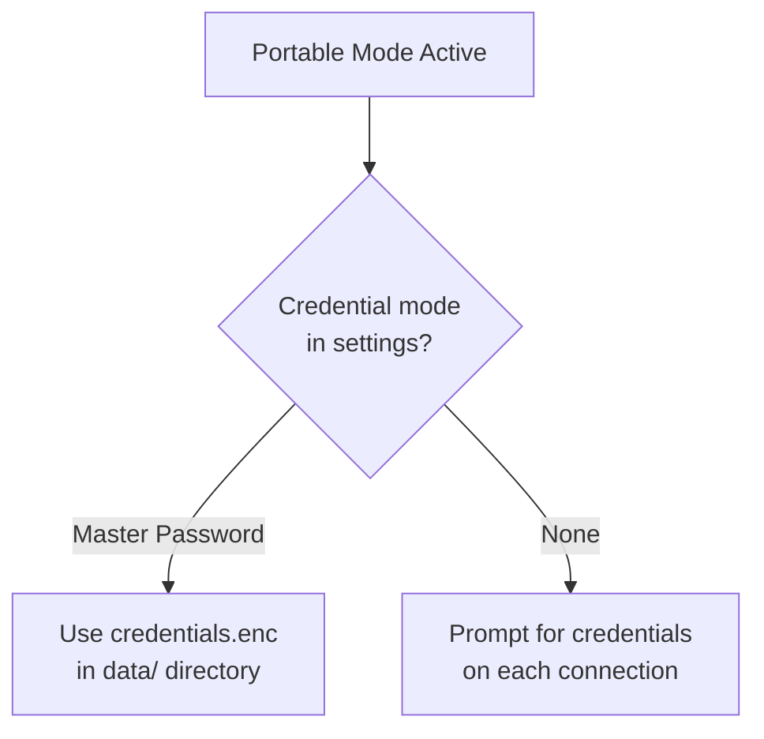
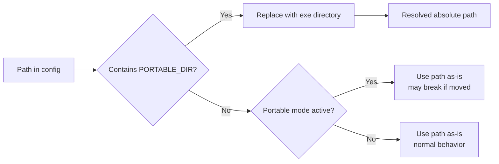
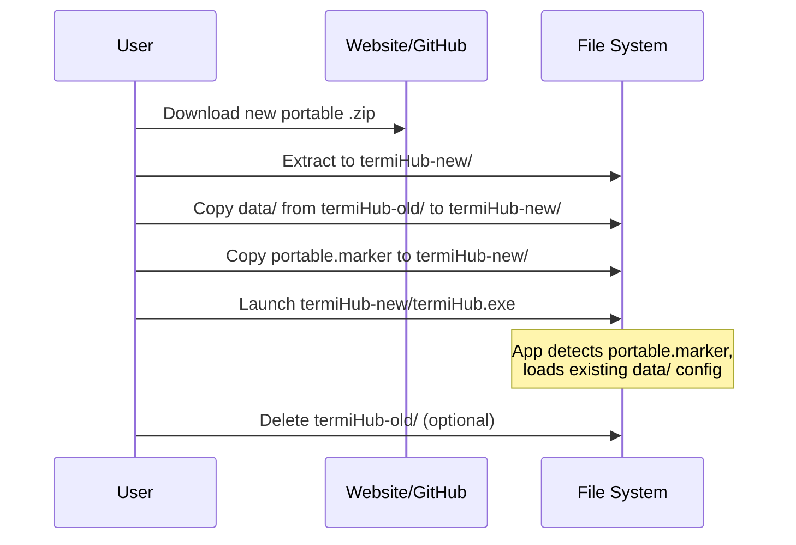
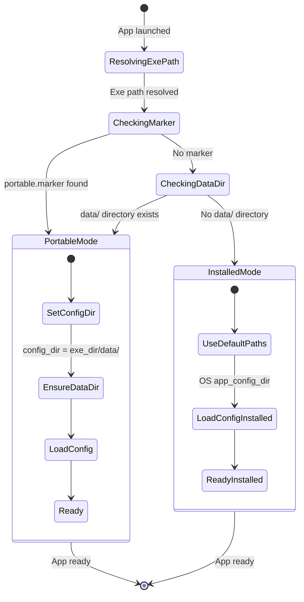
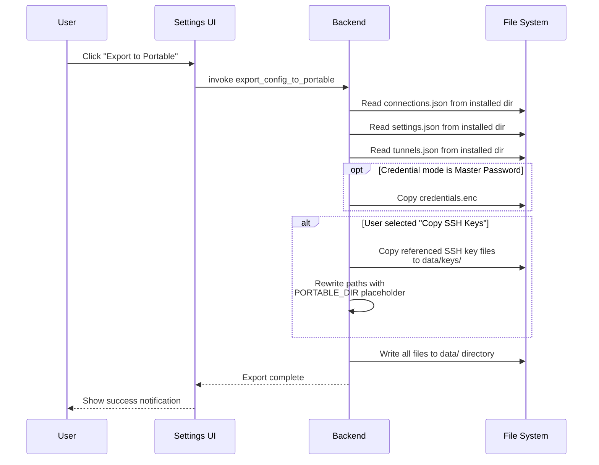
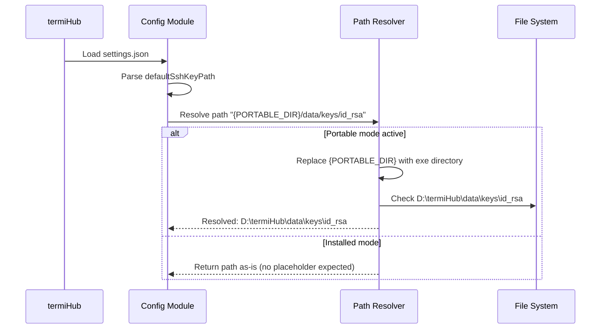
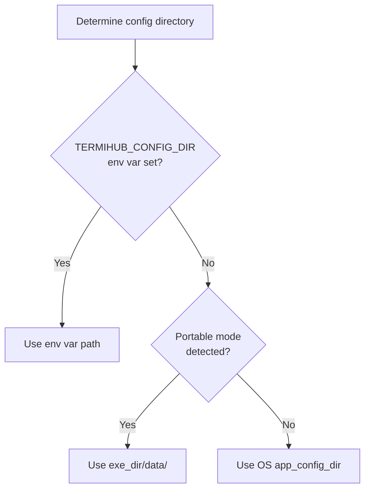

# Portable Mode

> GitHub Issue: [#524](https://github.com/armaxri/termiHub/issues/524)

## Overview

Add a portable mode for termiHub that allows it to run from a USB drive or any directory without system-level installation, storing all configuration alongside the executable. This is a key feature for IT consultants, sysadmins, and anyone who works across multiple machines — they carry their configured sessions, credentials, and tools on a USB stick or portable drive.

Key goals:

- **Zero-install operation**: Run termiHub directly from a self-contained directory without requiring admin privileges or system installation
- **Self-contained data**: All settings, connections, credentials, and tunnels stored in a `data/` subfolder next to the executable
- **Auto-detection**: Portable mode activates automatically when a `portable.marker` file or `data/` directory exists next to the binary
- **Credential safety**: Master password mode works portably; the encrypted `credentials.enc` file is stored in `data/` alongside everything else
- **Coexistence**: Portable and installed versions do not conflict on the same machine

### Existing Infrastructure

The codebase already provides a partial foundation for portable mode:

- **`TERMIHUB_CONFIG_DIR` environment variable** — all storage modules (`ConnectionStorage`, `SettingsStorage`, `TunnelStorage`, `CredentialManager`) already check for this env var and use it as the config directory when set. This is the redirect mechanism that portable mode will build on.
- **Master password credential mode** — stores credentials in a `credentials.enc` file inside the config directory, fully portable without OS dependencies.
- **JSON-based config files** — `connections.json`, `settings.json`, `tunnels.json` are plain text and can be copied between machines.

## UI Interface

### First Launch in Portable Mode

When termiHub starts and detects portable mode (via marker file or `data/` directory), the splash/welcome screen includes a "Portable Mode" badge in the title bar and status bar.

```
┌─────────────────────────────────────────────────────┐
│ termiHub                        [Portable Mode] ─ □ ✕│
│─────────────────────────────────────────────────────│
│                                                     │
│         Welcome to termiHub (Portable Mode)         │
│                                                     │
│  Your settings and connections are stored in:       │
│  📁 D:\termiHub\data\                               │
│                                                     │
│  ┌───────────────────────────────────────────┐      │
│  │ Credential Storage                        │      │
│  │                                           │      │
│  │ ○ Master Password (Recommended)           │      │
│  │   Encrypted file stored alongside app     │      │
│  │                                           │      │
│  │ ○ None                                    │      │
│  │   Prompt for credentials each time        │      │
│  └───────────────────────────────────────────┘      │
│                                                     │
│                    [Get Started]                     │
│                                                     │
└─────────────────────────────────────────────────────┘
```

In portable mode, the credential storage selector defaults to **Master Password** instead of **None**.

### Status Bar Indicator

A persistent "Portable" badge appears in the status bar (left side), next to existing indicators. Clicking it opens a tooltip showing the data directory path.

```
┌─────────────────────────────────────────────────────┐
│ 🔌 Portable │ 🔒 Locked │             │ termiHub v0.x│
└─────────────────────────────────────────────────────┘
```

### Settings Integration

The Settings panel gains a new **Portable Mode** section (read-only when in portable mode, informational when in installed mode):

```
┌──────────────────────────────────────────────────────┐
│ PORTABLE MODE                                        │
│                                                      │
│ Status:    ● Active                                  │
│ Data path: D:\termiHub\data\                         │
│                                                      │
│ ┌──────────────────────────────────────────────────┐ │
│ │ ⓘ termiHub detected a portable.marker file next  │ │
│ │   to the executable and is storing all data in   │ │
│ │   the data/ directory alongside the app.         │ │
│ └──────────────────────────────────────────────────┘ │
│                                                      │
│ Credential mode: Master Password                     │
│ Config files:                                        │
│   connections.json  ✓ present                        │
│   settings.json     ✓ present                        │
│   tunnels.json      ✓ present                        │
│   credentials.enc   ✓ present                        │
│                                                      │
│ [Export Installed Config to Portable]                 │
│ [Import Portable Config to Installed]                 │
└──────────────────────────────────────────────────────┘
```

### Config Migration Dialog

When a user wants to switch between installed and portable mode, a migration dialog assists with copying configuration:

```
┌──────────────────────────────────────────────────────┐
│ Export Configuration to Portable                     │
│                                                      │
│ This will copy your current configuration to the     │
│ portable data directory.                             │
│                                                      │
│ ☑ Connections (connections.json)                     │
│ ☑ Settings (settings.json)                           │
│ ☑ Tunnels (tunnels.json)                             │
│ ☑ Credentials (credentials.enc)                      │
│ ☐ SSH Keys (copy referenced key files)               │
│                                                      │
│ Destination: D:\termiHub\data\                       │
│                                                      │
│              [Cancel]  [Export]                       │
└──────────────────────────────────────────────────────┘
```

## General Handling

### Portable Mode Detection

On startup, before any configuration is loaded, termiHub checks for portable mode:

1. Resolve the directory containing the running executable
2. Check if `portable.marker` exists in that directory
3. If not, check if a `data/` subdirectory exists in that directory
4. If either condition is true, activate portable mode and set the config directory to `<exe_dir>/data/`

The `portable.marker` file is an empty file (or optionally contains a JSON object with overrides). Its presence is the canonical signal for portable mode. The `data/` directory is an alternative detection method for users who prefer not to have an extra marker file.



### Directory Layout

A portable termiHub distribution looks like this:

```
termiHub/                          # Root portable directory
├── termiHub.exe                   # Main executable (Windows)
├── portable.marker                # Portable mode trigger file
├── data/                          # All user data (auto-created)
│   ├── connections.json           # Connection definitions
│   ├── settings.json              # App settings
│   ├── tunnels.json               # SSH tunnel definitions
│   ├── credentials.enc            # Encrypted credentials (master password mode)
│   ├── keys/                      # Optional: SSH keys copied by user
│   │   ├── id_rsa
│   │   └── id_ed25519
│   └── logs/                      # Application logs
│       └── termihub.log
├── resources/                     # Tauri resources (icons, WebView assets)
└── WebView2Loader.dll             # Windows: WebView2 runtime (if bundled)
```

On macOS, the structure lives inside the `.app` bundle or alongside it:

```
termiHub.app/                      # macOS app bundle
portable.marker                    # Next to the .app bundle
data/                              # Next to the .app bundle
├── connections.json
├── settings.json
└── ...
```

On Linux (AppImage):

```
termiHub/                          # Extracted AppImage directory
├── termiHub.AppImage              # AppImage binary
├── portable.marker
└── data/
    ├── connections.json
    └── ...
```

### Credential Store Behavior



### Path Handling for Portability

Several settings store absolute paths that break when the portable directory moves:

| Setting                                 | Issue                                            | Solution                                                                      |
| --------------------------------------- | ------------------------------------------------ | ----------------------------------------------------------------------------- |
| `defaultSshKeyPath`                     | Absolute path to SSH key                         | Support `{PORTABLE_DIR}` placeholder, e.g., `{PORTABLE_DIR}/data/keys/id_rsa` |
| `externalConnectionFiles`               | Absolute paths to external connection JSON files | Support `{PORTABLE_DIR}` placeholder                                          |
| SSH key paths in individual connections | Absolute paths                                   | Support `{PORTABLE_DIR}` placeholder                                          |

The `{PORTABLE_DIR}` placeholder resolves to the directory containing the executable at runtime. This allows paths like `{PORTABLE_DIR}/data/keys/my_key` that remain valid regardless of the drive letter or mount point.

In installed mode, the placeholder is not needed — users use normal absolute paths. The placeholder is only resolved when portable mode is active.



### Coexistence with Installed Version

Portable and installed versions use completely separate config directories:

- **Installed**: OS-specific app data path (`%APPDATA%\com.termihub.app\` on Windows, etc.)
- **Portable**: `<exe_dir>/data/`

There is no conflict because:

- The portable binary detects its mode at startup and redirects all storage
- No shared registry keys or system-wide state is used
- The Tauri app identifier is the same, but the config paths diverge based on mode

If both are running simultaneously, they operate independently with separate configurations. Users can use the **Export/Import** feature in Settings to synchronize configuration between the two.

### Update Strategy

Since there is no auto-update mechanism in termiHub currently, portable mode does not need special update handling. The update process for portable mode is manual:

1. Download the new portable archive
2. Extract it alongside (or replacing) the existing portable directory
3. Preserve the `data/` directory and `portable.marker` — these contain all user data
4. The new version picks up existing config from `data/`



If auto-update is added in the future, the portable mode updater should:

- Download the new version to a temporary location
- Replace binaries and resources while preserving `data/` and `portable.marker`
- Restart the application

### Platform-Specific Considerations

#### Windows (Primary Target)

- **WebView2 dependency**: Windows requires the WebView2 runtime. The portable build should either bundle the fixed-version WebView2 runtime or check for its availability at startup and show a clear error message.
- **Drive letters**: USB drives may be assigned different letters on different machines. The `{PORTABLE_DIR}` placeholder handles this.
- **NTFS permissions**: No special permissions needed — the app runs in user context.
- **Windows Defender**: Executables on USB drives may trigger SmartScreen. Users may need to "Unblock" the executable.

#### macOS

- **Gatekeeper**: Unsigned `.app` bundles from external drives will be blocked. Users must right-click > Open to bypass, or the portable build should be notarized.
- **App Translocation**: macOS may move apps to a random read-only location on first launch if downloaded from the internet. The `data/` directory must be adjacent to the `.app` bundle (not inside it), and the bundle must be moved out of the Downloads folder before first launch.
- **Quarantine attribute**: `xattr -cr termiHub.app` may be needed.

#### Linux

- **AppImage**: Already semi-portable. The portable enhancement is redirecting config from `~/.config/` to the adjacent `data/` directory.
- **Permissions**: The AppImage needs execute permission (`chmod +x`).
- **FUSE**: AppImage requires FUSE. On systems without it, users can extract the AppImage.

## States & Sequences

### Application Startup State Machine



### Config Migration Sequence



### Portable Path Resolution Sequence



## Preliminary Implementation Details

> **Note**: These details reflect the codebase at the time of concept creation. The implementation may need to adapt if the codebase evolves before this feature is built.

### Portable Mode Detection (Rust Backend)

Add a new module `src-tauri/src/utils/portable.rs`:

```rust
use std::path::PathBuf;

/// Represents the application's runtime mode
#[derive(Debug, Clone, PartialEq)]
pub enum AppMode {
    Installed,
    Portable { data_dir: PathBuf },
}

/// Detect whether the app is running in portable mode.
///
/// Checks for:
/// 1. `portable.marker` file next to the executable
/// 2. `data/` directory next to the executable
///
/// Returns `AppMode::Portable` with the data directory path if detected,
/// otherwise `AppMode::Installed`.
pub fn detect_app_mode() -> anyhow::Result<AppMode> {
    let exe_path = std::env::current_exe()?;
    let exe_dir = exe_path
        .parent()
        .context("Failed to resolve executable directory")?;

    // On macOS, if inside a .app bundle, use the directory containing the bundle
    let base_dir = resolve_base_dir(exe_dir);

    let marker_path = base_dir.join("portable.marker");
    let data_dir = base_dir.join("data");

    if marker_path.exists() || data_dir.exists() {
        Ok(AppMode::Portable { data_dir })
    } else {
        Ok(AppMode::Installed)
    }
}
```

### Integration with Startup (`src-tauri/src/lib.rs`)

The existing `TERMIHUB_CONFIG_DIR` check is the hook point. Portable mode detection should run before any storage initialization and set the config directory accordingly:

```rust
// Early in run() or setup(), before storage initialization:
let app_mode = portable::detect_app_mode()?;

let config_dir = match &app_mode {
    AppMode::Portable { data_dir } => {
        // Ensure data directory exists
        std::fs::create_dir_all(data_dir)?;
        data_dir.clone()
    }
    AppMode::Installed => {
        app_handle.path().app_config_dir()?
    }
};

// Pass config_dir to all storage modules (already supported)
```

This replaces the current `TERMIHUB_CONFIG_DIR` env var check with a more robust detection. The env var remains supported as an additional override (highest priority).

### Config Directory Priority



### Path Resolver (`src-tauri/src/utils/portable.rs`)

Add path resolution for the `{PORTABLE_DIR}` placeholder:

```rust
/// Resolve portable path placeholders in a path string.
///
/// Replaces `{PORTABLE_DIR}` with the actual executable directory.
/// Returns the path unchanged if not in portable mode or no placeholder found.
pub fn resolve_portable_path(path: &str, app_mode: &AppMode) -> PathBuf {
    match app_mode {
        AppMode::Portable { data_dir } => {
            if let Some(base_dir) = data_dir.parent() {
                let resolved = path.replace("{PORTABLE_DIR}", &base_dir.to_string_lossy());
                PathBuf::from(resolved)
            } else {
                PathBuf::from(path)
            }
        }
        AppMode::Installed => PathBuf::from(path),
    }
}
```

### macOS Base Directory Resolution

On macOS, the executable lives deep inside the `.app` bundle (`termiHub.app/Contents/MacOS/termiHub`). The portable marker and data directory should be adjacent to the `.app` bundle, not inside it:

```rust
#[cfg(target_os = "macos")]
fn resolve_base_dir(exe_dir: &Path) -> PathBuf {
    // exe_dir is typically: /path/to/termiHub.app/Contents/MacOS/
    // We want: /path/to/ (the directory containing the .app bundle)
    if let Some(contents_dir) = exe_dir.parent() {
        if let Some(app_dir) = contents_dir.parent() {
            if app_dir.extension().map_or(false, |ext| ext == "app") {
                if let Some(bundle_parent) = app_dir.parent() {
                    return bundle_parent.to_path_buf();
                }
            }
        }
    }
    exe_dir.to_path_buf()
}

#[cfg(not(target_os = "macos"))]
fn resolve_base_dir(exe_dir: &Path) -> PathBuf {
    exe_dir.to_path_buf()
}
```

### Tauri State for App Mode

Store the detected `AppMode` in Tauri's managed state so all commands can access it:

```rust
// In setup:
app.manage(app_mode.clone());

// In any command:
#[tauri::command]
fn get_app_mode(app_mode: tauri::State<'_, AppMode>) -> AppMode {
    app_mode.inner().clone()
}
```

### Frontend: Portable Mode State

Add to the Zustand store (`src/store/appStore.ts`):

```typescript
interface AppState {
  // ... existing fields
  isPortableMode: boolean;
  portableDataDir: string | null;
}
```

Expose via a new Tauri command `get_app_mode` called during app initialization, before the first render.

### Frontend: Status Bar Badge

Add a `PortableBadge` component to `src/components/StatusBar/`:

```typescript
interface PortableBadgeProps {
  dataDir: string;
}

export function PortableBadge({ dataDir }: PortableBadgeProps): JSX.Element {
  // Renders a "Portable" chip in the status bar
  // Tooltip shows the full data directory path on hover
}
```

### Frontend: Settings Section

Add a `PortableModeSettings` component to `src/components/Settings/` displaying the current mode, data path, config file status, and export/import buttons.

### Build Targets for Portable Distribution

Add new scripts for producing portable archives:

| Platform | Format                                      | Script                                       |
| -------- | ------------------------------------------- | -------------------------------------------- |
| Windows  | `.zip` (no installer)                       | `scripts/build-portable.sh --target windows` |
| macOS    | `.tar.gz` containing `.app` bundle + marker | `scripts/build-portable.sh --target macos`   |
| Linux    | `.tar.gz` containing AppImage + marker      | `scripts/build-portable.sh --target linux`   |

The build script should:

1. Run the standard `tauri build` to produce platform artifacts
2. Extract/copy the built binary (not the installer)
3. Add `portable.marker` to the output directory
4. Create a `data/` directory (empty, to be populated on first launch)
5. Package into a `.zip` or `.tar.gz` archive

For Windows, the Tauri NSIS build produces a standalone `.exe` in addition to the installer. The portable build extracts this along with required DLLs and resources.

### Tauri Configuration Changes

No changes to `tauri.conf.json` are needed. The portable mode detection is purely a runtime behavior in the Rust backend. Build script changes handle the packaging.

### New Tauri Commands

| Command                       | Description                                                                            |
| ----------------------------- | -------------------------------------------------------------------------------------- |
| `get_app_mode`                | Returns whether the app is in portable or installed mode, with the data directory path |
| `export_config_to_portable`   | Copies config from installed location to a portable data directory                     |
| `import_config_from_portable` | Copies config from portable data directory to installed location                       |
| `resolve_portable_path`       | Resolves `{PORTABLE_DIR}` placeholder in a path string                                 |

### Files to Create or Modify

| File                                               | Change                                                                  |
| -------------------------------------------------- | ----------------------------------------------------------------------- |
| `src-tauri/src/utils/portable.rs`                  | **New** — portable mode detection, path resolution, base dir resolution |
| `src-tauri/src/utils/mod.rs`                       | Add `pub mod portable;`                                                 |
| `src-tauri/src/lib.rs`                             | Integrate portable detection into startup, manage `AppMode` state       |
| `src-tauri/src/commands/`                          | Add portable mode commands (`get_app_mode`, export/import)              |
| `src/services/api.ts`                              | Add `getAppMode`, `exportConfigToPortable`, `importConfigFromPortable`  |
| `src/store/appStore.ts`                            | Add `isPortableMode`, `portableDataDir` fields                          |
| `src/components/StatusBar/PortableBadge.tsx`       | **New** — status bar portable indicator                                 |
| `src/components/Settings/PortableModeSettings.tsx` | **New** — settings section for portable mode                            |
| `src/types/terminal.ts` (or new `portable.ts`)     | Add `AppMode` TypeScript type                                           |
| `scripts/build-portable.sh` / `.cmd`               | **New** — portable archive build script                                 |
| `src-tauri/src/connection/settings.rs`             | No changes required for credential handling                             |
