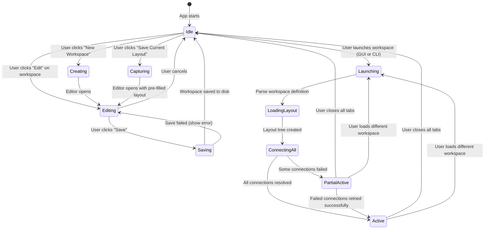
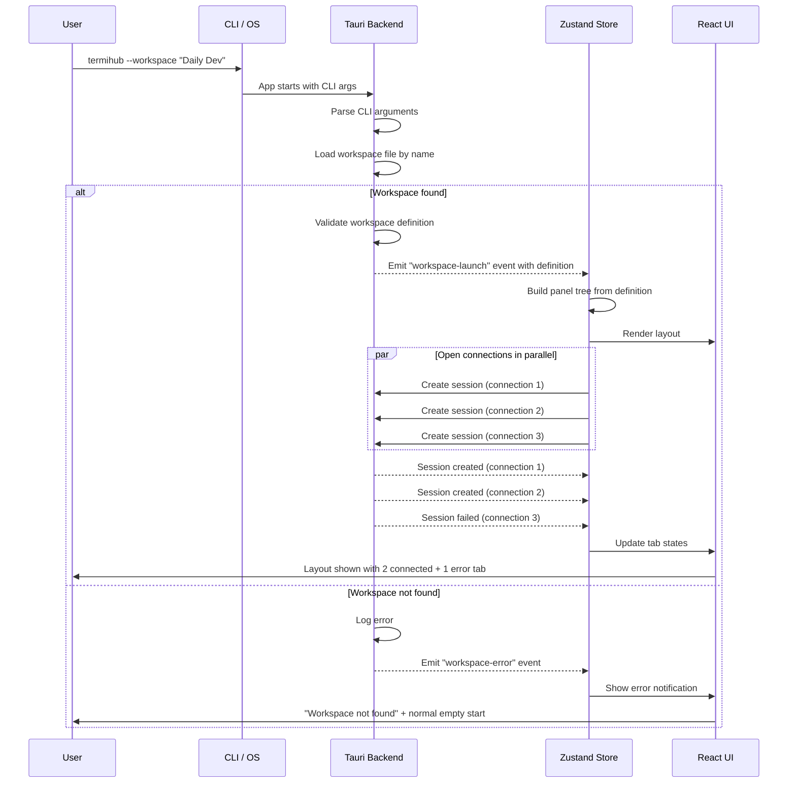
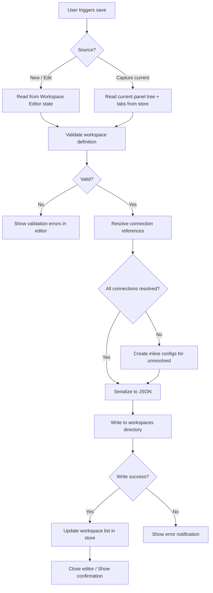
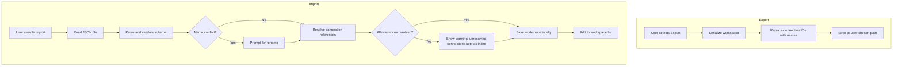

# Prepared Connection Setup

> GitHub Issue: [#503](https://github.com/armaxri/termiHub/issues/503)

## Overview

Developers often work with the same set of connections daily — e.g., an SSH session to a dev server, a local shell for builds, a serial port for embedded debugging, and a Docker container for testing — arranged in a specific split layout. Currently, users must manually open each connection and arrange panels every time the app starts.

**Prepared Connection Setup** (called **Workspaces**) lets users define reusable layouts with pre-configured connections that open automatically on app start. Workspaces are selectable via CLI arguments, enabling one-click or scripted startup of a developer's daily environment.

Key goals:

- **Zero-click startup**: Launch the app with a workspace and all connections open in the defined layout
- **CLI-driven**: Selectable via `termihub --workspace <name>` for integration with scripts, shell aliases, and automation hooks
- **Shareable**: Workspace definitions stored as standalone JSON files that can be version-controlled and shared across teams
- **Flexible**: Support arbitrary split layouts, multiple tabs per panel, and all connection types

## UI Interface

### Workspace Manager (Sidebar Section)

A new **Workspaces** section appears in the Activity Bar, represented by a grid/layout icon. Clicking it opens the Workspace Manager in the sidebar.

```
┌─────────────────────────────┐
│ WORKSPACES                  │
│                             │
│  ▶ Daily Dev Setup          │
│  ▶ Embedded Debug           │
│  ▶ Production Monitoring    │
│                             │
│  [+ New Workspace]          │
└─────────────────────────────┘
```

Each workspace entry shows:

- **Name** — user-defined label
- **Connection count** — e.g., "3 connections"
- **Right-click context menu**: Launch, Edit, Duplicate, Export, Delete

Hovering a workspace shows a tooltip with a miniature layout preview (ASCII-style representation of the split arrangement).

### Workspace Editor

Clicking "Edit" or "New Workspace" opens a **Workspace Editor** tab (similar to the Connection Editor) with these sections:

#### General Settings

```
┌──────────────────────────────────────────────────┐
│ Workspace: [Daily Dev Setup          ]           │
│ Description: [My daily development environment ] │
│ Layout Preset: [default ▾]                       │
│               (default / focus / zen)            │
└──────────────────────────────────────────────────┘
```

#### Layout Designer

A visual representation of the panel tree. Users build the layout by splitting and adding connections:

```
┌──────────────────────────────────────────────────┐
│ LAYOUT                                           │
│ ┌────────────────────┬───────────────────────┐   │
│ │ Panel 1            │ Panel 2               │   │
│ │ ┌────────────────┐ │ ┌─────────────────┐   │   │
│ │ │ SSH: dev-srv   │ │ │ Local: build    │   │   │
│ │ │ SSH: staging   │ │ │                 │   │   │
│ │ └────────────────┘ │ └─────────────────┘   │   │
│ │                    ├───────────────────────┤   │
│ │                    │ Panel 3               │   │
│ │                    │ ┌─────────────────┐   │   │
│ │                    │ │ Docker: test-db │   │   │
│ │                    │ └─────────────────┘   │   │
│ └────────────────────┴───────────────────────┘   │
│                                                  │
│ [Split Horizontal] [Split Vertical] [Add Tab]    │
└──────────────────────────────────────────────────┘
```

Interactions:

- **Click a panel** to select it (highlighted border)
- **Split Horizontal / Split Vertical** splits the selected panel
- **Add Tab** opens a connection picker to add a tab to the selected panel
- **Remove Tab** (X on each tab) removes a connection from the layout
- **Remove Panel** (X on empty panels) collapses the panel
- **Drag panel dividers** to set initial size ratios (stored as percentages)

#### Connection Picker

When adding a tab, a dropdown lists all saved connections (grouped by folder). Users can also define an **inline connection** (not saved to the connection list) for workspace-specific sessions:

```
┌─────────────────────────────────────┐
│ Choose Connection                   │
│ ┌─────────────────────────────────┐ │
│ │ 🔍 Search connections...        │ │
│ ├─────────────────────────────────┤ │
│ │ SAVED CONNECTIONS               │ │
│ │   Dev Server (SSH)              │ │
│ │   Build Machine (SSH)           │ │
│ │   Local Shell                   │ │
│ │ DOCKER                          │ │
│ │   test-db                       │ │
│ ├─────────────────────────────────┤ │
│ │ [+ Inline Connection]           │ │
│ └─────────────────────────────────┘ │
└─────────────────────────────────────┘
```

#### Per-Tab Overrides

Each tab in the layout can optionally override:

- **Terminal options** (font, color, cursor style, scrollback)
- **Initial command** (run on connection start, e.g., `cd /project && make watch`)
- **Title override** (custom tab title instead of connection name)

### "Save Current Layout as Workspace" Action

A quick action in the command palette and the Workspaces sidebar header allows capturing the current live layout (all open tabs, split arrangement, active connections) as a new workspace. This is the fastest path to creating a workspace from an existing arrangement.

```
┌──────────────────────────────────────┐
│ Save Current Layout as Workspace     │
│                                      │
│ Name: [                            ] │
│                                      │
│ Will capture:                        │
│  • 3 panels (2 horizontal + 1 vert) │
│  • 4 connections                     │
│  • Current size ratios               │
│                                      │
│        [Cancel]  [Save]              │
└──────────────────────────────────────┘
```

### Launch Workspace Dialog

When launching a workspace (from sidebar, CLI, or command palette), a brief connection progress overlay shows:

```
┌──────────────────────────────────────┐
│ Launching "Daily Dev Setup"          │
│                                      │
│  ✓ SSH: dev-srv         Connected    │
│  ⟳ SSH: staging         Connecting...│
│  ○ Local: build         Pending      │
│  ○ Docker: test-db      Pending      │
│                                      │
│           [Cancel]                   │
└──────────────────────────────────────┘
```

Connections open in parallel where possible. Failed connections show an error indicator but don't block the rest — the tab stays open with an error state so users can retry.

## General Handling

### Workspace Definition

A workspace is a JSON file that describes:

1. **Metadata**: name, description, creation date
2. **Layout tree**: a serialized panel tree (mirrors the `PanelNode` structure) with split directions and size ratios
3. **Tab assignments**: for each leaf panel, a list of tabs with connection references (by ID or inline config)
4. **Layout preset**: which UI chrome preset to apply (default/focus/zen)
5. **Active tab/panel hints**: which tab and panel should be focused after launch

### User Journeys

#### Journey 1: Create Workspace from Scratch

1. User clicks the Workspaces icon in the Activity Bar
2. Clicks "+ New Workspace"
3. Workspace Editor tab opens with a single empty panel
4. User names the workspace, e.g., "Daily Dev Setup"
5. User splits panels to desired arrangement using the layout designer
6. For each panel, user adds connections from saved connections or creates inline ones
7. User optionally configures per-tab overrides (initial commands, terminal options)
8. User clicks "Save" — workspace file is written to the workspaces directory

#### Journey 2: Create Workspace from Current Layout

1. User has already arranged their connections and layout manually
2. User opens command palette or clicks "Save as Workspace" in the sidebar
3. Dialog captures the current panel tree, open connections, and size ratios
4. User provides a name and optional description
5. Workspace is saved — all connection references resolved to saved connection IDs where possible, inline configs for ad-hoc connections

#### Journey 3: Launch via GUI

1. User opens the Workspaces sidebar
2. Double-clicks "Daily Dev Setup"
3. If tabs are already open, a confirmation dialog asks: "Close current tabs and load workspace?" with options [Replace] [Open in New Window] [Cancel]
4. Launch overlay appears, connections open in parallel
5. Layout is restored with all connections

#### Journey 4: Launch via CLI

```bash
# Launch with a named workspace
termihub --workspace "Daily Dev Setup"

# Launch with a workspace file path
termihub --workspace-file ./team-workspaces/dev-setup.json

# List available workspaces
termihub --list-workspaces
```

When launched with `--workspace`, the app skips the empty initial state and immediately loads the workspace layout during startup.

#### Journey 5: Export and Share

1. User right-clicks a workspace and selects "Export"
2. Save dialog opens — user picks a location for the `.json` file
3. Exported file uses connection references by name (not ID) for portability
4. Another team member imports the file via "Import Workspace" in the sidebar
5. On import, connection references are resolved against the local connection list; unmatched ones become inline connections with a warning

### Edge Cases

- **Missing connections**: If a workspace references a saved connection that no longer exists, show the tab with an error state ("Connection not found: dev-srv") and let the user reassign it
- **Connection type unavailable**: If the platform doesn't support a connection type (e.g., WSL on macOS), show a clear error on that tab but load the rest of the workspace
- **Concurrent workspaces**: Only one workspace is active at a time. Loading a new workspace replaces the current layout (with confirmation)
- **Workspace file corruption**: Apply the same recovery strategy used for `connections.json` — backup, attempt partial parse, fallback to empty
- **Empty workspace**: A workspace with no connections is valid — it sets up the panel layout for manual connection later
- **Duplicate names**: Workspace names must be unique within the local store; import prompts for rename on conflict
- **Large workspaces**: No hard limit on connections, but warn at >20 tabs about potential performance impact

## States and Sequences

### Workspace Lifecycle State Diagram



### CLI Launch Sequence



### Workspace Save Flow



### Workspace Import/Export Flow



## Preliminary Implementation Details

> Based on the current project architecture as of March 2026. The codebase may evolve between concept creation and implementation.

### Storage

**Workspace directory**: `<config_dir>/workspaces/` — each workspace is a separate `.json` file (named by slug of workspace name).

**Workspace file schema** (v1):

```jsonc
{
  "version": "1",
  "name": "Daily Dev Setup",
  "description": "My daily development environment",
  "layoutPreset": "default", // "default" | "focus" | "zen"
  "layout": {
    // Mirrors PanelNode from src/types/terminal.ts
    "type": "split",
    "direction": "horizontal",
    "sizes": [50, 50], // Percentage-based divider positions
    "children": [
      {
        "type": "leaf",
        "tabs": [
          {
            "connectionRef": "connection-id-or-null",
            "inlineConfig": null, // or ConnectionConfig for inline
            "title": "Dev Server",
            "terminalOptions": { "color": "#4EC9B0" },
            "initialCommand": "cd /project",
          },
        ],
        "activeTabIndex": 0,
      },
      {
        "type": "split",
        "direction": "vertical",
        "sizes": [60, 40],
        "children": [
          {
            "type": "leaf",
            "tabs": [
              {
                "connectionRef": null,
                "inlineConfig": { "type": "local", "config": {} },
                "title": "Build",
                "initialCommand": "make watch",
              },
            ],
            "activeTabIndex": 0,
          },
          {
            "type": "leaf",
            "tabs": [
              {
                "connectionRef": "docker-test-db-id",
                "title": "Test DB",
              },
            ],
            "activeTabIndex": 0,
          },
        ],
      },
    ],
  },
  "activePanelIndex": 0, // Which leaf panel gets focus
}
```

### Backend Changes (Rust)

#### New Module: `src-tauri/src/workspace/`

- **`config.rs`**: Workspace definition types (`WorkspaceDefinition`, `WorkspaceLayout`, `WorkspaceTab`)
- **`storage.rs`**: Load/save/list/delete workspace files from `<config_dir>/workspaces/`
- **`manager.rs`**: Workspace CRUD operations, validation, import/export

#### CLI Arguments: `src-tauri/tauri.conf.json`

Add Tauri CLI plugin configuration:

```jsonc
{
  "plugins": {
    "cli": {
      "args": [
        {
          "name": "workspace",
          "short": "w",
          "description": "Launch with a named workspace",
          "takesValue": true,
        },
        {
          "name": "workspace-file",
          "description": "Launch with a workspace file path",
          "takesValue": true,
        },
        {
          "name": "list-workspaces",
          "description": "List available workspaces and exit",
          "takesValue": false,
        },
      ],
    },
  },
}
```

#### New Tauri Commands: `src-tauri/src/commands/`

- `list_workspaces() -> Vec<WorkspaceSummary>`
- `load_workspace(name: String) -> WorkspaceDefinition`
- `save_workspace(definition: WorkspaceDefinition) -> Result<()>`
- `delete_workspace(name: String) -> Result<()>`
- `export_workspace(name: String, path: String) -> Result<()>`
- `import_workspace(path: String) -> Result<WorkspaceDefinition>`
- `get_cli_workspace() -> Option<String>` — returns the `--workspace` arg if provided at startup

### Frontend Changes (TypeScript/React)

#### Store Extensions (`src/store/appStore.ts`)

New state fields:

```typescript
workspaces: WorkspaceSummary[];  // Loaded on startup
activeWorkspaceName: string | null;
```

New actions:

```typescript
loadWorkspaces(): Promise<void>;
launchWorkspace(name: string): Promise<void>;
saveCurrentAsWorkspace(name: string, description: string): Promise<void>;
```

`launchWorkspace()` implementation:

1. Load workspace definition from backend
2. Apply layout preset
3. Build panel tree from workspace layout definition (recursive, mirroring `PanelNode` construction)
4. For each leaf's tabs, call `addTab()` with the connection config
5. Trigger session creation for each tab in parallel
6. Set active panel/tab per workspace hints

#### Startup Modification (`src/App.tsx`)

After `loadFromBackend()`, check for CLI workspace arg:

```typescript
const cliWorkspace = await invoke("get_cli_workspace");
if (cliWorkspace) {
  await launchWorkspace(cliWorkspace);
}
```

#### New Components

- **`src/components/WorkspaceSidebar/WorkspaceSidebar.tsx`**: Sidebar panel listing workspaces with context menus
- **`src/components/WorkspaceEditor/WorkspaceEditor.tsx`**: Tab-based editor for creating/editing workspaces
- **`src/components/WorkspaceEditor/LayoutDesigner.tsx`**: Visual panel tree builder
- **`src/components/WorkspaceEditor/ConnectionPicker.tsx`**: Connection selector dropdown for adding tabs to panels
- **`src/components/WorkspaceLaunchOverlay/WorkspaceLaunchOverlay.tsx`**: Progress overlay during workspace launch

#### New Types (`src/types/workspace.ts`)

```typescript
interface WorkspaceSummary {
  name: string;
  description: string;
  connectionCount: number;
  panelCount: number;
}

interface WorkspaceDefinition {
  version: string;
  name: string;
  description: string;
  layoutPreset: LayoutPreset;
  layout: WorkspaceLayoutNode;
  activePanelIndex: number;
}

type WorkspaceLayoutNode = WorkspaceLeaf | WorkspaceSplit;

interface WorkspaceLeaf {
  type: "leaf";
  tabs: WorkspaceTabDef[];
  activeTabIndex: number;
}

interface WorkspaceSplit {
  type: "split";
  direction: "horizontal" | "vertical";
  sizes: number[]; // Percentages
  children: WorkspaceLayoutNode[];
}

interface WorkspaceTabDef {
  connectionRef: string | null; // Saved connection ID
  inlineConfig: ConnectionConfig | null;
  title: string;
  terminalOptions?: TerminalOptions;
  initialCommand?: string;
}
```

#### Activity Bar Entry

Add a new Activity Bar icon (grid/layout icon) that toggles the Workspace sidebar view, following the same pattern as the existing connection and tunnel sidebar entries.

### File Locations Summary

| Change Area           | Files                                                                                  |
| --------------------- | -------------------------------------------------------------------------------------- |
| Rust workspace module | `src-tauri/src/workspace/{config,storage,manager}.rs`                                  |
| Tauri commands        | `src-tauri/src/commands/workspace.rs`                                                  |
| CLI config            | `src-tauri/tauri.conf.json` (add CLI plugin)                                           |
| Frontend types        | `src/types/workspace.ts`                                                               |
| Store                 | `src/store/appStore.ts` (extend with workspace state/actions)                          |
| Sidebar               | `src/components/WorkspaceSidebar/WorkspaceSidebar.tsx`                                 |
| Editor                | `src/components/WorkspaceEditor/{WorkspaceEditor,LayoutDesigner,ConnectionPicker}.tsx` |
| Launch overlay        | `src/components/WorkspaceLaunchOverlay/WorkspaceLaunchOverlay.tsx`                     |
| Startup               | `src/App.tsx` (CLI workspace check)                                                    |
| Activity Bar          | `src/components/ActivityBar/ActivityBar.tsx` (new icon)                                |
