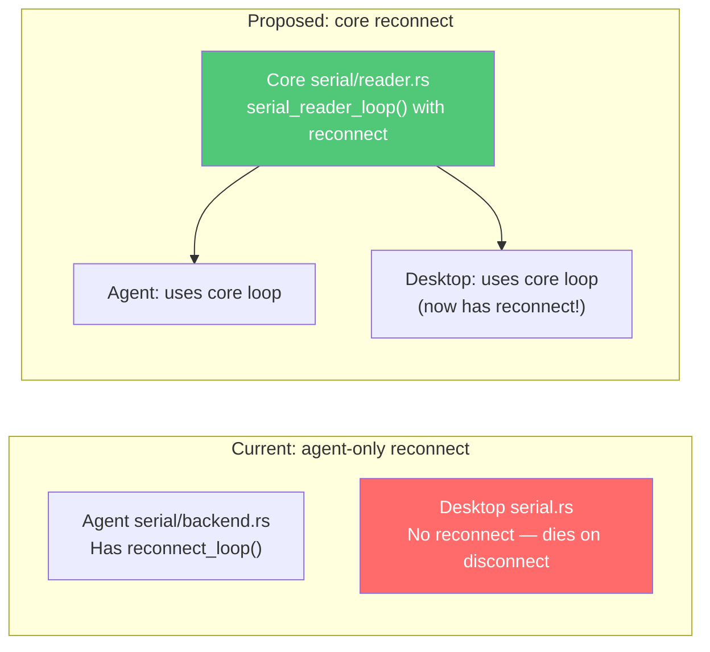
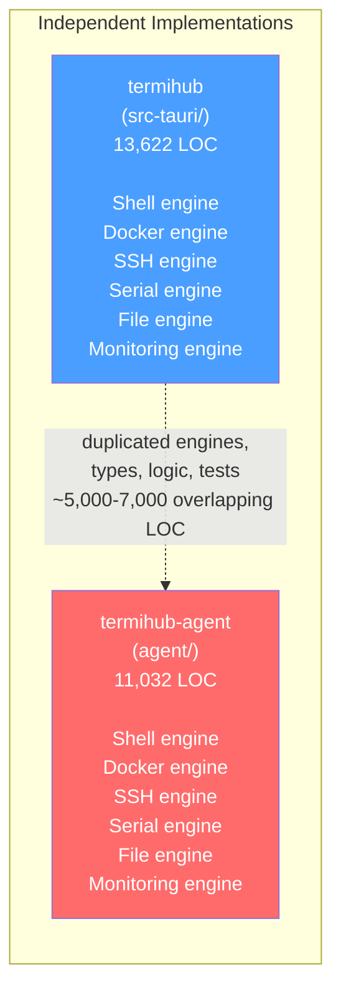
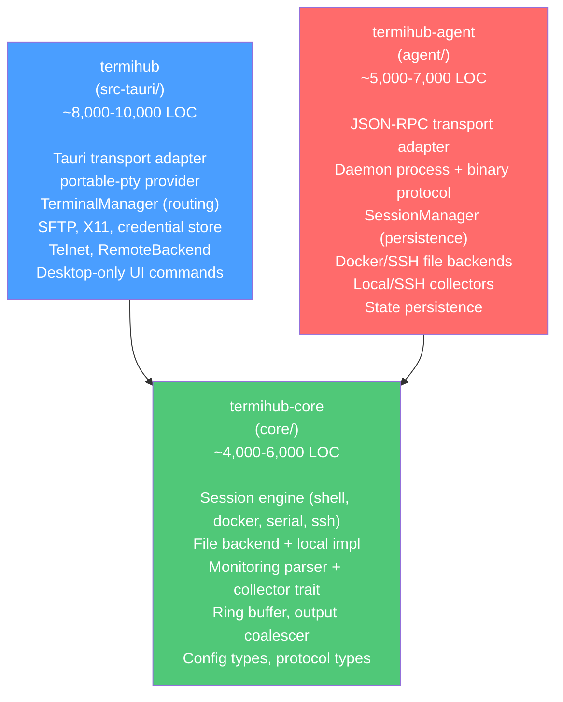
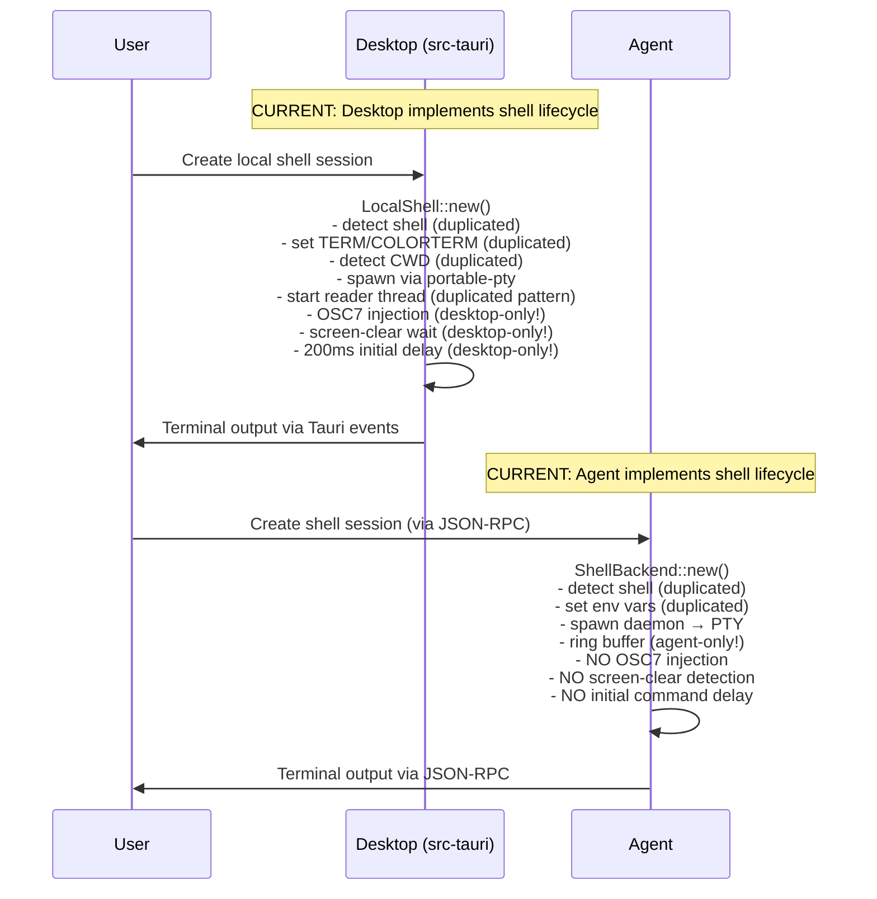
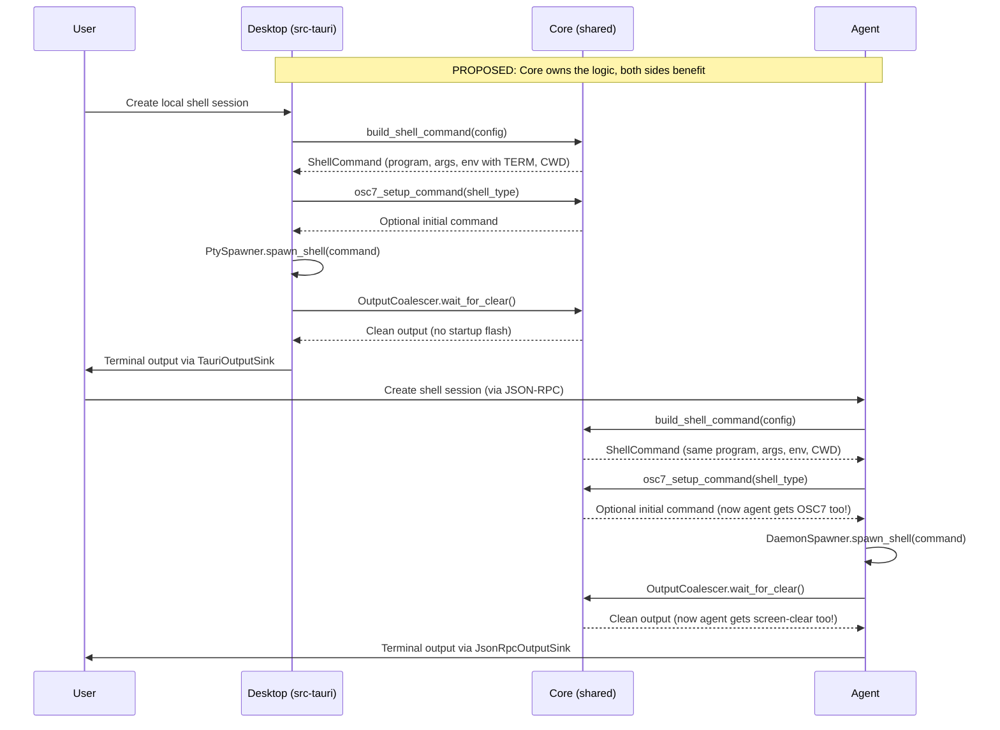
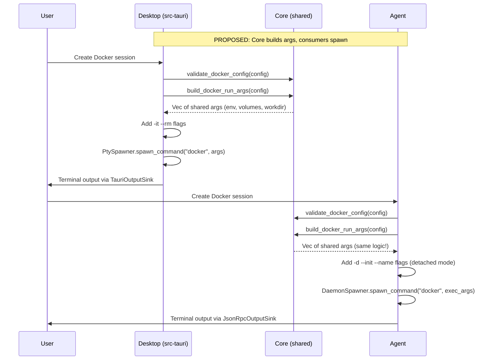
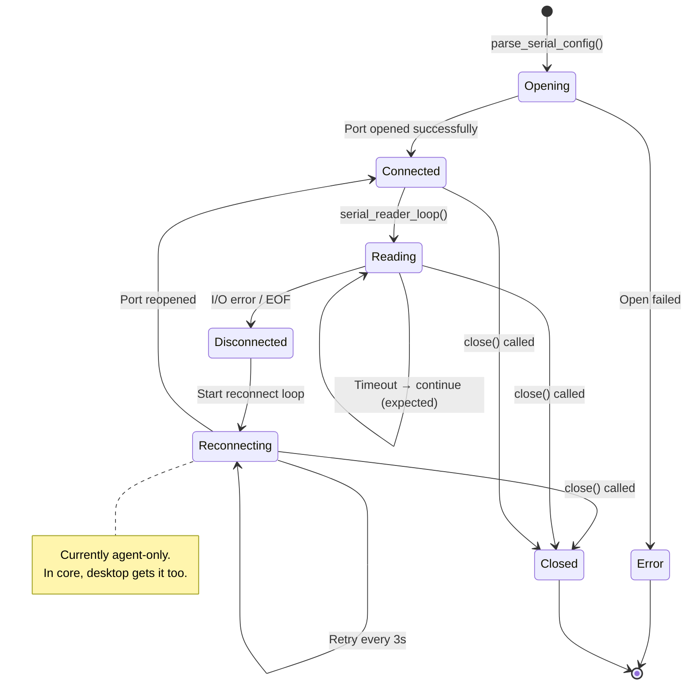
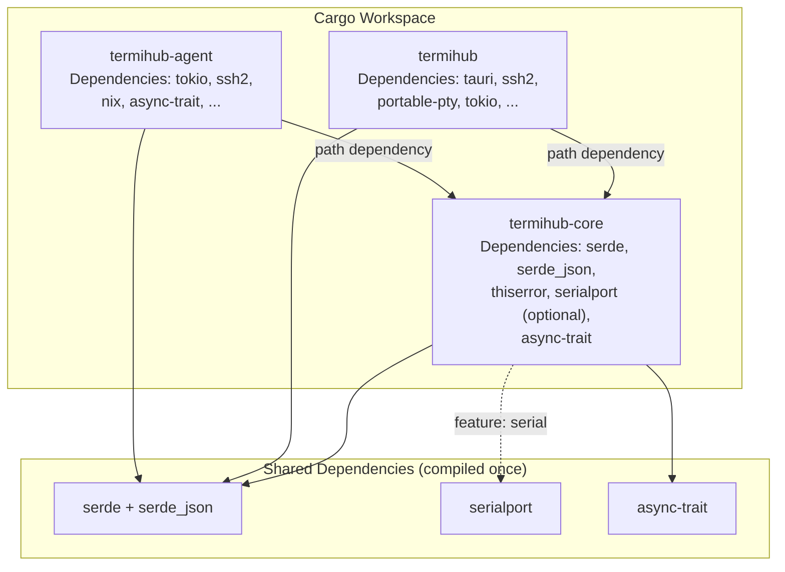
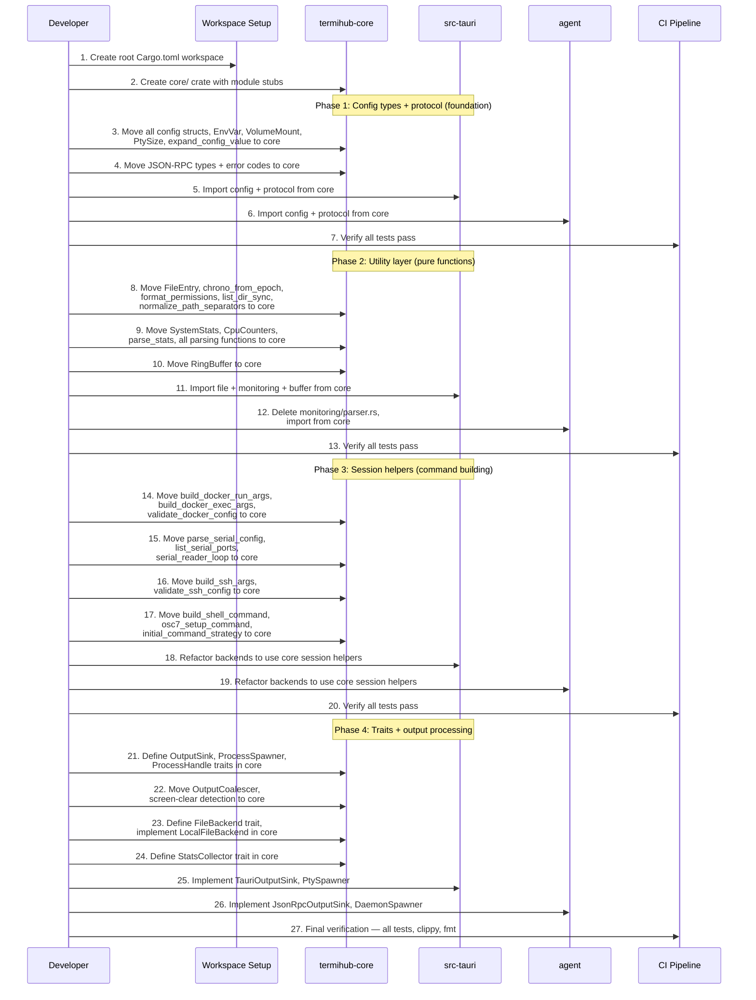

# Concept: Shared Rust Core Library

**GitHub Issue:** [#277](https://github.com/armaxri/termiHub/issues/277)

---

## Overview

termiHub currently maintains two independent Rust crates:

- **`src-tauri/`** (package `termihub`, 13,622 LOC) — the Tauri desktop backend
- **`agent/`** (package `termihub-agent`, 11,032 LOC) — the remote agent

Both crates do **fundamentally the same thing**: manage terminal sessions (shell, serial, Docker, SSH), browse files, and monitor systems. The only difference is *where they run* and *how they deliver output*:

- Desktop: runs locally, delivers output via Tauri events
- Agent: runs remotely, delivers output via JSON-RPC notifications over SSH

This has led to deep duplication — not just of types and utility functions, but of **the entire backend logic**. Every connection type follows the identical lifecycle in both crates:

```text
[config] → [validate] → [build command] → [spawn process] → [manage PTY/port I/O] → [deliver output]
```

Everything up to "deliver output" is the same logic. The transport mechanism (Tauri events vs JSON-RPC) is the only real difference.

### The Problem: Two Implementations of One System

The previous version of this concept identified ~945 lines of surface duplication (utility functions, types, parsers) and proposed a ~700 LOC utility crate. That analysis was too narrow. The real problem is that the desktop and agent are **two complete implementations of the same backend engine**, separated only by a transport layer.

Consider what happens when you fix a bug:

- A WSL startup edge case in the local shell? Fixed in `src-tauri/src/terminal/local_shell.rs` but the agent's `shell/backend.rs` doesn't benefit.
- A Docker `--init` timing issue? Fixed in one `docker_shell.rs` or `docker/backend.rs`, not the other.
- A serial flow control parsing bug? Both `serial.rs` files have byte-for-byte identical match blocks — you must remember to fix both.
- Output coalescing improvements? Desktop has 32 KB coalescing with screen-clear detection. Agent has 65 KB chunking. Neither benefits from the other's optimizations.

The agent hasn't been tested as extensively as the desktop. Bug fixes and edge case handling that exist in the desktop code today don't reach the agent, and vice versa. The agent has features (ring buffer, session persistence, reconnect) that the desktop doesn't benefit from.

### Motivation

1. **Duplicated backend engine** — The entire session lifecycle (config parsing, command building, process spawning, I/O management, output delivery) is implemented twice with near-identical logic
2. **Bug fix isolation** — Edge case fixes in one crate never reach the other. The desktop has workarounds (OSC7 injection, screen-clear detection, 200ms startup delay) that the agent lacks.
3. **Feature asymmetry** — The agent has capabilities (ring buffer, attach/detach, session recovery) that would benefit the desktop but can't be shared
4. **Duplicated types and utilities** — `FileEntry`, `SystemStats`, `CpuCounters`, config structs, JSON-RPC types, serial/docker/file/monitoring logic all exist in both crates
5. **Testing burden** — Every feature and fix must be tested in both crates independently

### Duplication Analysis: Beyond Utilities

#### What the Previous Analysis Found (~945 LOC)

Surface-level duplications: serial config match blocks, Docker arg vectors, `FileEntry` structs, monitoring parsers, `chrono_from_epoch`, `format_permissions`, protocol types. This is real duplication, but it's the tip of the iceberg.

#### What the Previous Analysis Missed

The entire session management layer is duplicated at the **architectural level**. Both sides follow the same pattern for every connection type:

| Connection Type | Desktop Implementation | Agent Implementation | What's Actually Different |
| --------------- | ---------------------- | --------------------- | ------------------------- |
| **Shell** | `LocalShell::new()` → portable-pty → reader thread → mpsc channel | `ShellBackend::new()` → daemon → nix openpty → poll loop → Unix socket | Only the PTY provider and transport |
| **Docker** | `DockerShell::new()` → build args → portable-pty → reader thread | `DockerBackend::new()` → build args → `docker run -d` → daemon → `docker exec` | Only the container lifecycle strategy and transport |
| **SSH** | `SshConnection::new()` → ssh2 channel → blocking mode juggling → reader thread | `SshBackend::new()` → build `ssh -tt` args → daemon → PTY | Only the SSH implementation strategy and transport |
| **Serial** | `SerialConnection::new()` → parse config → open port → reader thread | `SerialBackend::new()` → parse config → open port → reader thread + ring buffer | Nearly identical; agent adds ring buffer |
| **File listing** | `list_dir()` → iterate entries → skip `.`/`..` → build `FileEntry` | `list_dir_sync()` → iterate entries → skip `.`/`..` → build `FileEntry` | Only error types |
| **Monitoring** | `parse_stats()` → `CpuCounters` → delta calculation | `parse_stats()` → `CpuCounters` → delta calculation | Explicitly documented copy |

The *logic* is the same. The *transport* differs. The current architecture forces implementing and maintaining the logic twice because it's entangled with transport concerns.

#### Concrete Bug Fix Examples

Desktop-only edge cases that the agent doesn't have:

| Edge Case | Desktop Code | Agent Status |
| --------- | ------------ | ------------ |
| OSC7 working directory tracking injection | `manager.rs:78-95` — injects OSC7 setup for WSL/SSH shells | Missing — agent shells don't get CWD tracking |
| Screen-clear detection for clean startup | `manager.rs:293-330` — waits for ANSI `ESC[2J ESC[H` before emitting | Missing — agent may flash startup noise |
| Initial command delay (200ms) | `manager.rs:188-200` — separate thread sleeps then sends | Missing — agent doesn't delay initial commands |
| SSH blocking mode coordination | `ssh.rs:132-156` — toggles blocking for write/resize to prevent reader deadlock | Not applicable (agent uses daemon) but shows the kind of workaround that accumulates |
| Serial timeout handling | `serial.rs:76` — explicitly catches `TimedOut` and continues | `serial/backend.rs:248` — also handles `TimedOut` but with different error handling path |
| Output coalescing (32 KB batching) | `manager.rs:335-340` — coalesces pending chunks into single event | Agent has 65 KB chunking, different logic — neither benefits from improvements to the other |

Agent-only features that the desktop doesn't benefit from:

| Feature | Agent Code | Desktop Status |
| ------- | ---------- | -------------- |
| Ring buffer (1 MiB) for output replay | `buffer/ring_buffer.rs` — circular buffer for serial + daemon | Missing — desktop serial has no replay capability |
| Session persistence across restarts | `session/manager.rs:451-647` — state.json + daemon socket recovery | Missing — desktop loses all sessions on restart |
| Attach/detach semantics | `daemon/client.rs` — disconnect without killing, reconnect with replay | Missing — desktop close = kill |
| Serial auto-reconnect | `serial/backend.rs:313-346` — retries every 3s when device disconnects | Missing — desktop serial just dies on disconnect |
| Docker container persistence | `docker/backend.rs:71-87` — `docker run -d` keeps container alive | Missing — desktop uses `docker run -it --rm` which dies on close |

### Vision

`termihub-core` should not be a ~700 LOC utility crate. It should be **the actual backend engine** — owning the session lifecycle, I/O management, file operations, and monitoring logic. The desktop and agent become thin transport adapters that inject their specific delivery mechanism into the shared core.

A bug fix in the core fixes it everywhere. A new feature in the core is available everywhere.

---

## UI Interface

This is an internal infrastructure change with no user-facing UI impact. The "interface" is the **developer experience** — how contributors interact with the workspace.

### Developer Workflow Changes

**Before (current):**

```bash
# Build desktop
cd src-tauri && cargo build

# Build agent
cd agent && cargo build

# Run all tests (two separate invocations)
cd src-tauri && cargo test
cd agent && cargo test
```

**After (proposed workspace):**

```bash
# Build everything from repo root
cargo build --workspace

# Test everything from repo root
cargo test --workspace

# Build only desktop
cargo build -p termihub

# Build only agent
cargo build -p termihub-agent

# Build only shared core
cargo build -p termihub-core
```

### Import Pattern (Developer Perspective)

In both `src-tauri/` and `agent/`:

```rust
// Session management — the core engine
use termihub_core::session::{SessionBackend, SessionConfig, SessionEvent};
use termihub_core::session::shell::ShellSession;
use termihub_core::session::docker::DockerSession;
use termihub_core::session::serial::SerialSession;
use termihub_core::session::ssh::SshCommandBuilder;

// File operations
use termihub_core::files::{FileBackend, FileEntry, LocalFileBackend};
use termihub_core::files::utils::{chrono_from_epoch, format_permissions};

// Monitoring
use termihub_core::monitoring::{SystemStats, CpuCounters, parse_stats, StatsCollector};

// Ring buffer — shared between serial, daemon, and potentially desktop
use termihub_core::buffer::RingBuffer;

// Config types
use termihub_core::config::{ShellConfig, SerialConfig, DockerConfig, SshConfig, EnvVar, VolumeMount};

// Protocol types
use termihub_core::protocol::{JsonRpcRequest, JsonRpcNotification, errors};
```

### Script Impact

The existing `scripts/` would need minor updates:

- `test.sh` could use `cargo test --workspace` instead of running three separate commands
- `check.sh` could use `cargo clippy --workspace` and `cargo fmt --all`
- `build.sh` and `dev.sh` unchanged (they target specific packages)

---

## General Handling

### Architecture: The Core as Backend Engine

The key insight driving this rewrite: both crates follow the **same session lifecycle** for every connection type. The only variation is the transport layer — how output reaches the user and how processes are spawned.

```mermaid
graph TD
    subgraph "termihub-core (shared backend engine)"
        direction TB

        subgraph "Session Layer"
            ST[SessionBackend trait<br/>write_input, resize, close, is_alive]
            SHELL[shell/<br/>ShellSession — config validation,<br/>command building, env setup,<br/>CWD detection, OSC7 injection]
            DOCKER[docker/<br/>DockerSession — arg building,<br/>container lifecycle,<br/>env vars, volumes, workdir]
            SERIAL[serial/<br/>SerialSession — config parsing,<br/>port management, reconnect logic]
            SSH_B[ssh/<br/>SshCommandBuilder — arg building,<br/>auth method handling,<br/>key path resolution]
        end

        subgraph "I/O Layer"
            BUF[buffer/<br/>RingBuffer — 1 MiB circular,<br/>replay on attach]
            COAL[output/<br/>OutputCoalescer — batching,<br/>screen-clear detection]
            IOLOOP[io/<br/>ReaderLoop — configurable<br/>buffer size, timeout handling,<br/>alive flag management]
        end

        subgraph "File Layer"
            FB[FileBackend trait<br/>list, read, write, delete,<br/>rename, stat]
            LF[files/local.rs<br/>list_dir_sync, path normalization]
            FU[files/utils.rs<br/>FileEntry, chrono_from_epoch,<br/>format_permissions]
        end

        subgraph "Monitoring Layer"
            MC[StatsCollector trait<br/>collect → SystemStats]
            MP[monitoring/parser.rs<br/>parse_stats, parse_cpu_line,<br/>cpu_percent_from_delta,<br/>parse_meminfo_value]
            MT[monitoring/types.rs<br/>SystemStats, CpuCounters]
        end

        subgraph "Config & Protocol"
            CFG[config/<br/>ShellConfig, SerialConfig,<br/>DockerConfig, SshConfig,<br/>EnvVar, VolumeMount]
            PROTO[protocol/<br/>JSON-RPC types + error codes]
        end
    end

    subgraph "termihub (desktop) — thin transport adapter"
        DTM[TerminalManager<br/>Tauri event emission,<br/>session routing]
        DPTY[PtyProvider<br/>portable-pty spawning,<br/>cross-platform PTY]
        DCMD[commands/<br/>Tauri IPC handlers]
        DSFTP[files/sftp.rs<br/>SFTP session pooling]
        DSSH[ssh.rs<br/>ssh2 channel management,<br/>X11 forwarding]
        DMON[monitoring/<br/>MonitoringManager — SSH exec]
    end

    subgraph "termihub-agent (agent) — thin transport adapter"
        ASM[SessionManager<br/>JSON-RPC dispatch,<br/>state persistence]
        ADMN[daemon/<br/>Daemon process spawning,<br/>binary frame protocol,<br/>Unix socket IPC]
        AH[handler/<br/>JSON-RPC method routing]
        AFSSH[files/ssh.rs<br/>SFTP relay]
        AFDKR[files/docker.rs<br/>docker exec file ops]
        AMON[monitoring/<br/>LocalCollector — /proc,<br/>SshCollector — SSH exec]
    end

    DTM --> ST
    DTM --> COAL
    DPTY --> SHELL
    DPTY --> DOCKER
    DSSH --> SSH_B
    DCMD --> CFG
    DCMD --> PROTO
    DSFTP --> FB
    DMON --> MC
    DMON --> MP

    ASM --> ST
    ADMN --> SHELL
    ADMN --> DOCKER
    ADMN --> SSH_B
    ADMN --> BUF
    AH --> CFG
    AH --> PROTO
    AFSSH --> FB
    AFDKR --> FB
    AMON --> MC
    AMON --> MP
```



### The Transport Injection Pattern

The core defines **what** to do. Consumers define **how** to deliver it.

```rust
/// Core defines the output sink trait — consumers inject their transport.
pub trait OutputSink: Send + 'static {
    fn send_output(&self, session_id: &str, data: Vec<u8>) -> Result<()>;
    fn send_exit(&self, session_id: &str, exit_code: Option<i32>) -> Result<()>;
    fn send_error(&self, session_id: &str, message: &str) -> Result<()>;
}

/// Core defines the process spawner trait — consumers inject their PTY/daemon mechanism.
pub trait ProcessSpawner: Send + Sync {
    type Handle: ProcessHandle;

    fn spawn_shell(
        &self,
        command: &ShellCommand,
        pty_size: PtySize,
        env: &HashMap<String, String>,
        cwd: Option<&Path>,
    ) -> Result<Self::Handle>;

    fn spawn_command(
        &self,
        program: &str,
        args: &[String],
        pty_size: PtySize,
        env: &HashMap<String, String>,
    ) -> Result<Self::Handle>;
}

/// Handle to a spawned process — abstracts over portable-pty vs daemon.
pub trait ProcessHandle: Send {
    fn write_input(&self, data: &[u8]) -> Result<()>;
    fn resize(&self, cols: u16, rows: u16) -> Result<()>;
    fn close(&self) -> Result<()>;
    fn is_alive(&self) -> bool;
}
```

**Desktop provides:**

```rust
/// Uses portable-pty for cross-platform PTY management.
struct PtySpawner;

impl ProcessSpawner for PtySpawner {
    type Handle = PtyHandle;

    fn spawn_shell(&self, command: &ShellCommand, ...) -> Result<PtyHandle> {
        let pty_system = portable_pty::native_pty_system();
        let pair = pty_system.openpty(size)?;
        let child = pair.slave.spawn_command(cmd)?;
        // ... reader thread, writer handle
        Ok(PtyHandle { master, writer, child, alive })
    }
}

/// Emits output via Tauri events.
struct TauriOutputSink { app_handle: AppHandle }

impl OutputSink for TauriOutputSink {
    fn send_output(&self, session_id: &str, data: Vec<u8>) -> Result<()> {
        self.app_handle.emit("terminal-output", TerminalOutputEvent { session_id, data })?;
        Ok(())
    }
}
```

**Agent provides:**

```rust
/// Uses daemon processes for PTY persistence.
struct DaemonSpawner { socket_dir: PathBuf }

impl ProcessSpawner for DaemonSpawner {
    type Handle = DaemonClient;

    fn spawn_shell(&self, command: &ShellCommand, ...) -> Result<DaemonClient> {
        let socket_path = self.socket_dir.join(format!("session-{}.sock", session_id));
        // Spawn termihub-agent --daemon with env vars
        // Wait for socket, connect via DaemonClient
        Ok(client)
    }
}

/// Emits output via JSON-RPC notifications.
struct JsonRpcOutputSink { notification_tx: NotificationSender }

impl OutputSink for JsonRpcOutputSink {
    fn send_output(&self, session_id: &str, data: Vec<u8>) -> Result<()> {
        let encoded = base64::encode(&data);
        self.notification_tx.send(JsonRpcNotification {
            method: "session.output",
            params: json!({ "session_id": session_id, "data": encoded }),
        })?;
        Ok(())
    }
}
```

### What Goes in the Shared Core

#### 1. `session/` — Session Backend Engine (the biggest win)

This is the core of the concept. The session module owns the **entire lifecycle** of each connection type, parameterized over transport.

```rust
// termihub-core/src/session/mod.rs

/// A running terminal session, parameterized over transport.
pub struct Session<S: OutputSink, P: ProcessHandle> {
    pub id: String,
    pub session_type: SessionType,
    handle: P,
    output_sink: S,
    ring_buffer: Option<Arc<Mutex<RingBuffer>>>,
    alive: Arc<AtomicBool>,
}

impl<S: OutputSink, P: ProcessHandle> Session<S, P> {
    pub fn write_input(&self, data: &[u8]) -> Result<()>;
    pub fn resize(&self, cols: u16, rows: u16) -> Result<()>;
    pub fn close(&self) -> Result<()>;
    pub fn is_alive(&self) -> bool;
    pub fn attach(&self) -> Result<()>;    // replay ring buffer, start forwarding
    pub fn detach(&self) -> Result<()>;    // stop forwarding, keep alive
}
```

**Shell session logic** (currently duplicated in `local_shell.rs` + `shell/backend.rs`):

```rust
// termihub-core/src/session/shell.rs

/// Build a shell command from config — pure logic, no I/O.
pub struct ShellCommand {
    pub program: String,
    pub args: Vec<String>,
    pub env: HashMap<String, String>,
    pub cwd: Option<PathBuf>,
    pub pty_size: PtySize,
}

/// Resolve shell config into a concrete command.
/// Handles: shell detection, TERM/COLORTERM env, CWD fallback,
/// OSC7 injection for CWD tracking.
pub fn build_shell_command(config: &ShellConfig) -> Result<ShellCommand> {
    let program = config.shell.clone()
        .unwrap_or_else(|| detect_default_shell());
    let mut env = config.env.clone();
    env.insert("TERM".into(), "xterm-256color".into());
    env.insert("COLORTERM".into(), "truecolor".into());

    let cwd = config.starting_directory.as_ref()
        .map(PathBuf::from)
        .or_else(|| home_directory());  // platform-aware HOME/USERPROFILE

    Ok(ShellCommand { program, args: vec![], env, cwd, pty_size: config.pty_size() })
}

/// Generate an OSC7 setup command for CWD tracking.
/// Currently only exists in the desktop manager — would benefit both sides.
pub fn osc7_setup_command(shell_type: &str) -> Option<String> { ... }

/// Determine initial command delay strategy.
/// Desktop uses 200ms delay; should be a core concern.
pub fn initial_command_strategy(
    initial_command: Option<&str>,
    wait_for_clear: bool,
) -> InitialCommandStrategy { ... }
```

**Docker session logic** (currently duplicated in `docker_shell.rs` + `docker/backend.rs`):

```rust
// termihub-core/src/session/docker.rs

/// Build docker run arguments from config — pure logic, no I/O.
/// Handles: env vars, volume mounts, working directory, shell selection.
pub fn build_docker_run_args(config: &DockerConfig) -> Vec<String> { ... }

/// Build docker exec arguments for attaching to an existing container.
pub fn build_docker_exec_args(container: &str, shell: &str) -> Vec<String> { ... }

/// Validate Docker config before attempting to create a session.
pub fn validate_docker_config(config: &DockerConfig) -> Result<()> { ... }

/// Docker container lifecycle management.
pub struct DockerContainer {
    pub name: String,
    pub image: String,
    pub remove_on_exit: bool,
}

impl DockerContainer {
    /// Check if container is still running.
    pub fn is_running(&self) -> Result<bool> { ... }

    /// Stop and optionally remove the container.
    pub fn cleanup(&self) -> Result<()> { ... }
}
```

**Serial session logic** (currently duplicated in `serial.rs` + `serial/backend.rs`):

```rust
// termihub-core/src/session/serial.rs

/// Parsed serial port settings — converted from string config.
pub struct ParsedSerialConfig {
    pub port: String,
    pub baud_rate: u32,
    pub data_bits: serialport::DataBits,
    pub stop_bits: serialport::StopBits,
    pub parity: serialport::Parity,
    pub flow_control: serialport::FlowControl,
}

/// Parse string-based config into serialport crate enums.
/// Currently byte-for-byte identical in both crates.
pub fn parse_serial_config(config: &SerialConfig) -> ParsedSerialConfig { ... }

/// Serial port reader loop — handles timeouts, reconnection, ring buffer.
/// Currently the agent has reconnect logic that the desktop lacks.
/// In core, both sides benefit from reconnect.
pub fn serial_reader_loop<S: OutputSink>(
    port: Box<dyn SerialPort>,
    config: &SerialConfig,
    ring_buffer: Arc<Mutex<RingBuffer>>,
    output_sink: S,
    alive: Arc<AtomicBool>,
    attached: Arc<AtomicBool>,
) { ... }

/// List available serial ports — pure utility.
pub fn list_serial_ports() -> Vec<String> { ... }
```

**SSH command building** (currently split between `ssh.rs` using ssh2 API and `ssh/backend.rs` building CLI args):

```rust
// termihub-core/src/session/ssh.rs

/// Build SSH command-line arguments from config.
/// Used by agent's daemon approach. Desktop could also use this
/// as a fallback when ssh2 channel approach fails.
pub fn build_ssh_args(config: &SshConfig) -> Vec<String> {
    let mut args = vec!["-tt".into()];
    args.extend_from_slice(&[
        "-o".into(), "ServerAliveInterval=30".into(),
        "-o".into(), "ServerAliveCountMax=3".into(),
    ]);
    if let Some(port) = config.port {
        args.extend_from_slice(&["-p".into(), port.to_string()]);
    }
    if config.auth_method == "key" {
        if let Some(ref key_path) = config.key_path {
            args.extend_from_slice(&["-i".into(), key_path.clone()]);
        }
    }
    args.push(format!("{}@{}", config.username, config.host));
    if let Some(ref shell) = config.shell {
        args.push(shell.clone());
    }
    args
}

/// Validate SSH config before attempting connection.
pub fn validate_ssh_config(config: &SshConfig) -> Result<()> { ... }
```

#### 2. `buffer/` — Ring Buffer (shared infrastructure)

The ring buffer is currently agent-only but would benefit the desktop for reconnect scenarios and serial replay:

```rust
// termihub-core/src/buffer/ring_buffer.rs

/// Circular byte buffer with configurable capacity.
/// Used by: serial sessions (24/7 capture), daemon PTY (output replay),
/// and potentially desktop sessions (reconnect replay).
pub struct RingBuffer {
    data: Vec<u8>,
    capacity: usize,
    write_pos: usize,
    len: usize,
}

impl RingBuffer {
    pub fn new(capacity: usize) -> Self;
    pub fn write(&mut self, data: &[u8]);
    pub fn read_all(&self) -> Vec<u8>;
    pub fn len(&self) -> usize;
    pub fn clear(&mut self);
}
```

#### 3. `output/` — Output Processing (currently desktop-only, should be shared)

The desktop has sophisticated output handling that the agent lacks:

```rust
// termihub-core/src/output/coalescer.rs

/// Coalesces output chunks into larger batches for efficient delivery.
/// Desktop currently does this (32 KB max); agent does 65 KB chunking differently.
/// Unified in core with configurable parameters.
pub struct OutputCoalescer {
    max_batch_bytes: usize,
    pending: Vec<u8>,
}

impl OutputCoalescer {
    pub fn new(max_batch_bytes: usize) -> Self;
    pub fn push(&mut self, data: &[u8]);
    pub fn flush(&mut self) -> Option<Vec<u8>>;
    pub fn try_coalesce(&mut self) -> Option<Vec<u8>>;
}

// termihub-core/src/output/screen_clear.rs

/// Detect ANSI screen-clear sequences for clean terminal startup.
/// Currently desktop-only (manager.rs:293-330). Should apply to agent too.
pub fn contains_screen_clear(data: &[u8]) -> bool {
    // Look for ESC[2J ESC[H (erase display + cursor home)
    contains_seq(data, b"\x1b[2J\x1b[H")
}
```

#### 4. `files/` — File Backend Trait and Local Implementation

```rust
// termihub-core/src/files/mod.rs

/// Unified file entry — identical structure in both crates today.
pub struct FileEntry {
    pub name: String,
    pub path: String,
    pub is_directory: bool,
    pub size: u64,
    pub modified: String,
    pub permissions: Option<String>,
}

/// File backend trait — async-friendly.
/// Desktop wraps sync calls; agent uses natively.
#[async_trait]
pub trait FileBackend: Send + Sync {
    async fn list(&self, path: &str) -> Result<Vec<FileEntry>, FileError>;
    async fn read(&self, path: &str) -> Result<Vec<u8>, FileError>;
    async fn write(&self, path: &str, data: &[u8]) -> Result<(), FileError>;
    async fn delete(&self, path: &str, is_directory: bool) -> Result<(), FileError>;
    async fn rename(&self, old_path: &str, new_path: &str) -> Result<(), FileError>;
    async fn stat(&self, path: &str) -> Result<FileEntry, FileError>;
}

// termihub-core/src/files/local.rs

/// Local filesystem backend — pure std::fs, wrapped in spawn_blocking.
pub struct LocalFileBackend;

/// Synchronous directory listing — core logic, no async, no transport.
pub fn list_dir_sync(path: &str) -> Result<Vec<FileEntry>, std::io::Error> { ... }

// termihub-core/src/files/utils.rs

pub fn chrono_from_epoch(secs: u64) -> String { ... }
pub fn format_permissions(perm: u32) -> String { ... }
pub fn normalize_path_separators(path: &str) -> String { ... }  // Windows backslash → forward slash
```

#### 5. `monitoring/` — Stats Parsing and Collection

```rust
// termihub-core/src/monitoring/types.rs

pub struct SystemStats {
    pub hostname: String,
    pub uptime_seconds: f64,
    pub load_average: [f64; 3],
    pub cpu_usage_percent: f64,
    pub memory_total_kb: u64,
    pub memory_available_kb: u64,
    pub memory_used_percent: f64,
    pub disk_total_kb: u64,
    pub disk_used_kb: u64,
    pub disk_used_percent: f64,
    pub os_info: String,
}

pub struct CpuCounters {
    pub user: u64, pub nice: u64, pub system: u64, pub idle: u64,
    pub iowait: u64, pub irq: u64, pub softirq: u64, pub steal: u64,
}

// termihub-core/src/monitoring/parser.rs

/// Parse compound monitoring output (hostname + loadavg + stat + meminfo + uptime + df + uname).
pub fn parse_stats(output: &str) -> Result<(SystemStats, CpuCounters)> { ... }
pub fn parse_cpu_line(line: &str) -> CpuCounters { ... }
pub fn cpu_percent_from_delta(prev: &CpuCounters, curr: &CpuCounters) -> f64 { ... }
pub fn parse_meminfo_value(line: &str) -> u64 { ... }
pub fn parse_df_output(output: &str) -> (u64, u64, f64) { ... }

/// The compound command that collects all stats in one SSH round-trip.
pub const MONITORING_COMMAND: &str =
    "hostname && cat /proc/loadavg && head -1 /proc/stat && cat /proc/meminfo \
     && cat /proc/uptime && df -Pk / && uname -sr";

/// StatsCollector trait — sync collection, both sides wrap as needed.
pub trait StatsCollector: Send {
    fn collect(&mut self, host_label: &str) -> Result<SystemStats>;
}
```

#### 6. `config/` — Unified Configuration Types

```rust
// termihub-core/src/config/mod.rs

/// Shell session configuration.
pub struct ShellConfig {
    pub shell: Option<String>,
    pub cols: u16,                        // default: 80
    pub rows: u16,                        // default: 24
    pub starting_directory: Option<String>,
    pub initial_command: Option<String>,
    pub env: HashMap<String, String>,
}

/// Serial port configuration.
pub struct SerialConfig {
    pub port: String,
    pub baud_rate: u32,                   // default: 115200
    pub data_bits: u8,                    // default: 8
    pub stop_bits: u8,                    // default: 1
    pub parity: String,                   // default: "none"
    pub flow_control: String,             // default: "none"
}

/// Docker container configuration.
pub struct DockerConfig {
    pub image: String,
    pub shell: Option<String>,
    pub cols: u16,
    pub rows: u16,
    pub env_vars: Vec<EnvVar>,
    pub volumes: Vec<VolumeMount>,
    pub working_directory: Option<String>,
    pub remove_on_exit: bool,
    pub env: HashMap<String, String>,
}

/// SSH session configuration.
pub struct SshConfig {
    pub host: String,
    pub port: Option<u16>,
    pub username: String,
    pub auth_method: String,              // "key" or "password"
    pub key_path: Option<String>,
    pub shell: Option<String>,
    pub enable_monitoring: bool,
    pub enable_x11_forwarding: bool,
}

pub struct EnvVar { pub key: String, pub value: String }
pub struct VolumeMount { pub host_path: String, pub container_path: String, pub read_only: bool }
pub struct PtySize { pub cols: u16, pub rows: u16 }

/// Config expansion — replace ${env:VAR} placeholders, expand ~ to home.
pub fn expand_config_value(value: &str) -> String { ... }
```

#### 7. `protocol/` — JSON-RPC 2.0 Types and Error Codes

```rust
// termihub-core/src/protocol/messages.rs
pub struct JsonRpcRequest { pub jsonrpc: String, pub method: String, pub params: Value, pub id: Value }
pub struct JsonRpcResponse { pub jsonrpc: &'static str, pub result: Value, pub id: Value }
pub struct JsonRpcErrorResponse { pub jsonrpc: &'static str, pub error: JsonRpcErrorData, pub id: Value }
pub struct JsonRpcNotification { pub jsonrpc: &'static str, pub method: String, pub params: Value }

// termihub-core/src/protocol/errors.rs
pub const SESSION_NOT_FOUND: i64 = -32001;
pub const FILE_NOT_FOUND: i64 = -32010;
pub const PERMISSION_DENIED: i64 = -32011;
pub const FILE_OPERATION_FAILED: i64 = -32012;
pub const MONITORING_ERROR: i64 = -32014;
// ... etc
```

### What Stays in Each Consumer

**Desktop-only (stays in `src-tauri/`):**

- `TauriOutputSink` — emits `terminal-output` and `terminal-exit` events
- `PtySpawner` — `portable-pty` integration (cross-platform PTY: ConPTY on Windows, forkpty on Unix)
- `TerminalManager` — session routing, Tauri AppHandle, output reader thread orchestration
- `ConnectionConfig` tagged enum (includes `Local`, `Telnet`, `RemoteSession` — desktop-only concepts)
- `TelnetConnection` — raw TCP with IAC filtering (desktop-only, not used in agent)
- `RemoteBackend` — proxy to agent via JSON-RPC over SSH
- `AgentConnectionManager` — agent lifecycle (deploy, version check, shutdown)
- `SftpManager` — SFTP session pooling via ssh2 (desktop manages SFTP directly)
- SSH auth utilities, key conversion, X11 forwarding
- Tauri commands and event handlers
- Credential store integration
- Shell detection, Docker detection, VS Code detection

**Agent-only (stays in `agent/`):**

- `JsonRpcOutputSink` — emits JSON-RPC notifications
- `DaemonSpawner` — daemon process management, binary frame protocol, Unix socket IPC
- `SessionManager` — attach/detach/recover semantics, state.json persistence
- `DaemonClient` — async Unix socket client, buffer replay handshake
- `daemon/process.rs` — the actual daemon binary (PTY via nix, poll-based event loop)
- `FileBackend` implementations for Docker exec and SFTP relay
- `StatsCollector` implementations (local `/proc` + macOS sysctl, SSH exec)
- `ConnectionStore` — agent's own persistence format
- JSON-RPC dispatcher and transport layers (stdio, TCP)
- `io/` — transport layer (stdio for production SSH, TCP for development)

### How Features Become Shared

The biggest value isn't just deduplication — it's that features developed for one side automatically become available to the other.

#### Example: Serial Reconnect (Currently Agent-Only)

Today the agent has `serial/backend.rs:313-346` with a retry loop that reopens the serial port every 3 seconds when the device disconnects. The desktop's `serial.rs` just dies on disconnect — the reader thread exits, and the session is dead.

With the core owning `serial_reader_loop()`, both sides get reconnect for free:



#### Example: Output Coalescing (Currently Desktop-Only)

Today the desktop's `manager.rs:335-340` coalesces pending output chunks into 32 KB batches and detects screen-clear sequences for clean startup. The agent has 65 KB chunking but no coalescing or screen-clear detection.

With `OutputCoalescer` and `contains_screen_clear()` in the core, the agent gets clean startup behavior too.

#### Example: Ring Buffer Replay (Currently Agent-Only)

Today the agent's daemon uses a 1 MiB ring buffer for output replay on reconnect. The desktop has no replay capability — if the output reader falls behind or reconnects, data is lost.

With `RingBuffer` in core, the desktop could optionally buffer output for tab recovery scenarios.

### Edge Cases and Considerations

**Sync vs. async:** The core should be **sync-first** for maximum compatibility. The `ProcessHandle` and `OutputSink` traits are sync. Consumers that need async (the agent) wrap with `tokio::task::spawn_blocking` or use async channels internally. This matches the current desktop pattern (sync backends, async Tauri commands).

**Platform-specific PTY:** The `ProcessSpawner` trait abstracts over `portable-pty` (desktop, cross-platform) and `nix::pty::openpty` (agent daemon, Unix-only). The core doesn't own the PTY implementation — it defines the interface and the session logic that runs on top.

**Error types:** The core defines its own error types (`CoreError`, `FileError`, `SessionError`). The desktop maps to `TerminalError` for Tauri; the agent maps to `anyhow::Error` or JSON-RPC error responses. This is a thin translation layer, not a fundamental mismatch.

**Config serde conventions:** The desktop uses `camelCase` serde; the agent uses `snake_case`. The core config types use `snake_case` (Rust convention). Each consumer applies its own serde rename attributes at the protocol boundary.

**`serialport` dependency:** Made optional via feature flag (`serial = ["dep:serialport"]`), same as before. The core avoids heavy dependencies.

**`async-trait` dependency:** The `FileBackend` and `StatsCollector` traits use `#[async_trait]`. This is a lightweight dependency. The `ProcessHandle` and `OutputSink` traits remain sync to avoid forcing async on the desktop.

---

## States & Sequences

### Current Architecture (Two Independent Engines)



### Proposed Architecture (Shared Backend Engine)



### How a Shell Session Works Today vs Proposed





### How a Docker Session Works Today vs Proposed



### How Serial Reconnect Becomes Shared



### Build Dependency Flow



### Migration Sequence

The migration is significantly larger than the previous concept proposed, because we're moving backend logic, not just utilities. It should be done in phases, each resulting in a working system.



---

## Preliminary Implementation Details

### Directory Structure

```
Cargo.toml                    # NEW — workspace root
core/                         # NEW — shared backend engine
  Cargo.toml
  src/
    lib.rs                    # Re-exports all modules
    config/
      mod.rs                  # ShellConfig, SerialConfig, DockerConfig, SshConfig
      expand.rs               # Config value expansion (${env:VAR}, ~)
    session/
      mod.rs                  # OutputSink, ProcessSpawner, ProcessHandle traits
      shell.rs                # ShellCommand builder, OSC7, initial command strategy
      docker.rs               # Docker arg building, container lifecycle, validation
      serial.rs               # Serial config parsing, reader loop, reconnect, port listing
      ssh.rs                  # SSH arg building, validation
    buffer/
      mod.rs                  # RingBuffer (circular 1 MiB)
    output/
      mod.rs                  # OutputCoalescer
      screen_clear.rs         # ANSI screen-clear detection
    files/
      mod.rs                  # FileBackend trait, FileEntry, FileError
      local.rs                # LocalFileBackend, list_dir_sync
      utils.rs                # chrono_from_epoch, format_permissions, path normalization
    monitoring/
      mod.rs                  # StatsCollector trait
      types.rs                # SystemStats, CpuCounters
      parser.rs               # parse_stats, parse_cpu_line, cpu_percent_from_delta, etc.
    protocol/
      mod.rs
      messages.rs             # JsonRpcRequest, Response, ErrorResponse, Notification
      errors.rs               # Error code constants
    errors.rs                 # CoreError, SessionError, FileError
src-tauri/                    # MODIFIED — thin Tauri transport adapter
  Cargo.toml                  # Add: termihub-core = { path = "../core" }
  src/
    terminal/
      backend.rs              # TerminalBackend trait (desktop-specific, wraps core traits)
      manager.rs              # TerminalManager (Tauri event emission, session routing)
      local_shell.rs          # PtySpawner + TauriOutputSink integration
      docker_shell.rs         # PtySpawner + core Docker arg building
      ssh.rs                  # ssh2 channel management (desktop-specific approach)
      serial.rs               # Wraps core serial_reader_loop with PtySpawner
      telnet.rs               # Desktop-only — raw TCP + IAC filtering
      remote_session.rs       # Desktop-only — proxy to remote agent
      ...
    files/
      sftp.rs                 # SFTP session pooling (desktop-specific)
      ...
    monitoring/
      session.rs              # MonitoringManager — SSH exec, calls core parsers
    ...
agent/                        # MODIFIED — thin JSON-RPC transport adapter
  Cargo.toml                  # Add: termihub-core = { path = "../core" }
  src/
    daemon/                   # Agent-only — daemon process, binary frame protocol
    session/
      manager.rs              # SessionManager — state persistence, attach/detach/recover
    shell/backend.rs          # DaemonSpawner + core ShellCommand
    docker/backend.rs         # DaemonSpawner + core Docker args
    ssh/backend.rs            # DaemonSpawner + core SSH args
    serial/backend.rs         # Wraps core serial_reader_loop with JsonRpcOutputSink
    files/
      ssh.rs                  # SFTP relay (agent-specific)
      docker.rs               # Docker exec file ops (agent-specific)
    monitoring/
      collector.rs            # LocalCollector, SshCollector (implement core trait)
    ...
```

### Root `Cargo.toml`

```toml
[workspace]
members = ["core", "src-tauri", "agent"]
resolver = "2"

[workspace.dependencies]
serde = { version = "1", features = ["derive"] }
serde_json = "1"
thiserror = "2"
serialport = "4"
async-trait = "0.1"
```

### Core `Cargo.toml`

```toml
[package]
name = "termihub-core"
version = "0.1.0"
edition = "2021"

[features]
default = ["serial"]
serial = ["dep:serialport"]

[dependencies]
serde = { workspace = true }
serde_json = { workspace = true }
thiserror = { workspace = true }
async-trait = { workspace = true }
serialport = { workspace = true, optional = true }
```

The core crate depends primarily on `serde`, `serde_json`, `thiserror`, and `async-trait`. No async runtime (no tokio), no framework dependencies (no Tauri). The `serialport` crate is optional behind a feature flag.

### Impact Analysis

**Lines moved to core (backend engine):**

| Module | Estimated LOC | Source |
| ------ | ------------- | ------ |
| `config/` — all config types + expansion | ~300 | Both crates' config definitions |
| `session/shell.rs` — command building, OSC7, startup | ~150 | `local_shell.rs` + `shell/backend.rs` |
| `session/docker.rs` — arg building, validation, container lifecycle | ~200 | `docker_shell.rs` + `docker/backend.rs` |
| `session/serial.rs` — config parsing, reader loop, reconnect | ~250 | `serial.rs` + `serial/backend.rs` |
| `session/ssh.rs` — arg building, validation | ~100 | `ssh.rs` + `ssh/backend.rs` |
| `buffer/` — ring buffer | ~170 | `agent/src/buffer/ring_buffer.rs` |
| `output/` — coalescer, screen-clear detection | ~100 | `manager.rs` output reader logic |
| `files/` — trait, local backend, utils | ~300 | Both crates' `files/` modules |
| `monitoring/` — types, parser, collector trait | ~400 | Both crates' `monitoring/` modules |
| `protocol/` — JSON-RPC types, error codes | ~150 | Both crates' protocol definitions |
| `errors.rs` — core error types | ~80 | New (replaces duplicated error enums) |
| **Total core** | **~2,200** | |

**Lines removed from desktop + agent (duplication eliminated):**

| Category | Estimated Removed |
| -------- | ----------------- |
| Config types (both crates) | ~300 |
| Session logic (command building, validation) | ~500 |
| Serial config parsing + reader loop (both crates) | ~300 |
| File listing + utils (both crates) | ~250 |
| Monitoring types + parsing (both crates) | ~600 |
| Protocol types (both crates) | ~200 |
| Duplicated tests | ~400 |
| **Total removed** | **~2,550** |

**Net change:**

- Core adds ~2,200 LOC (moved from both crates, consolidated)
- Desktop + agent lose ~2,550 LOC (duplicated code removed)
- **Net reduction: ~350 LOC** — but that's not the point

**The real impact:**

- Desktop shrinks from ~13,600 to ~8,000-10,000 LOC (transport adapter + desktop-only features)
- Agent shrinks from ~11,000 to ~5,000-7,000 LOC (transport adapter + agent-only features)
- Core holds ~2,200 LOC of tested, unified backend logic
- **Every bug fix in core instantly applies to both sides**
- **The agent inherits all desktop edge case handling** (OSC7, screen-clear, startup delay, output coalescing)
- **The desktop can adopt agent features** (ring buffer, serial reconnect) when desired

**Build time impact:**
- Workspace builds compile shared dependencies once (serde, serde_json compiled once instead of twice)
- Core crate is moderate size (~2,200 LOC) and compiles fast (no async runtime, no framework)
- Incremental builds benefit: changes in desktop don't trigger agent rebuilds and vice versa
- Changes in core trigger rebuilds of both consumers — this is correct and desired

**CI impact:**
- `cargo test --workspace` replaces three separate test commands
- `cargo clippy --workspace` replaces three separate clippy runs
- `cargo fmt --all -- --check` already works with workspaces
- CI matrix unchanged (still builds on Linux, macOS, Windows)
- Core tests run on all platforms — catches cross-platform issues early

### Risks and Mitigations

| Risk | Mitigation |
|------|-----------|
| Large migration scope — more files touched than utility extraction | Phased approach (4 phases), each results in a working system. Ship incrementally. |
| Trait-based abstraction adds indirection | Traits are simple (OutputSink: 3 methods, ProcessSpawner: 2 methods). No dynamic dispatch in hot paths — generics monomorphize at compile time. |
| Core changes affect both consumers | This is the feature, not a bug. CI catches breakage in both. |
| Desktop sync model vs agent async model | Core is sync-first. Agent wraps with `spawn_blocking` where needed (already does this). |
| Config serde differences (camelCase vs snake_case) | Core uses snake_case. Each consumer applies serde rename at protocol boundary (thin layer). |
| `serialport` dependency in core | Feature flag: `serial = ["dep:serialport"]`, same approach as before. |
| Migration temporarily breaks things | Each phase is independently shippable. Phase 1 (config + protocol) is zero-risk. Later phases can be rolled back independently. |
| Risk of over-abstraction | Core traits model what already exists in both crates. No speculative abstractions — only patterns already proven in production. |

### Recommendation

**Proceed with the shared core as a backend engine, not a utility crate.** The previous analysis was too conservative — it identified ~945 lines of utility duplication and proposed a ~700 LOC helper crate. The actual overlap is much deeper:

1. **The entire session lifecycle** (config → command → spawn → I/O → output) is implemented twice with the same logic
2. **Bug fixes don't propagate** — the desktop has edge case handling (OSC7, screen-clear, startup delay) that the agent lacks
3. **Features don't propagate** — the agent has capabilities (ring buffer, reconnect, session persistence) that the desktop can't use
4. **The transport difference is thin** — ~3-5 methods on two traits separate the core logic from delivery

The migration is larger (4 phases vs the previous 4 phases, but each phase does more) and the resulting core is bigger (~2,200 LOC vs ~700 LOC). But the payoff is proportionally larger:

- **Single source of truth** for all backend logic — not just utilities, but the actual engine
- **Bug fixes apply everywhere** — fix a WSL edge case once, both sides benefit
- **Features compose** — ring buffer, reconnect, and output coalescing become available to all consumers
- **Easier new backends** — adding a new connection type means implementing it once in core
- **Halved testing surface** — test the session logic once, in core, with mocked transport
