# SSH Tunneling

**GitHub Issue:** [#107](https://github.com/armaxri/termiHub/issues/107)

---

## Overview

termiHub currently supports SSH connections for interactive terminal sessions, SFTP file browsing, and remote system monitoring. However, there is no built-in way to create SSH tunnels (port forwarding) — a core SSH capability that users rely on daily for database access, web service proxying, and secure network traversal.

This concept introduces an **SSH Tunneling** feature that allows users to set up, manage, and monitor SSH port forwards directly from the termiHub UI. The feature is designed around a **visual, diagram-driven configuration** that makes it immediately clear what is being forwarded, through which server, and to where — eliminating the confusion that often comes with SSH tunnel command-line flags.

### Tunnel Types

SSH tunneling supports three forwarding modes:

1. **Local forwarding** (`ssh -L`): Binds a port on the user's machine and forwards traffic through the SSH server to a destination host. Use case: accessing a remote database as if it were local.
2. **Remote forwarding** (`ssh -R`): Binds a port on the SSH server and forwards traffic back to the user's machine (or a host accessible from it). Use case: exposing a local dev server to a remote network.
3. **Dynamic forwarding** (`ssh -D`): Opens a local SOCKS proxy that routes all traffic through the SSH server. Use case: browsing the internet through a remote server.

### Goals

- Provide a dedicated sidebar panel and activity bar entry for tunnel management
- Let users configure tunnels with a **visual diagram** showing all participants (local machine, SSH server, target host) so the data flow is immediately clear
- Reuse existing SSH connections — any saved SSH connection can serve as the tunnel's SSH server
- Support all three forwarding types: local, remote, and dynamic
- Allow multiple simultaneous tunnels through the same or different SSH connections
- Show live tunnel status (active, connecting, failed) with traffic indicators
- Persist tunnel configurations alongside connections for quick reconnection

---

## UI Interface

### Activity Bar Entry

A new "Tunnels" item is added to the activity bar's top section, between "File Browser" and the bottom utilities:

```
┌────────────┐
│  ○ Network │  ← Connections
│  ○ Folder  │  ← File Browser
│  ● Tunnel  │  ← SSH Tunnels (NEW)
│            │
│            │
│  ○ Logs    │
│  ○ Gear    │  ← Settings
└────────────┘
```

The icon uses the `ArrowLeftRight` lucide icon (two arrows pointing in opposite directions), visually suggesting bidirectional port forwarding.

### Tunnel Sidebar Panel

When the "Tunnels" activity bar item is active, the sidebar shows the tunnel management panel:

```
┌─ SSH Tunnels ─────────────────────┐
│  [+ New Tunnel]                   │
│                                   │
│  ▼ Production DB Tunnel           │
│    ● Active  L 3306 → db:3306    │
│    via: prod-bastion (SSH)        │
│                                   │
│  ▼ Dev API Proxy                  │
│    ● Active  L 8080 → api:80     │
│    via: staging-server (SSH)      │
│                                   │
│  ▶ Redis Tunnel                   │
│    ○ Stopped  L 6379 → redis:6379│
│    via: prod-bastion (SSH)        │
│                                   │
│  ▼ SOCKS Proxy                    │
│    ● Active  D :1080              │
│    via: vpn-server (SSH)          │
│                                   │
│  ▼ Webhook Receiver               │
│    ◐ Connecting  R 9000 → :3000  │
│    via: edge-server (SSH)         │
│                                   │
└───────────────────────────────────┘
```

Each tunnel entry shows:
- **Name**: User-assigned label
- **Status indicator**: `●` active (green), `○` stopped (gray), `◐` connecting (yellow), `✕` failed (red)
- **Type abbreviation + port mapping**: `L` (local), `R` (remote), `D` (dynamic), followed by the port summary
- **SSH connection**: Which saved connection is used as the SSH server

Expanding a tunnel entry (click the triangle) reveals quick-action buttons:

```
│  ▼ Production DB Tunnel           │
│    ● Active  L 3306 → db:3306    │
│    via: prod-bastion (SSH)        │
│    [Stop] [Edit] [Duplicate] [×]  │
```

Right-clicking a tunnel opens a context menu: Start / Stop, Edit, Duplicate, Delete.

### Tunnel Configuration Tab

Clicking **[+ New Tunnel]** or **[Edit]** opens a tunnel configuration tab in the main content area (following the existing `connection-editor` tab pattern). The configuration tab is divided into two sections: a **visual diagram** at the top and **configuration fields** below.

#### Visual Tunnel Diagram — Local Forwarding

The diagram updates live as the user fills in configuration fields, providing immediate visual feedback:

```
┌─ New Tunnel ───────────────────────────────────────────────────┐
│                                                                │
│  NAME                                                          │
│  [Production DB Tunnel___________]                             │
│                                                                │
│  TUNNEL TYPE                                                   │
│  [Local Forwarding ▾]                                          │
│                                                                │
│  ─── Visual Diagram ─────────────────────────────────────────  │
│                                                                │
│  ┌─────────────┐       ┌──────────────┐       ┌────────────┐  │
│  │  Your PC    │       │  SSH Server  │       │  Target    │  │
│  │             │  SSH  │              │  TCP  │            │  │
│  │ localhost   │──────>│ prod-bastion │──────>│ db-server  │  │
│  │ :3306       │       │ :22          │       │ :3306      │  │
│  │             │       │              │       │            │  │
│  └─────────────┘       └──────────────┘       └────────────┘  │
│    Listen here           Tunnel via             Forward to     │
│                                                                │
│  ─── Configuration ──────────────────────────────────────────  │
│                                                                │
│  SSH CONNECTION                                                │
│  [prod-bastion ▾]         ← dropdown of saved SSH connections  │
│                                                                │
│  LOCAL BIND ADDRESS                                            │
│  [localhost______]  PORT [3306__]                               │
│                                                                │
│  REMOTE TARGET HOST                                            │
│  [db-server______]  PORT [3306__]                              │
│                                                                │
│  ☐ Auto-start when termiHub launches                           │
│  ☐ Reconnect on disconnect                                     │
│                                                                │
│  ────────────────────────────────────────────────────────────  │
│  [Save Tunnel]  [Save & Start]                [Cancel]         │
│                                                                │
└────────────────────────────────────────────────────────────────┘
```

#### Visual Tunnel Diagram — Remote Forwarding

When "Remote Forwarding" is selected, the diagram reverses direction to show traffic flowing from the SSH server back to the local machine:

```
│  ─── Visual Diagram ─────────────────────────────────────────  │
│                                                                │
│  ┌─────────────┐       ┌──────────────┐       ┌────────────┐  │
│  │  Target     │       │  SSH Server  │       │  Your PC   │  │
│  │             │  TCP  │              │  SSH  │            │  │
│  │ localhost   │<──────│ edge-server  │<──────│ localhost  │  │
│  │ :3000       │       │ :9000        │       │            │  │
│  │             │       │              │       │            │  │
│  └─────────────┘       └──────────────┘       └────────────┘  │
│    Forward to here       Listen here            Tunnel via     │
```

The labels adjust: the SSH server box now shows "Listen here" and the local machine shows "Tunnel via", making it clear that the remote side is accepting connections.

#### Visual Tunnel Diagram — Dynamic Forwarding (SOCKS)

For dynamic forwarding, the diagram is simplified to two participants since there is no fixed target:

```
│  ─── Visual Diagram ─────────────────────────────────────────  │
│                                                                │
│  ┌─────────────┐       ┌──────────────┐       ┌────────────┐  │
│  │  Your PC    │       │  SSH Server  │       │  Internet  │  │
│  │             │  SSH  │              │       │  / Remote  │  │
│  │ localhost   │──────>│ vpn-server   │──────>│  Network   │  │
│  │ :1080       │       │ :22          │       │            │  │
│  │  SOCKS5     │       │              │       │            │  │
│  └─────────────┘       └──────────────┘       └────────────┘  │
│    SOCKS proxy           Tunnel via           Dynamic routing  │
│                                                                │
│  ─── Configuration ──────────────────────────────────────────  │
│                                                                │
│  SSH CONNECTION                                                │
│  [vpn-server ▾]                                                │
│                                                                │
│  LOCAL BIND ADDRESS                                            │
│  [localhost______]  PORT [1080__]                               │
│                                                                │
│  (No remote target — all traffic is dynamically routed         │
│   through the SSH server via SOCKS5 protocol)                  │
│                                                                │
```

#### SSH Connection Dropdown

The "SSH CONNECTION" dropdown lists all saved connections of type `ssh`. Each entry shows the connection name and host:

```
┌──────────────────────────────────┐
│ prod-bastion (admin@10.0.1.50)   │
│ staging-server (deploy@staging)  │
│ vpn-server (user@vpn.example)    │
│ ─────────────────────────────    │
│ + Create new SSH connection...   │
└──────────────────────────────────┘
```

If no SSH connections exist yet, the dropdown shows a prompt: "No SSH connections saved. Create one first."

Selecting "+ Create new SSH connection..." opens a new connection editor tab pre-set to SSH type. After saving, the user returns to the tunnel editor with the new connection auto-selected.

### Tunnel Status in Sidebar

Active tunnels display a live status row with traffic information:

```
│  ▼ Production DB Tunnel           │
│    ● Active  L 3306 → db:3306    │
│    via: prod-bastion              │
│    ↑ 1.2 KB  ↓ 45.3 KB  │ 3 conn│
│    [Stop] [Edit] [Duplicate] [×]  │
```

- `↑` / `↓`: Bytes transferred upstream / downstream since tunnel started
- `│ N conn`: Number of currently open forwarded connections through this tunnel

### Tunnel Status Notification

When a tunnel fails or disconnects unexpectedly, a toast notification appears:

```
┌──────────────────────────────────────┐
│ ⚠ Tunnel "Production DB" failed     │
│ SSH connection lost. Reconnecting... │
│                          [Dismiss]   │
└──────────────────────────────────────┘
```

If "Reconnect on disconnect" is enabled, the tunnel automatically attempts to reconnect with exponential backoff (1s, 2s, 4s, 8s, max 30s).

---

## General Handling

### Creating a Tunnel

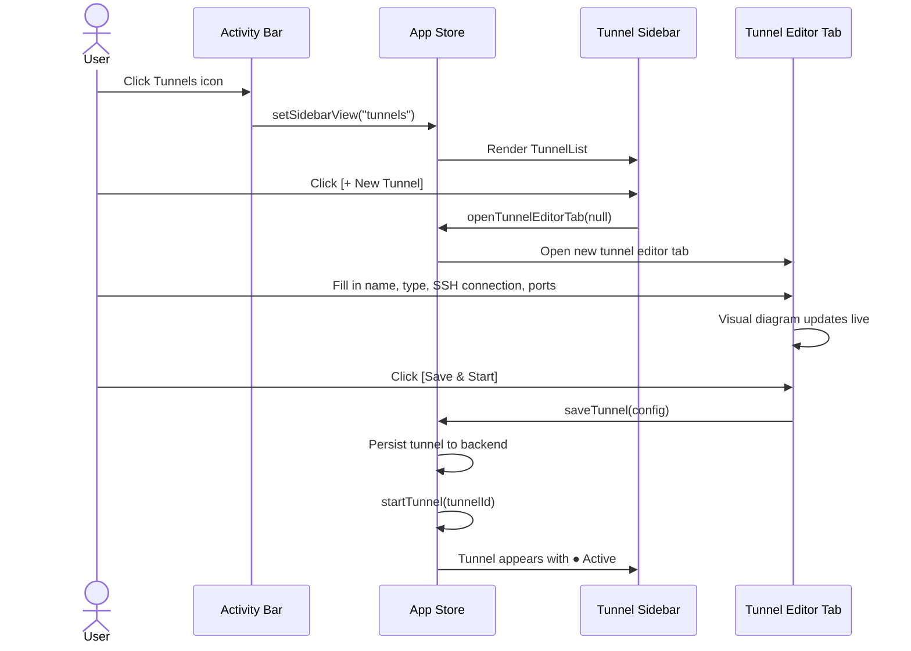

### Starting a Tunnel

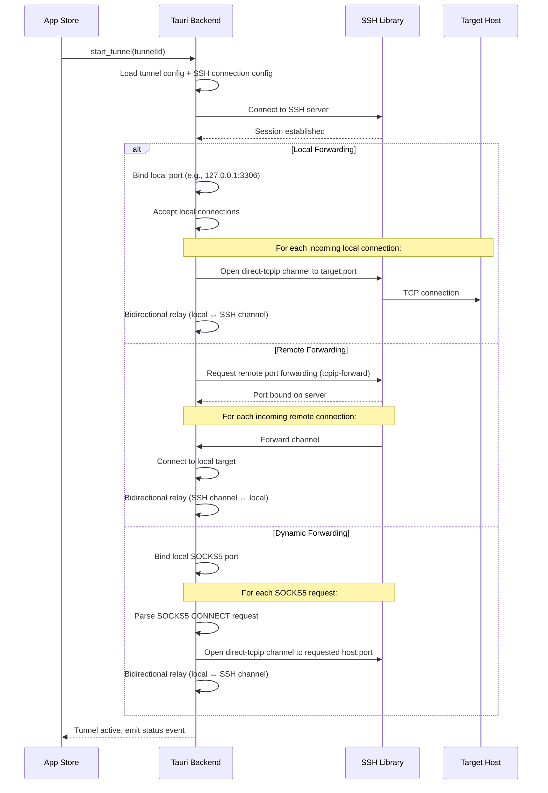

### Stopping a Tunnel

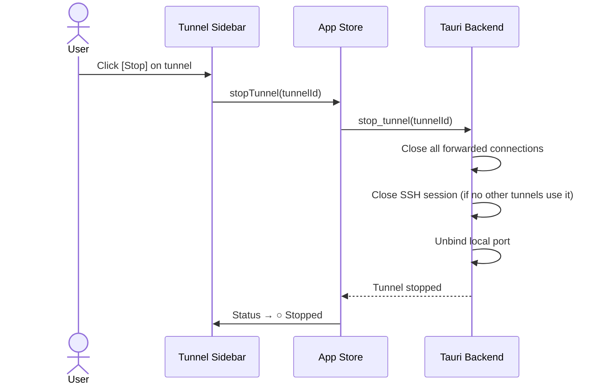

### SSH Session Sharing

Multiple tunnels using the same SSH connection should share a single SSH session where possible to avoid redundant connections:

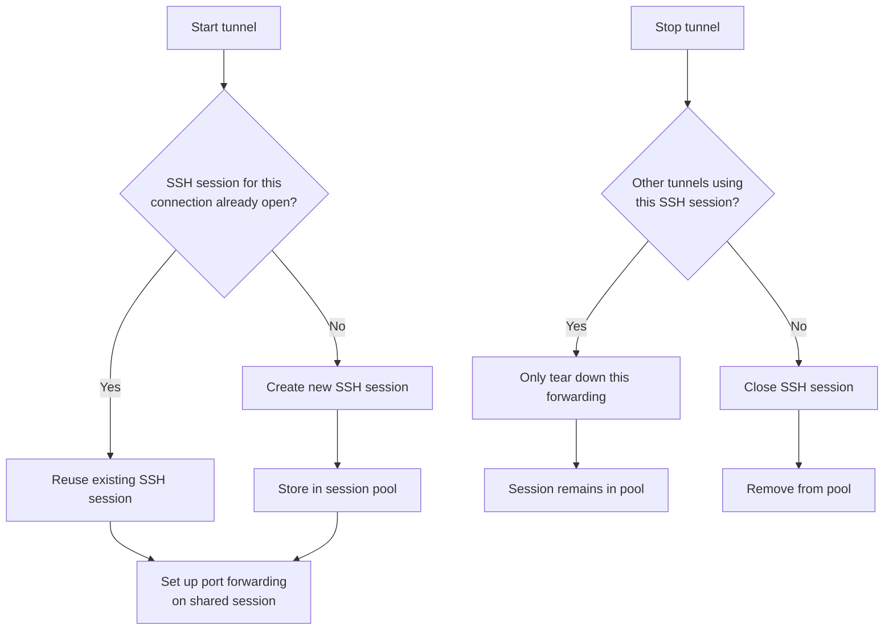

### Auto-Start on Launch

Tunnels with "Auto-start when termiHub launches" enabled are started automatically when the application initializes:

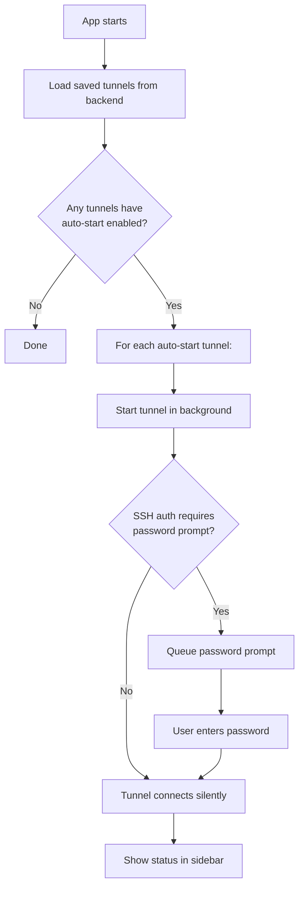

### Reconnection

When "Reconnect on disconnect" is enabled and the SSH connection drops:

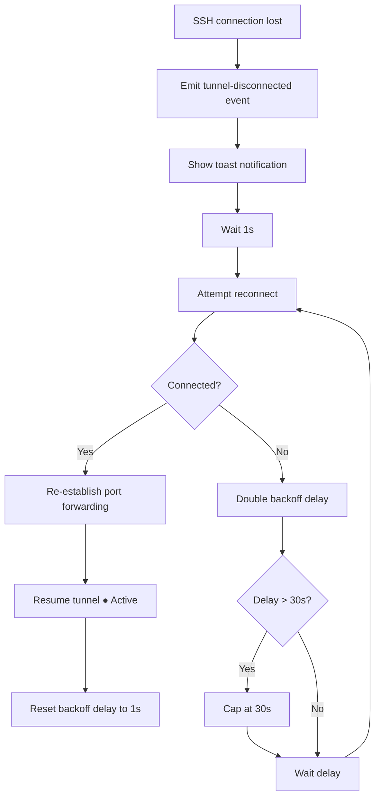

### Edge Cases

- **Port already in use**: When starting a local or dynamic tunnel, if the bind port is already occupied, the tunnel enters `failed` state with a clear error message: "Port 3306 is already in use. Choose a different port or stop the conflicting process."
- **SSH connection deleted**: If the SSH connection referenced by a tunnel is deleted from the connections list, the tunnel shows a warning indicator and cannot be started until a new SSH connection is assigned.
- **Invalid target host**: If the SSH server cannot reach the remote target host, the tunnel opens the local port successfully but individual forwarded connections fail. The tunnel status shows `● Active (target unreachable)` and a warning indicator.
- **SSH auth failure**: If the SSH connection requires authentication and it fails (wrong password, missing key), the tunnel enters `failed` state with the auth error message.
- **Multiple tunnels same port**: The UI prevents saving two tunnels that bind to the same local port. A validation error appears: "Port 3306 is already used by tunnel 'Production DB Tunnel'."
- **Connection editor integration**: When editing an SSH connection that is used by one or more tunnels, the connection editor shows a notice: "This connection is used by N tunnel(s)."
- **App close with active tunnels**: When closing termiHub with active tunnels, tunnels are stopped gracefully. No confirmation dialog — tunnels are not long-lived services (they restart on next launch if auto-start is enabled).

---

## States & Sequences

### Tunnel Lifecycle State Machine

```mermaid
stateDiagram-v2
    [*] --> Saved: User saves tunnel config

    Saved --> Connecting: Start tunnel
    Saved --> Saved: Edit config

    Connecting --> Active: SSH connected + port bound
    Connecting --> Failed: Connection error / auth failure / port in use

    Active --> Disconnected: SSH session lost
    Active --> Stopping: User clicks Stop
    Active --> Active: Forwarding connections

    Disconnected --> Reconnecting: Auto-reconnect enabled
    Disconnected --> Saved: Auto-reconnect disabled

    Reconnecting --> Active: Reconnect succeeded
    Reconnecting --> Reconnecting: Retry with backoff
    Reconnecting --> Failed: Max retries exceeded (10)
    Reconnecting --> Stopping: User clicks Stop

    Failed --> Connecting: User clicks Start (retry)
    Failed --> Saved: User edits config

    Stopping --> Saved: All connections closed

    note right of Active: Local port is bound and accepting connections
    note right of Reconnecting: Exponential backoff: 1s, 2s, 4s, ... 30s max
```

### SSH Session Pool State Machine

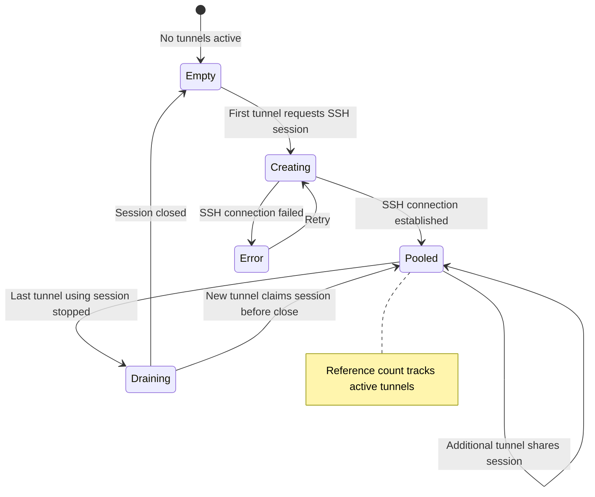

### Tunnel Editor Interaction State Machine

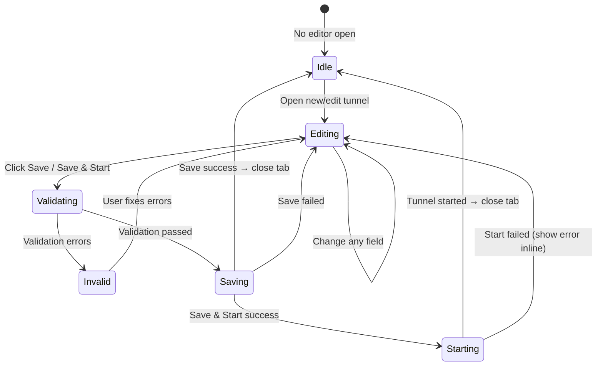

### Tunnel Start Sequence

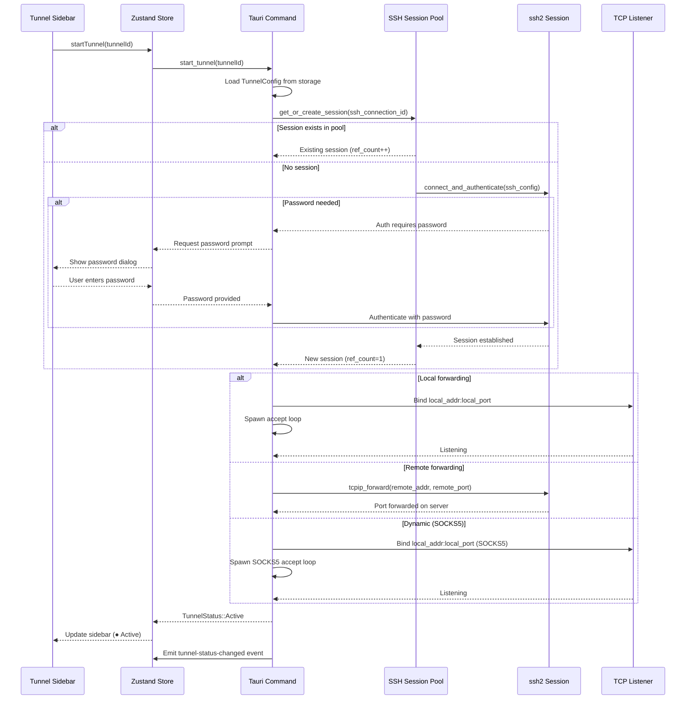

### Forwarded Connection Lifecycle (Local Forwarding)

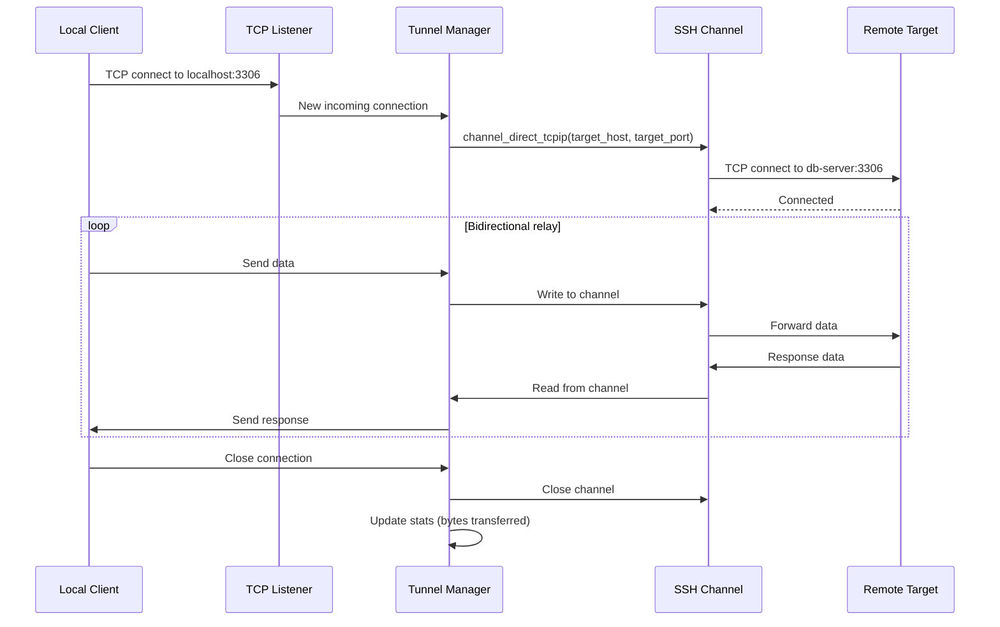

### Tunnel Status Event Flow

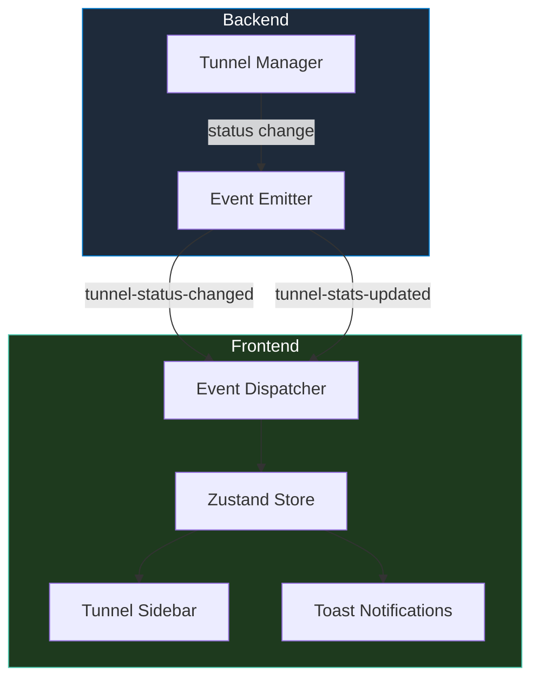

---

## Preliminary Implementation Details

Based on the current project architecture at the time of concept creation. The codebase may evolve between concept creation and implementation.

### Architecture Overview

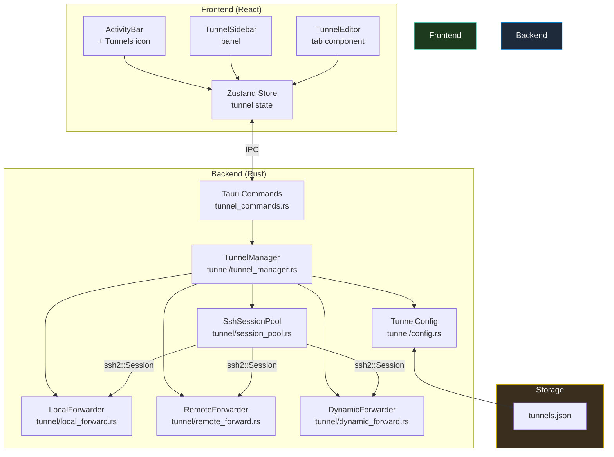

### 1. Data Model

#### Tunnel Configuration (Rust)

```rust
// src-tauri/src/tunnel/config.rs

#[derive(Debug, Clone, Serialize, Deserialize)]
#[serde(rename_all = "camelCase")]
pub struct TunnelConfig {
    pub id: String,
    pub name: String,
    /// ID of the saved SSH connection to tunnel through.
    pub ssh_connection_id: String,
    pub tunnel_type: TunnelType,
    pub auto_start: bool,
    pub reconnect_on_disconnect: bool,
}

#[derive(Debug, Clone, Serialize, Deserialize)]
#[serde(tag = "type", content = "config", rename_all = "camelCase")]
pub enum TunnelType {
    #[serde(rename = "local")]
    Local(LocalForwardConfig),
    #[serde(rename = "remote")]
    Remote(RemoteForwardConfig),
    #[serde(rename = "dynamic")]
    Dynamic(DynamicForwardConfig),
}

#[derive(Debug, Clone, Serialize, Deserialize)]
#[serde(rename_all = "camelCase")]
pub struct LocalForwardConfig {
    pub local_host: String,     // e.g., "127.0.0.1" or "0.0.0.0"
    pub local_port: u16,
    pub remote_host: String,    // e.g., "db-server"
    pub remote_port: u16,
}

#[derive(Debug, Clone, Serialize, Deserialize)]
#[serde(rename_all = "camelCase")]
pub struct RemoteForwardConfig {
    pub remote_host: String,    // Bind address on SSH server (usually "0.0.0.0" or "localhost")
    pub remote_port: u16,
    pub local_host: String,     // Where to forward to locally
    pub local_port: u16,
}

#[derive(Debug, Clone, Serialize, Deserialize)]
#[serde(rename_all = "camelCase")]
pub struct DynamicForwardConfig {
    pub local_host: String,     // e.g., "127.0.0.1"
    pub local_port: u16,        // SOCKS5 proxy port
}
```

#### Tunnel Configuration (TypeScript)

```typescript
// src/types/tunnel.ts

export interface TunnelConfig {
  id: string;
  name: string;
  sshConnectionId: string;
  tunnelType: TunnelType;
  autoStart: boolean;
  reconnectOnDisconnect: boolean;
}

export type TunnelType =
  | { type: "local"; config: LocalForwardConfig }
  | { type: "remote"; config: RemoteForwardConfig }
  | { type: "dynamic"; config: DynamicForwardConfig };

export interface LocalForwardConfig {
  localHost: string;
  localPort: number;
  remoteHost: string;
  remotePort: number;
}

export interface RemoteForwardConfig {
  remoteHost: string;
  remotePort: number;
  localHost: string;
  localPort: number;
}

export interface DynamicForwardConfig {
  localHost: string;
  localPort: number;
}

export type TunnelStatus =
  | "saved"
  | "connecting"
  | "active"
  | "disconnected"
  | "reconnecting"
  | "failed"
  | "stopping";

export interface TunnelState {
  tunnelId: string;
  status: TunnelStatus;
  error?: string;
  stats?: TunnelStats;
}

export interface TunnelStats {
  bytesUp: number;
  bytesDown: number;
  activeConnections: number;
}
```

#### Storage Format

Tunnels are stored in a separate file `tunnels.json` (alongside `connections.json`) to keep concerns separated:

```json
{
  "version": "1",
  "tunnels": [
    {
      "id": "tun-abc123",
      "name": "Production DB Tunnel",
      "sshConnectionId": "conn-xyz789",
      "tunnelType": {
        "type": "local",
        "config": {
          "localHost": "127.0.0.1",
          "localPort": 3306,
          "remoteHost": "db-server",
          "remotePort": 3306
        }
      },
      "autoStart": true,
      "reconnectOnDisconnect": true
    }
  ]
}
```

### 2. Backend Architecture

#### Tunnel Manager

The `TunnelManager` is the central backend component, similar to `TerminalManager` for terminal sessions:

```rust
// src-tauri/src/tunnel/tunnel_manager.rs

pub struct TunnelManager {
    tunnels: HashMap<String, ActiveTunnel>,
    session_pool: SshSessionPool,
    config_store: TunnelConfigStore,
}

impl TunnelManager {
    pub async fn start_tunnel(&mut self, tunnel_id: &str) -> Result<()>;
    pub async fn stop_tunnel(&mut self, tunnel_id: &str) -> Result<()>;
    pub fn get_status(&self, tunnel_id: &str) -> Option<TunnelState>;
    pub fn get_all_statuses(&self) -> Vec<TunnelState>;
}
```

#### SSH Session Pool

To avoid redundant SSH connections when multiple tunnels use the same SSH server:

```rust
// src-tauri/src/tunnel/session_pool.rs

pub struct SshSessionPool {
    sessions: HashMap<String, PooledSession>,  // keyed by ssh_connection_id
}

struct PooledSession {
    session: Arc<ssh2::Session>,
    ref_count: usize,
}

impl SshSessionPool {
    /// Get an existing session or create a new one.
    pub fn get_or_create(
        &mut self,
        connection_id: &str,
        ssh_config: &SshConfig,
    ) -> Result<Arc<ssh2::Session>>;

    /// Release a session (decrement ref count, close if zero).
    pub fn release(&mut self, connection_id: &str);
}
```

#### Forwarders

Each forwarding type is a separate module using `tokio` for async I/O:

```rust
// src-tauri/src/tunnel/local_forward.rs
pub struct LocalForwarder {
    listener: TcpListener,
    session: Arc<ssh2::Session>,
    config: LocalForwardConfig,
    stats: Arc<AtomicTunnelStats>,
    shutdown: tokio::sync::watch::Sender<bool>,
}

// src-tauri/src/tunnel/remote_forward.rs
pub struct RemoteForwarder { /* ... */ }

// src-tauri/src/tunnel/dynamic_forward.rs
pub struct DynamicForwarder { /* SOCKS5 implementation */ }
```

Note: The `ssh2` crate operates synchronously. Port forwarding relay loops should use blocking I/O on dedicated threads (similar to the existing `SshConnection` reader thread pattern), with a `tokio::sync::watch` channel for shutdown signaling.

### 3. Tauri Commands

```rust
// src-tauri/src/commands/tunnel_commands.rs

#[tauri::command]
pub fn get_tunnels(state: State<TunnelManager>) -> Result<Vec<TunnelConfig>>;

#[tauri::command]
pub fn save_tunnel(state: State<TunnelManager>, config: TunnelConfig) -> Result<()>;

#[tauri::command]
pub fn delete_tunnel(state: State<TunnelManager>, tunnel_id: String) -> Result<()>;

#[tauri::command]
pub fn start_tunnel(state: State<TunnelManager>, tunnel_id: String) -> Result<()>;

#[tauri::command]
pub fn stop_tunnel(state: State<TunnelManager>, tunnel_id: String) -> Result<()>;

#[tauri::command]
pub fn get_tunnel_statuses(state: State<TunnelManager>) -> Result<Vec<TunnelState>>;
```

### 4. Tauri Events

```rust
// src-tauri/src/events/tunnel_events.rs

/// Emitted when a tunnel's status changes.
#[derive(Debug, Clone, Serialize)]
pub struct TunnelStatusEvent {
    pub tunnel_id: String,
    pub status: String,      // "active", "failed", "disconnected", etc.
    pub error: Option<String>,
}

/// Emitted periodically with traffic statistics.
#[derive(Debug, Clone, Serialize)]
pub struct TunnelStatsEvent {
    pub tunnel_id: String,
    pub bytes_up: u64,
    pub bytes_down: u64,
    pub active_connections: u32,
}
```

### 5. Frontend Components

#### File Structure

```
src/
  components/
    TunnelSidebar/
      TunnelSidebar.tsx         # Main sidebar panel
      TunnelSidebar.css
      TunnelListItem.tsx        # Individual tunnel entry
    TunnelEditor/
      TunnelEditor.tsx          # Tunnel config tab (form + diagram)
      TunnelEditor.css
      TunnelDiagram.tsx         # Visual diagram component
      TunnelDiagram.css
      TunnelTypeSelector.tsx    # Local/Remote/Dynamic dropdown
  types/
    tunnel.ts                   # TypeScript types (see above)
  services/
    tunnelApi.ts                # Tauri command wrappers
```

#### Store Extensions

The Zustand store (`appStore.ts`) gains tunnel-related state and actions:

```typescript
// Additions to AppState interface

// State
tunnels: TunnelConfig[];
tunnelStates: Record<string, TunnelState>;

// Actions
loadTunnels: () => Promise<void>;
saveTunnel: (config: TunnelConfig) => Promise<void>;
deleteTunnel: (tunnelId: string) => Promise<void>;
startTunnel: (tunnelId: string) => Promise<void>;
stopTunnel: (tunnelId: string) => Promise<void>;
openTunnelEditorTab: (tunnelId: string | null) => void;
```

#### Sidebar View Extension

The `SidebarView` type gains a new value:

```typescript
export type SidebarView = "connections" | "files" | "tunnels";
```

The `ActivityBar` `TOP_ITEMS` array gains a new entry:

```typescript
{ view: "tunnels", icon: ArrowLeftRight, label: "SSH Tunnels" }
```

#### Tab Content Type Extension

A new tab content type is added for the tunnel editor:

```typescript
export type TabContentType =
  | "terminal"
  | "settings"
  | "editor"
  | "connection-editor"
  | "log-viewer"
  | "tunnel-editor";    // NEW
```

### 6. Visual Diagram Component

The `TunnelDiagram` component renders the three-box visual using pure CSS (no canvas or SVG library). Each box is a styled `div` with a label. Arrows between boxes use CSS pseudo-elements or a simple inline SVG. The diagram re-renders reactively based on the current form state.

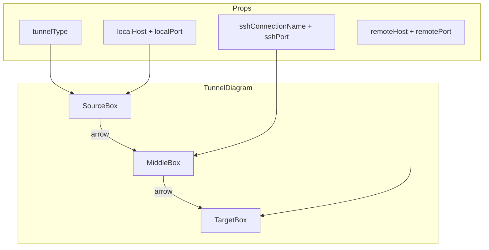

The diagram layout depends on tunnel type:
- **Local**: `[Your PC] → [SSH Server] → [Target]`
- **Remote**: `[Target] ← [SSH Server] ← [Your PC]`
- **Dynamic**: `[Your PC] → [SSH Server] → [Internet]`

Labels below each box change to clarify the role ("Listen here", "Tunnel via", "Forward to").

### 7. Integration with Existing SSH Connections

Tunnels reference existing SSH connections by `id` rather than duplicating SSH configuration. This means:

- Tunnel SSH auth uses the same mechanism as terminal SSH connections (password prompt, key auth, agent)
- If an SSH connection's host/port/credentials change, all tunnels using it automatically use the updated config
- Deleting an SSH connection that tunnels depend on orphans those tunnels (they cannot start until reassigned)

### 8. File Structure Summary

```
src-tauri/src/
  tunnel/                        # NEW module
    mod.rs
    config.rs                    # TunnelConfig, TunnelType, storage format
    tunnel_manager.rs            # TunnelManager — central orchestrator
    session_pool.rs              # SshSessionPool — shared SSH sessions
    local_forward.rs             # Local port forwarding (ssh -L)
    remote_forward.rs            # Remote port forwarding (ssh -R)
    dynamic_forward.rs           # SOCKS5 dynamic forwarding (ssh -D)
    storage.rs                   # Read/write tunnels.json
  commands/
    tunnel_commands.rs           # NEW: Tauri IPC commands for tunnels
  events/
    tunnel_events.rs             # NEW: Tunnel status + stats events

src/
  components/
    TunnelSidebar/               # NEW
      TunnelSidebar.tsx
      TunnelSidebar.css
      TunnelListItem.tsx
    TunnelEditor/                # NEW
      TunnelEditor.tsx
      TunnelEditor.css
      TunnelDiagram.tsx
      TunnelDiagram.css
      TunnelTypeSelector.tsx
  types/
    tunnel.ts                    # NEW: TypeScript tunnel types
  services/
    tunnelApi.ts                 # NEW: Tauri command wrappers
```

### 9. Implementation Order

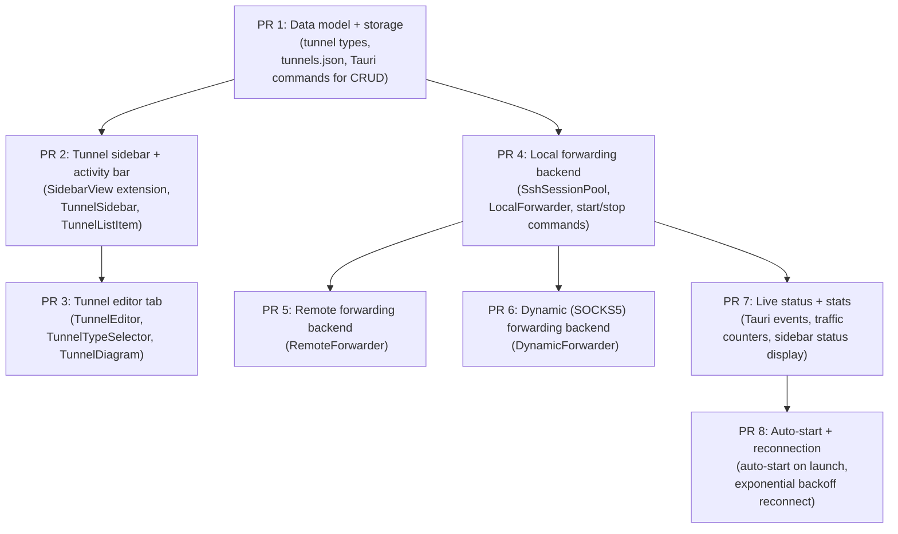

1. **PR 1 — Data model + storage**: Define Rust and TypeScript types, create `tunnels.json` storage, add CRUD Tauri commands. No UI yet.
2. **PR 2 — Sidebar + activity bar**: Add `"tunnels"` sidebar view, `ArrowLeftRight` icon in activity bar, `TunnelSidebar` component showing saved tunnels.
3. **PR 3 — Tunnel editor**: The configuration tab with the visual diagram, form fields, and SSH connection dropdown.
4. **PR 4 — Local forwarding**: SSH session pool + local port forwarding implementation. This is the most common tunnel type.
5. **PR 5 — Remote forwarding**: Remote port forwarding using `tcpip_forward`.
6. **PR 6 — Dynamic forwarding**: SOCKS5 proxy implementation.
7. **PR 7 — Live status**: Tauri events for status changes and traffic stats, sidebar status indicators.
8. **PR 8 — Auto-start + reconnection**: Auto-start tunnels on app launch, exponential backoff reconnection.

PRs 2-3 (frontend) and PR 4 (backend) can proceed in parallel after PR 1. PRs 5-6 can also proceed in parallel.

### 10. Design Decision Summary

| Decision | Choice | Rationale |
|----------|--------|-----------|
| Storage location | Separate `tunnels.json` | Keeps tunnel config decoupled from connection config; easier to manage independently |
| SSH session management | Shared session pool | Avoids redundant SSH connections; multiple tunnels through same server share one session |
| Forwarding implementation | `ssh2` crate with blocking threads | Matches existing SSH backend pattern; `ssh2` is synchronous, so threading is required |
| SOCKS5 for dynamic | Custom minimal implementation | Only SOCKS5 CONNECT needed; avoids external dependency for simple protocol |
| Tunnel type tagging | `#[serde(tag = "type", content = "config")]` | Matches existing `ConnectionConfig` serialization pattern |
| Sidebar panel vs tab | Sidebar panel for list, tab for editor | Consistent with connections pattern (sidebar = list, tab = editor) |
| Visual diagram | Pure CSS boxes + arrows | No extra dependency; simple layout that renders reliably across platforms |
| Auto-start | Per-tunnel toggle | Not all tunnels should auto-start; user controls which ones do |
| Reconnection | Exponential backoff with cap | Standard resilience pattern; 30s cap prevents excessive waiting |
