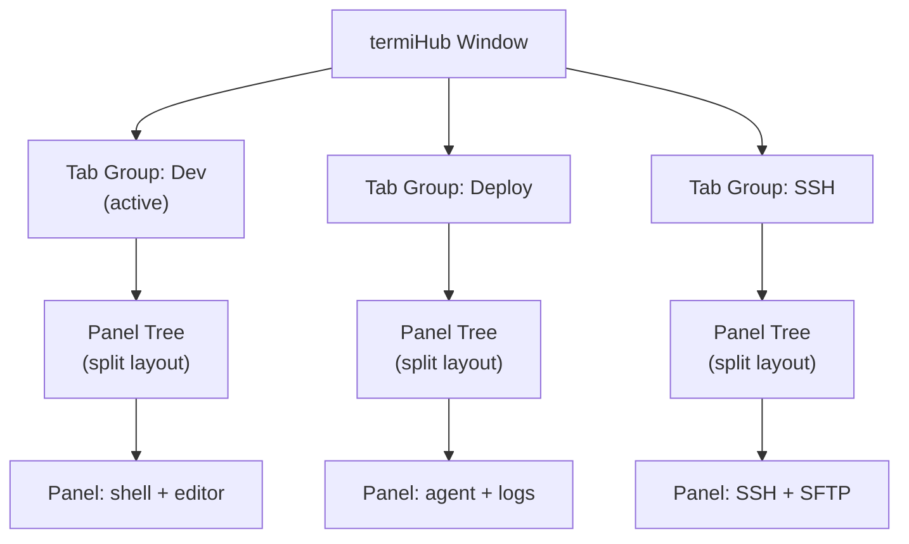
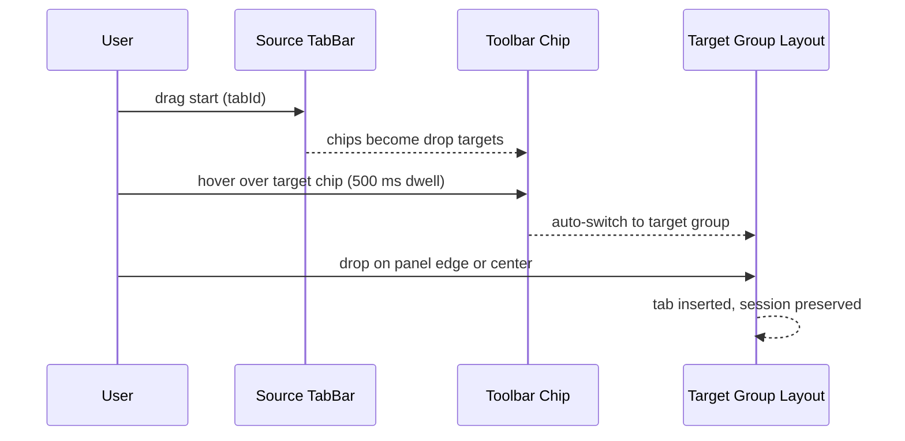
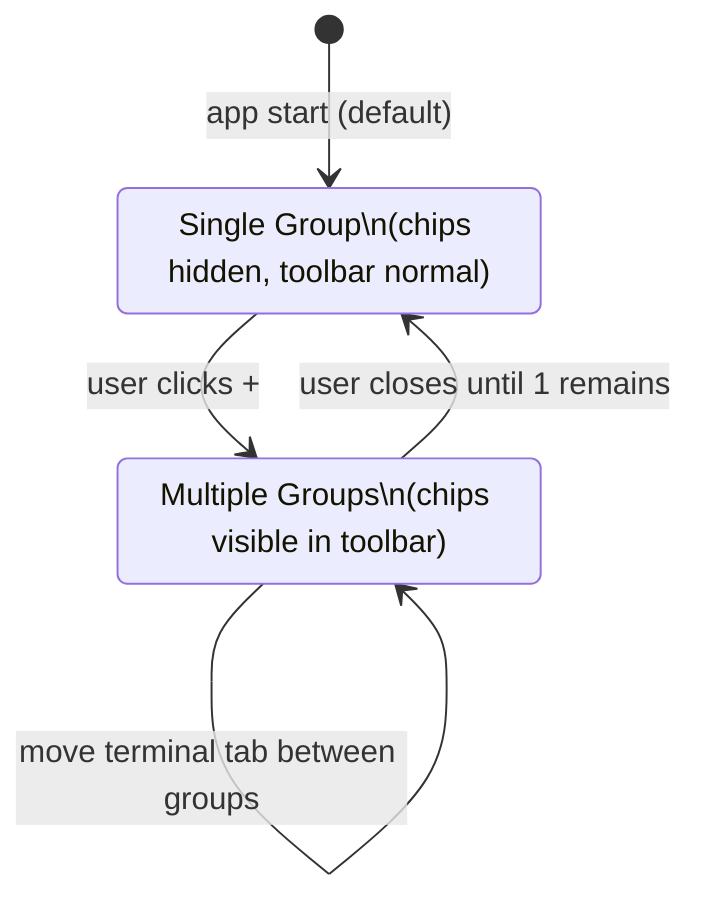
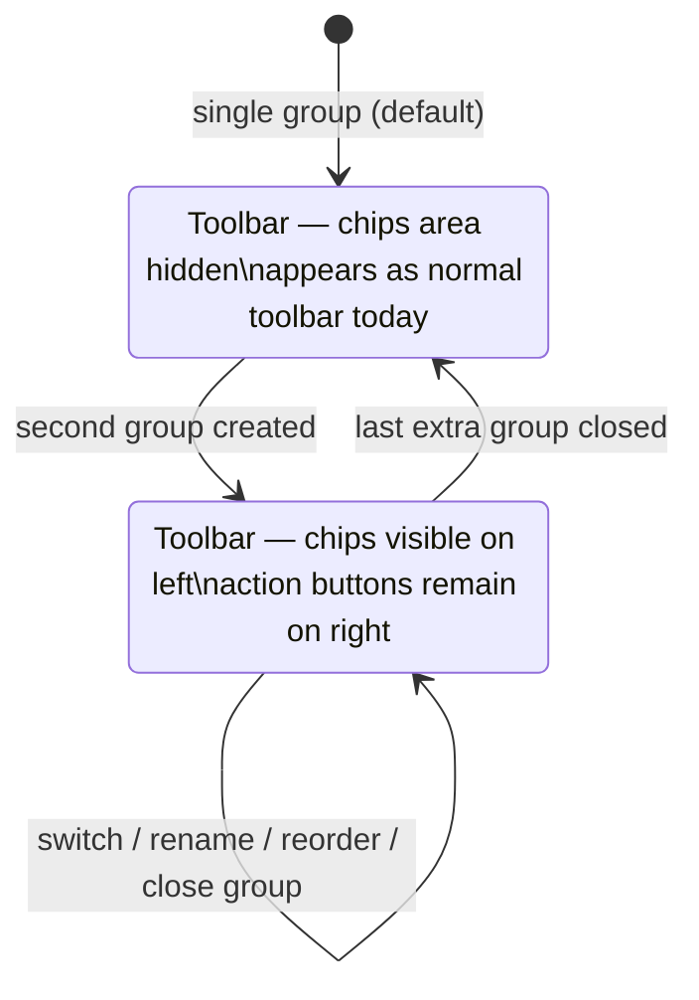
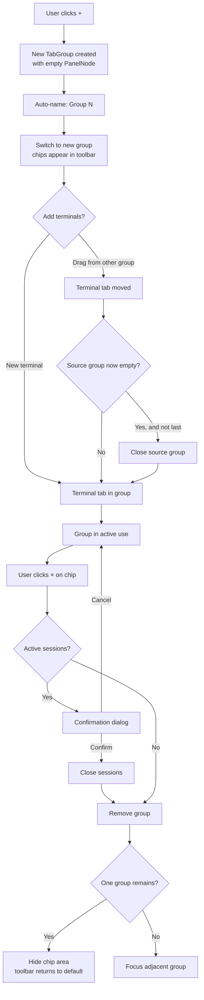

# Concept: Tab Groups / Workspace Tabs

> GitHub Issue: [#546](https://github.com/armaxri/termiHub/issues/546)

---

## Overview

termiHub currently supports one split-panel workspace at a time. Users can split panels horizontally or vertically, but all panels live in a single shared layout. This breaks down for users who maintain multiple distinct workflow contexts simultaneously — for example, a local dev context (shell + editor), a deployment context (agent runner + log tail), and an SSH context (remote shell + SFTP browser). Switching between these contexts today means tearing down and rebuilding the panel layout.

**Tab Groups** introduce a named, tabbed layer at the workspace level. Each tab group is an independent panel tree with its own split layout. Users can switch between groups instantly — all terminal sessions in inactive groups remain fully alive, they are simply hidden. Users can also drag individual terminal tabs between groups to reorganize their contexts freely.



---

## UI Interface

### Design Principle: Toolbar Integration

Tab group selectors live **inside the existing toolbar bar**, not in a separate strip. This is the key design decision. The toolbar already spans the full width at the top of the terminal view and its left side is currently empty. Tab group chips occupy that space.

This avoids the most common pitfall of multi-level tab designs: stacking two rows of tab-like controls (one for groups, one for terminal tabs within panels), which creates visual confusion about which level the user is interacting with.

The resulting layout has a clear three-level hierarchy:

```
┌────────────────────────────────────────────────────────────────────────────┐
│  [Dev ×]  [Deploy ×]  [SSH ×]  [+]          [+] [⊏] [⊐] [−] [⊢] [☰]   │  ← Toolbar (workspace level)
├────────────────────────────────────────────────────────────────────────────┤
│  [bash ×]  [ssh-prod ×]  [vim ×]                                           │  ← TabBar (terminal level)
├────────────────────────────────────────────────────────────────────────────┤
│                                                                            │
│   terminal output                                                          │
│                                                                            │
└────────────────────────────────────────────────────────────────────────────┘
```

**Level 1 — Toolbar**: workspace-level tab group selector chips (left) + terminal action buttons (right)
**Level 2 — TabBar**: terminal tabs within the active panel (inside the panel, not the toolbar)
**Level 3 — Content**: terminal output

When there is only one tab group (the default), the chips are hidden and the toolbar looks exactly as it does today.

### Toolbar Layout with Tab Groups

```
┌────────────────────────────────────────────────────────────────────────────┐
│  [⬡ Dev ×]  [⬡ Deploy ×]  [⬡ SSH ×]  [+]       [+] [⊏] [⊐] [−] [⊢]  │
└────────────────────────────────────────────────────────────────────────────┘
    ↑ group chips (left)                              ↑ existing action buttons (right)
```

The toolbar uses `justify-content: space-between`:

- **Left side**: tab group chips, each with name and close button; followed by a "+" button to add a group
- **Right side**: existing toolbar action buttons (new terminal, split, close panel, toggle sidebar, etc.) — unchanged

When group chips overflow the available left-side space, the chip area scrolls horizontally (no overflow ellipsis — users should see full group names).

### Tab Group Chip Appearance

Chips are **pill-shaped** (fully rounded), clearly distinct from the file-tab shape of terminal tabs in panel TabBars. This visual distinction reinforces the hierarchy: pill = workspace level, file-tab = terminal level.

```
Inactive:  [  Dev ×  ]   — transparent background, secondary text color, no border
Active:    [  Dev ×  ]   — filled background (--bg-active), primary text, subtle border
Hover:     [  Dev ×  ]   — slightly lighter background
```

When a group has a user-assigned accent color, a small colored dot precedes the name:

```
Active:    [ ● Dev ×  ]
```

The close button (×) on each chip is hidden by default and fades in on hover or when the chip is active, exactly as terminal tab close buttons work.

### Chip Interactions

| Action                                  | Result                                                                   |
| --------------------------------------- | ------------------------------------------------------------------------ |
| Click chip                              | Switch to that tab group (instant, session preserved)                    |
| Double-click chip                       | Inline rename                                                            |
| Right-click chip                        | Context menu: Rename, Set Color, Duplicate, Move Left, Move Right, Close |
| Drag chip                               | Reorder within the toolbar chip area                                     |
| Drag terminal tab → chip                | Terminal tab moves to that group (drop on chip)                          |
| Drag terminal tab → chip (hover 500 ms) | Auto-switch to target group, then drop into split view                   |
| Click × on chip                         | Close that tab group                                                     |
| Click + (after chips)                   | Create new empty tab group, switch to it                                 |

### Cross-Group Tab Drag-and-Drop

Users drag terminal tabs (from panel TabBars) to a different tab group by:

1. **Drop on chip directly**: the terminal tab moves to that group as a new single-panel leaf.
2. **Dwell-to-switch**: hovering the dragged tab over a chip for 500 ms auto-switches to that group. The user can then drop the tab onto any split zone (panel edge or center) within the newly visible layout.

During an active drag, all group chips in the toolbar highlight as valid drop targets.



### Closing a Tab Group

- If the group has no running sessions: close immediately
- If any session is active/running: show a confirmation dialog listing them
- The last tab group cannot be closed (no × shown when only one group remains)
- After close: adjacent group becomes active; if the chip area becomes empty (back to one group), the chip area collapses and the toolbar returns to its default appearance

---

## General Handling

### Session Preservation

Terminal sessions are never destroyed when switching tab groups. The `TerminalRegistry` DOM-parking mechanism preserves xterm instances when tabs move between panels; tab groups extend this principle: all panels in inactive groups remain mounted in the React tree, hidden via `display: none`. PTY sessions stay fully alive.

### Keyboard Shortcuts

| Shortcut           | Action                  |
| ------------------ | ----------------------- |
| `Ctrl/Cmd+Shift+[` | Previous tab group      |
| `Ctrl/Cmd+Shift+]` | Next tab group          |
| `Ctrl/Cmd+Shift+T` | New tab group           |
| `Ctrl/Cmd+Shift+W` | Close current tab group |

These follow the browser-tab shortcut convention and are documented in the keyboard shortcut overlay.

### Workspace Integration

Workspace definitions currently describe a single panel tree (`layout` field). With tab groups, a workspace can optionally define multiple panel trees (one per tab group). Existing single-tree workspaces remain valid and open as a single unnamed tab group.

```
WorkspaceDefinition
  ├── layout?          (existing — single panel tree, backward compatible)
  └── tabGroups?       (new — array of named panel trees)
        ├── name
        ├── color?
        └── layout
```

### State Persistence

The full tab group state (group list, names, colors, panel trees, active group) is persisted across app restarts as part of the existing app state serialization.

---

## States & Sequences

### Tab Group State Machine



### Toolbar States



### Tab Group Lifecycle



---

## Preliminary Implementation Details

> This section reflects the codebase state at concept creation (2026-03-27). The implementation should adapt as the codebase evolves.

### Data Model

```typescript
interface TabGroup {
  id: string;
  name: string;
  color?: string;           // optional accent dot color
  rootPanel: PanelNode;     // independent panel tree (existing type, unchanged)
  activePanelId: string | null;
}

// AppState gains:
tabGroups: TabGroup[];
activeTabGroupId: string;
```

Migration: on first launch after upgrade, wrap the existing `rootPanel` in a single `TabGroup { name: "Main" }`.

### Store Changes (`appStore.ts`)

New actions:

```typescript
addTabGroup(name?: string): string
closeTabGroup(groupId: string): void
renameTabGroup(groupId: string, name: string): void
setTabGroupColor(groupId: string, color: string | null): void
setActiveTabGroup(groupId: string): void
reorderTabGroups(fromIndex: number, toIndex: number): void
duplicateTabGroup(groupId: string): void
moveTabToGroup(tabId: string, fromPanelId: string, toGroupId: string): void
```

All existing panel/tab actions implicitly operate on the active group's `rootPanel`. This is non-breaking: callers do not need to pass `groupId`.

### Component Changes

**`TerminalView` toolbar** (`TerminalView.tsx`):

The toolbar `div` changes from a single right-aligned actions row to a space-between layout:

```tsx
<div className="terminal-view__toolbar">
  <TabGroupChips /> {/* left — hidden when tabGroups.length <= 1 */}
  <div className="terminal-view__toolbar-actions">{/* existing action buttons unchanged */}</div>
</div>
```

`TabGroupChips` is a new internal component (or a separate `TabGroupChips.tsx` file). It renders:

- A `DndContext` + `SortableContext` for chip reordering (chip-level drag only; tab-level cross-group drag uses the parent DndContext in TerminalView)
- One `TabGroupChip` per group (pill-shaped, with context menu)
- A `+` button after the chips

**`SplitView`** (`SplitView.tsx`):

Renders one `PanelNodeRenderer` per tab group, all mounted, only active one visible:

```tsx
<div className="split-view-container">
  {tabGroups.map((group) => (
    <div key={group.id} style={{ display: group.id === activeTabGroupId ? "flex" : "none" }}>
      <PanelNodeRenderer node={group.rootPanel} />
    </div>
  ))}
</div>
```

**`TerminalView` DndContext**:

The `DndContext` must wrap both `TabGroupChips` and `SplitView` so that dragging a terminal tab from a panel can land on a group chip. This means lifting `DndContext` from `SplitView` to `TerminalView` — the entire terminal view becomes one unified drag context.

**`TerminalHost`** (internal to `TerminalView`):

All terminal instances across all groups remain mounted at a stable position in the React tree. This prevents unmount/remount (which would kill PTY sessions) when switching groups.

```tsx
function TerminalHost() {
  const allTabs = getAllTabsAcrossAllGroups(); // from tabGroups in store
  return allTabs.map(tab => <Terminal key={tab.id} ... />);
}
```

### Toolbar CSS

The toolbar changes from:

```css
.terminal-view__toolbar {
  justify-content: flex-end; /* current: all buttons right-aligned */
}
```

to:

```css
.terminal-view__toolbar {
  justify-content: space-between; /* chips left, actions right */
}
```

The chip area within the toolbar:

```css
.tab-group-chips {
  display: flex;
  align-items: center;
  gap: 2px;
  overflow-x: auto;
  scrollbar-width: none;
  flex: 1; /* takes remaining left space */
  min-width: 0; /* allows flex shrink */
}

.tab-group-chip {
  border-radius: 100px; /* pill — NOT tab-shaped */
  padding: 3px 10px;
  border: 1px solid transparent;
  /* ... */
}

.tab-group-chip--active {
  background-color: var(--bg-active);
  border-color: var(--border-primary);
}
```

### Workspace Definition Extension

```typescript
interface WorkspaceDefinition {
  id: string;
  name: string;
  layout?: WorkspaceLayoutNode; // existing — still valid
  tabGroups?: WorkspaceTabGroupDef[]; // new
}

interface WorkspaceTabGroupDef {
  name: string;
  color?: string;
  layout: WorkspaceLayoutNode;
}
```

### Performance

All tab group panel trees are mounted simultaneously (for session preservation). Inactive groups use `display: none`, removing them from layout calculations. xterm instances in hidden panels do not render or animate. For users with many groups and panels, future optimization: lazy unmount after configurable inactivity, re-parking terminals back to `TerminalHost`.
