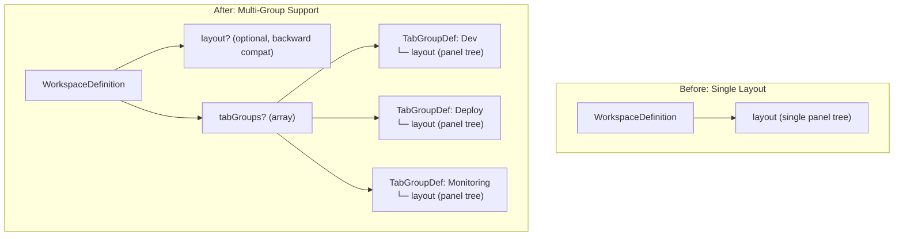
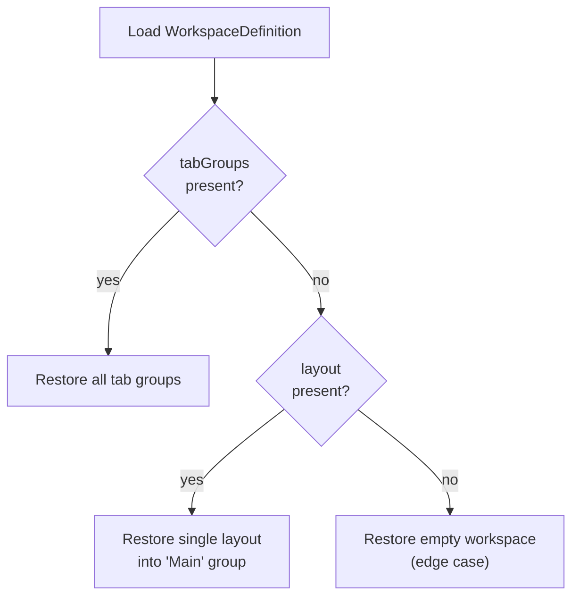
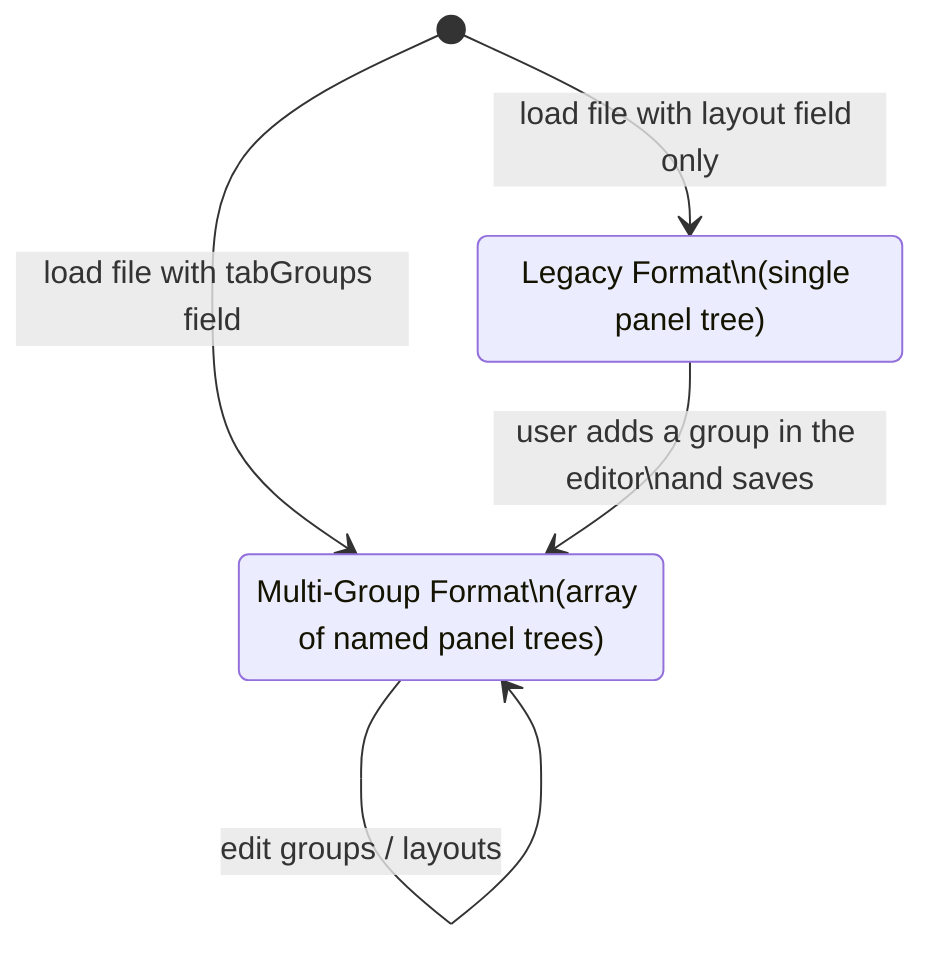
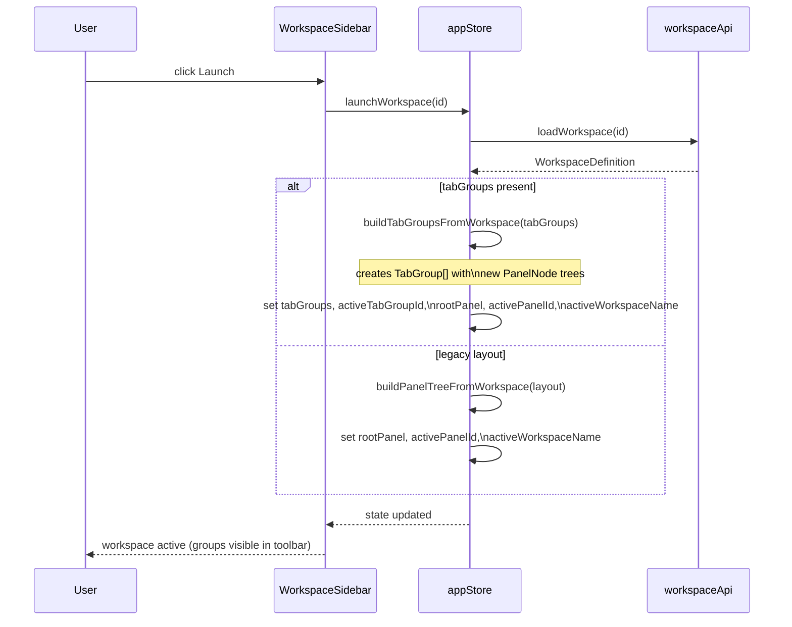
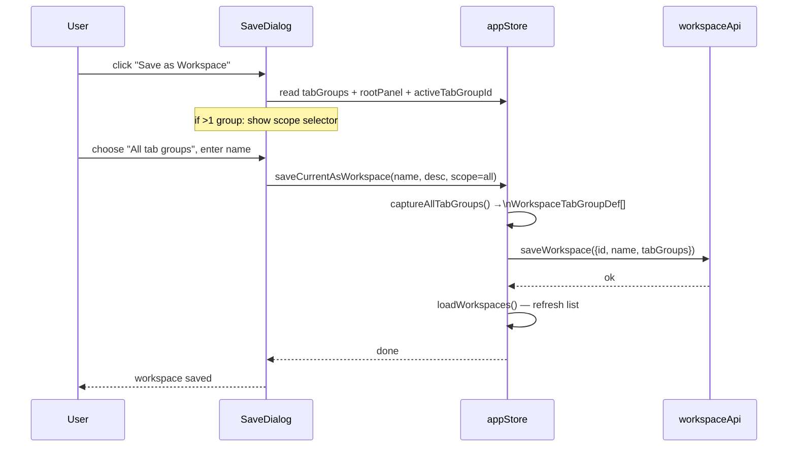
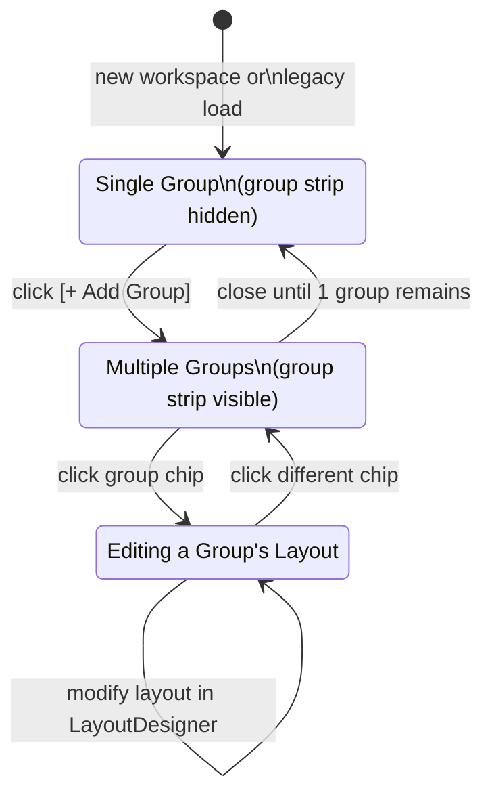

# Concept: Workspace Tab Group Support

> GitHub Issue: [#566](https://github.com/armaxri/termiHub/issues/566)

---

## Overview

termiHub supports two orthogonal layout features that are currently disconnected:

- **Workspaces** — named, saved panel layouts that users can design, store, and restore. Each workspace definition contains a single panel tree (`layout`).
- **Tab Groups** (#546) — runtime named panel trees that allow users to maintain multiple independent split layouts simultaneously, switching between them without killing sessions.

The gap: a user who builds a careful multi-group session (e.g. _Dev_ / _Deploy_ / _Monitoring_) has no way to save that full context as a workspace. When they launch a saved workspace, only one panel tree is restored. Their tab group organization is lost on every restart.

This concept extends the workspace configuration schema and related UI/logic so that workspaces can optionally capture and restore a full set of named tab groups — while remaining fully backward compatible with existing single-layout workspace files.



---

## UI Interface

### Workspace Editor: Group Strip

The Workspace Editor currently shows a single **Layout** section containing a `LayoutDesigner`. When the workspace defines multiple tab groups, the editor gains a **group strip** above the layout designer — a compact horizontal bar showing the groups as clickable chips, mirroring the toolbar chip design from #546.

```
┌─────────────────────────────────────────────────────────────────┐
│  Name: [________________________]                               │
│  Description: [________________________]                         │
│                                                                  │
│  Layout                                                          │
│  ┌──────────────────────────────────────────────────────────┐   │
│  │  [Dev ×]  [Deploy ×]  [Monitoring ×]  [+ Add Group]      │   │  ← group strip
│  ├──────────────────────────────────────────────────────────┤   │
│  │                                                          │   │
│  │  LayoutDesigner for selected group                       │   │
│  │                                                          │   │
│  └──────────────────────────────────────────────────────────┘   │
│  3 groups · 8 panels · 12 tabs                                   │
│                                                                  │
│  [Save]  [Cancel]                                                │
└─────────────────────────────────────────────────────────────────┘
```

- **Group strip** appears only when the workspace has 2 or more groups. For single-group workspaces the strip is hidden and the editor looks unchanged.
- **Active group chip** is highlighted. Clicking another chip switches the LayoutDesigner to show that group's layout.
- **`[× close]`** on a chip removes the group and its layout from the workspace definition (with confirmation if the group has tabs).
- **`[+ Add Group]`** appends a new empty group with a default name (e.g. _Group 2_). The strip scrolls horizontally if there are many groups.
- **Rename**: double-click a chip label to rename inline.
- **Color picker**: right-click a chip → _Set color_ (optional dot accent, same colors as runtime tab groups).

### Workspace Editor: Info Line

The summary line below the LayoutDesigner reflects the whole workspace:

- Single group: `2 panels, 4 tabs` (unchanged)
- Multiple groups: `3 groups · 8 panels · 12 tabs`

### Workspace Sidebar

The workspace list entry shows group count when applicable:

```
┌──────────────────────────────────────────┐
│  Full Stack Project                      │
│  3 groups · 12 connections               │
│  [Launch]  [Edit]  [...]                 │
└──────────────────────────────────────────┘
```

Single-group workspaces continue to show only the connection count.

### "Save Current as Workspace" Dialog

The quick-save dialog (triggered from the WorkspaceSidebar without opening the editor) gains a scope selector when multiple tab groups are active:

```
┌──────────────────────────────────────────┐
│  Save as Workspace                       │
│                                          │
│  Name: [___________________________]     │
│  Description: [___________________]      │
│                                          │
│  Capture:                                │
│  ○ All tab groups (Dev, Deploy, SSH)     │  ← default
│  ○ Active group only (Dev)               │
│                                          │
│  [Save]  [Cancel]                        │
└──────────────────────────────────────────┘
```

When only one tab group exists, the scope selector is hidden.

### Workspace Launch Behavior

When a multi-group workspace is launched:

1. All existing sessions are preserved (same as today — launching replaces the panel layout, existing tabs in non-workspace panels are gone).
2. All workspace tab groups are restored in order: names, colors, layouts, and connection configurations.
3. The first group in the definition becomes the active tab group.
4. The `activeWorkspaceName` is set to the workspace name as today.

The user sees the toolbar chip strip appear immediately with all restored groups.

---

## General Handling

### Backward Compatibility

Existing workspace files (with a top-level `layout` field and no `tabGroups`) continue to work without any migration:

- If `tabGroups` is absent and `layout` is present → load the single layout into a single "Main" group (existing behavior).
- If `tabGroups` is present → use the tab groups; the legacy `layout` field (if present) is ignored.
- New workspaces created with multiple groups will have `tabGroups` and no `layout` field.
- New workspaces created with a single group will have only `layout` (no change to file format for the common case).



### Connection Count in WorkspaceSummary

`WorkspaceSummary.connectionCount` currently reflects the single layout's tab count. With multi-group support, it should reflect the total tab count across all groups.

### Import / Export

The existing workspace import/export format is JSON. The `WorkspaceImportPreview` type currently shows `workspaceCount` and `totalTabCount`. It should gain a `totalGroupCount` field so the import confirmation UI can show: _"3 workspaces, 7 groups total, 24 connections"_.

### Workspace Editor for Existing Workspaces

Opening an existing single-layout workspace in the editor presents the unchanged single-group view. The user can explicitly add a group (via `[+ Add Group]`), at which point the file will be saved with the `tabGroups` format on next save.

### Unsaved Changes Warning

If the user has made manual changes to the live tab group layout (added groups, renamed, moved tabs) and then launches a workspace, the existing "this will replace your layout" behavior applies — no new prompt is needed specifically for tab groups.

### Active Group After Launch

The first group in the `tabGroups` array is considered the primary group and becomes active on launch. The array order reflects the left-to-right chip order in the toolbar.

---

## States & Sequences

### Workspace Definition Variants



### Launch Workspace Sequence



### Save All Groups Sequence



### Workspace Editor Tab Group State



---

## Preliminary Implementation Details

### Type Changes (`src/types/workspace.ts`)

```typescript
/** Definition of a single tab group within a workspace. */
export interface WorkspaceTabGroupDef {
  name: string;
  color?: string;
  layout: WorkspaceLayoutNode;
}

/** A complete workspace definition. */
export interface WorkspaceDefinition {
  id: string;
  name: string;
  description?: string;
  /** Legacy single-panel-tree format. Ignored when tabGroups is present. */
  layout?: WorkspaceLayoutNode;
  /** Multi-group format. When present, layout is ignored. */
  tabGroups?: WorkspaceTabGroupDef[];
}

/** Summary of a workspace for list display. */
export interface WorkspaceSummary {
  id: string;
  name: string;
  description?: string;
  connectionCount: number;
  groupCount?: number; // undefined → single-group (legacy)
}

/** Preview of a workspace import file. */
export interface WorkspaceImportPreview {
  workspaceCount: number;
  totalTabCount: number;
  totalGroupCount: number; // new
}
```

### New Utilities (`src/utils/workspaceLayout.ts`)

```typescript
/**
 * Build an array of TabGroup objects from a workspace's tabGroups definitions.
 * Each group gets a new ID and a freshly-built PanelNode tree.
 */
export function buildTabGroupsFromWorkspace(
  tabGroupDefs: WorkspaceTabGroupDef[],
  savedConnections: SavedConnection[],
  defaultShell: string
): TabGroup[];

/**
 * Capture the current live tab group state as WorkspaceTabGroupDef[].
 * The active group uses the live rootPanel; inactive groups use their
 * saved rootPanel from the tabGroups store slice.
 */
export function captureAllTabGroups(
  tabGroups: TabGroup[],
  activeTabGroupId: string,
  liveRootPanel: PanelNode,
  savedConnections: SavedConnection[]
): WorkspaceTabGroupDef[];

/**
 * Count total tabs across all groups in a WorkspaceDefinition.
 * Handles both legacy (layout) and multi-group (tabGroups) formats.
 */
export function countWorkspaceTabsTotal(definition: WorkspaceDefinition): number;
```

### Store Changes (`src/store/appStore.ts`)

`launchWorkspace`:

- After loading the definition, branch on `tabGroups` presence.
- If `tabGroups`: call `buildTabGroupsFromWorkspace()` → produce `TabGroup[]`, set full group state.
- If `layout` only: existing behavior unchanged.

`saveCurrentAsWorkspace`:

- Accept a `scope: "all" | "active"` parameter (default `"all"` when multi-group).
- `"all"`: call `captureAllTabGroups()` → save with `tabGroups` field.
- `"active"` or single-group: existing `captureCurrentLayout()` path → save with `layout` field.

`WorkspaceSummary` loading: Rust backend computes `connectionCount` from the entire definition (all groups if present), and returns `groupCount` when `tabGroups` is present.

### WorkspaceEditor Changes (`src/components/WorkspaceEditor/WorkspaceEditor.tsx`)

State additions:

```typescript
const [tabGroupDefs, setTabGroupDefs] = useState<WorkspaceTabGroupDef[] | null>(null);
// null → single-group mode (legacy UI); non-null → multi-group mode
const [activeGroupIndex, setActiveGroupIndex] = useState(0);
```

Loading: if `ws.tabGroups` is present, set `tabGroupDefs = ws.tabGroups`; otherwise keep `tabGroupDefs = null` and use the existing `layout` state.

Saving: if `tabGroupDefs` is non-null, produce `definition` with `tabGroups` and no `layout`; otherwise produce `definition` with `layout` as today.

New sub-component `WorkspaceGroupStrip` (inline or extracted):

- Renders the group chips with add/rename/close controls.
- Props: `groups`, `activeIndex`, `onSelect`, `onAdd`, `onRename`, `onClose`, `onRecolor`.

### Rust Backend (minimal changes)

The workspace storage layer (`src-tauri/src/` and Rust serialization) already stores workspace definitions as opaque JSON. No Rust changes are needed to support the new fields — the additional fields will round-trip transparently as long as the TypeScript serialization is correct.

The only Rust change needed is in `WorkspaceSummary` computation: if `tabGroups` is present in the stored JSON, sum tabs across all groups for `connectionCount`, and populate a new `groupCount` field.

### Test Plan Additions

- Unit tests for `buildTabGroupsFromWorkspace` (resolves connections, produces correct TabGroup shape)
- Unit tests for `captureAllTabGroups` (captures live + inactive groups correctly)
- Unit tests for `countWorkspaceTabsTotal` (legacy + multi-group)
- Unit test for `launchWorkspace` with multi-group definition (store state correct)
- Unit test for `saveCurrentAsWorkspace` with scope=all and scope=active
- WorkspaceEditor render test: group strip visible when tabGroupDefs.length > 1
- WorkspaceEditor render test: group strip hidden when single group
- Backward compat test: launching a legacy workspace file (layout only) still works
