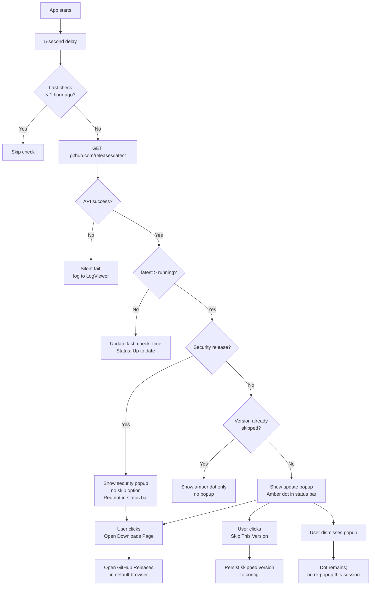
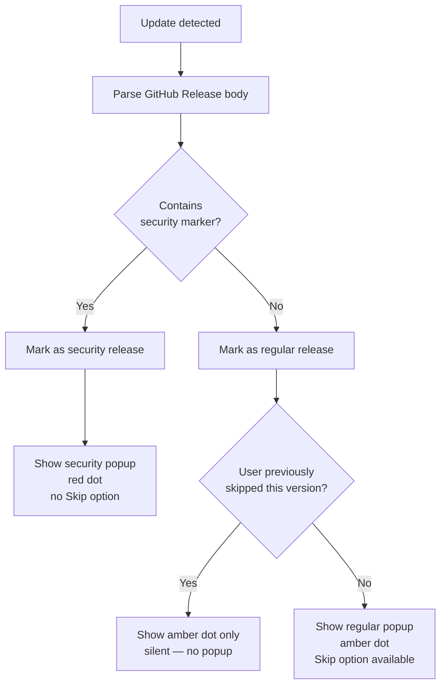

# In-Field Update Mechanism

---

## Overview

Users who have installed termiHub have no way to discover that a new version is available without
manually checking the GitHub releases page. For a security-sensitive tool that manages SSH
credentials, serial connections, and tunnels, silent outdatedness is a real risk: a critical
security patch may sit uninstalled on user machines for weeks or months.

This concept designs an update awareness and delivery system for termiHub installations. Three
implementation variants are defined and compared — from a minimal notification-only approach to
a fully automatic silent updater — so that the implementation choice can be made with full
visibility of the trade-offs involved. A phased adoption path is proposed, starting with the
lowest-complexity variant and progressively enhancing it.

### Goals

- Ensure users know when a new version of termiHub is available
- Prioritize security patches — they must not be suppressible by "skip this version"
- Provide a clear path from minimal implementation to full in-app update delivery
- Document code signing requirements and infrastructure costs for each variant
- Keep the update check privacy-respecting and transparent to users

### Non-Goals

- Release planning and dependency management (see
  [Release Planning and Dependency Management](./release-planning-and-dependency-management.md))
- Automatic rollback in case of bad updates (out of scope for initial phases)
- Delta/differential updates (full installer replacement only)
- Update channels (stable/beta selection) — noted as a future extension
- Enterprise managed-update or MDM integration

---

## UI Interface

The update UI adapts to which variant is implemented. All variants share a common entry point in
the status bar and a Settings page section. Higher variants add progressive capability on top.

### Shared: Status Bar Update Indicator

A version chip in the bottom status bar serves as the primary visual anchor for update
awareness:

```
┌────────────────────────────────────────────────────────────────────────────────┐
│  ● SSH: server-1  ● Local Shell  ●●● Tabs (3)          v0.1.0 ● [CPU 12%]    │
│                                                          ───────               │
│                                                          Update dot appears    │
│                                                          when update available │
└────────────────────────────────────────────────────────────────────────────────┘
```

When an update is available, a colored dot (amber for regular updates, red for security patches)
appears beside the version number. Clicking the version chip opens the update notification popup.

### Shared: Update Notification Popup

A non-blocking popup appears once when an update is detected (startup or background check):

```
┌──────────────────────────────────────────────────────────────────────┐
│  ●  termiHub v0.2.0 is available                              [×]    │
│  ─────────────────────────────────────────────────────────────────   │
│  You are running v0.1.0                                              │
│                                                                      │
│  [What's New]          [Open Downloads Page]    [Skip This Version]  │
└──────────────────────────────────────────────────────────────────────┘
```

For security patches the popup is styled differently and "Skip This Version" is absent:

```
┌──────────────────────────────────────────────────────────────────────┐
│  🔒  Security update: termiHub v0.1.1                         [×]    │
│  ─────────────────────────────────────────────────────────────────   │
│  This release addresses a security vulnerability. Updating is        │
│  strongly recommended.                                               │
│                                                                      │
│  [What's New]                              [Open Downloads Page]     │
└──────────────────────────────────────────────────────────────────────┘
```

### Shared: Settings > Updates Page

A dedicated section under Settings provides full update control:

```
┌──────────────────────────────────────────────────────────────────────┐
│  Settings                                              Updates        │
│  ────────────────────────────────────────────────────────────────    │
│  General                                                             │
│  Terminal                  Current version      v0.1.0               │
│  SSH                       Latest version       v0.2.0  ● Available  │
│  Appearance                Last checked         2026-04-17 14:32     │
│  Updates  ◄                                                          │
│  Advanced                  [Check Now]          [Open Downloads Page]│
│                                                                      │
│                            ─────────────────────────────────────     │
│                            Auto-check for updates                    │
│                            ● On startup    ○ Never                   │
│                                                                      │
│                            Skipped version: v0.1.1   [Clear]        │
└──────────────────────────────────────────────────────────────────────┘
```

### Variant B Addition: Download Progress

Variant B adds a download progress row to both the popup and the settings page:

```
┌──────────────────────────────────────────────────────────────────────┐
│  ●  termiHub v0.2.0 is ready to install                      [×]    │
│  ─────────────────────────────────────────────────────────────────   │
│  Download complete  ████████████████████████████████  100%          │
│                                                                      │
│  [Install and Restart]             [Later]    [Skip This Version]    │
└──────────────────────────────────────────────────────────────────────┘
```

Status bar during download:

```
│  v0.1.0 ↓ 34%                                                       │
```

### Variant C Addition: Post-Launch Banner

After a silent auto-install, a one-time info banner appears on next launch:

```
┌──────────────────────────────────────────────────────────────────────┐
│  ℹ  termiHub was updated to v0.2.0 — What's New    [Dismiss]   [×]  │
└──────────────────────────────────────────────────────────────────────┘
```

Settings > Updates gets a rollback row:

```
│  Previous version: v0.1.0                                           │
│  [Restore Previous Version]                                         │
```

---

## General Handling

### Update Check Endpoint

**All variants** use the GitHub Releases API as the update source — no custom server
infrastructure is required for basic update detection:

```
GET https://api.github.com/repos/armaxri/termiHub/releases/latest
```

Response fields used:

| Field                           | Purpose                                   |
| ------------------------------- | ----------------------------------------- |
| `tag_name`                      | Latest version string (e.g., `"v0.2.0"`)  |
| `prerelease`                    | Skip pre-releases on stable channel       |
| `body`                          | Release notes (shown in "What's New")     |
| `assets[].browser_download_url` | Download links per platform (Variant B/C) |
| `html_url`                      | GitHub releases page URL (Variant A)      |

The version in the response is compared against the running app version using semver comparison.
If `latest > running`, an update is available.

A **security release** is detected by checking whether the release body contains the keyword
`<!-- security -->` (a convention the release workflow adds, or detectable via the `security`
GitHub label on the associated PR/issue). Security releases bypass the "skip this version"
suppression.

### Check Frequency

- **On startup**: once, after a 5-second delay (avoid blocking startup UX)
- **While running**: every 24 hours, only if the app has been continuously open
- **Manual**: "Check Now" button in Settings > Updates always triggers an immediate check
- **Rate limit**: if the last check was less than 1 hour ago (excluding manual), skip

The last check timestamp and the result are persisted in the app config file alongside other
settings.

### Skip Version Behavior

| Situation                       | Behavior                                                         |
| ------------------------------- | ---------------------------------------------------------------- |
| User clicks "Skip This Version" | Persisted to config; no more notifications for that version      |
| A newer version is released     | Skip record is ignored; notification resumes for new version     |
| Next major version              | Skip record is cleared (major version change resets suppression) |
| Security release                | Skip is ignored regardless; notification always shown            |

### Privacy Considerations

The update check sends a standard HTTPS GET to `api.github.com` with:

- The `User-Agent` header identifying termiHub and its version
- No personal data, no telemetry, no identifiers beyond what any browser would send to GitHub

Users who disable auto-checking ("Never" in settings) can still use the manual "Check Now" button.
This should be documented in the app's privacy note.

### Platform Detection

The running platform (`darwin-aarch64`, `darwin-x86_64`, `windows-x86_64`, `linux-x86_64`,
`linux-aarch64`) is needed by Variants B and C to select the correct download asset. For
Variant A the platform does not matter — the download page link is the same for all.

Tauri exposes `std::env::consts::OS` and `std::env::consts::ARCH` on the backend for platform
detection.

---

## Variant Comparison

| Aspect                     | A: Notify Only                             | B: Download + Prompt               | C: Fully Automatic                   |
| -------------------------- | ------------------------------------------ | ---------------------------------- | ------------------------------------ |
| **User friction**          | Medium (browser download + manual install) | Low (one "Install" click)          | Minimal (nothing required)           |
| **Code complexity**        | Low                                        | High                               | Very High                            |
| **New Tauri plugin**       | None                                       | `tauri-plugin-updater`             | `tauri-plugin-updater`               |
| **Code signing required**  | No                                         | Yes — macOS + Windows              | Yes — macOS + Windows                |
| **Update manifest needed** | No (GitHub API)                            | Yes (signed manifest JSON)         | Yes (signed manifest JSON)           |
| **Rollback support**       | N/A (user reinstalls old version)          | Not included                       | Required for safety                  |
| **Privacy impact**         | Minimal (GitHub API request)               | Same                               | Same                                 |
| **Platform parity**        | Full (all 5 platforms equal)               | Near-full                          | Near-full (Linux auto-update harder) |
| **Infrastructure cost**    | $0 (GitHub API is free)                    | ~$0 if manifest on GitHub Releases | Same                                 |
| **Certificate cost**       | $0                                         | macOS $99/yr + Windows $200–600/yr | Same                                 |
| **Estimated impl effort**  | 1–2 days                                   | 1–2 weeks                          | 3–5 weeks                            |
| **Recommended for**        | Phase 1 (now)                              | Phase 2 (optional)                 | Phase 3 (optional)                   |

### Code Signing Deep-Dive

Code signing is required by macOS and Windows for Variants B and C because the OS must verify
the downloaded installer before executing it as part of the in-app update flow.

**macOS:**

- Requires an Apple Developer Program membership ($99/year)
- All distributed binaries must be signed and notarized with Apple's servers
- Tauri already supports macOS code signing via `APPLE_CERTIFICATE` and related CI secrets
- Notarization adds ~5 minutes to the release CI pipeline
- Without signing: macOS Gatekeeper blocks the installer from running silently

**Windows:**

- Requires a code signing certificate from a trusted CA:
  - OV (Organization Validation): $200–400/year, works for signing
  - EV (Extended Validation): $400–600/year, immediately trusted by SmartScreen
  - Standard OV certificates trigger SmartScreen warnings initially (reputation builds over time)
- Tauri supports Windows signing via `TAURI_SIGNING_PRIVATE_KEY` CI secrets
- Without signing: Windows SmartScreen may block the installer silently in B/C flows

**Linux:**

- No OS-level signing requirement for AppImage or .deb/.rpm
- GPG signing is conventional for package repos but optional for direct downloads
- Auto-update on Linux is feasible without code signing

### Update Manifest Format (Variants B and C)

Tauri's updater plugin requires a JSON manifest at a stable URL:

```json
{
  "version": "0.2.0",
  "notes": "See full release notes at https://github.com/armaxri/termiHub/releases/tag/v0.2.0",
  "pub_date": "2026-04-17T12:00:00Z",
  "platforms": {
    "darwin-aarch64": {
      "url": "https://github.com/armaxri/termiHub/releases/download/v0.2.0/termiHub_0.2.0_aarch64.dmg",
      "signature": "<ed25519-signature>"
    },
    "darwin-x86_64": {
      "url": "https://github.com/armaxri/termiHub/releases/download/v0.2.0/termiHub_0.2.0_x64.dmg",
      "signature": "<ed25519-signature>"
    },
    "windows-x86_64": {
      "url": "https://github.com/armaxri/termiHub/releases/download/v0.2.0/termiHub_0.2.0_x64-setup.msi",
      "signature": "<ed25519-signature>"
    },
    "linux-x86_64": {
      "url": "https://github.com/armaxri/termiHub/releases/download/v0.2.0/termiHub_0.2.0_amd64.AppImage",
      "signature": "<ed25519-signature>"
    }
  }
}
```

The manifest can be published as a release asset (`latest.json`) during the release CI workflow
and hosted at a stable URL (e.g., via GitHub Pages or a simple CDN).

---

## Phased Approach

```
┌─────────────────────────────────────────────────────────────────────────┐
│  Phase 1 — Variant A: Notify Only                   (Recommended Now)  │
│                                                                         │
│  • GitHub API check on startup                                          │
│  • Status bar update dot                                                │
│  • Non-blocking toast notification                                      │
│  • Settings > Updates page                                              │
│  • Security patch bypass of skip                                        │
│  • No code signing needed, no new infrastructure                        │
│  • Effort: ~1–2 days                                                    │
└─────────────────────────────────────────────────────────────────────────┘
          │
          │  (optional future step)
          ▼
┌─────────────────────────────────────────────────────────────────────────┐
│  Phase 2 — Variant B: Download + Prompt             (Optional)         │
│                                                                         │
│  • Everything in Phase 1, plus:                                         │
│  • tauri-plugin-updater integration                                     │
│  • Signed update manifest on GitHub Releases                            │
│  • In-app download with progress indicator                              │
│  • "Install and Restart" prompt                                         │
│  • Requires code signing (macOS + Windows)                              │
│  • Effort: ~1–2 weeks + certificate setup time                          │
└─────────────────────────────────────────────────────────────────────────┘
          │
          │  (optional future step — evaluate after Phase 2 user feedback)
          ▼
┌─────────────────────────────────────────────────────────────────────────┐
│  Phase 3 — Variant C: Fully Automatic               (Optional)         │
│                                                                         │
│  • Everything in Phase 2, plus:                                         │
│  • Silent background download + auto-install on next restart            │
│  • Post-launch "updated to vX.Y.Z" banner                               │
│  • Rollback to previous version from Settings                           │
│  • Note: likely overkill for a developer/ops tool where users           │
│    prefer to control when updates happen                                │
│  • Effort: ~3–5 weeks additional                                        │
└─────────────────────────────────────────────────────────────────────────┘
```

The decision of when (or whether) to advance from Phase 1 to Phase 2 should be driven by user
feedback: if users report that manual re-download is a significant friction point, Phase 2 is
worthwhile. For a developer tool with technically sophisticated users, Phase 1 may be sufficient
long-term.

---

## States & Sequences

### Update Availability State Machine

```mermaid
stateDiagram-v2
    [*] --> Idle

    Idle --> Checking : App launch (5s delay)\nor 24h interval\nor manual "Check Now"

    Checking --> UpToDate : running == latest
    Checking --> UpdateAvailable : latest > running
    Checking --> CheckFailed : Network error /\nAPI unavailable

    CheckFailed --> Idle : Silent fail;\nretry next cycle

    UpToDate --> Idle : No action;\nschedule next check

    UpdateAvailable --> Notified : Show dot + toast
    Notified --> Skipped : User clicks\n"Skip This Version"\n(not security)
    Notified --> Dismissed : User dismisses\nnotification
    Notified --> Downloading : Variant B/C:\n"Download" triggered
    Notified --> OpenedBrowser : Variant A:\n"Open Downloads Page"

    Skipped --> Idle : Persist skip to config
    Dismissed --> Idle : Show dot only;\nno re-toast until\nnew version
    OpenedBrowser --> Idle

    Downloading --> DownloadComplete : Download successful
    Downloading --> DownloadFailed : Network error
    DownloadFailed --> Notified : Show error;\noffer retry
    DownloadComplete --> ReadyToInstall : Variant B: show prompt
    DownloadComplete --> PendingRestart : Variant C: silent

    ReadyToInstall --> Installing : User confirms
    ReadyToInstall --> Idle : User clicks "Later"

    Installing --> [*] : App restarts
    PendingRestart --> [*] : Next app launch\ntriggers install
```

### Variant A: Notify-Only User Journey



### Variant B: Download and Prompt Sequence

```mermaid
sequenceDiagram
    participant UI as React Frontend
    participant Store as Zustand Store
    participant Tauri as Tauri Backend
    participant Plugin as tauri-plugin-updater
    participant GH as GitHub / Manifest

    UI->>Tauri: check_for_updates()
    Tauri->>GH: GET update manifest
    GH-->>Tauri: { version, platforms, signatures }
    Tauri->>Tauri: semver compare;\nverify signature
    Tauri-->>Store: updateAvailable: true,\nlatestVersion: "0.2.0"
    Store-->>UI: re-render status bar dot + popup

    UI->>Tauri: download_update()
    Tauri->>Plugin: start download
    Plugin->>GH: Download installer asset
    loop Download progress
        Plugin-->>Tauri: progress event (bytes downloaded)
        Tauri-->>Store: downloadProgress: 0..100
        Store-->>UI: update progress bar
    end
    Plugin-->>Tauri: download complete; installer staged
    Tauri-->>Store: readyToInstall: true
    Store-->>UI: show "Install and Restart" dialog

    UI->>Tauri: install_update()
    Tauri->>Plugin: apply update + restart
    Note over Tauri,Plugin: App process exits;\ninstaller runs;\napp relaunches at new version
```

### Security Update Skip Bypass



---

## Preliminary Implementation Details

### Variant A — Phase 1 (Notify Only)

**Backend** (`src-tauri/src/`):

New file: `src-tauri/src/commands/update.rs`

```rust
use semver::Version;
use serde::{Deserialize, Serialize};

#[derive(Debug, Serialize, Deserialize)]
pub struct UpdateInfo {
    pub available: bool,
    pub latest_version: String,
    pub release_url: String,
    pub release_notes: String,
    pub is_security: bool,
}

#[tauri::command]
pub async fn check_for_updates(app_version: String) -> Result<UpdateInfo, String> {
    // GET https://api.github.com/repos/armaxri/termiHub/releases/latest
    // Compare semver, detect security marker, return UpdateInfo
}
```

- Uses `reqwest` (already a workspace dependency)
- Security detection: check if release body contains `<!-- security -->` marker (convention to
  add to release workflow)
- Persisted state: extend existing app config JSON with `last_update_check` and
  `skipped_update_version` fields

**Frontend**:

New components:

- `src/components/StatusBar/UpdateIndicator.tsx` — version chip with optional dot badge;
  `onClick` opens update popup
- `src/components/UpdateNotification/UpdateNotification.tsx` — toast/dialog with action buttons
- New section in `src/components/Settings/` (existing settings layout) for the Updates page

Zustand store additions in `src/store/appStore.ts`:

```typescript
updateAvailable: boolean;
latestVersion: string | null;
latestReleaseUrl: string | null;
latestReleaseNotes: string | null;
isSecurityUpdate: boolean;
updateCheckState: "idle" | "checking" | "up-to-date" | "available" | "error";
skippedVersion: string | null;
```

New Tauri event or invoke call on startup (after 5-second delay) and a 24-hour interval via
`setInterval`.

**No infrastructure changes required.** The GitHub Releases API is unauthenticated for public
repositories (rate limit: 60 req/hour per IP — well within normal usage).

---

### Variant B — Phase 2 (Download + Prompt)

**Additional dependencies**:

- `src-tauri/Cargo.toml`: add `tauri-plugin-updater`
- `tauri.conf.json`: add updater plugin configuration with endpoint URL and public key

**Update manifest**:

A `latest.json` manifest is generated and signed during the release CI workflow
(`.github/workflows/release.yml`). The signing private key is stored as a GitHub Actions secret.
The manifest is uploaded as a release asset or to a GitHub Pages endpoint.

**Additional Tauri commands**:

- `download_update()` — starts download, emits `update-download-progress` events
- `install_update()` — applies the downloaded update and restarts

**Frontend additions**:

- Progress bar component in `UpdateNotification.tsx`
- Status bar shows download percentage during active download

**Code signing CI secrets** to add (platform-specific):

- `APPLE_CERTIFICATE`, `APPLE_CERTIFICATE_PASSWORD`, `APPLE_ID`, `APPLE_TEAM_ID` (macOS)
- `TAURI_SIGNING_PRIVATE_KEY`, `WINDOWS_CERTIFICATE` (Windows)

---

### Variant C — Phase 3 (Fully Automatic)

Built on top of Phase 2. Additional work:

- Auto-trigger download on update detection (no user prompt for download)
- Persist "pending update" state across app restarts
- On next launch: apply pending update before showing main UI, then show "updated to vX.Y.Z"
  banner
- Settings > Updates: show previous version with a "Restore" button
- Rollback: re-download the previous installer asset from GitHub Releases, run it

Rollback is the main complexity driver for Phase 3. A simpler approach: link to the previous
GitHub Release for manual rollback, rather than implementing automatic rollback.

---

### Config Schema Extension

The app config JSON (existing settings persistence) gains update-related fields:

```json
{
  "updates": {
    "auto_check": true,
    "last_check_time": "2026-04-17T14:32:00Z",
    "skipped_version": null,
    "pending_install_version": null
  }
}
```

`pending_install_version` is only used by Variant C to persist a staged update across restarts.
