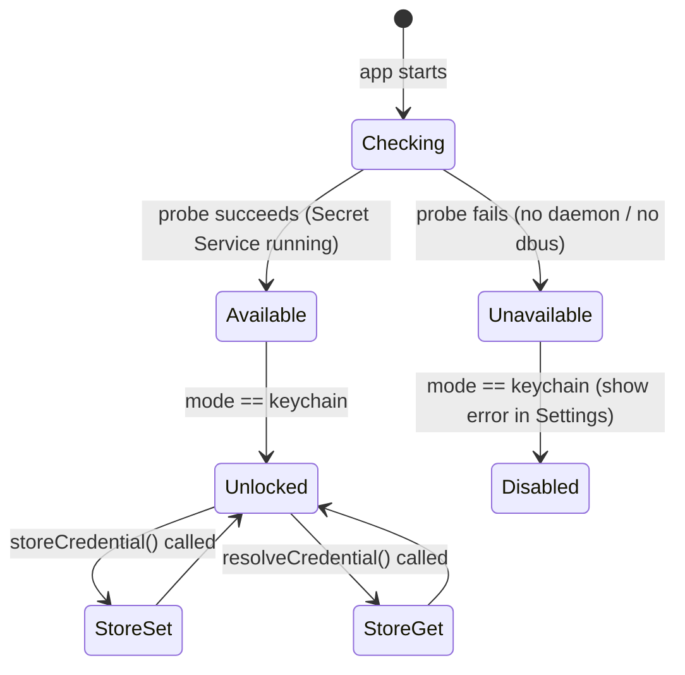
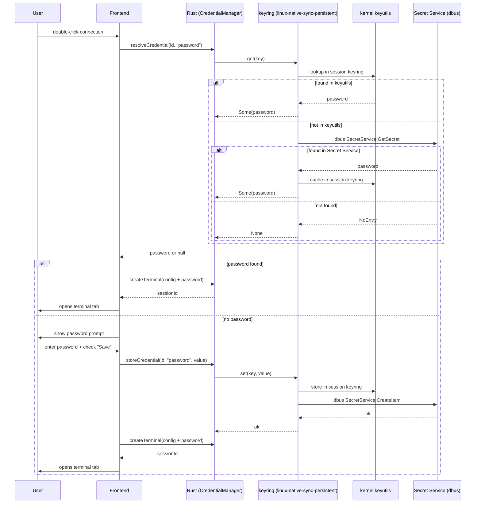
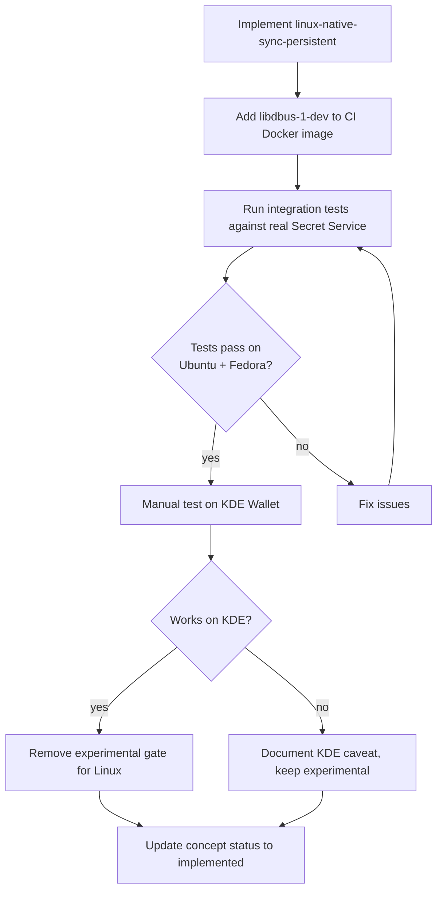

# Concept: Linux Persistent Credential Storage via Secret Service

> GitHub Issue: [#581](https://github.com/armaxri/termiHub/issues/581)

## Overview

termiHub's OS Keychain backend on Linux currently uses the `linux-native` feature of the
`keyring` crate, which stores credentials in the Linux **kernel keyutils** facility.
Kernel keyutils are session-scoped: they survive process restarts within a login session but
are automatically discarded on logout or reboot. This means SSH passwords saved in one
session are gone in the next — a significant usability gap compared to macOS Keychain and
Windows Credential Manager.

The **Secret Service** protocol (spec: freedesktop.org) provides a dbus-based API for
persistent, encrypted credential storage. Its most common implementations are
**GNOME Keyring** (default on GNOME/Ubuntu/Fedora) and **KDE Wallet** (default on KDE Plasma).
Both are available on virtually every desktop Linux distribution.

Enabling `linux-native-sync-persistent` + `crypto-rust` in the `keyring` crate activates a
dual-store backend that uses kernel keyutils for in-session fast access and Secret Service for
persistent storage — giving Linux users the same "enter once, never again" experience already
available on macOS after the `apple-native` feature was enabled.

The OS Keychain option is currently gated behind the **experimental feature flag** on Linux
(and Windows) until this concept is implemented and validated.

---

## UI Interface

No new UI screens are needed. The existing **Settings → Security → Credential Storage** panel
already contains the "OS Keychain" option. The change is purely in what happens at the backend
when that option is selected on Linux.

### Current state (Linux, OS Keychain experimental)

```
┌─ Credential Storage ─────────────────────────────────────────────┐
│                                                                    │
│  ⚠  OS Keychain is not available on this system       (if dbus    │
│     is absent)  OR                                                 │
│  ✓  OS Keychain is available                          (if dbus    │
│     daemon is running)                                             │
│                                                                    │
│  [Experimental] OS Keychain                                        │
│  Store credentials in the OS native credential store.             │
│  Support on this platform is experimental and may not work        │
│  correctly.                                                        │
│                                                                    │
│  Master Password                                                   │
│  None                                                              │
└────────────────────────────────────────────────────────────────────┘
```

### Target state (Linux, OS Keychain stable)

Once this concept is implemented and validated, the experimental gate is removed and the UI
becomes identical to macOS:

```
┌─ Credential Storage ─────────────────────────────────────────────┐
│                                                                    │
│  ✓  OS Keychain is available                                       │
│                                                                    │
│  [Recommended] OS Keychain                                         │
│  Store credentials in the system keychain (GNOME Keyring /        │
│  KDE Wallet via Secret Service).                                   │
│                                                                    │
│  Master Password                                                   │
│  None                                                              │
└────────────────────────────────────────────────────────────────────┘
```

When the Secret Service daemon is **not running** (headless servers, minimal installs):

- `KeychainStore::is_available()` returns `false`
- The status indicator shows "OS Keychain is not available on this system"
- The option is visible but clicking it shows an inline error: "Secret Service is not running.
  Install and start GNOME Keyring or KDE Wallet to use this option."

---

## General Handling

### Availability detection

`KeychainStore::is_available()` already performs a probe read (service `"termihub"`,
user `"_probe"`). With `linux-native-sync-persistent`, this probe goes through the Secret
Service dbus call. If the dbus session bus is absent or no Secret Service daemon is listening,
the probe fails and `is_available()` returns `false`.

The frontend calls `checkKeychainAvailable()` on Settings panel mount and displays the result
in the status indicator — no change needed here.

### Dependencies

| Component | Requirement                                                                                    |
| --------- | ---------------------------------------------------------------------------------------------- |
| Runtime   | A running Secret Service daemon (GNOME Keyring, KDE Wallet, or `gnome-keyring-daemon --start`) |
| Build     | `libdbus-1-dev` (Debian/Ubuntu) or `dbus-devel` (Fedora/RHEL) on the build host                |
| CI        | The Docker-based Linux test environment needs `libdbus-1-dev` added to the container           |

### Headless / server deployments

On headless Linux servers there is no Secret Service daemon. Users in this scenario should
use **Master Password** mode. The Settings UI should make this clear via the availability
indicator, and the "OS Keychain" option should show a helpful error rather than silently
failing when selected.

### Crypto feature

`linux-native-sync-persistent` enables `sync-secret-service`, which transfers credentials
over dbus. The `crypto-rust` feature encrypts this transfer using pure-Rust AES-GCM.
Without a crypto feature the transfer is unencrypted (only protected by dbus socket
permissions). `crypto-rust` is preferred over `crypto-openssl` to avoid a native OpenSSL
dependency.

### Migration

Switching from `linux-native` (session keyutils) to `linux-native-sync-persistent` is
transparent: the existing `switch_credential_store` command handles credential migration by
reading from the old backend and writing to the new one. Since keyutils credentials are
session-scoped, the migration window is only valid within the same session where the switch
is made.

---

## States & Sequences

### Credential store availability state



### Connect flow with persistent Linux keychain



### Feature flag removal decision



---

## Preliminary Implementation Details

> Based on the codebase at the time of concept creation. Details may change before implementation.

### 1. Cargo.toml feature change

In `src-tauri/Cargo.toml`, change the `keyring` dependency from:

```toml
keyring = { version = "3", features = ["apple-native", "windows-native", "linux-native"] }
```

to:

```toml
keyring = { version = "3", features = ["apple-native", "windows-native", "linux-native-sync-persistent", "crypto-rust"] }
```

The `linux-native-sync-persistent` feature enables a dual store (keyutils + Secret Service).
`crypto-rust` provides dbus transfer encryption using pure-Rust primitives — no OpenSSL needed.

### 2. CI Docker image

The test Docker images at `tests/docker/` need `libdbus-1-dev` (Debian/Ubuntu) added to their
`Dockerfile` build steps. Example:

```dockerfile
RUN apt-get install -y libdbus-1-dev
```

For Alpine-based images: `apk add dbus-dev`.

A running Secret Service daemon is also required for integration tests. The `dbus-daemon` and
`gnome-keyring-daemon` (headless mode) can be started in the container setup script.

### 3. KeychainStore::is_available() robustness

The current probe implementation returns `false` for any error other than `NoEntry`. With the
Secret Service backend, dbus errors (service not running, timeout) must also be handled
gracefully. The existing implementation already covers this — any non-`NoEntry` error returns
`false`, which is correct behaviour.

### 4. Removing the experimental gate

Once testing confirms consistent behaviour on GNOME Keyring and KDE Wallet, update
`buildStorageModeOptions` in `src/components/Settings/SecuritySettings.tsx`:

- Change the Linux branch to return the same "Recommended" keychain option as macOS
- Remove the `platform === "linux"` experimental-gate condition

### 5. Windows (separate concern)

Windows Credential Manager via `windows-native` is already enabled in `Cargo.toml`. The
experimental gate for Windows should be removed under a separate issue once Windows-specific
manual testing is completed.
