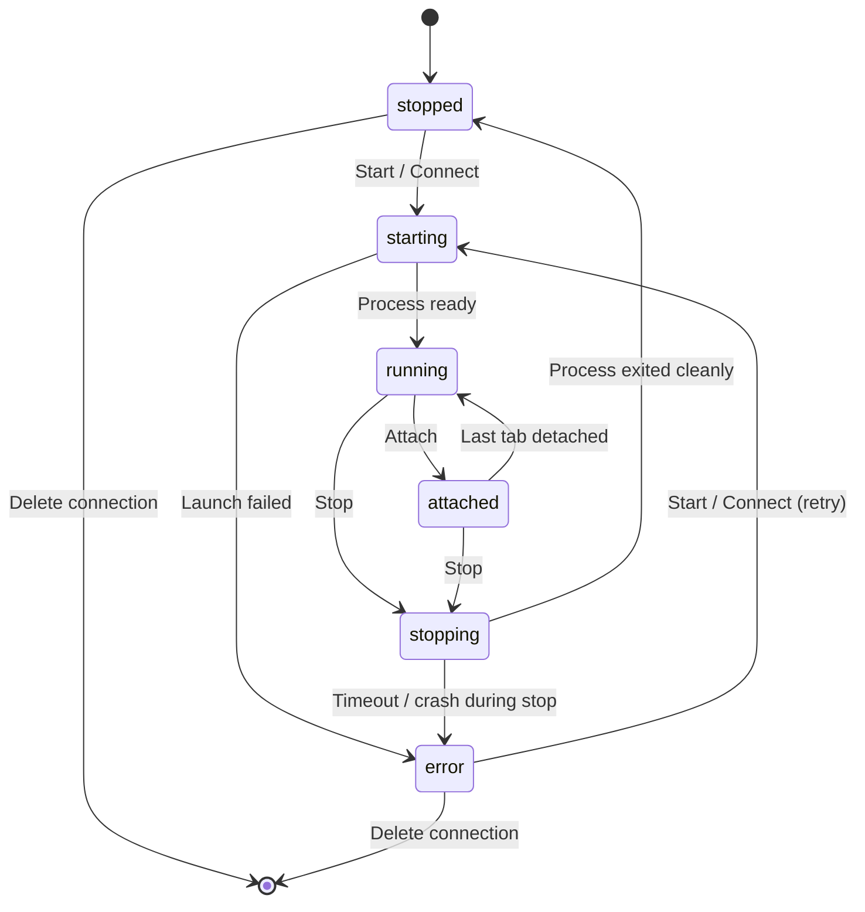
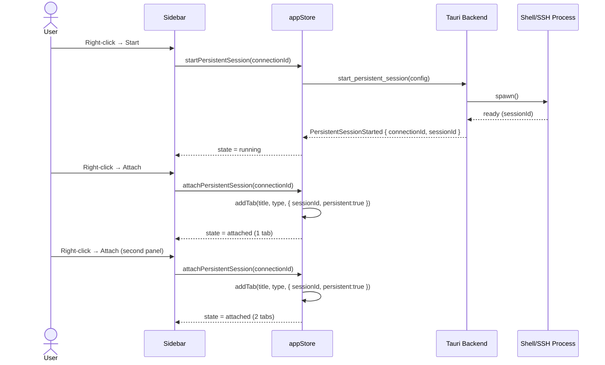
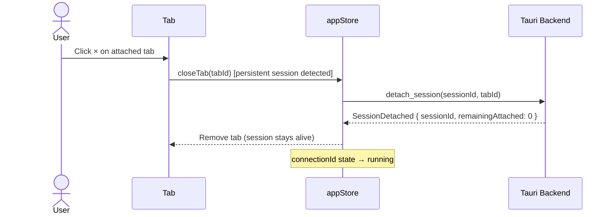
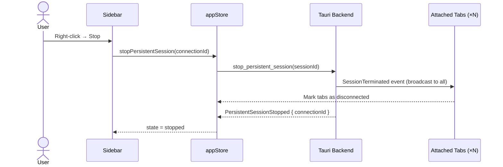

# Persistent Connection Status Indicator and Attach/Stop/Start Mechanics

> GitHub Issue: [#666](https://github.com/armaxri/termiHub/issues/666)

## Overview

Several connection types in termiHub — SSH, Docker, WSL, and Serial — carry the `persistent: true`
capability flag. This means their underlying processes can survive beyond a single tab's lifetime.
Currently the sidebar gives no visual hint that a connection is persistent, and there is no way to
start a session without immediately attaching to it, stop a running session short of killing the
tab, or attach a second tab to an already-running process.

This concept introduces a **Start / Attach / Stop** lifecycle model for persistent-capable
connections, mirroring the pattern already used by the remote agent (connect/disconnect). Users
will be able to see at a glance whether a saved persistent connection is stopped, starting, running
in the background, or attached to one or more tabs — and act accordingly.

---

## UI Interface

### Connection Item Appearance

Each saved connection item in the sidebar gains two new visual elements when its type is
persistent-capable:

1. **Persistence badge** — a small pill or icon (e.g., `∞` infinity symbol or the label `PRS`)
   shown to the left of the connection type chip. It is always visible and tells the user "this
   connection can run in the background."

2. **State dot** — a small circle to the right of the connection name. Colour and tooltip reflect
   the live run state:

   | State      | Colour           | Tooltip                       |
   | ---------- | ---------------- | ----------------------------- |
   | `stopped`  | grey             | "Not running"                 |
   | `starting` | amber (pulsing)  | "Starting…"                   |
   | `running`  | green            | "Running – not attached"      |
   | `attached` | bright green     | "Running – N tab(s) attached" |
   | `stopping` | orange (pulsing) | "Stopping…"                   |
   | `error`    | red              | "Terminated unexpectedly"     |

   Non-persistent connections show neither element.

**Annotated wireframe (stopped vs. attached state):**

```
 [∞] 🖥  My SSH Server      ssh  ● (grey)
 [∞] 🖥  Dev Docker         docker  ● (bright green, badge "2")
     🖥  Local Shell        local
```

### Attached-Tab Count Badge

When `attached` and more than one tab is connected to the same session, a small numeric badge
overlays the state dot (e.g., `●²`). Hovering shows the names of the attached tabs.

### Context Menu

The context menu adapts its primary action set to the current state:

| State                   | Primary Actions                         | Secondary Actions                  |
| ----------------------- | --------------------------------------- | ---------------------------------- |
| `stopped` / `error`     | **Start**, **Connect** (Start + Attach) | Edit, Duplicate, Ping Host, Delete |
| `starting` / `stopping` | _(disabled, show spinner)_              | —                                  |
| `running`               | **Attach**, **Stop**                    | Edit, Duplicate, Ping Host, Delete |
| `attached`              | **Attach** (new tab), **Stop**          | Edit, Duplicate, Ping Host, Delete |

**"Connect"** (the current default double-click action) is kept as a convenience shortcut: if the
session is already running it performs **Attach**, otherwise it performs **Start + Attach**. This
preserves the familiar one-click workflow while making the separate primitives available.

### Inline Quick-Action Buttons (hover)

On hover, two icon buttons appear on the right side of the connection item (styled like the agent
node's inline buttons):

- **Stopped / Error**: `▶ Start` and `⚡ Connect`
- **Running / Attached**: `⊕ Attach` and `■ Stop`
- **Transitioning (Starting / Stopping)**: a spinner only, no buttons

### Tab Decoration

Tabs that are attached to a persistent session display a small `∞` superscript on the tab title
to signal that closing the tab will **detach**, not terminate, the background process.

When the user closes such a tab via the `×` button, a one-time tooltip confirmation appears:

> "This session will keep running in the background. Use Stop in the sidebar to terminate it."

A "Don't show again" checkbox suppresses future confirmations (stored as a user preference).

---

## General Handling

### Start

- Launches the backend process for the saved connection without opening a terminal tab.
- The sidebar item transitions to `starting` → `running`.
- If credentials are required (e.g., SSH password or key passphrase), the existing credential
  resolution dialog is shown before the process is launched.
- Starting a connection that is already `running` or `attached` is a no-op (with a brief toast
  notification: "Already running").

### Attach

- Opens a new terminal tab pointing to the already-running process.
- The sidebar item transitions to `running` → `attached` (or stays `attached` and increments the
  badge).
- Attach is only available when the session is `running` or `attached`.
- Multiple concurrent tabs from different panels or tab groups can all attach to the same process.

### Detach (closing an attached tab)

- Closing an attached tab removes that tab from the process but leaves the process alive.
- If this was the last attached tab, the state reverts to `running` (not `stopped`).
- The process continues to accumulate output in its ring buffer; a freshly attached tab sees the
  buffered history.

### Stop

- Sends a graceful shutdown signal to the running process.
- All tabs attached to that session receive a "Connection closed" notification and are marked as
  disconnected (the tab is kept open to preserve scroll history, consistent with existing
  behaviour).
- The sidebar item transitions `stopping` → `stopped`.
- Stop on an already-stopped connection is a no-op.

### Connect (convenience shortcut)

- If the session is `stopped` or `error`: equivalent to **Start + Attach** (existing double-click).
- If the session is `running` or `attached`: equivalent to **Attach**.
- Preserves current UX for users who do not need the separate primitives.

### Error / Unexpected Termination

- If the process exits without an explicit Stop command, the state transitions to `error`.
- The state dot turns red and the last exit code or error message is shown in the tooltip.
- The user can **Start** again from the error state; this resets the state machine.

### Non-Persistent Connections

No changes. `local` and `telnet` connections retain their current behaviour: opening always
creates a new session, closing the tab always terminates it.

---

## States & Sequences

### State Machine



### Sequence: Start then Attach from a second panel



### Sequence: Tab close (detach, not stop)



### Sequence: Stop with attached tabs



---

## Preliminary Implementation Details

> Note: this section reflects the codebase at the time of concept creation. The codebase may
> evolve between concept creation and implementation.

### Frontend

**`src/types/connection.ts`**

Add a new `PersistentSessionState` type and extend `AppState`:

```typescript
export type PersistentRunState =
  | "stopped"
  | "starting"
  | "running"
  | "attached"
  | "stopping"
  | "error";

export interface PersistentSessionEntry {
  connectionId: string;
  sessionId: string | null;
  state: PersistentRunState;
  attachedTabIds: string[];
  errorMessage?: string;
}
```

**`src/store/appStore.ts`**

New state slice:

```typescript
persistentSessions: Record<string, PersistentSessionEntry>; // keyed by connectionId
```

New actions:

```typescript
startPersistentSession(connectionId: string): Promise<void>
attachPersistentSession(connectionId: string): void
stopPersistentSession(connectionId: string): Promise<void>
```

Modify `closeTab` / `removeTab` to call `detachPersistentSession` instead of terminating the
backend session when `tab.config.persistent === true` and a corresponding entry exists in
`persistentSessions`.

**`src/components/Sidebar/ConnectionList.tsx`**

- `ConnectionItem` reads `persistentSessions[connection.id]` from the store.
- Renders the persistence badge (when `capabilities.persistent === true`) and the state dot.
- Replaces the single "Connect" context-menu item with the state-dependent set described above.
- Adds inline hover buttons.

**`src/components/Terminal/TerminalTab.tsx` (or equivalent tab header)**

- Reads `persistentSessions` to detect if the tab is attached to a persistent session.
- Shows `∞` superscript.
- Intercepts tab close to show the one-time tooltip and call detach instead of terminate.

### Tauri Backend (`src-tauri/src/`)

New Tauri IPC commands (in `src-tauri/src/commands/`):

| Command                              | Description                                             |
| ------------------------------------ | ------------------------------------------------------- |
| `start_persistent_session(config)`   | Spawns the process, returns `sessionId`                 |
| `stop_persistent_session(sessionId)` | Gracefully terminates the process                       |
| `detach_session(sessionId, tabId)`   | Unregisters a tab from the session; keeps process alive |
| `list_persistent_sessions()`         | Returns all running persistent sessions and their state |

The session manager (`src-tauri/src/session/manager.rs`) needs a new registry of
"detachable" sessions: a map from `connectionId → (process_handle, attached_tab_set)`.

Closing a tab currently calls `close_session` (which kills the process). This must be changed to
`detach_session` for sessions that are flagged as persistent. The process is only killed when
`stop_persistent_session` is called explicitly or when `attached_tab_set` is empty and the user
has not explicitly started the session in "background" mode.

> **Design decision TBD at implementation time**: Should a session auto-stop when the last tab
> detaches, or remain running until explicitly stopped? The issue requires the second behaviour
> (explicit Stop only), but this should be validated with the user at implementation time.

### Event Flow

A new Tauri event `persistent-session-state-changed` emitted to the frontend whenever a session
transitions state:

```json
{
  "connectionId": "abc-123",
  "sessionId": "sess-456",
  "state": "running",
  "attachedTabCount": 0
}
```

The frontend listens for this event (in `src/services/events.ts`) and updates
`persistentSessions` in the store, which triggers reactive re-renders in `ConnectionItem`.

### Relationship to Agent Definitions

Remote agent definitions already have a `persistent: bool` field and a `handleAttachSession`
callback in `AgentNode.tsx`. This feature is the **desktop-side analogue** of that pattern. The
two should remain separate at the implementation level (local sessions vs. remote agent sessions)
but should feel visually consistent — use the same state-dot CSS classes and badge style.
