# RDP (Remote Desktop Protocol) Sessions

> GitHub Issue: [#513](https://github.com/armaxri/termiHub/issues/513)

## Overview

Add built-in RDP session support to termiHub, allowing users to connect to Windows remote desktops directly from within the application. RDP sessions render as graphical tabs alongside terminal tabs, using the existing tab/split view system.

**Motivation**: RDP is one of the most widely used remote access protocols, especially in enterprise and Windows environments. System administrators who rely on MobaXterm heavily use RDP sessions alongside SSH terminals. Adding RDP support makes termiHub a viable MobaXterm replacement for Windows-centric workflows.

**Key goals**:

- **Inline graphical sessions**: RDP renders inside a termiHub tab via `<canvas>`, not an external window
- **Full tab integration**: RDP tabs participate in drag-and-drop, split views, and the tab bar like any other connection type
- **Credential store integration**: RDP passwords stored via the existing credential store (master password or keychain)
- **Connection editor support**: Schema-driven form for host, port, username, domain, resolution, color depth, etc.
- **Cross-platform**: Works on Windows, macOS, and Linux using IronRDP (pure Rust)

### Why IronRDP

| Approach                               | Pros                                                                                         | Cons                                                     |
| -------------------------------------- | -------------------------------------------------------------------------------------------- | -------------------------------------------------------- |
| **IronRDP (pure Rust)**                | Cross-platform, no native deps, deep protocol control, MIT-licensed, maintained by Microsoft | Newer library, not feature-complete vs. FreeRDP          |
| **FreeRDP (C library + FFI)**          | Feature-complete, battle-tested, broad codec support                                         | Complex C FFI, difficult cross-compilation, LGPL         |
| **Web-based client (e.g., Guacamole)** | No native code needed                                                                        | Requires server component, latency overhead, extra infra |
| **External viewer launch**             | Trivial to implement                                                                         | Not integrated, no tab support, poor UX                  |

**Recommendation**: Use **IronRDP** as the primary implementation. It is a pure-Rust library maintained under the Microsoft organization, providing RDP 6+ protocol support with bitmap decoding, input encoding, and TLS. Its pure-Rust nature means no cross-compilation headaches and no native dependencies — ideal for termiHub's multi-platform builds.

## UI Interface

### Connection Editor — RDP Configuration

The connection editor uses the existing schema-driven form system. When the user selects "RDP" as the connection type, the form renders these fields:

```
┌──────────────────────────────────────────────────────────────┐
│ CONNECTION EDITOR                                            │
│                                                              │
│ Type: [RDP ▾]                                                │
│                                                              │
│ ─── Connection ───                                           │
│ Host:       [windows-server.local   ]                        │
│ Port:       [3389                   ]                        │
│ Username:   [admin                  ]                        │
│ Domain:     [CORP                   ]  (optional)            │
│ Password:   [••••••••    ] [💾 Save]                         │
│                                                              │
│ ─── Display ───                                              │
│ Resolution: [Match Window ▾]                                 │
│             ○ Match Window (dynamic)                         │
│             ○ 1920×1080                                      │
│             ○ 1280×720                                       │
│             ○ Custom: [____] × [____]                        │
│ Color Depth: [32-bit ▾]                                      │
│ Scale Mode:  [Fit to Tab ▾]                                  │
│                                                              │
│ ─── Features ───                                             │
│ ☑ Clipboard Sync                                             │
│ ☐ Drive Redirection  Path: [               ] [Browse]        │
│ ☐ Audio Playback                                             │
│ ☐ Admin/Console Session                                      │
│                                                              │
│ ─── Security ───                                             │
│ Security: [Auto ▾]  (Auto / TLS / NLA / RDP)                │
│ ☑ Ignore certificate errors                                  │
│                                                              │
│              [Test Connection]  [Save]                        │
└──────────────────────────────────────────────────────────────┘
```

### RDP Session Tab

Once connected, the RDP session renders as a `<canvas>` element filling the tab area. A thin toolbar appears at the top on hover, similar to how full-screen RDP clients show a connection bar:

```
┌──────────────────────────────────────────────────────────────┐
│ Tab: RDP: windows-server  │ Tab: SSH: dev-box  │ +          │
├──────────────────────────────────────────────────────────────┤
│ ┌────────────────────────────────────────────────────────┐   │
│ │ 🖥 windows-server.local  │ 1920×1080 │ Ctrl+Alt+Del │ ⛶ │   │
│ └────────────────────────────────────────────────────────┘   │
│ ╔════════════════════════════════════════════════════════╗   │
│ ║                                                        ║   │
│ ║            Windows Remote Desktop                      ║   │
│ ║                                                        ║   │
│ ║   ┌──────────────────────────────────┐                 ║   │
│ ║   │  Desktop rendered on <canvas>    │                 ║   │
│ ║   │  Mouse + keyboard forwarded      │                 ║   │
│ ║   │  to RDP session                  │                 ║   │
│ ║   └──────────────────────────────────┘                 ║   │
│ ║                                                        ║   │
│ ╚════════════════════════════════════════════════════════╝   │
├──────────────────────────────────────────────────────────────┤
│ 🖥 RDP │ windows-server.local:3389 │ 1920×1080 │ 32-bit    │
└──────────────────────────────────────────────────────────────┘
```

**Toolbar elements** (visible on mouse hover at top of canvas):

- **Host badge** — shows the connected server name
- **Resolution indicator** — current display resolution
- **Ctrl+Alt+Del button** — sends the key combination to the remote session (since the local OS would intercept it)
- **Fullscreen toggle** — expands the RDP tab to fill the entire window (hides sidebar, activity bar, status bar)

**Status bar** (bottom): Shows connection type icon, host:port, current resolution, and color depth.

### Scale Modes

The canvas rendering supports three scale modes:

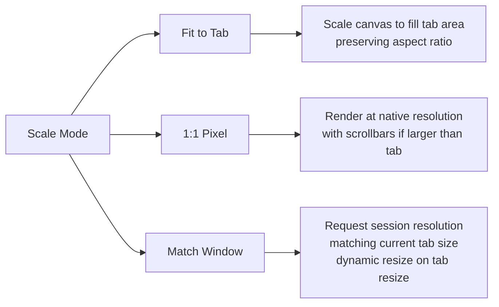

- **Fit to Tab** (default): The remote desktop is scaled to fit the tab area. Good for overview/monitoring.
- **1:1 Pixel**: No scaling. If the remote resolution exceeds the tab size, scrollbars appear. Good for precise work.
- **Match Window**: The RDP session resolution dynamically adjusts to match the tab dimensions. On tab resize (split view, window resize), a resize request is sent to the RDP server. Good for general use.

### Keyboard Handling

RDP sessions need special keyboard handling because certain key combinations are intercepted by the local OS or the browser/WebView:

```
┌──────────────────────────────────────────────────────────────┐
│ RDP Keyboard Shortcuts                                       │
│                                                              │
│ Local Shortcut          → Sent to Remote As                  │
│ ────────────────────────────────────────────                  │
│ (toolbar button)        → Ctrl+Alt+Del                       │
│ Ctrl+Alt+End            → Ctrl+Alt+Del (alternative)         │
│ Alt+Tab inside canvas   → Alt+Tab on remote                  │
│ Win/Cmd key             → Win key on remote                  │
│                                                              │
│ Escape from RDP focus:  Press Ctrl+Alt+Shift (toggles        │
│                         keyboard capture on/off)             │
└──────────────────────────────────────────────────────────────┘
```

When the RDP canvas has focus, all keyboard events are captured and forwarded to the remote session. A keyboard capture toggle (`Ctrl+Alt+Shift`) allows the user to temporarily release keyboard focus back to termiHub (e.g., to switch tabs with `Ctrl+Tab`).

### Clipboard Integration

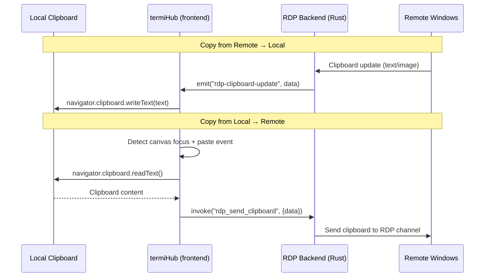

Clipboard sync is bidirectional for text content. Image clipboard support is stretch goal (requires format conversion between Windows CF_DIB and PNG).

### Sidebar — Connection List

RDP connections appear in the existing Connections sidebar alongside SSH, telnet, serial, etc. They are visually distinguished by an RDP-specific icon (monitor/desktop icon):

```
┌─────────────────────────────────┐
│ CONNECTIONS                     │
│                                 │
│ ─── Servers ───                 │
│  🖥 Windows Server (RDP)        │
│  🔌 Linux Box (SSH)             │
│  📡 Network Switch (Telnet)     │
│  🔌 Dev Server (SSH)            │
│                                 │
│ ─── Local ───                   │
│  💻 PowerShell                  │
│  💻 Bash                        │
└─────────────────────────────────┘
```

Right-click context menu on an RDP connection:

- **Connect** — open a new RDP tab
- **Edit** — open connection editor
- **Duplicate**
- **Delete**

No SFTP or file browser option for RDP connections (unlike SSH). File transfer is handled through drive redirection if enabled.

## General Handling

### Connection Lifecycle

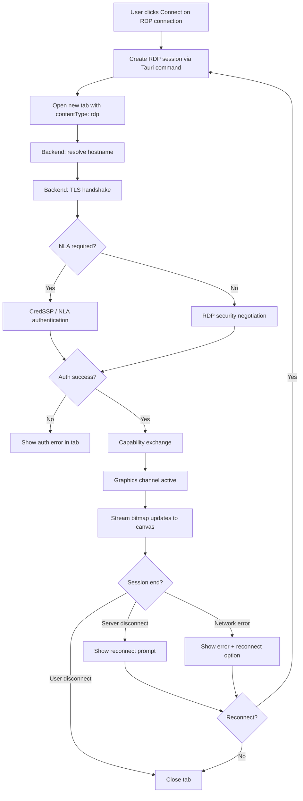

### Authentication Methods

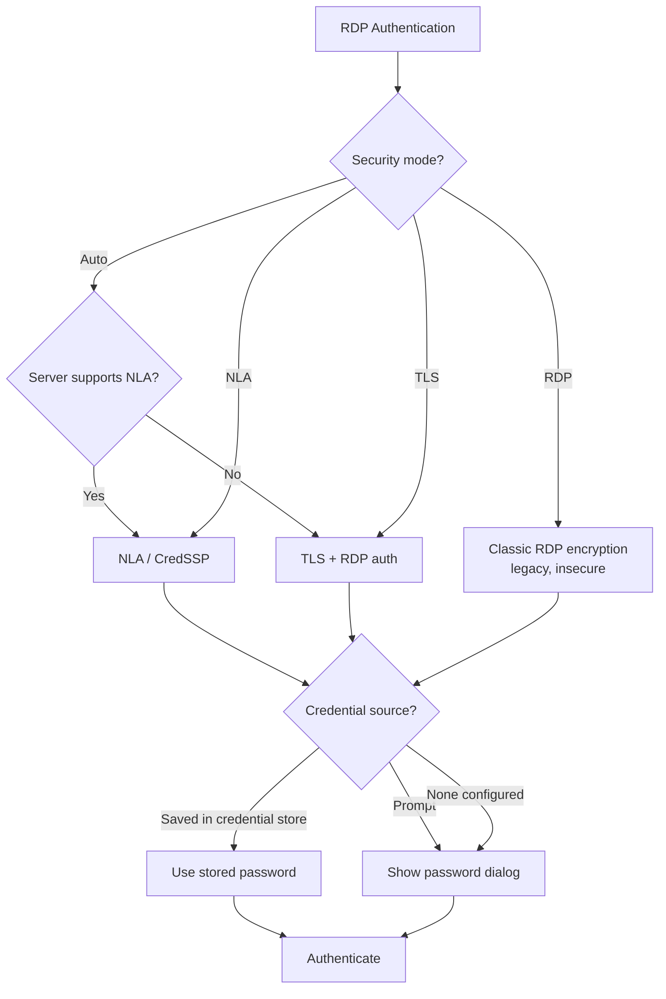

Supported authentication:

- **NLA (Network Level Authentication)** — CredSSP with NTLM or Kerberos. This is the default and most secure option. IronRDP supports CredSSP with NTLM; Kerberos is a stretch goal.
- **TLS** — TLS encryption with RDP-level password authentication.
- **RDP** — Legacy RDP encryption. Included for compatibility with old servers but shown with a security warning.

### Resolution Negotiation & Dynamic Resize

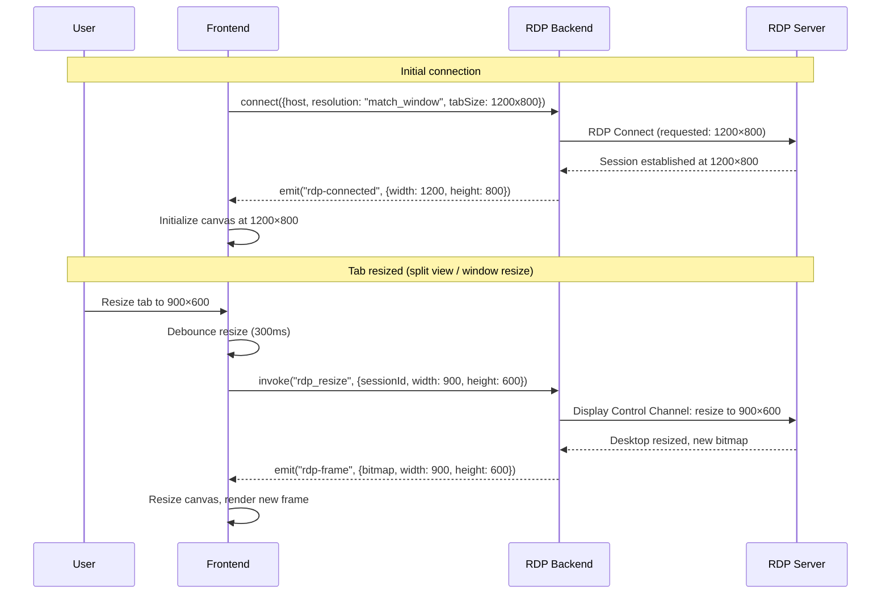

Dynamic resize uses the RDP Display Control Channel (available in RDP 8.1+). For older servers that don't support dynamic resize, the session stays at the initially negotiated resolution and the canvas scales to fit.

### Input Handling

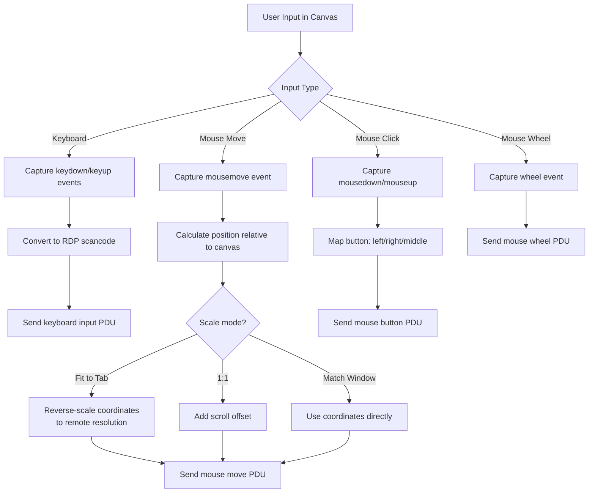

Mouse coordinate mapping is critical when using "Fit to Tab" mode — screen coordinates from the browser canvas must be reverse-scaled to the remote desktop's resolution. The frontend handles this transformation before sending coordinates to the backend.

### Drive Redirection

When enabled, drive redirection maps a local directory into the remote Windows session as a network drive:

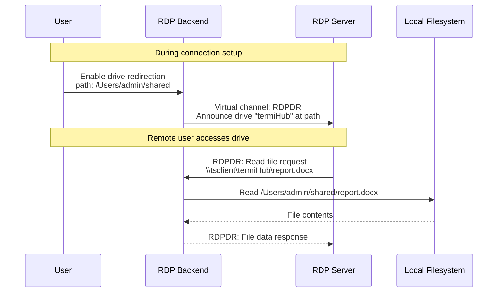

The RDPDR (RDP Device Redirection) virtual channel is handled by IronRDP's channel infrastructure. The mapped drive appears as `\\tsclient\termiHub` in the remote Windows session.

### Session Reconnection

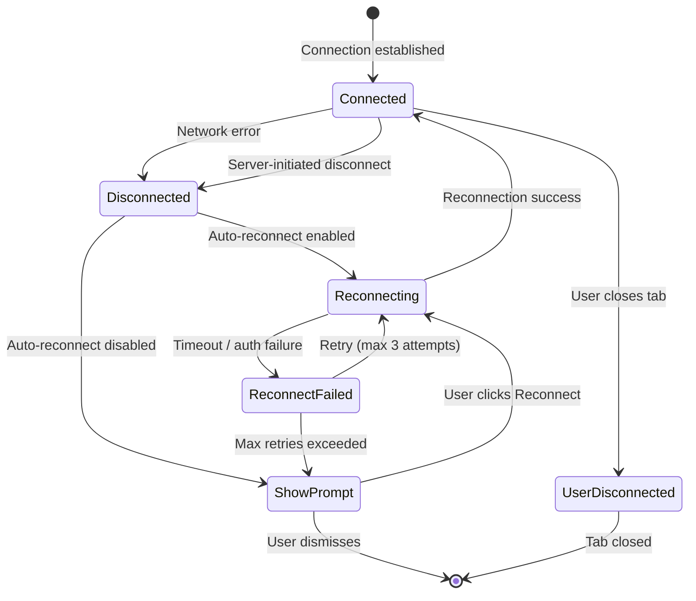

When the network drops, the RDP tab shows a semi-transparent overlay: "Connection lost. Reconnecting... (attempt 2/3)" with a cancel button.

### Edge Cases

| Scenario                        | Handling                                                                                    |
| ------------------------------- | ------------------------------------------------------------------------------------------- |
| **Certificate mismatch**        | Show warning dialog with cert details; user can accept once or permanently for this host    |
| **NLA auth failure**            | Show "Authentication failed. Check username, domain, and password." with retry option       |
| **Server at max sessions**      | Show "Server session limit reached. Try again later or use Admin/Console session."          |
| **Slow network / high latency** | Automatically reduce color depth and disable wallpaper/compositing; show latency indicator  |
| **Remote session locked**       | Send Ctrl+Alt+Del via toolbar to unlock; canvas shows the lock screen                       |
| **Tab loses focus**             | Stop forwarding keyboard events; release all held modifier keys to avoid stuck keys         |
| **Very large resolution**       | Cap at 4096×2160 to prevent excessive memory usage; warn user if requested size exceeds cap |
| **Multi-monitor remote**        | Out of scope for initial implementation; single-monitor support only                        |
| **Gateway/proxy**               | Out of scope for initial implementation; direct connections only                            |
| **Smart card / cert auth**      | Out of scope for initial implementation; password + NLA only                                |

## States & Sequences

### RDP Session State Machine

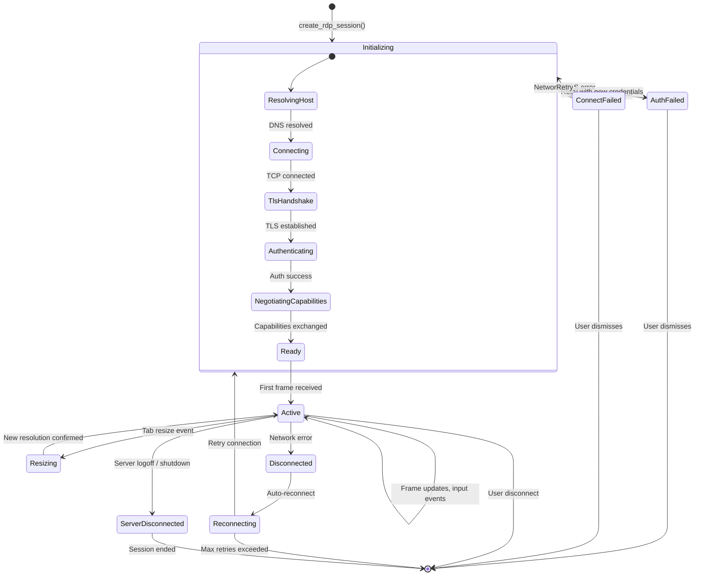

### Frame Rendering Pipeline

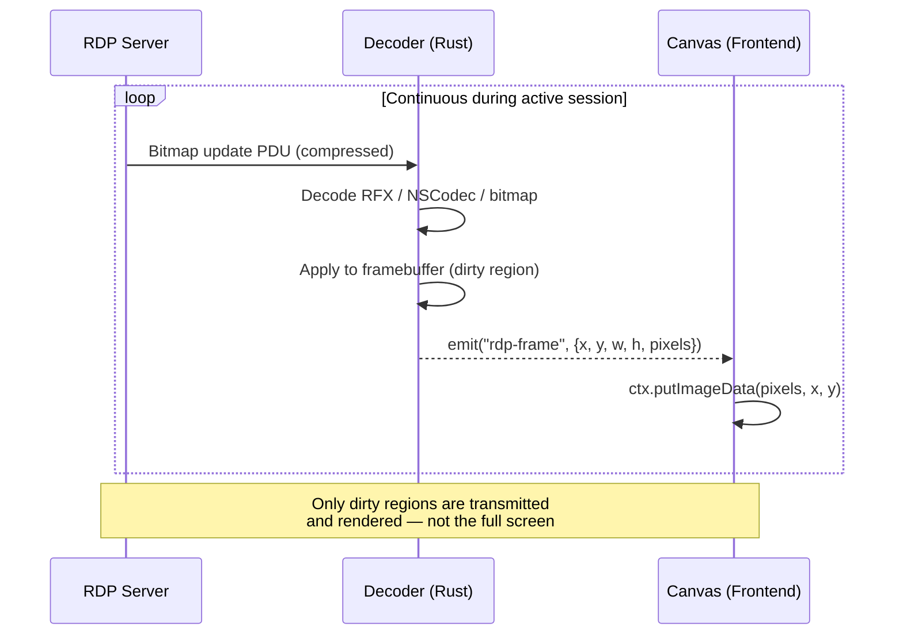

The backend maintains a full framebuffer in Rust memory. On each bitmap update, only the changed (dirty) region is decoded and sent to the frontend as raw RGBA pixel data. The frontend uses `CanvasRenderingContext2D.putImageData()` to update only the dirty rectangle, minimizing rendering overhead.

### Full Connection Sequence

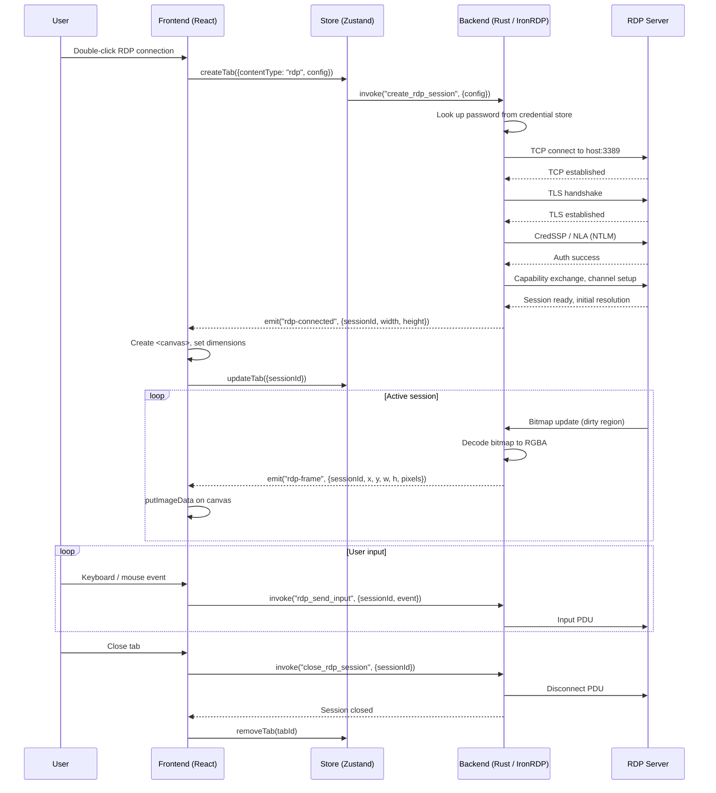

### Clipboard Sync State Machine

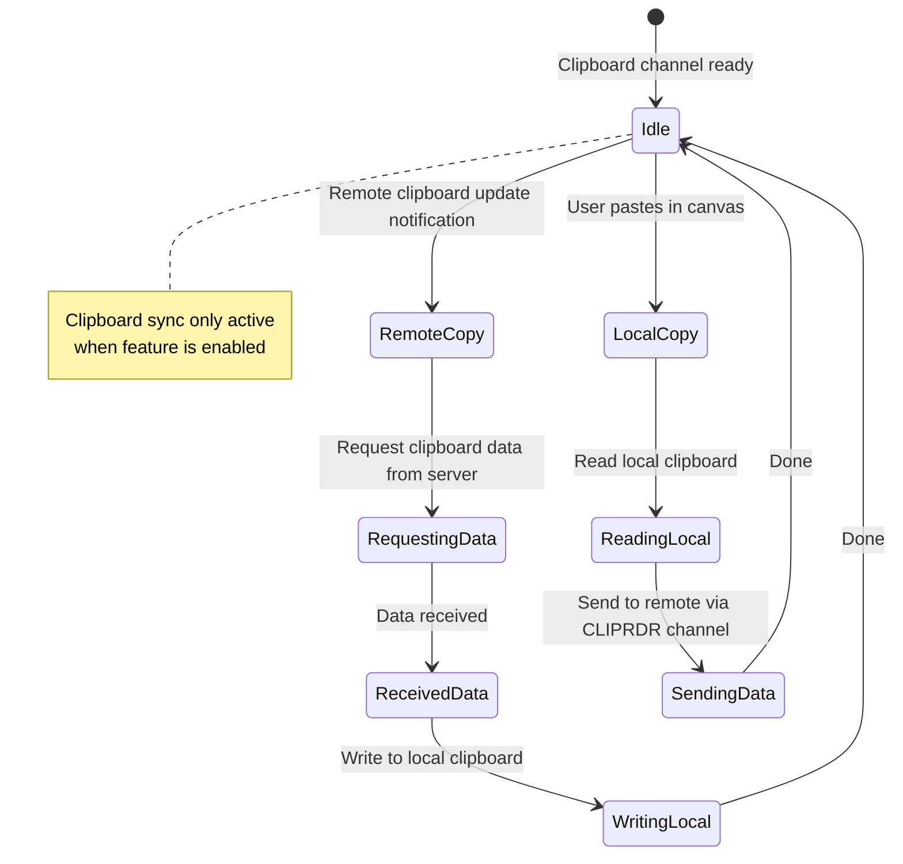

## Preliminary Implementation Details

> **Note**: These details reflect the codebase at the time of concept creation. The implementation may need to adapt if the codebase evolves before this feature is built.

### Crate Dependency: IronRDP

Add `ironrdp` to the workspace dependencies. IronRDP is modular — only include the needed sub-crates:

```toml
# src-tauri/Cargo.toml
[dependencies]
ironrdp-client = "0.x"       # High-level client API
ironrdp-graphics = "0.x"     # Bitmap decoding (RFX, NSCodec, planar)
ironrdp-input = "0.x"        # Keyboard/mouse input encoding
ironrdp-cliprdr = "0.x"      # Clipboard redirection channel
ironrdp-rdpdr = "0.x"        # Drive redirection channel (optional)
ironrdp-displaycontrol = "0.x" # Dynamic resolution (optional)
ironrdp-tls = "0.x"          # TLS transport
ironrdp-connector = "0.x"    # Connection/auth flow
```

### Backend: RDP Session Manager

Create `src-tauri/src/rdp/` as a new module:

```
src-tauri/src/rdp/
  mod.rs            # RdpManager — holds active sessions, frame buffers
  session.rs        # RdpSession — wraps IronRDP client, manages lifecycle
  input.rs          # Input event conversion (browser events → RDP scancodes)
  clipboard.rs      # Clipboard channel handling (CLIPRDR)
  config.rs         # RdpConfig struct and validation
```

#### RdpConfig (Rust)

```rust
/// RDP connection configuration.
#[derive(Debug, Clone, Serialize, Deserialize)]
#[serde(rename_all = "camelCase")]
pub struct RdpConfig {
    pub host: String,
    #[serde(default = "default_rdp_port")]
    pub port: u16,
    pub username: String,
    pub domain: Option<String>,
    #[serde(skip_serializing)]
    pub password: Option<String>,
    pub save_password: bool,

    // Display
    #[serde(default)]
    pub resolution: RdpResolution,
    #[serde(default = "default_color_depth")]
    pub color_depth: u8,  // 16, 24, or 32
    #[serde(default)]
    pub scale_mode: RdpScaleMode,

    // Features
    #[serde(default = "default_true")]
    pub clipboard_sync: bool,
    pub drive_redirection: Option<DriveRedirection>,
    #[serde(default)]
    pub audio_playback: bool,
    #[serde(default)]
    pub admin_session: bool,

    // Security
    #[serde(default)]
    pub security_mode: RdpSecurityMode,
    #[serde(default)]
    pub ignore_certificate_errors: bool,
}

#[derive(Debug, Clone, Serialize, Deserialize, Default)]
#[serde(rename_all = "camelCase")]
pub enum RdpResolution {
    #[default]
    MatchWindow,
    Fixed { width: u16, height: u16 },
}

#[derive(Debug, Clone, Serialize, Deserialize, Default)]
#[serde(rename_all = "camelCase")]
pub enum RdpScaleMode {
    #[default]
    FitToTab,
    OneToOne,
    MatchWindow,
}

#[derive(Debug, Clone, Serialize, Deserialize, Default)]
#[serde(rename_all = "camelCase")]
pub enum RdpSecurityMode {
    #[default]
    Auto,
    Nla,
    Tls,
    Rdp,
}

#[derive(Debug, Clone, Serialize, Deserialize)]
#[serde(rename_all = "camelCase")]
pub struct DriveRedirection {
    pub local_path: String,
    pub drive_name: Option<String>,  // default: "termiHub"
}

fn default_rdp_port() -> u16 { 3389 }
fn default_color_depth() -> u8 { 32 }
fn default_true() -> bool { true }
```

#### RdpManager

```rust
pub struct RdpManager {
    sessions: HashMap<String, RdpSession>,
    app_handle: AppHandle,
}

impl RdpManager {
    /// Create and connect a new RDP session. Returns the session ID.
    pub async fn create_session(&mut self, config: RdpConfig) -> anyhow::Result<String>;

    /// Send keyboard/mouse input to a session.
    pub async fn send_input(&self, session_id: &str, event: RdpInputEvent) -> anyhow::Result<()>;

    /// Send clipboard data to a session.
    pub async fn send_clipboard(&self, session_id: &str, data: ClipboardData) -> anyhow::Result<()>;

    /// Resize the session display.
    pub async fn resize(&self, session_id: &str, width: u16, height: u16) -> anyhow::Result<()>;

    /// Disconnect and clean up a session.
    pub async fn close_session(&mut self, session_id: &str) -> anyhow::Result<()>;
}
```

Each `RdpSession` runs its IronRDP client on a dedicated tokio task. Frame updates are emitted as Tauri events with the dirty region's pixel data.

#### Frame Data Transfer

The main performance challenge is transferring bitmap data from Rust to the frontend efficiently. Options:

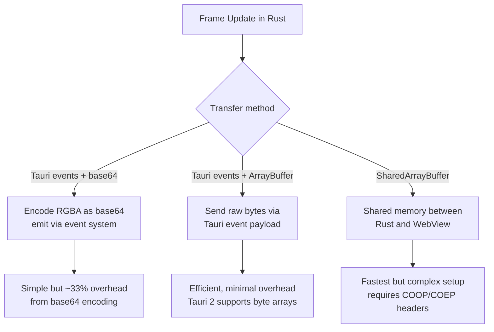

**Recommended**: Use Tauri 2's native byte array support in events. Dirty regions are typically small (a few KB to a few hundred KB), making per-event overhead acceptable. For full-screen updates, consider chunking into tiles.

### Tauri Commands (`src-tauri/src/commands/rdp.rs`)

```rust
#[tauri::command]
async fn create_rdp_session(
    config: RdpConfig,
    tab_width: u16,
    tab_height: u16,
    manager: State<'_, Mutex<RdpManager>>,
    credentials: State<'_, CredentialManager>,
) -> Result<RdpSessionInfo, TerminalError>;

#[tauri::command]
async fn rdp_send_input(
    session_id: String,
    event: RdpInputEvent,
    manager: State<'_, Mutex<RdpManager>>,
) -> Result<(), TerminalError>;

#[tauri::command]
async fn rdp_send_clipboard(
    session_id: String,
    data: ClipboardData,
    manager: State<'_, Mutex<RdpManager>>,
) -> Result<(), TerminalError>;

#[tauri::command]
async fn rdp_resize(
    session_id: String,
    width: u16,
    height: u16,
    manager: State<'_, Mutex<RdpManager>>,
) -> Result<(), TerminalError>;

#[tauri::command]
async fn close_rdp_session(
    session_id: String,
    manager: State<'_, Mutex<RdpManager>>,
) -> Result<(), TerminalError>;
```

### Tauri Events

| Event                              | Payload                         | Description                                   |
| ---------------------------------- | ------------------------------- | --------------------------------------------- |
| `rdp:{sessionId}:connected`        | `{width, height}`               | Session established, canvas should initialize |
| `rdp:{sessionId}:frame`            | `{x, y, w, h, pixels: Vec<u8>}` | Dirty region bitmap (RGBA)                    |
| `rdp:{sessionId}:disconnected`     | `{reason, recoverable}`         | Session ended or lost                         |
| `rdp:{sessionId}:clipboard`        | `{format, data}`                | Remote clipboard update                       |
| `rdp:{sessionId}:error`            | `{message}`                     | Non-fatal error notification                  |
| `rdp:{sessionId}:resize-confirmed` | `{width, height}`               | Server confirmed new resolution               |

### Frontend: TypeScript Types

Add to `src/types/terminal.ts`:

```typescript
export type TabContentType =
  | "terminal"
  | "settings"
  | "editor"
  | "connection-editor"
  | "log-viewer"
  | "tunnel-editor"
  | "workspace-editor"
  | "rdp"; // New

export interface RdpTabMeta {
  host: string;
  port: number;
  username: string;
  domain?: string;
  scaleMode: "fit" | "1:1" | "match";
}
```

Extend `TerminalTab`:

```typescript
export interface TerminalTab {
  // ... existing fields
  rdpMeta?: RdpTabMeta;
}
```

### Frontend: New Components

```
src/components/Rdp/
  RdpPanel.tsx          # Main RDP tab panel — canvas + toolbar + event handlers
  RdpToolbar.tsx        # Floating toolbar (host, resolution, Ctrl+Alt+Del, fullscreen)
  RdpCanvas.tsx         # Canvas element with input capture and frame rendering
  useRdpSession.ts      # Hook: manages session lifecycle, event listeners, input forwarding
```

#### RdpCanvas Component (Sketch)

```typescript
interface RdpCanvasProps {
  sessionId: string;
  width: number;
  height: number;
  scaleMode: "fit" | "1:1" | "match";
  onDisconnected: (reason: string) => void;
}

export function RdpCanvas({ sessionId, width, height, scaleMode, onDisconnected }: RdpCanvasProps) {
  const canvasRef = useRef<HTMLCanvasElement>(null);

  // Listen for frame events, render dirty regions
  useEffect(() => {
    const unlisten = listen<FrameEvent>(`rdp:${sessionId}:frame`, (event) => {
      const ctx = canvasRef.current?.getContext("2d");
      if (!ctx) return;
      const { x, y, w, h, pixels } = event.payload;
      const imageData = new ImageData(new Uint8ClampedArray(pixels), w, h);
      ctx.putImageData(imageData, x, y);
    });
    return () => { unlisten.then(fn => fn()); };
  }, [sessionId]);

  // Capture and forward keyboard/mouse events
  // ...

  return <canvas ref={canvasRef} width={width} height={height} tabIndex={0} />;
}
```

#### useRdpSession Hook

```typescript
function useRdpSession(config: ConnectionConfig) {
  const [state, setState] = useState<"connecting" | "connected" | "disconnected" | "error">(
    "connecting"
  );
  const [sessionId, setSessionId] = useState<string | null>(null);
  const [resolution, setResolution] = useState({ width: 0, height: 0 });

  // Connect, listen for events, handle lifecycle
  // Returns: { state, sessionId, resolution, sendInput, resize, disconnect }
}
```

### API Layer (`src/services/api.ts`)

```typescript
export async function createRdpSession(
  config: Record<string, unknown>,
  tabWidth: number,
  tabHeight: number
): Promise<{ sessionId: string; width: number; height: number }> {
  return invoke("create_rdp_session", { config, tabWidth, tabHeight });
}

export async function rdpSendInput(sessionId: string, event: RdpInputEvent): Promise<void> {
  return invoke("rdp_send_input", { sessionId, event });
}

export async function rdpResize(sessionId: string, width: number, height: number): Promise<void> {
  return invoke("rdp_resize", { sessionId, width, height });
}

export async function closeRdpSession(sessionId: string): Promise<void> {
  return invoke("close_rdp_session", { sessionId });
}
```

### Store Extensions (`src/store/appStore.ts`)

Add `openRdpTab(config)` action following the existing `openSettingsTab` / `createTab` patterns. The action creates a tab with `contentType: "rdp"` and `rdpMeta` populated from the connection config.

### Connection Type Registration

Register `"rdp"` in the `ConnectionTypeRegistry` with:

- **type_id**: `"rdp"`
- **display_name**: `"RDP (Remote Desktop)"`
- **icon**: `"monitor"` (or custom RDP icon)
- **capabilities**: `{ resize: true, clipboard: true }` (no monitoring, no file_browser)
- **settings_schema**: JSON schema for the connection editor form (host, port, username, domain, resolution, color depth, features, security)

Since RDP is not a terminal connection, the `ConnectionType` trait does not fit directly (it's designed for byte-stream I/O via `write()` and `subscribe_output()`). Instead, the RDP backend registers as a separate manager (`RdpManager`) alongside the `SessionManager`, with its own set of Tauri commands. The connection editor and sidebar still use the `ConnectionTypeRegistry` for discovery and schema, but session lifecycle is handled through the RDP-specific commands.

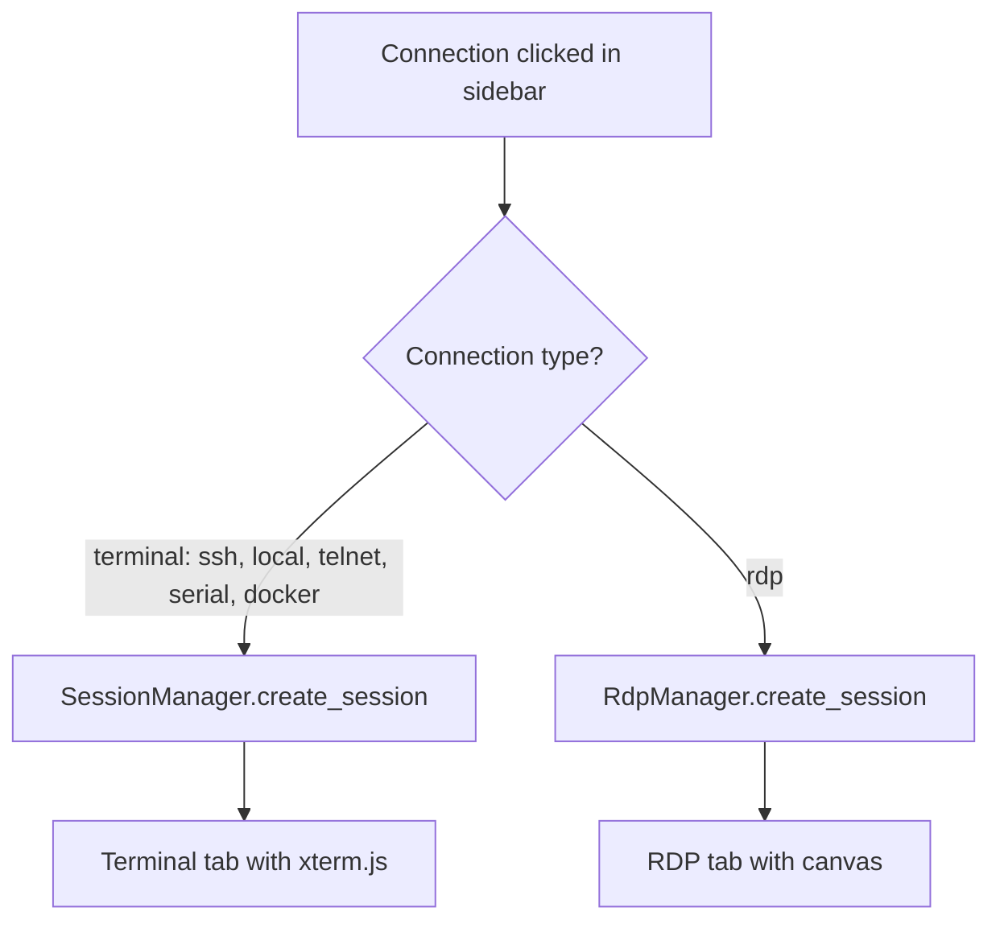

### Files to Create or Modify

| File                                     | Change                                                    |
| ---------------------------------------- | --------------------------------------------------------- |
| `src-tauri/src/rdp/mod.rs`               | **New** — RdpManager, session lifecycle                   |
| `src-tauri/src/rdp/session.rs`           | **New** — RdpSession wrapping IronRDP client              |
| `src-tauri/src/rdp/input.rs`             | **New** — Browser input → RDP scancode conversion         |
| `src-tauri/src/rdp/clipboard.rs`         | **New** — CLIPRDR channel handling                        |
| `src-tauri/src/rdp/config.rs`            | **New** — RdpConfig, validation                           |
| `src-tauri/src/commands/rdp.rs`          | **New** — Tauri RDP commands                              |
| `src-tauri/src/lib.rs`                   | Register RdpManager as managed state, register commands   |
| `src-tauri/Cargo.toml`                   | Add ironrdp dependencies                                  |
| `src/components/Rdp/RdpPanel.tsx`        | **New** — Main RDP tab component                          |
| `src/components/Rdp/RdpToolbar.tsx`      | **New** — Floating toolbar                                |
| `src/components/Rdp/RdpCanvas.tsx`       | **New** — Canvas rendering + input                        |
| `src/hooks/useRdpSession.ts`             | **New** — RDP session lifecycle hook                      |
| `src/types/terminal.ts`                  | Add `"rdp"` to `TabContentType`, add `RdpTabMeta`         |
| `src/services/api.ts`                    | Add RDP command wrappers                                  |
| `src/store/appStore.ts`                  | Add `openRdpTab` action                                   |
| `src/components/SplitView/SplitView.tsx` | Add rendering branch for `contentType === "rdp"`          |
| `src/components/StatusBar/StatusBar.tsx` | Add RDP-specific status display (resolution, color depth) |

### Implementation Phases

```mermaid
gantt
    title RDP Sessions Implementation Phases
    dateFormat X
    axisFormat %s

    section Phase 1 — Core Connection
    RdpConfig + connection editor schema        :a1, 0, 2
    IronRDP integration + basic connect/auth    :a2, 2, 4
    Frame rendering pipeline (Rust → canvas)    :a3, 4, 3
    Keyboard + mouse input forwarding           :a4, 5, 3

    section Phase 2 — UI Integration
    RDP tab + panel components                  :b1, 8, 3
    Toolbar (Ctrl+Alt+Del, fullscreen, scale)   :b2, 9, 2
    Tab bar + split view integration            :b3, 10, 2
    Status bar RDP indicators                   :b4, 11, 1

    section Phase 3 — Features
    Clipboard sync (CLIPRDR)                    :c1, 12, 3
    Dynamic resize (Display Control Channel)    :c2, 12, 2
    Scale modes (fit, 1:1, match)               :c3, 14, 2
    Credential store integration                :c4, 14, 1

    section Phase 4 — Advanced (Stretch)
    Drive redirection (RDPDR)                   :d1, 16, 3
    Audio playback redirection                  :d2, 16, 3
    Session reconnection                        :d3, 19, 2
    Certificate management (trust store)        :d4, 19, 2
```

### Security Considerations

- **Credential handling**: RDP passwords flow through the existing credential store — never stored in plaintext in connection configs. The `password` field in `RdpConfig` is `skip_serializing`.
- **Certificate validation**: By default, validate server certificates. The "ignore certificate errors" option is off by default and shown with a warning in the connection editor.
- **NLA enforcement**: Default to NLA (CredSSP) which authenticates before the RDP session starts, preventing unauthorized resource consumption on the server.
- **Input sanitization**: All user-provided config values (host, username, domain, paths) are validated before use. Drive redirection paths are restricted to prevent path traversal.
- **No legacy encryption by default**: RDP-level encryption (no TLS) is available for compatibility but disabled by default and shown with a security warning.
