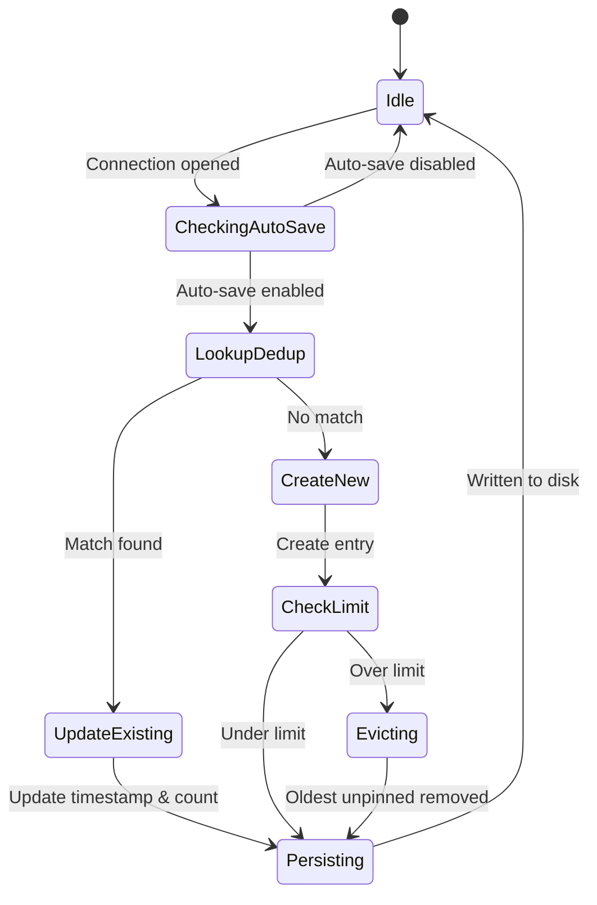
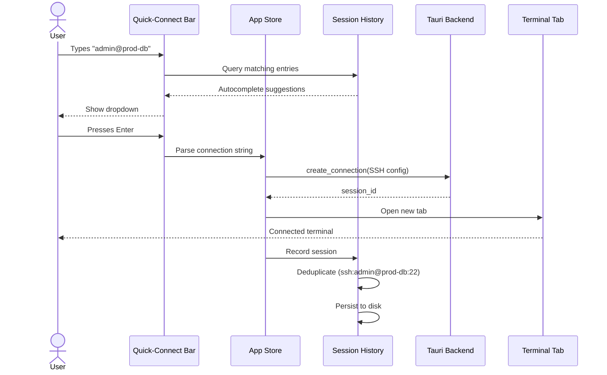
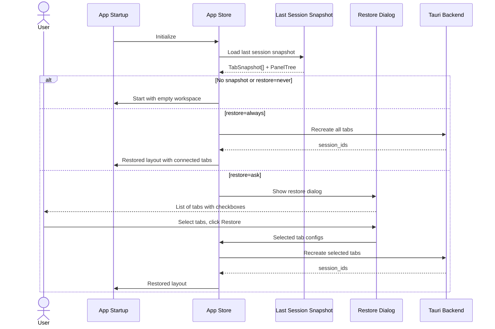
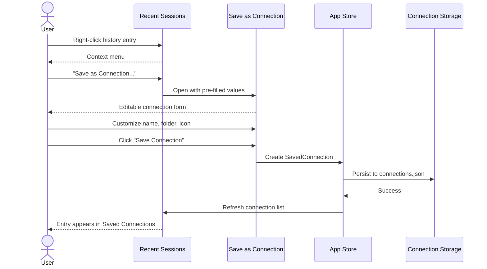
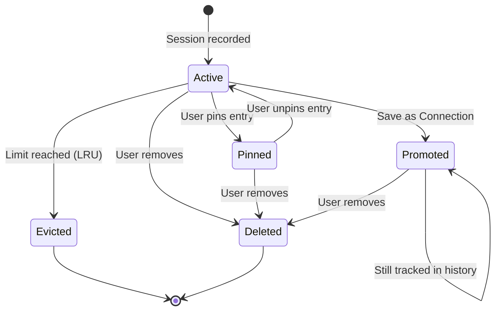
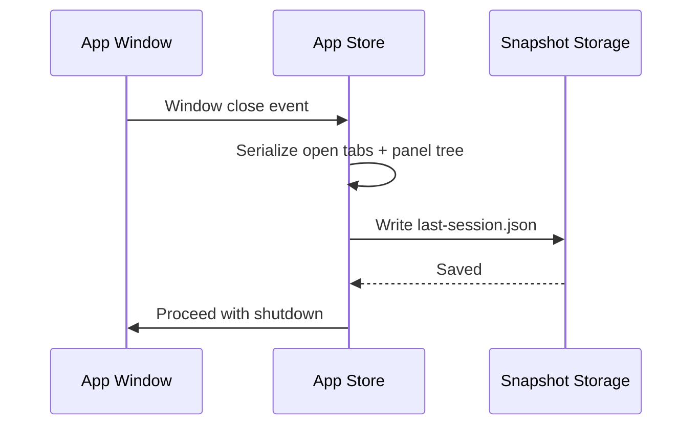
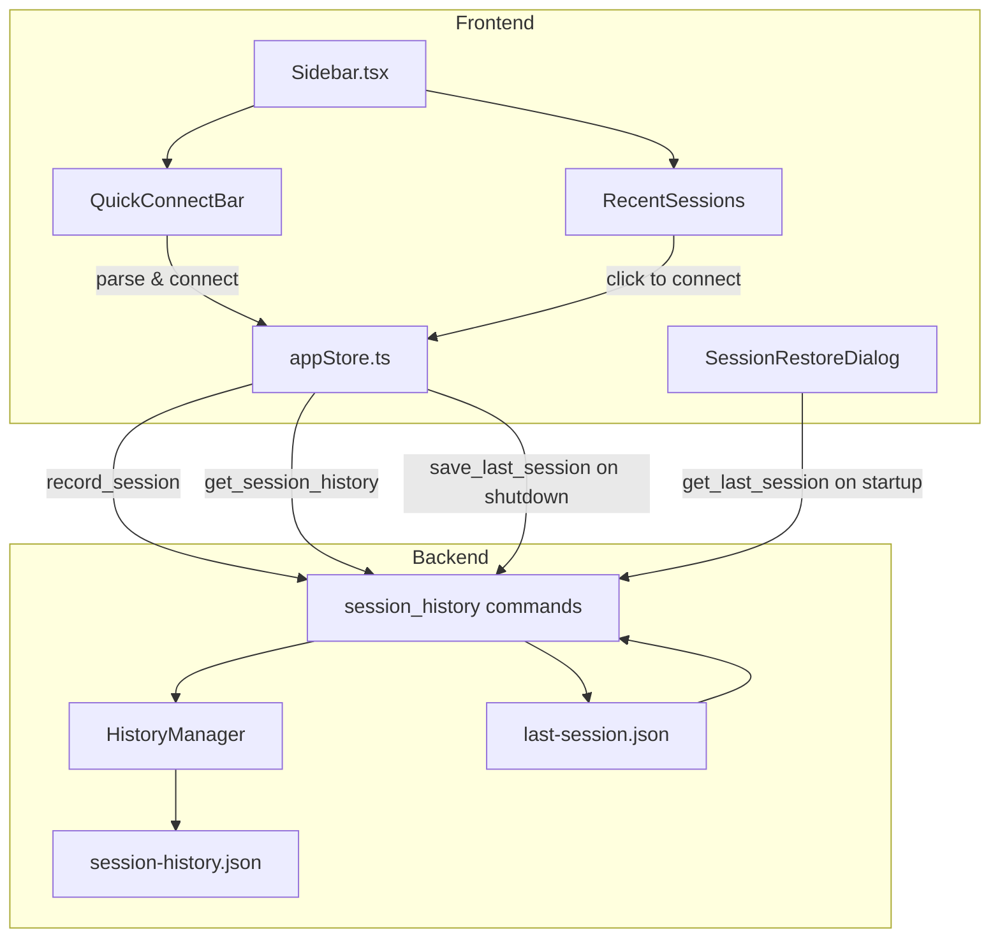

# Session Auto-Save and Session History

> GitHub Issue: [#527](https://github.com/armaxri/termiHub/issues/527)

## Overview

Automatically save every terminal session that is started, building a browsable session history that users can quickly reconnect from. Sessions are recorded without requiring explicit connection creation — SSH into a server once and it is remembered for next time.

### Motivation

termiHub currently requires users to explicitly create a connection configuration before connecting. This adds friction for ad-hoc sessions — a user who SSHs into a new server via a quick-connect bar must later manually create a saved connection to reconnect. MobaXterm solves this by automatically recording every session opened, displaying them in a sidebar section for one-click reconnection.

### Goals

- **Zero-friction history**: every session opened (quick-connect, command-line, connection editor) is automatically recorded
- **Quick reconnect**: one-click reconnection from the history list
- **Deduplication**: identical connection parameters produce a single history entry (updated timestamp)
- **Promotion**: history entries can be promoted to full saved connections with custom name, folder, and icon
- **Privacy-first**: passwords never stored in history; auto-save can be disabled; history can be cleared
- **Quick-connect integration**: a fast `user@host` entry bar for immediate SSH connections

### Non-Goals

- Full session recording / terminal replay (scrollback capture)
- Workspace / layout restoration (covered by [Prepared Connection Setup #503](https://github.com/armaxri/termiHub/issues/503))
- Credential management changes (existing credential store is unchanged)

---

## UI Interface

### Quick-Connect Bar

A compact input bar at the top of the sidebar's connection list, always visible when the Connections activity is active:

```
┌─────────────────────────────────────┐
│ CONNECTIONS                         │
│ ┌─────────────────────────────┬───┐ │
│ │ user@host[:port]            │ ⏎ │ │
│ └─────────────────────────────┴───┘ │
│                                     │
│ ▾ RECENT SESSIONS                   │
│   ┌─────────────────────────────┐   │
│   │ 🖥 admin@prod-db (SSH)      │   │
│   │   3 hours ago               │   │
│   ├─────────────────────────────┤   │
│   │ 🖥 dev@staging (SSH)        │   │
│   │   Yesterday                 │   │
│   ├─────────────────────────────┤   │
│   │ 📟 /dev/ttyUSB0 (Serial)   │   │
│   │   2 days ago                │   │
│   ├─────────────────────────────┤   │
│   │ 🐳 nginx-proxy (Docker)    │   │
│   │   Last week                 │   │
│   └─────────────────────────────┘   │
│   🔍 Search history...             │
│                                     │
│ ▾ SAVED CONNECTIONS                 │
│   ▶ Work                            │
│   ▶ Home Lab                        │
│     Local Shell                     │
└─────────────────────────────────────┘
```

**Quick-Connect input behavior:**

- Accepts `user@host`, `user@host:port`, or just `host` (uses default user from settings)
- Pressing Enter immediately opens an SSH connection in a new tab
- Autocomplete dropdown from session history as the user types
- Tab-completion for usernames and hostnames from history

**Autocomplete dropdown:**

```
┌─────────────────────────────────────┐
│ admin@prod-db                       │
│ ┌─────────────────────────────────┐ │
│ │ admin@prod-db:22        3h ago  │ │
│ │ admin@prod-db:2222    2 days    │ │
│ │ admin@prod-api:22     1 week    │ │
│ └─────────────────────────────────┘ │
└─────────────────────────────────────┘
```

### Recent Sessions Section

A collapsible section in the sidebar, displayed **above** the existing "Saved Connections" tree. Each entry shows:

| Element           | Description                                                            |
| ----------------- | ---------------------------------------------------------------------- |
| **Icon**          | Connection type icon (terminal, SSH, serial, Docker, telnet)           |
| **Title**         | `user@host` for SSH, device path for serial, container name for Docker |
| **Type badge**    | Small label: SSH, Serial, Docker, Telnet, Local                        |
| **Relative time** | "3 hours ago", "Yesterday", "Last week"                                |
| **Pin indicator** | Pin icon if the entry is pinned                                        |

**Single-click**: opens a new tab and connects with the saved parameters.

**Right-click context menu:**

```
┌──────────────────────────┐
│ Connect                  │
│ Connect in New Panel     │
│ ─────────────────────── │
│ Pin to Top               │
│ Save as Connection...    │
│ ─────────────────────── │
│ Copy Connection String   │
│ Remove from History      │
└──────────────────────────┘
```

### "Save as Connection" Dialog

When promoting a history entry, a dialog pre-fills fields from the history record:

```
┌──────────────────────────────────────────┐
│ Save as Connection                       │
│                                          │
│ Name:     [prod-db                    ]  │
│ Folder:   [Work ▾                     ]  │
│ Icon:     [🖥 ▾                       ]  │
│                                          │
│ Connection details (pre-filled, editable)│
│ ┌──────────────────────────────────────┐ │
│ │ Host:     prod-db.example.com       │ │
│ │ Port:     22                         │ │
│ │ Username: admin                      │ │
│ │ Auth:     Password                   │ │
│ └──────────────────────────────────────┘ │
│                                          │
│ ☐ Save password to credential store      │
│                                          │
│         [Cancel]  [Save Connection]      │
└──────────────────────────────────────────┘
```

### Settings Integration

New settings in the General section of the Settings panel:

```
┌──────────────────────────────────────────────┐
│ SESSION HISTORY                               │
│                                               │
│ Auto-save sessions        [●] Enabled         │
│ History limit              [50        ] items  │
│ Show recent sessions       [●] Enabled         │
│                                               │
│ [Clear All History]                            │
│                                               │
│ SESSION RESTORE                               │
│                                               │
│ Restore tabs on startup   ( ) Never            │
│                            (●) Ask each time   │
│                            ( ) Always           │
└──────────────────────────────────────────────┘
```

### Session Restore on Startup

When "Ask each time" is selected and tabs were open at last shutdown:

```
┌──────────────────────────────────────────────┐
│ Restore Previous Session?                     │
│                                               │
│ You had 4 tabs open when termiHub last closed:│
│                                               │
│  ☑ admin@prod-db (SSH)                        │
│  ☑ dev@staging (SSH)                          │
│  ☑ Local Shell                                │
│  ☐ /dev/ttyUSB0 (Serial)  ⚠ device offline   │
│                                               │
│          [Start Fresh]  [Restore Selected]    │
└──────────────────────────────────────────────┘
```

Users can uncheck individual tabs before restoring. Tabs whose connection target is unavailable (device disconnected, host unreachable) show a warning icon.

---

## General Handling

### Session Recording Workflow

1. **User opens a connection** — via quick-connect bar, saved connection click, or "New Terminal" action
2. **Session starts** — backend creates the session, terminal tab opens
3. **History record created/updated** — the connection parameters are matched against existing history entries
   - If a match exists (same deduplication key), update `lastUsed` timestamp and increment `useCount`
   - If no match, create a new history entry
4. **History persisted** — written to `session-history.json` in the config directory

### Deduplication Strategy

History entries are deduplicated by a **composite key** derived from connection parameters:

| Connection Type | Deduplication Key               |
| --------------- | ------------------------------- |
| SSH             | `ssh:{user}@{host}:{port}`      |
| Telnet          | `telnet:{host}:{port}`          |
| Serial          | `serial:{device}:{baudRate}`    |
| Docker          | `docker:{container}:{agentId}`  |
| Local Shell     | `local:{shellType}:{shellPath}` |
| WSL             | `wsl:{distribution}`            |

When a user connects with parameters that match an existing key, the existing entry is updated rather than creating a duplicate.

### History Retention

- **Default limit**: 50 entries (configurable in settings, range 10–500)
- **Pinned entries**: exempt from automatic eviction
- **Eviction policy**: when the limit is reached, the oldest unpinned entry is removed (LRU)
- **Manual removal**: users can delete individual entries or clear all history

### Quick-Connect Parsing

The quick-connect input bar parses connection strings with the following grammar:

```
input       = [user "@"] host [":" port]
user        = <any non-@ characters>
host        = <hostname or IP address>
port        = <1-65535>
```

- If `user` is omitted, the `defaultUser` from app settings is used (or system username as fallback)
- If `port` is omitted, port 22 is assumed
- Authentication follows the default SSH auth flow: try key-based auth first, then prompt for password

### Promotion to Saved Connection

When a history entry is promoted via "Save as Connection":

1. A pre-filled Connection Editor opens with values from the history entry
2. User can customize name, folder, icon, and all connection parameters
3. On save, a new `SavedConnection` is created in the normal connection store
4. The history entry is **retained** (not deleted) — it continues to track usage independently
5. The sidebar shows the saved connection in the Saved Connections tree; the history entry remains in Recent Sessions but displays a small "saved" indicator

### Session Restore

Session restore captures the **tab layout at shutdown** and offers to recreate it at next startup:

- **What is saved**: each open tab's connection config, panel tree structure (splits), and active tab per panel
- **What is NOT saved**: terminal scrollback content, shell state, environment variables, running processes
- **Restore behavior**: tabs are reopened and connections re-established; users see a fresh terminal for each restored tab
- **Partial restore**: users can select which tabs to restore; unavailable connections are flagged
- **Timing**: the last-session snapshot is saved on graceful shutdown (window close) and overwritten each time

### Privacy & Security

- **Passwords**: never stored in session history. Authentication credentials live exclusively in the credential store (if the user opted in). History entries store only connection metadata (host, port, user, auth method — not the actual password or key contents).
- **Disable auto-save**: a toggle in settings disables all automatic session recording
- **Clear history**: a single button clears all history entries; individual entries can also be removed
- **External file exclusion**: session history is never included in connection export/import operations (it's a separate file)

---

## States & Sequences

### Session Recording State Machine



### Quick-Connect Sequence



### Session Restore Sequence



### Promotion to Saved Connection



### History Entry Lifecycle



### App Shutdown — Snapshot Capture



---

## Preliminary Implementation Details

> Based on the current project architecture as of the time of concept creation. The codebase may evolve between concept creation and implementation.

### New Data Structures

#### Rust (Backend)

```rust
// src-tauri/src/session/history.rs (new file)

/// A single session history entry
pub struct SessionHistoryEntry {
    /// Deduplication key (e.g., "ssh:admin@prod-db:22")
    pub dedup_key: String,
    /// Human-readable display title
    pub title: String,
    /// Connection type identifier
    pub connection_type: String,
    /// Connection configuration (same shape as ConnectionConfig)
    pub config: ConnectionConfig,
    /// When this session was first recorded
    pub first_used: u64,   // Unix timestamp ms
    /// When this session was last used
    pub last_used: u64,    // Unix timestamp ms
    /// Total number of times connected
    pub use_count: u32,
    /// Whether the entry is pinned (exempt from eviction)
    pub pinned: bool,
    /// Whether the entry has been promoted to a saved connection
    pub promoted: bool,
}

/// Persisted session history store
pub struct SessionHistoryStore {
    pub version: String,  // "1"
    pub entries: Vec<SessionHistoryEntry>,
}
```

#### Rust (Backend) — Last Session Snapshot

```rust
// src-tauri/src/session/snapshot.rs (new file)

/// A tab snapshot for session restore
pub struct TabSnapshot {
    pub title: String,
    pub connection_type: String,
    pub config: ConnectionConfig,
    pub terminal_options: Option<TerminalOptions>,
}

/// Panel tree snapshot (mirrors frontend PanelNode)
pub enum PanelSnapshot {
    Leaf {
        id: String,
        tabs: Vec<TabSnapshot>,
        active_tab_index: Option<usize>,
    },
    Split {
        id: String,
        direction: String,  // "horizontal" | "vertical"
        children: Vec<PanelSnapshot>,
    },
}

/// The complete last-session snapshot
pub struct LastSessionSnapshot {
    pub version: String,  // "1"
    pub timestamp: u64,
    pub root_panel: PanelSnapshot,
}
```

#### TypeScript (Frontend)

```typescript
// src/types/sessionHistory.ts (new file)

export interface SessionHistoryEntry {
  dedupKey: string;
  title: string;
  connectionType: string;
  config: ConnectionConfig;
  firstUsed: number;
  lastUsed: number;
  useCount: number;
  pinned: boolean;
  promoted: boolean;
}

export interface LastSessionSnapshot {
  version: string;
  timestamp: number;
  rootPanel: PanelSnapshotNode;
}

export type PanelSnapshotNode = LeafSnapshot | SplitSnapshot;

export interface LeafSnapshot {
  type: "leaf";
  id: string;
  tabs: TabSnapshot[];
  activeTabIndex: number | null;
}

export interface SplitSnapshot {
  type: "split";
  id: string;
  direction: "horizontal" | "vertical";
  children: PanelSnapshotNode[];
}

export interface TabSnapshot {
  title: string;
  connectionType: string;
  config: ConnectionConfig;
  terminalOptions?: TerminalOptions;
}
```

### Storage Files

Two new JSON files in the app config directory (alongside `connections.json` and `settings.json`):

| File                   | Content                             | Updated                              |
| ---------------------- | ----------------------------------- | ------------------------------------ |
| `session-history.json` | `SessionHistoryStore` (entry array) | On every session open (deduplicated) |
| `last-session.json`    | `LastSessionSnapshot` (tab layout)  | On graceful app shutdown             |

Both files use the same recovery pattern as `connections.json` (backup `.bak` file, per-entry recovery on corruption).

### New Tauri IPC Commands

```rust
// src-tauri/src/commands/session_history.rs (new file)

#[tauri::command]
pub fn get_session_history() -> Result<Vec<SessionHistoryEntry>, String>;

#[tauri::command]
pub fn record_session(config: ConnectionConfig, connection_type: String)
    -> Result<SessionHistoryEntry, String>;

#[tauri::command]
pub fn pin_history_entry(dedup_key: String, pinned: bool)
    -> Result<(), String>;

#[tauri::command]
pub fn remove_history_entry(dedup_key: String)
    -> Result<(), String>;

#[tauri::command]
pub fn clear_session_history() -> Result<(), String>;

#[tauri::command]
pub fn save_last_session(snapshot: LastSessionSnapshot)
    -> Result<(), String>;

#[tauri::command]
pub fn get_last_session() -> Result<Option<LastSessionSnapshot>, String>;
```

### Settings Extension

Add to the existing `AppSettings` struct:

```rust
// In src-tauri/src/connection/settings.rs
pub struct AppSettings {
    // ... existing fields ...
    pub session_history_enabled: Option<bool>,       // default: true
    pub session_history_limit: Option<u32>,           // default: 50
    pub show_recent_sessions: Option<bool>,           // default: true
    pub session_restore_mode: Option<String>,         // "never" | "ask" | "always", default: "ask"
}
```

Mirror in TypeScript `AppSettings` type in `src/types/connection.ts`.

### Frontend Store Changes

Extend the Zustand store (`src/store/appStore.ts`):

```typescript
interface AppState {
  // ... existing fields ...

  // Session history
  sessionHistory: SessionHistoryEntry[];
  loadSessionHistory: () => Promise<void>;
  recordSession: (config: ConnectionConfig, type: string) => Promise<void>;
  pinHistoryEntry: (dedupKey: string, pinned: boolean) => Promise<void>;
  removeHistoryEntry: (dedupKey: string) => Promise<void>;
  clearSessionHistory: () => Promise<void>;

  // Session restore
  lastSessionSnapshot: LastSessionSnapshot | null;
  loadLastSession: () => Promise<void>;
  saveLastSession: () => Promise<void>;
}
```

### New UI Components

| Component                | Location                                             | Purpose                                             |
| ------------------------ | ---------------------------------------------------- | --------------------------------------------------- |
| `QuickConnectBar`        | `src/components/Sidebar/QuickConnectBar.tsx`         | Input bar with autocomplete for `user@host` entries |
| `RecentSessions`         | `src/components/Sidebar/RecentSessions.tsx`          | Collapsible list of session history entries         |
| `RecentSessionItem`      | `src/components/Sidebar/RecentSessionItem.tsx`       | Individual history entry with context menu          |
| `SaveAsConnectionDialog` | `src/components/Sidebar/SaveAsConnectionDialog.tsx`  | Promotion dialog pre-filled from history            |
| `SessionRestoreDialog`   | `src/components/SessionRestoreDialog.tsx`            | Startup dialog for tab restore                      |
| `SessionHistorySettings` | `src/components/Settings/SessionHistorySettings.tsx` | Settings section for history config                 |

### Integration Points



### Session Recording Integration

The session recording hook should be called from the existing `addTab` flow in `appStore.ts`. When a new terminal tab is created with a real connection (not settings/editor tabs), call `recordSession` with the connection config. This keeps recording logic centralized and ensures all connection sources (quick-connect, saved connection click, connection editor) are captured.

### Deduplication Key Generation

Implement a `computeDedupKey` function in both Rust and TypeScript that deterministically generates a key from connection config:

```typescript
function computeDedupKey(type: string, config: Record<string, unknown>): string {
  switch (type) {
    case "ssh":
      return `ssh:${config.username}@${config.host}:${config.port ?? 22}`;
    case "telnet":
      return `telnet:${config.host}:${config.port ?? 23}`;
    case "serial":
      return `serial:${config.device}:${config.baudRate}`;
    case "docker":
      return `docker:${config.container}:${config.agentId ?? "local"}`;
    case "local":
      return `local:${config.shellType ?? "default"}:${config.shellPath ?? ""}`;
    case "wsl":
      return `wsl:${config.distribution ?? "default"}`;
    default:
      return `${type}:${JSON.stringify(config)}`;
  }
}
```

### Shutdown Hook

Use Tauri's `on_window_event` with `WindowEvent::CloseRequested` to trigger session snapshot saving. The frontend listens for a `before-close` event, serializes the current panel tree and open tabs, and sends the snapshot to the backend for persistence before allowing the window to close.
