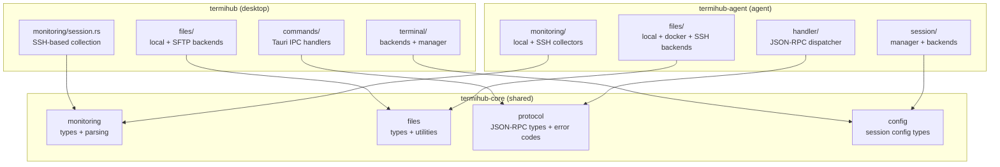
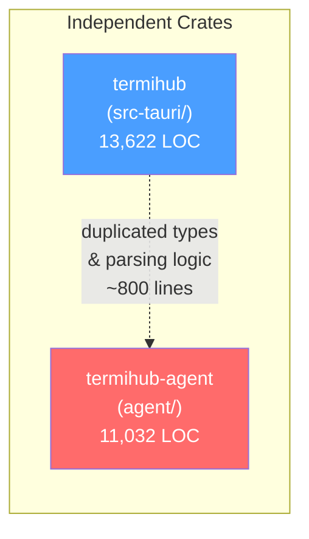
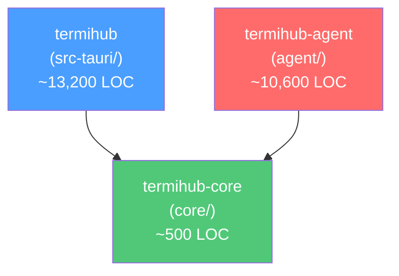
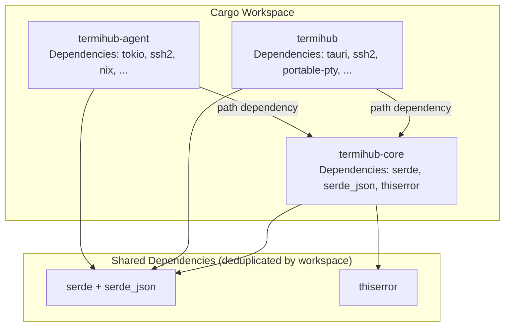
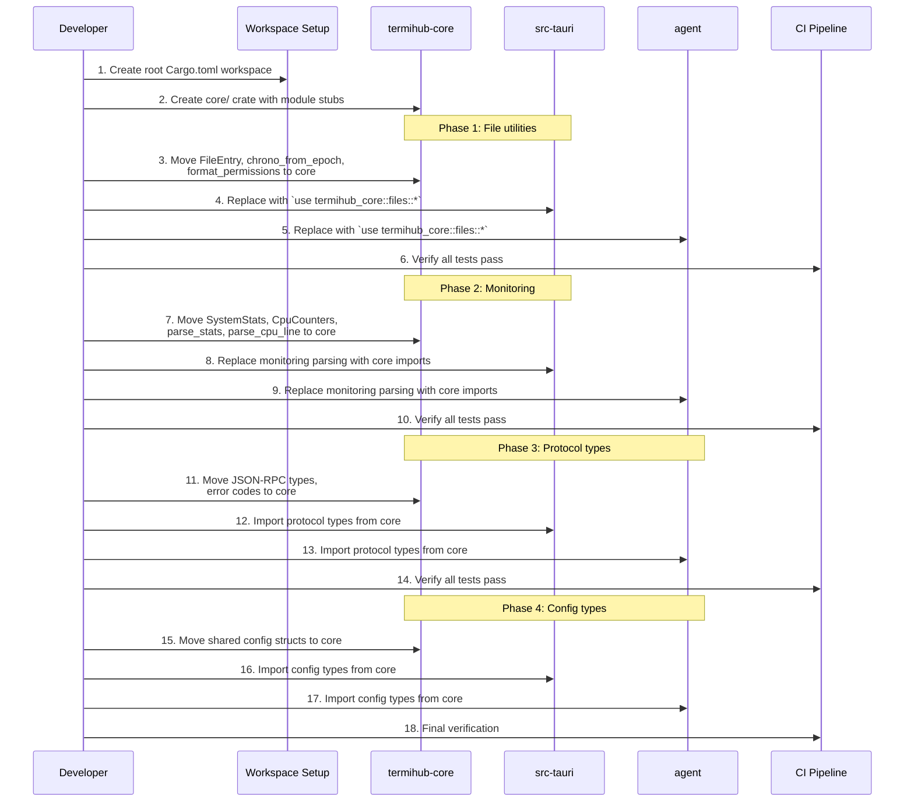
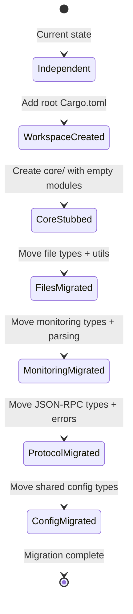

# Concept: Shared Rust Core Library

**GitHub Issue:** [#277](https://github.com/armaxri/termiHub/issues/277)

---

## Overview

termiHub currently maintains two independent Rust crates:

- **`src-tauri/`** (package `termihub`, 13,622 LOC) — the Tauri desktop backend
- **`agent/`** (package `termihub-agent`, 11,032 LOC) — the remote agent

Both crates evolved in parallel, leading to significant code duplication. The agent's monitoring parser even documents this explicitly: *"Ported from `src-tauri/src/monitoring/session.rs`"*. This concept evaluates whether extracting shared code into a common workspace crate (`termihub-core`) would simplify the project.

### Motivation

1. **Duplicated logic** — monitoring parsing, file utilities, and type definitions are copied between crates
2. **Divergence risk** — bug fixes in one crate may not reach the other (the copies are already subtly different in error handling)
3. **Protocol alignment** — desktop and agent must agree on JSON-RPC types; sharing ensures they stay in sync
4. **Maintenance burden** — duplicated tests need updating in two places

### Current Duplication Summary

| Category | Desktop File | Agent File | Duplicated Lines |
|----------|-------------|-----------|-----------------|
| Monitoring parsing | `monitoring/session.rs` | `monitoring/parser.rs` | ~220 (functions + types) |
| CPU counters & delta | `monitoring/session.rs` | `monitoring/parser.rs` | ~60 |
| File utilities | `files/utils.rs` | `files/mod.rs` | ~60 |
| `FileEntry` type | `files/mod.rs` | `protocol/methods.rs` | ~10 |
| `SystemStats` type | `monitoring/session.rs` | `monitoring/parser.rs` | ~15 |
| Session config types | `terminal/backend.rs` | `protocol/methods.rs` | ~100 |
| JSON-RPC error codes | *(not extracted)* | `protocol/errors.rs` | ~60 (agent-only, desktop could reuse) |
| JSON-RPC messages | `terminal/jsonrpc.rs` | `protocol/messages.rs` | ~80 (conceptually similar) |
| Duplicated tests | across above files | across above files | ~200+ |
| **Total** | | | **~800+ lines** |

---

## UI Interface

This is an internal infrastructure change with no user-facing UI impact. The "interface" is the **developer experience** — how contributors interact with the workspace.

### Developer Workflow Changes

**Before (current):**

```
# Build desktop
cd src-tauri && cargo build

# Build agent
cd agent && cargo build

# Run all tests (two separate invocations)
cd src-tauri && cargo test
cd agent && cargo test
```

**After (proposed workspace):**

```
# Build everything from repo root
cargo build --workspace

# Test everything from repo root
cargo test --workspace

# Build only desktop
cargo build -p termihub

# Build only agent
cargo build -p termihub-agent

# Build only shared core
cargo build -p termihub-core
```

### Import Pattern (Developer Perspective)

In `src-tauri/`:
```rust
use termihub_core::monitoring::{SystemStats, CpuCounters, parse_stats};
use termihub_core::files::{FileEntry, chrono_from_epoch, format_permissions};
use termihub_core::protocol::{JsonRpcErrorCode, JsonRpcRequest, JsonRpcNotification};
```

In `agent/`:
```rust
use termihub_core::monitoring::{SystemStats, CpuCounters, parse_stats};
use termihub_core::files::{FileEntry, chrono_from_epoch, format_permissions};
use termihub_core::protocol::{JsonRpcErrorCode, JsonRpcRequest, JsonRpcNotification};
```

### Script Impact

The existing `scripts/` would need minor updates:
- `test.sh` could use `cargo test --workspace` instead of running three separate commands
- `check.sh` could use `cargo clippy --workspace` and `cargo fmt --all`
- `build.sh` and `dev.sh` unchanged (they target specific packages)

---

## General Handling

### What Goes in the Shared Core

The shared crate should contain **pure logic and types** with no framework dependencies (no Tauri, no tokio required). This keeps it lightweight and reusable.



#### Modules in `termihub-core`

**1. `monitoring`** — System stats types and Linux `/proc` parsing

| Item | Currently In | Lines |
|------|-------------|-------|
| `SystemStats` struct | both crates | 15 |
| `CpuCounters` struct + impl | both crates | 30 |
| `cpu_percent_from_delta()` | both crates | 10 |
| `parse_cpu_line()` | both crates | 15 |
| `parse_stats()` | both crates | 70 |
| `parse_meminfo_value()` | both crates | 5 |
| `parse_df_output()` | both crates | 15 |
| Tests | both crates | ~100 |

**2. `files`** — File entry types and date/permission formatting

| Item | Currently In | Lines |
|------|-------------|-------|
| `FileEntry` struct | both crates | 10 |
| `chrono_from_epoch()` | both crates | 20 |
| `days_to_ymd()` | both crates | 15 |
| `format_permissions()` | both crates | 20 |
| Tests | both crates | ~30 |

**3. `protocol`** — JSON-RPC 2.0 types and error codes

| Item | Currently In | Lines |
|------|-------------|-------|
| `JsonRpcRequest` struct | both crates (different shapes) | 10 |
| `JsonRpcResponse` struct | agent only | 15 |
| `JsonRpcErrorResponse` struct | agent only | 20 |
| `JsonRpcNotification` struct | agent only | 15 |
| Error code constants | agent only | 60 |
| `parse_message()` helper | desktop only | 40 |
| `write_request()` helper | desktop only | 15 |
| Tests | both crates | ~80 |

**4. `config`** — Session configuration types

| Item | Currently In | Lines |
|------|-------------|-------|
| `ShellConfig` | agent `protocol/methods.rs` | 15 |
| `SerialConfig` / `SerialSessionConfig` | both crates (different names) | 20 |
| `DockerConfig` / `DockerSessionConfig` | both crates (different names) | 25 |
| `SshSessionConfig` | agent `protocol/methods.rs` | 20 |
| `EnvVar` / `DockerEnvVar` | both crates (identical) | 5 |
| `VolumeMount` / `DockerVolumeMount` | both crates (identical) | 8 |
| Default value functions | both crates | 20 |
| Tests | both crates | ~50 |

### What Stays in Each Consumer

**Desktop-only (stays in `src-tauri/`):**
- `ConnectionConfig` tagged enum (includes `Local`, `Telnet`, `RemoteSession` — desktop concepts)
- `LocalShellConfig`, `TelnetConfig`, `RemoteSessionConfig`, `RemoteAgentConfig`
- `TerminalBackend` trait and all backend implementations
- `TerminalManager`, `AgentConnectionManager`
- Tauri commands, events, app handle integration
- SFTP session management, credential store, tunnel manager
- SSH auth utilities, key conversion, X11 forwarding
- Shell detection, Docker detection, VS Code detection
- All UI-facing event types (`TerminalOutputEvent`, `TerminalExitEvent`)

**Agent-only (stays in `agent/`):**
- Daemon process and IPC protocol (`daemon/`)
- `SessionManager` and backend implementations (shell, docker, SSH, serial)
- `FileBackend` trait and backend implementations
- `StatsCollector` trait and collector implementations (local, SSH)
- `ConnectionStore` (agent's own persistence format)
- JSON-RPC dispatcher and transport layers
- State persistence (`state.json`)

### Edge Cases and Considerations

**Config type divergence:** The desktop's `SerialConfig` and agent's `SerialSessionConfig` are structurally identical but named differently. The shared crate would unify the name. Similarly, `EnvVar` vs `DockerEnvVar` and `VolumeMount` vs `DockerVolumeMount`.

**`SystemStats` vs `MonitoringData`:** The agent's `MonitoringData` adds a `host` field for routing. The shared crate would define the base `SystemStats` struct; the agent's `MonitoringData` would wrap it:

```rust
// In termihub-core:
pub struct SystemStats { hostname, uptime_seconds, ... }

// In agent:
pub struct MonitoringData {
    pub host: String,           // routing field
    #[serde(flatten)]
    pub stats: SystemStats,     // shared stats
}
```

**Serde attributes:** Both crates use `#[serde(rename_all = "camelCase")]` on the same types. The shared crate would own the serde configuration, ensuring consistency.

**Error types:** The desktop uses `TerminalError` (domain enum), the agent uses JSON-RPC error codes (constants). The shared crate would provide the error code constants; each consumer maps to its own error handling pattern.

---

## States & Sequences

### Current Architecture (No Sharing)



### Proposed Architecture (With Shared Core)



### Build Dependency Flow



### Migration Sequence



### Workspace Member Lifecycle



---

## Preliminary Implementation Details

### Directory Structure

```
Cargo.toml                    # NEW — workspace root
core/                         # NEW — shared crate
  Cargo.toml
  src/
    lib.rs                    # Re-exports all modules
    monitoring/
      mod.rs                  # SystemStats, CpuCounters, parsing functions
    files/
      mod.rs                  # FileEntry, chrono_from_epoch, format_permissions
    protocol/
      mod.rs
      messages.rs             # JsonRpcRequest, Response, Notification
      errors.rs               # Error code constants
    config/
      mod.rs                  # ShellConfig, SerialConfig, DockerConfig, etc.
src-tauri/                    # MODIFIED — depends on core
  Cargo.toml                  # Add: termihub-core = { path = "../core" }
agent/                        # MODIFIED — depends on core
  Cargo.toml                  # Add: termihub-core = { path = "../core" }
```

### Root `Cargo.toml`

```toml
[workspace]
members = ["core", "src-tauri", "agent"]
resolver = "2"

[workspace.dependencies]
serde = { version = "1", features = ["derive"] }
serde_json = "1"
thiserror = "2"
```

### Core `Cargo.toml`

```toml
[package]
name = "termihub-core"
version = "0.1.0"
edition = "2021"

[dependencies]
serde = { workspace = true }
serde_json = { workspace = true }
thiserror = { workspace = true }
```

The core crate depends only on `serde`, `serde_json`, and `thiserror` — no async runtime, no platform-specific code, no framework dependencies. This keeps compile times minimal and the crate usable in any context.

### Impact Analysis

**Lines saved (net):**
- ~800 lines of duplicated source code removed from desktop + agent
- ~200 lines of duplicated tests consolidated
- ~500 lines added in the core crate (shared code + workspace boilerplate)
- **Net reduction: ~500 lines** (~2% of total Rust codebase)

**Lines affected (touched/modified):**
- `src-tauri/src/monitoring/session.rs` — remove ~200 lines of parsing, add imports
- `src-tauri/src/files/mod.rs` + `utils.rs` — remove ~60 lines, add imports
- `src-tauri/src/terminal/jsonrpc.rs` — potentially import shared types
- `src-tauri/src/terminal/backend.rs` — move `EnvVar`, `VolumeMount` to core
- `agent/src/monitoring/parser.rs` — remove entirely (replaced by core)
- `agent/src/files/mod.rs` — remove ~60 lines of utils, import from core
- `agent/src/protocol/methods.rs` — move shared types to core, keep agent-specific params
- `agent/src/protocol/errors.rs` — move to core
- `agent/src/protocol/messages.rs` — move to core

**Build time impact:**
- Workspace builds compile shared dependencies once (serde, serde_json compiled once instead of twice)
- The core crate is small (~500 LOC) and compiles fast
- Incremental builds benefit: changing core triggers recompilation of dependents, but changes in desktop don't trigger agent rebuilds (and vice versa)

**CI impact:**
- `cargo test --workspace` replaces three separate test commands
- `cargo clippy --workspace` replaces three separate clippy runs
- `cargo fmt --all -- --check` already works with workspaces
- CI matrix unchanged (still builds on Linux, macOS, Windows)

### Risks and Mitigations

| Risk | Mitigation |
|------|-----------|
| Tight coupling between desktop and agent releases | Core crate is versioned independently; use path dependencies during development, publish to registry if needed later |
| Breaking changes in core affect both consumers | Core has a small, stable API surface; changes require both consumers to compile |
| Cross-platform issues (core must compile everywhere) | Core contains only pure Rust with serde — no platform-specific code |
| Migration introduces regressions | Migrate in phases (files → monitoring → protocol → config), test after each phase |
| Workspace changes break existing scripts | Scripts already use crate-specific paths; add workspace-level commands as alternatives |

### Recommendation

**Proceed with the shared core, but keep the scope narrow.** The strongest candidates for extraction are:

1. **Monitoring parsing** (highest value — ~280 lines of byte-for-byte identical logic with explicitly documented copy)
2. **File types and utilities** (clear win — identical `FileEntry` and date formatting)
3. **Protocol types** (moderate value — unifies JSON-RPC message format and error codes)
4. **Config types** (lowest priority — requires reconciling naming differences)

The net code reduction (~500 lines, ~2%) is modest, but the real value is **eliminating drift** between the two codebases and **consolidating tests** for shared logic. Future features that add types or parsing to both crates will automatically benefit from having a single source of truth.
