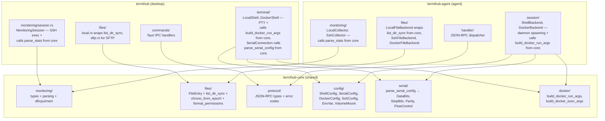
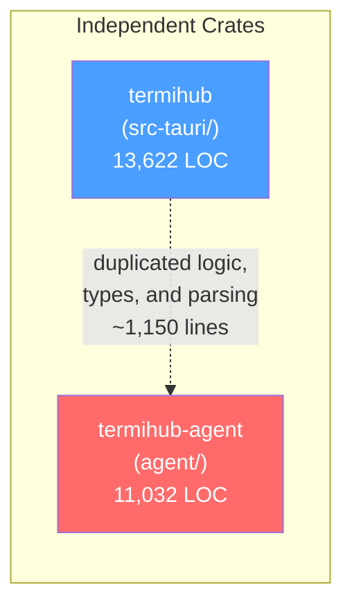
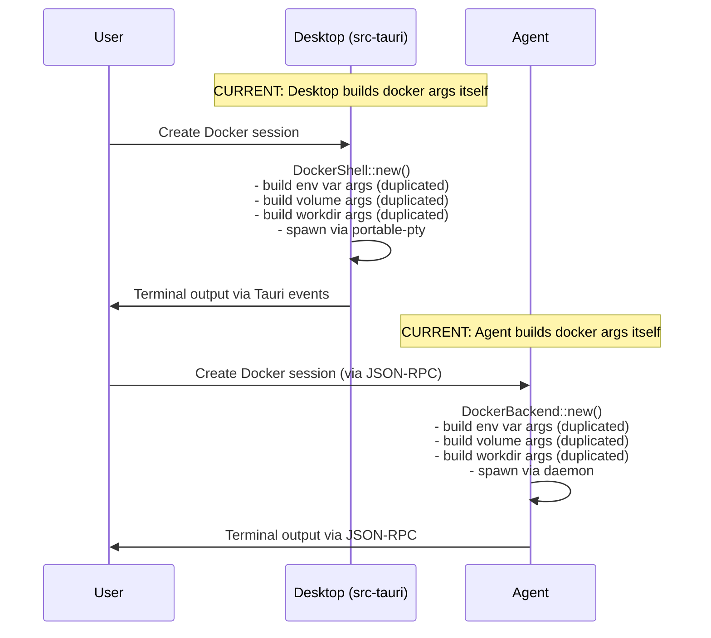
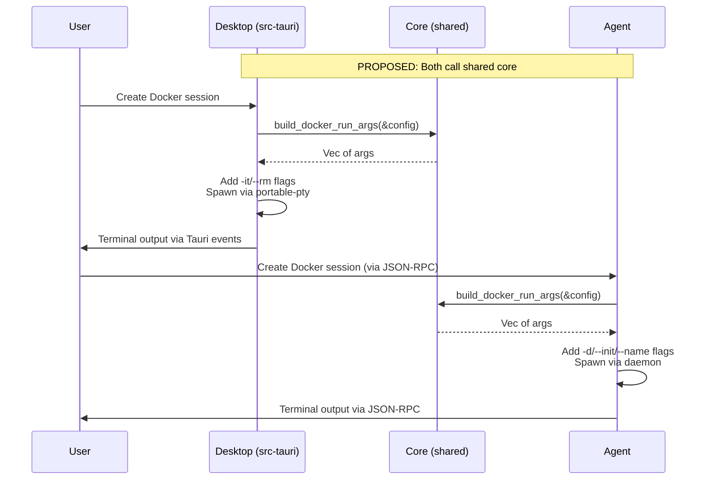
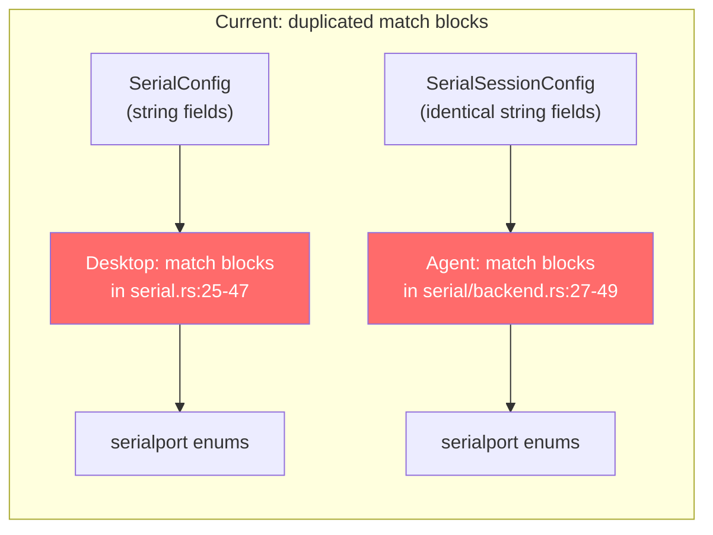
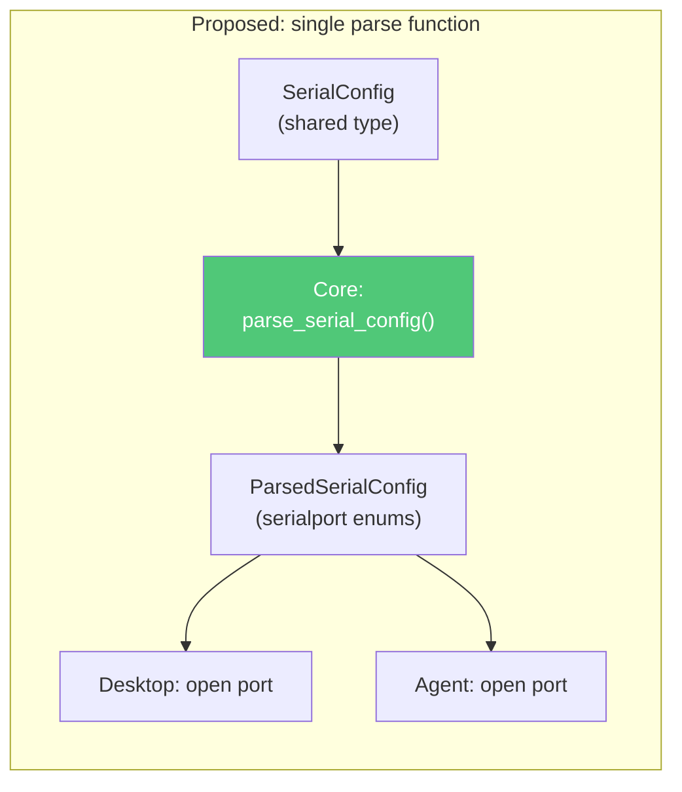
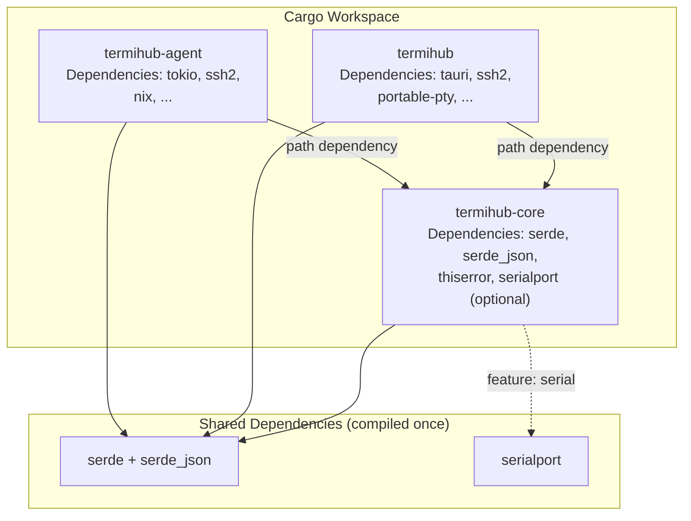
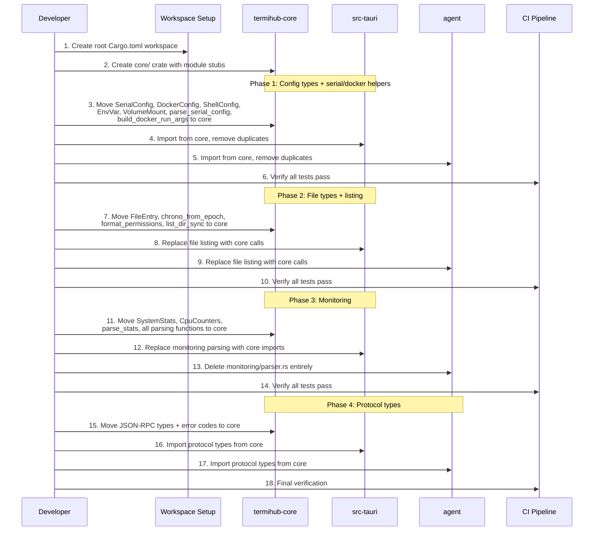

# Concept: Shared Rust Core Library

**GitHub Issue:** [#277](https://github.com/armaxri/termiHub/issues/277)

---

## Overview

termiHub currently maintains two independent Rust crates:

- **`src-tauri/`** (package `termihub`, 13,622 LOC) — the Tauri desktop backend
- **`agent/`** (package `termihub-agent`, 11,032 LOC) — the remote agent

Both crates evolved in parallel. What they do is fundamentally the same: manage terminal sessions (shell, serial, Docker, SSH), browse files, and monitor systems. The only difference is *where they run* and *how they deliver output*:

- Desktop: runs locally, delivers output via Tauri events
- Agent: runs remotely, delivers output via JSON-RPC notifications

This has led to significant duplication — not just of types and utility functions, but of **core logic**: Docker command building, serial port configuration, local file listing, monitoring parsing, and more. The agent's monitoring parser even documents this explicitly: *"Ported from `src-tauri/src/monitoring/session.rs`"*.

This concept evaluates extracting shared code into a common workspace crate (`termihub-core`) and restructuring both crates so they become thin transport adapters over shared backend logic.

### Motivation

1. **Duplicated backend logic** — Docker arg building, serial config parsing, file listing, and monitoring parsing are implemented twice with near-identical code
2. **Duplicated types** — `FileEntry`, `SystemStats`, `CpuCounters`, config structs, JSON-RPC types all exist in both crates
3. **Divergence risk** — bug fixes in one crate may not reach the other (the copies already differ subtly in error handling)
4. **Maintenance burden** — every new feature that touches both sides requires implementing and testing the same logic twice

### Current Duplication Analysis

#### Tier 1: Backend Logic (the real savings)

These are full function/module duplications where both sides do the same thing:

| Category | Desktop File | Agent File | Duplicated Lines | Similarity |
| ---------- | ------------- | --------- | ----------------- | ------------ |
| Serial config parsing (data_bits/stop_bits/parity/flow_control match blocks) | `terminal/serial.rs:25-47` | `serial/backend.rs:27-49` | ~25 | Byte-for-byte identical |
| Docker command building (env vars, volumes, working dir) | `terminal/docker_shell.rs:35-72` | `docker/backend.rs:44-68` | ~30 | Near-identical |
| Local file listing (iterate entries, skip `.`/`..`, read metadata, format, build `FileEntry`) | `files/local.rs:22-63` | `files/local.rs:88-130` | ~40 | Structurally identical |
| Monitoring parsing (`parse_stats`, `parse_cpu_line`, `parse_meminfo_value`, `parse_df_output`) | `monitoring/session.rs:76-290` | `monitoring/parser.rs` + `monitoring/collector.rs:309-323` | ~220 | Explicitly documented copy |
| CPU delta calculation (`CpuCounters`, `cpu_percent_from_delta`) | `monitoring/session.rs:30-71` | `monitoring/parser.rs:30-71` | ~60 | Byte-for-byte identical |
| File utilities (`chrono_from_epoch`, `days_to_ymd`, `format_permissions`) | `files/utils.rs` | `files/mod.rs:59-119` | ~60 | Byte-for-byte identical |
| **Subtotal** | | | **~435** | |

#### Tier 2: Shared Types

| Category | Desktop File | Agent File | Duplicated Lines |
| ---------- | ------------- | --------- | ----------------- |
| `FileEntry` struct | `files/mod.rs` | `protocol/methods.rs:294-305` | ~10 |
| `SystemStats` struct | `monitoring/session.rs:15-27` | `monitoring/parser.rs:15-27` | ~15 |
| `EnvVar` / `DockerEnvVar` + `VolumeMount` / `DockerVolumeMount` | `terminal/backend.rs:52-66` | `protocol/methods.rs:276-288` | ~15 |
| Session config structs (`ShellConfig`, `SerialConfig`, `DockerConfig`, `SshSessionConfig`) | `terminal/backend.rs` | `protocol/methods.rs:202-288` | ~100 |
| Default value functions | `terminal/backend.rs` | `protocol/methods.rs:213-274` | ~30 |
| **Subtotal** | | | **~170** |

#### Tier 3: Protocol Types

| Category | Desktop File | Agent File | Duplicated Lines |
| ---------- | ------------- | --------- | ----------------- |
| JSON-RPC message types | `terminal/jsonrpc.rs` | `protocol/messages.rs` | ~80 (conceptually similar, structurally different) |
| JSON-RPC error codes | *(not extracted)* | `protocol/errors.rs` | ~60 (agent-only, desktop could reuse) |
| **Subtotal** | | | **~140** |

#### Tier 4: Duplicated Tests

| Category | Lines |
| ---------- | ------- |
| Monitoring parsing tests (identical test cases in both crates) | ~120 |
| File utility tests | ~30 |
| Config serde tests | ~50 |
| **Subtotal** | **~200** |

### Grand Total

~945 lines of duplicated source + ~200 lines of duplicated tests.

---

## UI Interface

This is an internal infrastructure change with no user-facing UI impact. The "interface" is the **developer experience** — how contributors interact with the workspace.

### Developer Workflow Changes

**Before (current):**

```bash
# Build desktop
cd src-tauri && cargo build

# Build agent
cd agent && cargo build

# Run all tests (two separate invocations)
cd src-tauri && cargo test
cd agent && cargo test
```

**After (proposed workspace):**

```bash
# Build everything from repo root
cargo build --workspace

# Test everything from repo root
cargo test --workspace

# Build only desktop
cargo build -p termihub

# Build only agent
cargo build -p termihub-agent

# Build only shared core
cargo build -p termihub-core
```

### Import Pattern (Developer Perspective)

In both `src-tauri/` and `agent/`:

```rust
use termihub_core::monitoring::{SystemStats, CpuCounters, parse_stats};
use termihub_core::files::{FileEntry, chrono_from_epoch, format_permissions, list_dir_sync};
use termihub_core::serial::parse_serial_config;
use termihub_core::docker::build_docker_run_args;
use termihub_core::protocol::{JsonRpcRequest, JsonRpcNotification, errors};
use termihub_core::config::{SerialConfig, DockerConfig, ShellConfig, EnvVar, VolumeMount};
```

### Script Impact

The existing `scripts/` would need minor updates:

- `test.sh` could use `cargo test --workspace` instead of running three separate commands
- `check.sh` could use `cargo clippy --workspace` and `cargo fmt --all`
- `build.sh` and `dev.sh` unchanged (they target specific packages)

---

## General Handling

### Architecture: Transport-Agnostic Core

The key insight is that both crates follow the same pattern:

```text
[config] → [build command / open port] → [run on PTY] → [read output] → [deliver to user]
```

Everything up to "deliver to user" is identical. The delivery mechanism is the only difference:

- Desktop: `OutputSender` (mpsc channel → Tauri event → React frontend)
- Agent: `NotificationSender` (mpsc channel → JSON-RPC notification → desktop via SSH)

The shared core should contain the **transport-agnostic logic** — everything that doesn't depend on *how* output reaches the user.



### What Goes in the Shared Core

#### 1. `config` — Session Configuration Types

Unified config structs used by both crates. Currently the desktop has `SerialConfig` while the agent has `SerialSessionConfig` — structurally identical, just named differently. Same for `DockerConfig` vs `DockerSessionConfig`, and `EnvVar` vs `DockerEnvVar`.

```rust
// termihub-core/src/config.rs

/// Shell session configuration.
pub struct ShellConfig {
    pub shell: Option<String>,
    pub cols: u16,        // default: 80
    pub rows: u16,        // default: 24
    pub env: HashMap<String, String>,
}

/// Serial port configuration.
pub struct SerialConfig {
    pub port: String,
    pub baud_rate: u32,   // default: 115200
    pub data_bits: u8,    // default: 8
    pub stop_bits: u8,    // default: 1
    pub parity: String,   // default: "none"
    pub flow_control: String, // default: "none"
}

/// Docker container configuration.
pub struct DockerConfig {
    pub image: String,
    pub shell: Option<String>,
    pub cols: u16,
    pub rows: u16,
    pub env_vars: Vec<EnvVar>,
    pub volumes: Vec<VolumeMount>,
    pub working_directory: Option<String>,
    pub remove_on_exit: bool,
    pub env: HashMap<String, String>,
}

pub struct EnvVar { pub key: String, pub value: String }
pub struct VolumeMount { pub host_path: String, pub container_path: String, pub read_only: bool }
```

#### 2. `serial` — Serial Port Config Parsing

The match blocks converting string config values to `serialport` crate enums are byte-for-byte identical:

```rust
// termihub-core/src/serial.rs
pub struct ParsedSerialConfig {
    pub port: String,
    pub baud_rate: u32,
    pub data_bits: serialport::DataBits,
    pub stop_bits: serialport::StopBits,
    pub parity: serialport::Parity,
    pub flow_control: serialport::FlowControl,
}

pub fn parse_serial_config(config: &SerialConfig) -> ParsedSerialConfig { ... }
```

Both `SerialConnection::new()` (desktop) and `SerialPortSettings::from_config()` (agent) would call this instead of duplicating the match blocks.

#### 3. `docker` — Docker Command Building

Both sides build `docker run` commands with identical logic for env vars, volumes, and working directory:

```rust
// termihub-core/src/docker.rs

/// Build the argument list for `docker run`.
/// Returns args to append after `docker run`.
pub fn build_docker_run_args(config: &DockerConfig) -> Vec<String> {
    let mut args = Vec::new();
    for env in &config.env_vars {
        args.push("-e".into());
        args.push(format!("{}={}", env.key, env.value));
    }
    for vol in &config.volumes {
        args.push("-v".into());
        let mount = if vol.read_only {
            format!("{}:{}:ro", vol.host_path, vol.container_path)
        } else {
            format!("{}:{}", vol.host_path, vol.container_path)
        };
        args.push(mount);
    }
    if let Some(ref workdir) = config.working_directory {
        if !workdir.is_empty() {
            args.push("-w".into());
            args.push(workdir.clone());
        }
    }
    args
}
```

Desktop's `DockerShell::new()` and agent's `DockerBackend::new()` would both call this helper instead of duplicating the loop logic. Each side then adds its own flags (`-it --rm` for desktop, `-d --init --name` for agent) and spawns the process through its own mechanism (portable-pty vs std::process::Command).

#### 4. `files` — File Types and Listing Logic

`FileEntry`, date formatting, permission formatting, and the core `list_dir` logic:

```rust
// termihub-core/src/files.rs

pub struct FileEntry { pub name, path, is_directory, size, modified, permissions }
pub fn chrono_from_epoch(secs: u64) -> String { ... }
pub fn format_permissions(perm: u32) -> String { ... }

/// Core directory listing logic — iterate entries, skip `.`/`..`,
/// read metadata, build FileEntry. Pure std::fs, no async.
pub fn list_dir_sync(path: &str) -> Result<Vec<FileEntry>, std::io::Error> { ... }
```

Desktop's `files/local.rs` calls `list_dir_sync()` directly. Agent's `LocalFileBackend` wraps it with `tokio::task::spawn_blocking`.

#### 5. `monitoring` — Stats Types and `/proc` Parsing

The entire parsing pipeline:

```rust
// termihub-core/src/monitoring.rs

pub struct SystemStats { hostname, uptime_seconds, load_average, cpu_usage_percent, ... }
pub struct CpuCounters { user, nice, system, idle, iowait, irq, softirq, steal }

pub fn parse_stats(output: &str) -> Result<(SystemStats, CpuCounters)> { ... }
pub fn parse_cpu_line(line: &str) -> CpuCounters { ... }
pub fn cpu_percent_from_delta(prev: &CpuCounters, curr: &CpuCounters) -> f64 { ... }
pub fn parse_meminfo_value(line: &str) -> u64 { ... }
pub fn parse_df_output(output: &str) -> (u64, u64, f64) { ... }
```

Desktop's `MonitoringSession::fetch_stats()` and agent's `SshCollector::collect()` both call `parse_stats()`. Agent's `LocalCollector` calls individual parsing functions.

#### 6. `protocol` — JSON-RPC 2.0 Types and Error Codes

Message types and error code constants:

```rust
// termihub-core/src/protocol/messages.rs
pub struct JsonRpcRequest { jsonrpc, method, params, id }
pub struct JsonRpcResponse { jsonrpc, result, id }
pub struct JsonRpcErrorResponse { jsonrpc, error, id }
pub struct JsonRpcNotification { jsonrpc, method, params }

// termihub-core/src/protocol/errors.rs
pub const SESSION_NOT_FOUND: i64 = -32001;
pub const FILE_NOT_FOUND: i64 = -32010;
// ... etc
```

### What Stays in Each Consumer

**Desktop-only (stays in `src-tauri/`):**

- `ConnectionConfig` tagged enum (includes `Local`, `Telnet`, `RemoteSession` — desktop-only concepts)
- `LocalShellConfig`, `TelnetConfig`, `RemoteSessionConfig`, `RemoteAgentConfig`
- `TerminalBackend` trait (sync, uses `TerminalError`)
- PTY management via `portable-pty` (open pty, spawn command, reader thread)
- `TerminalManager`, `AgentConnectionManager`
- Tauri commands, events, app handle integration
- SFTP session management (`ssh2` direct), credential store, tunnel manager
- SSH auth utilities, key conversion, X11 forwarding
- Shell detection, Docker detection, VS Code detection

**Agent-only (stays in `agent/`):**

- Daemon process and binary IPC protocol (`daemon/`)
- `SessionManager` with attach/detach/recover semantics
- `FileBackend` trait (async) and backend implementations (Docker exec, SSH)
- `StatsCollector` trait and collector implementations (local, SSH)
- `ConnectionStore` (agent's own persistence format)
- JSON-RPC dispatcher and transport layers (stdio, TCP)
- Ring buffer for 24/7 serial output capture
- State persistence (`state.json`) and session recovery

### Edge Cases and Considerations

**Config type unification:** The desktop's `SerialConfig` and agent's `SerialSessionConfig` are structurally identical but named differently. The shared crate would provide a single `SerialConfig`. Same for `DockerConfig`/`DockerSessionConfig`, `EnvVar`/`DockerEnvVar`, `VolumeMount`/`DockerVolumeMount`. The desktop currently uses `camelCase` serde; the agent uses `snake_case` in some places — the core crate would standardize.

**`SystemStats` vs `MonitoringData`:** The agent's `MonitoringData` adds a `host` field for routing. The shared crate defines the base `SystemStats` struct; the agent wraps it:

```rust
// In termihub-core:
pub struct SystemStats { hostname, uptime_seconds, ... }

// In agent:
pub struct MonitoringData {
    pub host: String,           // routing field
    #[serde(flatten)]
    pub stats: SystemStats,     // shared stats
}
```

**`serialport` dependency in core:** The `serial` module needs the `serialport` crate for its enum types (`DataBits`, `StopBits`, etc.). This can be made optional via a Cargo feature flag so the core crate doesn't force `serialport` on consumers that don't need it.

**Error types:** The desktop uses `TerminalError` (domain enum), the agent uses `anyhow::Error`. The core crate returns `std::io::Error` or its own lightweight error types. Each consumer maps to its own error handling pattern.

**Cross-platform:** The core crate's `files` module would need `#[cfg(unix)]` for permission formatting (just like the current desktop `files/local.rs` does). On Windows, `get_permissions()` returns `None`.

---

## States & Sequences

### Current Architecture (No Sharing)



### Proposed Architecture (With Shared Core)


### How a Docker Session Works Today vs Proposed





### How Serial Config Parsing Works Today vs Proposed





### Build Dependency Flow



### Migration Sequence



---

## Preliminary Implementation Details

### Directory Structure

```
Cargo.toml                    # NEW — workspace root
core/                         # NEW — shared crate
  Cargo.toml
  src/
    lib.rs                    # Re-exports all modules
    config/
      mod.rs                  # ShellConfig, SerialConfig, DockerConfig, EnvVar, VolumeMount
    serial.rs                 # parse_serial_config() → ParsedSerialConfig
    docker.rs                 # build_docker_run_args(), build_docker_exec_args()
    files/
      mod.rs                  # FileEntry, chrono_from_epoch, format_permissions
      local.rs                # list_dir_sync(), stat_sync() — pure std::fs
    monitoring/
      mod.rs                  # SystemStats, CpuCounters
      parser.rs               # parse_stats, parse_cpu_line, parse_meminfo_value, parse_df_output
    protocol/
      mod.rs
      messages.rs             # JsonRpcRequest, Response, ErrorResponse, Notification
      errors.rs               # Error code constants
src-tauri/                    # MODIFIED — depends on core
  Cargo.toml                  # Add: termihub-core = { path = "../core" }
agent/                        # MODIFIED — depends on core
  Cargo.toml                  # Add: termihub-core = { path = "../core" }
```

### Root `Cargo.toml`

```toml
[workspace]
members = ["core", "src-tauri", "agent"]
resolver = "2"

[workspace.dependencies]
serde = { version = "1", features = ["derive"] }
serde_json = "1"
thiserror = "2"
serialport = "4"
```

### Core `Cargo.toml`

```toml
[package]
name = "termihub-core"
version = "0.1.0"
edition = "2021"

[features]
default = ["serial"]
serial = ["dep:serialport"]

[dependencies]
serde = { workspace = true }
serde_json = { workspace = true }
thiserror = { workspace = true }
serialport = { workspace = true, optional = true }
```

The core crate depends primarily on `serde`, `serde_json`, and `thiserror` — no async runtime, no framework dependencies. `serialport` is an optional feature for the serial config parsing module.

### Impact Analysis

**Lines removed from desktop + agent (duplicated code eliminated):**

- Serial config parsing: ~50 lines (25 per crate)
- Docker command building: ~60 lines (30 per crate)
- File listing logic: ~80 lines (40 per crate)
- File types + utilities: ~120 lines (60 per crate)
- Monitoring types + parsing: ~500 lines (250 per crate)
- Config type definitions: ~170 lines
- Protocol types: ~140 lines
- Duplicated tests: ~200 lines
- **Total removed: ~1,320 lines**

**Lines added in core crate:**
- Shared code (moved, not new): ~700 lines
- Workspace boilerplate: ~20 lines
- **Total added: ~720 lines**

**Net reduction: ~600 lines (~2.5% of total Rust LOC)**

More importantly:
- `agent/src/monitoring/parser.rs` (389 lines) can be **deleted entirely**
- `src-tauri/src/monitoring/session.rs` shrinks from 488 to ~200 lines (manager + SSH exec only)
- Future backend features only need implementing once

**Build time impact:**
- Workspace builds compile shared dependencies once (serde, serde_json compiled once instead of twice)
- The core crate is small (~700 LOC) and compiles fast
- Incremental builds benefit: changes in desktop don't trigger agent rebuilds and vice versa

**CI impact:**
- `cargo test --workspace` replaces three separate test commands
- `cargo clippy --workspace` replaces three separate clippy runs
- `cargo fmt --all -- --check` already works with workspaces
- CI matrix unchanged (still builds on Linux, macOS, Windows)

### Risks and Mitigations

| Risk | Mitigation |
|------|-----------|
| Tight coupling between desktop and agent releases | Core crate uses path dependencies; both are versioned together in-repo |
| Breaking changes in core affect both consumers | Core has a stable API surface; CI catches breakage in both consumers |
| `serialport` dependency bloats core for consumers that don't need it | Feature flag: `serial = ["dep:serialport"]` |
| Cross-platform file permission handling | `#[cfg(unix)]` in core, same as current desktop code |
| Migration introduces regressions | Migrate in phases, test after each phase |
| Workspace changes break existing scripts | Update `scripts/` to use workspace commands; individual crate builds still work |

### Recommendation

**Proceed with the shared core.** The analysis shows ~1,150 lines of duplicated code including meaningful backend logic (not just types). The strongest extraction candidates, in priority order:

1. **Config types + serial/docker helpers** (highest impact — unifies the type system and eliminates logic duplication in the most-touched backend code)
2. **Monitoring parsing** (clearest win — explicitly documented copy, entire file can be deleted from agent)
3. **File types and listing** (moderate win — identical `FileEntry`, `list_dir`, formatting)
4. **Protocol types** (moderate win — unifies JSON-RPC format, prevents wire protocol drift)

The net code reduction (~600 lines, ~2.5%) is meaningful, but the greater value is:
- **Single source of truth** for backend logic — bug fixes apply to both sides
- **Easier new features** — adding a new config field or backend type happens once
- **Unified tests** — test the parsing/building logic once, in the core
- **Workspace ergonomics** — `cargo test --workspace` and `cargo clippy --workspace` from the repo root
