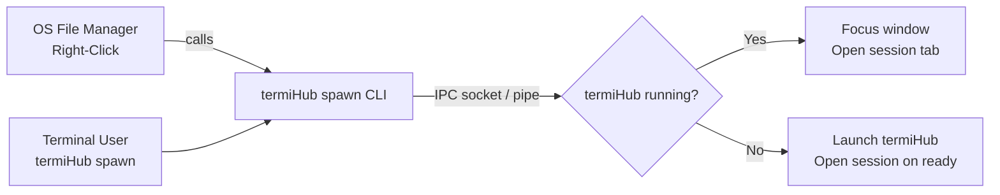
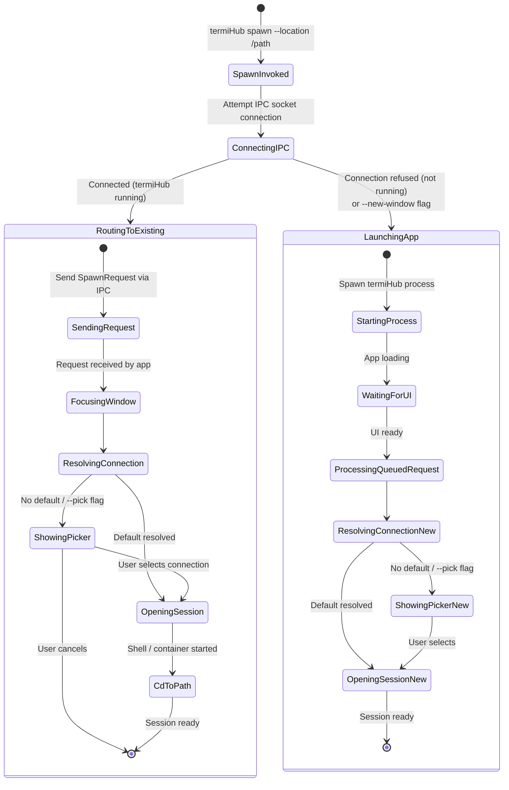
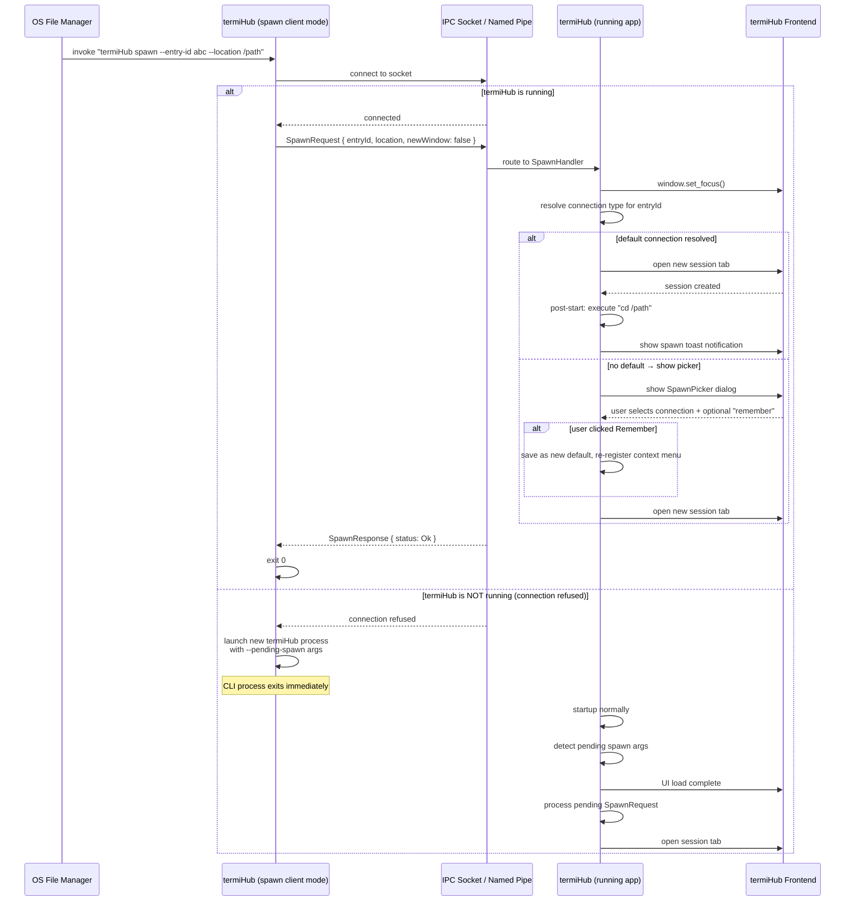
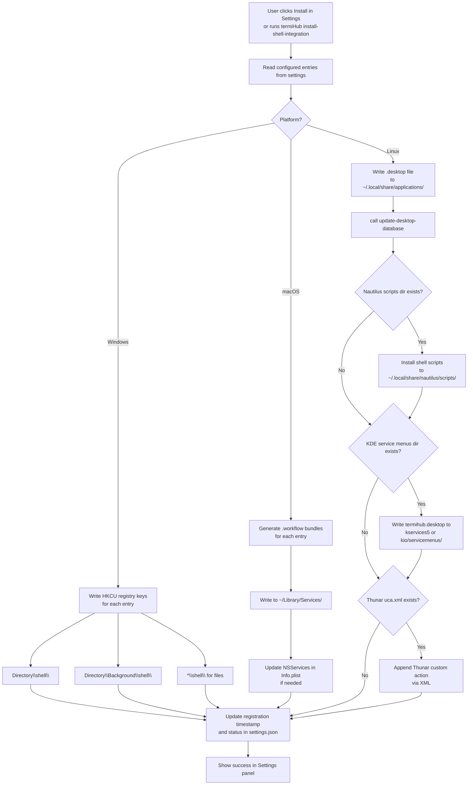
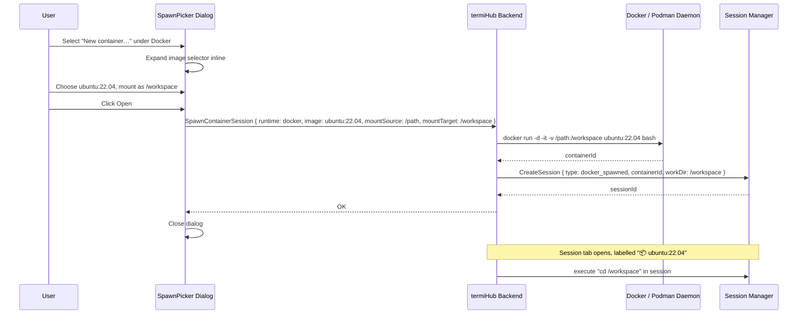
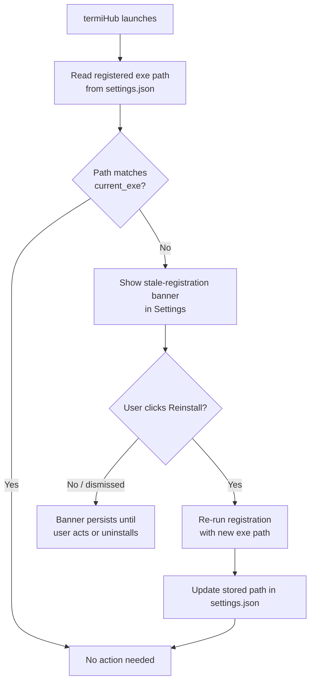
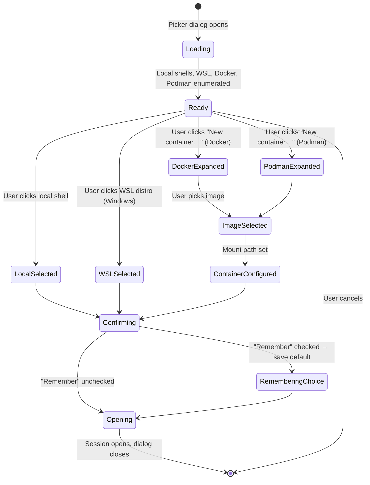

# Shell Context Menu & CLI Spawn Integration

> GitHub Issue: #TBD

## Overview

Add "Open in termiHub" context menu entries to the OS file manager on Windows, macOS, and Linux,
plus a `termiHub spawn` CLI subcommand for terminal users. When triggered, termiHub opens a new
session tab in the **existing window** (if running), or launches and then opens the session if not
running. The connection type is user-configurable via a settings panel, supporting multiple named
entries, modifier-key variants (Windows), and an interactive session picker.

**Motivation**: Developers and sysadmins constantly switch between file manager views and terminal
sessions. Applications like VS Code and Git Bash reduce that friction with OS-level "Open here"
context menu entries. termiHub should offer the same, extended with its multi-protocol capabilities
— opening not just a local shell, but a WSL distro, a Docker container with the directory mounted,
or an SSH jump session, directly from a right-click.

**Key goals**:

- **Single entry** for the common case: "Open in termiHub" uses the configured default connection
- **Multiple named entries**: configurable list, each with its own connection type and visibility
- **Modifier-key variants** (Windows: Shift+Right-click extended menu; other platforms: separate
  named entries)
- **Session picker dialog**: interactive connection chooser shown when no default is set, or
  explicitly requested — rendered inside termiHub with immediate focus
- **Docker / Podman**: spawn a new container with the target directory mounted
- **CLI**: `termiHub spawn --location <path>` for terminal workflows
- **Install / uninstall** without admin rights (user-level registration on all platforms)
- **Cross-platform**: Windows (Registry), macOS (Quick Actions + Services), Linux (XDG `.desktop` +
  file-manager-specific scripts)



---

## UI Interface

### Context Menu Entries

#### Windows — Single Default Entry (Regular Right-Click)

When only one entry is configured, it appears directly in the context menu:

```
Right-click on a folder or file:
┌──────────────────────────────────┐
│ Open                             │
│ Open in new window               │
│ ─────────────────────────────── │
│ Open in termiHub                 │  ← default entry
│ ─────────────────────────────── │
│ Share                            │
│ Copy as path                     │
│ Properties                       │
└──────────────────────────────────┘

Right-click on folder background:
┌──────────────────────────────────┐
│ View                         ▶   │
│ Sort by                      ▶   │
│ ─────────────────────────────── │
│ Open termiHub here               │  ← background entry
│ ─────────────────────────────── │
│ New                          ▶   │
│ Properties                       │
└──────────────────────────────────┘
```

#### Windows — Multiple Entries (Submenu)

When 3 or more entries are configured, they collapse into a submenu:

```
┌──────────────────────────────────┐
│ Open                             │
│ ─────────────────────────────── │
│ Open in termiHub             ▶   │
│   ├─ Open (bash)                 │  ← first "Always" entry
│   ├─ Open (PowerShell)           │
│   └─ Pick session…               │
│ ─────────────────────────────── │
│ Properties                       │
└──────────────────────────────────┘
```

#### Windows — Extended Menu (Shift+Right-Click)

Entries marked "Extended only" appear exclusively when the user holds Shift before right-clicking:

```
Regular right-click:               Shift+Right-click:
┌──────────────────────────────┐   ┌──────────────────────────────┐
│ Open in termiHub             │   │ Open in termiHub             │
│                              │   │ Open in termiHub (WSL)       │  ← extended-only
│                              │   │ Open in termiHub (new window)│  ← extended-only
└──────────────────────────────┘   └──────────────────────────────┘
```

This keeps the regular menu clean while giving power users quick access to less-common variants.

#### macOS — Finder Quick Actions & Services

Quick Actions appear directly in the right-click context menu (macOS 10.14+). Services appear in
the Services submenu. Both are registered simultaneously.

```
Right-click on folder in Finder:
┌─────────────────────────────────────┐
│ Open                                │
│ Open With                       ▶   │
│ Move to Trash                       │
│ ─────────────────────────────────  │
│ Quick Actions                   ▶   │
│   ├─ Open in termiHub               │  ← Quick Action
│   └─ Open in termiHub (new window)  │  ← Quick Action
│ ─────────────────────────────────  │
│ Services                        ▶   │
│   └─ termiHub                   ▶   │
│         ├─ Open in termiHub         │  ← Services entry
│         └─ Open with picker…        │
└─────────────────────────────────────┘
```

Multiple entries appear as separate Quick Actions. There are no modifier-key variants on macOS —
the same purpose is achieved with named entries.

#### Linux — Generic XDG (All File Managers)

Installing a `.desktop` file with `inode/directory` MIME type makes termiHub appear in the
"Open With" flow. This works across Nautilus, Thunar, Dolphin, Nemo, and any XDG-compliant file
manager:

```
Right-click on folder (generic):
┌─────────────────────────────┐
│ Open                        │
│ Open With               ▶   │
│   └─ termiHub               │  ← from .desktop MimeType
│ ─────────────────────────  │
│ Copy                        │
│ Properties                  │
└─────────────────────────────┘
```

With Nautilus (GNOME), scripts are also installed for a more prominent placement:

```
Right-click on folder (Nautilus):
┌─────────────────────────────┐
│ Open                        │
│ ─────────────────────────  │
│ Scripts                 ▶   │
│   ├─ Open in termiHub       │
│   └─ Open with picker…      │
│ ─────────────────────────  │
│ Properties                  │
└─────────────────────────────┘
```

With KDE Dolphin, service menu entries appear alongside native actions:

```
Right-click on folder (Dolphin):
┌─────────────────────────────┐
│ Open Terminal Here          │
│ Open in termiHub            │  ← service menu entry
│ ─────────────────────────  │
│ Copy                        │
└─────────────────────────────┘
```

### Session Picker Dialog

Shown when:

- No default connection is configured and a spawn is triggered
- The user selects "Pick session…" from the context menu
- CLI is invoked with `--pick`

The dialog opens inside the existing termiHub window (termiHub is brought to focus first). If
termiHub is not already running, it launches and shows the picker before opening any session.

```
┌────────────────────────────────────────────────────────────┐
│  Open in termiHub                                          │
│  ─────────────────────────────────────────────────────────│
│  📁 /home/user/projects/myapp                              │
│                                                            │
│  LOCAL SHELLS                                              │
│  ┌──────────────────────────────────────────────────────┐  │
│  │ ► bash           /bin/bash                           │  │
│  │   zsh            /bin/zsh                            │  │
│  │   fish           /usr/bin/fish                       │  │
│  │   PowerShell     C:\Windows\System32\...  (Win only) │  │
│  │   cmd            C:\Windows\System32\cmd.exe         │  │
│  └──────────────────────────────────────────────────────┘  │
│                                                            │
│  WSL  (Windows only)                                       │
│  ┌──────────────────────────────────────────────────────┐  │
│  │   Ubuntu-22.04                                       │  │
│  │   Debian                                             │  │
│  └──────────────────────────────────────────────────────┘  │
│                                                            │
│  DOCKER                                                    │
│  ┌──────────────────────────────────────────────────────┐  │
│  │   New container…   (mounts directory)                │  │
│  └──────────────────────────────────────────────────────┘  │
│                                                            │
│  PODMAN                                                    │
│  ┌──────────────────────────────────────────────────────┐  │
│  │   New container…   (mounts directory)                │  │
│  └──────────────────────────────────────────────────────┘  │
│                                                            │
│  ☐ Open in new window          ☐ Remember this choice      │
│                                                            │
│                              [Cancel]    [Open]            │
└────────────────────────────────────────────────────────────┘
```

When "New container…" is selected, an inline image selector expands in place:

```
│  DOCKER                                                    │
│  ┌──────────────────────────────────────────────────────┐  │
│  │ ► New container                                      │  │
│  │   Image:      [ubuntu:22.04                    ▼]    │  │
│  │   Mount as:   [/workspace                       ]    │  │
│  └──────────────────────────────────────────────────────┘  │
```

The "Remember this choice" checkbox saves the selection as the new default for the "Open in
termiHub" entry, updating the context menu registration automatically.

### Settings Panel — Shell Integration

A new **Shell Integration** section is added to the existing Settings panel (under General or as
its own top-level category if the number of options warrants it):

```
┌──────────────────────────────────────────────────────────────┐
│ SHELL INTEGRATION                                            │
│                                                              │
│ Context Menu Registration                                    │
│ ┌────────────────────────────────────────────────────────┐   │
│ │ Status:  ● Registered (last updated 2026-04-15)        │   │
│ │                                                        │   │
│ │          [Reinstall / Update]       [Uninstall]        │   │
│ └────────────────────────────────────────────────────────┘   │
│                                                              │
│ Quick-Access Entries                         [+ Add entry]   │
│ ┌────────────────────────────────────────────────────────┐   │
│ │ ≡  1  Open in termiHub      bash         Always    ✏ 🗑 │   │
│ │ ≡  2  Open with WSL         Ubuntu-22.04 Extended  ✏ 🗑 │   │
│ │ ≡  3  Pick session…         (picker)     Extended  ✏ 🗑 │   │
│ └────────────────────────────────────────────────────────┘   │
│    Drag ≡ to reorder. First "Always" entry is the default.   │
│                                                              │
│ Fallback when no entry matches:                              │
│   ● Show session picker                                      │
│   ○ Use system default shell                                 │
│                                                              │
│ When termiHub is already running:                            │
│   ● Open in existing window (focus it)                       │
│   ○ Always open a new window                                 │
│                                                              │
│ Linux — File Manager Integrations           (Linux only)     │
│   ☑ Install Nautilus scripts     (detected: Nautilus 45)     │
│   ☑ Install KDE service menu     (detected: Dolphin 23)      │
│   ☑ Install Thunar custom action (not detected)              │
│                                                              │
└──────────────────────────────────────────────────────────────┘
```

**Entry editor dialog** (add / edit):

```
┌──────────────────────────────────────────────────────┐
│ Edit Entry                                           │
│                                                      │
│ Name:         [Open in termiHub              ]       │
│                                                      │
│ Connection:   [Local Shell — bash            ▼]      │
│               (or "Show session picker")             │
│                                                      │
│ Visibility:                                          │
│   ● Always visible in context menu                   │
│   ○ Extended menu only  (Shift+Right-click)          │
│     Windows only — ignored on macOS and Linux        │
│                                                      │
│ Show for:                                            │
│   ☑ Folders                                          │
│   ☑ Files  (opens terminal in parent directory)      │
│   ☑ Folder background (right-click on empty space)  │
│                                                      │
│                          [Cancel]      [Save]        │
└──────────────────────────────────────────────────────┘
```

### Spawn Notification Toast

When an external spawn request arrives in a running termiHub, a brief toast appears at the top
of the window to confirm the session was opened:

```
╔═════════════════════════════════════════════════════╗
║  ⚡ Opened bash session at ~/projects/myapp          ║
╚═════════════════════════════════════════════════════╝
```

The toast auto-dismisses after 3 seconds.

### Install Prompt (First Launch)

On first launch after a fresh install (or if shell integration has never been set up), termiHub
shows a non-blocking banner in the Settings panel or a one-time dialog:

```
┌───────────────────────────────────────────────────────────┐
│  💡 Add "Open in termiHub" to your file manager?          │
│                                                           │
│  Right-click any folder to open it directly in termiHub.  │
│                                                           │
│    [Not now]    [Don't ask again]    [Install Now]        │
└───────────────────────────────────────────────────────────┘
```

---

## General Handling

### Spawn Request Sources

A spawn request originates from one of three sources, all sharing the same IPC path:

1. **OS context menu entry** — invokes `termiHub spawn --location "<path>"` via the registered
   shell command
2. **Terminal / CLI user** — calls `termiHub spawn` directly
3. **Future: URL deep link** — `termihub://spawn?location=...` (registered URI scheme, out of
   scope for this concept but the IPC layer supports it)

### Attach-to-Existing vs. New Window

| Trigger                                     | Flag           | Behavior                   |
| ------------------------------------------- | -------------- | -------------------------- |
| Context menu default entry                  | —              | Attach to existing window  |
| Context menu "new window" entry             | `--new-window` | Launch new termiHub window |
| `termiHub spawn --location /p`              | —              | Attach to existing window  |
| `termiHub spawn --location /p --new-window` | `--new-window` | Launch new termiHub window |

When **attaching to an existing window**:

1. The IPC client connects to the running termiHub's socket / named pipe
2. Sends the `SpawnRequest`; the running instance processes it
3. The running instance calls `window.set_focus()` to bring itself to the foreground
4. A new session tab opens in the currently active panel; `cd` is executed after the shell starts

If focus cannot be granted by the OS (rare edge case — some Wayland compositors restrict it), the
termiHub taskbar icon flashes and the session still opens in the background. The OS popup fallback
(a separate small native window) is **not** used, because focus is reliably achievable via Tauri's
`window.set_focus()` on Windows, macOS, and X11/Wayland with the XDG activation protocol.

### Connection Type Resolution

For each spawn request, the connection type is resolved in priority order:

```
1. Explicit --connection <id> flag (CLI override)
         ↓
2. The context menu entry that was clicked (by entry ID embedded in the command)
         ↓
3. First "Always" entry in the configured entry list (the default)
         ↓
4. Fallback setting: "Show session picker" OR "Use system default shell"
```

When the picker is shown, it becomes step 4 and the user's choice becomes the resolved type.
If "Remember this choice" is checked, the resolved type is saved as the new default (updates
entry 3 and re-registers context menu).

### File vs. Directory Handling

| Input path                       | Behavior                                         |
| -------------------------------- | ------------------------------------------------ |
| Path is an existing directory    | Shell starts; `cd "<path>"` executed immediately |
| Path is an existing file         | Shell starts; `cd "<parent_directory>"` executed |
| Path does not exist              | Warning toast; shell starts at home directory    |
| Path is a symlink to a directory | Resolved; treated as directory                   |

For WSL sessions on Windows: the Windows path is converted to its WSL equivalent
(e.g., `C:\Users\arne\project` → `/mnt/c/Users/arne/project`) before the `cd` command.

### Docker / Podman Container Mounting

When the resolved connection type is "New container" (Docker or Podman):

1. A container image is determined — from the picker's image selector, the `--container-image`
   CLI flag, or a previously saved preference for this entry
2. A new container is created with the target directory bind-mounted:
   - Mount source: the requested host path
   - Mount target: configurable per entry (default: `/workspace`)
3. The container starts with an interactive shell session
4. termiHub opens the session and `cd`s to the mount target
5. When the session closes, the container is stopped but **not** automatically removed (the user
   can clean up via the Docker/Podman backend or externally)

Spawn-created containers are tracked separately from manually configured Docker connections and
shown with a "📦 Spawned" badge in the session tab.

### Platform-Specific Registration

#### Windows

Registry keys are written under `HKEY_CURRENT_USER` — no administrator rights required.

| Registry path                                            | Purpose                          |
| -------------------------------------------------------- | -------------------------------- |
| `HKCU\Software\Classes\Directory\shell\<key>`            | Right-click on a folder          |
| `HKCU\Software\Classes\Directory\Background\shell\<key>` | Right-click on folder background |
| `HKCU\Software\Classes\*\shell\<key>`                    | Right-click on a file            |

Each key contains:

- Default value: the display name of the entry
- `Icon` value: `"<exe_path>,0"` for the termiHub icon
- `Extended` value (empty string, optional): present only for "Extended only" entries
- A `command` subkey with: `"<exe_path>" spawn --entry-id <id> --location "%V"`

When 3 or more "Always" entries exist, all entries under a single parent key
`termiHubMenu` form a cascading submenu automatically.

Re-registration is idempotent. Uninstall deletes the key trees.

#### macOS

Each configured entry is installed as a **Quick Action workflow bundle** in
`~/Library/Services/<entry-name>.workflow`. The bundle is plain XML (Automator format) and
contains a single "Run Shell Script" action calling `termiHub spawn --entry-id <id> --location "$@"`.

Additionally, `NSServices` entries in the app's `Info.plist` register each entry in the
Services menu, covering file managers that do not surface Quick Actions. Both coexist without
conflict — the user sees the entry under both Quick Actions and Services.

There are no modifier-key variants on macOS. Multiple named entries (visible as separate Quick
Actions) serve the same purpose as Windows's regular/extended distinction.

Uninstall: the workflow bundles are removed from `~/Library/Services/`.

#### Linux

Three complementary approaches are used, selected based on detected file managers:

**1. XDG `.desktop` file (universal)**

Installed to `~/.local/share/applications/termihub-open-<slug>.desktop`. Registers termiHub as
an application for `inode/directory` MIME type. Appears in "Open With" dialogs across all
XDG-compliant file managers. `update-desktop-database` is called after installation.

```ini
[Desktop Entry]
Name=Open in termiHub
Exec=termiHub spawn --entry-id abc123 --location %f
Icon=termihub
Type=Application
Categories=TerminalEmulator;
MimeType=inode/directory;
```

**2. Nautilus scripts (GNOME)**

If `~/.local/share/nautilus/scripts/` exists, a shell script is installed for each entry. Scripts
appear in Finder right-click → Scripts. Each script calls `termiHub spawn --entry-id <id>
--location "$NAUTILUS_SCRIPT_SELECTED_FILE_PATHS"`.

**3. KDE Dolphin service menu**

If `~/.local/share/kservices5/ServiceMenus/` exists (KDE 5) or
`~/.local/share/kio/servicemenus/` (KDE 6), a service menu `.desktop` file is installed.
Dolphin shows these entries directly in the right-click menu.

**4. Thunar custom actions**

If Thunar's `~/.config/Thunar/uca.xml` is detected, a custom action entry is appended via
XML manipulation.

All four are enabled by default. The Settings panel shows which file managers were detected and
allows individual toggles.

### Binary Path Changes

Context menu entries embed the absolute path to the termiHub executable. When the binary moves
(update, relocation), the entries become stale. termiHub detects this:

- On each launch, the registered path is compared to `current_exe()`
- If they differ, a banner is shown: "Shell integration is pointing to an old path — reinstall?"
- Reinstall is one click or `termiHub install-shell-integration`

For **portable mode** (see concept #524): the portable termiHub registers context menu entries
pointing to the portable binary. If the user moves the portable folder, they must reinstall shell
integration from the new location.

### CLI Reference

```
termiHub spawn [OPTIONS]

Options:
  --location <path>        Directory or file path to open (required)
  --entry-id <id>          Use a specific configured entry by its ID
  --connection <type>      Connection type name or ID (overrides entry)
  --new-window             Open in a new termiHub window instead of existing
  --pick                   Always show the session picker dialog
  --container-image   Image to use for Docker/Podman container spawn
  --container-mount <path> Mount target path inside the container (default: /workspace)

termiHub install-shell-integration [--force]
termiHub uninstall-shell-integration
termiHub list-shell-entries          (lists configured entries as JSON)
```

Examples:

```bash
# Open ~/projects in the default shell
termiHub spawn --location ~/projects

# Open ~/projects with session picker
termiHub spawn --location ~/projects --pick

# Open in a new Ubuntu Docker container
termiHub spawn --location ~/projects --container-image ubuntu:22.04

# Force a new window
termiHub spawn --location ~/projects --new-window

# Install context menu entries
termiHub install-shell-integration

# Uninstall context menu entries
termiHub uninstall-shell-integration
```

---

## States & Sequences

### Spawn Request — Full State Machine



### Full Spawn Sequence (Existing Instance)



### Spawn Sequence — New Window

```mermaid
sequenceDiagram
    participant CLI as termiHub spawn --new-window
    participant IPC as IPC Socket
    participant Existing as Existing termiHub Window
    participant New as New termiHub Window

    CLI->>IPC: attempt connection
    IPC-->>CLI: connected (termiHub is running)
    Note over CLI: --new-window flag bypasses attach-to-existing
    CLI->>CLI: launch new termiHub process<br>with --new-window --location /path
    Note over CLI: does NOT send to IPC; exits
    New->>New: startup → open session at /path
    Note over Existing: existing window unaffected
```

### Context Menu Registration Flow



### Docker Container Mount Sequence



### Binary Path Staleness Check



### Session Picker — User Interaction State



---

## Preliminary Implementation Details

> **Note**: These details reflect the codebase at the time of concept creation. The implementation
> may need to adapt if the codebase evolves before this feature is built.

### New Module: `src-tauri/src/spawn/`

```
src-tauri/src/spawn/
  mod.rs           re-exports, SpawnRequest / SpawnResponse types
  ipc_server.rs    starts and listens on the platform IPC socket / named pipe
  ipc_client.rs    used by the CLI spawn subcommand to send requests
  handler.rs       processes incoming SpawnRequest inside the running app
  registry.rs      platform-specific context menu registration / unregistration
  options.rs       enumerates available shells, WSL distros, Docker images
```

### IPC Transport

The IPC server is started during `tauri::Builder::setup()` and runs in a background async task
for the lifetime of the application.

| Platform      | Transport          | Socket path                               |
| ------------- | ------------------ | ----------------------------------------- |
| Windows       | Named pipe         | `\\.\pipe\termihub-spawn-{username}`      |
| macOS / Linux | Unix domain socket | `{runtime_dir}/termihub-spawn-{uid}.sock` |

Protocol: newline-delimited JSON over the byte stream.

```rust
// src-tauri/src/spawn/mod.rs
#[derive(Debug, Serialize, Deserialize)]
pub struct SpawnRequest {
    pub location: PathBuf,
    pub entry_id: Option<String>,
    pub connection: Option<String>,
    pub new_window: bool,
    pub pick: bool,
    pub container_image: Option<String>,
    pub container_mount: Option<String>,
}

#[derive(Debug, Serialize, Deserialize)]
pub struct SpawnResponse {
    pub status: SpawnStatus,
    pub error: Option<String>,
}

#[derive(Debug, Serialize, Deserialize)]
#[serde(rename_all = "snake_case")]
pub enum SpawnStatus { Ok, Error, Cancelled }
```

### CLI Subcommand Detection

Tauri initializes with a `setup` hook. Before the window is created, `std::env::args()` is
inspected for `spawn`, `install-shell-integration`, and `uninstall-shell-integration` subcommands:

```rust
// Early in lib.rs, before tauri::Builder
let args: Vec<String> = std::env::args().collect();
if let Some(subcommand) = args.get(1).map(String::as_str) {
    match subcommand {
        "spawn" => {
            let request = parse_spawn_args(&args[2..])?;
            if !request.new_window {
                // Attempt IPC; if successful, forward and exit
                if let Ok(()) = ipc_client::try_forward(&request) {
                    std::process::exit(0);
                }
            }
            // No running instance (or new-window): launch app with pending spawn
            // Store request so the setup hook can process it after UI loads
            PENDING_SPAWN.set(request).ok();
        }
        "install-shell-integration" => {
            registry::install()?;
            std::process::exit(0);
        }
        "uninstall-shell-integration" => {
            registry::uninstall()?;
            std::process::exit(0);
        }
        _ => {}
    }
}
```

### Context Menu Registration — Windows

Uses the `winreg` crate (common in the Rust ecosystem, no system APIs beyond the registry):

```rust
#[cfg(windows)]
pub fn register_entry(entry: &ShellEntry, exe: &str) -> anyhow::Result<()> {
    use winreg::{enums::HKEY_CURRENT_USER, RegKey};
    let hkcu = RegKey::predef(HKEY_CURRENT_USER);

    for base in &[
        format!("Software\\Classes\\Directory\\shell\\termihub_{}", entry.slug()),
        format!("Software\\Classes\\Directory\\Background\\shell\\termihub_{}", entry.slug()),
        format!("Software\\Classes\\*\\shell\\termihub_{}", entry.slug()),
    ] {
        let (key, _) = hkcu.create_subkey(base)?;
        key.set_value("", &entry.name.as_str())?;
        key.set_value("Icon", &format!("{},0", exe))?;
        if entry.visibility == Visibility::Extended {
            key.set_value("Extended", &"")?;
        }
        let (cmd, _) = key.create_subkey("command")?;
        cmd.set_value(
            "",
            &format!("\"{}\" spawn --entry-id {} --location \"%V\"", exe, entry.id),
        )?;
    }
    Ok(())
}
```

### Context Menu Registration — macOS

Workflow bundles are plain XML. Generate and write them from Rust using `std::fs` — no macOS
SDK bindings required for the file format itself:

```rust
#[cfg(target_os = "macos")]
pub fn register_entry(entry: &ShellEntry, exe: &str) -> anyhow::Result<()> {
    let services_dir = dirs::home_dir()
        .context("no home dir")?
        .join("Library/Services");
    std::fs::create_dir_all(&services_dir)?;

    let bundle_path = services_dir.join(format!("{}.workflow", entry.name));
    std::fs::create_dir_all(bundle_path.join("Contents"))?;

    let wflow_xml = workflow_xml_template(&entry.name, exe, &entry.id);
    std::fs::write(bundle_path.join("Contents/document.wflow"), wflow_xml)?;

    // Info.plist (declares input types)
    let info_plist = info_plist_template(&entry.name);
    std::fs::write(bundle_path.join("Contents/Info.plist"), info_plist)?;

    Ok(())
}
```

### Context Menu Registration — Linux

```rust
#[cfg(target_os = "linux")]
pub fn register_entry(entry: &ShellEntry, exe: &str) -> anyhow::Result<()> {
    // 1. XDG .desktop file
    let apps_dir = dirs::data_local_dir()
        .context("no data local dir")?
        .join("applications");
    std::fs::create_dir_all(&apps_dir)?;
    let desktop = format!(
        "[Desktop Entry]\nName={}\nExec={} spawn --entry-id {} --location %f\n\
         Icon=termihub\nType=Application\nMimeType=inode/directory;\n",
        entry.name, exe, entry.id
    );
    std::fs::write(apps_dir.join(format!("termihub-{}.desktop", entry.slug())), desktop)?;
    let _ = std::process::Command::new("update-desktop-database")
        .arg(&apps_dir)
        .status();

    // 2. Nautilus scripts
    let nautilus = dirs::data_local_dir().unwrap().join("nautilus/scripts");
    if nautilus.exists() {
        let script = format!("#!/bin/bash\n{} spawn --entry-id {} --location \"$1\"\n", exe, entry.id);
        let path = nautilus.join(&entry.name);
        std::fs::write(&path, script)?;
        #[cfg(unix)]
        {
            use std::os::unix::fs::PermissionsExt;
            std::fs::set_permissions(&path, std::fs::Permissions::from_mode(0o755))?;
        }
    }

    // 3. KDE service menus (check both KDE5 and KDE6 paths)
    for kde_dir in &[
        dirs::data_local_dir().unwrap().join("kservices5/ServiceMenus"),
        dirs::data_local_dir().unwrap().join("kio/servicemenus"),
    ] {
        if kde_dir.exists() {
            let kde_desktop = kde_service_menu_template(&entry.name, exe, &entry.id);
            std::fs::write(kde_dir.join(format!("termihub-{}.desktop", entry.slug())), kde_desktop)?;
            break;
        }
    }

    Ok(())
}
```

### Frontend: SpawnPicker Component

New component at `src/components/Spawn/SpawnPicker.tsx`. Receives a `SpawnOptions` payload from
the backend event `spawn-picker-requested` and renders the dialog.

```typescript
interface SpawnPickerProps {
  location: string;
  onConfirm: (choice: SpawnChoice) => void;
  onCancel: () => void;
}

interface SpawnChoice {
  connectionType: "local-shell" | "wsl" | "docker" | "podman";
  shellPath?: string;
  wslDistro?: string;
  containerImage?: string;
  containerMount?: string;
  newWindow: boolean;
  remember: boolean;
}
```

The component calls `listSpawnOptions()` on mount to enumerate available local shells, WSL
distros (Windows only), and whether Docker/Podman daemons are reachable.

### Frontend: Settings Component

New component at `src/components/Settings/ShellIntegrationSettings.tsx`.

Reuses the drag-to-reorder list pattern from `TunnelSidebar` for entry management. Calls
`installShellIntegration()` / `uninstallShellIntegration()` Tauri commands. Reads
`getShellIntegrationStatus()` on mount to show registration state and detected file managers.

### Settings Storage

Added to `settings.json` under a new `shellIntegration` key:

```json
{
  "shellIntegration": {
    "registered": true,
    "registeredExePath": "/usr/local/bin/termiHub",
    "openInNewWindow": false,
    "fallback": "picker",
    "entries": [
      {
        "id": "550e8400-e29b-41d4-a716-446655440000",
        "name": "Open in termiHub",
        "connectionType": "local-shell",
        "connectionId": null,
        "shellPath": "/bin/bash",
        "visibility": "always",
        "includeFiles": true,
        "includeFolders": true,
        "includeBackground": true
      }
    ],
    "linux": {
      "installNautilus": true,
      "installKde": true,
      "installThunar": true
    }
  }
}
```

### New Tauri Commands

| Command                           | Description                                                 |
| --------------------------------- | ----------------------------------------------------------- |
| `install_shell_integration`       | Register configured entries on the current platform         |
| `uninstall_shell_integration`     | Remove all registered entries                               |
| `get_shell_integration_status`    | Registration status, exe path match, detected file managers |
| `list_spawn_options`              | Available local shells, WSL distros, Docker/Podman images   |
| `process_spawn_request`           | Internal: handle a resolved SpawnRequest in the running app |
| `save_shell_integration_settings` | Persist entries and settings, trigger re-registration       |

### Files to Create or Modify

| File                                                   | Change                                                      |
| ------------------------------------------------------ | ----------------------------------------------------------- |
| `src-tauri/src/spawn/`                                 | **New** — IPC server, client, handler, registry, options    |
| `src-tauri/src/lib.rs`                                 | Start IPC server in setup; detect spawn subcommand pre-init |
| `src-tauri/src/commands/spawn.rs`                      | **New** — Tauri commands for shell integration              |
| `src-tauri/src/commands/mod.rs`                        | Register spawn commands                                     |
| `src/components/Spawn/SpawnPicker.tsx`                 | **New** — session picker dialog                             |
| `src/components/Settings/ShellIntegrationSettings.tsx` | **New** — settings section                                  |
| `src/services/api.ts`                                  | Add shell integration API functions                         |
| `src/store/appStore.ts`                                | Add `pendingSpawnRequest` and `spawnPickerVisible` state    |
| `src/types/terminal.ts`                                | Add `SpawnRequest`, `SpawnChoice`, `ShellEntry` types       |
| `Cargo.toml` (src-tauri)                               | Add `winreg` (Windows-gated), `clap` or manual arg parsing  |

### Dependencies

| Crate        | Platform gate         | Purpose                                                |
| ------------ | --------------------- | ------------------------------------------------------ |
| `winreg`     | `#[cfg(windows)]`     | Windows registry read/write for context menu entries   |
| `tokio`      | all (already present) | Async IPC server                                       |
| `serde_json` | all (already present) | IPC protocol serialization                             |
| `dirs`       | all (already present) | Platform data directories for Linux/macOS registration |

No new dependencies are required for macOS or Linux registration — both use plain file I/O.
