# SSH Key Passphrase Handling

**GitHub Issue:** [#121](https://github.com/armaxri/termiHub/issues/121)

---

## Overview

termiHub supports SSH key-based authentication, including passphrase-protected keys. The basic plumbing already exists: the UI has a "Key Passphrase" field, and the backend decrypts encrypted OpenSSH keys via the `ssh_key` crate before passing them to libssh2. However, the current implementation has several gaps that affect usability and security:

1. **Passphrase stored in plaintext** — The passphrase is saved alongside the connection config in `connections.json` as unencrypted text. Anyone with file system access can read it, defeating the purpose of protecting the key with a passphrase.
2. **No encryption detection during validation** — The key validation endpoint (`validate_ssh_key`) detects key format but not whether a key is encrypted. Users only discover a missing passphrase when the connection attempt fails.
3. **No runtime prompting** — There is no mechanism to prompt the user for a passphrase at connection time. The passphrase must be pre-configured and saved, or the connection fails.
4. **Overloaded `password` field** — The same `password` field in `SshConfig` is used for password authentication and key passphrases, creating semantic confusion.
5. **No session caching** — Each reconnect re-reads the passphrase from config. There is no in-memory cache to avoid repeated prompts within a session.

This concept addresses these gaps by designing a passphrase handling system that is secure, user-friendly, and consistent with how tools like OpenSSH and VS Code handle key passphrases.

### Goals

- **Prompt on connect** — Ask for the passphrase at connection time when it is not saved, similar to OpenSSH's interactive prompt
- **Detect encryption early** — Enhance key validation to indicate whether a key is encrypted, so the UI can guide the user before they attempt to connect
- **Separate storage from secrets** — Introduce a clear distinction between connection configuration (saved to disk) and secrets like passphrases (optionally saved, with a "remember" toggle)
- **Session-level caching** — Cache successfully-used passphrases in memory for the lifetime of the application, so reconnects and multiple sessions using the same key do not re-prompt
- **Semantic clarity** — Separate the `password` field into distinct `password` (for password auth) and `keyPassphrase` (for key auth) fields

### Non-Goals

- OS keychain integration (e.g., Windows Credential Manager, macOS Keychain, libsecret) — this is a valuable future enhancement but out of scope for this concept. It would be a natural follow-up.
- SSH agent passphrase management — when using SSH agent auth, the agent handles passphrases. This concept only covers key-based auth where termiHub manages the key directly.
- Certificate-based SSH authentication — a separate feature entirely.

---

## UI Interface

### Key Passphrase Field with Encryption Indicator

When the user selects an SSH key file, the validation hint now indicates whether the key is encrypted. The passphrase field adapts accordingly.

**Encrypted key selected:**

```
┌─────────────────────────────────────────────────────────┐
│  Auth Method:  [SSH Key           ▾]                    │
│                                                         │
│  Key Path:     [~/.ssh/id_ed25519         ] [Browse]    │
│  🔒 OpenSSH private key (encrypted). A passphrase is   │
│     required to use this key.                           │
│                                                         │
│  Key Passphrase:  [••••••••••••            ]            │
│  ☑ Save passphrase                                      │
│     ⚠ Passphrase will be stored in plaintext in the     │
│       connection file.                                  │
└─────────────────────────────────────────────────────────┘
```

**Unencrypted key selected:**

```
┌─────────────────────────────────────────────────────────┐
│  Auth Method:  [SSH Key           ▾]                    │
│                                                         │
│  Key Path:     [~/.ssh/id_ed25519         ] [Browse]    │
│  ✓ OpenSSH private key detected.                        │
│                                                         │
│  (No passphrase field shown — key is not encrypted)     │
└─────────────────────────────────────────────────────────┘
```

**Key encryption status unknown (validation pending or file unreadable):**

```
┌─────────────────────────────────────────────────────────┐
│  Auth Method:  [SSH Key           ▾]                    │
│                                                         │
│  Key Path:     [~/.ssh/id_ed25519         ] [Browse]    │
│                                                         │
│  Key Passphrase (optional):  [                 ]        │
│  ☐ Save passphrase                                      │
└─────────────────────────────────────────────────────────┘
```

### Passphrase Prompt Dialog

When connecting with an encrypted key that has no saved passphrase, a modal dialog prompts the user:

```
┌──────────────────────────────────────────────┐
│  Passphrase Required                         │
│──────────────────────────────────────────────│
│                                              │
│  The SSH key for this connection is          │
│  encrypted and requires a passphrase.        │
│                                              │
│  Key: ~/.ssh/id_ed25519                      │
│  Host: user@192.168.1.100:22                 │
│                                              │
│  Passphrase:  [                         ]    │
│                                              │
│  ☐ Remember for this session                 │
│  ☐ Save to connection                        │
│    ⚠ Stored in plaintext                     │
│                                              │
│  [Cancel]                      [Connect]     │
└──────────────────────────────────────────────┘
```

The dialog offers two storage options:
- **Remember for this session** — Cache the passphrase in memory until the app is closed. Default: checked.
- **Save to connection** — Persist the passphrase to `connections.json`. Default: unchecked. Includes a plaintext warning.

### Connection Failure with Wrong Passphrase

When a passphrase is incorrect, the prompt re-appears with an error message:

```
┌──────────────────────────────────────────────┐
│  Passphrase Required                         │
│──────────────────────────────────────────────│
│                                              │
│  ✗ Incorrect passphrase. Please try again.   │
│                                              │
│  Key: ~/.ssh/id_ed25519                      │
│  Host: user@192.168.1.100:22                 │
│                                              │
│  Passphrase:  [                         ]    │
│                                              │
│  ☐ Remember for this session                 │
│  ☐ Save to connection                        │
│    ⚠ Stored in plaintext                     │
│                                              │
│  [Cancel]                      [Connect]     │
└──────────────────────────────────────────────┘
```

### Settings Form Behavior Summary

| Key State | Passphrase Field | Save Checkbox | Validation Hint |
|-----------|-----------------|---------------|-----------------|
| Encrypted, passphrase saved | Shown, pre-filled | Checked | "🔒 Encrypted key. Passphrase saved." |
| Encrypted, passphrase not saved | Shown, empty | Unchecked | "🔒 Encrypted key. You will be prompted on connect." |
| Unencrypted | Hidden | Hidden | "✓ Key detected." |
| Unknown encryption status | Shown, optional | Unchecked | (standard format validation only) |

---

## General Handling

### Passphrase Resolution Flow

When a connection is initiated, the backend resolves the passphrase through a priority chain:


### Session Passphrase Cache

The session cache is an in-memory store keyed by the absolute path of the SSH key file. It holds passphrases for the lifetime of the application process:

- **Populated** when a user enters a correct passphrase and checks "Remember for this session"
- **Invalidated** when authentication fails with a cached passphrase (the cache entry is removed to force a re-prompt)
- **Cleared** when the application exits (never persisted to disk)
- **Shared** across all connections using the same key file — if the user has three connections using `~/.ssh/id_ed25519`, entering the passphrase once covers all three

```mermaid
flowchart LR
    subgraph Cache["Session Passphrase Cache (in-memory)"]
        direction TB
        E1["~/.ssh/id_ed25519 → ••••••"]
        E2["~/.ssh/work_key → ••••••"]
    end

    C1[Connection A<br/>id_ed25519] -->|lookup| Cache
    C2[Connection B<br/>id_ed25519] -->|lookup| Cache
    C3[Connection C<br/>work_key] -->|lookup| Cache
```



### Encryption Detection in Validation

The existing `validate_ssh_key` endpoint is enhanced to detect whether a key is encrypted. This enables the UI to adapt before the user attempts to connect.

**Detection strategies by key format:**

| Format | Encryption Detection Method |
|--------|---------------------------|
| OpenSSH (`BEGIN OPENSSH PRIVATE KEY`) | Parse with `ssh_key` crate, call `is_encrypted()` |
| PKCS#8 (`BEGIN ENCRYPTED PRIVATE KEY`) | Header alone indicates encryption |
| PKCS#8 (`BEGIN PRIVATE KEY`) | Header alone indicates no encryption |
| RSA PEM (`BEGIN RSA PRIVATE KEY`) | Check for `Proc-Type: 4,ENCRYPTED` and `DEK-Info` headers |
| EC PEM (`BEGIN EC PRIVATE KEY`) | Check for `Proc-Type: 4,ENCRYPTED` and `DEK-Info` headers |
| DSA PEM (`BEGIN DSA PRIVATE KEY`) | Check for `Proc-Type: 4,ENCRYPTED` and `DEK-Info` headers |

### Separating Password from Passphrase

The `password` field is currently overloaded. The concept introduces a dedicated `keyPassphrase` field:

**Current state:**
```
SshConfig.password → used for password auth AND key passphrase
```

**Proposed state:**
```
SshConfig.password      → used only for password auth
SshConfig.keyPassphrase → used only for key passphrase (new field)
```

This is a **breaking change** to the config format. A migration is needed for existing `connections.json` files: when loading a config with `authMethod: "key"` and `password` set but `keyPassphrase` absent, the `password` value is moved to `keyPassphrase` and `password` is cleared.

### "Save Passphrase" Toggle

The "Save passphrase" checkbox controls whether the passphrase is persisted in the connection config file. This is an explicit opt-in with a plaintext warning.

- **Checked**: passphrase is stored in `SshConfig.keyPassphrase` and written to `connections.json`
- **Unchecked**: `SshConfig.keyPassphrase` is `None`. The user will be prompted at connection time (or the session cache is used).

A new boolean field `saveKeyPassphrase` in the config tracks this preference. When `saveKeyPassphrase` is `false` (or absent), the `keyPassphrase` field is excluded from serialization even if it's populated in memory.

### Edge Cases

- **Key file changes after validation**: If the user replaces the key file between validation and connection, the encryption status may differ. The backend handles this gracefully — if decryption fails, the prompt dialog is shown regardless of what validation reported.
- **Passphrase for unencrypted key**: If the user provides a passphrase for a key that turns out to be unencrypted, the passphrase is silently ignored (current behavior, no change needed).
- **Empty passphrase**: Some tools allow empty passphrases (distinct from no passphrase). The prompt dialog treats an empty submission as a cancellation. Users who need empty passphrases must save them in the config field.
- **Multiple keys with same path, different passphrases**: Not possible — the cache is keyed by absolute path. One passphrase per key file.
- **Remote agent connections**: `RemoteAgentConfig` has the same `password` overloading issue and should receive the same treatment (`keyPassphrase` field, same prompt flow).
- **Concurrent connection attempts to same key**: If two connections request the same encrypted key simultaneously, only one prompt is shown. The second connection waits for the first prompt to complete, then uses the cached result.

---

## States & Sequences

### Passphrase State Machine


### Connection with Passphrase Prompt Sequence


### Key Validation with Encryption Detection Sequence


### Config Migration Flow


### Concurrent Connection Passphrase Deduplication


---

## Preliminary Implementation Details

Based on the current project architecture at the time of concept creation. The codebase may evolve between concept creation and implementation.

### 1. Enhanced Validation: `ssh_key_validate.rs`

The `SshKeyValidation` struct gains a new `encrypted` field:

```rust
#[derive(Debug, Clone, Serialize)]
#[serde(rename_all = "camelCase")]
pub struct SshKeyValidation {
    pub status: ValidationStatus,
    pub message: String,
    pub key_type: String,
    /// Whether the key is encrypted (passphrase-protected).
    /// `None` if encryption status could not be determined.
    pub encrypted: Option<bool>,
}
```

The `validate_ssh_key` function is extended to detect encryption:

```rust
// For OpenSSH format: parse and check
("BEGIN OPENSSH PRIVATE KEY", "OpenSSH") => {
    // Attempt to parse and check encryption status
    match ssh_key::PrivateKey::read_openssh_file(file_path) {
        Ok(key) => {
            let encrypted = key.is_encrypted();
            let label = if encrypted { "OpenSSH (encrypted)" } else { "OpenSSH" };
            SshKeyValidation {
                status: ValidationStatus::Valid,
                message: format!("{} private key detected.", label),
                key_type: label.to_string(),
                encrypted: Some(encrypted),
            }
        }
        Err(_) => {
            // Fall back to header-only detection
            SshKeyValidation {
                status: ValidationStatus::Valid,
                message: "OpenSSH private key detected.".to_string(),
                key_type: "OpenSSH".to_string(),
                encrypted: None,
            }
        }
    }
}

// For PEM formats: check for Proc-Type header
("BEGIN RSA PRIVATE KEY", "RSA (PEM)") |
("BEGIN EC PRIVATE KEY", "EC (PEM)") |
("BEGIN DSA PRIVATE KEY", "DSA (PEM)") => {
    let encrypted = text.contains("Proc-Type: 4,ENCRYPTED");
    let label = if encrypted {
        format!("{} (encrypted)", key_type)
    } else {
        key_type.to_string()
    };
    SshKeyValidation {
        status: ValidationStatus::Valid,
        message: format!("{} private key detected.", label),
        key_type: label,
        encrypted: Some(encrypted),
    }
}

// PKCS#8 encrypted is already its own header
("BEGIN ENCRYPTED PRIVATE KEY", "PKCS#8 (encrypted)") => {
    SshKeyValidation { encrypted: Some(true), .. }
}
("BEGIN PRIVATE KEY", "PKCS#8") => {
    SshKeyValidation { encrypted: Some(false), .. }
}
```

The frontend `SshKeyValidation` type in `api.ts` is updated accordingly:

```typescript
export interface SshKeyValidation {
  status: "valid" | "warning" | "error";
  message: string;
  keyType: string;
  encrypted: boolean | null;
}
```

### 2. Config Changes: `backend.rs` and `terminal.ts`

**Rust** — Add `key_passphrase` and `save_key_passphrase` to `SshConfig`:

```rust
#[derive(Debug, Clone, Serialize, Deserialize)]
#[serde(rename_all = "camelCase")]
pub struct SshConfig {
    pub host: String,
    pub port: u16,
    pub username: String,
    pub auth_method: String,
    #[serde(skip_serializing_if = "Option::is_none")]
    pub password: Option<String>,
    #[serde(skip_serializing_if = "Option::is_none")]
    pub key_path: Option<String>,
    /// Passphrase for encrypted SSH keys. Only serialized when
    /// `save_key_passphrase` is true.
    #[serde(skip_serializing_if = "Option::is_none")]
    pub key_passphrase: Option<String>,
    /// Whether to persist the key passphrase to disk.
    #[serde(default, skip_serializing_if = "Option::is_none")]
    pub save_key_passphrase: Option<bool>,
    #[serde(default)]
    pub enable_x11_forwarding: bool,
    #[serde(default, skip_serializing_if = "Option::is_none")]
    pub enable_monitoring: Option<bool>,
    #[serde(default, skip_serializing_if = "Option::is_none")]
    pub enable_file_browser: Option<bool>,
}
```

**TypeScript** — Mirror in `SshConfig`:

```typescript
export interface SshConfig {
  host: string;
  port: number;
  username: string;
  authMethod: "password" | "key" | "agent";
  password?: string;
  keyPath?: string;
  keyPassphrase?: string;
  saveKeyPassphrase?: boolean;
  enableX11Forwarding?: boolean;
  enableMonitoring?: boolean;
  enableFileBrowser?: boolean;
}
```

The same changes apply to `RemoteAgentConfig` / the TypeScript `RemoteAgentConfig` type.

### 3. Config Migration: `connection/storage.rs`

Add a migration step in `ConnectionStorage::load()`:

```rust
pub fn load(&self) -> Result<ConnectionStore> {
    // ... existing load logic ...
    let mut store: ConnectionStore = serde_json::from_str(&data)?;

    // Migrate: move password → keyPassphrase for key-auth SSH connections
    let mut dirty = false;
    for conn in &mut store.connections {
        if let ConnectionConfig::Ssh(ref mut ssh) = conn.config {
            if ssh.auth_method == "key"
                && ssh.password.is_some()
                && ssh.key_passphrase.is_none()
            {
                ssh.key_passphrase = ssh.password.take();
                ssh.save_key_passphrase = Some(true);
                dirty = true;
            }
        }
        // Same for RemoteSession configs that wrap SSH transport
    }

    if dirty {
        self.save(&store)?;
    }

    Ok(store)
}
```

### 4. Passphrase Cache: `utils/passphrase_cache.rs` (new file)

```rust
use std::collections::HashMap;
use std::path::PathBuf;
use std::sync::Mutex;

/// In-memory cache for SSH key passphrases.
///
/// Keyed by the canonical (absolute) path of the SSH key file.
/// Lives for the duration of the application process.
pub struct PassphraseCache {
    entries: Mutex<HashMap<PathBuf, String>>,
}

impl PassphraseCache {
    pub fn new() -> Self {
        Self {
            entries: Mutex::new(HashMap::new()),
        }
    }

    /// Look up a cached passphrase for the given key path.
    pub fn get(&self, key_path: &Path) -> Option<String> {
        let canonical = key_path.canonicalize().ok()?;
        self.entries.lock().ok()?.get(&canonical).cloned()
    }

    /// Store a passphrase for the given key path.
    pub fn insert(&self, key_path: &Path, passphrase: String) {
        if let Ok(canonical) = key_path.canonicalize() {
            if let Ok(mut map) = self.entries.lock() {
                map.insert(canonical, passphrase);
            }
        }
    }

    /// Remove a cached passphrase (e.g., after auth failure).
    pub fn remove(&self, key_path: &Path) {
        if let Ok(canonical) = key_path.canonicalize() {
            if let Ok(mut map) = self.entries.lock() {
                map.remove(&canonical);
            }
        }
    }
}
```

Register as Tauri managed state in `main.rs`:

```rust
.manage(PassphraseCache::new())
```

### 5. Passphrase Prompt Flow: Backend Events and Commands

The prompt flow uses Tauri events for the backend-to-frontend notification and a Tauri command for the frontend-to-backend response.

**New event** in `events/`:

```rust
/// Emitted when the backend needs a passphrase to decrypt an SSH key.
#[derive(Clone, Serialize)]
#[serde(rename_all = "camelCase")]
pub struct PassphraseNeededEvent {
    /// Opaque request ID to correlate the response.
    pub request_id: String,
    /// Path to the encrypted key file.
    pub key_path: String,
    /// Connection display info (e.g., "user@host:22").
    pub connection_label: String,
    /// Error message from a previous failed attempt, if any.
    pub error: Option<String>,
}
```

**New command** in `commands/`:

```rust
#[tauri::command]
pub async fn submit_passphrase(
    request_id: String,
    passphrase: String,
    remember: bool,
    save_to_config: bool,
    // ... Tauri state handles ...
) -> Result<(), String>
```

**Frontend event listener** in `events.ts`:

```typescript
export interface PassphraseNeededEvent {
  requestId: string;
  keyPath: string;
  connectionLabel: string;
  error: string | null;
}
```

The backend uses a `tokio::sync::oneshot` channel per request: `connect_and_authenticate` awaits the channel while the frontend shows the dialog. When the user submits, `submit_passphrase` sends the passphrase through the channel.


### 6. Updated Authentication: `ssh_auth.rs`

The `connect_and_authenticate` function changes from synchronous to asynchronous to support the prompt flow:

```rust
pub async fn connect_and_authenticate(
    config: &SshConfig,
    cache: &PassphraseCache,
    app_handle: &AppHandle,
) -> Result<Session, TerminalError> {
    // ... TCP connect, handshake (unchanged) ...

    match config.auth_method.as_str() {
        "key" => {
            let key_path = resolve_key_path(config);

            // 1. Check if key is encrypted
            let needs_passphrase = check_key_encrypted(&key_path)?;

            // 2. Resolve passphrase
            let passphrase = if needs_passphrase {
                resolve_passphrase(config, &key_path, cache, app_handle).await?
            } else {
                None
            };

            // 3. Authenticate
            authenticate_with_key(&session, config, &key_path, passphrase.as_deref())?;

            // 4. Cache on success
            if let Some(ref pp) = passphrase {
                cache.insert(&key_path, pp.clone());
            }
        }
        // ... other auth methods unchanged ...
    }
}
```

### 7. Frontend Components

**New component:** `PassphraseDialog.tsx`

```typescript
interface PassphraseDialogProps {
  keyPath: string;
  connectionLabel: string;
  error: string | null;
  onSubmit: (passphrase: string, remember: boolean, save: boolean) => void;
  onCancel: () => void;
}
```

This is a modal dialog rendered at the app root level (alongside other modals). It is triggered by listening to the `passphrase-needed` Tauri event in a top-level hook or the app store.

**Modified component:** `SshSettings.tsx`

- Conditionally show/hide the passphrase field based on `keyValidation.encrypted`
- Add "Save passphrase" checkbox bound to `config.saveKeyPassphrase`
- Show plaintext storage warning when checkbox is checked
- Rename internal references from `password` to `keyPassphrase` for key auth

### 8. Store Changes: `appStore.ts`

Add passphrase prompt state to the Zustand store:

```typescript
// New state
passphrasePrompt: PassphraseNeededEvent | null;

// New actions
showPassphrasePrompt: (event: PassphraseNeededEvent) => void;
dismissPassphrasePrompt: () => void;
```

The `PassphraseDialog` component reads `passphrasePrompt` from the store and renders when it is non-null.

### 9. File Changes Summary

| File | Change |
|------|--------|
| `src-tauri/src/utils/ssh_key_validate.rs` | Add `encrypted` field to `SshKeyValidation`, detect encryption status |
| `src-tauri/src/terminal/backend.rs` | Add `key_passphrase`, `save_key_passphrase` to `SshConfig` and `RemoteAgentConfig`; update `expand()` |
| `src-tauri/src/utils/ssh_auth.rs` | Make `connect_and_authenticate` async, add passphrase resolution flow |
| `src-tauri/src/utils/passphrase_cache.rs` | New: in-memory passphrase cache |
| `src-tauri/src/utils/mod.rs` | Register `passphrase_cache` module |
| `src-tauri/src/events/` | New: `PassphraseNeededEvent` |
| `src-tauri/src/commands/terminal.rs` | New: `submit_passphrase` command |
| `src-tauri/src/connection/storage.rs` | Config migration logic |
| `src-tauri/src/main.rs` | Manage `PassphraseCache` as Tauri state |
| `src/types/terminal.ts` | Add `keyPassphrase`, `saveKeyPassphrase` to `SshConfig`; update `SshKeyValidation` |
| `src/services/api.ts` | Add `submitPassphrase` function; update `SshKeyValidation` type |
| `src/services/events.ts` | Add `PassphraseNeededEvent` type and listener |
| `src/components/Settings/SshSettings.tsx` | Adapt passphrase field to encryption status, add save checkbox |
| `src/components/PassphraseDialog.tsx` | New: modal passphrase prompt dialog |
| `src/store/appStore.ts` | Add passphrase prompt state and actions |

### 10. Migration Path

1. **First PR — Validation enhancement**: Add `encrypted` field to `SshKeyValidation`, implement encryption detection for all key formats. Update frontend types and SshSettings to show encryption status.
2. **Second PR — Config field separation**: Add `keyPassphrase` and `saveKeyPassphrase` fields. Implement config migration. Update SshSettings to use new fields. At this stage, passphrase must still be pre-configured (no runtime prompting yet).
3. **Third PR — Passphrase cache**: Add `PassphraseCache`, wire into `connect_and_authenticate`. Connections using the same key share cached passphrases.
4. **Fourth PR — Runtime prompting**: Add `PassphraseNeededEvent`, `submit_passphrase` command, `PassphraseDialog` component, and the async prompt flow. This is the largest change and completes the feature.
5. **Fifth PR — Remote agent passphrase**: Apply the same field separation and prompt flow to `RemoteAgentConfig` / remote session connections.
