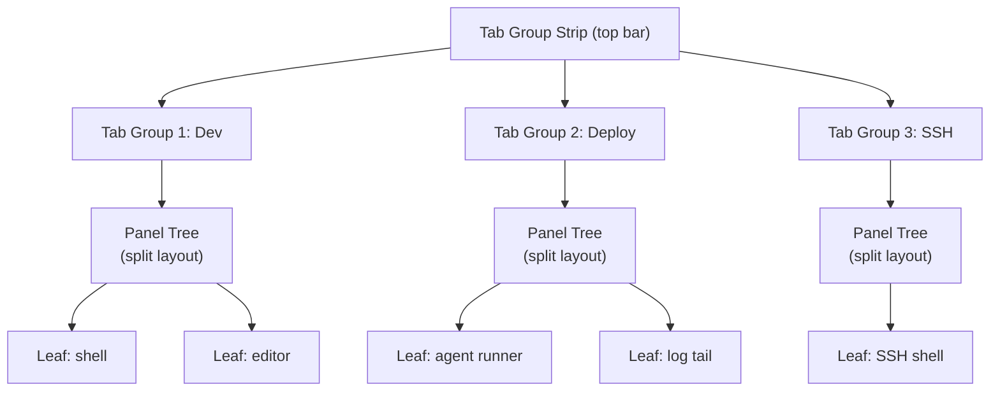
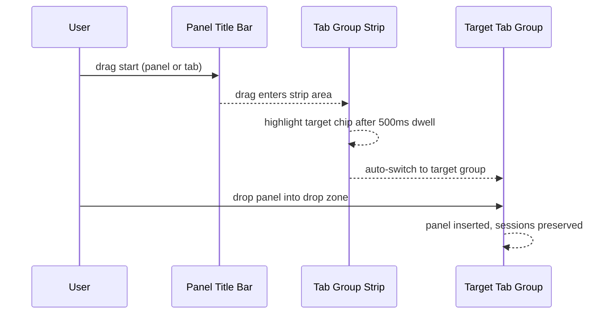
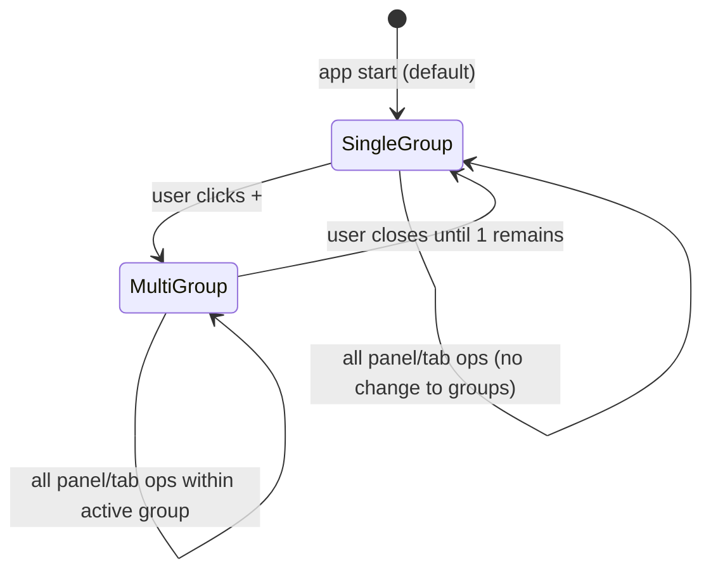
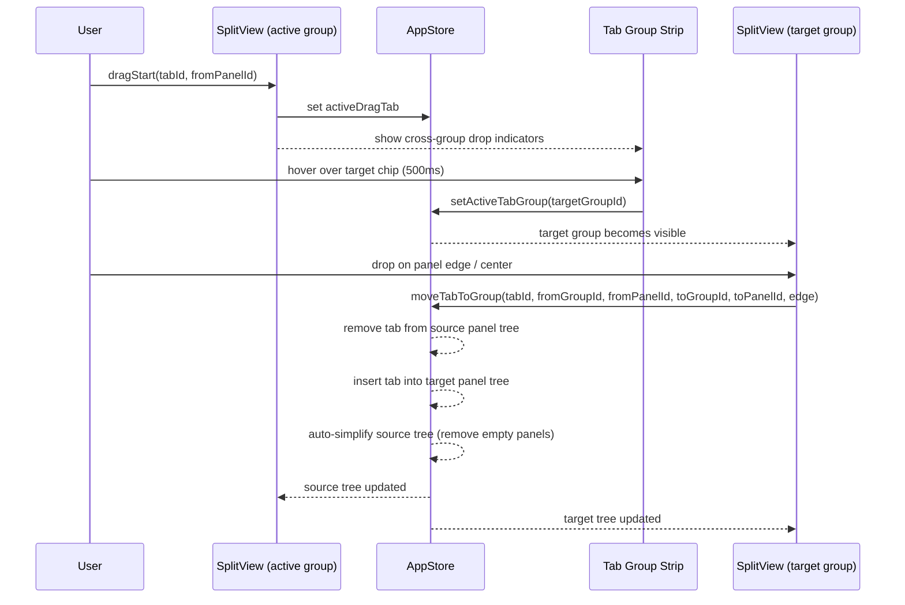
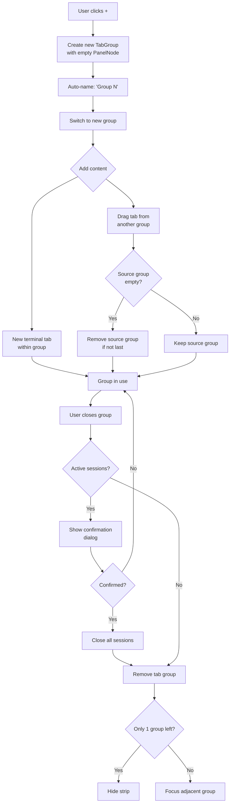

# Concept: Tab Groups (Workspace Tabs with Drag-and-Drop)

> GitHub Issue: [#546](https://github.com/armaxri/termiHub/issues/546)

---

## Overview

termiHub currently supports a single split-panel workspace: one panel tree is visible at a time, and users split it horizontally or vertically to arrange multiple terminals side by side. This works well for a handful of panels, but breaks down for users who maintain several distinct workflow contexts simultaneously — for example, a deployment context (agent runner + log tail), a local dev context (shell + editor), and an SSH context (remote shell + SFTP).

**Tab Groups** introduce a top-level tabbed layer above the existing panel tree. Each **tab group** is an independent panel tree (any split layout) that can be named, reordered, and switched instantly. Terminal sessions are never torn down when switching tab groups — they are simply hidden, exactly as panels are already hidden when their tab is not active. Users can also **drag and drop** individual panels or tabs between tab groups, so moving a terminal from one context to another is frictionless.



---

## UI Interface

### Tab Group Strip

A horizontal strip sits above the existing split-view area, below the window title bar / activity bar. It contains:

- One **tab group chip** per tab group, showing its name and a close button (×)
- A **+ button** on the right to create a new empty tab group
- The active tab group chip is highlighted (similar to VS Code editor group tabs)
- Chips are **reorderable** via drag-and-drop within the strip

```
┌─────────────────────────────────────────────────────────┐
│  [Dev ×]  [Deploy ×]  [SSH ×]  [+]                      │  ← Tab Group Strip
├─────────────────────────────────────────────────────────┤
│  ┌──────────────────┬──────────────────┐                │
│  │  shell  ×        │  editor  ×       │                │  ← current group's
│  ├──────────────────┼──────────────────┤                │    panel tree
│  │  $ _             │  main.rs         │                │
│  │                  │                  │                │
│  └──────────────────┴──────────────────┘                │
└─────────────────────────────────────────────────────────┘
```

Tab group chip interactions:

| Action                   | Result                                                        |
| ------------------------ | ------------------------------------------------------------- |
| Click chip               | Switch to that tab group (instant, no session teardown)       |
| Double-click chip        | Inline rename                                                 |
| Right-click chip         | Context menu: Rename, Duplicate, Move Left, Move Right, Close |
| Drag chip                | Reorder within the strip                                      |
| Drag chip onto drop zone | (see cross-group drag-and-drop below)                         |
| Click ×                  | Close tab group (prompts if it contains sessions)             |
| Click +                  | Create new empty tab group, focus it                          |

### Within a Tab Group

The panel tree inside a tab group is identical to today's split view — full drag-and-drop between panels, tab reordering, splits, etc. Nothing changes inside a tab group from the user's perspective.

### Cross-Tab-Group Drag-and-Drop

Users can move content from one tab group to another in two ways:

#### 1. Panel drag to the Tab Group Strip

When the user drags a **panel** (by its title/tab bar), holding the drag over the tab group strip for ~500 ms activates that tab group ("dwell-to-switch"). They can then drop the panel into any position within the newly visible panel tree.



#### 2. Drag a tab to a tab group chip

When the user drags an **individual tab** (not a whole panel), they can drop it directly onto a tab group chip in the strip. The tab (and its session) moves to that tab group, appearing in a new leaf panel or into an existing panel depending on the drop target.

```
Drag tab "ssh-prod" from Deploy group → hover over [Dev ×] chip → drop
→ tab moves to Dev group, session alive, no reconnect needed
```

#### Drop Targets during Cross-Group Drag

| Drop target                        | Behavior                                                                |
| ---------------------------------- | ----------------------------------------------------------------------- |
| Tab group chip                     | Tab moves to that group as a new single-panel leaf                      |
| Edge of a panel in another group   | Tab creates a split in the target panel (same as intra-group edge drop) |
| Center of a panel in another group | Tab joins that panel's tab list                                         |

### Closing a Tab Group

- If all tabs have saved/idle sessions: close immediately
- If any tab has an active/running session: show confirmation dialog listing the active sessions
- Last tab group cannot be closed (the × is hidden when only one group exists)

### Visual Design

- Tab group strip uses the same color scheme as the existing tab bar, but slightly more prominent (larger chips, bold active group name)
- Each tab group chip can optionally show a colored dot (user-assigned, same palette as tab colors) for quick visual identification
- The strip collapses (is hidden) when there is only one tab group, to avoid visual noise for users who don't use this feature

---

## General Handling

### Session Preservation

Terminal sessions are **never destroyed** when switching tab groups. The `TerminalRegistry` DOM-parking mechanism already handles this today for intra-panel moves. Tab groups extend this: all leaf panels in inactive tab groups are rendered but hidden (CSS `display: none` or `visibility: hidden`), keeping xterm instances and PTY sessions fully alive.

### Keyboard Navigation

| Shortcut                        | Action                            |
| ------------------------------- | --------------------------------- |
| `Ctrl+Shift+[` / `Ctrl+Shift+]` | Switch to previous/next tab group |
| `Ctrl+Shift+<N>` (1–9)          | Switch to Nth tab group           |
| `Ctrl+Shift+T`                  | New tab group                     |
| `Ctrl+Shift+W`                  | Close current tab group           |

These follow the pattern of browser tab shortcuts and are discoverable via the existing keyboard shortcut overlay.

### Workspace Integration

Workspace definitions (the `WorkspaceDefinition` type) currently describe a single panel tree. With tab groups, a workspace can optionally define **multiple panel trees** (one per tab group). Existing single-tree workspaces remain valid and open as a single tab group.

### Persistence

The active tab group and all tab groups' panel trees are serialized into the existing app state that is saved and restored across app restarts.

---

## States & Sequences

### Tab Group State Machine



### Cross-Group Tab Move Sequence



### Tab Group Lifecycle



---

## Preliminary Implementation Details

> Note: This section reflects the codebase state at the time of concept creation (2026-03-22). The implementation may need to adapt as the codebase evolves.

### New Data Types

```typescript
// New top-level concept
interface TabGroup {
  id: string;
  name: string;
  color?: string; // optional accent color for the chip
  rootPanel: PanelNode; // existing panel tree type, unchanged
}

// App state gains a tab groups array
interface AppState {
  // existing fields unchanged...
  tabGroups: TabGroup[];
  activeTabGroupId: string;
}
```

Migrating existing state is straightforward: wrap the current `rootPanel` in a single `TabGroup` named `"Main"`.

### Store Changes (`appStore.ts`)

New actions:

```typescript
addTabGroup(name?: string): string          // returns new group id
closeTabGroup(groupId: string): void
renameTabGroup(groupId: string, name: string): void
setActiveTabGroup(groupId: string): void
reorderTabGroups(fromIndex: number, toIndex: number): void
moveTabToGroup(tabId, fromGroupId, fromPanelId, toGroupId, toPanelId, edge): void
```

All existing panel/tab actions gain an implicit `groupId` scope — they operate on the active tab group's `rootPanel` by default. This is a non-breaking change since callers don't need to pass `groupId` explicitly (defaults to `activeTabGroupId`).

### Component Changes

**New component: `TabGroupStrip`**

- Rendered above `SplitView`, inside the main layout
- Uses dnd-kit `SortableContext` for chip reordering
- Each chip is a `useSortable` item (mirrors how `TabBar` / `Tab` work today)
- Drop targets on chips for cross-group tab drops (use `useDroppable`)
- Hidden via CSS when `tabGroups.length === 1`

**`SplitView` changes**

- Receives `tabGroups` array and `activeTabGroupId`
- Renders one `PanelNodeRenderer` per tab group, all mounted, only active one visible:

  ```tsx
  {
    tabGroups.map((group) => (
      <div key={group.id} style={{ display: group.id === activeTabGroupId ? "flex" : "none" }}>
        <PanelNodeRenderer node={group.rootPanel} />
      </div>
    ));
  }
  ```

  This ensures all terminal DOM elements stay mounted (sessions alive).

**`DndContext` extension**

The existing `DndContext` in `SplitView` handles intra-group drops. Cross-group drops need the drag to escape the current group's DndContext and land on `TabGroupStrip` chips. Options:

1. **Lift DndContext** to the root layout level (wraps both `TabGroupStrip` and `SplitView`) — simplest approach, one unified drag context
2. **Nested DndContext** with portal-based drag overlay — more complex, not recommended

Option 1 is preferred. The drag overlay (ghost image) already uses a portal in dnd-kit, so lifting `DndContext` has no visual side effects.

### Workspace Definition Extension

```typescript
interface WorkspaceDefinition {
  id: string;
  name: string;
  // existing single-layout field kept for backward compatibility:
  layout?: WorkspaceLayoutNode;
  // new multi-group field:
  tabGroups?: Array<{
    name: string;
    color?: string;
    layout: WorkspaceLayoutNode;
  }>;
}
```

`buildPanelTreeFromWorkspace` is called once per tab group entry. `captureCurrentLayout` is extended to capture all tab groups.

### Sizing and Rendering Performance

All terminal DOM elements are always mounted (for session preservation). With many tab groups containing many panels, this could add DOM pressure. Mitigations:

- Inactive tab groups use `display: none`, which removes them from layout calculations (no reflow cost)
- xterm instances in invisible panels do not animate or re-render
- A future optimization could lazily unmount tab groups that have been inactive for a configurable duration (with session-preservation via the existing TerminalRegistry parking mechanism)

### Migration Path

1. On first launch after upgrade: wrap existing `rootPanel` in `TabGroup { id: uuid(), name: "Main" }`
2. Existing workspace definitions with `layout` (no `tabGroups`) continue to work unchanged
3. No changes to the Rust backend — tab groups are purely a frontend concept
