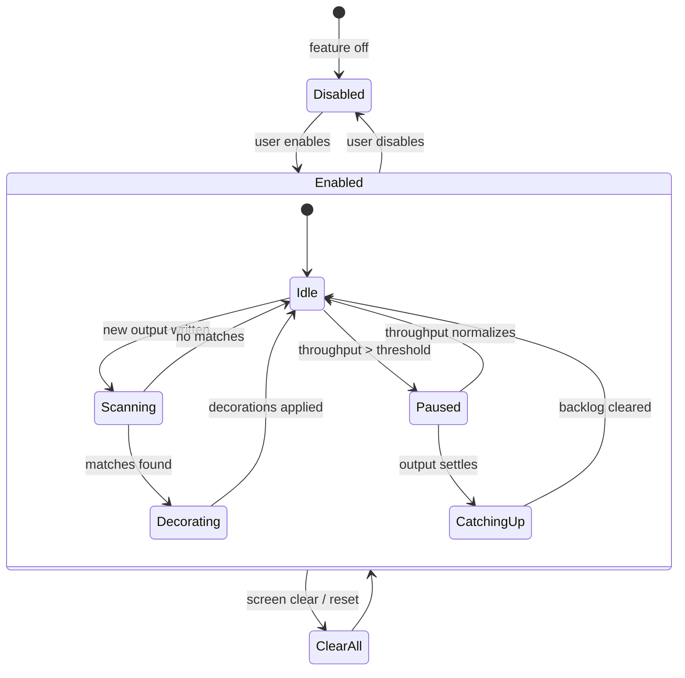
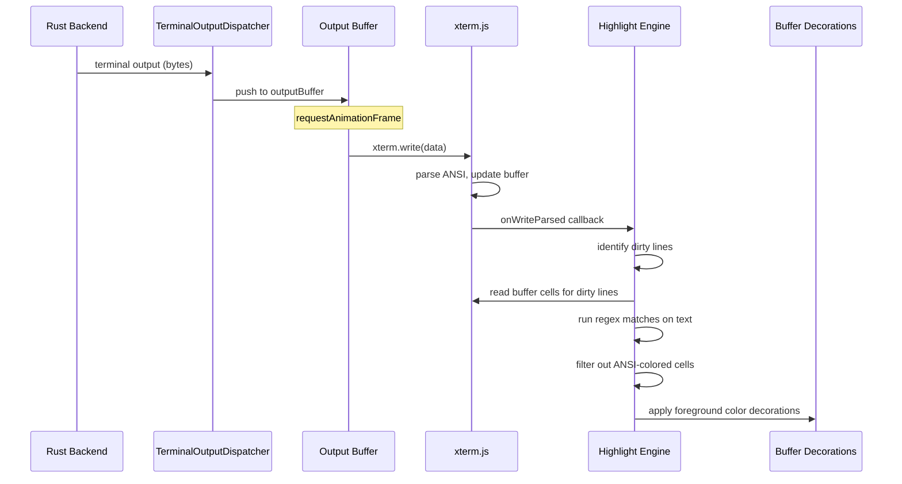
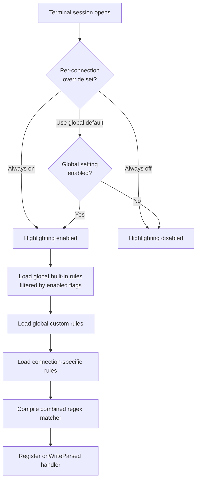
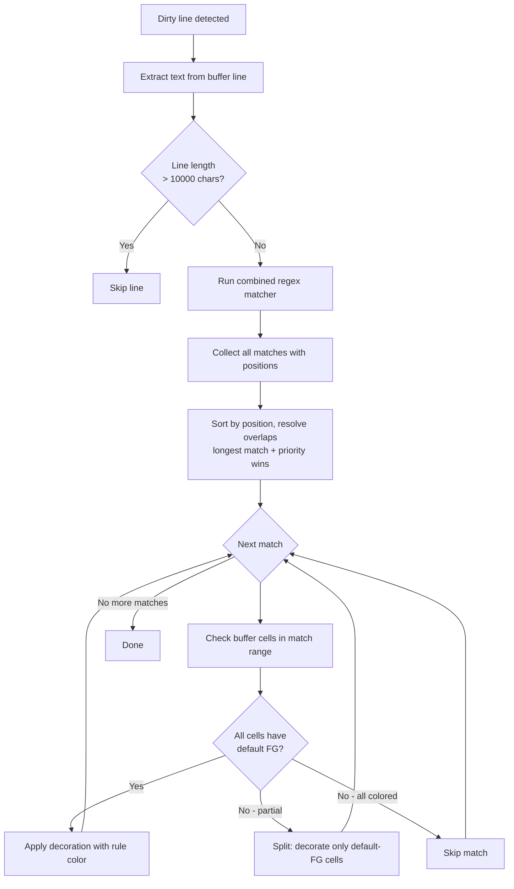
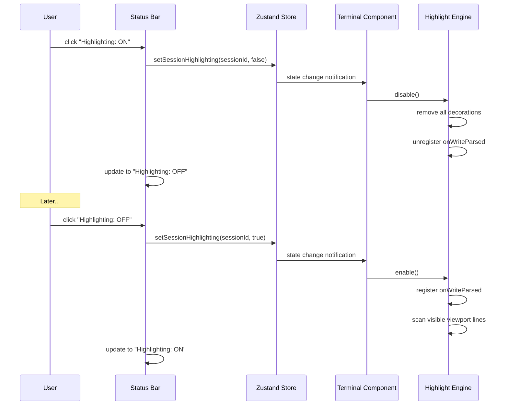
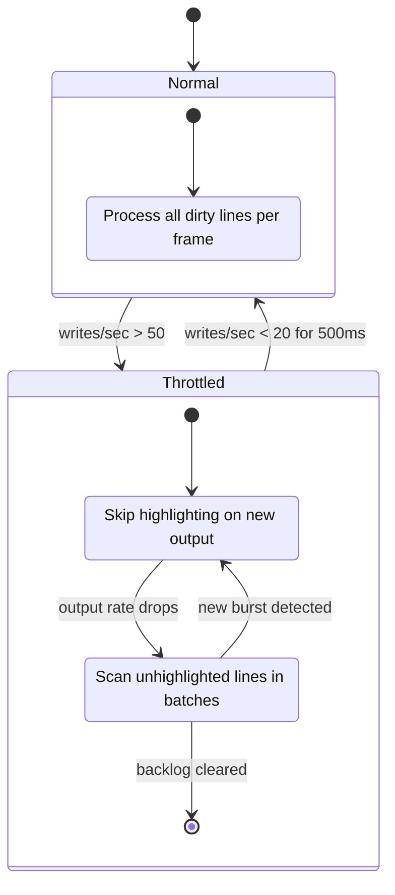
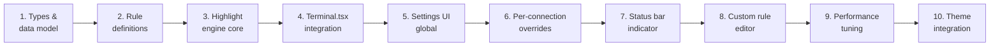

# Terminal Output Syntax Highlighting

> GitHub Issue: [#522](https://github.com/armaxri/termiHub/issues/522)

## Overview

Add client-side syntax highlighting to terminal output, colorizing recognizable patterns — commands, file paths, IP addresses, URLs, numbers, error/success keywords, and quoted strings — directly in the xterm.js terminal view.

**Motivation**: Tools like MobaXterm highlight syntax in terminal output for improved readability. While modern shells provide their own coloring (via `LS_COLORS`, prompt themes, `--color` flags), much terminal output arrives as plain uncolored text — log files, `cat` output, build results, configuration dumps, and commands that don't emit ANSI color. Client-side highlighting fills this gap without requiring server-side configuration.

**Key goals**:

- **Improved readability**: Colorize plain-text output so patterns like errors, paths, and URLs stand out visually
- **Non-destructive**: Never override colors already set by ANSI escape sequences from the remote server
- **Performant**: Regex matching must not introduce visible input lag or rendering delays
- **Configurable**: Enable/disable globally and per-connection, with customizable highlight rules
- **Extensible**: Built-in rule set plus user-defined custom rules (regex → color mapping)

### Built-in Highlight Categories

| Priority | Category         | Examples                                         | Default Color     |
| -------- | ---------------- | ------------------------------------------------ | ----------------- |
| P0       | Error keywords   | `ERROR`, `FAIL`, `FATAL`, `CRITICAL`, `DENIED`   | Red               |
| P0       | Warning keywords | `WARN`, `WARNING`, `DEPRECATED`                  | Yellow/Orange     |
| P0       | Success keywords | `OK`, `PASS`, `SUCCESS`, `DONE`, `CONNECTED`     | Green             |
| P0       | URLs             | `https://example.com`, `http://...`, `ftp://...` | Blue (underlined) |
| P1       | File paths       | `/usr/local/bin/foo`, `./config.json`, `~/docs`  | Cyan              |
| P1       | IP addresses     | `192.168.1.1`, `::1`, `fe80::1%eth0`             | Magenta           |
| P1       | Numbers          | `42`, `3.14`, `0xFF`, `1,234,567`                | Bright cyan       |
| P2       | Quoted strings   | `"hello world"`, `'config value'`                | Yellow            |
| P2       | Email addresses  | `user@example.com`                               | Blue (underlined) |
| P2       | MAC addresses    | `00:1A:2B:3C:4D:5E`                              | Magenta           |
| P3       | Dates/times      | `2026-03-21`, `14:30:05`, ISO 8601 timestamps    | Bright green      |
| P3       | UUIDs            | `550e8400-e29b-41d4-a716-446655440000`           | Dim/muted         |
| P3       | Hex values       | `0xDEADBEEF`, `#FF5733`                          | Bright cyan       |

---

## UI Interface

### Settings Panel — Syntax Highlighting Category

A new **Syntax Highlighting** section appears in the **Terminal** settings category:

```
┌─ Terminal Settings ────────────────────────────────────────┐
│                                                            │
│  ... (existing terminal settings: scrollback, cursor, ...) │
│                                                            │
│  ─── Syntax Highlighting ───                               │
│                                                            │
│  ENABLE SYNTAX HIGHLIGHTING                                │
│  [✓]                                                       │
│  Colorize patterns in terminal output (errors, paths,      │
│  URLs, etc.). Does not override server-sent ANSI colors.   │
│                                                            │
│  BUILT-IN RULES                                            │
│  ┌────────────────────────────────────────────────────┐    │
│  │ [✓] Error keywords    ERROR, FAIL, FATAL    ■ Red │    │
│  │ [✓] Warning keywords  WARN, WARNING         ■ Yel │    │
│  │ [✓] Success keywords  OK, PASS, SUCCESS     ■ Grn │    │
│  │ [✓] URLs              https://...           ■ Blu │    │
│  │ [✓] File paths        /usr/local/...        ■ Cyn │    │
│  │ [✓] IP addresses      192.168.1.1           ■ Mag │    │
│  │ [✓] Numbers           42, 3.14, 0xFF        ■ BCy │    │
│  │ [ ] Quoted strings    "hello", 'world'      ■ Yel │    │
│  │ [ ] Email addresses   user@example.com      ■ Blu │    │
│  │ [ ] MAC addresses     00:1A:2B:...          ■ Mag │    │
│  │ [ ] Dates/times       2026-03-21            ■ BGr │    │
│  │ [ ] UUIDs             550e8400-...          ■ Dim │    │
│  │ [ ] Hex values        0xDEADBEEF            ■ BCy │    │
│  └────────────────────────────────────────────────────┘    │
│  P0 and P1 rules enabled by default; P2/P3 off by default │
│                                                            │
│  CUSTOM RULES                                              │
│  ┌────────────────────────────────────────────────────┐    │
│  │ (no custom rules)                                  │    │
│  │                                                    │    │
│  │ [+ Add Rule]                                       │    │
│  └────────────────────────────────────────────────────┘    │
│                                                            │
└────────────────────────────────────────────────────────────┘
```

### Custom Rule Editor

Clicking **"+ Add Rule"** opens an inline editor:

```
┌─ New Custom Rule ─────────────────────────────────────────┐
│                                                            │
│  NAME                                                      │
│  [                                          ]              │
│                                                            │
│  PATTERN (regex)                                           │
│  [                                          ]              │
│  Case sensitive [✓]   Whole word [ ]                       │
│                                                            │
│  STYLE                                                     │
│  Color: [■ #FF5733 ▾]                                      │
│  Bold: [ ]   Italic: [ ]   Underline: [ ]                 │
│                                                            │
│  PREVIEW                                                   │
│  ┌──────────────────────────────────────────────┐          │
│  │ $ cat server.log                             │          │
│  │ [INFO] Server started on port 8080           │          │
│  │ [ERROR] Connection refused to 10.0.0.1       │          │
│  │ Processing file /tmp/data.csv ...            │          │
│  │ Result: 42 items found                       │          │
│  └──────────────────────────────────────────────┘          │
│  Shows how the rule highlights sample terminal output      │
│                                                            │
│  [Cancel]                              [Save Rule]         │
└────────────────────────────────────────────────────────────┘
```

The preview box renders a static sample of terminal-like text with the current rule applied, giving users immediate visual feedback. When editing an existing rule, the preview also shows other active rules so users can see interactions.

### Per-Connection Override

In the **Connection Editor → Terminal** tab, a syntax highlighting toggle lets users override the global setting:

```
┌─ Connection Terminal Settings ──────────────────────────┐
│                                                          │
│  ... (existing per-connection settings) ...              │
│                                                          │
│  SYNTAX HIGHLIGHTING                                     │
│  [Use global default ▾]                                  │
│   ┌───────────────────┐                                  │
│   │ Use global default│  ← follows global on/off         │
│   │ Always on         │  ← force enable for this conn    │
│   │ Always off        │  ← force disable for this conn   │
│   └───────────────────┘                                  │
│                                                          │
│  ADDITIONAL RULES FOR THIS CONNECTION                    │
│  ┌──────────────────────────────────────────────┐        │
│  │ (inherit global rules)                        │        │
│  │                                               │        │
│  │ [+ Add Connection Rule]                       │        │
│  └──────────────────────────────────────────────┘        │
│  Connection-specific rules are applied after global      │
│  rules. They can add new patterns but not remove         │
│  global rules.                                           │
│                                                          │
└──────────────────────────────────────────────────────────┘
```

### Status Bar Indicator

When syntax highlighting is active for a terminal session, a small indicator appears in the status bar:

```
┌──────────────────────────────────────────────────────────┐
│ ● Connected  |  bash  |  Highlighting: ON  |  UTF-8     │
└──────────────────────────────────────────────────────────┘
```

Clicking the indicator toggles highlighting on/off for the current session (temporary override, not persisted).

---

## General Handling

### Core Workflow

1. **User opens a terminal session** — the terminal component checks whether syntax highlighting is enabled (global setting → per-connection override)
2. **Output arrives** — data flows through the existing buffered pipeline (`TerminalOutputDispatcher` → `outputBuffer` → `requestAnimationFrame` → `xterm.write()`)
3. **After xterm.js parses the output** — the highlighting engine scans newly written lines in the terminal buffer for pattern matches
4. **Decorations are applied** — matched ranges receive xterm.js buffer decorations (foreground color overlays) on cells that don't already have ANSI-set foreground colors
5. **User scrolls** — decorations persist in the buffer; no re-scanning needed for already-decorated lines
6. **User toggles highlighting off** — all decorations are removed; the terminal shows raw output

### ANSI Color Conflict Avoidance

The most critical design constraint: **never override colors set by the remote server**.

Strategy:

1. After xterm.js writes and parses output, inspect the terminal buffer cells for the newly written range
2. For each cell in a potential match range, check `cell.isFgDefault()` (or equivalent — whether the foreground was set by an ANSI SGR sequence)
3. **Only apply highlighting to cells with default (unset) foreground color**
4. If a match partially overlaps ANSI-colored text, split the decoration — only highlight the uncolored segments

```
Server output:        [ERROR] Failed to connect to 192.168.1.1
ANSI-colored by server: ^^^^^^^^^^^  (red via ANSI SGR)
Highlighting applied:                                   ^^^^^^^^^^^
                                                         IP address
```

This ensures server-intended coloring always takes precedence.

### Performance Strategy

Terminal output can be high-throughput (megabytes/second for `cat` of large files). The highlighting engine must not introduce lag.

1. **Post-write scanning only**: Highlight after `xterm.write()` completes (using `xterm.onWriteParsed` callback), not by intercepting the data stream
2. **Line-based processing**: Scan only newly written/changed lines, not the entire buffer
3. **Compiled regex set**: Pre-compile all active rule regexes into a single combined pattern (or use a multi-pattern matcher) at rule-change time, not per-write
4. **Debounced batch processing**: During high-throughput output (e.g., `cat` of a large file), batch decoration updates and apply them in animation frame callbacks
5. **Line budget**: Process at most N lines per frame (e.g., 100 lines). If output arrives faster, queue remaining lines and process in subsequent frames
6. **Dirty line tracking**: Track which lines have been scanned. On new writes, only scan newly dirty lines. Avoid re-scanning already-highlighted lines.
7. **Quick bail-out**: If the terminal is receiving data faster than a threshold (e.g., >50 writes/second), pause highlighting and catch up when output settles

### Rule Evaluation Order

When multiple rules match overlapping text on the same line:

1. **Longest match wins** — if an IP address `192.168.1.1` also matches the "numbers" rule on `192`, the IP rule takes precedence because it's a longer match
2. **Higher priority wins on equal length** — P0 rules beat P1 rules
3. **First match wins on equal priority** — left-to-right, first rule in the list
4. **User custom rules are evaluated after built-in rules** — custom rules can add new highlights but built-in rules match first
5. **Connection-specific rules** are evaluated after global custom rules

### Edge Cases

- **Wrapped lines**: xterm.js wraps long lines across multiple buffer rows. The highlight engine must check `isWrapped` on buffer lines and treat consecutive wrapped lines as a single logical line for pattern matching.
- **Partial writes**: Terminal output may arrive in chunks mid-line. Highlighting should defer until the line is "complete" (next newline or a debounce timeout).
- **Terminal resize**: When the terminal is resized, xterm.js reflows the buffer. Decorations may need to be recomputed for reflowed lines. Listen to `xterm.onResize` and mark reflowed lines as dirty.
- **Screen clear / reset**: On `\033[2J` (clear screen) or `\033c` (reset), discard all decoration state. The existing `OutputCoalescer` screen-clear detection can trigger this.
- **Scrollback eviction**: When old lines are evicted from the scrollback buffer, their decorations are automatically cleaned up (xterm.js handles this for buffer decorations).
- **Alternating screen buffer**: Applications like `vim`, `less`, `htop` use the alternate screen buffer. Highlighting should be disabled while the alternate buffer is active (detect via `xterm.buffer.active !== xterm.buffer.normal`).
- **Right-to-left text**: Some terminals output RTL text. The regex patterns assume LTR; this is acceptable as a known limitation — RTL terminals are rare and highlighting is purely additive.
- **Very long lines**: Lines exceeding a threshold (e.g., 10,000 chars) should be skipped to prevent regex backtracking performance issues.

---

## States & Sequences

### Highlighting Engine State Machine



### Output Pipeline with Highlighting



### Settings Resolution Flow



### Rule Matching Flow



### Toggle and Lifecycle



### High-Throughput Handling



---

## Preliminary Implementation Details

> Based on the current termiHub architecture as of issue creation. The codebase may evolve before implementation.

### New Files

| File                                                                 | Purpose                                      |
| -------------------------------------------------------------------- | -------------------------------------------- |
| `src/services/syntaxHighlighting.ts`                                 | Core highlighting engine class               |
| `src/services/syntaxHighlightingRules.ts`                            | Built-in rule definitions and regex patterns |
| `src/components/Settings/SyntaxHighlightingSettings.tsx`             | Global settings UI for highlight rules       |
| `src/components/Settings/CustomRuleEditor.tsx`                       | Inline editor for custom rules               |
| `src/components/ConnectionEditor/ConnectionHighlightingSettings.tsx` | Per-connection override settings             |
| `src/types/syntaxHighlighting.ts`                                    | Type definitions for rules, config, state    |

### Modified Files

| File                                                             | Change                                                |
| ---------------------------------------------------------------- | ----------------------------------------------------- |
| `src/components/Terminal/Terminal.tsx`                           | Instantiate and wire up the highlighting engine       |
| `src/components/Settings/TerminalSettings.tsx`                   | Add link/section for syntax highlighting settings     |
| `src/components/ConnectionEditor/ConnectionTerminalSettings.tsx` | Add syntax highlighting override dropdown             |
| `src/components/StatusBar/StatusBar.tsx`                         | Add highlighting indicator                            |
| `src/store/appStore.ts`                                          | Add syntax highlighting state and per-session toggles |
| `src/types/connection.ts`                                        | Extend `AppSettings` and `TerminalOptions` interfaces |

### Type Definitions (`src/types/syntaxHighlighting.ts`)

```typescript
export interface HighlightStyle {
  color: string; // hex color, e.g. "#FF0000"
  bold?: boolean;
  italic?: boolean;
  underline?: boolean;
}

export interface HighlightRule {
  id: string; // unique identifier
  name: string; // display name
  pattern: string; // regex pattern string
  style: HighlightStyle;
  caseSensitive?: boolean; // default: true
  wholeWord?: boolean; // default: false
  enabled: boolean;
  priority: number; // lower = higher priority (P0=0, P1=1, etc.)
  builtin: boolean; // true for built-in rules, false for user-defined
}

export interface SyntaxHighlightingConfig {
  enabled: boolean; // global enable/disable
  builtinRules: Record<string, boolean>; // rule-id → enabled
  customRules: HighlightRule[]; // user-defined rules
}

// Per-connection override
export type ConnectionHighlightingOverride =
  | "global" // follow global setting
  | "always-on" // force enable
  | "always-off"; // force disable

export interface ConnectionHighlightingConfig {
  override: ConnectionHighlightingOverride;
  additionalRules: HighlightRule[]; // connection-specific rules
}
```

### Settings Extension (`src/types/connection.ts`)

```typescript
// Add to AppSettings:
export interface AppSettings {
  // ... existing fields ...
  syntaxHighlighting?: SyntaxHighlightingConfig;
}

// Add to TerminalOptions (per-connection):
export interface TerminalOptions {
  // ... existing fields ...
  syntaxHighlighting?: ConnectionHighlightingConfig;
}
```

### Highlighting Engine (`src/services/syntaxHighlighting.ts`)

The engine is a class instantiated per terminal:

```typescript
class SyntaxHighlightingEngine {
  private xterm: Terminal;
  private rules: HighlightRule[];
  private combinedRegex: RegExp | null;
  private decorations: Map<number, IDecoration[]>; // line → decorations
  private dirtyLines: Set<number>;
  private enabled: boolean;
  private throttled: boolean;
  private writeCounter: number;
  private disposables: IDisposable[];

  constructor(xterm: Terminal) {
    /* ... */
  }

  enable(rules: HighlightRule[]): void {
    // Compile regex, register onWriteParsed handler
  }

  disable(): void {
    // Remove all decorations, unregister handlers
  }

  updateRules(rules: HighlightRule[]): void {
    // Recompile regex, re-scan visible viewport
  }

  private onWriteParsed(): void {
    // Identify dirty lines, check throughput, schedule scanning
  }

  private scanLines(startLine: number, endLine: number): void {
    // For each line: extract text, run regex, check ANSI colors, apply decorations
  }

  private applyDecoration(
    line: number,
    startCol: number,
    endCol: number,
    style: HighlightStyle
  ): void {
    // Create xterm.js marker + decoration, skip ANSI-colored cells
  }

  dispose(): void {
    // Clean up all decorations and event listeners
  }
}
```

### xterm.js Decoration API Usage

xterm.js provides a `registerDecoration()` API for overlaying styles on buffer ranges:

```typescript
// Create a marker at the target line
const marker = xterm.registerMarker(lineOffset);

// Register a decoration on that marker
const decoration = xterm.registerDecoration({
  marker,
  x: startColumn,
  width: matchLength,
});

// Style the decoration element when it renders
decoration.onRender((element) => {
  element.style.color = rule.style.color;
  if (rule.style.bold) element.style.fontWeight = "bold";
  if (rule.style.underline) element.style.textDecoration = "underline";
});
```

**Note**: The xterm.js decoration API creates DOM elements overlaid on the terminal canvas. For high volumes of decorations, this may have performance implications. An alternative approach is to use the `xterm.buffer` API to directly inspect and modify cell attributes, but this is less clean. The implementation should benchmark both approaches and choose the more performant one.

### Integration in Terminal.tsx

```typescript
// In the terminal setup effect (after xterm is created):
const highlightEngine = new SyntaxHighlightingEngine(xterm);

// Resolve effective settings
const effectiveConfig = resolveHighlightingConfig(
  appSettings.syntaxHighlighting,
  tabTermOpts?.syntaxHighlighting
);

if (effectiveConfig.enabled) {
  const rules = resolveActiveRules(effectiveConfig);
  highlightEngine.enable(rules);
}

// React to settings changes
useEffect(() => {
  const config = resolveHighlightingConfig(/* ... */);
  if (config.enabled) {
    highlightEngine.updateRules(resolveActiveRules(config));
  } else {
    highlightEngine.disable();
  }
}, [syntaxHighlightingSettings]);

// Cleanup
return () => {
  highlightEngine.dispose();
};
```

### Built-in Rule Definitions (`src/services/syntaxHighlightingRules.ts`)

```typescript
export const BUILTIN_RULES: HighlightRule[] = [
  {
    id: "error-keywords",
    name: "Error keywords",
    pattern: "\\b(ERROR|FAIL(ED)?|FATAL|CRITICAL|DENIED|REFUSED|ABORT(ED)?)\\b",
    style: { color: "#F44747" },
    caseSensitive: false,
    priority: 0,
    builtin: true,
    enabled: true,
  },
  {
    id: "warning-keywords",
    name: "Warning keywords",
    pattern: "\\b(WARN(ING)?|DEPRECATED|CAUTION)\\b",
    style: { color: "#CCA700" },
    caseSensitive: false,
    priority: 0,
    builtin: true,
    enabled: true,
  },
  {
    id: "success-keywords",
    name: "Success keywords",
    pattern: "\\b(OK|PASS(ED)?|SUCCESS(FUL)?|DONE|CONNECTED|COMPLETE(D)?)\\b",
    style: { color: "#89D185" },
    caseSensitive: false,
    priority: 0,
    builtin: true,
    enabled: true,
  },
  {
    id: "urls",
    name: "URLs",
    pattern: "(https?|ftp)://[^\\s\"'<>]+",
    style: { color: "#6796E6", underline: true },
    priority: 0,
    builtin: true,
    enabled: true,
  },
  {
    id: "file-paths",
    name: "File paths",
    pattern: "(?:~|\\.\\.?)?/[\\w./-]+",
    style: { color: "#4EC9B0" },
    priority: 1,
    builtin: true,
    enabled: true,
  },
  {
    id: "ip-addresses",
    name: "IP addresses",
    pattern:
      "\\b\\d{1,3}\\.\\d{1,3}\\.\\d{1,3}\\.\\d{1,3}(:\\d+)?\\b|\\[?[0-9a-fA-F:]{2,39}(%.+?)?\\]?",
    style: { color: "#C586C0" },
    priority: 1,
    builtin: true,
    enabled: true,
  },
  {
    id: "numbers",
    name: "Numbers",
    pattern: "\\b(0x[0-9a-fA-F]+|\\d[\\d,]*\\.?\\d*)\\b",
    style: { color: "#B5CEA8" },
    priority: 1,
    builtin: true,
    enabled: true,
  },
  // P2 rules (disabled by default)
  {
    id: "quoted-strings",
    name: "Quoted strings",
    pattern: "\"[^\"\\n]{1,200}\"|'[^'\\n]{1,200}'",
    style: { color: "#CE9178" },
    priority: 2,
    builtin: true,
    enabled: false,
  },
  {
    id: "email-addresses",
    name: "Email addresses",
    pattern: "[\\w.+-]+@[\\w.-]+\\.[a-zA-Z]{2,}",
    style: { color: "#6796E6", underline: true },
    priority: 2,
    builtin: true,
    enabled: false,
  },
  {
    id: "mac-addresses",
    name: "MAC addresses",
    pattern: "\\b([0-9a-fA-F]{2}[:-]){5}[0-9a-fA-F]{2}\\b",
    style: { color: "#C586C0" },
    priority: 2,
    builtin: true,
    enabled: false,
  },
  // P3 rules (disabled by default)
  {
    id: "dates-times",
    name: "Dates/times",
    pattern:
      "\\b\\d{4}-\\d{2}-\\d{2}(T\\d{2}:\\d{2}(:\\d{2}(\\.\\d+)?(Z|[+-]\\d{2}:?\\d{2})?)?)?\\b|\\b\\d{2}:\\d{2}(:\\d{2})?\\b",
    style: { color: "#89D185" },
    priority: 3,
    builtin: true,
    enabled: false,
  },
  {
    id: "uuids",
    name: "UUIDs",
    pattern: "\\b[0-9a-fA-F]{8}-[0-9a-fA-F]{4}-[0-9a-fA-F]{4}-[0-9a-fA-F]{4}-[0-9a-fA-F]{12}\\b",
    style: { color: "#808080" },
    priority: 3,
    builtin: true,
    enabled: false,
  },
];
```

### Theme-Aware Colors

Built-in rule colors should adapt to the active theme. Rather than hardcoding hex values, the rules reference semantic color tokens that resolve through the theme engine:

```typescript
// In syntaxHighlightingRules.ts
export function getThemedRuleColor(ruleId: string): string {
  const theme = getCurrentTheme();
  const colorMap: Record<string, string> = {
    "error-keywords": theme.colors.colorError,
    "warning-keywords": theme.colors.colorWarning,
    "success-keywords": theme.colors.colorSuccess,
    urls: theme.colors.textLink,
    // ... etc
  };
  return colorMap[ruleId] ?? theme.colors.textPrimary;
}
```

Custom user rules use explicit hex colors since they aren't tied to theme semantics.

### Regex Safety

User-defined regex patterns pose a risk of catastrophic backtracking (ReDoS). Mitigations:

1. **Execution timeout**: Run user regex matches with a timeout (e.g., 50ms per line). If a regex exceeds the timeout, disable that rule and notify the user.
2. **Pattern validation**: On rule save, test the regex against a set of adversarial strings. Reject patterns that show exponential behavior.
3. **Length limits**: Cap regex pattern length at 500 characters.
4. **No lookahead/lookbehind for custom rules**: Restrict custom rules to a safe regex subset (optional — may be too limiting).

### Implementation Order



1. **Types & data model** — Define `HighlightRule`, `SyntaxHighlightingConfig`, extend `AppSettings`/`TerminalOptions`
2. **Rule definitions** — Implement built-in rules with tested regex patterns
3. **Highlight engine core** — `SyntaxHighlightingEngine` class with enable/disable/scan/decorate
4. **Terminal integration** — Wire engine into `Terminal.tsx` lifecycle
5. **Global settings UI** — Built-in rule toggles in Terminal settings
6. **Per-connection overrides** — Override dropdown in Connection Editor
7. **Status bar indicator** — Quick toggle indicator
8. **Custom rule editor** — Inline editor with preview
9. **Performance tuning** — Throughput detection, throttling, line budgets
10. **Theme integration** — Semantic color mapping through theme engine

### Testing Strategy

- **Unit tests**: Rule regex matching (verify each built-in pattern matches expected strings and rejects others), overlap resolution logic, ANSI-conflict detection
- **Integration tests**: Engine lifecycle (enable → write → scan → decorate → disable → verify cleanup)
- **Performance tests**: Benchmark scanning throughput with large output volumes (>10,000 lines), verify no frame drops during `cat /dev/urandom | hexdump` style output
- **Manual tests**: Visual verification of highlighting with real terminal sessions, theme switching, per-connection overrides
