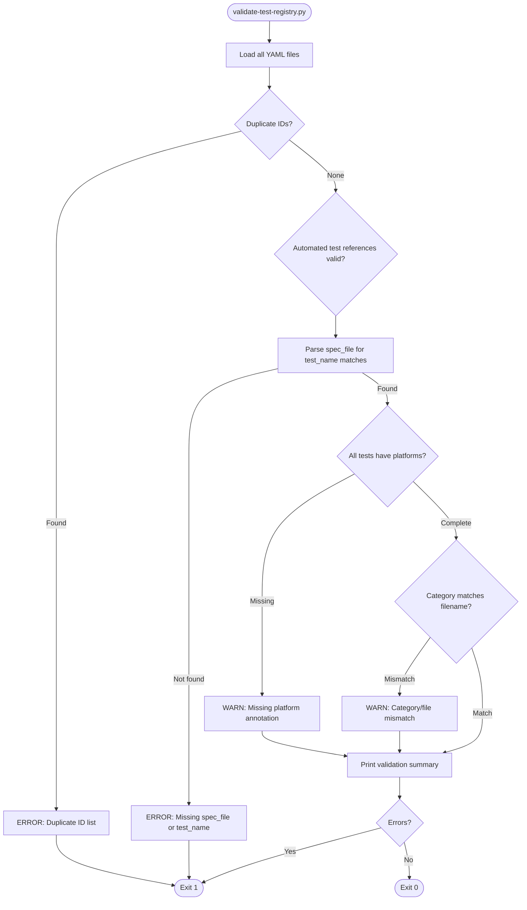

# Unified E2E and Manual Test System

**GitHub Issue:** #390

---

## Overview

termiHub currently maintains two separate systems for verifying user-facing behavior:

1. **WebdriverIO E2E tests** — 45 test files (~11,400 lines of JavaScript), 9 helper modules (~1,286 lines), running via tauri-driver on Linux/Windows. Covers 251 automated test items across UI interaction, connection management, file browsing, SSH/telnet/serial infrastructure, and performance.
2. **YAML + Python guided test runner** (from #384) — 11 YAML files defining 176 manual test items, presented interactively by `scripts/test-manual.py` with automated verification where possible.

Both systems test user-facing behavior but use completely different formats, languages, tooling, and test inventories. When a new feature is added, tests may need to be written in both systems — one in JavaScript using WebdriverIO's API, and another in YAML for the manual runner. There is no single place that defines "all the things we verify for this feature."

### Motivation

- **Dual maintenance burden**: Developers must learn and maintain two testing systems, two DSLs, and two sets of helper abstractions.
- **No unified test inventory**: It is impossible to answer "what are all the verifications for the connection editor?" without consulting both systems.
- **Duplicated domain knowledge**: The WebdriverIO selectors registry (293 lines) and the YAML setup actions encode overlapping knowledge about UI structure.
- **Divergent execution models**: WebdriverIO uses Mocha + `browser.$()` + tauri-driver; the Python runner uses interactive prompts + subprocess-based verification. These cannot share logic.

### Goals

- Evaluate whether the YAML test definitions can become the **single source of truth** for all user-facing tests — both automated and manual.
- Determine the technical feasibility of adding a **WebDriver automation mode** to the Python runner using Selenium.
- Answer the six key questions posed in the issue with concrete technical analysis.
- Recommend the best path forward, considering migration effort, maintenance burden, and capability trade-offs.

### Non-Goals

- Implementing the unified system (this is a concept document only).
- Replacing unit tests or component tests (Vitest/cargo test remain unchanged).
- Building a GUI-based test runner.

---

## Key Questions — Detailed Analysis

### Q1: What is the migration effort to convert 28 WebdriverIO test files to YAML + Python?

**Scope of the current E2E suite:**

| Category                      | Files        | Lines             | Complexity                                            |
| ----------------------------- | ------------ | ----------------- | ----------------------------------------------------- |
| UI tests (no backend)         | 16 files     | ~7,596 lines      | Forms, CRUD, tabs, settings, themes, credentials      |
| Infrastructure tests (Docker) | 18 files     | ~3,805 lines      | SSH, serial, telnet, SFTP, monitoring, tunnels        |
| Helper modules                | 9 files      | ~1,286 lines      | Selectors, app lifecycle, connections, infrastructure |
| Configuration                 | 1 file       | 138 lines         | WebdriverIO + tauri-driver setup                      |
| **Total**                     | **44 files** | **~12,825 lines** |                                                       |

**Migration effort breakdown:**

1. **YAML test definitions (~2–3 weeks)**: Each of the 251 automated test items needs a YAML entry with WebDriver automation steps. Simple tests (field visibility, default values) translate directly. Complex tests (nested folder manipulation, drag-and-drop, sequential multi-step workflows) require careful decomposition.

2. **Python WebDriver engine (~2–3 weeks)**: A new `WebDriverExecutor` class in the Python runner that:
   - Manages a Selenium WebDriver session (connecting to tauri-driver on `127.0.0.1:4444`)
   - Implements a YAML action vocabulary (`click`, `type`, `assert_visible`, `assert_text`, `wait_for`, `select`, `context_click`, etc.)
   - Handles before/after lifecycle hooks (app readiness, cleanup between tests)
   - Captures screenshots on failure
   - Integrates with the existing report format

3. **Selector migration (~1 week)**: The 293-line `selectors.js` must become a Python-accessible registry (either a YAML/JSON file or a Python module). All `data-testid` selectors must be validated against the React components.

4. **Helper logic migration (~2–3 weeks)**: The 1,286 lines of JavaScript helpers encode essential domain logic:
   - `infrastructure.js` (336 lines): SSH/telnet/serial connection creation, password prompt handling, terminal text extraction
   - `monitoring.js` (106 lines): Monitoring widget interaction sequences
   - `tunnels-infra.js` (176 lines): Tunnel lifecycle management
   - `connections.js` (124 lines): Connection CRUD operations
   - `tabs.js` (74 lines): Tab management
   - These must all be reimplemented as Python functions or expressed as reusable YAML action sequences.

5. **Complex test patterns (~2–3 weeks)**: Several test files push beyond simple assertions:
   - `connection-editor-extended.test.js` (1,592 lines): 6+ nesting levels, folder manipulation, icon/color pickers, dynamic form validation, master password flows
   - `file-browser-extended.test.js` (1,044 lines): File upload/download, drag-and-drop, path navigation, context menus
   - `ssh-monitoring.test.js` (745 lines): Stateful monitoring lifecycle with async waits, dropdown interaction, reconnection logic
   - These require either a very expressive YAML DSL or inline Python escape hatches.

**Total estimated effort: 10–14 weeks** for one developer, assuming no regressions and no discovery of blocking technical issues.

**Risk factors:**

- Tauri-driver + Selenium compatibility may have undocumented gaps (see Q2)
- Complex async wait patterns (e.g., `waitForMonitoringStats(15000)`) are hard to express declaratively
- YAML DSL design may need several iterations before stabilizing (see Q4)

---

### Q2: Can Python + Selenium match WebdriverIO's Tauri/tauri-driver integration quality?

**How tauri-driver works:**

tauri-driver is a WebDriver proxy that translates W3C WebDriver protocol commands into Tauri's internal APIs. It listens on port 4444 and exposes a Chrome DevTools Protocol (CDP) endpoint. The WebdriverIO config connects by setting `goog:chromeOptions.debuggerAddress` to `127.0.0.1:4444`.

**Selenium compatibility analysis:**

| Capability                        | WebdriverIO                                       | Python Selenium                                                          | Gap                                                                                                                                            |
| --------------------------------- | ------------------------------------------------- | ------------------------------------------------------------------------ | ---------------------------------------------------------------------------------------------------------------------------------------------- |
| Connect to tauri-driver via CDP   | `debuggerAddress: "127.0.0.1:4444"`               | `selenium.webdriver.ChromeOptions().debugger_address = "127.0.0.1:4444"` | **None** — identical mechanism                                                                                                                 |
| Element selection (`data-testid`) | `browser.$('[data-testid="..."]')`                | `driver.find_element(By.CSS_SELECTOR, '[data-testid="..."]')`            | **None** — standard CSS selectors                                                                                                              |
| Click, type, clear                | `element.click()`, `.setValue()`, `.clearValue()` | `element.click()`, `.send_keys()`, `.clear()`                            | **Minor API differences** — functionally equivalent                                                                                            |
| Wait for element                  | `element.waitForDisplayed({ timeout: 5000 })`     | `WebDriverWait(driver, 5).until(EC.visibility_of_element_located(...))`  | **None** — both support explicit waits                                                                                                         |
| Context menu (right-click)        | `element.click({ button: 'right' })`              | `ActionChains(driver).context_click(element).perform()`                  | **None** — ActionChains equivalent                                                                                                             |
| Keyboard input                    | `browser.keys(['Control', 'a'])`                  | `ActionChains(driver).key_down(Keys.CONTROL).send_keys('a').perform()`   | **Minor API differences**                                                                                                                      |
| Drag and drop                     | `element.dragAndDrop(target)`                     | `ActionChains(driver).drag_and_drop(source, target).perform()`           | **Known issue** — Selenium drag-and-drop has historically been unreliable with HTML5 DnD. Workarounds (JS injection) exist but add complexity. |
| Screenshot on failure             | `browser.saveScreenshot(path)`                    | `driver.save_screenshot(path)`                                           | **None**                                                                                                                                       |
| Execute JavaScript                | `browser.execute(script)`                         | `driver.execute_script(script)`                                          | **None** — both support arbitrary JS execution                                                                                                 |
| Performance metrics               | `browser.execute(() => performance.memory)`       | `driver.execute_script('return performance.memory')`                     | **None** — same mechanism                                                                                                                      |
| `tauri:options` capability        | Supported natively                                | Must be passed as experimental capability                                | **Minor** — `ChromeOptions.set_capability('tauri:options', {...})` works                                                                       |

**Key technical risks:**

1. **Drag-and-drop reliability**: Selenium's `ActionChains.drag_and_drop()` has well-documented issues with HTML5 drag events. The current E2E suite tests tab reordering and file browser drag-and-drop. Workaround: inject JavaScript to simulate drag events directly, which is what many Selenium projects do.

2. **`tauri:options` passthrough**: tauri-driver expects `tauri:options.application` in the WebDriver capabilities to know which binary to launch. Selenium's `ChromeOptions` supports this via `set_capability()`, but it is not a first-class feature — any future tauri-driver capability extensions might require manual plumbing.

3. **Browser context isolation**: WebdriverIO creates a fresh browser session per spec file automatically. In Selenium, session management is manual — the Python runner must handle session creation/teardown, which is additional code but straightforward.

4. **Async timing**: WebdriverIO's `browser.pause(300)` is used heavily in the test suite (appears 100+ times) for UI settling. Selenium's `time.sleep()` is the equivalent but encourages the same anti-pattern. A well-designed Python executor should use explicit waits (`WebDriverWait`) where possible, but some `pause(300)` calls are genuinely needed for CSS transition timing.

**Verdict:** Python + Selenium **can** match WebdriverIO's integration quality for ~95% of the test suite. The remaining ~5% (drag-and-drop edge cases, performance metric collection via CDP) requires workarounds that are well-documented but add complexity. There is no fundamental protocol-level barrier — both use the same W3C WebDriver protocol through tauri-driver.

---

### Q3: How do we handle tests that need complex setup logic (currently in JS helper files)?

The 9 helper modules (1,286 lines) encode three categories of logic:

**Category 1: UI interaction sequences (reusable as YAML action templates)**

Helpers like `createLocalConnection(name)`, `openNewConnectionEditor()`, and `closeAllTabs()` are sequences of WebDriver actions that map directly to YAML action lists:

```yaml
# Current JS helper: createLocalConnection(name)
templates:
  create_local_connection:
    params: [name]
    actions:
      - call: open_new_connection_editor
      - type: { selector: "[data-testid='connection-editor-name-input']", text: "{{name}}" }
      - select: { selector: "[data-testid='connection-editor-type-select']", value: "local" }
      - click: "[data-testid='connection-editor-save']"
      - wait_for_hidden: "[data-testid='connection-editor-name-input']"
```

This approach works well for ~60% of the helper logic (app.js, connections.js, sidebar.js, tabs.js).

**Category 2: Infrastructure interaction with async waits (require Python functions)**

Helpers like `handlePasswordPrompt(password, timeout)`, `waitForMonitoringStats(timeout)`, and `verifyTerminalRendered(waitMs)` involve conditional logic, timeouts, and DOM queries that are difficult to express in YAML:

```javascript
// Current JS: verifyTerminalRendered
export async function verifyTerminalRendered(waitMs = 5000) {
  const xtermEl = await browser.$(".xterm");
  if (await xtermEl.isExisting()) {
    await xtermEl.waitForDisplayed({ timeout: waitMs });
    return true;
  }
  const canvas = await browser.$("canvas");
  return canvas.isDisplayed();
}
```

These must be implemented as **Python helper functions** that the YAML executor can call:

```yaml
verification:
  type: webdriver
  steps:
    - call_helper: handle_password_prompt
      args: { password: "testpass", timeout: 5000 }
    - call_helper: verify_terminal_rendered
      args: { wait_ms: 3000 }
```

The Python runner would maintain a `helpers/` module with functions like:

```python
# scripts/test_helpers/infrastructure.py
def handle_password_prompt(driver, password, timeout=5000):
    wait = WebDriverWait(driver, timeout / 1000)
    input_el = wait.until(
        EC.visibility_of_element_located((By.CSS_SELECTOR, SELECTORS['password_prompt_input']))
    )
    input_el.send_keys(password)
    driver.find_element(By.CSS_SELECTOR, SELECTORS['password_prompt_connect']).click()
```

**Category 3: Dynamic assertion logic (require Python or inline JS)**

Some tests use complex assertion patterns:

```javascript
// Iterate all tabs, filter by title prefix, count matches
const tabs = await browser.$$('[data-testid^="tab-"]');
let sshCount = 0;
for (const tab of tabs) {
  if ((await tab.getText()).startsWith("SSH")) sshCount++;
}
expect(sshCount).toBe(3);
```

These require either:

- A `call_helper` action that invokes a Python function returning a result for assertion
- An `execute_js` action that runs arbitrary JavaScript and asserts on the return value
- A dedicated assertion action: `assert_count: { selector: "[data-testid^='tab-']", text_starts_with: "SSH", expected: 3 }`

**Recommendation:** Use a **layered approach**:

1. **YAML action vocabulary** for simple, common interactions (click, type, select, assert_visible, wait_for)
2. **YAML templates** for reusable multi-step sequences (create_connection, close_all_tabs)
3. **Python helper functions** for complex logic (password prompts, terminal verification, monitoring stats)
4. **`execute_js` escape hatch** for one-off JavaScript execution when needed

This keeps the YAML readable for ~80% of tests while allowing full programmatic control for the remaining ~20%.

---

### Q4: Does the YAML DSL for WebDriver actions become unwieldy for complex interaction sequences?

**Analysis by test complexity tier:**

**Tier 1 — Simple assertions (40% of tests): YAML excels**

```yaml
# Example: "SSH port defaults to 22"
- id: E2E-CONN-FORM-01
  name: "SSH port defaults to 22"
  verification:
    type: webdriver
    steps:
      - call: open_new_connection_editor
      - select: { selector: "[data-testid='connection-editor-type-select']", value: "ssh" }
      - assert_value: { selector: "[data-testid='ssh-settings-port-input']", expected: "22" }
      - call: cancel_editor
```

Clear, readable, easy to maintain. The YAML is arguably **more readable** than the equivalent JavaScript.

**Tier 2 — Multi-step workflows (35% of tests): YAML is adequate with templates**

```yaml
# Example: "Create SSH connection and verify monitoring"
- id: E2E-SSH-MON-01
  name: "Auto-show monitoring stats on SSH tab open"
  verification:
    type: webdriver
    setup:
      - call: create_ssh_connection
        args: { name: "{{unique_name}}", host: "127.0.0.1", port: "2201" }
      - call: connect_by_name
        args: { name: "{{unique_name}}" }
      - call: handle_password_prompt
        args: { password: "testpass" }
      - call: verify_terminal_rendered
    steps:
      - call: wait_for_monitoring_stats
        args: { timeout: 15000 }
      - assert_visible: "[data-testid='monitoring-cpu']"
      - assert_visible: "[data-testid='monitoring-mem']"
```

Manageable, but the `call` actions hide complexity. A developer reading this YAML must look up the helper implementations to understand what `handle_password_prompt` actually does.

**Tier 3 — Complex stateful workflows (25% of tests): YAML becomes unwieldy**

Consider `connection-editor-extended.test.js` (1,592 lines). A single test in this file:

```javascript
it("should place a new connection in the folder when created via folder context menu", async () => {
  const folderName = uniqueName("ctx-folder");
  const newFolderBtn = await browser.$(CONNECTION_LIST_NEW_FOLDER);
  await newFolderBtn.waitForDisplayed({ timeout: 3000 });
  await newFolderBtn.click();
  await browser.pause(300);

  const folderInput = await browser.$(INLINE_FOLDER_NAME_INPUT);
  await folderInput.waitForDisplayed({ timeout: 3000 });
  await folderInput.setValue(folderName);
  const confirmBtn = await browser.$(INLINE_FOLDER_CONFIRM);
  await confirmBtn.click();
  await browser.pause(300);

  const folders = await browser.$$('[data-testid^="folder-toggle-"]');
  let folderEl = null;
  for (const f of folders) {
    const text = await f.getText();
    if (text.includes(folderName)) {
      folderEl = f;
      break;
    }
  }
  await folderEl.click({ button: "right" });
  // ... another 20 lines of context menu + assertion
});
```

The YAML equivalent:

```yaml
steps:
  - set_var: { name: folder_name, value: "{{unique_name('ctx-folder')}}" }
  - wait_for: { selector: "[data-testid='connection-list-new-folder']", timeout: 3000 }
  - click: "[data-testid='connection-list-new-folder']"
  - pause: 300
  - wait_for: { selector: "[data-testid='inline-folder-name-input']", timeout: 3000 }
  - type: { selector: "[data-testid='inline-folder-name-input']", text: "{{folder_name}}" }
  - click: "[data-testid='inline-folder-confirm']"
  - pause: 300
  - find_element_by_text:
      selector: "[data-testid^='folder-toggle-']"
      contains: "{{folder_name}}"
      store_as: folder_el
  - context_click: "{{folder_el}}"
  # ... continues for another 15-20 lines
```

This is **longer, harder to read, and harder to debug** than the JavaScript equivalent. The YAML has become a poor programming language — it has variables, loops (implicit in `find_element_by_text`), and conditional logic, but without syntax highlighting, IDE support, type checking, or stack traces.

**The unwieldiness threshold**: When a test requires any of the following, YAML becomes a liability:

- **Variables and computed values** (unique names, stored element references)
- **Iteration** over element lists with filtering
- **Conditional branching** (if element exists, do X; otherwise, do Y)
- **Complex assertions** (counting elements, comparing text patterns)
- **Error recovery** (retry logic, fallback paths)

Approximately **25% of the current E2E tests** fall into this category. These are overwhelmingly the tests that catch the most bugs — they exercise edge cases and complex workflows that simple happy-path tests miss.

**Verdict:** The YAML DSL works well for tier 1 and tier 2 tests (75% of the suite). For tier 3, it becomes an impediment — a verbose, non-standard programming language without the tooling support that JavaScript or Python provide. Any unified system must have an escape hatch for complex tests.

---

### Q5: Is a hybrid approach better?

**Yes.** After analyzing both systems, the evidence strongly favors a hybrid approach. Here is the detailed comparison:

#### Option A: Full unification (all tests in YAML + Python)

| Aspect                     | Assessment                                                              |
| -------------------------- | ----------------------------------------------------------------------- |
| Single source of truth     | Achieved — all tests in YAML                                            |
| Migration effort           | 10–14 weeks, high risk                                                  |
| Complex test readability   | Poor — YAML becomes a programming language                              |
| Debugging experience       | Poor — no breakpoints, no IDE support for YAML actions                  |
| WebdriverIO ecosystem loss | Significant — mature Tauri integration, spec reporter, screenshot hooks |
| Maintenance of YAML DSL    | New permanent burden — must evolve DSL as UI evolves                    |
| CI infrastructure          | Must replace existing WebdriverIO pipeline                              |

#### Option B: Keep both systems unchanged

| Aspect                 | Assessment                                   |
| ---------------------- | -------------------------------------------- |
| Single source of truth | Not achieved — two separate test inventories |
| Migration effort       | None                                         |
| Maintenance burden     | Ongoing dual-system cost                     |
| Test discoverability   | Poor — must check two places                 |
| Knowledge sharing      | None between systems                         |

#### Option C: Hybrid — YAML as test registry, dual execution backends (recommended)

The YAML files become the **single test registry** (single source of truth for "what do we test"), but execution is handled by the **appropriate backend**:

```yaml
- id: E2E-CONN-01
  name: "SSH port defaults to 22"
  category: connection-forms
  platforms: [all]
  execution:
    mode: automated
    backend: webdriver # Executed by WebdriverIO (existing test)
    spec_file: tests/e2e/connection-forms.test.js
    test_name: "should default SSH port to 22"
  tags: [connection-editor, defaults]

- id: MT-UI-01
  name: "No white flash on startup"
  category: ui-layout
  platforms: [all]
  execution:
    mode: manual # Presented by Python runner
  instructions:
    - "Launch the app from a cold start"
    - "Observe the initial render"
  expected:
    - "No white/blank flash before the UI appears"
  verification: manual
  tags: [visual, startup]

- id: E2E-SSH-MON-01
  name: "Monitoring auto-connects on SSH tab"
  category: ssh-monitoring
  platforms: [linux, windows]
  execution:
    mode: automated
    backend: webdriver
    spec_file: tests/e2e/infrastructure/ssh-monitoring.test.js
    test_name: "should auto-show monitoring stats when SSH tab is opened"
  prerequisites:
    - docker: true
  tags: [ssh, monitoring, infrastructure]

- id: MT-LOCAL-03
  name: "macOS key repeat fix"
  category: local-shell
  platforms: [macos]
  execution:
    mode: semi-automated # Python runner with WebDriver setup
    backend: webdriver-manual
  setup:
    - create_connection:
        name: "Key Repeat Test"
        type: local
  instructions:
    - "Hold any letter key (e.g., 'k') for 3 seconds"
  expected:
    - "Key repeats continuously without accent picker"
  verification: manual
  tags: [macos, keyboard]
```

**What this achieves:**

1. **Single test registry**: Every verification item — automated or manual — lives in YAML. You can answer "what do we test for SSH monitoring?" with a single `grep`.

2. **No migration of complex tests**: The 11,400 lines of WebdriverIO JavaScript remain intact. The YAML entries point to them via `spec_file` + `test_name` references.

3. **Three execution modes**:
   - `automated` / `backend: webdriver` — executed by WebdriverIO (existing infrastructure, no changes)
   - `manual` — presented by the Python guided runner (existing functionality)
   - `semi-automated` / `backend: webdriver-manual` — Python runner uses Selenium for setup, then prompts for manual verification (new capability, moderate effort)

4. **Incremental migration path**: Over time, simple WebdriverIO tests can be rewritten as YAML + Selenium if desired, but there is no urgency to do so.

5. **Unified reporting**: The Python runner can invoke WebdriverIO test suites and merge the results into its JSON report, providing a single pass/fail view.

---

### Q6: What are the CI implications?

**Current CI pipeline:**

```
CI (GitHub Actions)
├── Unit tests (pnpm test + cargo test) — all platforms
├── Quality checks (lint, fmt, clippy) — all platforms
├── E2E tests (WebdriverIO + tauri-driver) — Linux + Windows only
│   ├── UI suite (no Docker)
│   ├── Local suite (no Docker)
│   └── Infra suite (Docker containers)
└── Build artifacts — all platforms
```

**CI implications by approach:**

#### Option A (full Python + Selenium): High impact

- **Remove**: WebdriverIO, `wdio.conf.js`, `@wdio/*` npm dependencies
- **Add**: Python 3.8+, `selenium`, `PyYAML` to CI runners
- **Add**: tauri-driver spawning logic in Python (currently in `wdio.conf.js` `onPrepare` hook)
- **Change**: All CI E2E steps from `pnpm test:e2e:*` to `python scripts/test-manual.py --mode automated`
- **Risk**: Any Selenium + tauri-driver compatibility issues become CI blockers

#### Option C (hybrid — recommended): Low impact

- **Keep**: All existing WebdriverIO CI steps unchanged
- **Add**: A new CI step for YAML test inventory validation:

  ```yaml
  - name: Validate test registry
    run: python scripts/validate-test-registry.py
  ```

  This checks:
  - Every `backend: webdriver` entry has a valid `spec_file` + `test_name`
  - Every YAML test has a unique ID
  - All referenced spec files exist
  - Platform coverage is complete (no test is missing platform annotations)

- **Add** (optional): A CI step that runs the Python runner in `--list` mode to verify all manual test definitions are parseable:

  ```yaml
  - name: Validate manual test definitions
    run: python scripts/test-manual.py --list --platform linux
  ```

- **No changes**: to tauri-driver integration, Docker compose, or the platform matrix

**Platform matrix impact:**

| Platform | Current CI                        | Hybrid approach change                   |
| -------- | --------------------------------- | ---------------------------------------- |
| Linux    | WebdriverIO E2E + unit tests      | No change + optional registry validation |
| Windows  | WebdriverIO E2E + unit tests      | No change + optional registry validation |
| macOS    | Unit tests only (no tauri-driver) | No change (manual tests remain manual)   |

---

## UI Interface

The hybrid approach affects two interfaces:

### 1. Python Guided Runner (enhanced)

The existing Python runner gains awareness of automated tests. When presenting the session summary, it shows both manual and automated test counts:

```
┌──────────────────────────────────────────────────────────────────┐
│  termiHub Unified Test Session                                   │
│  Platform:  Linux x86_64                                         │
│  App:       v0.14.0 (release build)                              │
│  Date:      2026-03-15T10:00:00Z                                 │
├──────────────────────────────────────────────────────────────────┤
│                                                                  │
│  Test inventory for this platform:                               │
│    Connection Forms ........... 12 automated  |  0 manual        │
│    Connection CRUD ............ 18 automated  |  5 manual        │
│    SSH ........................ 14 automated  | 35 manual        │
│    Tab Management .............  8 automated  | 17 manual        │
│    UI / Layout ................  6 automated  | 20 manual        │
│    File Browser ...............  9 automated  | 20 manual        │
│    Credential Store ...........  5 automated  |  8 manual        │
│    Local Shell ................  4 automated  | 20 manual        │
│    Serial .....................  3 automated  |  2 manual        │
│    Remote Agent ...............  3 automated  |  8 manual        │
│    Cross-Platform .............  0 automated  |  3 manual        │
│    Performance ................  4 automated  |  0 manual        │
│    Config Recovery ............  0 automated  | 12 manual        │
│                                                                  │
│  Total: 86 automated + 150 manual = 236 items                   │
│                                                                  │
│  Modes:                                                          │
│    [1] Run manual tests only (guided session)                    │
│    [2] Run automated tests only (WebdriverIO)                    │
│    [3] Run all (automated first, then guided manual)             │
│    [4] Show inventory report (no execution)                      │
│                                                                  │
└──────────────────────────────────────────────────────────────────┘
```

When mode [2] or [3] is selected, the runner invokes WebdriverIO via subprocess:

```
Running automated tests via WebdriverIO...
  Suite: ui .............. 42/42 passed
  Suite: local ........... 18/18 passed
  Suite: infra ........... 26/26 passed  (Docker containers active)
  Suite: perf ............  4/4  passed

Automated: 90/90 passed (0 failed, 0 skipped)

Proceeding to manual tests...
```

### 2. Inventory Report (new)

A new `--inventory` flag generates a comprehensive test inventory:

```
$ python scripts/test-manual.py --inventory --format markdown

# termiHub Test Inventory

| ID | Name | Category | Platforms | Mode | Backend |
|----|------|----------|-----------|------|---------|
| E2E-CONN-FORM-01 | SSH port defaults to 22 | connection-forms | all | automated | webdriver |
| E2E-CONN-FORM-02 | Telnet port defaults to 23 | connection-forms | all | automated | webdriver |
| ... | ... | ... | ... | ... | ... |
| MT-LOCAL-01 | PowerShell input on new connection | local-shell | windows | manual | — |
| MT-LOCAL-03 | macOS key repeat fix | local-shell | macos | manual | — |
| ... | ... | ... | ... | ... | ... |

Total: 236 tests (86 automated, 150 manual)
```

This replaces the need to manually cross-reference `tests/e2e/` and `tests/manual/` to understand coverage.

### 3. CLI Interface (extended)

```
Usage: python scripts/test-manual.py [OPTIONS]

Execution modes:
  (default)               Run manual tests (guided session)
  --run-automated         Run automated tests via WebdriverIO
  --run-all               Run automated first, then manual
  --inventory             Show test inventory (no execution)

Filtering:
  --category <name>       Filter by category
  --test <id>             Run a single test by ID
  --platform <os>         Override platform detection
  --mode <mode>           Filter by mode (automated|manual|semi-automated)
  --tag <tag>             Filter by tag

Inventory output:
  --format <fmt>          Inventory format: table (default), markdown, json

Existing options (unchanged):
  --skip-setup            Skip infrastructure setup
  --skip-infra            Skip Docker container management
  --keep-infra            Keep Docker containers running
  --app-path <path>       Path to app binary
  --report-dir <dir>      Output directory for reports
  --resume <file>         Resume a previous session
  --list                  List applicable tests without running
```

---

## General Handling

### YAML Schema Extension

The existing YAML schema is extended with an `execution` block that indicates how a test is run:

```yaml
# Fully automated test (WebdriverIO)
- id: E2E-CONN-FORM-01
  name: "SSH port defaults to 22"
  category: connection-forms
  platforms: [all]
  execution:
    mode: automated
    backend: webdriver
    spec_file: tests/e2e/connection-forms.test.js
    test_name: "should default SSH port to 22"
  tags: [connection-editor, defaults]

# Manual test (Python guided runner) — unchanged from current schema
- id: MT-LOCAL-03
  name: "macOS key repeat fix"
  category: local-shell
  platforms: [macos]
  execution:
    mode: manual
  prerequisites:
    - app: true
  setup:
    - create_connection:
        name: "Key Repeat Test"
        type: local
  instructions:
    - "Hold any letter key for 3 seconds"
  expected:
    - "Key repeats continuously without accent picker"
  verification: manual
  tags: [macos, keyboard]

# Semi-automated test (Selenium setup + manual verification)
- id: SA-SSH-POWERLINE-01
  name: "Agnoster theme renders correctly over SSH"
  category: ssh
  platforms: [all]
  execution:
    mode: semi-automated
    backend: webdriver-manual
  prerequisites:
    - app: true
    - docker: true
  setup:
    - create_connection:
        name: "Powerline SSH"
        type: ssh
        config:
          host: "127.0.0.1"
          port: 2201
          username: "testuser"
  webdriver_setup:
    - call: connect_by_name
      args: { name: "Powerline SSH" }
    - call: handle_password_prompt
      args: { password: "testpass" }
    - call: verify_terminal_rendered
  instructions:
    - "Observe the terminal prompt rendering"
    - "Look for the arrow-shaped segments of the Agnoster theme"
  expected:
    - "Powerline glyphs render as arrows, not boxes or question marks"
    - "Colors display correctly (no black rectangles)"
  verification: manual
  tags: [visual, ssh, fonts]
```

### Execution Field Reference

| Field                 | Type                                      | Description                                                 |
| --------------------- | ----------------------------------------- | ----------------------------------------------------------- |
| `execution.mode`      | `automated` / `manual` / `semi-automated` | How this test is run                                        |
| `execution.backend`   | `webdriver` / `webdriver-manual`          | Which automation backend (omit for manual)                  |
| `execution.spec_file` | string                                    | Path to WebdriverIO spec file (for `webdriver` backend)     |
| `execution.test_name` | string                                    | Mocha `it()` description to match (for `webdriver` backend) |

### Test ID Convention

To distinguish between tests that were E2E-automated from the start and tests that were always manual:

| Prefix  | Origin                                 | Execution mode                   |
| ------- | -------------------------------------- | -------------------------------- |
| `E2E-*` | Migrated from WebdriverIO test suite   | `automated` (backend: webdriver) |
| `MT-*`  | Migrated from manual testing checklist | `manual` or `semi-automated`     |
| `SA-*`  | New semi-automated tests               | `semi-automated`                 |

### Backward Compatibility

Existing YAML files in `tests/manual/` that lack an `execution` block default to `execution.mode: manual`. No changes to existing YAML files are required for the initial implementation.

### Registry Validation

A new script `scripts/validate-test-registry.py` enforces consistency:

1. **Unique IDs**: No duplicate test IDs across all YAML files
2. **Valid references**: Every `spec_file` exists and every `test_name` matches a Mocha `describe/it` block
3. **Platform coverage**: Every automated test specifies platforms
4. **Category consistency**: YAML `category` matches the file it lives in
5. **Tag validation**: Only known tags are used (warn on unknown)

This runs in CI to prevent drift between the YAML registry and the actual test files.

### WebdriverIO Test Discovery

To populate the YAML registry with existing E2E tests, a one-time migration script parses the WebdriverIO test files:

```python
# scripts/migrate-e2e-to-registry.py
# Parses tests/e2e/**/*.test.js using regex to extract:
#   - describe() block names → category
#   - it() block names → test_name
#   - File path → spec_file
# Generates YAML entries with execution.mode = automated
```

This produces the initial `tests/registry/` YAML files. After generation, the entries are reviewed and enriched with platform annotations and tags.

### Unified Reporting

When the runner executes in `--run-all` mode, the JSON report merges both automated and manual results:

```json
{
  "version": "2",
  "session": { "...": "..." },
  "environment": { "...": "..." },
  "summary": {
    "automated": { "total": 90, "passed": 88, "failed": 2, "skipped": 0 },
    "manual": { "total": 64, "passed": 51, "failed": 3, "skipped": 8, "not_run": 2 },
    "combined": { "total": 154, "passed": 139, "failed": 5, "skipped": 8, "not_run": 2 }
  },
  "results": [
    {
      "id": "E2E-CONN-FORM-01",
      "name": "SSH port defaults to 22",
      "category": "connection-forms",
      "execution_mode": "automated",
      "status": "passed",
      "duration_seconds": 1.2
    },
    {
      "id": "MT-LOCAL-03",
      "name": "macOS key repeat fix",
      "category": "local-shell",
      "execution_mode": "manual",
      "status": "passed",
      "duration_seconds": 45,
      "note": null
    }
  ]
}
```

---

## States & Sequences

### Unified Runner State Machine


### WebdriverIO Integration Sequence


### Registry Validation Flow



### File Organization


---

## Preliminary Implementation Details

### Phase 1: Registry Creation (~2 weeks)

**Goal:** Create the YAML test registry as the single source of truth without changing any existing test execution.

1. **Create `tests/registry/` directory** with one YAML file per category
2. **Write `scripts/migrate-e2e-to-registry.py`** that parses WebdriverIO test files and generates YAML entries with `execution.mode: automated`
3. **Migrate existing `tests/manual/*.yaml`** to the registry format (add `execution` block)
4. **Write `scripts/validate-test-registry.py`** for CI validation
5. **Add CI step** to run validation on every PR

**File structure after Phase 1:**

```
tests/
  registry/                     # YAML test registry (single source of truth)
    connection-forms.yaml       # E2E-CONN-FORM-* (automated)
    connection-crud.yaml        # E2E-CONN-CRUD-* (automated) + MT-CONN-* (manual)
    ssh.yaml                    # E2E-SSH-* (automated) + MT-SSH-* (manual)
    local-shell.yaml            # E2E-LOCAL-* (automated) + MT-LOCAL-* (manual)
    tab-management.yaml         # E2E-TAB-* (automated) + MT-TAB-* (manual)
    file-browser.yaml           # E2E-FB-* (automated) + MT-FB-* (manual)
    ui-layout.yaml              # E2E-UI-* (automated) + MT-UI-* (manual)
    serial.yaml                 # E2E-SER-* (automated) + MT-SER-* (manual)
    credential-store.yaml       # E2E-CRED-* (automated) + MT-CRED-* (manual)
    remote-agent.yaml           # E2E-AGENT-* (automated) + MT-AGENT-* (manual)
    performance.yaml            # E2E-PERF-* (automated)
    cross-platform.yaml         # MT-XPLAT-* (manual)
    config-recovery.yaml        # MT-RECOVERY-* (manual)
  manual/                       # Deprecated — migrated to tests/registry/
  e2e/                          # Unchanged — WebdriverIO tests
scripts/
  test-manual.py                # Enhanced to read from tests/registry/
  validate-test-registry.py     # CI validation script
  migrate-e2e-to-registry.py    # One-time migration helper
```

### Phase 2: Runner Enhancement (~2 weeks)

**Goal:** Enhance `scripts/test-manual.py` to understand automated tests and invoke WebdriverIO.

1. **Update YAML loader** to parse the `execution` block and handle backward compatibility (default to `manual` mode when missing)
2. **Add `--run-automated` mode** that invokes WebdriverIO via subprocess, parses output, and maps results to YAML IDs
3. **Add `--run-all` mode** that chains automated + manual
4. **Add `--inventory` mode** for test inventory reports
5. **Implement unified JSON report** (version 2) that merges both result types
6. **Update `tests/manual/` references** throughout the codebase to point to `tests/registry/`

### Phase 3: Semi-Automated Tests (optional, ~2 weeks)

**Goal:** Add Selenium-based setup for manual tests that benefit from automated preparation.

1. **Add `selenium` dependency** to the Python runner (optional — gracefully degrades if not installed)
2. **Implement `WebDriverSetup` class** that connects to tauri-driver for automated setup steps
3. **Add `webdriver_setup` YAML action support** for semi-automated tests
4. **Convert ~10-15 manual tests** that would benefit most from automated setup (SSH connection tests, monitoring tests)

This phase is optional and can be deferred. The registry and runner enhancement (phases 1–2) deliver the core value.

### Migration Strategy for `tests/manual/`

The existing `tests/manual/*.yaml` files are migrated to `tests/registry/` by:

1. Adding `execution: { mode: manual }` to each test entry
2. Merging files that have both automated and manual tests for the same category
3. Keeping the same test IDs (MT-\*) for traceability
4. Removing `tests/manual/` after migration and updating all references

### Dependencies

| Tool                 | Purpose                   | Required                | Notes                          |
| -------------------- | ------------------------- | ----------------------- | ------------------------------ |
| `python3` + `PyYAML` | Runner + YAML parsing     | Yes                     | Already a project prerequisite |
| `pnpm` + WebdriverIO | Automated test execution  | For automated mode      | Already installed              |
| `selenium` (Python)  | Semi-automated test setup | Phase 3 only            | Optional dependency            |
| `tauri-driver`       | WebDriver proxy for Tauri | For automated/semi-auto | Already used by E2E            |
| `docker`             | Container infrastructure  | For infra tests         | Already used                   |

### Impact on Existing Code

| Component                | Change                                       | Risk                                |
| ------------------------ | -------------------------------------------- | ----------------------------------- |
| `tests/e2e/**`           | **None** — all files remain untouched        | None                                |
| `wdio.conf.js`           | **None** — config remains as-is              | None                                |
| `tests/manual/*.yaml`    | Migrated to `tests/registry/`                | Low — file move + schema extension  |
| `scripts/test-manual.py` | Enhanced with new modes and registry support | Medium — significant code additions |
| CI pipeline              | New validation step added                    | Low — additive only                 |
| `docs/testing.md`        | Updated to reference unified registry        | Low                                 |
| `package.json`           | **None** — no new npm dependencies           | None                                |

### Future Enhancements (Out of Scope)

- **WebdriverIO-to-YAML progressive migration**: Individual simple WebdriverIO tests can be rewritten as YAML + Selenium over time, reducing the JS test surface. This is not required and should only be done when tests need modification anyway.
- **Test coverage gap analysis**: The registry enables automated detection of features without any test coverage (no YAML entry references them).
- **Release readiness dashboard**: A web view that shows the combined pass/fail status from the latest automated CI run + the latest manual test session.
- **Semi-automated visual tests**: Screenshot comparison during semi-automated tests (capture after Selenium setup, diff against baseline).
