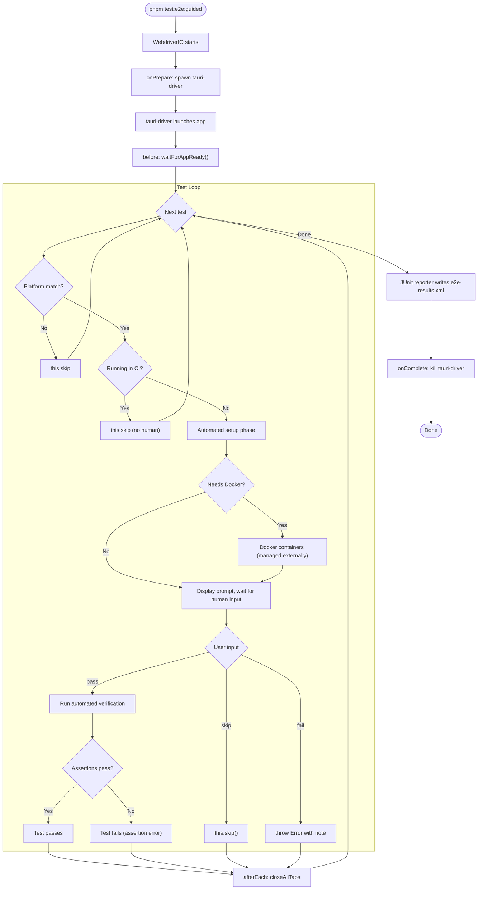
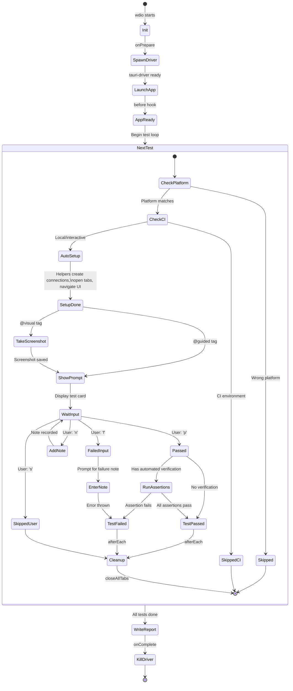
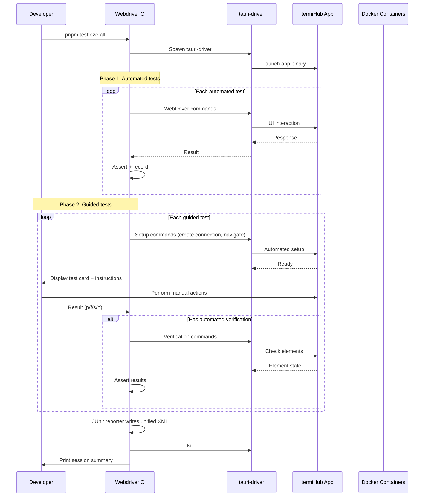
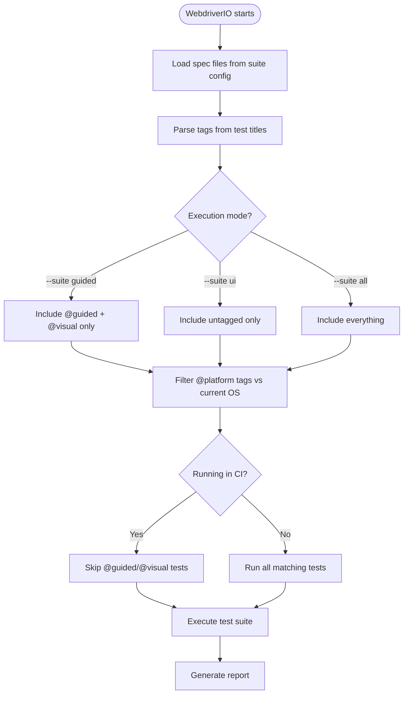

# WebdriverIO Unified Testing — All Tests in One Infrastructure

**GitHub Issue:** TBD

---

## Overview

This concept explores replacing the dual Python/YAML + WebdriverIO testing world with a **single WebdriverIO-based infrastructure** that handles everything: fully automated tests, guided human-in-the-loop tests, and semi-automated hybrid tests. Instead of maintaining two separate systems (Python runner + WebdriverIO), all test definitions, setup logic, verification, and reporting live in JavaScript within the WebdriverIO ecosystem.

### Motivation

termiHub currently has (or is planned to have) two separate testing systems:

1. **WebdriverIO E2E tests** — 45 test files (~12,800 lines of JavaScript), running via tauri-driver. Covers 251 automated items.
2. **Python/YAML guided test runner** (from the [guided-manual-testing](guided-manual-testing.md) concept) — 11 YAML files defining 176 manual test items, with a Python script for interactive guidance and automated verification.

The [unified-test-system](unified-test-system.md) concept analyzed unifying these and recommended a **hybrid approach** (YAML as registry, dual execution backends). This concept explores the alternative: **collapsing everything into WebdriverIO**.

### Core Idea

Every test — automated or guided — is a WebdriverIO spec file using Mocha's `describe/it` blocks. Tests are **tagged** to indicate their execution mode:

- `@automated` — fully automated, no human needed (existing E2E tests)
- `@guided` — requires human interaction but WebdriverIO handles setup, teardown, and verification
- `@visual` — human must visually verify rendering; WebdriverIO captures screenshots for reference
- `@platform(macos|windows|linux)` — platform-specific filtering

A guided test looks like a normal WebdriverIO test but **pauses for human input** at specific points using an interactive prompt mechanism.

### Goals

- **One testing infrastructure**: WebdriverIO + Mocha + tauri-driver is the only test framework for user-facing E2E verification
- **Minimal human interaction**: Automate everything possible; only pause for things that truly need human judgment (visual rendering, native dialogs, OS-level behavior)
- **Reuse existing helpers**: The 9 helper modules (1,286 lines) and 180+ selectors work for both automated and guided tests without any porting
- **Unified reporting**: One spec reporter output that covers all test types
- **No Python/YAML dependency**: Eliminate the need for a separate Python runtime, PyYAML, and YAML test definitions

### Non-Goals

- Replacing unit tests or component tests (Vitest/cargo test remain unchanged)
- Building a GUI-based test runner
- Full automation of visual verification (screenshot diffing is noted as a future enhancement)

---

## UI Interface

The "UI" is the developer's terminal running WebdriverIO. For guided tests, the terminal becomes an interactive prompt while the app remains open for the human to interact with.

### Running All Tests (Automated + Guided)

```bash
# Run all automated tests (default — no human needed)
pnpm test:e2e

# Run guided tests for the current platform (interactive)
pnpm test:e2e:guided

# Run everything: automated first, then guided
pnpm test:e2e:all

# Run a specific category
pnpm test:e2e:guided -- --suite ssh

# Run a single guided test by grep
pnpm test:e2e:guided -- --mochaOpts.grep "macOS key repeat"

# List all guided tests without running
pnpm test:e2e:guided -- --dry-run
```

### Guided Test Terminal Output

When running guided tests, the terminal shows structured prompts:

```
  Guided: Local Shell
    ✓ should detect available shells (automated setup)

    ● MT-LOCAL-03: macOS key repeat fix
      ┌──────────────────────────────────────────────────────────┐
      │  SETUP COMPLETE (automated):                             │
      │    ✓ Created connection "Key Repeat Test" (local/zsh)    │
      │    ✓ Opened terminal tab                                 │
      │    ✓ Terminal rendered successfully                       │
      │                                                          │
      │  INSTRUCTIONS:                                           │
      │    1. Hold any letter key (e.g., 'k') for 3 seconds      │
      │    2. Observe the terminal output                         │
      │                                                          │
      │  EXPECTED:                                                │
      │    - Key repeats continuously (kkkkkkkkkkkk...)           │
      │    - Accent picker does NOT appear                        │
      │    - No delay before repeat starts                        │
      │                                                          │
      │  Result: [p]ass  [f]ail  [s]kip  [n]ote                 │
      └──────────────────────────────────────────────────────────┘

      > p

    ✓ macOS key repeat fix (32s)

    ● MT-LOCAL-07: WSL shell detection
      [SKIPPED] Platform: windows only (current: macos)

    ✓ 4 passing (2m 14s)
    - 3 skipped (wrong platform)
    ○ 1 pending (skipped by user)
```

### Session Summary

After all tests complete (automated and guided), WebdriverIO's reporters produce unified output. The spec reporter prints to the terminal; the JUnit reporter writes a standard XML report:

```
  Spec Files:     14 passed, 1 failed, 11 skipped, 26 total
  Duration:       28m 14s

  ── Failed ──────────────────────────────────────────────────
  tests/e2e/guided/ui-layout.guided.test.js
    Guided: UI Layout
      ✗ MT-UI-01: No white flash on startup
        Manual verification failed: Brief 50ms white flash visible on cold start

  tests/e2e/guided/ssh.guided.test.js
    Guided: SSH
      ✗ MT-SSH-07: Powerline glyph rendering
        Manual verification failed: Black rectangle behind user@host segment

  JUnit report: tests/reports/e2e-results.xml
```

### Visual Test with Screenshot Capture

For `@visual` tagged tests, WebdriverIO captures a screenshot before prompting:

```
    ● MT-UI-01: No white flash on startup
      ┌──────────────────────────────────────────────────────────┐
      │  SETUP COMPLETE (automated):                             │
      │    ✓ App launched (cold start)                           │
      │    ✓ Screenshot saved: screenshots/MT-UI-01-startup.png  │
      │                                                          │
      │  INSTRUCTIONS:                                           │
      │    1. Observe the app window during the next restart      │
      │    2. Watch for any white/blank flash before UI appears   │
      │                                                          │
      │  EXPECTED:                                                │
      │    - Dark background appears immediately                  │
      │    - No white flash or blank frame                        │
      │                                                          │
      │  Result: [p]ass  [f]ail  [s]kip  [n]ote                 │
      └──────────────────────────────────────────────────────────┘
```

---

## General Handling

### Test Tagging System

Tests are tagged using a custom Mocha annotation pattern via the test title or a helper function:

```javascript
// Fully automated (default — no tag needed)
it("should default SSH port to 22", async () => {
  /* ... */
});

// Guided — pauses for human input
it("@guided @platform(macos) should repeat keys without accent picker", async () => {
  /* ... */
});

// Visual — captures screenshot + pauses for human verification
it("@visual should not flash white on startup", async () => {
  /* ... */
});

// Platform-specific automated test
it("@platform(windows) should detect PowerShell", async () => {
  /* ... */
});
```

A cleaner alternative uses a wrapper function:

```javascript
const { guided, visual, automated, platformOnly } = require("./helpers/tags");

// Guided test with metadata
guided(
  "MT-LOCAL-03",
  {
    name: "macOS key repeat fix",
    platforms: ["macos"],
    pr: 48,
    category: "local-shell",
  },
  async (prompt) => {
    // Automated setup
    const name = uniqueName("key-repeat");
    await createLocalConnection(name);
    await connectByName(name);
    await verifyTerminalRendered();

    // Guided phase — pauses for human
    await prompt({
      instructions: [
        "Hold any letter key (e.g., 'k') for 3 seconds",
        "Observe the terminal output",
      ],
      expected: [
        "Key repeats continuously (kkkkkkkkkkkk...)",
        "Accent picker does NOT appear",
        "No delay before repeat starts",
      ],
    });
  }
);
```

### Tag Semantics

| Tag             | Meaning             | Human Interaction          | CI Behavior                        |
| --------------- | ------------------- | -------------------------- | ---------------------------------- |
| (none)          | Fully automated     | None                       | Runs normally                      |
| `@guided`       | Human-in-the-loop   | Pauses for pass/fail input | Skipped (marked pending)           |
| `@visual`       | Visual verification | Pauses + screenshot        | Skipped (captures screenshot only) |
| `@platform(os)` | Platform filter     | None                       | Skipped on non-matching platforms  |

### Platform Filtering

Platform-specific tests are filtered at runtime. The WebdriverIO `before` hook detects the current platform and skips non-matching tests:

```javascript
// helpers/platform.js
const os = require("os");

function currentPlatform() {
  const p = os.platform();
  if (p === "darwin") return "macos";
  if (p === "win32") return "windows";
  return "linux";
}

function shouldSkipForPlatform(testTitle) {
  const match = testTitle.match(/@platform\(([^)]+)\)/);
  if (!match) return false;
  const platforms = match[1].split(",").map((s) => s.trim());
  return !platforms.includes(currentPlatform());
}
```

### Interactive Prompt Mechanism

The core of guided testing is the `prompt()` function that pauses test execution and waits for human input via stdin:

```javascript
// helpers/prompt.js
const readline = require("readline");

async function promptForResult({ instructions, expected, setupResults }) {
  // Print the test card to the terminal
  console.log(formatTestCard({ instructions, expected, setupResults }));

  const rl = readline.createInterface({
    input: process.stdin,
    output: process.stdout,
  });

  return new Promise((resolve) => {
    const ask = () => {
      rl.question("  Result: [p]ass  [f]ail  [s]kip  [n]ote > ", (answer) => {
        const a = answer.trim().toLowerCase();
        if (a === "p" || a === "pass") {
          rl.close();
          resolve({ status: "passed" });
        } else if (a === "f" || a === "fail") {
          rl.question("  Failure note: ", (note) => {
            rl.close();
            resolve({ status: "failed", note });
          });
        } else if (a === "s" || a === "skip") {
          rl.close();
          resolve({ status: "skipped" });
        } else if (a === "n" || a === "note") {
          rl.question("  Note: ", (note) => {
            console.log(`  Note recorded: ${note}`);
            ask(); // Continue prompting
          });
        } else {
          ask(); // Invalid input, re-prompt
        }
      });
    };
    ask();
  });
}
```

### Guided Test Wrapper

The `guided()` wrapper function handles the full lifecycle:

```javascript
// helpers/tags.js
function guided(testId, meta, testFn) {
  const title = `@guided ${meta.platforms ? `@platform(${meta.platforms.join(",")}) ` : ""}${testId}: ${meta.name}`;

  it(title, async function () {
    // Skip on wrong platform
    if (meta.platforms && !meta.platforms.includes(currentPlatform())) {
      this.skip();
      return;
    }

    // Skip in CI (no human available)
    if (process.env.CI) {
      this.skip();
      return;
    }

    // Create prompt function bound to this test's context
    const prompt = async (opts) => {
      const result = await promptForResult({
        ...opts,
        testId: testId,
        testName: meta.name,
      });

      if (result.status === "failed") {
        throw new Error(`Manual verification failed: ${result.note || "no reason given"}`);
      }
      if (result.status === "skipped") {
        this.skip();
      }
      // "passed" — continue normally
      return result;
    };

    // Run the test function with the prompt
    await testFn.call(this, prompt);
  });
}
```

### File Organization

All guided tests live alongside automated tests in the `tests/e2e/` directory, organized by feature area:

```
tests/e2e/
  # Existing automated tests (unchanged)
  connection-forms.test.js
  connection-crud.test.js
  connection-editor-extended.test.js
  tabs.test.js
  split-views.test.js
  settings.test.js
  file-browser.test.js
  performance.test.js
  infrastructure/
    ssh-baseline.test.js
    ssh-keys.test.js
    serial-connection.test.js
    telnet.test.js
    ...

  # New guided tests
  guided/
    local-shell.guided.test.js        # MT-LOCAL-* tests
    ssh.guided.test.js                # MT-SSH-* tests
    serial.guided.test.js             # MT-SER-* tests
    tab-management.guided.test.js     # MT-TAB-* tests
    connection-mgmt.guided.test.js    # MT-CONN-* tests
    file-browser.guided.test.js       # MT-FB-* tests
    ui-layout.guided.test.js          # MT-UI-* tests
    remote-agent.guided.test.js       # MT-AGENT-* tests
    credential-store.guided.test.js   # MT-CRED-* tests
    cross-platform.guided.test.js     # MT-XPLAT-* tests
    config-recovery.guided.test.js    # MT-RECOVERY-* tests

  # Enhanced helpers
  helpers/
    selectors.js          # Existing — unchanged
    app.js                # Existing — unchanged
    connections.js        # Existing — unchanged
    tabs.js               # Existing — unchanged
    sidebar.js            # Existing — unchanged
    infrastructure.js     # Existing — unchanged
    monitoring.js         # Existing — unchanged
    file-browser-infra.js # Existing — unchanged
    tunnels-infra.js      # Existing — unchanged
    tags.js               # NEW — guided(), visual(), platformOnly() wrappers
    prompt.js             # NEW — interactive prompt for human input
    platform.js           # NEW — platform detection + filtering
    resume.js             # NEW — session resume support (optional)
```

### WebdriverIO Configuration Extension

The `wdio.conf.js` gains a new suite for guided tests:

```javascript
// wdio.conf.js (additions)
suites: {
  // ... existing suites ...
  guided: ["./tests/e2e/guided/*.guided.test.js"],
  all: [
    "./tests/e2e/*.test.js",
    "./tests/e2e/infrastructure/*.test.js",
    "./tests/e2e/guided/*.guided.test.js",
  ],
},
```

And a JUnit reporter for unified XML output that covers both automated and guided tests:

```javascript
// wdio.conf.js (additions)
reporters: [
  "spec", // Terminal output (already present)
  [
    "junit",
    {
      outputDir: "./tests/reports/",
      outputFileFormat: () => "e2e-results.xml",
      // Custom properties are added per-test via the JUnit reporter's
      // standard extension mechanism — same pattern used by companies
      // extending gtest xUnit output with custom metadata
    },
  ],
],
```

The JUnit XML format is an industry standard that CI systems (GitHub Actions, Jenkins, GitLab CI) parse natively. Guided test metadata (test ID, category, human notes, screenshots) flows through Mocha's standard test result fields — no custom reporter needed:

- **Test name** carries the ID: `MT-LOCAL-03: macOS key repeat fix`
- **Failure message** carries the human's note: `Manual verification failed: Brief 50ms flash`
- **Test suite name** maps to category: `Guided: SSH`
- **Skipped reason** distinguishes platform vs. user skip
- **Properties** (JUnit extension point) can carry `platform`, `pr`, `screenshots`

This means automated E2E tests and guided tests produce **one unified XML report** — no separate JSON format, no merging step, no custom report generator.

### Example: Guided Test File

```javascript
// tests/e2e/guided/ssh.guided.test.js
const { guided, visual } = require("../helpers/tags");
const {
  createSshConnection,
  handlePasswordPrompt,
  verifyTerminalRendered,
  getTerminalText,
} = require("../helpers/infrastructure");
const { uniqueName, connectByName } = require("../helpers/connections");
const { waitForAppReady, ensureConnectionsSidebar, closeAllTabs } = require("../helpers/app");

describe("Guided: SSH", () => {
  before(async () => {
    await waitForAppReady();
    await ensureConnectionsSidebar();
  });

  afterEach(async () => {
    await closeAllTabs();
  });

  visual(
    "MT-SSH-07",
    {
      name: "Powerline/Agnoster theme glyph rendering",
      platforms: ["macos", "linux", "windows"],
      pr: 156,
      category: "ssh",
    },
    async (prompt) => {
      // Automated setup — reuses existing helpers
      const name = uniqueName("powerline-ssh");
      await createSshConnection(name, { host: "127.0.0.1", port: 2201 });
      await connectByName(name);
      await handlePasswordPrompt("testpass");
      await verifyTerminalRendered();

      // Send command to trigger Powerline prompt
      const terminalText = await getTerminalText();

      // Capture screenshot automatically
      await browser.saveScreenshot(`tests/e2e/reports/screenshots/MT-SSH-07-${Date.now()}.png`);

      // Guided phase
      await prompt({
        instructions: [
          "Observe the terminal prompt rendering",
          "Look for the arrow-shaped segments of the Agnoster/Powerline theme",
        ],
        expected: [
          "Powerline glyphs render as arrows, not boxes or question marks",
          "Colors display correctly (no black rectangles behind segments)",
          "The prompt is visually complete and readable",
        ],
      });
    }
  );

  guided(
    "MT-SSH-12",
    {
      name: "SSH session survives network hiccup",
      platforms: ["macos", "linux", "windows"],
      pr: 200,
      category: "ssh",
    },
    async (prompt) => {
      const name = uniqueName("ssh-reconnect");
      await createSshConnection(name, { host: "127.0.0.1", port: 2201 });
      await connectByName(name);
      await handlePasswordPrompt("testpass");
      await verifyTerminalRendered();

      await prompt({
        instructions: [
          "Disconnect your network (Wi-Fi off or cable out) for ~5 seconds",
          "Reconnect your network",
          "Wait 10 seconds for the session to recover",
          "Type 'echo hello' in the terminal",
        ],
        expected: [
          "Terminal shows a reconnection indicator or message",
          "After reconnection, 'echo hello' produces output",
          "No crash or frozen UI",
        ],
      });
    }
  );
});
```

### Example: Connection Management With Automated Verification

```javascript
// tests/e2e/guided/connection-mgmt.guided.test.js
const { guided } = require("../helpers/tags");
const { waitForAppReady, ensureConnectionsSidebar } = require("../helpers/app");
const fs = require("fs");
const path = require("path");

describe("Guided: Connection Management", () => {
  before(async () => {
    await waitForAppReady();
    await ensureConnectionsSidebar();
  });

  guided(
    "MT-CONN-05",
    {
      name: "Export connections to file",
      platforms: ["macos", "linux", "windows"],
      pr: 33,
      category: "connection-management",
    },
    async (prompt) => {
      // Automated setup: create 3 test connections
      await createLocalConnection("Export Test Local");
      await createSshConnection("Export Test SSH", {
        host: "192.168.1.100",
        port: 22,
      });
      await createTelnetConnection("Export Test Telnet", {
        host: "10.0.0.50",
        port: 23,
      });

      // Guided phase: user must interact with native save dialog
      await prompt({
        instructions: [
          "In the app, click the gear icon menu > 'Export'",
          "In the native save dialog, save to: /tmp/termihub-test-export.json",
          "Press Enter here when done",
        ],
        expected: ["Native save dialog opens", "File is written with connection data"],
      });

      // Automated verification — runs AFTER human confirms
      const exportPath = "/tmp/termihub-test-export.json";
      expect(fs.existsSync(exportPath)).toBe(true);

      const data = JSON.parse(fs.readFileSync(exportPath, "utf-8"));
      expect(data.connections).toBeDefined();
      expect(data.connections.length).toBeGreaterThanOrEqual(3);

      // Verify no passwords leaked
      const json = JSON.stringify(data);
      expect(json).not.toContain('"password":');
    }
  );
});
```

### Infrastructure Lifecycle

Guided tests reuse the exact same infrastructure as automated tests. The Docker containers, tauri-driver, and app lifecycle are managed by the existing `wdio.conf.js` hooks:



### Reporting — Unified JUnit XML

There is no custom JSON report format. Both automated and guided tests produce a single **JUnit XML report** via WebdriverIO's built-in `@wdio/junit-reporter`. This is the same xUnit format that CI systems (GitHub Actions, Jenkins, GitLab CI) already parse natively.

**Why JUnit XML instead of a custom JSON format:**

- **One report for everything.** Automated E2E tests and guided tests appear in the same XML file as `<testcase>` elements. No merging, no separate report generators, no second format to maintain.
- **Standard and extensible.** The JUnit XML schema supports `<properties>` per test case — the same extension mechanism companies use to attach custom metadata to gtest xUnit output (e.g., test category, PR reference, screenshot paths). No custom schema needed.
- **CI integration for free.** GitHub Actions' test summary, Jenkins' Test Result Trend, GitLab's Test Reports tab all consume JUnit XML directly. A custom JSON format would need a separate rendering step.
- **Existing tooling.** Any XML/xUnit viewer, dashboard, or analysis tool works out of the box.

**Example output** (`tests/reports/e2e-results.xml`):

```xml
<?xml version="1.0" encoding="UTF-8"?>
<testsuites name="termiHub E2E" tests="236" failures="3" skipped="43" time="1694">

  <!-- Automated tests — produced by the same reporter -->
  <testsuite name="Connection Forms" tests="12" failures="0" time="18.4">
    <testcase classname="connection-forms" name="should default SSH port to 22" time="1.2"/>
    <testcase classname="connection-forms" name="should default Telnet port to 23" time="0.9"/>
    <!-- ... -->
  </testsuite>

  <!-- Guided tests — same format, same file -->
  <testsuite name="Guided: SSH" tests="35" failures="1" skipped="12" time="420">
    <testcase classname="guided.ssh" name="MT-SSH-07: Powerline glyph rendering" time="45">
      <failure message="Manual verification failed: Black rectangle behind user@host segment"/>
      <properties>
        <property name="category" value="ssh"/>
        <property name="pr" value="156"/>
        <property name="screenshot" value="screenshots/MT-SSH-07-1709045430.png"/>
      </properties>
    </testcase>
    <testcase classname="guided.ssh" name="MT-SSH-12: SSH session survives network hiccup" time="62">
      <properties>
        <property name="category" value="ssh"/>
      </properties>
    </testcase>
    <testcase classname="guided.ssh" name="MT-SSH-15: WSL SSH agent forwarding" time="0">
      <skipped message="Platform: windows only (current: macos)"/>
    </testcase>
    <!-- ... -->
  </testsuite>

  <testsuite name="Guided: Local Shell" tests="20" failures="0" skipped="8" time="310">
    <testcase classname="guided.local-shell" name="MT-LOCAL-03: macOS key repeat fix" time="32">
      <properties>
        <property name="category" value="local-shell"/>
        <property name="pr" value="48"/>
        <property name="platform" value="macos"/>
      </properties>
    </testcase>
    <!-- ... -->
  </testsuite>

</testsuites>
```

**How guided-specific metadata flows into the standard format:**

| Guided concept        | JUnit XML mapping                                     | How it gets there                                          |
| --------------------- | ----------------------------------------------------- | ---------------------------------------------------------- |
| Test ID (`MT-SSH-07`) | `<testcase name="MT-SSH-07: ...">`                    | Part of the Mocha `it()` title                             |
| Category (`ssh`)      | `<property name="category">`                          | Set via `@wdio/junit-reporter`'s `testCaseProperties` hook |
| Human failure note    | `<failure message="Manual verification failed: ...">` | Thrown as an `Error` by the `prompt()` helper              |
| Platform skip reason  | `<skipped message="Platform: windows only">`          | Set via Mocha's `this.skip()` with a message               |
| Screenshot path       | `<property name="screenshot">`                        | Set via `testCaseProperties` hook                          |
| PR reference          | `<property name="pr">`                                | Set via `testCaseProperties` hook                          |
| Duration (human time) | `<testcase time="45">`                                | Mocha's built-in timer (includes prompt wait time)         |

The `@wdio/junit-reporter` supports a `testCaseProperties` callback that receives the test context and returns custom properties. The `guided()` wrapper stores metadata on the Mocha test context, and the reporter callback reads it:

```javascript
// wdio.conf.js
["junit", {
  outputDir: "./tests/reports/",
  testCaseProperties: (test) => {
    // Metadata stored by guided() wrapper on the test context
    const meta = test._guidedMeta;
    if (!meta) return [];
    const props = [{ name: "category", value: meta.category }];
    if (meta.pr) props.push({ name: "pr", value: String(meta.pr) });
    if (meta.screenshots?.length) {
      props.push({ name: "screenshot", value: meta.screenshots.join(",") });
    }
    return props;
  },
}],
```

This approach eliminates the `helpers/report.js` module entirely — the reporter handles everything.

### CI Behavior

In CI, guided and visual tests are automatically skipped (no human available). The CI pipeline remains unchanged for automated tests:

```yaml
# GitHub Actions — no changes needed for automated tests
e2e-tests:
  runs-on: ${{ matrix.os }}
  strategy:
    matrix:
      os: [ubuntu-latest, windows-latest]
  steps:
    - run: pnpm test:e2e # Guided tests auto-skip in CI
```

A CI step can optionally validate that guided test files parse correctly:

```yaml
- name: Validate guided test definitions
  run: pnpm test:e2e:guided -- --dry-run
```

---

## States & Sequences

### Guided Test State Machine



### Automated + Guided Combined Session



### Test Discovery and Filtering Flow



### Relationship Between Existing and Guided Tests

```mermaid
flowchart TD
    subgraph "tests/e2e/ (one directory tree)"
        subgraph "Automated (existing, unchanged)"
            A1["connection-forms.test.js<br/>12 automated tests"]
            A2["connection-crud.test.js<br/>18 automated tests"]
            A3["tabs.test.js<br/>8 automated tests"]
            A4["infrastructure/ssh-*.test.js<br/>58 automated tests"]
            A5["performance.test.js<br/>4 automated tests"]
            A6["... (35 total files)"]
        end

        subgraph "Guided (new, same directory tree)"
            G1["guided/local-shell.guided.test.js<br/>20 guided tests"]
            G2["guided/ssh.guided.test.js<br/>35 guided tests"]
            G3["guided/ui-layout.guided.test.js<br/>20 guided tests"]
            G4["guided/connection-mgmt.guided.test.js<br/>31 guided tests"]
            G5["... (11 total files)"]
        end
    end

    subgraph "Shared Helpers (reused by both)"
        H1["helpers/selectors.js"]
        H2["helpers/connections.js"]
        H3["helpers/infrastructure.js"]
        H4["helpers/app.js"]
        H5["helpers/tabs.js"]
        H6["helpers/prompt.js (new)"]
        H7["helpers/tags.js (new)"]
    end

    A1 & A2 & A3 & A4 --> H1 & H2 & H3 & H4 & H5
    G1 & G2 & G3 & G4 --> H1 & H2 & H3 & H4 & H5 & H6 & H7
```



---

## Pros and Cons

### Pros

| #   | Pro                                                | Details                                                                                                                                                                                                                                                                             |
| --- | -------------------------------------------------- | ----------------------------------------------------------------------------------------------------------------------------------------------------------------------------------------------------------------------------------------------------------------------------------- |
| 1   | **Single testing infrastructure**                  | One framework (WebdriverIO + Mocha), one language (JavaScript), one config (`wdio.conf.js`), one set of helpers. No Python runtime, no PyYAML, no YAML DSL to learn or maintain.                                                                                                    |
| 2   | **Full helper reuse**                              | The 1,286 lines of existing JavaScript helpers (selectors, connection creation, SSH handling, monitoring, file browser, tunnels) are directly available to guided tests. No porting or reimplementation needed.                                                                     |
| 3   | **Rich verification in guided tests**              | After a human confirms an action, the test can run arbitrary WebdriverIO assertions — check DOM elements, read terminal text, verify CSS classes, count tabs, inspect file browser entries. This is far more powerful than the Python runner's file-exists/port-check verification. |
| 4   | **IDE support**                                    | Guided tests are regular JavaScript — developers get syntax highlighting, IntelliSense, breakpoints, and debugging. YAML test definitions have none of this.                                                                                                                        |
| 5   | **Consistent test patterns**                       | Both automated and guided tests use the same describe/it/before/after patterns, the same selectors, the same assertion library. Developers learn one pattern.                                                                                                                       |
| 6   | **Incremental migration from guided to automated** | Moving a test from "guided" to "automated" means removing the `prompt()` call and adding assertions — the setup code stays identical. The boundary between manual and automated is a single function call, not a different file format and language.                                |
| 7   | **No new dependencies**                            | WebdriverIO, Mocha, Node.js are already installed. The only new code is the `prompt.js` and `tags.js` helper modules (~200 lines). No `selenium`, no `python3`, no `PyYAML`.                                                                                                        |
| 8   | **CI-safe by default**                             | Guided tests auto-skip in CI via `process.env.CI` check. No special CI configuration needed. Automated tests run exactly as before.                                                                                                                                                 |
| 9   | **Screenshot integration**                         | WebdriverIO's `browser.saveScreenshot()` is already used for failure screenshots. Visual tests can capture reference screenshots using the same mechanism.                                                                                                                          |
| 10  | **Unified spec reporter output**                   | One test run produces one Mocha spec reporter output showing all tests — automated passes, guided results, and platform skips — in a single view.                                                                                                                                   |

### Cons

#### Con 1: Requires tauri-driver — no native macOS support

The entire guided testing approach is built on top of WebdriverIO, which connects to the app via tauri-driver. This creates a hard dependency chain: **guided tests require tauri-driver, which requires the built app binary, which requires a platform where tauri-driver works**.

**The macOS problem is the most significant consequence.** tauri-driver does not work on macOS because Apple provides no WKWebView WebDriver — `safaridriver` only controls Safari the browser, not WKWebView instances embedded in Tauri apps (see [tauri-apps/tauri#7068](https://github.com/tauri-apps/tauri/issues/7068)). This means:

- On macOS, guided tests would run inside a **Docker container with a Linux build** (Xvfb + WebKitGTK + tauri-driver). This tests the Linux UI, not the macOS UI — fine for functional behavior, but useless for macOS-specific tests.
- Tests that specifically verify macOS behavior (**~50 items**: accent picker, Keychain integration, macOS key repeat, WKWebView rendering quirks, native file dialogs with macOS styling) **cannot run through this system at all**. They would need a separate checklist or a different mechanism.
- The Python/YAML runner has no such limitation: it presents instructions and collects pass/fail without automating the app. It works on any platform with a terminal.

**The "app must be built" problem is secondary but real.** Even on Linux/Windows, running guided tests requires a release build of the app (`pnpm tauri build`, which takes several minutes). The Python runner can present pure-checklist tests (e.g., "verify the app icon in your OS dock") without building anything. Under the WebdriverIO approach, these ~5 items would need to live outside the framework entirely.

**Impact assessment:**

| Category                            | Manual test items | Can run via Docker (Linux)?                         | Needs native macOS? |
| ----------------------------------- | ----------------- | --------------------------------------------------- | ------------------- |
| macOS key repeat, accent picker     | 3                 | No — tests macOS-specific OS behavior               | Yes                 |
| Keychain integration                | 3                 | No — macOS Keychain API                             | Yes                 |
| Native file dialogs (macOS styling) | ~8                | No — dialog appearance is OS-specific               | Yes                 |
| WKWebView rendering quirks          | ~5                | No — WebKitGTK differs from WKWebView               | Yes                 |
| WSL shell detection                 | ~6                | No — WSL is Windows-only                            | N/A (Windows)       |
| Windows PowerShell interception     | ~4                | No — Windows-only                                   | N/A (Windows)       |
| Cross-platform functional tests     | ~100+             | Yes — same React UI, same Rust backend              | No                  |
| Visual rendering (fonts, glyphs)    | ~18               | Partially — font rendering differs across platforms | Ideally yes         |

Roughly **~24 macOS-specific items and ~10 Windows-specific items** fall through the cracks — they cannot be tested via Docker and need platform-native verification. These would require a supplementary mechanism (markdown checklist, or a future native macOS WebDriver solution like [danielraffel/tauri-webdriver](https://github.com/danielraffel/tauri-webdriver)).

**Mitigation:** Accept the limitation. Maintain a small, focused markdown checklist in `docs/testing.md` for the ~34 platform-native items. The WebdriverIO guided runner covers the remaining ~140 items (80%) that work cross-platform via Docker or natively on Linux/Windows.

---

#### Con 2: stdin interaction in WebdriverIO is unconventional

WebdriverIO is designed for **headless, non-interactive automation**. Its architecture assumes tests run without human input: Mocha discovers specs, the runner executes them sequentially, reporters format output, and the process exits with a code. Introducing interactive stdin prompts breaks this assumption in several ways:

**Reporter output conflicts.** Mocha's spec reporter writes test names and results to stdout in real-time. When a guided test pauses for input, the reporter has already printed the test title (e.g., `● MT-LOCAL-03: macOS key repeat fix`) and is waiting for the result. The prompt's output (test card, instructions, input cursor) must interleave correctly with the reporter's output. If the reporter uses ANSI escape codes for formatting (colors, cursor positioning), the prompt's output could corrupt the display.

```
  Guided: Local Shell
    ● MT-LOCAL-03: macOS key repeat fix
      ┌──────────────────────────────┐    ← prompt output
      │  INSTRUCTIONS:               │
      │  Hold 'k' for 3 seconds...   │
      └──────────────────────────────┘
      > p                                  ← stdin read
    ✓ macOS key repeat fix (32s)           ← reporter resumes
```

This works in practice because Mocha's spec reporter writes to stdout synchronously and doesn't use cursor repositioning. But it's fragile — a different reporter (e.g., `dot`, `nyan`, or a custom HTML reporter) might behave differently.

**WebdriverIO session timeout.** While the human is reading instructions and interacting with the app, the WebDriver session is idle. tauri-driver (and the underlying WebDriver protocol) has implicit session timeouts. If the human takes too long (e.g., 5+ minutes on a complex test), the WebDriver session may time out, causing all subsequent commands to fail with a stale session error. The W3C WebDriver spec defines three timeout types:

- **Script timeout** (default 30s) — for `execute_script` calls
- **Page load timeout** (default 300s) — for navigation
- **Implicit wait timeout** (default 0s) — for element finding

None of these directly apply to idle time between commands, but some WebDriver implementations enforce a **session idle timeout** (e.g., Selenium Grid defaults to 300s). tauri-driver's behavior here is undocumented — it may or may not enforce idle timeouts, and this would need to be tested empirically.

**Process signal handling.** When the user presses Ctrl+C during a prompt, the expected behavior is to skip the current test and continue to the next one (or exit gracefully). But Ctrl+C sends SIGINT to the entire Node.js process, which Mocha intercepts to abort the test run. The prompt's `readline` interface also listens for `close` events on stdin. These competing signal handlers need careful coordination:

```javascript
// Potential issue: who handles Ctrl+C?
rl.on("close", () => {
  // readline thinks the user closed stdin
  resolve({ status: "skipped" });
});

// Meanwhile, Mocha's runner also catches SIGINT:
process.on("SIGINT", () => {
  // Mocha wants to abort the entire run
  runner.abort();
});
```

**Mitigation:** These issues are solvable with careful engineering:

1. Use Mocha's spec reporter (already the default) and format prompt output to align with its indentation.
2. Set WebDriver timeouts explicitly via `browser.setTimeout({ implicit: 0, script: 600000 })` before guided tests.
3. Handle SIGINT in the prompt helper: on first Ctrl+C, skip the current test; on second Ctrl+C within 2 seconds, let Mocha abort.
4. Write integration tests for the prompt mechanism itself to catch reporter conflicts early.

The approach is technically sound but requires ~30-50 additional lines of defensive code and ongoing awareness that this is a non-standard usage pattern. Any future WebdriverIO upgrade could introduce breaking changes to the reporter or process lifecycle that affect prompt behavior.

---

#### Con 3: No standalone checklist mode without a built app

The Python/YAML guided runner can present **any test** — even those that don't need WebDriver automation at all — as a simple text prompt in the terminal. This enables several workflows that the WebdriverIO approach cannot support:

**Quick pre-release sanity check without building.** A developer could run `python scripts/test-manual.py --category ui-layout` to walk through visual verification items without spending 5-10 minutes on `pnpm tauri build`. They simply open the already-running dev server (`pnpm tauri dev`) and follow the prompts. Under the WebdriverIO approach, the guided runner needs tauri-driver, which needs a release binary, which needs a full production build.

**Testing on a machine without the build toolchain.** A QA team member or product manager with only the app installer (no Rust toolchain, no Node.js, no pnpm) could run the Python script to walk through manual tests. The WebdriverIO approach requires the full development environment.

**Testing OS-level features outside the app.** Some manual tests verify things that exist outside the app window entirely:

- "Does the app icon render correctly in the macOS Dock?" — requires looking at the Dock, not the app UI
- "Does the Keychain entry appear in Keychain Access.app?" — requires opening a separate macOS app
- "Does the custom app icon persist after restart?" — requires quitting and relaunching
- "Does the installer create the correct Start Menu entry?" — Windows-only, outside the app

These tests have no WebDriver interaction at all. Under the Python runner, they're just a prompt with instructions. Under WebdriverIO, they either can't exist (the framework expects a browser session) or require awkward workarounds (a test that immediately pauses for manual verification without ever touching the browser).

**Impact quantification:**

| Workflow                                     | Python/YAML                                                          | WebdriverIO Unified                                  |
| -------------------------------------------- | -------------------------------------------------------------------- | ---------------------------------------------------- |
| Walk through 10 visual checks during dev     | `python scripts/test-manual.py --category ui-layout` (instant start) | Must build release binary first (~5-10 min)          |
| QA runs checklist on installed app           | Works (Python + YAML only)                                           | Cannot run (needs full dev environment)              |
| Check 5 OS-level items (Dock icon, Keychain) | Works (pure checklist)                                               | Cannot run (no browser session)                      |
| Run subset of SSH tests against Docker       | Works (starts Docker, presents prompts)                              | Works (starts Docker, launches app via tauri-driver) |

**Mitigation:** For the ~5 OS-level items, maintain a short markdown checklist. For the "quick check without building" workflow, accept that guided tests require a build — this is the same requirement as automated E2E tests, so developers are already accustomed to it. If the QA-without-dev-environment workflow is important, this is a strong argument for keeping the Python runner or the hybrid approach instead.

---

#### Con 4: No built-in resume support

A full guided test session with 176 items takes **30-60 minutes** of focused human attention. Interruptions are common: a meeting starts, a build breaks, the developer needs to context-switch. The Python/YAML runner concept has **built-in resume** as a core feature: it saves progress to a JSON file after every test result, and `--resume <file>` skips already-completed tests.

Mocha (and therefore WebdriverIO) has **no concept of resume**. When you run `pnpm test:e2e:guided`, Mocha discovers all matching spec files, runs every `it()` block in order, and exits. There is no mechanism to say "skip the first 47 tests because I already completed them in a previous session."

**What happens on interruption today:**

```
Session interrupted at test 48/176 (Ctrl+C or crash)

Python/YAML runner:
  → Report file contains results for tests 1-47
  → Next run: python scripts/test-manual.py --resume tests/reports/manual-*.json
  → Tests 1-47 are skipped, session continues from test 48

WebdriverIO (no custom code):
  → No state saved
  → Next run: pnpm test:e2e:guided
  → All 176 tests run again from the beginning
  → Developer must manually skip through 47 already-completed tests (pressing 's' each time)
```

**Custom resume implementation is possible but adds complexity:**

```javascript
// helpers/resume.js — ~50-80 lines
const SESSION_FILE = "tests/e2e/reports/.guided-session.json";

function loadSession() {
  if (!fs.existsSync(SESSION_FILE)) return { completed: [] };
  return JSON.parse(fs.readFileSync(SESSION_FILE, "utf-8"));
}

function saveResult(testId, result) {
  const session = loadSession();
  session.completed.push({ id: testId, ...result, timestamp: new Date().toISOString() });
  fs.writeFileSync(SESSION_FILE, JSON.stringify(session, null, 2));
}

function isCompleted(testId) {
  return loadSession().completed.some((r) => r.id === testId);
}
```

This must integrate with the `guided()` wrapper:

```javascript
function guided(testId, meta, testFn) {
  it(title, async function () {
    // Resume support: skip if already completed in this session
    if (process.env.GUIDED_RESUME && isCompleted(testId)) {
      console.log(`  [resumed] ${testId} — already completed, skipping`);
      this.skip();
      return;
    }

    // ... rest of guided test logic ...

    // Save result after completion
    saveResult(testId, { status: "passed" });
  });
}
```

**Remaining limitations even with custom resume:**

- **Session file must be managed manually.** The developer must know to set `GUIDED_RESUME=1` or pass a flag. If they forget, they restart from scratch.
- **No partial re-run of failed tests.** Mocha's `--grep` can filter by test name, but there's no "re-run only failed tests from the last session" without parsing the session file and constructing a regex.
- **Cleanup state mismatch.** If the session was interrupted mid-test (after setup but before teardown), the app may be in an inconsistent state (connections created, tabs open). The resumed session starts with `waitForAppReady()` + `closeAllTabs()`, but any server-side state (e.g., Docker container connections) may not be cleaned up.
- **tauri-driver restarts.** Each `pnpm test:e2e:guided` invocation spawns a new tauri-driver process and launches a fresh app instance. State from the previous session (created connections, open tabs) is lost. The Python runner can keep the app running between sessions.

**Mitigation:** Implement the custom resume (~80 lines). Accept that it's less robust than the Python runner's built-in approach. For the "re-run failed tests" workflow, parse the session file in a wrapper script and pass `--mochaOpts.grep` with the failed test IDs. For the state mismatch issue, ensure all `before` hooks are idempotent (create fresh state, don't depend on previous state).

---

#### Con 5: JavaScript test definitions are less readable than YAML for non-developers

YAML test definitions are essentially **structured documentation** — a QA engineer, product manager, or new team member can read them without knowing any programming language:

```yaml
# Immediately clear: what the test is, what to do, what to expect
- id: MT-LOCAL-03
  name: "macOS key repeat fix"
  platforms: [macos]
  instructions:
    - "Hold any letter key (e.g., 'k') for 3 seconds"
    - "Observe the terminal output"
  expected:
    - "Key repeats continuously (kkkkkkkkkkkk...)"
    - "Accent picker does NOT appear"
```

The equivalent JavaScript has **syntactic noise** that a non-developer must parse through:

```javascript
guided(
  "MT-LOCAL-03",
  {
    name: "macOS key repeat fix",
    platforms: ["macos"],
    category: "local-shell",
  },
  async (prompt) => {
    // Setup code — non-developers must understand this is automated
    const name = uniqueName("key-repeat");
    await createLocalConnection(name);
    await connectByName(name);
    await verifyTerminalRendered();

    // The actual test definition is buried after the setup
    await prompt({
      instructions: [
        "Hold any letter key (e.g., 'k') for 3 seconds",
        "Observe the terminal output",
      ],
      expected: ["Key repeats continuously (kkkkkkkkkkkk...)", "Accent picker does NOT appear"],
    });
  }
);
```

**Specific readability challenges:**

1. **Signal-to-noise ratio.** The YAML version is 8 lines of pure test definition. The JavaScript version is 22 lines, of which 8 are setup code, 4 are structural syntax (`async (prompt) => {`, closing braces), and only 10 are the actual test definition. A non-developer must learn to mentally filter out the setup and syntax.

2. **Cognitive load of `async/await`.** The `async (prompt) =>` pattern, `await` keywords, and callback structure are second nature to JavaScript developers but confusing to non-developers. "What is `await`? Why does `prompt` take a function? What does `uniqueName` return?" These are questions that don't arise with YAML.

3. **Test discovery.** Finding "all tests for the SSH category" in YAML means opening `ssh.yaml` — one file, flat list, sequential. In JavaScript, it means opening `ssh.guided.test.js`, scanning through `describe` blocks, and reading past setup code to find the `prompt()` calls where the actual test definition lives.

4. **Editing by non-developers.** A QA engineer adding a new manual test to the YAML file needs to copy-paste an existing entry and change the text fields. Adding a new guided test in JavaScript requires understanding the `guided()` function signature, `async/await`, proper placement within a `describe` block, and correct use of helper functions for setup.

5. **Inventory generation.** The YAML format is trivially parseable by any tool (`yq`, `python -c "import yaml"`, even `grep`). Generating a test inventory from JavaScript requires either regex-based parsing (brittle) or actually importing and instrumenting the test files (requires Node.js).

**However, there are counterarguments:**

- The `guided()` wrapper's metadata object (`name`, `platforms`, `instructions`, `expected`) is a plain JavaScript object that reads almost identically to YAML. The main readability difference is the surrounding syntax, not the content.
- The `--dry-run` mode can generate a human-readable inventory table from the JavaScript files, providing the same discoverability as YAML for non-developers who only need to read (not edit) the test list.
- In practice, termiHub's test definitions are written and maintained by developers, not a separate QA team. The audience for test readability is primarily developers who are comfortable with JavaScript.

**Mitigation:** Use the `guided()` wrapper consistently (never raw `it()` with tag strings) to keep the metadata structured and scannable. Implement `--dry-run` to output a markdown table for non-developer consumption. If non-developer editing is a requirement, consider generating the `prompt()` metadata from a supplementary YAML file (reversing the data flow: YAML defines the test content, JavaScript imports it), though this partially re-introduces the dual-system problem.

---

#### Other Cons (less critical)

| #   | Con                                 | Details                                                                                                                                                        | Mitigation                                                                                                                                                          |
| --- | ----------------------------------- | -------------------------------------------------------------------------------------------------------------------------------------------------------------- | ------------------------------------------------------------------------------------------------------------------------------------------------------------------- |
| 6   | **Longer test timeouts**            | Guided tests can take 30-60 seconds each (human thinking time). Mocha's default timeout (60s) may not be enough. Need per-test timeout configuration.          | Set `this.timeout(300000)` (5 minutes) in guided tests via the wrapper function. Mocha supports per-test timeouts natively.                                         |
| 7   | **WebdriverIO version coupling**    | All tests (automated + guided) are tied to the same WebdriverIO version. An upgrade could break both automated and guided tests simultaneously.                | This is already the case for the automated suite. Version pinning in `package.json` and a thorough upgrade process mitigate this.                                   |
| 8   | **Docker still managed externally** | Infrastructure tests need Docker containers started before the WebdriverIO run. Unlike the Python runner concept, WebdriverIO doesn't manage Docker lifecycle. | Use the existing `scripts/test-system.sh` pattern: a wrapper script starts Docker, runs `pnpm test:e2e:guided`, then tears down. This matches the current workflow. |

### Comparison Matrix: Three Approaches

| Aspect                         | Python/YAML Runner (current concept) | Hybrid YAML Registry (unified-test-system) | WebdriverIO Unified (this concept) |
| ------------------------------ | ------------------------------------ | ------------------------------------------ | ---------------------------------- |
| **Languages**                  | Python + YAML + JavaScript           | Python + YAML + JavaScript                 | JavaScript only                    |
| **Number of frameworks**       | 2 (Python runner + WebdriverIO)      | 2 (Python runner + WebdriverIO)            | 1 (WebdriverIO)                    |
| **Helper reuse**               | Must reimplement in Python           | Partial (YAML templates + Python helpers)  | Full (same JS helpers)             |
| **Verification power**         | File checks, port checks, JSON       | Same + WebDriver via Selenium              | Full WebdriverIO API               |
| **IDE support**                | YAML: none; Python: good             | YAML: none; Python: good; JS: good         | JavaScript: excellent              |
| **macOS native support**       | Yes (no WebDriver needed)            | Yes (manual mode)                          | No (needs tauri-driver)            |
| **CI impact**                  | New Python pipeline                  | Low (additive only)                        | None (guided tests auto-skip)      |
| **Migration to automated**     | Rewrite YAML to JS                   | Rewrite YAML to JS                         | Remove `prompt()` call             |
| **New dependencies**           | python3, PyYAML, selenium (opt.)     | python3, PyYAML, selenium (opt.)           | None                               |
| **Implementation effort**      | ~4-6 weeks                           | ~4-6 weeks (phases 1-2)                    | ~2-3 weeks                         |
| **Maintenance burden**         | Two systems + YAML DSL               | Two systems + YAML registry                | One system                         |
| **Standalone checklist**       | Yes (works without app)              | Yes (works without app)                    | No (needs built app)               |
| **Resume interrupted session** | Built-in                             | Built-in                                   | Needs custom implementation        |
| **Non-developer readability**  | YAML: excellent                      | YAML: excellent                            | JS metadata: good                  |

---

## Preliminary Implementation Details

### Phase 1: Core Infrastructure (~1 week)

Create the helper modules that enable guided testing within WebdriverIO:

1. **`tests/e2e/helpers/prompt.js`** (~80 lines) — Interactive stdin prompt with formatted test cards
2. **`tests/e2e/helpers/tags.js`** (~100 lines) — `guided()`, `visual()`, `platformOnly()` wrapper functions
3. **`tests/e2e/helpers/platform.js`** (~30 lines) — Platform detection and tag parsing

Update `wdio.conf.js`:

- Add `guided` suite pointing to `tests/e2e/guided/*.guided.test.js`
- Add `all` suite combining everything
- Add `@wdio/junit-reporter` with `testCaseProperties` callback for guided metadata
- Configure unified XML output to `tests/reports/e2e-results.xml`

Add `package.json` scripts:

```json
{
  "test:e2e:guided": "wdio run ./wdio.conf.js --suite guided",
  "test:e2e:all": "wdio run ./wdio.conf.js --suite all"
}
```

### Phase 2: Guided Test Migration (~2 weeks)

Convert the 176 manual test items from the YAML definitions into JavaScript guided tests:

| YAML File                    | Guided Test File                         | Tests | Effort                          |
| ---------------------------- | ---------------------------------------- | ----- | ------------------------------- |
| `local-shell.yaml`           | `guided/local-shell.guided.test.js`      | 20    | Low — simple setup              |
| `ssh.yaml`                   | `guided/ssh.guided.test.js`              | 35    | Medium — infrastructure helpers |
| `serial.yaml`                | `guided/serial.guided.test.js`           | 2     | Low                             |
| `tab-management.yaml`        | `guided/tab-management.guided.test.js`   | 17    | Low — reuses tab helpers        |
| `connection-management.yaml` | `guided/connection-mgmt.guided.test.js`  | 31    | Medium — verification logic     |
| `file-browser.yaml`          | `guided/file-browser.guided.test.js`     | 20    | Medium — SFTP helpers           |
| `ui-layout.yaml`             | `guided/ui-layout.guided.test.js`        | 20    | Low — mostly visual             |
| `remote-agent.yaml`          | `guided/remote-agent.guided.test.js`     | 8     | Medium — agent infra            |
| `credential-store.yaml`      | `guided/credential-store.guided.test.js` | 8     | Low                             |
| `cross-platform.yaml`        | `guided/cross-platform.guided.test.js`   | 3     | Low                             |
| `config-recovery.yaml`       | `guided/config-recovery.guided.test.js`  | 12    | Low — mostly manual             |

Each YAML entry becomes a `guided()` or `visual()` call. The YAML's `setup` actions map directly to existing helper function calls. The YAML's `instructions` and `expected` become the prompt metadata.

**Example migration:**

```yaml
# BEFORE (tests/manual/ssh.yaml)
- id: MT-SSH-07
  name: "Powerline/Agnoster theme glyph rendering"
  platforms: [all]
  prerequisites:
    - app: true
    - docker: true
  setup:
    - create_connection:
        name: "Powerline SSH"
        type: ssh
        config:
          host: "127.0.0.1"
          port: 2201
          username: "testuser"
          authMethod: password
    - connect: "Powerline SSH"
  instructions:
    - "Observe the terminal prompt"
    - "Look for arrow-shaped Powerline segments"
  expected:
    - "Glyphs render as arrows, not boxes"
  verification: manual
```

```javascript
// AFTER (tests/e2e/guided/ssh.guided.test.js)
visual(
  "MT-SSH-07",
  {
    name: "Powerline/Agnoster theme glyph rendering",
    platforms: ["macos", "linux", "windows"],
    category: "ssh",
  },
  async (prompt) => {
    const name = uniqueName("powerline-ssh");
    await createSshConnection(name, { host: "127.0.0.1", port: 2201 });
    await connectByName(name);
    await handlePasswordPrompt("testpass");
    await verifyTerminalRendered();

    await browser.saveScreenshot(`tests/e2e/reports/screenshots/MT-SSH-07.png`);

    await prompt({
      instructions: ["Observe the terminal prompt", "Look for arrow-shaped Powerline segments"],
      expected: ["Glyphs render as arrows, not boxes"],
    });
  }
);
```

The JavaScript version is slightly longer but gains: full helper reuse, screenshot capture, IDE support, and the ability to add WebdriverIO assertions alongside the manual prompt.

### Phase 3: Enhanced Features (optional, ~1 week)

1. **Resume support** (~50 lines in `resume.js`) — Check for incomplete session file on start, skip completed test IDs
2. **Dry-run mode** (~30 lines in `tags.js`) — Print test inventory table without launching the app
3. **Category filtering** — Use `--mochaOpts.grep` or a custom `--category` flag to filter guided tests
4. **Wrapper script** for full sessions:

```bash
#!/bin/bash
# scripts/test-guided.sh — Full guided test session
set -euo pipefail

# Start Docker infra if needed
docker compose -f tests/docker/docker-compose.yml up -d
docker compose -f tests/docker/docker-compose.yml --profile agent up -d

# Wait for containers
echo "Waiting for Docker containers..."
sleep 5

# Run guided tests
pnpm test:e2e:guided "$@"

# Cleanup (unless --keep-infra)
if [[ "${*}" != *"--keep-infra"* ]]; then
  docker compose -f tests/docker/docker-compose.yml --profile all down
fi
```

### Impact on Existing Code

| Component                | Change                                      | Risk                               |
| ------------------------ | ------------------------------------------- | ---------------------------------- |
| `tests/e2e/*.test.js`    | **None** — all files untouched              | None                               |
| `tests/e2e/helpers/*.js` | **None** — all helpers untouched            | None                               |
| `wdio.conf.js`           | Add `guided` suite + report hooks           | Low                                |
| `package.json`           | Add 2 new scripts                           | None                               |
| `tests/manual/*.yaml`    | Superseded (can be removed after migration) | None — no code depends on them yet |
| `scripts/test-manual.py` | Superseded (can be removed after migration) | None — not yet implemented         |
| CI pipeline              | **No changes** — guided tests auto-skip     | None                               |
| `docs/testing.md`        | Update to reference guided test files       | Low                                |

### Dependencies

| Tool                   | Purpose              | Required                    | Status                               |
| ---------------------- | -------------------- | --------------------------- | ------------------------------------ |
| WebdriverIO            | Test framework       | Yes                         | Already installed                    |
| Mocha                  | Test runner          | Yes                         | Already installed (via WebdriverIO)  |
| `@wdio/junit-reporter` | Unified XML output   | Yes                         | npm install (one new dev dependency) |
| tauri-driver           | WebDriver proxy      | Yes                         | Already installed                    |
| Node.js `readline`     | Interactive prompts  | Yes                         | Built-in (no install)                |
| Docker                 | Infrastructure tests | For SSH/serial/telnet tests | Already used                         |

**One new npm dev dependency** (`@wdio/junit-reporter`) — part of the official WebdriverIO ecosystem, maintained by the same team.

### What Gets Removed

If this approach is adopted, the following planned components from the guided-manual-testing and unified-test-system concepts become unnecessary:

- `scripts/test-manual.py` — Python guided test runner
- `tests/manual/*.yaml` — YAML test definitions
- `scripts/validate-test-registry.py` — YAML registry validation
- `scripts/migrate-e2e-to-registry.py` — E2E-to-YAML migration script
- `tests/registry/` — YAML test registry directory
- Python 3 + PyYAML dependency for testing (still needed for serial echo server)
- Selenium dependency (optional in unified-test-system concept)

### Decision Criteria

Choose this approach if:

- **"One framework" is a hard requirement** — you want exactly one testing infrastructure
- **Helper reuse matters most** — the 1,286 lines of JS helpers should not be reimplemented
- **Developer experience matters** — IDE support, debugging, consistent patterns
- **Implementation speed matters** — ~2-3 weeks vs ~4-6 weeks for alternatives

Choose the Python/YAML approach if:

- **macOS native guided testing is critical** — many tests need native macOS without Docker
- **Non-developer readability is critical** — QA team members need to read/edit test definitions
- **Standalone checklist mode is needed** — running guided tests without building the app

Choose the hybrid registry approach if:

- **Unified inventory is the main goal** — you want a single list of all tests regardless of execution method
- **Gradual migration is preferred** — keep both systems running indefinitely with a shared registry
- **Maximum flexibility** — different tests use different execution backends

### Future Enhancements (Out of Scope)

- **Screenshot baseline comparison**: Capture reference screenshots for `@visual` tests and diff against them on subsequent runs (e.g., using `pixelmatch` or `looks-same`)
- **HTML report viewer**: Convert the JUnit XML to an interactive HTML page with screenshots, filtering, and pass/fail charts (tools like `xunit-viewer` or `allure` do this out of the box)
- **Allure reporter integration**: WebdriverIO has a first-class `@wdio/allure-reporter` that produces richer reports than JUnit XML, with attachments (screenshots, logs), test steps, and history trends
- **macOS native WebDriver**: If [danielraffel/tauri-webdriver](https://github.com/danielraffel/tauri-webdriver) matures, guided tests could run natively on macOS without Docker
- **Video recording**: Capture video of guided test sessions for async review (WebdriverIO supports video recording via plugins)
- **Parallel guided sessions**: Run guided tests for different categories in parallel browser windows (one window per describe block)
