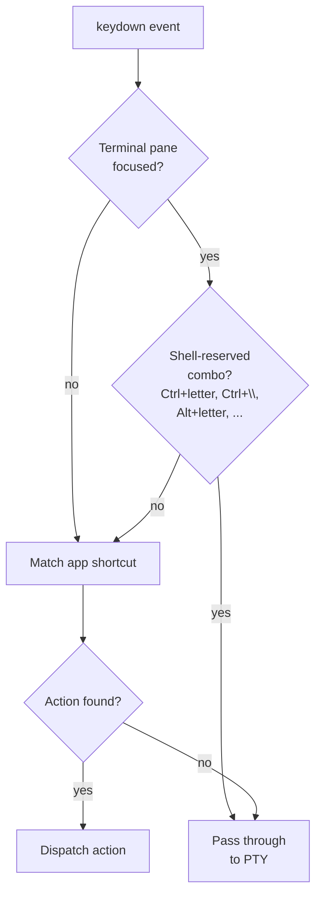

# Keyboard Shortcuts & Conflict Avoidance

This document explains the conflict-avoidance rules behind termiHub's default
keybindings, the terminal-focus pass-through behavior, and the trade-offs
involved. For the full list of bindings, open **Settings → Keyboard Shortcuts**
inside the app or press <kbd>F1</kbd> (Win/Linux) / <kbd>Cmd</kbd>+<kbd>K</kbd>
<kbd>Cmd</kbd>+<kbd>S</kbd> (macOS).

## Why conflict avoidance matters

termiHub intercepts application shortcuts in two places **before** they reach
the embedded terminal:

1. xterm's `attachCustomKeyEventHandler` (only fires while the terminal pane
   has focus).
2. The global `window` keydown listener (`useKeyboardShortcuts`).

Any combo bound to an app action therefore **does not reach the local shell or
the remote SSH session**. A shortcut that overlaps with a common
readline / tmux / vim key silently swallows the user's keystroke — and the
remote shell never sees it.

The defaults are deliberately chosen so that the most heavily-used shell keys
remain available. macOS shortcuts use the `Cmd` modifier, which does not exist
in the shell's keymap, so the conflict surface there is small. Windows/Linux
shortcuts use `Ctrl+Shift+…` and `Alt+Shift+…` to stay out of the
single-modifier readline / tmux range.

## Windows / Linux defaults vs. the keys termiHub avoids

| termiHub action    | Default (Win/Linux) | Was avoided                                                                      |
| ------------------ | ------------------- | -------------------------------------------------------------------------------- |
| Toggle Sidebar     | `Ctrl+Shift+B`      | `Ctrl+B` — tmux default prefix                                                   |
| Close Tab          | `Ctrl+Shift+W`      | `Ctrl+W` — readline `delete-word-backward`, vim `<C-w>` window prefix            |
| Close Tab Group    | `Ctrl+Shift+Q`      | (relocated to free `Ctrl+Shift+W` for Close Tab)                                 |
| Split Right        | `Alt+Shift+\`       | `Ctrl+\` — sends `SIGQUIT` (force-kill)                                          |
| Split Down         | `Alt+Shift+-`       | (paired with Split Right)                                                        |
| Focus Panel ↑↓←→   | `Alt+Shift+<Arrow>` | `Ctrl+Alt+<Arrow>` — GNOME/KDE workspace switching, Intel driver screen rotation |
| Keyboard Shortcuts | `F1`                | `Ctrl+K Ctrl+S` chord — `Ctrl+K` is readline `kill-to-end-of-line`               |

macOS keeps the more conventional single-modifier forms (`Cmd+B`, `Cmd+W`,
`Cmd+\`, `Cmd+K Cmd+S`, `Cmd+Alt+<Arrow>`) because `Cmd` does not appear in the
shell keymap and cannot collide with `Ctrl+<key>` shell shortcuts.

## Terminal-focus pass-through

Even with safer defaults, a user can still **rebind** an action to a
shell-reserved key, or hit one of the small number of less-common conflicts.
To protect against that, termiHub adds a focus-aware pass-through:

> When a terminal pane has keyboard focus, key events that match a
> "shell-reserved" pattern are passed straight through to the PTY and never
> matched against app shortcuts.

This applies on every platform. It is **on by default** and can be toggled in
**Settings → Keyboard Shortcuts → "Pass through shell keys when terminal is
focused"**.

The set of shell-reserved keys is:

- `Ctrl+<single letter>` — full readline / emacs / tmux / vim range
- `Ctrl+\` (SIGQUIT), `Ctrl+[` (Esc), `Ctrl+]` (telnet/screen escape)
- `Alt+<single letter>` — readline word-motion (`Alt+b`, `Alt+f`, …)

Combos that include `Shift`, `Meta`/`Cmd`, or non-letter keys (Tab, Arrow,
function keys) are **not** considered shell-reserved — they are safe targets
for app shortcuts.

## SSH-to-remote implications

Because pass-through fires before app-shortcut matching, the local termiHub
never swallows keys the **remote** shell, tmux, or editor expects. The most
common cases this protects:

- Remote `bash`/`zsh` readline (`Ctrl+W`, `Ctrl+K`, `Ctrl+U`, …)
- Remote `tmux` prefix (`Ctrl+B`)
- Remote `vim` (`Ctrl+W` window prefix, `Ctrl+]` jump-to-tag)
- Killing a stuck remote process with `Ctrl+\` (SIGQUIT)

Pass-through is symmetric across host platforms: a Linux desktop SSH-ing to a
Windows host, a macOS desktop SSH-ing to a Linux host, etc. all behave the
same way.

## Restoring the safer defaults

If a user has previously customized their bindings into a conflicting state,
**Settings → Keyboard Shortcuts → Reset to Safer Defaults** clears every
override and re-applies the conflict-avoiding defaults.

## When to override

The defaults are a starting point. Power users who never use tmux or who do
not work over SSH may prefer the IDE-style `Ctrl+B` / `Ctrl+W` /
`Ctrl+\` shortcuts. Re-binding individual actions is supported from the same
Settings panel; pass-through still protects against accidental shell-key
collisions even after a rebind.
