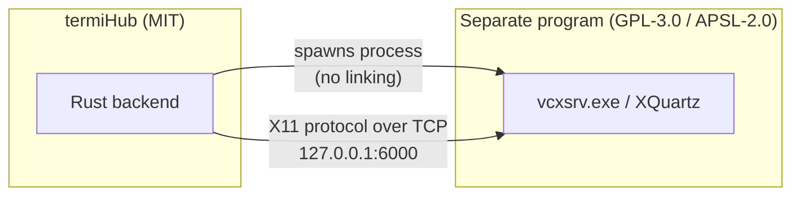

# Licensing & Third-Party Compliance

termiHub is licensed under the [MIT License](../LICENSE). This document explains
how termiHub stays compliant when it **redistributes or hosts** third-party
programs — specifically the X servers used for SSH X11 forwarding — and why doing
so does **not** change termiHub's own license.

The user-facing attribution index is [`THIRD_PARTY_LICENSES.md`](../THIRD_PARTY_LICENSES.md).
Full license texts live under [`licenses/`](../licenses/).

> **Legal status:** This document records the project's engineering rationale.
> It is **not** legal advice. The arm's-length/aggregation stance below **must be
> confirmed by counsel before a release that ships or downloads any GPL/APSL
> artifact** (see the checklist). Until that sign-off is recorded, treat the
> VcXsrv download path as not-yet-cleared for release.

## Why bundling GPL software does not "infect" termiHub

termiHub's own source is MIT-licensed. The X servers it provisions (VcXsrv on
Windows; XQuartz on macOS) are **separate, independently licensed programs** that
termiHub invokes at arm's length:

The boundary that keeps the licenses separate:

1. **Separate process, no linking.** termiHub launches `vcxsrv.exe` as its own OS
   process and talks to it only over the standard X11 wire protocol (a local TCP
   socket). termiHub does not compile, statically link, or dynamically link
   against any GPL/APSL code, and shares no address space with it.
2. **Mere aggregation.** Hosting a pinned VcXsrv `.zip` next to termiHub's own
   release artifacts is distribution of two separate works on one medium
   ("mere aggregation" in GPL-3.0 terms), not the creation of a combined/derived
   work. Each program carries and retains its own license.
3. **Independent, replaceable.** termiHub also _adopts_ an already-running user
   X server when one is present, and on macOS/Linux never ships the server at
   all — underscoring that the X server is an interchangeable external
   dependency, not a part of termiHub.

Because termiHub **redistributes** the VcXsrv binary, it must still satisfy
GPL-3.0's distribution obligations for **that binary**: ship the GPL-3.0 license
text and provide the corresponding source (or a written offer for it) for the
exact version distributed. Those are met by
[`THIRD_PARTY_LICENSES.md`](../THIRD_PARTY_LICENSES.md) plus
[`licenses/GPL-3.0.txt`](../licenses/GPL-3.0.txt). termiHub's own MIT terms are
unaffected.

## Per-platform obligations

| Platform | X server               | termiHub action                                                    | Obligation                                                          |
| -------- | ---------------------- | ------------------------------------------------------------------ | ------------------------------------------------------------------- |
| Windows  | VcXsrv (GPL-3.0)       | **Hosts + downloads + runs** a pinned build                        | Ship GPL-3.0 text + source offer for the pinned version             |
| macOS    | XQuartz (MIT/APSL-2.0) | **Detects + guides install** (brew / notarized `.pkg` / deep link) | Attribution + pointer to upstream license texts (no binary shipped) |
| Linux    | system X / XWayland    | Detects only                                                       | None (nothing shipped)                                              |

## Compliance checklist (run before any release that ships/downloads an X server)

- [ ] `THIRD_PARTY_LICENSES.md` has an entry for every redistributed/hosted
      X-server artifact and its **exact pinned version**.
- [ ] The full license text for each such artifact exists under `licenses/`.
- [ ] A source link/offer for the **pinned** version is present and the URL
      resolves.
- [ ] The pinned version in `THIRD_PARTY_LICENSES.md` matches
      `PINNED_VCXSRV.version` in `src-tauri/src/terminal/xserver/acquire.rs`.
- [ ] The in-app **About → Open Source Licenses** entry links to the attribution
      index.
- [ ] The process-boundary rationale (this document) is current.
- [ ] **Counsel has confirmed** the arm's-length/aggregation stance for the
      shipped configuration, and the sign-off is recorded in the release PR.

## Adding a new redistributed component

1. Add its license text under `licenses/<SPDX-ID>.txt`.
2. Add an entry to `THIRD_PARTY_LICENSES.md` (component, version, source link,
   license, how termiHub uses it, and — for copyleft — a written source offer).
3. Update this document's per-platform table if a new platform/obligation is
   introduced.
4. Re-run the checklist above.
