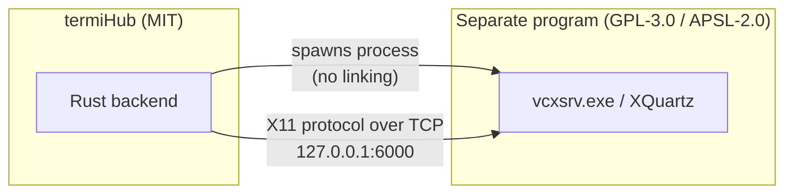
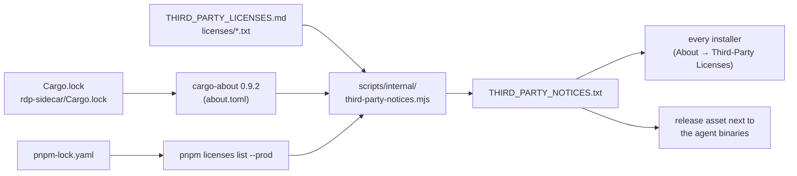

# Licensing & Third-Party Compliance

termiHub is licensed under the [MIT License](../LICENSE). This document explains
how termiHub stays compliant when it **installs and invokes** third-party
programs — specifically the X servers used for SSH X11 forwarding — and why doing
so does **not** change termiHub's own license.

> **What termiHub ships (#1318).** termiHub does **not** host, redistribute, or
> bundle any X-server binary. On Windows it installs VcXsrv via **winget**
> (`winget install -e --id marha.VcXsrv …`) — or the user installs it manually —
> and on macOS it guides the user to install XQuartz via Homebrew; on Linux it
> only detects the system X server. In every case the X server is a **separate,
> independently installed program** that termiHub launches as its own process.

The user-facing attribution index is [`THIRD_PARTY_LICENSES.md`](../THIRD_PARTY_LICENSES.md).
Full license texts live under [`licenses/`](../licenses/). The notices for the Rust
crates and npm packages that termiHub **does** compile into its binaries are
generated from the dependency graph — see
[Generated third-party notices](#generated-third-party-notices).

> **Legal status:** This document records the project's engineering rationale.
> It is **not** legal advice. The arm's-length stance below (termiHub invokes a
> separately installed GPL/APSL X server as a distinct process) **must be
> confirmed by counsel before a release** (see the checklist). Until that
> sign-off is recorded, treat the X11 forwarding path as not-yet-cleared for
> release.

## Why invoking GPL software does not "infect" termiHub

termiHub's own source is MIT-licensed. The X servers it provisions (VcXsrv on
Windows; XQuartz on macOS) are **separate, independently licensed programs** that
termiHub invokes at arm's length:



The boundary that keeps the licenses separate:

1. **Separate process, no linking.** termiHub launches `vcxsrv.exe` as its own OS
   process and talks to it only over the standard X11 wire protocol (a local TCP
   socket). termiHub does not compile, statically link, or dynamically link
   against any GPL/APSL code, and shares no address space with it.
2. **No redistribution.** termiHub does not host, bundle, or redistribute the
   VcXsrv (or XQuartz) binary. On Windows it installs VcXsrv via winget and on
   macOS it guides an install via Homebrew; the package manager (or the user)
   fetches the binary from upstream. termiHub ships only its own MIT-licensed
   code, so it never becomes a distributor of the X-server binary.
3. **Independent, replaceable.** termiHub also _adopts_ an already-running user
   X server when one is present, and never ships an X server on any platform —
   underscoring that the X server is an interchangeable external dependency, not
   a part of termiHub.

Because termiHub **does not redistribute** the VcXsrv binary — winget or the user
fetches it from upstream — GPL-3.0's distribution obligations (ship the license
text, provide corresponding source or a written offer) do **not** attach to
termiHub's distribution. This matches
[`THIRD_PARTY_LICENSES.md`](../THIRD_PARTY_LICENSES.md), which retains the
GPL-3.0 text under [`licenses/GPL-3.0.txt`](../licenses/GPL-3.0.txt) and an
upstream source pointer for **attribution and reference** rather than as a
redistribution obligation. termiHub's own MIT terms are unaffected.

## Per-platform obligations

| Platform | X server               | termiHub action                                               | Obligation                                                                                   |
| -------- | ---------------------- | ------------------------------------------------------------- | -------------------------------------------------------------------------------------------- |
| Windows  | VcXsrv (GPL-3.0)       | **Installs via winget + runs** (does not host/redistribute)   | None for redistribution — winget/the user fetches it; termiHub runs it as a separate process |
| macOS    | XQuartz (MIT/APSL-2.0) | **Installs via Homebrew + runs** (does not host/redistribute) | Attribution + pointer to upstream license texts (no binary shipped)                          |
| Linux    | system X / XWayland    | Detects only                                                  | None (nothing shipped)                                                                       |

## Compliance checklist (run before any release that installs/invokes an X server)

- [ ] `THIRD_PARTY_LICENSES.md` has an attribution entry for every X server
      termiHub installs or invokes (VcXsrv, XQuartz), each with an upstream
      source pointer.
- [ ] The full license text for each such component exists under `licenses/`.
- [ ] The winget install command in `THIRD_PARTY_LICENSES.md` matches
      `WINGET_INSTALL_VCXSRV_COMMAND` in
      `src-tauri/src/terminal/xserver/types.rs`.
- [ ] The in-app **About → Third-Party Licenses** viewer shows the bundled
      `THIRD_PARTY_NOTICES.txt` (it includes this attribution index).
- [ ] The process-boundary rationale (this document) is current.
- [ ] **Counsel has confirmed** the arm's-length stance (installing via a package
      manager and invoking a separate GPL/APSL process, with no redistribution)
      for the shipped configuration, and the sign-off is recorded in the release
      PR.

## Adding a new installed/invoked component

1. Add its license text under `licenses/<SPDX-ID>.txt`.
2. Add an entry to `THIRD_PARTY_LICENSES.md` (component, source link, license,
   and how termiHub installs/uses it). If a future component is ever **bundled
   or redistributed** rather than installed via a package manager, also record
   its exact pinned version and — for copyleft — a written source offer, and
   have counsel re-confirm the stance.
3. Update this document's per-platform table if a new platform/obligation is
   introduced.
4. Re-run the checklist above.

## Generated third-party notices

Unlike the X servers, the Rust crates and npm packages termiHub is built from **are**
redistributed — compiled into the desktop app, the agent and the RDP sidecar, or
bundled into the frontend. Most of their licenses (MIT, BSD, Apache-2.0, ISC, ...)
require the copyright notice and license text to accompany the binary. termiHub meets
that with one generated, plain-text `THIRD_PARTY_NOTICES.txt` (audit finding PKG-009):



- **Rust:** `cargo about generate --format json --frozen --fail` over `src-tauri`,
  `agent` and `rdp-sidecar` (all target platforms, build/dev dependencies excluded,
  first-party crates skipped). `about.toml`'s `accepted` list mirrors `deny.toml`'s
  license allowlist.
- **npm:** production dependencies only, each with its own `LICENSE`/`NOTICE` files. A
  package that ships no license file gets the standard text of its SPDX license and is
  marked as such.
- **External programs:** the content of `THIRD_PARTY_LICENSES.md` plus the texts under
  `licenses/`.

Identical texts are printed once and cross-referenced by number. The output is a pure
function of the lockfiles and the pinned cargo-about version (about 1.1 MB).

**Why it is generated, not committed.** The file changes with every dependency bump, so
a committed copy would either drift or need a regeneration on every Renovate/Dependabot
PR. The app does not need it to compile: it is bundled only by the
`src-tauri/tauri.notices.conf.json` config fragment, which just the bundling builds merge
in (`release.yml`, and `scripts/build.sh` / `build.cmd` when cargo-about is installed).
Builds without it — `./scripts/dev.sh`, CI dev builds — show "not bundled in this build"
with a link to the online attribution instead.

**Regenerate locally** (no build needed; crate sources are fetched):

```bash
cargo install cargo-about --locked --version 0.9.2   # once
pnpm notices:generate            # -> src-tauri/resources/THIRD_PARTY_NOTICES.txt (gitignored)
pnpm notices:generate --out /tmp/THIRD_PARTY_NOTICES.txt
pnpm notices:check               # config + npm license gate only (no cargo-about)
```

**CI gates.**

- `release.yml` → **Generate Third-Party Notices** generates the file once, hands it to
  every installer build and uploads it as `termiHub-<version>-THIRD_PARTY_NOTICES.txt`;
  `verify-release` requires the asset.
- `security-audit.yml` → **Third-Party Notices** runs on dependency PRs and on pushes to
  `develop`/`main`: `pnpm notices:check` (about.toml equals deny.toml's allowlist, every
  npm production license is allowlisted, the cargo-about pin matches in every workflow)
  and a dry-run `pnpm notices:generate`, which fails if any crate has no license text.
  An unapproved Rust license is rejected by the `cargo deny check licenses` step.

**Bumping cargo-about:** change `CARGO_ABOUT_VERSION` in
`scripts/internal/third-party-notices.mjs` and the `cargo-about@…` pins in
`release.yml` and `security-audit.yml` together (`pnpm notices:check` fails on drift).
