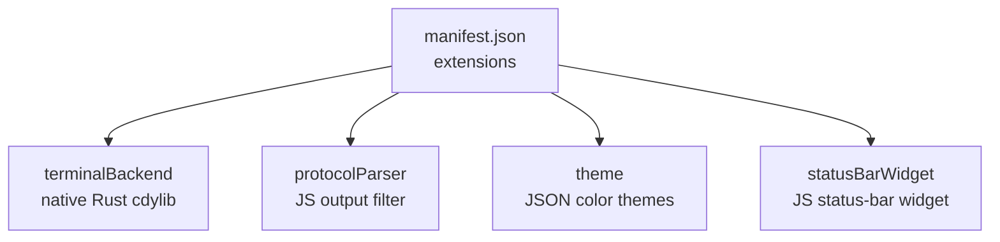
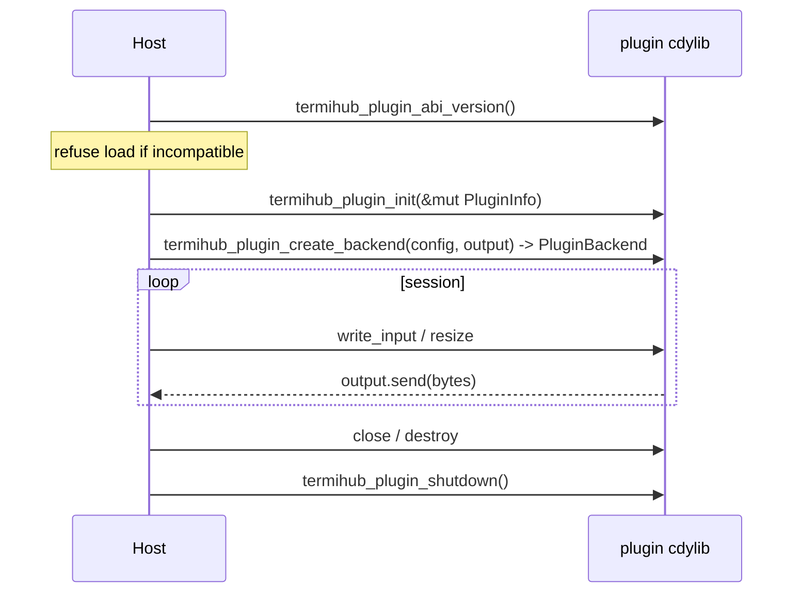
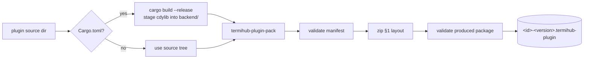

# Authoring termiHub plugins

This guide covers everything a third party needs to build and package a termiHub
plugin: the `.termihub-plugin` package format, the `manifest.json` schema, the
permission and extension-point model, the native-backend ABI (and its important
caveat), and how to produce a validated package with the `package-plugin` script.

> **Status.** The plugin _package format_, _manifest validation_ and the
> _packaging tooling_ described here are implemented. The runtime **host/loader**
> (installing, enabling, and executing plugins) and the plugin **management UI**
> are tracked separately and may not be present in every build. This document is
> the authoring contract; it stays accurate regardless of loader progress.

The two worked examples referenced throughout live under
[`examples/plugins/`](../examples/plugins):

- [`solarized-night-theme/`](../examples/plugins/solarized-night-theme) — a
  JSON-only theme plugin (no native code).
- [`echo-backend/`](../examples/plugins/echo-backend) — a native terminal-backend
  plugin built against [`termihub-plugin-api`](../plugin-api).

## The package format

A plugin is distributed as a single `.termihub-plugin` file: a ZIP archive with a
fixed layout. Only `manifest.json` is required; every other entry is optional and
depends on which extension points the plugin provides.

```text
my-plugin.termihub-plugin (ZIP)
├── manifest.json           # required — plugin metadata and declarations
├── backend/                # optional — native Rust dynamic library
│   ├── my_plugin.dll       #   Windows
│   ├── libmy_plugin.so     #   Linux
│   └── libmy_plugin.dylib  #   macOS
├── frontend/               # optional — JavaScript/CSS assets
│   ├── index.js            #   frontend entry point
│   └── styles.css          #   styles
├── themes/                 # optional — theme JSON files
│   └── dracula.json
└── README.md               # optional — plugin documentation
```

Constraints enforced on install:

- The whole file must not exceed **50 MB**.
- `manifest.json` must exist at the archive root and pass full validation.
- The manifest's `apiVersion` must be compatible with the host (see
  [API-version compatibility](#api-version-compatibility)).

## The manifest

`manifest.json` declares the plugin's identity, the platforms and permissions it
needs, and the extension points it provides. JSON keys are `camelCase`, and
**unknown keys are rejected** — a typo fails validation rather than being
silently ignored.

```json
{
  "id": "k8s-exec",
  "name": "Kubernetes Exec",
  "version": "1.2.0",
  "author": "k8s-contrib",
  "description": "Terminal backend for Kubernetes pod exec sessions",
  "license": "MIT",
  "apiVersion": "1.0",
  "platforms": ["windows", "linux", "macos"],
  "permissions": ["terminal", "network", "filesystem"],
  "extensions": {
    "terminalBackend": {
      "connectionType": "k8s-exec",
      "displayName": "Kubernetes Exec",
      "configSchema": {
        "type": "object",
        "properties": { "pod": { "type": "string" } },
        "required": ["pod"]
      }
    }
  },
  "settings": {
    "defaultNamespace": {
      "type": "string",
      "default": "default",
      "description": "Default Kubernetes namespace"
    }
  }
}
```

### Fields

| Field         | Type     | Required | Notes                                                                                                                                                                          |
| ------------- | -------- | -------- | ------------------------------------------------------------------------------------------------------------------------------------------------------------------------------ |
| `id`          | string   | yes      | Stable, filesystem-safe identifier; becomes the install directory name. Must be a slug of lowercase letters, digits and single interior hyphens, 1–64 chars (e.g. `k8s-exec`). |
| `name`        | string   | yes      | Human-readable display name.                                                                                                                                                   |
| `version`     | string   | yes      | Plugin version (informational; the host does not interpret it).                                                                                                                |
| `author`      | string   | yes      | Plugin author.                                                                                                                                                                 |
| `description` | string   | yes      | Short description.                                                                                                                                                             |
| `license`     | string   | yes      | SPDX-style license identifier.                                                                                                                                                 |
| `apiVersion`  | string   | yes      | Plugin-API version as `"major"` or `"major.minor"` (e.g. `"1.0"`).                                                                                                             |
| `platforms`   | string[] | yes      | Supported desktop platforms: `windows`, `linux`, `macos`.                                                                                                                      |
| `permissions` | string[] | yes      | Requested capabilities (see below). May be empty.                                                                                                                              |
| `extensions`  | object   | yes      | Extension points provided; **at least one** required.                                                                                                                          |
| `settings`    | object   | no       | User-configurable settings, keyed by setting name.                                                                                                                             |

### Permissions

Permissions are a **closed set** of coarse-grained capabilities. An unknown
permission string fails validation, which is what lets the install-time consent
prompt be exhaustive. Request the minimum a plugin actually needs — a theme
plugin, for instance, needs **none**.

| Permission   | Grants                                                |
| ------------ | ----------------------------------------------------- |
| `terminal`   | Creating and managing terminal sessions.              |
| `network`    | Making outbound network connections.                  |
| `filesystem` | Reading and writing files (scoped to declared paths). |
| `ui`         | Rendering UI components in designated slots.          |
| `settings`   | Storing and reading plugin-specific configuration.    |

### Settings

Each entry under `settings` describes one user-configurable value:

| Field         | Type                              | Notes                                          |
| ------------- | --------------------------------- | ---------------------------------------------- |
| `type`        | `string` \| `number` \| `boolean` | The setting's primitive type.                  |
| `default`     | any                               | Default applied when the user has not set one. |
| `description` | string                            | Shown in the settings UI.                      |
| `enum`        | string[]                          | Optional closed set of allowed string values.  |

### API-version compatibility

The manifest's `apiVersion` is checked against the host's supported version:
**major versions must match, and the plugin's minor must not exceed the host's.**
An incompatible version is reported as its own distinct outcome so the host can
prompt the user to update rather than treating the package as malformed.

## Extension points

A plugin declares one or more extension points under `extensions`. At least one
is required.



### `terminalBackend`

Registers a new connection type backed by a native dynamic library (see
[Native backends](#native-backends-and-the-abi)).

| Field            | Notes                                                                                                                                                    |
| ---------------- | -------------------------------------------------------------------------------------------------------------------------------------------------------- |
| `connectionType` | The connection type this backend registers.                                                                                                              |
| `displayName`    | Name shown in the connection-type selector.                                                                                                              |
| `configSchema`   | JSON Schema describing the backend's connection config. The host renders a form from it and hands the resulting JSON to the backend at session creation. |

### `theme`

Bundles one or more color themes as JSON files under `themes/`.

```json
"theme": {
  "themes": [
    { "id": "solarized-night", "name": "Solarized Night", "file": "solarized-night.json" }
  ]
}
```

Each entry's `file` names a JSON file inside the package's `themes/` directory.
The theme file uses termiHub's portable theme format (schema
`termihub-theme-v1`): a `name`, an optional `baseTheme` to inherit unspecified
colors from, a `colorScheme` (`dark`/`light`), and a `colors` map of theme
tokens. Only overridden colors need to be present. See
[`solarized-night.json`](../examples/plugins/solarized-night-theme/themes/solarized-night.json)
for a complete example.

### `protocolParser` and `statusBarWidget`

JavaScript extension points (`protocolParser` transforms terminal output;
`statusBarWidget` renders a widget into the status bar). Each names a JS
`entryPoint` inside the package's `frontend/` directory. These are validated for
presence today; wiring them into the running app is host/loader work.

## Native backends and the ABI

A native terminal backend is a Rust `cdylib` that depends on the
[`termihub-plugin-api`](../plugin-api) crate — the **stable ABI contract**
compiled into both the host and every plugin. Implement the
`PluginTerminalBackend` trait for your session type and export four
`extern "C"` symbols:

| Symbol                           | Purpose                                      |
| -------------------------------- | -------------------------------------------- |
| `termihub_plugin_abi_version`    | ABI version the plugin was built against.    |
| `termihub_plugin_init`           | Fills in the plugin's `PluginInfo` metadata. |
| `termihub_plugin_create_backend` | Builds a session backend from JSON config.   |
| `termihub_plugin_shutdown`       | Process-wide cleanup before unload.          |



[`echo-backend/src/lib.rs`](../examples/plugins/echo-backend/src/lib.rs) is a
complete, tested implementation of all four symbols.

### The ABI caveat — read this

**Rust has no stable ABI.** The in-memory layout of `String`, slices, trait
objects and most enums can change between compiler versions and even builds. A
native plugin is therefore only sound to load when it was:

1. built against the **same major ABI version** of `termihub-plugin-api` that the
   target host ships — the host calls `termihub_plugin_abi_version` first and
   **refuses to load a mismatch**; and
2. built with a **compatible Rust toolchain**.

Consequences for authors:

- Everything crossing the boundary is `#[repr(C)]` or an opaque handle — never
  pass Rust's own `String`, `Vec`, `&[T]` or `dyn Trait` across it directly. The
  `termihub-plugin-api` types (`FfiStr`, `FfiString`, `PluginBackend`, …) exist
  precisely so you don't have to.
- A package's `backend/` directory carries the library for **one operating
  system** only (`.dll` / `.so` / `.dylib`). Cross-platform builds are the
  author's responsibility; ship one package per OS, or a fat package containing
  each platform's library.
- Because cross-platform dynamic-library building is not wired into per-PR CI,
  the native example's **packaging** is exercised locally / on a single platform,
  while the crate itself is compiled on every platform by the workspace build and
  covered by unit tests.

## Packaging

Use the `package-plugin` helper from the repository root. It validates the
manifest, builds the backend `cdylib` if the source is a Rust crate, stages the
compiled library into `backend/`, zips the layout above, and **round-trip
validates** the result against the same checks the host applies on install.

```bash
# JSON-only plugin (no native code):
./scripts/package-plugin.sh examples/plugins/solarized-night-theme --out dist --no-build

# Native backend plugin (builds the cdylib, then packages):
./scripts/package-plugin.sh examples/plugins/echo-backend --out dist
```

On Windows use `scripts\package-plugin.cmd` with the same arguments. The output
is named `<id>-<version>.termihub-plugin`.



### What gets packaged

Only the manifest and the well-known parts of the layout are included:
`manifest.json`, `README.md`, and the `backend/`, `frontend/` and `themes/`
subtrees if present. Crate scaffolding (`Cargo.toml`, `src/`, `target/`) and
editor dotfiles are ignored, so you can package a backend crate directory
directly without staging a clean tree by hand.

## Signing your plugin

Signing is **optional but recommended**. A signed package lets the host verify,
offline, that it was built by the holder of a specific key and has not been
altered since — covering the *entire* payload, not just the manifest. Unsigned
packages still install (behind the existing untrusted-source acknowledgement), so
signing is additive and backward-compatible.

A signed package carries one extra root entry, `signature.json`: a per-entry
SHA-256 digest map of every other file plus a single Ed25519 signature over a
canonical form of that map. The signature survives the packer's deterministic
re-zip because it signs *content*, not byte offsets.

**1. Generate a keypair once** (guard the private key — it *is* your publisher
identity, and it cannot be recovered if lost):

```bash
cargo run -p termihub-core --features plugin --bin termihub-plugin-keygen -- \
    --out acme.key --label "ACME Terminals"
# prints the public key and its fingerprint, e.g. sha256:ab12…9f0e
```

Publish the printed **fingerprint** next to your plugin (release page, repo,
website) so users can compare it on first install.

**2. Sign at package time** with `--sign`, or sign an already-built package:

```bash
# Package and sign in one step:
./scripts/package-plugin.sh examples/plugins/echo-backend --out dist --sign acme.key

# Or sign a package you already built:
cargo run -p termihub-core --features plugin --bin termihub-plugin-sign -- \
    --key acme.key dist/echo-backend-1.0.0.termihub-plugin
```

On Windows use `scripts\package-plugin.cmd … --sign acme.key`.

**How the host treats it at install** (concept
`docs/concepts/backlog/plugin-code-signing.html`):

| Package state                                   | Install gate                                              |
| ----------------------------------------------- | --------------------------------------------------------- |
| Signed by a **trusted** key (bundled or pinned) | **Verified** — no untrusted-source warning.               |
| Signed by an **unknown** key                    | Shows the fingerprint; user can **trust it** (pin) once.  |
| **Unsigned**                                    | The existing untrusted-source acknowledgement (unchanged).|
| **Signature invalid** (tampered)                | **Blocked**, no override.                                 |

Trust-on-first-use pinning is managed in **Settings → Plugins → Trusted
Publishers**. Re-signing a package with a different key than a user pinned
re-prompts them (a key rotation they must re-confirm), rather than trusting a
silent swap.

## Testing your plugin

- **Manifest / packaging:** `package-plugin` fails loudly if the manifest is
  invalid or the produced archive would not validate, so a successful run is your
  first check.
- **Native backend logic:** give your `cdylib` crate a `crate-type` of
  `["cdylib", "rlib"]` and unit-test the backend through the safe host-side
  wrapper (`LoadedBackend`) with an `mpsc`-backed `PluginOutputSender` — no
  dynamic library required. See the tests in
  [`echo-backend/src/lib.rs`](../examples/plugins/echo-backend/src/lib.rs).
