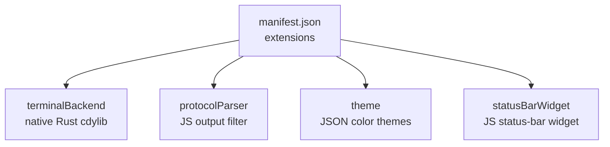
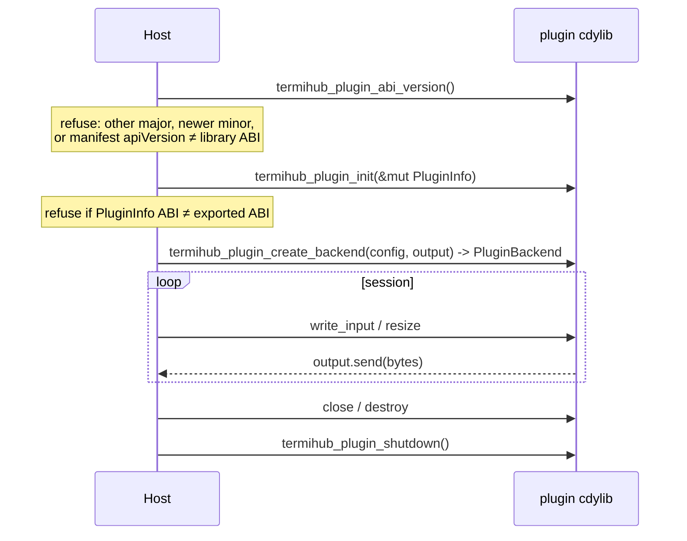
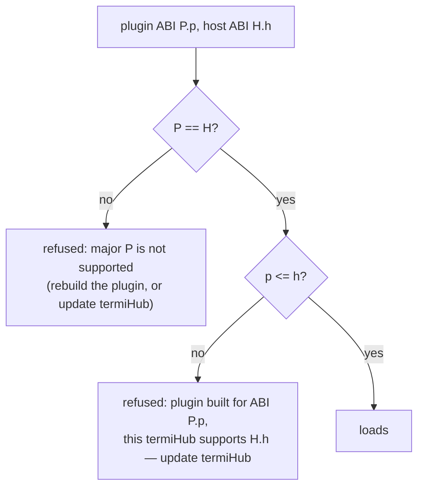
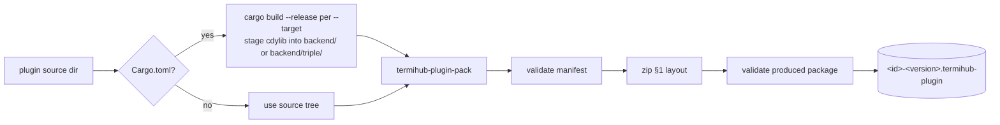
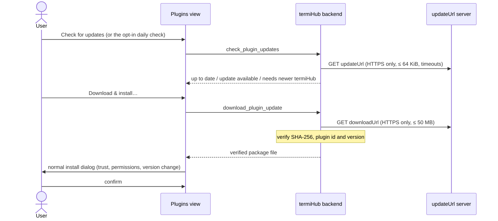

# Authoring termiHub plugins

This guide covers everything a third party needs to build and package a termiHub
plugin: the `.termihub-plugin` package format, the `manifest.json` schema, the
permission and extension-point model, the native-backend ABI (and its important
caveat), and how to produce a validated package with the `package-plugin` script.

> **Status.** The plugin _package format_, _manifest validation_ and the
> _packaging tooling_ described here are implemented, and so are the runtime
> **host/loader** (installing, enabling, and executing plugins — wired in
> `src-tauri/src/lib.rs`) and the plugin **management UI**. This document is the
> authoring contract for the shipped host.

The worked examples referenced throughout live under
[`examples/plugins/`](../examples/plugins) — one per extension point:

- [`solarized-night-theme/`](../examples/plugins/solarized-night-theme) — a
  JSON-only theme plugin (no native code).
- [`echo-backend/`](../examples/plugins/echo-backend) — a native terminal-backend
  plugin built against [`termihub-plugin-api`](../plugin-api).
- [`log-highlighter/`](../examples/plugins/log-highlighter) — a JavaScript
  protocol parser that colors `ERROR` / `WARN` in terminal output.
- [`clock-widget/`](../examples/plugins/clock-widget) — a JavaScript status-bar
  widget that shows the local time.

## The package format

A plugin is distributed as a single `.termihub-plugin` file: a ZIP archive with a
fixed layout. Only `manifest.json` is required; every other entry is optional and
depends on which extension points the plugin provides.

```text
my-plugin.termihub-plugin (ZIP)
├── manifest.json           # required — plugin metadata and declarations
├── backend/                # optional — native Rust dynamic library, either
│   │                       #   one directory per target triple (multi-platform):
│   ├── x86_64-pc-windows-msvc/my_plugin.dll
│   ├── x86_64-unknown-linux-gnu/libmy_plugin.so
│   ├── aarch64-apple-darwin/libmy_plugin.dylib
│   │                       #   …or a single flat library (legacy single-platform)
├── frontend/               # optional — JavaScript/CSS assets
│   ├── index.js            #   frontend entry point
│   └── styles.css          #   styles
├── themes/                 # optional — theme JSON files
│   └── dracula.json
└── README.md               # optional — plugin documentation
```

Constraints enforced on install:

- The whole file must not exceed **50 MB**.
- `manifest.json` must exist at the archive root and pass full validation.
- The manifest's `apiVersion` must be compatible with the host (see
  [API-version compatibility](#api-version-compatibility)).
- A multi-platform package must carry a library for the installing host's target
  triple; otherwise the install is refused with _"not available for this
  platform"_ (see [Multi-platform packages](#multi-platform-packages)).

## The manifest

`manifest.json` declares the plugin's identity, the platforms and permissions it
needs, and the extension points it provides. JSON keys are `camelCase`, and
**unknown keys are rejected** — a typo fails validation rather than being
silently ignored.

```json
{
  "id": "k8s-exec",
  "name": "Kubernetes Exec",
  "version": "1.2.0",
  "author": "k8s-contrib",
  "description": "Terminal backend for Kubernetes pod exec sessions",
  "license": "MIT",
  "apiVersion": "1.0",
  "platforms": ["windows", "linux", "macos"],
  "permissions": ["terminal", "network", "filesystem"],
  "extensions": {
    "terminalBackend": {
      "connectionType": "k8s-exec",
      "displayName": "Kubernetes Exec",
      "configSchema": {
        "type": "object",
        "properties": { "pod": { "type": "string" } },
        "required": ["pod"]
      }
    }
  },
  "settings": {
    "defaultNamespace": {
      "type": "string",
      "default": "default",
      "description": "Default Kubernetes namespace"
    }
  }
}
```

### Fields

| Field         | Type     | Required | Notes                                                                                                                                                                          |
| ------------- | -------- | -------- | ------------------------------------------------------------------------------------------------------------------------------------------------------------------------------ |
| `id`          | string   | yes      | Stable, filesystem-safe identifier; becomes the install directory name. Must be a slug of lowercase letters, digits and single interior hyphens, 1–64 chars (e.g. `k8s-exec`). |
| `name`        | string   | yes      | Human-readable display name.                                                                                                                                                   |
| `version`     | string   | yes      | Plugin [semver](https://semver.org) version. Installing an older version, or a different build of the same one, over an installed copy asks the user to confirm.               |
| `author`      | string   | yes      | Plugin author.                                                                                                                                                                 |
| `description` | string   | yes      | Short description.                                                                                                                                                             |
| `license`     | string   | yes      | SPDX-style license identifier.                                                                                                                                                 |
| `apiVersion`  | string   | yes      | Plugin ABI version as canonical `"major.minor"` (currently `"1.0"`); must mirror the native library's ABI — see [API-version compatibility](#api-version-compatibility).       |
| `platforms`   | string[] | yes      | Supported desktop platforms: `windows`, `linux`, `macos`.                                                                                                                      |
| `permissions` | string[] | yes      | Requested capabilities (see below). May be empty.                                                                                                                              |
| `extensions`  | object   | yes      | Extension points provided; **at least one** required.                                                                                                                          |
| `settings`    | object   | no       | User-configurable settings, keyed by setting name.                                                                                                                             |
| `updateUrl`   | string   | no       | HTTPS URL of the plugin's [update document](#updates-and-the-01-distribution-model). Enables "Check for updates"; never installs anything by itself.                           |

### Permissions

Permissions are a **closed set** of coarse-grained capabilities. An unknown
permission string fails validation, which is what lets the install-time consent
prompt be exhaustive. Request the minimum a plugin actually needs — a theme
plugin, for instance, needs **none**.

| Permission   | Grants                                                |
| ------------ | ----------------------------------------------------- |
| `terminal`   | Creating and managing terminal sessions.              |
| `network`    | Making outbound network connections.                  |
| `filesystem` | Reading and writing files (scoped to declared paths). |
| `ui`         | Rendering UI components in designated slots.          |
| `settings`   | Storing and reading plugin-specific configuration.    |

### Settings

Each entry under `settings` describes one user-configurable value:

| Field         | Type                              | Notes                                          |
| ------------- | --------------------------------- | ---------------------------------------------- |
| `type`        | `string` \| `number` \| `boolean` | The setting's primitive type.                  |
| `default`     | any                               | Default applied when the user has not set one. |
| `description` | string                            | Shown in the settings UI.                      |
| `enum`        | string[]                          | Optional closed set of allowed string values.  |

### API-version compatibility

termiHub has **one** plugin version number: the native plugin **ABI version**,
`major.minor`, currently **1.0** (frozen — see
[ABI 1.0 and the compatibility promise](#abi-10-and-the-compatibility-promise)).
The manifest's `apiVersion` is a checked **mirror** of it, never an independent
number:

- It must be written as canonical `"major.minor"` (`"1.0"`, not `"1"`).
- It is checked on install and on every start with the ABI rule: **major versions
  must match, and the plugin's minor must not exceed the host's.** An
  incompatible version is reported as its own distinct outcome (the plugin is
  shown as _incompatible_ and auto-disabled) rather than as a malformed package.
- For a plugin with a native `terminalBackend`, the loader additionally requires
  `apiVersion` to **equal** the ABI version the library itself exports. A package
  whose manifest and library disagree is refused with an error naming both.

Theme / JS-only plugins have no library, so for them `apiVersion` is checked
against the host with the same rule and nothing else.

## Extension points

A plugin declares one or more extension points under `extensions`. At least one
is required.



### `terminalBackend`

Registers a new connection type backed by a native dynamic library (see
[Native backends](#native-backends-and-the-abi)).

> **Default-off, trusted per plugin.** A native backend runs in-process with the
> app's full privileges and no OS sandbox, so it does not load just because it is
> installed and enabled. The user must turn on **Settings → Plugins → Native
> Plugins (Advanced)** _and_ explicitly trust the plugin there. The trust
> acknowledgement is bound to a SHA-256 hash of the library file, so rebuilding or
> replacing the library requires trusting it again. Until both conditions hold,
> the host refuses to load the backend.

| Field            | Notes                                                                                                                                                    |
| ---------------- | -------------------------------------------------------------------------------------------------------------------------------------------------------- |
| `connectionType` | The connection type this backend registers: 1–64 characters of letters, digits, `.`, `_` or `-` (no `:`).                                                |
| `displayName`    | Name shown in the connection-type selector.                                                                                                              |
| `configSchema`   | JSON Schema describing the backend's connection config. The host renders a form from it and hands the resulting JSON to the backend at session creation. |
| `libraries`      | Optional. Target triple → library path under `backend/`, for [multi-platform packages](#multi-platform-packages). Generated by the packer.               |

#### Connection type ids

The host registers your backend under a **stable, namespaced id** derived only
from your manifest:

```text
plugin:<plugin id>:<connectionType>      e.g.  plugin:k8s-exec:k8s-exec
```

This is the `type` a user's saved connections, session history and workspaces
store for your backend. It never depends on load order or on which other plugins
are installed, so:

- two plugins declaring the same `connectionType` never collide — each keeps its
  own id;
- a plugin can never shadow a built-in type (`ssh`, `local`, …), and a future
  built-in of the same name can never take over your users' connections;
- saved connections keep resolving to your plugin across restarts.

Consequently, **changing your plugin `id` or `connectionType` in an update
orphans every connection users saved against the old id** — treat both as
permanent once published. (A connection whose plugin is missing is kept, not
deleted — the sidebar marks it with a badge naming your plugin and why it is
unavailable (not installed, disabled, or not trusted), and connecting is refused
with the same message; it works again once the plugin is installed and
enabled.) If two types share a
`displayName`, the selector suffixes the later one with your plugin `name`.

Connections saved before this scheme (when the first plugin to load got the
bare `connectionType` and later ones `<connectionType>-<plugin id>`) are
migrated to the namespaced id automatically when termiHub loads them — including
connections in external connection files and in imported connection and
workspace exports.

### `theme`

Bundles one or more color themes as JSON files under `themes/`.

```json
"theme": {
  "themes": [
    { "id": "solarized-night", "name": "Solarized Night", "file": "solarized-night.json" }
  ]
}
```

Each entry's `file` names a JSON file inside the package's `themes/` directory.
The theme file uses termiHub's portable theme format (schema
`termihub-theme-v1`): a `name`, an optional `baseTheme` to inherit unspecified
colors from, a `colorScheme` (`dark`/`light`), and a `colors` map of theme
tokens. Only overridden colors need to be present. See
[`solarized-night.json`](../examples/plugins/solarized-night-theme/themes/solarized-night.json)
for a complete example.

### `protocolParser` and `statusBarWidget`

JavaScript extension points (`protocolParser` transforms terminal output;
`statusBarWidget` renders a widget into the status bar). Each names a JS
`entryPoint` inside the package's `frontend/` directory. These are validated for
presence and executed by the shipped frontend plugin host — `protocolParser` and
`statusBarWidget` run in the plugin sandbox (`src/plugins/sandbox/`) and render
into the app (e.g. the status bar via `PluginStatusBarWidgets`).

Both run in a sandboxed Web Worker (no DOM, no `window`, no Tauri IPC). The
entry point is wrapped so that `termihub` is the plugin's own API instance:

```js
termihub.registerProtocolParser({
  id: "log-highlighter",
  name: "Log Highlighter",
  // Return the rewritten chunk, or null to pass it through byte-exact.
  transform: (data, sessionId) => (data.includes("ERROR") ? highlight(data) : null),
});

termihub.registerStatusBarWidget({
  id: "clock-widget",
  position: "right",
  // No DOM in the sandbox: return a declarative node the host builds safely.
  render: () => ({ tag: "span", text: "09:05" }),
  dispose: () => clearInterval(timer),
});
```

A widget updates by registering again under the same `id`; `dispose()` runs when
the plugin is disabled or uninstalled. The two samples,
[`log-highlighter`](../examples/plugins/log-highlighter) and
[`clock-widget`](../examples/plugins/clock-widget), are complete, commented
references; `src/plugins/examplePlugins.test.ts` loads both through the sandbox
runtime exactly as the app does.

> **Experimental, default-off gate.** Frontend (JavaScript) plugins run inside the
> main WebView with full IPC/command access and no per-plugin permission
> enforcement — the manifest `permissions` are not applied to them (tracked in
> #2001). Their code therefore only runs when the user turns on **Settings →
> Plugins → Frontend Plugins (Experimental)**, which is off by default. With the
> gate off, `protocolParser` and `statusBarWidget` entries are installed but never
> loaded, and turning it off tears down running frontend plugins immediately.
> Theme-only and native-backend plugins are unaffected by this setting.

## Native backends and the ABI

A native terminal backend is a Rust `cdylib` that depends on the
[`termihub-plugin-api`](../plugin-api) crate — the **stable ABI contract**
compiled into both the host and every plugin. Implement the
`PluginTerminalBackend` trait for your session type and export four
`extern "C"` symbols:

| Symbol                           | Purpose                                      |
| -------------------------------- | -------------------------------------------- |
| `termihub_plugin_abi_version`    | ABI version the plugin was built against.    |
| `termihub_plugin_init`           | Fills in the plugin's `PluginInfo` metadata. |
| `termihub_plugin_create_backend` | Builds a session backend from JSON config.   |
| `termihub_plugin_shutdown`       | Process-wide cleanup before unload.          |



[`echo-backend/src/lib.rs`](../examples/plugins/echo-backend/src/lib.rs) is a
complete, tested implementation of all four symbols. `termihub_plugin_abi_version`
returns `CURRENT_PLUGIN_ABI_VERSION.to_packed()` (the version packed into a `u32`
as `major << 16 | minor`), and `PluginInfo::new` fills in the same value.

### ABI 1.0 and the compatibility promise

The native ABI is **frozen at 1.0** (maintainer decision 2026-09-26, #3367). A
host at ABI `H.h` loads a plugin built for ABI `P.p` only when `P == H` and
`p <= h`:



So a plugin keeps loading across termiHub updates for the whole 1.x line, and a
plugin built for a newer minor is refused with a clear "update termiHub" instead
of misbehaving. Plugins built before the freeze (which exported a bare counter,
`1`–`4`) read as ABI `0.x` and are refused as an unsupported major — rebuild them.

**What a minor may add** (older-minor plugins keep working):

- a callback appended to a **host-owned** table — the capability-bridge vtable
  (`PluginHostBridgeVTable`) or the mediated-stream vtable;
- a field appended to a **host-allocated** struct the host passes by pointer or
  as an out-parameter (`PluginSessionConfig`, `PluginInfo`) — the host reads an
  appended field only when the plugin's ABI supports that minor;
- a new, **optional exported symbol** for new plugin-provided behavior — the host
  resolves it only when the plugin's minor includes it;
- a new `PluginStatus` variant — the host never hands it to a plugin built for an
  older minor (it is downgraded to `Other`).

**What counts as breaking** (needs a new **major**, i.e. every plugin must be
rebuilt): reordering, removing, retyping or resizing an existing field, variant
or symbol; changing its meaning; or growing a struct that is passed **by value**
or owned by the plugin (`PluginBackend`, `PluginBackendVTable`,
`PluginOutputSender`, `PluginHostBridge`, `PluginTcpStream`, `PluginFileMetadata`,
the `Ffi*` carriers). `plugin-api/tests/abi_layout.rs` pins the 1.0 layout so an
accidental break fails CI.

### The SDK is internal for 0.1

`termihub-plugin-api` is **not published** (it stays `publish = false`) for the
0.1 release. The ABI above is frozen, but the SDK crate that implements it is
only obtainable by building inside this repository — as the in-repo example and
test fixture do, via a `path` dependency. Treat native-plugin authoring as
**internal** for 0.1: there is no supported `crates.io` or `git`+`tag`
dependency line yet, and publishing the SDK (with its version tied to the ABI
major/minor) is a later decision. Theme and JS-only plugins need no SDK.

### The ABI caveat — read this

**Rust has no stable ABI.** The in-memory layout of `String`, slices, trait
objects and most enums can change between compiler versions and even builds. A
native plugin is therefore only sound to load when it was:

1. built against an ABI version the target host accepts — **the same major, and a
   minor no newer than the host's** (see above); the host calls
   `termihub_plugin_abi_version` first and **refuses anything else**; and
2. built with a **compatible Rust toolchain**.

Consequences for authors:

- Everything crossing the boundary is `#[repr(C)]` or an opaque handle — never
  pass Rust's own `String`, `Vec`, `&[T]` or `dyn Trait` across it directly. The
  `termihub-plugin-api` types (`FfiStr`, `FfiString`, `PluginBackend`, …) exist
  precisely so you don't have to.
- A native library only runs on the platform it was built for. One package can
  carry every platform's library — see
  [Multi-platform packages](#multi-platform-packages); the host loads only the
  one for its own target triple.
- CI packages the `echo-backend` example on Linux, Windows and macOS, installs
  and loads each package with the real host, and merges them into one
  multi-platform package (`.github/workflows/plugin-packaging.yml`).

## Packaging

Use the `package-plugin` helper from the repository root. It validates the
manifest, builds the backend `cdylib` if the source is a Rust crate, stages the
compiled library into `backend/`, zips the layout above, and **round-trip
validates** the result against the same checks the host applies on install.

```bash
# JSON-only plugin (no native code):
./scripts/package-plugin.sh examples/plugins/solarized-night-theme --out dist --no-build

# Native backend plugin (builds the cdylib, then packages):
./scripts/package-plugin.sh examples/plugins/echo-backend --out dist
```

JavaScript plugins need no build step either — package them with `--no-build`
the same way (e.g. `examples/plugins/log-highlighter`). On Windows use
`scripts\package-plugin.cmd` with the same arguments. The output is named
`<id>-<version>.termihub-plugin`.



### Multi-platform packages

A single `.termihub-plugin` can carry the native backend for several platforms.
Each library lives under `backend/<target-triple>/`, and the terminal backend's
`libraries` map in the manifest names the library for every triple:

```json
"terminalBackend": {
  "connectionType": "echo",
  "displayName": "Echo (example)",
  "configSchema": {},
  "libraries": {
    "x86_64-unknown-linux-gnu": "backend/x86_64-unknown-linux-gnu/libecho_backend.so",
    "aarch64-apple-darwin": "backend/aarch64-apple-darwin/libecho_backend.dylib",
    "x86_64-pc-windows-msvc": "backend/x86_64-pc-windows-msvc/echo_backend.dll"
  }
}
```

You never write the map by hand: the packer derives it from the `backend/<triple>/`
tree and injects it into the packaged manifest (a map you do declare must match
the tree exactly). Each triple directory holds exactly one library with that
platform's extension.

**How the host picks a library.** At install and load the host looks up **its
own** Rust target triple (e.g. `aarch64-apple-darwin`) in the map and ignores
every other entry. Matching is exact, so build for the triples termiHub itself
ships for (Windows uses `x86_64-pc-windows-msvc`, not `-gnu`):

- The native-plugin trust acknowledgment is bound to the SHA-256 of that
  **selected** library, and a signed package's digest check re-verifies those
  exact bytes before loading. Trusting a plugin on one platform never authorizes
  another platform's binary.
- A package whose map has no entry for the host's triple is refused at install
  (and in the install preview) with _"plugin `…` is not available for this
  platform (…)"_, listing the platforms it does ship. Nothing is extracted.
- A package **without** a `libraries` map is a legacy single-platform package:
  its one library sits flat in `backend/` and is found by the OS's
  dynamic-library extension, exactly as before.

**Building one.** Build every target on one machine when you have the
cross-toolchains (`rustup target add <triple>` plus a linker for it):

```bash
# One package with several platforms (`host` = this machine's triple):
./scripts/package-plugin.sh examples/plugins/echo-backend --out dist \
  --target host --target aarch64-unknown-linux-gnu
```

Or build each platform natively on its own machine (the usual route for macOS
and Windows) and merge the per-platform packages:

```bash
# On each OS:
./scripts/package-plugin.sh examples/plugins/echo-backend --target host --out dist-$(uname -s)
# Then, anywhere, with the per-OS packages gathered in one place:
./scripts/package-plugin.sh --out dist \
  --merge linux/echo-backend-1.0.0.termihub-plugin \
  --merge macos/echo-backend-1.0.0.termihub-plugin \
  --merge windows/echo-backend-1.0.0.termihub-plugin
```

The merge refuses inputs that differ in anything but their native libraries
(manifest fields, README, themes/frontend files), a platform that appears twice,
and legacy packages without target triples (re-package those with `--target`).
It re-hashes every platform entry of the result against its input and prints
them. Input signatures are dropped — sign the merged package (`--sign`). To list
any package's platform entries and their SHA-256:

```bash
cargo run -q -p termihub-core --features plugin --bin termihub-plugin-pack -- \
  --inspect dist/echo-backend-1.0.0.termihub-plugin
```

A pre-built `backend/<triple>/` tree (e.g. libraries from your own release
pipeline) is packaged as-is with `--no-build`.

### What gets packaged

Only the manifest and the well-known parts of the layout are included:
`manifest.json`, `README.md`, and the `backend/`, `frontend/` and `themes/`
subtrees if present. Crate scaffolding (`Cargo.toml`, `src/`, `target/`) and
editor dotfiles are ignored, so you can package a backend crate directory
directly without staging a clean tree by hand.

## Signing your plugin

Signing is **optional but recommended**. A signed package lets the host verify,
offline, that it was built by the holder of a specific key and has not been
altered since — covering the _entire_ payload, not just the manifest. Unsigned
packages still install (behind the existing untrusted-source acknowledgement), so
signing is additive and backward-compatible.

A signed package carries one extra root entry, `signature.json`: a per-entry
SHA-256 digest map of every other file plus a single Ed25519 signature over a
canonical form of that map. The signature survives the packer's deterministic
re-zip because it signs _content_, not byte offsets.

**1. Generate a keypair once** (guard the private key — it _is_ your publisher
identity, and it cannot be recovered if lost):

```bash
cargo run -p termihub-core --features plugin --bin termihub-plugin-keygen -- \
    --out acme.key --label "ACME Terminals"
# prints the public key and its fingerprint, e.g. sha256:ab12…9f0e
```

Publish the printed **fingerprint** next to your plugin (release page, repo,
website) so users can compare it on first install.

**2. Sign at package time** with `--sign`, or sign an already-built package:

```bash
# Package and sign in one step:
./scripts/package-plugin.sh examples/plugins/echo-backend --out dist --sign acme.key

# Or sign a package you already built:
cargo run -p termihub-core --features plugin --bin termihub-plugin-sign -- \
    --key acme.key dist/echo-backend-1.0.0.termihub-plugin
```

On Windows use `scripts\package-plugin.cmd … --sign acme.key`.

**How the host treats it at install** (concept
`docs/concepts/implemented/plugin-code-signing.html`):

| Package state                                   | Install gate                                               |
| ----------------------------------------------- | ---------------------------------------------------------- |
| Signed by a **trusted** key (bundled or pinned) | **Verified** — no untrusted-source warning.                |
| Signed by an **unknown** key                    | Shows the fingerprint; user can **trust it** (pin) once.   |
| **Unsigned**                                    | The existing untrusted-source acknowledgement (unchanged). |
| **Signature invalid** (tampered)                | **Blocked**, no override.                                  |

Trust-on-first-use pinning is managed in **Settings → Plugins → Trusted
Publishers**. Re-signing a package with a different key than a user pinned
re-prompts them (a key rotation they must re-confirm), rather than trusting a
silent swap.

### Keep signing updates with the same key

termiHub remembers which key signed each **installed** plugin and compares it
with the key that signed an update (whether the user installs the file by hand
or through the update check). Keep signing every release of a plugin with the
same key:

| Installed copy → update          | What the user sees                                                          |
| -------------------------------- | --------------------------------------------------------------------------- |
| Key A → key A                    | Installs normally.                                                          |
| Unsigned → key A                 | Installs normally; key A is remembered for the next update.                 |
| Unsigned → unsigned              | Installs after the usual untrusted-source acknowledgement.                  |
| Key A → **key B**                | **"The publisher key changed"** — both fingerprints, explicit confirmation. |
| Key A → **unsigned**             | **"No longer signed"** — strongly worded, explicit confirmation.            |
| Installed signer cannot be found | Treated like a key change: explicit confirmation.                           |

These prompts cannot be skipped: the backend refuses the replace until the user
confirms, and confirming requires ticking an acknowledgement and clicking the
button (Enter does not confirm). If you must rotate your key, announce the new
fingerprint through a channel your users already trust before shipping the
first release signed with it. A publisher-key change that is also a downgrade
is confirmed in the same prompt.

## Updates and the 0.1 distribution model

For 0.1 there is **no plugin registry or store** and termiHub **never updates a
plugin automatically**. Plugins are installed from a local `.termihub-plugin`
file (**Plugins → Install from file…**). Installing a newer file over an
installed plugin upgrades it; an older version or a different build of the same
version asks for confirmation first.

A plugin can additionally publish an **update check** by setting `updateUrl` in
its manifest to an HTTPS URL serving this JSON document:

```json
{
  "latestVersion": "1.3.0",
  "downloadUrl": "https://example.com/my-plugin-1.3.0.termihub-plugin",
  "sha256": "9f86d081884c7d659a2feaa0c55ad015a3bf4f1b2b0b822cd15d6c15b0f00a08",
  "minHostAbi": "1.0",
  "changelogUrl": "https://example.com/my-plugin/CHANGELOG"
}
```

| Field           | Required | Notes                                                                                        |
| --------------- | -------- | -------------------------------------------------------------------------------------------- |
| `latestVersion` | yes      | The newest published version, as [semver](https://semver.org).                               |
| `downloadUrl`   | yes      | HTTPS URL of the package for `latestVersion`.                                                |
| `sha256`        | yes      | SHA-256 of that package file, 64 hex digits.                                                 |
| `minHostAbi`    | yes      | The plugin ABI (`"major.minor"`) that version needs — normally the same as its `apiVersion`. |
| `changelogUrl`  | no       | HTTPS URL of release notes, linked from the "Update available" notice.                       |

The document is validated strictly: unknown fields, a malformed version,
digest or ABI, and any non-`https://` URL are rejected, and it may be at most
64 KiB.



What the host guarantees:

- **Opt-in and never silent.** Checks run only when the user clicks **Check for
  updates** or turns on **Settings → Plugins → Check for Plugin Updates
  Automatically** (off by default; once a day). A check only reports; the
  update is installed through the same install dialog as a manual install, with
  its signature/trust banner, permission list and confirmations. A native
  backend's library hash changes with every build, so an updated native plugin
  must be trusted again before it loads.
- **Only strictly newer versions are offered** — the check can never lead to a
  downgrade. A newer version whose `minHostAbi` this termiHub cannot load is
  shown as "needs a newer termiHub" and cannot be downloaded.
- **HTTPS only, bounded.** Plain HTTP, embedded credentials and redirects to a
  non-HTTPS URL are refused; redirects are capped at 3; the document and the
  package are size-capped and every request has connect and overall timeouts.
- **Verified download.** The package must match the published `sha256` and
  carry the same plugin `id` and the advertised `latestVersion`, or it is
  discarded. Sign your packages (see below) so users also see who built the
  update.

Publishing an update: build and (ideally) sign the new package, upload it,
compute its digest (`shasum -a 256 my-plugin-1.3.0.termihub-plugin`), then
update the JSON document. Keep `updateUrl` stable across versions.

### Settings across versions

A plugin's user settings are stored by the host, keyed by the setting names the
manifest declares under `settings` — the declared schema **is** the settings
version. When an installed plugin is replaced by a different version, the host
reconciles the stored values with the **new** manifest:

- a value whose key is still declared and still fits its `type` (and `enum`) is
  **kept**;
- a value whose key is no longer declared, or whose type or allowed values
  changed so it no longer fits, is **dropped**, and the new `default` applies.

So never change the meaning or type of an existing setting in place: add a new
key (it starts at its default) and stop declaring the old one. There is no
plugin-side migration callback in 0.1.

## Testing your plugin

- **Manifest / packaging:** `package-plugin` fails loudly if the manifest is
  invalid or the produced archive would not validate, so a successful run is your
  first check.
- **JavaScript extensions:** load your `frontend/index.js` through the sandbox
  runtime the way `src/plugins/examplePlugins.test.ts` does for the samples,
  then assert on `applyParsers` output or the emitted widget nodes.
- **Native backend logic:** give your `cdylib` crate a `crate-type` of
  `["cdylib", "rlib"]` and unit-test the backend through the safe host-side
  wrapper (`LoadedBackend`) with an `mpsc`-backed `PluginOutputSender` — no
  dynamic library required. See the tests in
  [`echo-backend/src/lib.rs`](../examples/plugins/echo-backend/src/lib.rs).
