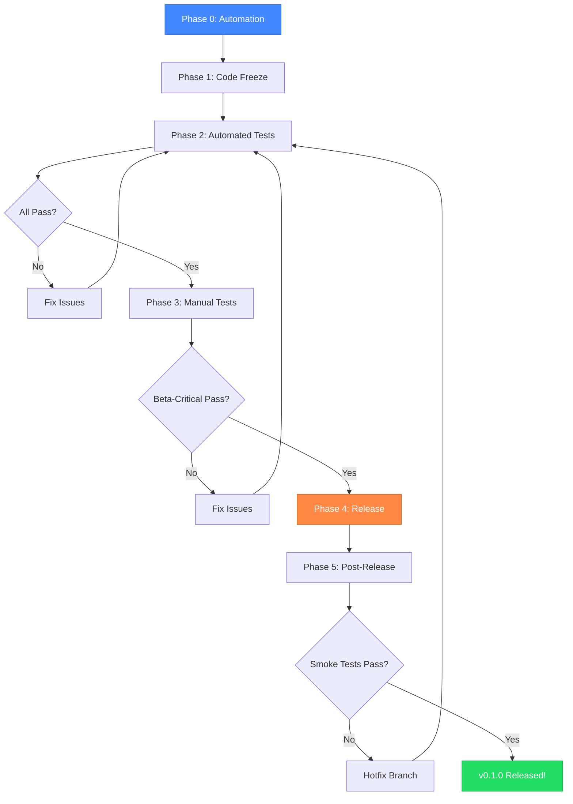
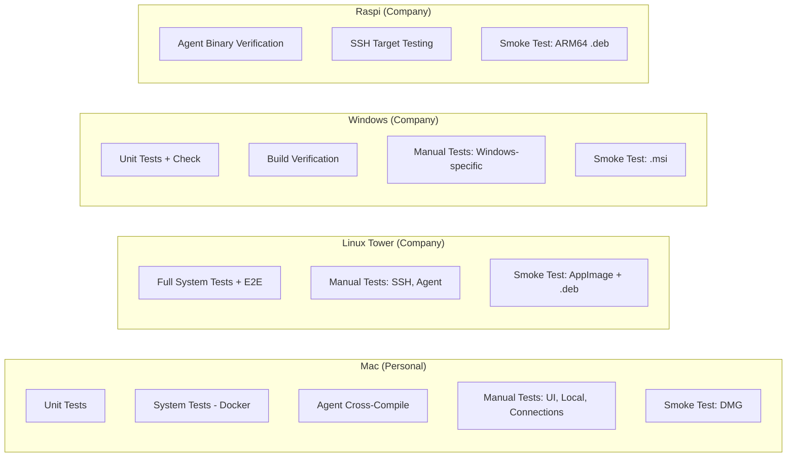

# termiHub v0.1.0-beta Release & Test Plan

> **Target**: First public beta release of termiHub
> **Date created**: 2026-03-08
> **Total estimated effort**: ~18–24 hours (spread across multiple sessions)

---

## Table of Contents

1. [Environment Overview](#1-environment-overview)
2. [Phase 0: Pre-Release Automation (4–6 h)](#2-phase-0-pre-release-automation)
3. [Phase 1: Code Freeze & Finalization (2–3 h)](#3-phase-1-code-freeze--finalization)
4. [Phase 2: Automated Test Execution (2–3 h)](#4-phase-2-automated-test-execution)
5. [Phase 3: Manual Testing (6–8 h)](#5-phase-3-manual-testing)
6. [Phase 4: Release (1–2 h)](#6-phase-4-release)
7. [Phase 5: Post-Release Verification (1–2 h)](#7-phase-5-post-release-verification)
8. [Interruption & Resume Guide](#8-interruption--resume-guide)
9. [Risk Register](#9-risk-register)
10. [Appendix: Manual-to-Automated Migration Candidates](#10-appendix-manual-to-automated-migration-candidates)

---

## 1. Environment Overview

| Machine              | OS                     | Docker | Podman | Role in Release                                                                                    |
| -------------------- | ---------------------- | ------ | ------ | -------------------------------------------------------------------------------------------------- |
| **Mac** (personal)   | macOS (Apple Silicon)  | Yes    | Yes    | Primary dev, macOS build verification, UI quality testing, agent cross-compilation (compile check) |
| **Windows notebook** | Windows (company)      | No     | Yes    | Windows build verification, Windows-specific manual tests, SSH to company machines                 |
| **Linux tower**      | Linux (company)        | Yes    | No     | Build machine, full E2E suite (tauri-driver), real SSH + agent testing to Raspi (basic X11 UI)     |
| **Raspi**            | Ubuntu ARM64 (company) | Yes    | No     | ARM64 agent target, SSH target for deployment testing                                              |

### Network Topology (Important)

- **Mac is isolated** — personal home network, **cannot reach** any company machine
- **Company machines** (Windows, Linux tower, Raspi) are on the **same network**
  and can reach each other via SSH
- **Linux tower is the primary machine** for real SSH + agent deployment testing
  (it can SSH to the Raspi and Windows notebook)
- Mac tests only against **local Docker containers** for SSH, never against
  real remote hosts
- Linux tower has X11 forwarding but with limited quality — sufficient for
  basic UI verification and SSH/agent testing, not for detailed UI layout checks

---

## 2. Phase 0: Pre-Release Automation

**Goal**: Automate what we can before spending hours on manual testing.
**Estimated time**: 4–6 hours across 2–3 sessions.

### 2.1 Create a Release Checklist Script (~1 h)

**What**: A script `scripts/release-check.sh` that validates release readiness.

**Automates**:

- Version consistency check (package.json, tauri.conf.json, src-tauri/Cargo.toml,
  agent/Cargo.toml, core/Cargo.toml — all must match)
- CHANGELOG.md has a dated section for the release version (not just `[Unreleased]`)
- No `[Unreleased]` items remain (they should be moved to the version section)
- `cargo test --workspace --all-features` passes
- `pnpm test` passes
- `./scripts/check.sh` passes (lint, format, clippy)
- Git working tree is clean
- Current branch is `main` or a release branch
- No TODO/FIXME/HACK markers in committed code (warning, not blocking)

**How to stop/resume**: This is a single script file to write — commit after
creating. The script itself runs in ~3 min and can be re-run any time.

### 2.2 Migrate Manual Tests to E2E Where Possible (~2–3 h)

Several manual test categories have cases that can be automated with the
existing WebdriverIO + Docker infrastructure. Migrating them reduces the
manual testing burden for this and every future release.

**Priority candidates** (see [Appendix](#10-appendix-manual-to-automated-migration-candidates)
for full analysis):

| Manual Test                                               | Why Automatable                                       | E2E File to Extend           | Est.   |
| --------------------------------------------------------- | ----------------------------------------------------- | ---------------------------- | ------ |
| MT-CONN-01 to MT-CONN-05 (Create/edit/delete connections) | Pure UI CRUD, no OS-level interaction                 | `connection-crud.test.js`    | 45 min |
| MT-TAB-01 to MT-TAB-04 (Tab open/close/rename/reorder)    | Tab operations are DOM-testable                       | `tab-management.test.js`     | 30 min |
| MT-FB-01, MT-FB-02 (Browse local files, navigate)         | File browser uses Tauri commands, testable via E2E    | `file-browser-local.test.js` | 30 min |
| MT-SSH-01, MT-SSH-02 (Connect with password/key)          | Already partially covered by infra tests; add UI flow | `ssh.test.js`                | 30 min |

**What stays manual**: Drag-and-drop (MT-TAB-05), right-click context menus
(MT-UI-09 to MT-UI-12), native OS dialogs (file open/save), visual rendering
verification, keyboard chord sequences, credential store OS integration.

**How to stop/resume**: Each test migration is independent. Commit after each
batch. The test files are additive — no risk of breaking existing tests.

### 2.3 Create a Cross-Platform Smoke Test Script (~1 h)

**What**: A script `scripts/smoke-test.sh` that runs a quick subset of
tests suitable for verifying a built binary on each platform. This is what
you run after installing the release artifact on each machine.

**Scope**:

- Launch the app, verify the window opens (tauri-driver where available,
  otherwise just verify process starts and listens)
- Create a local shell session, send `echo hello`, verify output
- Open Settings, verify it renders
- Open the connection editor, verify form fields render
- Close the app cleanly (no crash, no error in logs)

**Platform handling**:

- Linux/Windows: Uses tauri-driver (automated)
- macOS: Launches the .app bundle, uses AppleScript/osascript to verify
  window title, then kills the process (semi-automated)

**How to stop/resume**: Single script to write. Can be tested on Mac first,
then adapted for other platforms.

### 2.4 Set Up Podman-Based System Tests on Windows (~1 h)

**What**: The current `test-system-windows.sh` assumes Docker. Since your
Windows machine only has Podman, verify and fix:

- `test-system-windows.sh` uses `$CONTAINER_CMD` correctly with Podman
- Docker Compose files work with `podman-compose` or `podman compose`
- Serial port tests can be skipped (no socat on Windows without WSL)

**Check**: The scripts already have `CONTAINER_CMD` detection (#420).
Verify the Compose workflow works end-to-end with Podman on Windows.

**How to stop/resume**: This is configuration/scripting work. Commit fixes
as you go.

---

## 3. Phase 1: Code Freeze & Finalization

**Goal**: Prepare the codebase for release.
**Estimated time**: 2–3 hours in a single session.

### 3.1 Finalize CHANGELOG.md (~30 min)

1. Move all `[Unreleased]` entries into a new `[0.1.0] - 2026-MM-DD` section
2. Review every entry for clarity and user-facing language
3. Group entries logically (Added, Changed, Fixed, etc.)
4. Remove duplicate categories (current CHANGELOG has two `### Added`,
   two `### Fixed`, two `### Changed` blocks — merge them)
5. Add a brief release summary paragraph at the top of the version section
6. Leave an empty `[Unreleased]` section above for future changes

### 3.2 Version Bump Verification (~10 min)

All files should already say `0.1.0`. Verify:

```bash
grep -r '"0.1.0"' package.json src-tauri/tauri.conf.json
grep 'version = "0.1.0"' src-tauri/Cargo.toml agent/Cargo.toml core/Cargo.toml
```

### 3.3 Update Documentation (~1 h)

- [ ] `README.md` — add installation instructions for each platform
      (download from GitHub Releases, what to expect with unsigned binaries)
- [ ] `docs/architecture.md` — verify it reflects current state
- [ ] Add a `SECURITY.md` with vulnerability reporting instructions
      (standard for public repos)
- [ ] Add a `LICENSE` file if not present (verify current license)

### 3.4 Create Release Branch (~10 min)

```bash
git fetch origin && git checkout origin/main
git checkout -b release/0.1.0
```

All remaining release work happens on this branch. This keeps `main`
open for any urgent fixes discovered during testing.

### 3.5 Final Quality Gate (~30 min)

```bash
./scripts/check.sh    # Lint, format, clippy
./scripts/test.sh     # All unit tests
```

Fix any issues, commit, push the release branch.

**How to stop/resume**: The release branch preserves your state. You can
come back any time with `git checkout release/0.1.0`.

---

## 4. Phase 2: Automated Test Execution

**Goal**: Run the full automated test suite on every platform.
**Estimated time**: 2–3 hours (mostly wall-clock waiting; ~45 min active).

### Execution Order

Run these in parallel where possible. Each machine is independent.

### 4.1 Mac (Apple Silicon) — ~45 min wall clock

```bash
# 1. Unit tests (5 min)
./scripts/test.sh

# 2. System tests with Docker (30 min)
./scripts/test-system.sh --skip-serial

# 3. Agent cross-compilation verification (10 min)
./scripts/build-agents.sh
# Verify both agent binaries exist:
ls -la target/x86_64-unknown-linux-musl/release/termihub-agent
ls -la target/aarch64-unknown-linux-musl/release/termihub-agent
```

**How to stop**: Ctrl+C on any running script. Docker containers may
stay running — clean up with:

```bash
cd tests/docker && docker compose down
```

**How to resume**: Re-run the same command. Tests are idempotent.

### 4.2 Linux Tower — ~45 min wall clock

```bash
# 1. Full system test suite including E2E (40 min)
./scripts/test-system.sh --with-all

# This runs: unit tests, Rust integration tests, E2E via tauri-driver,
# network fault tests, SFTP stress tests
```

**Serial ports**: If socat is available, the script auto-creates virtual
serial ports. If not, serial tests are skipped (acceptable for beta).

**How to stop**: `Ctrl+C`, then `cd tests/docker && docker compose down`.

**How to resume**: `./scripts/test-system.sh --with-all --skip-unit`
(skip already-passed unit tests).

### 4.3 Windows Notebook — ~30 min wall clock

```bash
# 1. Unit tests (5 min)
./scripts/test.cmd

# 2. Quality checks (5 min)
./scripts/check.cmd

# 3. Build the app (15 min)
./scripts/build.cmd
```

**System tests with Podman** (if working after Phase 0 fixes):

```bash
# Uses podman compose
./scripts/test-system.cmd --skip-serial
```

If Podman system tests don't work: skip and rely on the Linux tower
for integration test coverage. Windows-specific behavior will be
covered by manual tests.

### 4.4 Raspi (ARM64 Ubuntu) — ~20 min wall clock

The Raspi is primarily a **target** for agent deployment, not a build host.
All steps run from the **Linux tower** (same company network).

```bash
# All steps run on: Linux tower → Raspi

# 1. Build the ARM64 agent on Linux tower (has Docker for cross-rs)
./scripts/build-agents.sh --targets aarch64-unknown-linux-musl

# 2. Copy the ARM64 agent binary to the Raspi
scp target/aarch64-unknown-linux-musl/release/termihub-agent raspi:~/

# 3. SSH into Raspi and verify the agent runs
ssh raspi
chmod +x ~/termihub-agent
~/termihub-agent --version
ldd ~/termihub-agent   # Expected: "not a dynamic executable"

# 4. Test agent connectivity from Linux tower
# (Open termiHub on Linux tower, create SSH connection to Raspi,
# verify agent deploys and sessions/SFTP/monitoring work)
```

**Note**: The Mac cannot reach the Raspi (isolated network). The Linux
tower is the only machine that can perform this test.

**How to stop/resume**: These are quick manual checks. No long-running
processes.

### 4.5 Record Results

Create a test results tracking file:

```bash
# After each platform, record results
echo "Mac: PASS/FAIL - $(date)" >> docs/release-0.1.0-results.md
echo "Linux: PASS/FAIL - $(date)" >> docs/release-0.1.0-results.md
echo "Windows: PASS/FAIL - $(date)" >> docs/release-0.1.0-results.md
echo "Raspi: PASS/FAIL - $(date)" >> docs/release-0.1.0-results.md
```

---

## 5. Phase 3: Manual Testing

**Goal**: Verify user-facing behavior that can't be automated.
**Estimated time**: 6–8 hours across 3–4 sessions.

### Strategy

Use the existing manual test runner with its **resume capability** to
spread testing across multiple sessions and machines.

### 5.1 Session Planning

Split the 75 manual tests across machines and sessions:

#### Session 1: Mac — Core UI & Local Shell (~2 h)

```bash
python scripts/test-manual.py \
  --category local-shell \
  --category tab-management \
  --category ui-layout \
  --category keyboard
# Tests: MT-LOCAL-*, MT-TAB-*, MT-UI-*, MT-KB-*
# Count: 3 + 7 + 19 + 8 = 37 tests
```

**How to stop**: Press `Ctrl+C` at any prompt. The runner saves progress
to a JSON report file in `tests/reports/`.

**How to resume**:

```bash
python scripts/test-manual.py --resume tests/reports/manual-<timestamp>.json
```

#### Session 2: Mac — Connections & File Browser (~1.5 h)

```bash
python scripts/test-manual.py \
  --category connection-management \
  --category file-browser \
  --category credential-store
# Tests: MT-CONN-*, MT-FB-*, MT-CRED-*
# Count: 10 + 10 + 3 = 23 tests
```

#### Session 3: Linux Tower or Mac — SSH & Remote (~1.5 h)

Requires Docker containers running for SSH targets.

```bash
# Start test infrastructure
cd tests/docker && docker compose up -d && cd ../..

python scripts/test-manual.py \
  --category ssh \
  --category remote-agent \
  --category serial
# Tests: MT-SSH-*, MT-AGENT-*, MT-SER-*
# Count: 10 + 2 + 2 = 14 tests
```

**After testing**:

```bash
cd tests/docker && docker compose down
```

#### Session 4: Windows — Cross-Platform Verification (~1 h)

Run a targeted subset on Windows to verify platform-specific behavior:

```bash
python scripts/test-manual.py \
  --category cross-platform \
  --category keyboard \
  --category local-shell
# Tests: MT-XPLAT-*, MT-KB-*, MT-LOCAL-*
# Count: 1 + 8 + 3 = 12 tests
```

Also manually verify these Windows-specific behaviors:

- [ ] PowerShell is the default shell
- [ ] Right-click defaults to "Quick Copy/Paste" mode
- [ ] Ctrl+Shift+C/V works for copy/paste (not Ctrl+C/V)
- [ ] .msi installer works, app launches, uninstall works
- [ ] WSL shell detection works (if WSL is installed)

### 5.2 Beta-Critical Manual Tests

These are the **must-pass** tests for a beta release. If any fail,
the release is blocked until fixed:

| ID          | Test                    | Why Critical        |
| ----------- | ----------------------- | ------------------- |
| MT-LOCAL-01 | Open a local shell      | Core functionality  |
| MT-LOCAL-02 | Execute commands        | Core functionality  |
| MT-SSH-01   | SSH connect (password)  | Key feature         |
| MT-SSH-02   | SSH connect (key)       | Key feature         |
| MT-TAB-01   | Open/close tabs         | Basic UX            |
| MT-CONN-01  | Create a connection     | Core workflow       |
| MT-CONN-02  | Edit a connection       | Core workflow       |
| MT-UI-01    | Sidebar toggle          | Basic UX            |
| MT-UI-02    | Activity bar navigation | Basic UX            |
| MT-KB-01    | Copy/paste in terminal  | Essential usability |
| MT-FB-01    | Browse local files      | Key feature         |
| MT-CRED-01  | Create master password  | Security feature    |

### 5.3 Known Limitations to Document

For a beta, some things are explicitly out of scope. Document these in
the release notes:

- [ ] macOS: App is unsigned — users must right-click → Open on first launch
- [ ] Windows: SmartScreen may warn — users must click "More info" → "Run anyway"
- [ ] No auto-update — users must manually download new versions
- [ ] Serial port support requires platform-specific drivers
- [ ] Telnet connections are unencrypted (by design, per protocol)

---

## 6. Phase 4: Release

**Goal**: Cut the release and publish artifacts.
**Estimated time**: 1–2 hours (mostly waiting for CI).

### 6.1 Pre-Release Checklist

Run the release checklist script (from Phase 0):

```bash
./scripts/release-check.sh
```

Or manually verify:

- [ ] All automated tests pass on Mac, Linux, Windows
- [ ] Beta-critical manual tests all pass
- [ ] CHANGELOG.md finalized with `[0.1.0] - 2026-MM-DD`
- [ ] README.md has installation instructions
- [ ] No blocker bugs open
- [ ] Release branch is up to date with `origin/main`

### 6.2 Merge Release Branch

```bash
# On the release branch
git fetch origin && git merge origin/main
./scripts/test.sh && ./scripts/check.sh

# Create PR
gh pr create --title "chore: release v0.1.0-beta" --body "$(cat <<'EOF'
## Summary
- First public beta release of termiHub
- Finalizes CHANGELOG, documentation, and version numbers

## Test plan
- All automated tests pass on macOS, Linux, Windows
- Manual test runner completed on all platforms
- Release checklist script passes
EOF
)"

# Merge (after review)
gh pr merge --merge
```

### 6.3 Tag and Push

```bash
git checkout main && git pull origin main
git tag -a v0.1.0-beta -m "Release v0.1.0-beta — First public beta"
git push origin v0.1.0-beta
```

This triggers the `release.yml` GitHub Actions workflow which:

1. Creates a GitHub Release with changelog notes
2. Builds for all 5 platforms (macOS Intel, macOS ARM, Windows, Linux x64,
   Linux ARM64)
3. Cross-compiles agent binaries (x86_64-musl, aarch64-musl)
4. Uploads all artifacts to the release

### 6.4 Monitor CI (~30 min)

```bash
# Watch the release workflow
gh run list --workflow=release.yml --limit 3
gh run watch  # Interactive watch
```

**If a build fails**: Check logs with `gh run view <run-id> --log-failed`.
Fix on a hotfix branch, merge to main, delete the tag, re-tag, re-push.

**How to stop/resume**: The CI runs automatically. You can close your
laptop and check back later with `gh run list`.

### 6.5 Release Tag Convention

**Decision needed**: Use `v0.1.0-beta` or `v0.1.0`?

- `v0.1.0-beta`: Clearly signals beta status. But the release workflow
  triggers on `v*.*.*`, so verify the regex matches pre-release suffixes.
  The current pattern `v[0-9]+.[0-9]+.[0-9]+*` should match.
- `v0.1.0`: Simpler. Mark as "Pre-release" in GitHub Release UI.

**Recommendation**: Use `v0.1.0` as the tag (matches the version in all
config files) and mark the GitHub Release as a **pre-release** using:

```bash
gh release edit v0.1.0 --prerelease
```

This avoids version string mismatches between the tag and the binary.

---

## 7. Phase 5: Post-Release Verification

**Goal**: Verify the published release artifacts work on real machines.
**Estimated time**: 1–2 hours.

### 7.1 Download & Install on Each Platform

| Platform    | Artifact    | Install Method                  | Machine          |
| ----------- | ----------- | ------------------------------- | ---------------- |
| macOS ARM   | `.dmg`      | Mount DMG, drag to Applications | Mac              |
| Windows x64 | `.msi`      | Double-click installer          | Windows notebook |
| Linux x64   | `.AppImage` | `chmod +x`, run directly        | Linux tower      |
| Linux x64   | `.deb`      | `sudo dpkg -i termihub_*.deb`   | Linux tower      |
| Linux ARM64 | `.deb`      | `sudo dpkg -i termihub_*.deb`   | Raspi            |

### 7.2 Smoke Tests on Each Platform

On each machine, verify:

1. **App launches** without crash
2. **Local shell opens** and accepts commands
3. **Settings open** and display correctly
4. **Connection editor** renders all connection types
5. **SSH connection** works (to a test server or between your machines)
6. **App closes** cleanly (no error dialogs, no orphan processes)

If the smoke test script from Phase 0 is ready, use it:

```bash
./scripts/smoke-test.sh /path/to/installed/app
```

### 7.3 Agent Deployment Verification

1. From the Mac (or Linux tower), create an SSH connection to the Raspi
2. Verify the agent binary deploys automatically
3. Open a shell session through the agent
4. Test file browsing through SFTP
5. Verify monitoring stats appear (CPU, memory, disk)

### 7.4 Release Notes Review

After all artifacts are uploaded, review the GitHub Release page:

- [ ] All 7+ artifacts are present (2 macOS DMGs, 1 MSI, 1 AppImage, 1 deb,
      1 ARM64 deb, 2 agent binaries)
- [ ] Release notes match the CHANGELOG
- [ ] Pre-release flag is set (if using beta designation)
- [ ] Checksums or signatures are provided (optional for beta)

---

## 8. Interruption & Resume Guide

This is a hobby project. Here's how to safely stop and resume at any point.

### General Rules

1. **Always commit before stopping**. Even partial work. Use a WIP commit:

   ```bash
   git add -A && git commit -m "WIP: <what you were doing>"
   ```

2. **Never leave Docker containers running overnight**:

   ```bash
   cd tests/docker && docker compose down
   ```

3. **Note where you stopped** in the release results file:

   ```bash
   echo "STOPPED: Phase 3, Session 2, test MT-CONN-06 — $(date)" \
     >> docs/release-0.1.0-results.md
   ```

### Phase-Specific Resume Instructions

| Phase                         | How to Resume                                                               |
| ----------------------------- | --------------------------------------------------------------------------- |
| **Phase 0** (Automation)      | `git checkout release/0.1.0`, continue writing scripts                      |
| **Phase 1** (Finalization)    | `git checkout release/0.1.0`, pick up where you left off                    |
| **Phase 2** (Automated tests) | Re-run the test command for the current platform; tests are idempotent      |
| **Phase 3** (Manual tests)    | `python scripts/test-manual.py --resume tests/reports/manual-<latest>.json` |
| **Phase 4** (Release)         | If tag not pushed: resume from 6.3. If CI running: check with `gh run list` |
| **Phase 5** (Post-release)    | Download artifacts and continue smoke testing                               |

### Time Boxing

Each session should be 1–3 hours. Suggested session plan:

| Session | Duration | Content                                                |
| ------- | -------- | ------------------------------------------------------ |
| 1       | 2–3 h    | Phase 0: Write release-check.sh + smoke-test.sh        |
| 2       | 2–3 h    | Phase 0: Migrate manual tests to E2E                   |
| 3       | 2 h      | Phase 1: CHANGELOG, docs, release branch               |
| 4       | 1 h      | Phase 2: Automated tests on Mac                        |
| 5       | 1 h      | Phase 2: Automated tests on Linux + Windows (parallel) |
| 6       | 2 h      | Phase 3: Manual tests on Mac (Session 1)               |
| 7       | 1.5 h    | Phase 3: Manual tests on Mac (Session 2)               |
| 8       | 1.5 h    | Phase 3: Manual tests on Linux (SSH/agent)             |
| 9       | 1 h      | Phase 3: Manual tests on Windows                       |
| 10      | 1 h      | Phase 4: Release                                       |
| 11      | 1 h      | Phase 5: Post-release verification                     |

**Total: ~16–19 hours across 11 sessions**

---

## 9. Risk Register

| Risk                                            | Impact                            | Likelihood           | Mitigation                                                             |
| ----------------------------------------------- | --------------------------------- | -------------------- | ---------------------------------------------------------------------- |
| CI build fails on one platform                  | Delays release by 1–4 h           | Medium               | Test locally first (Phase 2); have fallback to build locally           |
| macOS unsigned binary rejected by Gatekeeper    | Users can't open app              | High (expected)      | Document workaround in README + release notes                          |
| Windows SmartScreen blocks .msi                 | Users can't install               | High (expected)      | Document workaround in release notes                                   |
| Podman on Windows doesn't work with test infra  | Can't run system tests on Windows | Medium               | Fall back to manual testing on Windows; Linux covers integration tests |
| SSH agent deployment fails on Raspi             | ARM64 agent not validated         | Low                  | Test binary manually; cross-compilation is already proven in CI        |
| Release workflow regex doesn't match beta tag   | CI doesn't trigger                | Low                  | Verify regex before tagging; use `v0.1.0` without suffix as fallback   |
| Company network blocks GitHub release downloads | Can't verify on company machines  | Low                  | Use VPN or download on Mac and transfer via USB/network share          |
| Long test runs get interrupted                  | Lost progress                     | High (hobby project) | Resume capability in manual runner; idempotent automated tests         |

---

## 10. Appendix: Manual-to-Automated Migration Candidates

### Full Analysis of 75 Manual Tests

#### Can Be Automated (migrate before release) — 18 tests

| ID         | Test                      | Automation Approach                              |
| ---------- | ------------------------- | ------------------------------------------------ |
| MT-CONN-01 | Create local connection   | E2E: Fill form, save, verify in sidebar          |
| MT-CONN-02 | Edit connection           | E2E: Open editor, modify, save                   |
| MT-CONN-03 | Delete connection         | E2E: Right-click delete, confirm dialog          |
| MT-CONN-04 | Create SSH connection     | E2E: Fill SSH form, save                         |
| MT-CONN-05 | Create folder             | E2E: Create folder in sidebar                    |
| MT-CONN-06 | Move connection to folder | E2E: Drag simulation or context menu move        |
| MT-CONN-07 | Import connections        | E2E: Trigger import, verify result               |
| MT-CONN-08 | Export connections        | E2E: Trigger export, verify file created         |
| MT-TAB-01  | Open tab from connection  | E2E: Double-click connection, verify tab appears |
| MT-TAB-02  | Close tab                 | E2E: Click close button, verify tab removed      |
| MT-TAB-03  | Rename tab                | E2E: Double-click tab title, type new name       |
| MT-TAB-04  | Switch between tabs       | E2E: Click tabs, verify active state             |
| MT-FB-01   | Browse local files        | E2E: Open file browser, verify directory listing |
| MT-FB-02   | Navigate directories      | E2E: Click folders, verify breadcrumb updates    |
| MT-SSH-01  | SSH connect (password)    | E2E: Connect to Docker SSH, verify prompt        |
| MT-SSH-02  | SSH connect (key)         | E2E: Connect to Docker SSH with key, verify      |
| MT-SSH-03  | SSH disconnect            | E2E: Disconnect, verify tab state change         |
| MT-SSH-04  | SSH reconnect             | E2E: Disconnect then reconnect                   |

#### Should Stay Manual — 57 tests

**Reason: Visual/rendering verification (19 tests)**:
MT-UI-01 through MT-UI-19 — sidebar layout, theming, resize handles,
scrollbar behavior, font rendering, color schemes.

**Reason: OS-level interaction (8 tests)**:
MT-KB-01 through MT-KB-08 — keyboard shortcuts involve OS-level key
events that tauri-driver may not reliably simulate (especially chords,
modifier keys, and platform-specific mappings).

**Reason: Native dialogs / OS integration (3 tests)**:
MT-CRED-01 through MT-CRED-03 — credential store uses OS keychain.

**Reason: Hardware interaction (2 tests)**:
MT-SER-01, MT-SER-02 — serial ports require physical or virtual hardware.

**Reason: Drag-and-drop (3 tests)**:
MT-TAB-05 (tab reorder), MT-TAB-06 (tab to split), MT-TAB-07 (tab between
groups) — WebDriver drag-and-drop is unreliable.

**Reason: Agent deployment / remote execution (2 tests)**:
MT-AGENT-01, MT-AGENT-02 — requires real SSH target with agent deployment.

**Reason: Complex multi-step workflows (6 tests)**:
MT-CONN-09, MT-CONN-10, MT-FB-03 through MT-FB-10 (file operations
involving upload, download, rename, permissions).

**Reason: Cross-platform specific (1 test)**:
MT-XPLAT-01 — inherently requires running on multiple platforms.

**Reason: Already well-covered by existing E2E (13 tests)**:
Some file browser and SSH tests already have E2E coverage. The manual
versions serve as visual verification of the same functionality. Keep
them manual but mark as "low priority" during testing.

---

## Workflow Diagram



## Platform Test Matrix


