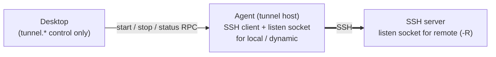
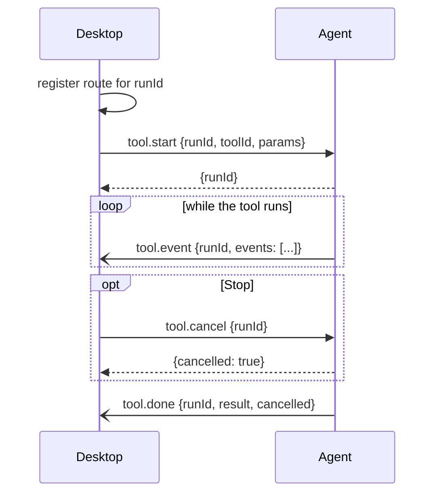
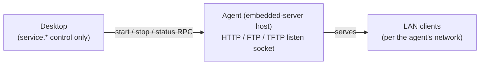
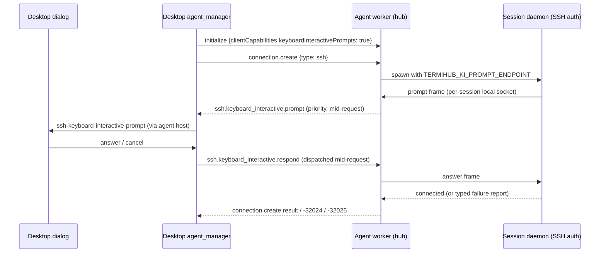

# Remote Session Management Protocol

Protocol specification for communication between the termiHub desktop app and remote agents.

**Version**: 0.24.0
**Status**: Draft
**Issue**: #17, #360, #1349, #2185, #2192, #2607, #3731, #3213, #3424, #3425, #3751, #3089, #3210, #3871, #3242, #3051

---

## Table of Contents

1. [Overview](#overview)
2. [Architecture](#architecture)
3. [Transport Layer](#transport-layer)
4. [Platform Notes (Windows)](#platform-notes-windows)
5. [Message Format](#message-format)
6. [Protocol Versioning](#protocol-versioning)
7. [Methods](#methods)
8. [Notifications](#notifications)
9. [Session State Schema](#session-state-schema)
10. [Error Codes](#error-codes)
11. [Examples](#examples)
12. [Security Considerations](#security-considerations)

---

## Overview

The remote session management protocol enables the termiHub desktop app to manage persistent terminal sessions on a remote agent. Sessions survive desktop disconnects, allowing users to reconnect to long-running processes (build jobs, monitoring tasks) without losing state.

### Goals

- **Persistent sessions**: Shell and serial sessions run on the agent and survive desktop disconnects
- **Transparent proxying**: The `RemoteBackend` implements `TerminalBackend`, so remote sessions behave identically to local ones from the UI's perspective
- **Simple framing**: Newline-delimited JSON over an SSH channel — no custom TCP listeners or TLS setup
- **Reconnect support**: Attach to existing sessions after a disconnect, receiving buffered or live output

### Non-Goals

- File transfer (handled by `connection.files.*` RPC methods and existing SFTP infrastructure)
- Agent discovery (the user configures the SSH host manually)
- Multi-user access to the same agent (single-user assumed)

---

## Architecture

```text
┌─────────────────────────────────────────────────┐
│                  Desktop App                     │
│                                                  │
│  ┌──────────────┐     ┌──────────────────────┐  │
│  │ Terminal UI   │────▶│ RemoteBackend        │  │
│  │ (xterm.js)   │◀────│ (TerminalBackend)    │  │
│  └──────────────┘     └──────────┬───────────┘  │
│                                  │               │
│                          JSON-RPC messages        │
│                                  │               │
│                       ┌──────────▼───────────┐   │
│                       │ SSH Channel          │   │
│                       │ (ssh2 crate)         │   │
│                       └──────────┬───────────┘   │
└──────────────────────────────────┼───────────────┘
                                   │ SSH tunnel
                                   │
┌──────────────────────────────────┼───────────────┐
│               Remote Agent       │               │
│                       ┌──────────▼───────────┐   │
│                       │ Protocol Handler     │   │
│                       │ (JSON-RPC dispatch)  │   │
│                       └──────────┬───────────┘   │
│                                  │               │
│                  ┌───────────────┼────────────┐  │
│                  │               │            │  │
│          ┌───────▼──┐   ┌───────▼──┐  ┌──────▼─┐│
│          │ PTY      │   │ PTY      │  │ Serial ││
│          │ Session 1│   │ Session 2│  │ Proxy  ││
│          └──────────┘   └──────────┘  └────────┘│
│                                                  │
│                  ┌──────────────────┐            │
│                  │ SQLite DB        │            │
│                  │ (session state)  │            │
│                  └──────────────────┘            │
└──────────────────────────────────────────────────┘
```

### Component Roles

| Component            | Role                                                                                             |
| -------------------- | ------------------------------------------------------------------------------------------------ |
| **RemoteBackend**    | Desktop-side `TerminalBackend` implementation that translates trait calls into JSON-RPC requests |
| **SSH Channel**      | Transport layer — the desktop opens an SSH exec channel to the agent binary                      |
| **Protocol Handler** | Agent-side dispatcher that parses JSON-RPC messages and routes to session manager                |
| **Session Manager**  | Creates/destroys PTY and serial sessions, manages attach/detach                                  |
| **SQLite DB**        | Persists session metadata so sessions survive agent restarts                                     |

### Connection Topology & Client Tracking

The desktop opens **one SSH exec channel per connection** and runs `termihub-agent --stdio`, so there is **one agent process per desktop→agent channel**, and that process serves **exactly one client**. Two desktops connecting to the same host do **not** share a running agent process — they run independent `--stdio` workers and share only the deployed binary on disk and the layer of detached **session daemons** (`termihub-agent --daemon <id>`) that outlive each worker. (The alternative `--listen` TCP mode shares a `SessionManager` and its hosted services across connections but still serves one client at a time; the desktop does not use it.)

Because a process knows exactly one client, each agent process keeps a **per-process `ConnectionRegistry`** (`agent/src/client_registry.rs`) that records the connected client from the `initialize` request — its `client`, `client_version`, an agent-assigned `client_id`, and `connected_since`. The entry is added on `initialize` and removed when the transport connection drops. This is the in-process foundation for the coordinated remote-agent update strategy (epic #1345); cross-client coordination is built on the shared daemon layer rather than a single all-knowing process (see [ADR-11](architecture.md#adr-11-per-process-agent-connection-tracking-multi-host-model)).

This topology and the tracking model are identical across the **3-platform agent matrix (Linux · macOS · Windows)**; only the daemon's internal transport differs (unix domain socket vs Windows named pipe, see [Platform Notes](#platform-notes-windows)).

---

## Transport Layer

### Connection Setup

1. The desktop opens an SSH connection to the remote host using the configured credentials (reusing the existing `ssh2` crate infrastructure)
2. The desktop opens an exec channel running the agent binary: `termihub-agent --stdio`
3. The agent reads JSON-RPC messages from **stdin** and writes responses/notifications to **stdout**
4. The agent writes diagnostic logs to **stderr**, never stdout. In `--stdio` mode these are framed
   log records the desktop re-emits (see [Stderr Log Side-Band](#stderr-log-side-band)); they are
   not part of the JSON-RPC protocol

### Framing

Messages are **newline-delimited JSON** (NDJSON). Each message is a single line of valid JSON terminated by `\n` (0x0A).

```text
{"jsonrpc":"2.0","method":"initialize","params":{...},"id":1}\n
{"jsonrpc":"2.0","result":{...},"id":1}\n
{"jsonrpc":"2.0","method":"connection.output","params":{...}}\n
```

**Rules:**

- Messages MUST NOT contain unescaped newlines within the JSON
- Messages MUST be valid UTF-8
- Binary data (terminal output) MUST be base64-encoded
- The maximum message size is 1 MiB (1,048,576 bytes)

### Stderr Log Side-Band

In `--stdio` mode the agent writes each of its `tracing` log records to **stderr** as one framed
line (#2854, OBS-004). The desktop reads the channel's stderr, parses the framed lines and re-emits
each record into its own log pipeline (LogViewer and `termihub.log`) at the record's real level.
The JSON-RPC channel on stdout is never used for logs.

```text
@termihub-log/1 {"ts":"2026-09-30T10:00:00.123456Z","level":"INFO","target":"termihub_agent::handler::dispatch","msg":"agent session created","cid":"3f9c…","fields":{"session_id":"a1b2…","type_id":"ssh"}}\n
```

A framed line is the prefix `@termihub-log/`, the framing version (`1`), one space, and one JSON
object. The wire type is `termihub_core::protocol::log_frame::LogFrame`.

| Member   | Type                     | Description                                                                                                                     |
| -------- | ------------------------ | ------------------------------------------------------------------------------------------------------------------------------- |
| `ts`     | `string`                 | RFC 3339 UTC time the agent recorded the event                                                                                  |
| `level`  | `string`                 | `ERROR`, `WARN`, `INFO`, `DEBUG` or `TRACE`                                                                                     |
| `target` | `string`                 | The event's `tracing` target on the agent                                                                                       |
| `msg`    | `string`                 | The formatted message. JSON escapes newlines, so a record never spans lines                                                     |
| `cid`    | `string?`                | The desktop correlation id (the `connection.create` `correlation_id`) of the enclosing `agent_session` span, if any             |
| `fields` | `object<string,string>?` | The event's fields merged over its enclosing spans' fields. Fields with a secret name (`password`, `token`, …) are `[REDACTED]` |

**Rules:**

- A stderr line without the prefix is **unframed**: a panic message, a C library print, or any
  other raw output. The desktop logs it at `WARN` as `agent process stderr: <line>`, as it did
  before the framing existed.
- A framed line with an unknown version or a malformed body is treated as unframed, so it is
  logged, never dropped. Unknown JSON members are ignored.
- The desktop re-emits records under the `tracing` target `termihub_agent::remote` with the fields
  `agent_id`, `agent_target`, `agent_ts`, `correlation_id` and `agent_fields`. The LogViewer shows
  `agent_target` as the entry's target. Every string is control-character-escaped and
  length-capped, and secret-named fields are redacted again, so a record cannot forge a desktop
  log line.
- The framed sink honors `RUST_LOG` (default `info`) with `russh=warn` prepended, the same clamp as
  the agent's durable log file, because the desktop writes the records to a durable log.
- The `--listen`, `--daemon` and `--registry-daemon` roles keep plain, human-readable stderr.

The framing is not negotiated: desktop and agent ship version-matched. An older desktop logs a
newer agent's framed lines as unframed `WARN` text; a newer desktop logs an older agent's plain
lines the same way.

### Connection Lifecycle

1. **Connect**: Desktop opens SSH exec channel
2. **Initialize**: Desktop sends `initialize` request; agent responds with capabilities
3. **Operate**: Desktop sends requests; agent sends responses and notifications
4. **Disconnect**: Desktop closes the SSH channel (sessions keep running on agent)
5. **Reconnect**: Desktop opens a new channel, sends `initialize`, then `connection.list` + `connection.attach` to reattach to existing sessions

---

## Platform Notes (Windows)

The protocol itself is platform-independent — the same JSON-RPC messages, NDJSON framing, and `connection.*` methods are used regardless of the agent's host OS. The differences below are confined to how the agent is **deployed**, how its **session daemon** communicates internally, and what the **default shell** is. None of them change the wire format.

### Agent Deployment on Windows

The desktop auto-deploys the agent to a Windows host over the same SSH/SFTP path it uses for Linux and macOS, with three Windows-specific steps:

1. **Host detection** — the desktop probes `uname -s` first (which also covers MinGW/MSYS/Cygwin shells). When `uname` is absent it falls back to `%PROCESSOR_ARCHITECTURE%` (cmd.exe) / `$env:PROCESSOR_ARCHITECTURE` (PowerShell), so a host whose default OpenSSH shell is cmd.exe or PowerShell is recognized as Windows rather than misdetected as Linux. x64 → `windows-x64`, ARM64 → `windows-arm64`.
2. **Default-shell detection** — before issuing install commands the desktop detects whether the remote OpenSSH `DefaultShell` is `cmd.exe` or PowerShell (it probes how `%PROCESSOR_ARCHITECTURE%` expands). This selects the command syntax for the install step.
3. **Shell-appropriate install** — no POSIX-only commands (`mkdir -p`, `mv -f`, `chmod`, `/tmp`) are sent to a Windows remote. The binary is uploaded to the SFTP home, then moved into `%LOCALAPPDATA%\termiHub\agent\termihub-agent.exe`:
   - **cmd.exe**: `(if not exist "<dir>" md "<dir>") & move /Y "<upload>" "<install>"`
   - **PowerShell**: `New-Item -ItemType Directory -Force -Path "<dir>" | Out-Null; Move-Item -Force -Path "<upload>" -Destination "<install>"`
   - Verified with `<install> --version` (cmd) or `& "<install>" --version` (PowerShell).

For the current phase the agent launches on demand via `--stdio` over an SSH exec channel; no Windows service is installed. See [Deployment View](architecture.md#7-deployment-view) for the binary-target table and the full deploy flow.

### Session-Daemon Transport (Named Pipe vs Unix Socket)

Persistent (reconnectable) sessions run in a detached session-daemon process. The desktop never talks to this daemon directly — only the agent does, locally on the host — so the choice of IPC mechanism is invisible to the protocol. The transport is abstracted in `agent/src/daemon/transport.rs`:

| Aspect         | Unix (Linux/macOS)                       | Windows                                                            |
| -------------- | ---------------------------------------- | ------------------------------------------------------------------ |
| Endpoint       | Unix domain socket                       | Named pipe                                                         |
| Path / name    | `/tmp/termihub/<user>/session-<id>.sock` | `\\.\pipe\termihub-session-<id>`                                   |
| Access control | `0o700` on the socket dir + socket       | Per-user DACL (`GENERIC_ALL` to the user SID + `LocalSystem`)      |
| Daemon spawn   | Orphaned child (agent never waits on it) | `DETACHED_PROCESS \| CREATE_NEW_PROCESS_GROUP \| CREATE_NO_WINDOW` |

Both restrict the endpoint to the current user, and neither exposes a TCP port. The frame protocol is append-only: since 0.20.0 (#3210) a daemon whose backend can manage processes sends a capabilities frame before its ready frame, and then answers process list / kill request frames from the worker that holds the session — replies go only to that connection. A worker ignores unknown frames and a daemon started by an older agent sends no capabilities frame, so mixed versions keep working (process management of such a session reports "not supported"). Since 0.21.0 (#3871) the capabilities frame also says whether the daemon's backend has a monitoring provider; the worker that holds the session then sends monitoring request frames (subscribe, unsubscribe, set interval, pause), and the daemon answers each one and streams the provider's samples and status transitions back in monitoring event frames — to that connection only. The daemon stops the provider as soon as that connection no longer holds the session (detach, drop, takeover) or the session ends. Since 0.22.0 (#3242) the capabilities frame also says whether the daemon's backend has a file browser; the worker that holds the session then sends file request frames (list, stat, read, write, delete, rename, mkdir, chmod, chown, symlink, copy) and the daemon answers each one — to that connection only — through the backend's own browser, one request after another and each under a timeout. File contents never ride in the JSON: a write's bytes follow its request, and a read's bytes precede its reply, in separate data frames of at most 64 KiB each, so terminal output and input interleave between the chunks of a large transfer instead of waiting behind it. The worker and its daemon also watch each other for a **fully silent wedge** (#3140): each side advertises heartbeat support (the daemon in its capabilities frame, the worker in a capabilities frame of its own right after its attach intent), and when both did, a side that has received nothing for 15 s sends a ping, which the other answers with an empty pong and nothing else. Any received byte counts as liveness — output, a pong, or part of a large frame still arriving — so an idle but healthy session is never torn down; a peer that stays silent through four pings (75 s in all) is dropped, and the worker then reports the session as lost exactly as for any other broken daemon connection. A daemon or worker from before the heartbeat advertises nothing and is never pinged or dropped. The heartbeat is internal to the agent host and does not change the desktop protocol version. The daemon also never lets a worker that has stopped **reading** stall it (#3890): its frames to the worker are queued and written by a separate task, a worker that accepts no byte for 30 s is dropped (the session keeps running and its output is replayed on the next attach), and while more than 1 MiB is queued the daemon pauses forwarding output rather than dropping any, so a slow worker that keeps reading is never dropped. The daemon's binary frame protocol (`[type: 1B][length: 4B BE][payload]`) and the 1 MiB output ring buffer are identical on both platforms, so reconnect-with-scrollback-replay behaves the same. The `daemon_socket` field persisted in the agent's `state.json` therefore holds a named-pipe name on Windows and a socket path on unix.

### Default Shell and Local Shell Spawning

- **Default shell**: when a local-shell session omits the `shell` field, a Windows agent defaults to `powershell` (unix agents read `$SHELL`). Shell name resolution maps `cmd` → `cmd.exe`, `powershell` → the resolved PowerShell executable, and `gitbash` → the Git Bash `bash.exe`; a value containing `/` or `\` is treated as a literal path.
- **PTY**: local shells spawn through `portable-pty`, which uses **ConPTY** on Windows 10 1809+ (falling back to WinPTY if unavailable). The reader sees the same VT byte stream as a Unix PTY, and `resize`/teardown map to `ResizePseudoConsole`/`ClosePseudoConsole`. No protocol-level difference results.
- **CWD reporting**: PowerShell and cmd.exe emit OSC 9;9 (Windows Terminal's working-directory sequence) rather than OSC 7, injected via shell startup args.

---

## Message Format

The protocol uses [JSON-RPC 2.0](https://www.jsonrpc.org/specification).

### Request (Desktop → Agent)

```json
{
  "jsonrpc": "2.0",
  "method": "connection.create",
  "params": { ... },
  "id": 1
}
```

| Field     | Type      | Description                                                  |
| --------- | --------- | ------------------------------------------------------------ |
| `jsonrpc` | `"2.0"`   | Protocol version (always `"2.0"`)                            |
| `method`  | `string`  | Method name                                                  |
| `params`  | `object`  | Method parameters                                            |
| `id`      | `integer` | Request identifier (monotonically increasing per connection) |

### Response (Agent → Desktop)

**Success:**

```json
{
  "jsonrpc": "2.0",
  "result": { ... },
  "id": 1
}
```

**Error:**

```json
{
  "jsonrpc": "2.0",
  "error": {
    "code": -32001,
    "message": "Session not found",
    "data": { "session_id": "abc-123" }
  },
  "id": 1
}
```

| Field           | Type      | Description                                       |
| --------------- | --------- | ------------------------------------------------- |
| `result`        | `any`     | Success payload (mutually exclusive with `error`) |
| `error.code`    | `integer` | Error code (see [Error Codes](#error-codes))      |
| `error.message` | `string`  | Human-readable error description                  |
| `error.data`    | `object?` | Optional structured error context                 |

### Notification (Agent → Desktop)

Notifications have **no `id` field** and do not expect a response.

```json
{
  "jsonrpc": "2.0",
  "method": "connection.output",
  "params": { ... }
}
```

---

## Protocol Versioning

### Version Negotiation

The desktop sends a protocol version in the `initialize` request. The agent responds with the version it will use.

**Rules:**

- Protocol versions follow [Semantic Versioning](https://semver.org/) (`MAJOR.MINOR.PATCH`)
- **Major** version changes indicate breaking changes — the agent MUST reject incompatible major versions
- **Minor** version changes add new methods or optional fields — backwards compatible
- **Pre-1.0 exception:** while the major version is `0`, a minor version may also **remove** methods (0.2.0 removed `session.*`; 0.12.0 removed `network.*`). The removal is documented below, and the desktop gates the affected feature on a capability so an older peer gets a clear message instead of a missing-method failure
- **Patch** version changes are bug fixes — no protocol impact
- The agent selects the highest compatible version it supports (matching major, up to its minor)

> **Enforcement is agent-side only (current implementation).** The rules above describe what the
> **agent** enforces: it compares the desktop's advertised major against its own
> `AGENT_PROTOCOL_VERSION` and returns [`-32002` Version not supported](#application-errors) on a
> major mismatch (`agent/src/handler/dispatch.rs`). The **desktop** does not participate in this
> negotiation the way the matrix implies:
>
> - It sends a **fixed, hardcoded** `protocolVersion` in `initialize` (currently `"0.24.0"`, the
>   first version with the camelCase `initialize` result — it is not bumped for additive
>   features) rather than its actual supported version, so it always advertises major `0` and can
>   never itself trigger the `-32002` reject path.
> - It **does not validate** the version the agent returns — it stores that value for display only
>   and proceeds regardless.
>
> In practice, therefore, forward/backward compatibility on the desktop side is **not** driven by
> the version handshake but by **method-not-found fallback**: when the desktop calls a method a
> connected agent does not implement, the agent returns
> [`-32601` Method not found](#standard-json-rpc-errors) and the desktop falls back to the
> pre-feature behaviour (see the per-version notes below, which describe exactly these `-32601`
> fallbacks). Anyone implementing a third-party client should not rely on the desktop rejecting an
> incompatible agent by version. Network tools are gated up front instead: the desktop requires the
> `toolStreaming` capability (see [Agent-run network tools](#agent-run-network-tools-tool)).

### Compatibility Matrix

| Desktop Version | Agent Version | Compatible?                                                                                                                          |
| --------------- | ------------- | ------------------------------------------------------------------------------------------------------------------------------------ |
| 0.24.0          | 0.24.0        | Yes                                                                                                                                  |
| 0.24.0          | 0.9.0–0.23.0  | Yes (the older agent answers `initialize` in snake_case, which the desktop still reads)                                              |
| 0.23.0          | 0.24.0        | Yes (the agent answers a pre-0.24.0 `protocolVersion` in the legacy snake_case)                                                      |
| 0.23.0          | 0.23.0        | Yes                                                                                                                                  |
| 0.23.0          | 0.9.0–0.22.0  | Yes (no `unattendedConnect` — a scheduled run skips an agent-hosted target: "agent too old for unattended connect")                  |
| 0.22.0          | 0.23.0        | Yes (`unattendedConnect` ignored; `unattended` never sent)                                                                           |
| 0.22.0          | 0.22.0        | Yes                                                                                                                                  |
| 0.22.0          | 0.9.0–0.21.0  | Yes (no `sessionFiles` — the file browser of an agent-hosted SSH/Docker/FTP/WSL session says to update the agent)                    |
| 0.21.0          | 0.22.0        | Yes (`sessionFiles` ignored)                                                                                                         |
| 0.21.0          | 0.21.0        | Yes                                                                                                                                  |
| 0.21.0          | 0.9.0–0.20.0  | Yes (no `sessionMonitoring` — the status bar of an agent-hosted SSH/Docker/WSL session says to update the agent)                     |
| 0.20.0          | 0.21.0        | Yes (`sessionMonitoring` ignored)                                                                                                    |
| 0.20.0          | 0.20.0        | Yes                                                                                                                                  |
| 0.20.0          | 0.9.0–0.19.0  | Yes (no `sessionProcesses` — the process table of an agent-hosted SSH/Docker/WSL session says to update the agent)                   |
| 0.19.0          | 0.20.0        | Yes (`sessionProcesses` ignored)                                                                                                     |
| 0.19.0          | 0.19.0        | Yes                                                                                                                                  |
| 0.19.0          | 0.9.0–0.18.0  | Yes (no `auth_failed` connect failure — an agent-hosted credential rejection stays a generic remote error)                           |
| 0.18.0          | 0.19.0        | Yes (`connect_failure: "auth_failed"` is unknown and ignored — generic remote error)                                                 |
| 0.18.0          | 0.18.0        | Yes                                                                                                                                  |
| 0.18.0          | 0.9.0–0.17.0  | Yes (no `connect_failure` in `connection.create` errors — an agent-hosted connect failure shows no per-backend hint)                 |
| 0.17.0          | 0.18.0        | Yes (`error.data.connect_failure` ignored)                                                                                           |
| 0.17.0          | 0.17.0        | Yes                                                                                                                                  |
| 0.17.0          | 0.9.0–0.16.0  | Yes (no `agent.forward.connect` — a VNC/RDP connection under the agent fails with "update the agent")                                |
| 0.16.0          | 0.17.0        | Yes (new method ignored)                                                                                                             |
| 0.16.0          | 0.16.0        | Yes                                                                                                                                  |
| 0.16.0          | 0.9.0–0.15.0  | Yes (`correlation_id` ignored — the agent's logs for a session are not keyed by the desktop's session id)                            |
| 0.15.0          | 0.16.0        | Yes (no `correlation_id` — the agent logs the session without a desktop id)                                                          |
| 0.15.0          | 0.15.0        | Yes                                                                                                                                  |
| 0.15.0          | 0.14.0        | Yes (no `composeProject` / `composeService` — the container picker lists an agent's containers ungrouped)                            |
| 0.14.0          | 0.15.0        | Yes (unknown `docker.list_containers` entry fields ignored)                                                                          |
| 0.14.0          | 0.14.0        | Yes                                                                                                                                  |
| 0.14.0          | 0.9.0–0.13.0  | Yes (no `docker.list_containers` — the Docker container picker of an agent-hosted connection keeps a typed name/ID)                  |
| 0.13.0          | 0.14.0        | Yes (new method ignored)                                                                                                             |
| 0.13.0          | 0.13.0        | Yes                                                                                                                                  |
| 0.13.0          | 0.9.0–0.12.0  | Yes (no `update_auth_token_path` — the desktop sends no `authToken`, which a pre-0.13.0 agent does not require)                      |
| 0.12.0          | 0.13.0        | Partly (everything except agent updates: the update RPCs are refused with `-32026` because no `authToken` is sent)                   |
| 0.12.0          | 0.12.0        | Yes                                                                                                                                  |
| 0.12.0          | 0.9.0–0.11.0  | Yes (network tools run through `tool.*`, which these agents already offer)                                                           |
| 0.12.0          | < 0.9.0       | Partly (no `toolStreaming` — network tools refuse with "update the agent to use network tools"; everything else works)               |
| 0.11.0          | 0.12.0        | Partly (agent-run DNS / Wake-on-LAN / open ports fail with `-32601` — they still call the removed `network.*`; streaming tools work) |
| 0.11.0          | 0.11.0        | Yes                                                                                                                                  |
| 0.11.0          | 0.10.0        | Yes (no `embeddedServerActivity` — an agent-hosted server's panel says the access log is not supported by this agent version)        |
| 0.10.0          | 0.11.0        | Yes (new methods / capability ignored)                                                                                               |
| 0.10.0          | 0.10.0        | Yes                                                                                                                                  |
| 0.10.0          | 0.9.0         | Yes (`clientCapabilities` ignored — agent-authenticated SSH keeps auto-answer-only keyboard-interactive)                             |
| 0.9.0           | 0.10.0        | Yes (no `clientCapabilities` — the agent never relays prompts to this desktop)                                                       |
| 0.9.0           | 0.9.0         | Yes                                                                                                                                  |
| 0.9.0           | 0.8.0         | Yes (no `toolStreaming` — agent-run network tools fall back to collect-and-return `network.*` / `tool.run`)                          |
| 0.8.0           | 0.9.0         | Yes (new methods / notifications / capability ignored)                                                                               |
| 0.8.0           | 0.8.0         | Yes                                                                                                                                  |
| 0.8.0           | 0.7.0         | Yes (`service.pause/resume` absent — agent-hosted monitor pause falls back to stop-and-relist)                                       |
| 0.7.0           | 0.8.0         | Yes (new methods ignored)                                                                                                            |
| 0.7.0           | 0.7.0         | Yes                                                                                                                                  |
| 0.7.0           | 0.6.0         | Yes (`service.*` absent — agent-hosted embedded servers fall back to hosting on desktop)                                             |
| 0.6.0           | 0.7.0         | Yes (new methods ignored)                                                                                                            |
| 0.6.0           | 0.6.0         | Yes                                                                                                                                  |
| 0.6.0           | 0.5.0         | Yes (`tunnel.*` absent — agent-hosted tunnels fall back to the "not supported" path)                                                 |
| 0.5.0           | 0.6.0         | Yes (new methods ignored)                                                                                                            |
| 0.5.0           | 0.5.0         | Yes                                                                                                                                  |
| 0.5.0           | 0.4.0         | Yes (`agent.forward.*` absent — relay is a no-op)                                                                                    |
| 0.4.0           | 0.5.0         | Yes (new methods / notifications ignored)                                                                                            |
| 0.4.0           | 0.4.0         | Yes                                                                                                                                  |
| 0.4.0           | 0.3.0         | Yes (`agent.request_update` absent — see below)                                                                                      |
| 0.3.0           | 0.4.0         | Yes (new method / notification ignored)                                                                                              |
| 0.3.0           | 0.2.0         | Yes (`agent.list_connections` / `client_id` absent)                                                                                  |
| 0.2.0           | 0.3.0         | Yes (new method / field ignored)                                                                                                     |
| 0.2.0           | 0.1.0         | No (`connection.*` methods not recognized)                                                                                           |
| 0.1.0           | 0.2.0         | No (old `session.*` methods removed)                                                                                                 |
| 1.0.0           | 0.4.0         | No (major mismatch)                                                                                                                  |

**0.24.0 (minor, `initialize` result casing)** — the [`initialize`](#initialize) result envelope is now **camelCase**, matching its params and the nested `capabilities` (#3051): `protocolVersion`, `agentVersion`, `clientId` and `updateAuthTokenPath` replace `protocol_version`, `agent_version`, `client_id` and `update_auth_token_path`. Negotiation is by **the requested version**, in both directions: the agent answers a client whose `protocolVersion` is `0.24.0` or later in camelCase and an older client in the legacy snake_case keys, so a pre-0.24.0 desktop keeps reading its agent's version and update token path. The desktop now requests `0.24.0` (instead of `0.3.0`) and reads **both** casings, so a pre-0.24.0 agent's snake_case result still yields its real version — the outdated-agent and update paths work instead of a parse failure. Nothing else changes: the rest of the protocol keeps its casing.

**0.23.0 (additive, minor)** — [`connection.create`](#connectioncreate) accepts the optional `unattended: true` member (#3877), and the `initialize` result gains `capabilities.unattendedConnect: true` to say so. An unattended create is a connect with nobody at the keyboard — a desktop's scheduled run connecting a saved target — and **never prompts the desktop**: the agent runs the connect (in its own process, or in the session daemon of a persistent session) inside core's never-prompt scope and relays no keyboard-interactive round. Wherever the attended connect would ask, it fails fast with `-32003` and a typed `error.data.connect_failure`: `host_key_untrusted` for a host key that is not already trusted (unknown or changed), `interaction_required` for a keyboard-interactive / one-time-code round the saved password cannot answer, a password auth with no password, or an encrypted key with no passphrase; a rejected credential stays `auth_failed`. Negotiation is by **capability**: the desktop sends the member only to an agent that advertises the flag — an older agent would ignore it and connect attended, so the desktop skips such a target with "agent too old for unattended connect". The member is omitted when `false`, so an attended create keeps its wire shape; a pre-0.23.0 desktop never sends it.

**0.22.0 (additive, minor)** — the [`connection.files.*`](#connectionfileslist) methods now accept an **agent-hosted SSH, Docker, FTP or WSL session id** as `connection_id` (#3242), and the `initialize` result gains `capabilities.sessionFiles: true` to say so. For such a session the agent browses **inside that session's own context** — the remote SSH host (SFTP), the container, the FTP server, or the WSL distribution — through the session backend's own file browser, which for a persistent session runs in the session daemon (see [Session-Daemon Transport](#session-daemon-transport-named-pipe-vs-unix-socket)); it never falls back to the agent host. The session must be running and **held by the requesting client**, exactly as for `connection.processes.*`: otherwise the call fails with `-32023` (held elsewhere) or `-32006` (not running) — this now also applies to a local session's id. Negotiation is by **capability**: a pre-0.22.0 agent omits the flag and answers `-32013` for such sessions, so the desktop does not call it and the file browser says the agent must be updated. A session started by an older agent's session daemon keeps answering `-32013` until it is reopened. A pre-0.22.0 desktop ignores the flag.

**0.21.0 (additive, minor)** — [`connection.monitoring.subscribe`](#connectionmonitoringsubscribe) now accepts an **agent-hosted SSH, Docker or WSL session id** as `host` (#3871), and the `initialize` result gains `capabilities.sessionMonitoring: true` to say so. For such a host the agent subscribes the **session backend's own monitoring provider** — the SSH exec loop on the remote host, the container's `/proc` exec (falling back to the Docker Engine stats API for distroless containers, so samples may carry `source: "dockerStats"`), or the WSL distribution's exec — running in the session daemon (see [Session-Daemon Transport](#session-daemon-transport-named-pipe-vs-unix-socket)), and streams its samples and status transitions as the usual [`connection.monitoring.data`](#connectionmonitoringdata) / [`connection.monitoring.status`](#connectionmonitoringstatus) notifications keyed by the session id. The session must be running and **held by the requesting client**, exactly as for `connection.processes.*`: otherwise the call fails with `-32023` (held elsewhere) or `-32006` (not running). Closing or detaching the session, or losing the hold on it, stops its monitor; a stream that ends on its own is reported `offline`. Negotiation is by **capability**: a pre-0.21.0 agent omits the flag and cannot monitor such a session, so the desktop does not subscribe and the status bar says the agent must be updated. A session started by an older agent's session daemon answers `-32014` until it is reopened. `"self"` and saved SSH connection ids behave as before. A pre-0.21.0 desktop ignores the flag.

**0.20.0 (additive, minor)** — [`connection.processes.list`](#connectionprocesseslist) / [`connection.processes.kill`](#connectionprocesseskill) now serve **agent-hosted SSH, Docker and WSL sessions** (#3210), and the `initialize` result gains `capabilities.sessionProcesses: true` to say so. With `connection_id` set to such a session's id, the agent lists or signals processes **inside that session's own context** — the remote SSH host, the container, or the WSL distribution — through the session backend's own process manager (reached through the session daemon, see [Session-Daemon Transport](#session-daemon-transport-named-pipe-vs-unix-socket)); it never falls back to the agent host. The session must be running and **held by the requesting client** (attached, not taken over): otherwise the call fails with `-32023` (held elsewhere) or `-32006` (not running). Negotiation is by **capability**: a pre-0.20.0 agent omits the flag and answers `-32020` for such sessions, so the desktop does not call it and the process table says the agent must be updated. A session started by an older agent's session daemon keeps answering `-32020` until it is reopened. A pre-0.20.0 desktop ignores the flag.

**0.19.0 (additive, minor)** — adds the `auth_failed` value of the optional `error.data.connect_failure` of a failed [`connection.create`](#connectioncreate) (#3089): the SSH server of an agent-hosted session genuinely rejected the credentials (wrong password or passphrase, refused key). The agent derives it from the typed core `SessionError::AuthFailed` — in-process or reported by the session daemon — never from message text; a jump-host hop's rejection is not relayed as the target's. The desktop maps it to the same typed auth failure as a direct connection, so the tab lands in the terminal `authFailed` state and offers credential re-entry instead of retrying a doomed login. A pre-0.19.0 desktop does not recognize the value and ignores it; a pre-0.19.0 agent never sends it and the desktop keeps its generic remote error.

**0.18.0 (additive, minor)** — a failed [`connection.create`](#connectioncreate) (`-32003`) may carry the optional `error.data.connect_failure` (#3751): the typed category of a connect that failed inside the agent — `timeout`, `agent_auth_failed`, `not_found`, `permission_denied` or `busy` (core `ConnectFailureKind`). It matters most for **agent-hosted SSH and serial sessions**, which connect in a session daemon: the daemon reports the category (and its human message) to the worker, which relays it here. The desktop maps it to the same IPC error code as a direct connection, so the connection overlay shows the matching hint (a busy or missing serial port, an SSH timeout, a missing SSH agent). The error `code` and `message` are unchanged, so a pre-0.18.0 desktop ignores the member; a pre-0.18.0 agent omits it and the desktop keeps its generic remote error. A desktop must ignore a `connect_failure` value it does not recognize.

**0.17.0 (additive, minor)** — adds [`agent.forward.connect`](#agentforwardconnect) (#3241): a **desktop-initiated** TCP stream from the agent host to a `host:port` target, relayed with the existing [`agent.forward.data`](#agentforwarddata) / [`agent.forward.close`](#agentforwardclose) methods and notifications, plus error code `-32028`. It carries VNC/RDP connections hosted under an agent: the desktop keeps running the VNC/RDP backend and only its TCP transport rides the agent. Negotiation is by **method-not-found fallback**: a pre-0.17.0 agent answers `-32601` and the desktop reports that the agent must be updated. A pre-0.17.0 desktop never calls the method.

**0.16.0 (additive, minor)** — adds the optional `correlation_id` member to [`connection.create`](#connectioncreate) params (#3085, OBS-004). The desktop sends its own `session_id` for the logical session; the agent runs that session's create — and, for an in-process session, its output forwarder — under an `agent_session` `tracing` span carrying `correlation_id`, plus the agent's own `session_id` once the create succeeds. One agent-hosted session can then be followed across the desktop's `termihub.log` and the agent's log by filtering on one id. Diagnostics only: the field never changes behavior. Backwards compatible in both directions: a pre-0.16.0 desktop omits the member (the agent logs without it), and a pre-0.16.0 agent ignores it.

**0.15.0 (additive, minor)** — `docker.list_containers` entries gain the optional `composeProject` / `composeService` fields (#3425, PROD-017), read from the `com.docker.compose.project` / `com.docker.compose.service` container labels, so the container picker can group an agent host's containers by Docker Compose project and show each container's service. Both are omitted when absent, so a 0.14.0 agent's response still parses (its containers are listed ungrouped) and a 0.14.0 desktop ignores the new fields.

**0.14.0 (additive, minor)** — adds [`docker.list_containers`](#dockerlist_containers) (#3424, PROD-017): a `docker ps -a`-style listing of the agent host's container runtime, so the Docker connection editor can offer its container picker for an **agent-hosted** Docker connection instead of a typed container name/ID. Negotiation is by **method-not-found fallback**: a pre-0.14.0 agent answers `-32601` and the desktop keeps the typed name/ID field with an "update the agent" hint. A pre-0.14.0 desktop never calls the method.

**0.13.0 (minor, update RPCs only)** — hardens agent updates (#3213, AGT-003 / SEC-006). [`agent.request_update`](#agentrequest_update) and [`agent.request_deferred_update`](#agentrequest_deferred_update) now **require** the agent instance's per-instance update auth token in a new `authToken` param, in addition to the release signature; the `initialize` result advertises the owner-only file holding it as `update_auth_token_path`. Both methods also take an optional `pinnedVersion` for a **matched downgrade** (see [Update authorization and downgrade policy](#update-authorization-and-downgrade-policy)). New error codes `-32026` (unauthorized) and `-32027` (downgrade refused). A 0.13.0 desktop against an older agent sends no token (none is advertised) and the older agent ignores the unknown params. An older desktop against a 0.13.0 agent can do everything except update it.

**0.12.0 (removal, minor — pre-1.0)** — removes the dedicated `network.port_scan` / `network.ping` / `network.dns_lookup` / `network.open_ports` / `network.traceroute` / `network.wol` methods (#3731, audit DUP-027). They duplicated the core `ToolRegistry` path the agent already exposed as [`tool.run`](#agent-run-network-tools-tool) / [`tool.start`](#toolstart), so every network tool now has exactly one code path, locally and on the agent. An agent answers the removed methods with `-32601`. The desktop sets a **minimum agent version for network tools**: it requires `capabilities.toolStreaming` (0.9.0+) and, for an older agent, shows "update the agent to use network tools" (error code `agent_outdated`) before sending anything; the rest of an older agent keeps working. A 0.9.0–0.11.0 desktop talking to a 0.12.0 agent still streams the streaming tools, but its DNS / Wake-on-LAN / open-ports calls hit the removed methods — update the desktop too.

**0.11.0 (additive, minor)** — adds the access log of agent-hosted embedded servers (#3453): the [`embedded_server.activity`](#embedded_serveractivity) / [`embedded_server.clear_activity`](#embedded_serverclear_activity) methods and the `capabilities.embeddedServerActivity` flag in the `initialize` result. Negotiation is by **capability**: the desktop calls the methods only when the hosting agent advertises `embeddedServerActivity: true`. Backwards compatible in both directions: a pre-0.11.0 agent never advertises the flag, so the desktop reads no log for its hosted servers (`get_embedded_server_activity` returns `null`) and the UI says the access log is not supported by this agent version; a `-32601` reply is treated the same way. A pre-0.11.0 desktop never calls the methods.

**0.10.0 (additive, minor)** — adds the SSH keyboard-interactive prompt relay (#3375): the `clientCapabilities` object in the `initialize` **params**, the `capabilities.keyboardInteractivePrompts` flag in its result, the [`ssh.keyboard_interactive.prompt`](#sshkeyboard_interactiveprompt) / [`ssh.keyboard_interactive.closed`](#sshkeyboard_interactiveclosed) notifications, the [`ssh.keyboard_interactive.respond`](#sshkeyboard_interactiverespond) method, and the `-32024` / `-32025` error codes. Negotiation is by **capability** in the other direction from `toolStreaming`: the agent relays prompts only to a desktop that sent `clientCapabilities.keyboardInteractivePrompts: true`. Backwards compatible in both directions: an older desktop sends no `clientCapabilities`, so the agent keeps the pre-0.10.0 behaviour (auto-answer a lone password prompt, fail any OTP prompt with a clear error); an older agent ignores the member and never sends the notifications.

**0.9.0 (additive, minor)** — adds streaming tool runs: the [`tool.start`](#toolstart) / [`tool.cancel`](#toolcancel) methods, the [`tool.event`](#toolevent) / [`tool.done`](#tooldone) notifications, and the `capabilities.toolStreaming` flag in the `initialize` result (#3353). Negotiation is by **capability**, not version: the desktop streams only when the agent advertises `toolStreaming: true`. Backwards compatible in both directions: a pre-0.9.0 agent never advertises the flag, so the desktop keeps the collect-and-return `network.*` / `tool.run` path (bounded by its 60 s request timeout); a pre-0.9.0 desktop never calls the methods and ignores the notifications.

**0.8.0 (additive, minor)** — adds in-place pause for agent-hosted services: the [`service.pause`](#servicepause) / [`service.resume`](#serviceresume) methods (#2607). An agent-hosted HTTP monitor can now pause **in place** (instance kept hosted, poll body suspended) instead of the stop-and-relist the desktop had to do without a pause verb. Backwards compatible in both directions: a pre-0.8.0 agent lacks the methods, so a `service.pause` call returns [`-32601` Method not found](#standard-json-rpc-errors) and the desktop falls back to stop-and-relist; a pre-0.8.0 desktop never calls them.

**0.7.0 (additive, minor)** — adds agent-hosted embedded servers: the [`service.start`](#servicestart) / [`service.stop`](#servicestop) / [`service.status`](#servicestatus) lifecycle methods (#2192), alongside the read-only [`service.list`](#servicelist) discovery method carried over from the Service/Tool substrate (#2148). The agent hosts the HTTP/FTP/TFTP listen socket; the desktop keeps only lifecycle control. Backwards compatible in both directions: a pre-0.7.0 agent simply lacks the methods, so a `service.start` call returns [`-32601` Method not found](#standard-json-rpc-errors) and the desktop surfaces the existing "not supported" path (hosting the embedded server locally on the desktop as before); a pre-0.7.0 desktop never calls them.

**0.6.0 (additive, minor)** — adds agent-hosted tunnel forwarding: the [`tunnel.start`](#tunnelstart) / [`tunnel.stop`](#tunnelstop) / [`tunnel.status`](#tunnelstatus) methods (#2185, #2198). The agent runs the SSH client and the listen socket; the desktop keeps only lifecycle control. Backwards compatible in both directions: a pre-0.6.0 agent simply lacks the methods, so a `tunnel.start` call returns [`-32601` Method not found](#standard-json-rpc-errors) and the desktop surfaces the existing "not supported" path (hosting the tunnel locally as before); a pre-0.6.0 desktop never calls them.

**0.5.0 (additive, minor)** — adds the ssh-agent relay: the [`agent.forward.data`](#agentforwarddata) / [`agent.forward.close`](#agentforwardclose) methods and the [`agent.forward.open`](#agentforwardopen) / [`agent.forward.data`](#agentforwarddata-notification) / [`agent.forward.close`](#agentforwardclose-notification) notifications (#1727). Backwards compatible in both directions: a 0.4.0 agent simply never opens a relay stream (SSH agent forwarding then falls back to the #1719 host-local model), and a 0.4.0 desktop ignores the notifications, so the forwarded channel is dropped as a graceful no-op — the same behaviour as no local agent.

**0.4.0 (additive, minor)** — adds the [`agent.request_update`](#agentrequest_update) method and the [`agent.update_pending`](#agentupdate_pending) notification (#1351). Backwards compatible in both directions, but note what "compatible" means for a _coordinated_ update: a 0.3.0 desktop never receives `agent.update_pending`, so it is not warned when another host updates the agent. It is not cut off either: its own worker keeps running the old binary until it reconnects (see [`agent.update_pending`](#agentupdate_pending)). It is merely not warned, and it is why the agent proceeds on a timeout rather than waiting for an ack that such a desktop could never send.

**0.3.0 (additive, minor)** — adds the read-only [`agent.list_connections`](#agentlist_connections) method and a `client_id` field in the `initialize` result (#1349). Both are backwards compatible: a 0.2.0 desktop ignores the extra field and never calls the new method; a 0.2.0 agent simply lacks them, so a 0.3.0 desktop falls back gracefully (an empty other-hosts list for the update guard).

---

## Methods

### `initialize`

Handshake that establishes the protocol version and exchanges capabilities.

**Request:**

```json
{
  "jsonrpc": "2.0",
  "method": "initialize",
  "params": {
    "protocolVersion": "0.24.0",
    "client": "termihub-desktop",
    "clientVersion": "0.1.0",
    "clientCapabilities": { "keyboardInteractivePrompts": true }
  },
  "id": 1
}
```

**Response:**

```json
{
  "jsonrpc": "2.0",
  "result": {
    "protocolVersion": "0.24.0",
    "agentVersion": "0.1.0",
    "clientId": "b3f1c2d4-e5f6-4a7b-8c9d-0e1f2a3b4c5d",
    "capabilities": {
      "connectionTypes": [
        {
          "typeId": "local",
          "displayName": "Local Shell",
          "icon": "terminal",
          "schema": { "groups": [] },
          "capabilities": {
            "monitoring": false,
            "fileBrowser": false,
            "resize": true,
            "persistent": false
          }
        }
      ],
      "maxSessions": 20,
      "availableShells": ["/bin/bash", "/bin/zsh"],
      "availableSerialPorts": [],
      "dockerAvailable": false,
      "availableDockerImages": []
    }
  },
  "id": 1
}
```

| Param                                           | Type      | Description                                                                                                                                                                                    |
| ----------------------------------------------- | --------- | ---------------------------------------------------------------------------------------------------------------------------------------------------------------------------------------------- |
| `protocolVersion`                               | `string`  | Requested protocol version                                                                                                                                                                     |
| `client`                                        | `string`  | Client identifier                                                                                                                                                                              |
| `clientVersion`                                 | `string`  | Client application version                                                                                                                                                                     |
| `clientCapabilities.keyboardInteractivePrompts` | `boolean` | The desktop shows agent-relayed SSH keyboard-interactive prompts (0.10.0+; absent = `false`) — see [Interactive SSH Authentication on the Agent](#interactive-ssh-authentication-on-the-agent) |

On a successful `initialize`, the agent records the client (`client`, `client_version`, an agent-assigned `client_id`, and a `connected_since` timestamp) in its per-process `ConnectionRegistry` and clears it when the connection drops (see [Connection Topology & Client Tracking](#connection-topology--client-tracking)). Because each `--stdio` process serves one client, the registry holds exactly one entry in the SSH-tunnelled deployment.

| Result Field                              | Type                   | Description                                                                                                                                                                              |
| ----------------------------------------- | ---------------------- | ---------------------------------------------------------------------------------------------------------------------------------------------------------------------------------------- |
| `protocolVersion`                         | `string`               | Negotiated protocol version                                                                                                                                                              |
| `agentVersion`                            | `string`               | Agent binary version                                                                                                                                                                     |
| `clientId`                                | `string`               | Agent-assigned id for this client (0.3.0+)                                                                                                                                               |
| `updateAuthTokenPath`                     | `string`               | Owner-only file (on the agent host) holding this instance's update auth token — see [Update authorization](#update-authorization-and-downgrade-policy) (0.13.0+; absent on older agents) |
| `capabilities.connectionTypes`            | `ConnectionTypeInfo[]` | Available connection types with schemas/caps                                                                                                                                             |
| `capabilities.maxSessions`                | `integer`              | Maximum concurrent sessions                                                                                                                                                              |
| `capabilities.availableShells`            | `string[]`             | Available shell paths                                                                                                                                                                    |
| `capabilities.availableSerialPorts`       | `string[]`             | Available serial port paths                                                                                                                                                              |
| `capabilities.dockerAvailable`            | `boolean`              | Whether Docker is available                                                                                                                                                              |
| `capabilities.availableDockerImages`      | `string[]`             | Available Docker image names                                                                                                                                                             |
| `capabilities.toolStreaming`              | `boolean`              | Streaming tool runs supported — [`tool.start`](#toolstart) (0.9.0+; absent = `false`)                                                                                                    |
| `capabilities.keyboardInteractivePrompts` | `boolean`              | The agent relays SSH keyboard-interactive prompts to a desktop that advertised them (0.10.0+; absent = `false`)                                                                          |
| `capabilities.embeddedServerActivity`     | `boolean`              | The agent serves an agent-hosted embedded server's access log — [`embedded_server.activity`](#embedded_serveractivity) (0.11.0+; absent = `false`)                                       |
| `capabilities.sessionProcesses`           | `boolean`              | [`connection.processes.*`](#connectionprocesseslist) serve agent-hosted SSH, Docker and WSL sessions, not only local ones (0.20.0+; absent = `false`)                                    |
| `capabilities.sessionMonitoring`          | `boolean`              | [`connection.monitoring.subscribe`](#connectionmonitoringsubscribe) accepts an agent-hosted SSH, Docker or WSL session id (0.21.0+; absent = `false`)                                    |
| `capabilities.sessionFiles`               | `boolean`              | [`connection.files.*`](#connectionfileslist) accept an agent-hosted SSH, Docker, FTP or WSL session id and browse inside that session (0.22.0+; absent = `false`)                        |
| `capabilities.unattendedConnect`          | `boolean`              | [`connection.create`](#connectioncreate) honors `unattended: true` — it never prompts and refuses with a typed `connect_failure` instead (0.23.0+; absent = `false`)                     |

> **Field-casing note.** The `initialize` params and result are both `camelCase` (#3051) — the
> params (`protocolVersion`, `clientVersion`; a field sent in `snake_case` is silently ignored),
> the result envelope (`protocolVersion`, `agentVersion`, `clientId`, `updateAuthTokenPath`) and
> the nested `capabilities` (`connectionTypes`, `maxSessions`, …). **Before 0.24.0** the result
> envelope was `snake_case` (`protocol_version`, `agent_version`, `client_id`,
> `update_auth_token_path`). For compatibility the agent still answers a client that requests a
> version below `0.24.0` in that legacy shape, and the desktop accepts both shapes from an agent.

**Errors:**

- `-32002` Version not supported

---

### `connection.create`

Create a new session on the agent. The `type` field selects the connection backend. Persistent types (e.g., `"local"`, `"ssh"`, `"docker"`) run in a daemon process and survive desktop disconnects.

**Request:**

```json
{
  "jsonrpc": "2.0",
  "method": "connection.create",
  "params": {
    "type": "local",
    "config": {
      "shell": "/bin/bash",
      "cols": 80,
      "rows": 24,
      "env": {
        "TERM": "xterm-256color"
      }
    },
    "title": "Build session"
  },
  "id": 2
}
```

For serial sessions:

```json
{
  "jsonrpc": "2.0",
  "method": "connection.create",
  "params": {
    "type": "serial",
    "config": {
      "port": "/dev/ttyUSB0",
      "baud_rate": 115200,
      "data_bits": 8,
      "stop_bits": 1,
      "parity": "none",
      "flow_control": "none"
    },
    "title": "Serial monitor"
  },
  "id": 2
}
```

**Response:**

```json
{
  "jsonrpc": "2.0",
  "result": {
    "session_id": "a1b2c3d4-e5f6-4a7b-8c9d-0e1f2a3b4c5d",
    "title": "Build session",
    "type": "local",
    "status": "running",
    "created_at": "2026-02-14T10:30:00Z"
  },
  "id": 2
}
```

| Param            | Type      | Description                                                                                                                                                                                                                                                                                                 |
| ---------------- | --------- | ----------------------------------------------------------------------------------------------------------------------------------------------------------------------------------------------------------------------------------------------------------------------------------------------------------- |
| `type`           | `string`  | Connection type ID (e.g., `"local"`, `"ssh"`, `"serial"`, `"docker"`, `"telnet"`, `"wsl"`)                                                                                                                                                                                                                  |
| `config`         | `object`  | Type-specific configuration (see below)                                                                                                                                                                                                                                                                     |
| `title`          | `string?` | Optional display title                                                                                                                                                                                                                                                                                      |
| `correlation_id` | `string?` | Optional log correlation id (0.16.0, #3085): the desktop's own `session_id`. The agent logs this session under an `agent_session` span carrying it. At most 128 characters of `A–Z a–z 0–9 - _ .`; the agent ignores (does not log) any other value rather than failing the create. Older agents ignore it. |
| `unattended`     | `bool?`   | Connect with nobody at the keyboard (0.23.0, #3877): never prompt; refuse with `host_key_untrusted`, `interaction_required` or `auth_failed` instead. Absent = `false`. Sent only to an agent that advertises `capabilities.unattendedConnect`.                                                             |

**Local shell config fields:**

| Field   | Type      | Default       | Description                      |
| ------- | --------- | ------------- | -------------------------------- |
| `shell` | `string?` | Agent default | Shell binary path                |
| `cols`  | `integer` | `80`          | Initial column count             |
| `rows`  | `integer` | `24`          | Initial row count                |
| `env`   | `object?` | `{}`          | Additional environment variables |

**Serial config fields:**

| Field          | Type      | Default      | Description                                         |
| -------------- | --------- | ------------ | --------------------------------------------------- |
| `port`         | `string`  | _(required)_ | Serial port path                                    |
| `baud_rate`    | `integer` | `115200`     | Baud rate                                           |
| `data_bits`    | `integer` | `8`          | Data bits (5, 6, 7, or 8)                           |
| `stop_bits`    | `integer` | `1`          | Stop bits (1 or 2)                                  |
| `parity`       | `string`  | `"none"`     | Parity (`"none"`, `"odd"`, `"even"`)                |
| `flow_control` | `string`  | `"none"`     | Flow control (`"none"`, `"software"`, `"hardware"`) |

**Errors:**

- `-32003` Session creation failed. From 0.18.0 the error may carry `data.connect_failure` — the typed connect-failure category (see below)
- `-32004` Session limit reached
- `-32005` Invalid configuration

**Typed connect failure (0.18.0, #3751):** when the connect failed for a known reason — including inside the session daemon of an agent-hosted SSH or serial session — the `-32003` error adds `data`:

```json
{
  "jsonrpc": "2.0",
  "error": {
    "code": -32003,
    "message": "Spawn failed: Serial port '/dev/ttyUSB0' is already in use by another application",
    "data": { "connect_failure": "busy" }
  },
  "id": 5
}
```

| `connect_failure`      | Meaning                                                                                                     |
| ---------------------- | ----------------------------------------------------------------------------------------------------------- |
| `timeout`              | The connect or handshake did not finish within its deadline                                                 |
| `agent_auth_failed`    | SSH authentication through the SSH agent failed                                                             |
| `not_found`            | The target does not exist (e.g. an unplugged serial port)                                                   |
| `permission_denied`    | The OS denied access to the target (e.g. a serial port)                                                     |
| `busy`                 | The target is held by another application (e.g. a serial port)                                              |
| `auth_failed`          | The server rejected the credentials (0.19.0, #3089)                                                         |
| `host_key_untrusted`   | Unattended only: the host key is not already trusted (0.23.0, #3877)                                        |
| `interaction_required` | Unattended only: a one-time code, a password or a key passphrase would have to be asked for (0.23.0, #3877) |

The member is optional: absent for an untyped failure and from agents older than 0.18.0. Clients must ignore a value they do not recognize.

---

### `connection.list`

List all sessions on the agent.

**Request:**

```json
{
  "jsonrpc": "2.0",
  "method": "connection.list",
  "params": {},
  "id": 3
}
```

**Response:**

```json
{
  "jsonrpc": "2.0",
  "result": {
    "sessions": [
      {
        "session_id": "a1b2c3d4-e5f6-4a7b-8c9d-0e1f2a3b4c5d",
        "title": "Build session",
        "type": "shell",
        "status": "running",
        "created_at": "2026-02-14T10:30:00Z",
        "last_activity": "2026-02-14T12:45:30Z",
        "attached": false
      }
    ]
  },
  "id": 3
}
```

| Result Field               | Type            | Description                            |
| -------------------------- | --------------- | -------------------------------------- |
| `sessions`                 | `SessionInfo[]` | List of all sessions                   |
| `sessions[].session_id`    | `string`        | UUID session identifier                |
| `sessions[].title`         | `string`        | Display title                          |
| `sessions[].type`          | `string`        | Connection type ID                     |
| `sessions[].status`        | `string`        | `"running"` or `"exited"`              |
| `sessions[].created_at`    | `string`        | ISO 8601 creation timestamp            |
| `sessions[].last_activity` | `string`        | ISO 8601 last I/O timestamp            |
| `sessions[].attached`      | `boolean`       | Whether a client is currently attached |

Besides the sessions this client's worker holds, the list includes daemon sessions running
**unattached** on the host (`attached: false`) — for example orphans a worker's start-up recovery
left running (see [Tab-less recovery](#tab-less-recovery-3369)) — so a returning desktop still
finds the session its tab refers to and re-attaches it. Sessions another desktop holds are not
listed here; use [`connection.list_host_sessions`](#connectionlist_host_sessions).

---

### `connection.list_host_sessions`

List **every** session running on the agent host for this user — the ones this client holds, the
ones running unattached, and the ones another desktop holds — each with who controls it (#3369).
This is what lets a desktop open an orphaned session, or explicitly take over one another desktop
holds ([`connection.attach`](#connectionattach) with `takeover: true`).

**Request:**

```json
{
  "jsonrpc": "2.0",
  "method": "connection.list_host_sessions",
  "params": {},
  "id": 3
}
```

**Response:**

```json
{
  "jsonrpc": "2.0",
  "result": {
    "sessions": [
      {
        "session_id": "a1b2c3d4-e5f6-4a7b-8c9d-0e1f2a3b4c5d",
        "title": "Build session",
        "type": "local",
        "status": "running",
        "created_at": "2026-02-14T10:30:00Z",
        "last_activity": "2026-02-14T10:30:00Z",
        "holder": "other"
      }
    ]
  },
  "id": 3
}
```

| Result Field               | Type      | Description                                                                                   |
| -------------------------- | --------- | --------------------------------------------------------------------------------------------- |
| `sessions[].session_id`    | `string`  | UUID session identifier                                                                       |
| `sessions[].title`         | `string`  | Display title                                                                                 |
| `sessions[].type`          | `string`  | Connection type ID                                                                            |
| `sessions[].status`        | `string`  | `"running"` or `"exited"`                                                                     |
| `sessions[].created_at`    | `string`  | ISO 8601 creation timestamp                                                                   |
| `sessions[].last_activity` | `string`  | ISO 8601 last I/O timestamp; equals `created_at` for a session this client does not hold      |
| `sessions[].holder`        | `string`  | `"self"` (this client), `"none"` (running unattached) or `"other"` (another desktop holds it) |
| `sessions[].definition_id` | `string?` | Saved connection definition the session was created from, when known                          |

The agent classifies a session it does not hold with a short ownership probe of the session
daemon: a recovery-intent connect (refused while another worker is attached, AGT-015) that is
detached again immediately. A daemon that no longer answers is reclaimed (its files and state
entry are removed) and omitted.

Opening a `"none"` session is a plain `connection.attach`; taking over an `"other"` session is
`connection.attach` with `takeover: true`, which evicts the other desktop
([`connection.evicted`](#connectionevicted) `takeover`). Clients must only take over on an
explicit, confirmed user action.

**Compatibility:** new, append-only method. An older agent answers `-32601` (method not found);
the desktop then disables its Running Sessions entry point with a reason.

---

### `connection.attach`

Attach to a session to receive its output stream. The agent begins sending `connection.output` notifications for this session.

**Request:**

```json
{
  "jsonrpc": "2.0",
  "method": "connection.attach",
  "params": {
    "session_id": "a1b2c3d4-e5f6-4a7b-8c9d-0e1f2a3b4c5d"
  },
  "id": 4
}
```

**Response:**

```json
{
  "jsonrpc": "2.0",
  "result": {
    "session_id": "a1b2c3d4-e5f6-4a7b-8c9d-0e1f2a3b4c5d",
    "status": "running"
  },
  "id": 4
}
```

After a successful attach, the agent immediately begins streaming output via `connection.output` notifications.

| Param        | Type       | Description                                                                                    |
| ------------ | ---------- | ---------------------------------------------------------------------------------------------- |
| `session_id` | `string`   | Session UUID                                                                                   |
| `takeover`   | `boolean?` | Explicit **Reclaim** (SM-003). Default `false`; omitted from the wire when `false`. See below. |

#### Single-attach and Reclaim (SM-003)

A persistent (daemon-backed) session is **single-attach**: only one desktop controls it at a time
(maintainer decision, 2026-09-26), and taking a session over from another desktop is always an
explicit, user-confirmed action. A plain `connection.attach` connects to the session daemon with
_recovery_ intent and **never evicts** another desktop — including the re-attach of a session this
worker still tracks after a `connection.detach` (#3395): if another desktop holds it, the attach
fails with "Session is held by another desktop" and the worker sends
[`connection.evicted`](#connectionevicted) `heldByPeer`. Only `takeover: true` connects with
_takeover_ intent, so the desktop taking over **evicts** the current holder. The evicted desktop's agent worker
receives a daemon `MSG_EVICTED` frame, stops writing to the session (input/resize now fail with
"Session was taken over by another desktop") and sends the desktop a
[`connection.evicted`](#connectionevicted) notification. The session stays alive and listed.

The daemon reads a newcomer's intent without pausing the session (#3928): while it waits, the
holder keeps receiving output and other connects are answered. A worker writes its intent right
after connecting, but one that is descheduled first still has 5 s to declare it, so a slow
recovery connect is refused rather than misread as a takeover. Only a declared takeover ever
evicts the holder (#3932): a newcomer that declares no intent within that bound is refused like
a recovery connect, and one that hangs up before declaring its intent is dropped. There is no
fallback for a worker that never sends an intent, because the desktop and agent ship
version-matched. If nobody holds the session when the decision is taken, the newcomer attaches.

`takeover: true` is the desktop's explicit **Reclaim**: it takes control back even when this worker
does not currently hold the session (for example, its start-up recovery found the session owned by
another live worker), adopting it from the shared per-user `state.json` and evicting whichever
worker holds it. The desktop sends it **only** on a user action — never automatically, so control
cannot ping-pong between desktops.

```json
{
  "jsonrpc": "2.0",
  "method": "connection.attach",
  "params": { "session_id": "a1b2c3d4-e5f6-4a7b-8c9d-0e1f2a3b4c5d", "takeover": true },
  "id": 5
}
```

#### Tab-less recovery (#3369)

A worker's start-up recovery does **not** adopt orphaned sessions (maintainer decision,
2026-09-26). A surviving daemon that nobody holds keeps running **unattached** under its usual
lifetime/exit rules; nobody owns it until a desktop attaches to it. A plain `connection.attach` of
such a session adopts it (a recovery-intent connect, so it never evicts another desktop); if
another desktop holds it, the attach fails with `-32023` ("Session is held by another desktop")
and the worker sends [`connection.evicted`](#connectionevicted) `heldByPeer`, so a tab bound to it
shows the evicted state with Reclaim. The desktop classifies the refusal by the `-32023` code (not
the message): on its implicit re-attach paths it keeps the tab's session binding and folds the tab
`Evicted` instead of reporting an error or retrying (#3404). Unattached orphans still count as active sessions for the deferred
self-update idle check.

A transport reconnect launches a fresh worker, so this desktop's own sessions come back
unattached too. After the post-reconnect `connection.list`, the desktop therefore sends a plain
`connection.attach` for every session one of its tabs hosts that is listed with
`attached: false`. A session that fails to re-attach settles its tab to "session lost"; one that
another desktop took in the meantime (`-32023`) folds the tab `Evicted` (#4017).

**Compatibility:** the field is append-only. An agent that predates it ignores it, so a Reclaim
of a session that agent does not hold fails with `-32001` (the desktop keeps the tab in its
evicted state and reports the error). A pre-SM-003 daemon never sends `MSG_EVICTED`; the worker
then sees the historical EOF.

**Errors:**

- `-32001` Session not found
- `-32023` Session held by another desktop (plain attach only; retry with `takeover: true` to
  take it over). An agent that predates this code reports the refusal as `-32001`.

---

### `connection.detach`

Stop receiving output for a session without closing it. The session keeps running.

**Request:**

```json
{
  "jsonrpc": "2.0",
  "method": "connection.detach",
  "params": {
    "session_id": "a1b2c3d4-e5f6-4a7b-8c9d-0e1f2a3b4c5d"
  },
  "id": 5
}
```

**Response:**

```json
{
  "jsonrpc": "2.0",
  "result": {},
  "id": 5
}
```

**Errors:**

- `-32001` Session not found

---

### `connection.write`

Send input data to a session (keystrokes, pasted text).

**Request:**

```json
{
  "jsonrpc": "2.0",
  "method": "connection.write",
  "params": {
    "session_id": "a1b2c3d4-e5f6-4a7b-8c9d-0e1f2a3b4c5d",
    "data": "bHMgLWxhCg=="
  },
  "id": 6
}
```

**Response:**

```json
{
  "jsonrpc": "2.0",
  "result": {},
  "id": 6
}
```

| Param        | Type     | Description                |
| ------------ | -------- | -------------------------- |
| `session_id` | `string` | Target session UUID        |
| `data`       | `string` | Base64-encoded input bytes |

**Errors:**

- `-32001` Session not found
- `-32006` Session not running

---

### `agent.forward.data`

Desktop → agent. Carries a chunk of the operator's local ssh-agent's **reply** bytes for a forwarded ssh-agent stream (#1727), the desktop→agent leg of the [ssh-agent relay](#agentforwardopen). Sent in response to bytes the desktop received via the [`agent.forward.data` notification](#agentforwarddata-notification), after pumping them through its local agent.

```json
{
  "jsonrpc": "2.0",
  "method": "agent.forward.data",
  "params": {
    "stream_id": "a1b2c3d4-...#3",
    "data": "AAAAC3NzaC1lZDI1NTE5..."
  }
}
```

| Param       | Type     | Description                                 |
| ----------- | -------- | ------------------------------------------- |
| `stream_id` | `string` | Forwarded ssh-agent stream id (from `open`) |
| `data`      | `string` | Base64-encoded ssh-agent-protocol bytes     |

**Response**: `{}`. An unknown or already-closed `stream_id` is a benign no-op (not an error).

---

### `agent.forward.close`

Desktop → agent. The desktop closed a forwarded ssh-agent stream — its local agent went away, or the conversation finished (#1727). The agent drops the relay connection so the daemon's forwarded-agent bridge sees EOF.

```json
{
  "jsonrpc": "2.0",
  "method": "agent.forward.close",
  "params": { "stream_id": "a1b2c3d4-...#3" }
}
```

| Param       | Type     | Description                   |
| ----------- | -------- | ----------------------------- |
| `stream_id` | `string` | Forwarded ssh-agent stream id |

**Response**: `{}`. Idempotent.

---

### `agent.forward.connect`

Desktop → agent (#3241). Opens a TCP connection **from the agent host** to `host:port` and relays it as stream `stream_id` — the agent end of a desktop port forward. This is how a VNC/RDP connection hosted under an agent reaches its server: the desktop binds a loopback port, its own VNC/RDP backend dials that port, and every connection to it becomes one `agent.forward.connect` stream. The target must therefore be reachable from the agent host.

```json
{
  "jsonrpc": "2.0",
  "id": 42,
  "method": "agent.forward.connect",
  "params": { "stream_id": "pf-7f3c...", "host": "10.0.0.5", "port": 5901 }
}
```

| Param       | Type     | Description                                                 |
| ----------- | -------- | ----------------------------------------------------------- |
| `stream_id` | `string` | Desktop-chosen stream id (unique among the agent's streams) |
| `host`      | `string` | Target host, resolved on the agent host                     |
| `port`      | `number` | Target TCP port (non-zero)                                  |

**Response**: `{}` once the TCP connection is established. From then on the stream uses the ordinary relay messages in both directions: the desktop sends target-bound bytes with the [`agent.forward.data`](#agentforwarddata) method and ends the stream with [`agent.forward.close`](#agentforwardclose) (which also drops the agent's target connection); the agent sends the target's bytes as [`agent.forward.data` notifications](#agentforwarddata-notification) and an [`agent.forward.close` notification](#agentforwardclose-notification) when the target hangs up. There is no `agent.forward.open` for these streams. The agent closes every stream a client opened when that client disconnects.

**Errors**: `-32602` for a missing host or port `0`; `-32028` when the target is refused, unresolvable, or does not answer within 10 seconds — the message names the target and says it could not be reached from the agent host. An agent older than 0.17.0 answers `-32601`.

---

### `connection.resize`

Resize the PTY for a shell session.

**Request:**

```json
{
  "jsonrpc": "2.0",
  "method": "connection.resize",
  "params": {
    "session_id": "a1b2c3d4-e5f6-4a7b-8c9d-0e1f2a3b4c5d",
    "cols": 120,
    "rows": 40
  },
  "id": 7
}
```

**Response:**

```json
{
  "jsonrpc": "2.0",
  "result": {},
  "id": 7
}
```

| Param        | Type      | Description              |
| ------------ | --------- | ------------------------ |
| `session_id` | `string`  | Target session UUID      |
| `cols`       | `integer` | New column count (1–500) |
| `rows`       | `integer` | New row count (1–500)    |

**Errors:**

- `-32001` Session not found
- `-32006` Session not running
- `-32005` Invalid configuration (for serial sessions, which have no PTY)

---

### `connection.close`

Terminate a session and release its resources.

**Request:**

```json
{
  "jsonrpc": "2.0",
  "method": "connection.close",
  "params": {
    "session_id": "a1b2c3d4-e5f6-4a7b-8c9d-0e1f2a3b4c5d"
  },
  "id": 8
}
```

**Response:**

```json
{
  "jsonrpc": "2.0",
  "result": {},
  "id": 8
}
```

The agent sends a `connection.exit` notification before the response if the session was still running.

**Errors:**

- `-32001` Session not found

---

### `health.check`

Check agent health and connectivity. Can be used as a keepalive.

**Request:**

```json
{
  "jsonrpc": "2.0",
  "method": "health.check",
  "params": {},
  "id": 9
}
```

**Response:**

```json
{
  "jsonrpc": "2.0",
  "result": {
    "status": "ok",
    "uptime_secs": 86400,
    "active_sessions": 3
  },
  "id": 9
}
```

| Result Field      | Type      | Description                              |
| ----------------- | --------- | ---------------------------------------- |
| `status`          | `string`  | Always `"ok"` if the agent is responsive |
| `uptime_secs`     | `integer` | Agent process uptime in seconds          |
| `active_sessions` | `integer` | Number of running sessions               |

---

### `agent.list_connections`

List the clients currently connected to this agent's host — a snapshot of the host-wide registry daemon, falling back to this process's own client when the registry is unavailable (see [Connection Topology & Client Tracking](#connection-topology--client-tracking)). Read-only; added in protocol 0.3.0 (#1349).

Primary consumer is the **connected-host update guard**: before updating an agent the desktop calls this, drops its own entry (matched by the `client_id` from `initialize`), and — if any other clients remain — lists them for the user before proceeding. The update does not cut them off: each runs its own worker, which keeps running until that client reconnects, and their sessions survive (#4037).

**Request:**

```json
{
  "jsonrpc": "2.0",
  "method": "agent.list_connections",
  "params": {},
  "id": 11
}
```

**Response:**

```json
{
  "jsonrpc": "2.0",
  "result": {
    "connections": [
      {
        "client_id": "b3f1c2d4-e5f6-4a7b-8c9d-0e1f2a3b4c5d",
        "client": "termihub-desktop",
        "client_version": "0.1.0",
        "connected_since": "2026-07-14T10:30:00Z"
      }
    ]
  },
  "id": 11
}
```

| Result Field                    | Type                | Description                                       |
| ------------------------------- | ------------------- | ------------------------------------------------- |
| `connections`                   | `ConnectedClient[]` | Clients connected to this agent process           |
| `connections[].client_id`       | `string`            | Agent-assigned id for the client connection       |
| `connections[].client`          | `string`            | Client name reported in `initialize`              |
| `connections[].client_version`  | `string`            | Client version reported in `initialize`           |
| `connections[].connected_since` | `string`            | ISO 8601 timestamp of when the client initialized |

> **Best-effort scope.** The SSH-tunnelled deployment runs **one worker process per desktop connection**, so the host-wide view comes from the registry daemon (ADR-11). When the registry is unavailable the snapshot holds only the requesting desktop — the guard then sees no other hosts and the update proceeds as before. The warning is never a false alarm.

**Errors:**

- `-32007` Not initialized (must call `initialize` first)

---

### `agent.crash_reports.list`

List the agent's own local crash reports (OBS-010 follow-up, #3574) so a connected desktop can
offer them in its **Export Diagnostics** bundle. Read-only, takes no parameters, and only ever
looks at the agent's fixed crash-report directory (`<config-dir>/logs/crash-reports/`, written by
the agent panic hook — see ADR-16 in `docs/architecture.md`). Added append-only without a
protocol bump: an older agent answers `-32601` Method not found, which the desktop treats as
"this agent cannot share crash reports" and skips with a note in the export preview.

The desktop calls this only on agents that are **already connected** and never opens a
connection for it: when the user opens the Export Diagnostics dialog, and once after each
(re)connect to decide whether to show an "agent crashed since it was last connected" notice
(#3593). The notice needs no agent-side state — the desktop remembers the newest report name it
has seen per agent.

**Request:**

```json
{
  "jsonrpc": "2.0",
  "method": "agent.crash_reports.list",
  "params": {},
  "id": 12
}
```

**Response:**

```json
{
  "jsonrpc": "2.0",
  "result": {
    "reports": [{ "name": "crash-20260926T120102Z-4242.txt", "size": 2311 }]
  },
  "id": 12
}
```

| Result Field     | Type     | Description                                                    |
| ---------------- | -------- | -------------------------------------------------------------- |
| `reports`        | `array`  | Crash reports, newest first, at most 10 (`MAX_REMOTE_REPORTS`) |
| `reports[].name` | `string` | Report file name (never a path); pass to `.read`               |
| `reports[].size` | `number` | Size on disk in bytes                                          |

A missing crash-report directory yields an empty list.

**Errors:**

- `-32007` Not initialized (must call `initialize` first)

---

### `agent.crash_reports.read`

Read one crash report by a name returned from [`agent.crash_reports.list`](#agentcrash_reportslist)
(#3574). The report was redacted when the agent wrote it; the desktop redacts it **again** with its
own redactor before writing it into the bundle.

- `name` must be a plain report name (`crash-….txt`, ASCII letters/digits/`-`/`_`/`.`, no `..`,
  no path separators) **and** one of the names the current, capped listing returns. There is no
  way to express a path, so the method cannot read outside the crash-report directory; symlinked
  entries are never listed.
- The text is capped at 96 KiB (`MAX_REMOTE_REPORT_BYTES`); a longer file is cut and flagged
  `truncated`. The desktop re-applies this cap and a 1 MiB total cap per export.

**Request:**

```json
{
  "jsonrpc": "2.0",
  "method": "agent.crash_reports.read",
  "params": { "name": "crash-20260926T120102Z-4242.txt" },
  "id": 13
}
```

**Response:**

```json
{
  "jsonrpc": "2.0",
  "result": {
    "name": "crash-20260926T120102Z-4242.txt",
    "text": "termiHub crash report\n=====================\n…",
    "truncated": false
  },
  "id": 13
}
```

| Param  | Type     | Required | Description                            |
| ------ | -------- | -------- | -------------------------------------- |
| `name` | `string` | Yes      | A name from `agent.crash_reports.list` |

| Result Field | Type      | Description                                |
| ------------ | --------- | ------------------------------------------ |
| `name`       | `string`  | The report's name                          |
| `text`       | `string`  | The (already redacted) report text, capped |
| `truncated`  | `boolean` | `true` when the file exceeded the cap      |

**Errors:**

- `-32007` Not initialized (must call `initialize` first)
- `-32602` Invalid params (missing `name`, or not a plain crash-report name)
- `-32010` File not found (no such report in the current listing)
- `-32012` File operation failed (the report could not be read)

---

### `agent.shutdown`

Gracefully shut down the agent process. Active sessions are detached (left running in their daemon processes) so they can be recovered by the next agent instance. The agent sends the response before exiting.

**Request:**

```json
{
  "jsonrpc": "2.0",
  "method": "agent.shutdown",
  "params": {
    "reason": "update"
  },
  "id": 10
}
```

| Param    | Type     | Required | Description                                                               |
| -------- | -------- | -------- | ------------------------------------------------------------------------- |
| `reason` | `string` | No       | Human-readable reason for shutdown (e.g., `"update"`, `"user-requested"`) |

**Response:**

```json
{
  "jsonrpc": "2.0",
  "result": {
    "detached_sessions": 2
  },
  "id": 10
}
```

| Result Field        | Type      | Description                                              |
| ------------------- | --------- | -------------------------------------------------------- |
| `detached_sessions` | `integer` | Number of sessions left running (can be recovered later) |

**Errors:**

| Code     | When                  |
| -------- | --------------------- |
| `-32007` | Agent not initialized |
| `-32015` | Shutdown failed       |

---

### `agent.request_update`

Request a **coordinated agent update** (#1351, SI-5). The agent broadcasts an [`agent.update_pending`](#agentupdate_pending) notification to every **other** client attached to the same host, gives them up to 10 seconds to disconnect cleanly, and then applies the update through exactly the same path as [`agent.request_deferred_update`](#agentrequest_deferred_update) — including its guarantee that active sessions are never interrupted.

The difference between the two methods is the courtesy window, not the apply: `agent.request_deferred_update` updates without telling other hosts, `agent.request_update` tells them first. Neither cuts them off — see [`agent.update_pending`](#agentupdate_pending).

**The ack is the disconnect.** There is no ack message. The agent watches the host-wide client registry (see [Connection Topology & Client Tracking](#connection-topology--client-tracking)) and proceeds as soon as the other clients are gone — a desktop acks by leaving. A desktop that ignores the notice, or that has already crashed, cannot hold the update hostage: when the window closes the agent proceeds anyway and reports who was still attached.

Coordination is best-effort and never blocks the update. If the host-wide registry is unavailable, the agent proceeds immediately with `notifiedClients: 0` and `allAcked: false` — the same un-notified update that predates this method — rather than failing.

**Request:**

```json
{
  "jsonrpc": "2.0",
  "method": "agent.request_update",
  "params": {
    "binaryPath": "/opt/updates/termihub-agent",
    "version": "0.4.0",
    "authToken": "<contents of updateAuthTokenPath>"
  },
  "id": 12
}
```

| Param            | Type      | Required | Description                                                                                                                                               |
| ---------------- | --------- | -------- | --------------------------------------------------------------------------------------------------------------------------------------------------------- |
| `binaryPath`     | `string`  | No       | Absolute path (on the agent host) to the new agent binary to stage. Omit to apply an update the agent already staged itself.                              |
| `version`        | `string`  | No       | Target version label (bookkeeping only)                                                                                                                   |
| `expectedSha256` | `string`  | No       | Lowercase-hex SHA-256 of the binary at `binaryPath`; re-verified immediately before the swap (AGT-004). Required with `binaryPath`.                       |
| `signature`      | `string`  | No       | Base64 Ed25519 signature (the published `<binary>.sig`) over the SHA-256 — see [Update signatures](#update-signatures). Required by release-built agents. |
| `authToken`      | `string`  | Yes      | This agent instance's update auth token (0.13.0+) — see [Update authorization](#update-authorization-and-downgrade-policy). Missing or wrong → `-32026`.  |
| `pinnedVersion`  | `string`  | No       | Matched-downgrade pin (0.13.0+): must equal the desktop's own `clientVersion` and the binary's embedded version. Honoured only with `binaryPath`.         |
| `ackTimeoutSecs` | `integer` | No       | How long other hosts get to disconnect. Defaults to `10`.                                                                                                 |

**Response:**

```json
{
  "jsonrpc": "2.0",
  "result": {
    "applied": false,
    "activeSessions": 2,
    "notifiedClients": 2,
    "allAcked": true
  },
  "id": 12
}
```

| Result Field       | Type       | Description                                                                                 |
| ------------------ | ---------- | ------------------------------------------------------------------------------------------- |
| `applied`          | `boolean`  | `true` if applied immediately (agent idle); `false` if deferred                             |
| `activeSessions`   | `integer`  | Sessions still active (the update applies when they all disconnect)                         |
| `notifiedClients`  | `integer`  | How many **other** hosts were sent the notice                                               |
| `allAcked`         | `boolean`  | `true` if every notified host left in time (or there were none); `false` if any was cut off |
| `remainingClients` | `string[]` | `client_id`s still attached when the window closed. Omitted when empty.                     |

**Errors:** identical to [`agent.request_deferred_update`](#agentrequest_deferred_update) — the two share one apply path.

| Code     | When                                                                       |
| -------- | -------------------------------------------------------------------------- |
| `-32007` | Agent not initialized                                                      |
| `-32602` | `binaryPath` does not exist, or no update is staged to apply               |
| `-32016` | The update failed to apply (binary swap / re-exec, or non-Unix)            |
| `-32021` | The update's signature is missing, malformed, or does not verify (AGT-005) |
| `-32026` | `authToken` is missing or wrong, or the agent has no token (AGT-003)       |
| `-32027` | Refused by the downgrade policy (SEC-006)                                  |

#### Update signatures

Both update methods, and the agent's own GitHub self-update, apply a binary only after three
guards pass immediately before the swap: the path is confined to the agent's staging
locations (AGT-003), its bytes match `expectedSha256` (AGT-004), and — AGT-005, #3213 — a
detached Ed25519 signature verifies against a public key compiled into the agent:

```text
message   = "termihub-agent-update-v1" || 0x00 || SHA-256(binary)   (raw 32-byte digest)
signature = Ed25519-sign(termiHub release key, message)             (64 bytes, base64 on the wire)
```

Release assets publish it as `<asset>.sig` next to `<asset>.sha256`; the desktop forwards its
contents as `signature`, and the self-updater downloads it itself. A **release desktop**
verifies the same signature itself (#3330) before any deploy — immediate install over SSH, the
Windows fallback, and the coordinated push — with the same code
(`termihub_core::agent_update_signature`) and the same compiled-in key, so it never pushes a
binary the agent would refuse. A signature supplied with
`binaryPath` is checked before the update is staged, so a refused update fails the call with
`-32021` instead of being deferred. A **release-built** agent refuses a missing signature
and, while built from the placeholder key file, every update. A **debug** agent tolerates a
_missing_ signature with a loud warning (dev loop only). See
[contributing → Agent Update Signing Key](contributing.md#agent-update-signing-key).

#### Update authorization and downgrade policy

**Per-instance token (AGT-003, #3213).** Being `initialize`d is not enough to stage or apply an
agent binary. Both update methods also require the agent **instance's** update auth token in
`authToken`, checked in constant time before anything is staged (and, for
`agent.request_update`, before other hosts are notified). It is the same per-instance token
as the [`--listen` handshake](#--listen-tcp-transport-per-instance-token-handshake-agt-002--sec-004):

- `--listen` reuses that instance's `listen-auth.token`.
- `--stdio` (one agent process per desktop) writes a fresh per-process token to
  `<config>/instance-auth/<pid>.token` (directory `0700`, file `0600`) and removes it on exit.

The agent advertises the file's **path** — never the token — as `updateAuthTokenPath` in
the `initialize` result. The desktop reads the file out of band over its own SSH session
(SFTP) immediately before it sends an update request. A caller that can reach the RPC surface
but cannot read the agent owner's files cannot update the agent. A missing or wrong token, or
an agent instance without one, fails with `-32026`; the request line is never logged.

**Downgrade policy (SEC-006, #3213).** The `version` param is a caller-supplied label, so the
agent reads the binary's version from the build-version record every agent binary embeds
(`\0TERMIHUB-AGENT-BUILD-VERSION=<version>\0`). This check runs only after the signature has
verified, so the embedded version is authentic:

| Binary version vs. running agent | `pinnedVersion`                 | Result                 |
| -------------------------------- | ------------------------------- | ---------------------- |
| Newer or the same                | absent                          | Accepted               |
| Older                            | absent                          | Refused (`-32027`)     |
| Any                              | ≠ the desktop's `clientVersion` | Refused (`-32027`)     |
| Any                              | ≠ the binary's version          | Refused (`-32027`)     |
| Any (including older)            | = desktop version = binary's    | Accepted (matched pin) |

So the only downgrade accepted is a **matched** one: a desktop may put back the agent that
matches its own version. The desktop's coordinated push always pins its bundled agent to its
own version. A pin sent without `binaryPath` is ignored. It never re-authorizes an update that
is already staged. The pin is persisted with a staged update and re-checked, with the
signature, immediately before the swap. A release-built agent refuses a binary with no (or an
ambiguous) build-version record. A debug agent tolerates an _unknown_ version with a warning
(dev loop only), but still refuses a known, unpinned downgrade.

---

### `agent.request_deferred_update`

Request a **deferred agent update** (#1352). The agent records a pending update in `state.json` and applies it **only** when it has zero active sessions — so active sessions are never interrupted. When the agent is already idle it applies immediately (this is the "Apply Now" path); otherwise the update is deferred until the last session disconnects (the agent also emits an `agent.update_available` notification when it stages a self-update, which drives the desktop's "Apply Now" banner).

Applying swaps the on-disk agent binary with the staged one and re-execs it (Unix only). The detached-daemon model means persistent sessions survive the swap and are recovered on the next connect, which reports the new version. Because the agent re-execs on a successful immediate apply, the current connection is torn down — the desktop should treat a subsequent disconnect as expected and reconnect.

**Request:**

```json
{
  "jsonrpc": "2.0",
  "method": "agent.request_deferred_update",
  "params": {
    "binaryPath": "/opt/updates/termihub-agent",
    "version": "0.3.0",
    "authToken": "<contents of updateAuthTokenPath>"
  },
  "id": 11
}
```

| Param            | Type     | Required | Description                                                                                                                         |
| ---------------- | -------- | -------- | ----------------------------------------------------------------------------------------------------------------------------------- |
| `binaryPath`     | `string` | No       | Absolute path (on the agent host) to the new agent binary to stage. Omit to apply an update the agent already staged itself.        |
| `version`        | `string` | No       | Target version label (bookkeeping only)                                                                                             |
| `expectedSha256` | `string` | No       | Lowercase-hex SHA-256 of the binary at `binaryPath`; re-verified immediately before the swap (AGT-004). Required with `binaryPath`. |
| `signature`      | `string` | No       | Base64 Ed25519 signature over the SHA-256 — see [Update signatures](#update-signatures). Required by release-built agents.          |
| `authToken`      | `string` | Yes      | This agent instance's update auth token (0.13.0+) — see [Update authorization](#update-authorization-and-downgrade-policy).         |
| `pinnedVersion`  | `string` | No       | Matched-downgrade pin (0.13.0+) — see [Update authorization](#update-authorization-and-downgrade-policy).                           |

**Response:**

```json
{
  "jsonrpc": "2.0",
  "result": {
    "applied": false,
    "activeSessions": 2
  },
  "id": 11
}
```

| Result Field     | Type      | Description                                                         |
| ---------------- | --------- | ------------------------------------------------------------------- |
| `applied`        | `boolean` | `true` if applied immediately (agent idle); `false` if deferred     |
| `activeSessions` | `integer` | Sessions still active (the update applies when they all disconnect) |

**Errors:**

| Code     | When                                                                       |
| -------- | -------------------------------------------------------------------------- |
| `-32007` | Agent not initialized                                                      |
| `-32602` | `binaryPath` does not exist, or no update is staged to apply               |
| `-32016` | The update failed to apply (binary swap / re-exec, or non-Unix)            |
| `-32021` | The update's signature is missing, malformed, or does not verify (AGT-005) |
| `-32026` | `authToken` is missing or wrong, or the agent has no token (AGT-003)       |
| `-32027` | Refused by the downgrade policy (SEC-006)                                  |

---

### `connections.list`

List all saved connections and folders.

**Request:**

```json
{
  "jsonrpc": "2.0",
  "method": "connections.list",
  "params": {},
  "id": 10
}
```

**Response:**

```json
{
  "jsonrpc": "2.0",
  "result": {
    "connections": [
      {
        "id": "conn-a1b2c3d4",
        "name": "Build Shell",
        "session_type": "shell",
        "config": { "shell": "/bin/bash" },
        "persistent": true,
        "folder_id": "folder-x1y2z3"
      }
    ],
    "folders": [
      {
        "id": "folder-x1y2z3",
        "name": "Project A",
        "parent_id": null,
        "is_expanded": true
      }
    ]
  },
  "id": 10
}
```

| Result Field                 | Type           | Description                                   |
| ---------------------------- | -------------- | --------------------------------------------- |
| `connections`                | `Connection[]` | All saved connections                         |
| `connections[].id`           | `string`       | Connection identifier                         |
| `connections[].name`         | `string`       | Display name                                  |
| `connections[].session_type` | `string`       | `"shell"`, `"serial"`, `"docker"`, or `"ssh"` |
| `connections[].config`       | `object`       | Type-specific configuration                   |
| `connections[].persistent`   | `boolean`      | Whether sessions are persistent               |
| `connections[].folder_id`    | `string?`      | Parent folder ID, or `null` for root          |
| `folders`                    | `Folder[]`     | All folders                                   |
| `folders[].id`               | `string`       | Folder identifier                             |
| `folders[].name`             | `string`       | Display name                                  |
| `folders[].parent_id`        | `string?`      | Parent folder ID, or `null` for root          |
| `folders[].is_expanded`      | `boolean`      | Whether expanded in UI                        |

> **Persistence and downgrade safety (#3920):** the agent saves these definitions
> in its `connections.json` with a schema `version` (`"1"`; a file without one is
> read as v1). If that file was written by a **newer** agent, this agent leaves it
> untouched: `connections.list` returns no saved connections, and every mutating
> `connections.*` method (`create`, `update`, `delete`, `folders.create`,
> `folders.update`, `folders.delete`) fails with `-32603` and a message saying the
> file was written by a newer agent. The error's `data` is
> `{"reason": "definitions_store_newer_version", "store", "found", "supported"}`.
> Update the agent to edit the definitions again.
>
> A **corrupt** `connections.json` is never silently wiped (#3931). The agent first
> copies it byte-for-byte to `connections.json.corrupt-<UTC timestamp>` next to it
> and logs the path, then loads every connection and folder that still parses on
> its own. It overwrites the file only after that copy is on disk. Fields the
> agent does not know, at the top level or on an entry, are kept in the file
> across saves; they are never sent on the wire.

---

### `connections.create`

Create a new saved connection.

**Request:**

```json
{
  "jsonrpc": "2.0",
  "method": "connections.create",
  "params": {
    "name": "Build Shell",
    "type": "shell",
    "config": { "shell": "/bin/bash" },
    "persistent": true,
    "folder_id": "folder-x1y2z3"
  },
  "id": 11
}
```

**Response:**

```json
{
  "jsonrpc": "2.0",
  "result": {
    "id": "conn-a1b2c3d4",
    "name": "Build Shell",
    "session_type": "shell",
    "config": { "shell": "/bin/bash" },
    "persistent": true,
    "folder_id": "folder-x1y2z3"
  },
  "id": 11
}
```

| Param              | Type      | Default      | Description                     |
| ------------------ | --------- | ------------ | ------------------------------- |
| `name`             | `string`  | _(required)_ | Display name                    |
| `type`             | `string`  | _(required)_ | Session type                    |
| `config`           | `object`  | `{}`         | Type-specific configuration     |
| `persistent`       | `boolean` | `false`      | Whether sessions are persistent |
| `folder_id`        | `string?` | `null`       | Parent folder ID                |
| `terminal_options` | `object?` | `null`       | Per-connection terminal options |
| `icon`             | `string?` | `null`       | Icon name                       |

> **Note:** the request key is `type`, but the stored definition in the response
> (and in `connections.list`) reports it as `session_type`. The params for
> `connections.create`, `connections.update` and `connections.folders.update` are
> the shared `termihub-core` DTOs (`ConnectionCreateParams`,
> `ConnectionUpdateParams`, `FolderUpdateParams`); the desktop decodes the
> frontend's payload into them before sending and rejects a payload with an
> unknown key (IPC error code `invalid_params`), and the frontend builds them
> against their ts-rs-generated TypeScript types. A TS→Rust contract test
> (`core/tests/agent_connection_params_contract.rs`) pins the wire shape
> (AGT-028).

---

### `connections.update`

Update an existing connection's properties. Only provided fields are changed.

**Request:**

```json
{
  "jsonrpc": "2.0",
  "method": "connections.update",
  "params": {
    "id": "conn-a1b2c3d4",
    "name": "Renamed Shell",
    "folder_id": null
  },
  "id": 12
}
```

**Response:** Same shape as `connections.create` response, with updated values.

| Param              | Type       | Description                                                           |
| ------------------ | ---------- | --------------------------------------------------------------------- |
| `id`               | `string`   | _(required)_ Connection ID to update                                  |
| `name`             | `string?`  | New display name                                                      |
| `type`             | `string?`  | New session type                                                      |
| `config`           | `object?`  | New configuration                                                     |
| `persistent`       | `boolean?` | New persistent flag                                                   |
| `folder_id`        | `value?`   | New folder ID. Explicit `null` moves to root; omit to leave unchanged |
| `terminal_options` | `object?`  | New terminal options. Explicit `null` clears; omit to leave unchanged |
| `icon`             | `value?`   | New icon name. Explicit `null` clears; omit to leave unchanged        |

**Errors:**

- `-32008` Connection not found

---

### `connections.delete`

Delete a saved connection.

**Request:**

```json
{
  "jsonrpc": "2.0",
  "method": "connections.delete",
  "params": {
    "id": "conn-a1b2c3d4"
  },
  "id": 13
}
```

**Response:**

```json
{
  "jsonrpc": "2.0",
  "result": {},
  "id": 13
}
```

**Errors:**

- `-32008` Connection not found

---

### `connections.folders.create`

Create a new folder for organizing connections.

**Request:**

```json
{
  "jsonrpc": "2.0",
  "method": "connections.folders.create",
  "params": {
    "name": "Project A",
    "parent_id": null
  },
  "id": 14
}
```

**Response:**

```json
{
  "jsonrpc": "2.0",
  "result": {
    "id": "folder-x1y2z3",
    "name": "Project A",
    "parent_id": null,
    "is_expanded": false
  },
  "id": 14
}
```

| Param       | Type      | Default      | Description                  |
| ----------- | --------- | ------------ | ---------------------------- |
| `name`      | `string`  | _(required)_ | Folder name                  |
| `parent_id` | `string?` | `null`       | Parent folder ID for nesting |

---

### `connections.folders.update`

Update a folder's properties. Only provided fields are changed.

**Request:**

```json
{
  "jsonrpc": "2.0",
  "method": "connections.folders.update",
  "params": {
    "id": "folder-x1y2z3",
    "name": "Renamed Folder",
    "is_expanded": true
  },
  "id": 15
}
```

**Response:** Same shape as `connections.folders.create` response, with updated values.

| Param         | Type       | Description                                                        |
| ------------- | ---------- | ------------------------------------------------------------------ |
| `id`          | `string`   | _(required)_ Folder ID to update                                   |
| `name`        | `string?`  | New folder name                                                    |
| `parent_id`   | `value?`   | New parent. Explicit `null` moves to root; omit to leave unchanged |
| `is_expanded` | `boolean?` | New expanded state                                                 |

**Errors:**

- `-32009` Folder not found

---

### `connections.folders.delete`

Delete a folder. Connections and subfolders inside it are moved to the root level.

**Request:**

```json
{
  "jsonrpc": "2.0",
  "method": "connections.folders.delete",
  "params": {
    "id": "folder-x1y2z3"
  },
  "id": 16
}
```

**Response:**

```json
{
  "jsonrpc": "2.0",
  "result": {},
  "id": 16
}
```

**Errors:**

- `-32009` Folder not found

---

### `connection.files.list`

List directory contents, scoped to a connection. When `connection_id` is omitted the agent's local filesystem is used.

`connection_id` is resolved the same way for every `connection.files.*` method: a **session of this
client** is browsed in its own context — a local session on the agent host, an SSH, Docker, FTP or
WSL session inside its remote host, container, server or distribution through the session
backend's own file browser (0.22.0+, #3242); the session must be running and held by this client.
Otherwise a saved local/shell connection id browses the agent host, and any other id is not found.

**Request:**

```json
{
  "jsonrpc": "2.0",
  "method": "connection.files.list",
  "params": {
    "connection_id": "conn-a1b2c3d4",
    "path": "/home/user"
  },
  "id": 17
}
```

**Response:**

```json
{
  "jsonrpc": "2.0",
  "result": {
    "entries": [
      {
        "name": "readme.md",
        "path": "/home/user/readme.md",
        "isDirectory": false,
        "size": 1024,
        "modified": "2026-02-20T10:00:00Z",
        "permissions": "rw-r--r--"
      },
      {
        "name": "src",
        "path": "/home/user/src",
        "isDirectory": true,
        "size": 4096,
        "modified": "2026-02-19T14:30:00Z",
        "permissions": "rwxr-xr-x"
      }
    ]
  },
  "id": 17
}
```

| Param           | Type      | Description                                                     |
| --------------- | --------- | --------------------------------------------------------------- |
| `connection_id` | `string?` | Connection to scope the operation to. Omit for local filesystem |
| `path`          | `string`  | Directory path to list                                          |

| Result Field            | Type          | Description                                         |
| ----------------------- | ------------- | --------------------------------------------------- |
| `entries`               | `FileEntry[]` | Directory contents                                  |
| `entries[].name`        | `string`      | File or directory name                              |
| `entries[].path`        | `string`      | Full path                                           |
| `entries[].isDirectory` | `boolean`     | Whether entry is a directory                        |
| `entries[].size`        | `integer`     | Size in bytes                                       |
| `entries[].modified`    | `string`      | ISO 8601 last-modified timestamp                    |
| `entries[].permissions` | `string?`     | Unix "rwxrwxrwx" format, or `null` when unavailable |

**Errors:**

- `-32010` File not found (path does not exist)
- `-32011` Permission denied
- `-32012` File operation failed
- `-32013` File browsing not supported (e.g., serial connections, or an agent-hosted session whose
  backend or session daemon cannot browse — reopen a session started by an older agent)
- `-32006` Session not running (`connection_id` is a session of this client that has exited)
- `-32008` Connection not found (neither a session of this client nor a saved connection)
- `-32023` Session held by other (`connection_id` is a session this client detached from or another
  desktop holds)

---

### `connection.files.read`

Read a file's content, returned as base64-encoded data.

**Request:**

```json
{
  "jsonrpc": "2.0",
  "method": "connection.files.read",
  "params": {
    "connection_id": null,
    "path": "/home/user/readme.md"
  },
  "id": 18
}
```

**Response:**

```json
{
  "jsonrpc": "2.0",
  "result": {
    "data": "IyBSZWFkbWUKClRoaXMgaXMgYSByZWFkbWUgZmlsZS4=",
    "size": 31
  },
  "id": 18
}
```

| Param           | Type      | Description                                                               |
| --------------- | --------- | ------------------------------------------------------------------------- |
| `connection_id` | `string?` | Connection to scope the operation to. Omit or `null` for local filesystem |
| `path`          | `string`  | File path to read                                                         |

| Result Field | Type      | Description                 |
| ------------ | --------- | --------------------------- |
| `data`       | `string`  | Base64-encoded file content |
| `size`       | `integer` | File size in bytes          |

**Errors:**

- `-32010` File not found
- `-32011` Permission denied
- `-32012` File operation failed
- `-32013` File browsing not supported

---

### `connection.files.write`

Write content to a file. Content is base64-encoded.

**Request:**

```json
{
  "jsonrpc": "2.0",
  "method": "connection.files.write",
  "params": {
    "path": "/home/user/output.txt",
    "data": "SGVsbG8gV29ybGQh"
  },
  "id": 19
}
```

**Response:**

```json
{
  "jsonrpc": "2.0",
  "result": {},
  "id": 19
}
```

| Param           | Type      | Description                                                     |
| --------------- | --------- | --------------------------------------------------------------- |
| `connection_id` | `string?` | Connection to scope the operation to. Omit for local filesystem |
| `path`          | `string`  | File path to write                                              |
| `data`          | `string`  | Base64-encoded content to write                                 |

**Errors:**

- `-32011` Permission denied
- `-32012` File operation failed
- `-32013` File browsing not supported

---

### `connection.files.delete`

Delete a file or directory.

**Request:**

```json
{
  "jsonrpc": "2.0",
  "method": "connection.files.delete",
  "params": {
    "path": "/home/user/old-file.txt",
    "isDirectory": false
  },
  "id": 20
}
```

**Response:**

```json
{
  "jsonrpc": "2.0",
  "result": {},
  "id": 20
}
```

| Param           | Type      | Description                                                     |
| --------------- | --------- | --------------------------------------------------------------- |
| `connection_id` | `string?` | Connection to scope the operation to. Omit for local filesystem |
| `path`          | `string`  | Path to delete                                                  |
| `isDirectory`   | `boolean` | `true` for directories (recursive delete), `false` for files    |

**Errors:**

- `-32010` File not found
- `-32011` Permission denied
- `-32012` File operation failed
- `-32013` File browsing not supported

---

### `connection.files.rename`

Rename or move a file or directory.

**Request:**

```json
{
  "jsonrpc": "2.0",
  "method": "connection.files.rename",
  "params": {
    "old_path": "/home/user/old-name.txt",
    "new_path": "/home/user/new-name.txt"
  },
  "id": 21
}
```

**Response:**

```json
{
  "jsonrpc": "2.0",
  "result": {},
  "id": 21
}
```

| Param           | Type      | Description                                                     |
| --------------- | --------- | --------------------------------------------------------------- |
| `connection_id` | `string?` | Connection to scope the operation to. Omit for local filesystem |
| `old_path`      | `string`  | Current path                                                    |
| `new_path`      | `string`  | New path                                                        |

**Errors:**

- `-32010` File not found
- `-32011` Permission denied
- `-32012` File operation failed
- `-32013` File browsing not supported

---

### `connection.files.stat`

Get metadata for a single file or directory.

**Request:**

```json
{
  "jsonrpc": "2.0",
  "method": "connection.files.stat",
  "params": {
    "connection_id": "conn-a1b2c3d4",
    "path": "/var/log"
  },
  "id": 22
}
```

**Response:**

```json
{
  "jsonrpc": "2.0",
  "result": {
    "name": "log",
    "path": "/var/log",
    "isDirectory": true,
    "size": 4096,
    "modified": "2026-02-20T10:00:00Z",
    "permissions": "rwxr-xr-x"
  },
  "id": 22
}
```

| Param           | Type      | Description                                                     |
| --------------- | --------- | --------------------------------------------------------------- |
| `connection_id` | `string?` | Connection to scope the operation to. Omit for local filesystem |
| `path`          | `string`  | Path to stat                                                    |

| Result Field  | Type      | Description                                         |
| ------------- | --------- | --------------------------------------------------- |
| `name`        | `string`  | File or directory name                              |
| `path`        | `string`  | Full path                                           |
| `isDirectory` | `boolean` | Whether entry is a directory                        |
| `size`        | `integer` | Size in bytes                                       |
| `modified`    | `string`  | ISO 8601 last-modified timestamp                    |
| `permissions` | `string?` | Unix "rwxrwxrwx" format, or `null` when unavailable |

**Errors:**

- `-32010` File not found
- `-32011` Permission denied
- `-32012` File operation failed
- `-32013` File browsing not supported

---

### `connection.monitoring.subscribe`

Start periodic system monitoring for a host. The agent will send `connection.monitoring.data` notifications at the specified interval.

**Request:**

```json
{
  "jsonrpc": "2.0",
  "method": "connection.monitoring.subscribe",
  "params": {
    "host": "self",
    "interval_ms": 2000
  },
  "id": 30
}
```

| Param         | Type      | Required | Description                                                                                                         |
| ------------- | --------- | -------- | ------------------------------------------------------------------------------------------------------------------- |
| `host`        | `string`  | Yes      | `"self"` for the agent's own host, an agent-hosted session ID (0.21.0+), or a connection ID for a remote SSH target |
| `interval_ms` | `integer` | No       | Collection interval in milliseconds (default: 2000, minimum: 500)                                                   |

**Response:**

```json
{
  "jsonrpc": "2.0",
  "result": {},
  "id": 30
}
```

**Errors:**

- `-32006` Session not running (`host` is a session of this client that has exited)
- `-32008` Connection not found (when `host` is a connection ID that doesn't exist)
- `-32014` Monitoring error (SSH connection failed, unsupported connection type, a container with no
  readable `/proc` and no Docker stats, a session started by an older agent's daemon, etc.)
- `-32023` Session held by other (`host` is a session this client detached from or another desktop
  holds)

**Notes:**

- Subscribing to a host that is already subscribed replaces the existing subscription
- `host` is resolved in order: `"self"`; a session of this client (a local session means `"self"`;
  an SSH, Docker or WSL session is monitored through its own backend, 0.21.0+, #3871); otherwise a
  saved connection ID, which only supports SSH connections
- CPU usage is computed from `/proc/stat` deltas — the first notification returns 0% CPU

---

### `connection.monitoring.unsubscribe`

Stop periodic monitoring for a host.

**Request:**

```json
{
  "jsonrpc": "2.0",
  "method": "connection.monitoring.unsubscribe",
  "params": {
    "host": "self"
  },
  "id": 31
}
```

| Param  | Type     | Required | Description               |
| ------ | -------- | -------- | ------------------------- |
| `host` | `string` | Yes      | `"self"` or connection ID |

**Response:**

```json
{
  "jsonrpc": "2.0",
  "result": {},
  "id": 31
}
```

**Notes:**

- Unsubscribing from a host that is not subscribed is a no-op (always succeeds)

---

### `connection.processes.list`

List the top processes by CPU (PROD-0028). Scoped by `connection_id`:

| `connection_id`                | Lists processes of                                                                             |
| ------------------------------ | ---------------------------------------------------------------------------------------------- |
| absent / `null`                | The agent host itself                                                                          |
| A local session of this client | The agent host (the session runs there)                                                        |
| An SSH / Docker / WSL session  | The session's remote host, container or WSL distribution, via its own backend (0.20.0+, #3210) |
| A saved local/shell connection | The agent host                                                                                 |

A session id must belong to a running session **held by the requesting client** — the one it
created or attached, not one it detached from or that another desktop took over (single-attach,
see [`connection.attach`](#connectionattach)). An id that is neither such a session nor a saved
connection is not found; it never falls back to the agent host.

**Request:**

```json
{
  "jsonrpc": "2.0",
  "method": "connection.processes.list",
  "params": { "connection_id": "a1b2c3d4-e5f6-7890-abcd-ef1234567890" },
  "id": 32
}
```

| Param           | Type     | Required | Description                                            |
| --------------- | -------- | -------- | ------------------------------------------------------ |
| `connection_id` | `string` | No       | Session id or saved connection id; absent = agent host |

**Response:**

```json
{
  "jsonrpc": "2.0",
  "result": {
    "processes": [
      {
        "pid": 4242,
        "name": "postgres",
        "user": "db",
        "cpuPercent": 12.0,
        "memoryPercent": 3.1,
        "memoryKb": null
      }
    ]
  },
  "id": 32
}
```

**Errors:**

- `-32006` Session not running
- `-32008` Connection not found (neither a session of this client nor a saved connection)
- `-32019` Process operation failed (the `ps` exec failed, the transport dropped, …)
- `-32020` Process not supported (the backend has no process management — serial, telnet, … — or
  an SSH/Docker/WSL session on a pre-0.20.0 agent or started by an older agent's session daemon)
- `-32023` Session held by other (the session is detached or another desktop holds it)

---

### `connection.processes.kill`

Deliver a signal to **exactly one** process, in the same scope as
[`connection.processes.list`](#connectionprocesseslist) and with the same ownership rule. The
signal is sent by name (`kill -s <NAME>` remotely), never by number and never to a name-matched
set of processes.

**Request:**

```json
{
  "jsonrpc": "2.0",
  "method": "connection.processes.kill",
  "params": {
    "connection_id": "a1b2c3d4-e5f6-7890-abcd-ef1234567890",
    "pid": 4242,
    "signal": "term"
  },
  "id": 33
}
```

| Param           | Type      | Required | Description                                                                                         |
| --------------- | --------- | -------- | --------------------------------------------------------------------------------------------------- |
| `connection_id` | `string`  | No       | Session id or saved connection id; absent = agent host                                              |
| `pid`           | `integer` | Yes      | The target process id                                                                               |
| `signal`        | `string`  | Yes      | `term`, `kill`, `int`, `hup`, `quit`, `stop`, `cont`, `usr1` or `usr2` (#3209); others are `-32602` |

**Response:** `{"jsonrpc": "2.0", "result": null, "id": 33}`

**Errors:** as for `connection.processes.list`. A missing process, a refused permission and a
signal the host cannot deliver are `-32019` with a message saying which (for example
`signal SIGSTOP is not supported here: …`).

---

### Agent-hosted tunnels (`tunnel.*`)

The `tunnel.*` methods run an SSH tunnel **on the agent** instead of on the desktop (S3, #2185). The agent opens its own SSH client and binds the listen socket; the desktop keeps only lifecycle control — start, stop, and status — over this RPC. These methods are additive in protocol **0.6.0**: a pre-0.6.0 agent lacks them, so a `tunnel.start` call returns [`-32601` Method not found](#standard-json-rpc-errors), the desktop surfaces the existing "not supported" path, and the tunnel is hosted locally as before.



Endpoint semantics follow [`docs/concepts/future/stateless-ui-agent-tunnel-endpoints.html`](concepts/future/stateless-ui-agent-tunnel-endpoints.html). The bind is **loopback-safe** — it is never silently widened, so the result reports where the socket actually ended up rather than assuming loopback. Each `tunnel.start` (and a running `tunnel.status`) returns a `reachableFrom` classification:

| `reachableFrom` | Meaning                                                                                                                                                                                                                                       |
| --------------- | --------------------------------------------------------------------------------------------------------------------------------------------------------------------------------------------------------------------------------------------- |
| `agentOnly`     | Loopback bind on the agent (`127.0.0.0/8`, `::1`, or `localhost`) — only processes on the agent can connect.                                                                                                                                  |
| `agentLan`      | Widened bind (a concrete address or the wildcard `0.0.0.0` / `::`) — reachable from the agent's LAN at the agent's address.                                                                                                                   |
| `sshServer`     | The listen socket lives on the **SSH server** (a `remote` / `-R` forward) — reachable per the server's own network and `GatewayPorts` policy, never from the agent or desktop directly. Only the forward _target_ is resolved from the agent. |

For **local** (`ssh -L`) and **dynamic** (`ssh -D`, SOCKS5) forwards the listen socket binds on the agent, so `reachableFrom` is classified from the bind host (loopback → `agentOnly`, otherwise `agentLan`). For **remote** (`ssh -R`) forwards the socket binds on the SSH server, so `reachableFrom` is always `sshServer`.

### `tunnel.start`

Open an agent-hosted tunnel. The agent opens the SSH connection described by `sshConfig` (already resolved desktop-side, including any inline jump-host chain) and binds the forwarder described by `forward`. The `forward` object is **internally tagged** by a `mode` discriminator (`local` / `remote` / `dynamic`); its remaining fields are the flattened forward config for that mode.

**Request (local, `ssh -L`):**

```json
{
  "jsonrpc": "2.0",
  "method": "tunnel.start",
  "params": {
    "tunnelId": "tun-1730000000000-a1b2",
    "sshConfig": {
      "host": "bastion.corp",
      "port": 22,
      "username": "dev",
      "authMethod": "password",
      "password": "secret"
    },
    "forward": {
      "mode": "local",
      "localHost": "127.0.0.1",
      "localPort": 5432,
      "remoteHost": "db.internal",
      "remotePort": 5432
    }
  },
  "id": 40
}
```

For a **remote** (`ssh -R`) forward, `forward` is `{ "mode": "remote", "remoteHost", "remotePort", "localHost", "localPort" }` — the SSH server binds `remoteHost:remotePort`, and each incoming connection is forwarded to `localHost:localPort` resolved from the agent. For a **dynamic** (`ssh -D`, SOCKS5) forward, `forward` is just the SOCKS listen bind: `{ "mode": "dynamic", "localHost", "localPort" }`.

| Param                | Type      | Description                                                                                 |
| -------------------- | --------- | ------------------------------------------------------------------------------------------- |
| `tunnelId`           | `string`  | Desktop's tunnel id; the key for later `tunnel.stop` / `tunnel.status`                      |
| `sshConfig`          | `object`  | The SSH connection the agent opens to the "via" server (resolved desktop-side)              |
| `forward`            | `object`  | The forward spec; `mode` = `local` / `remote` / `dynamic` plus that mode's config fields    |
| `forward.localHost`  | `string`  | `local` / `dynamic`: bind host on the agent. `remote`: forward target host (from the agent) |
| `forward.localPort`  | `integer` | `local` / `dynamic`: bind port on the agent. `remote`: forward target port                  |
| `forward.remoteHost` | `string`  | `local`: forward target host (from the SSH server). `remote`: bind host on the SSH server   |
| `forward.remotePort` | `integer` | `local`: forward target port (from the SSH server). `remote`: bind port on the SSH server   |

**Response:**

```json
{
  "jsonrpc": "2.0",
  "result": {
    "boundAddress": "127.0.0.1:5432",
    "reachableFrom": "agentOnly"
  },
  "id": 40
}
```

| Result Field    | Type     | Description                                                                                                    |
| --------------- | -------- | -------------------------------------------------------------------------------------------------------------- |
| `boundAddress`  | `string` | The `host:port` the listen socket bound (on the agent for `local` / `dynamic`, on the SSH server for `remote`) |
| `reachableFrom` | `string` | `agentOnly` / `agentLan` / `sshServer` — who can reach the listen socket (see the table above)                 |

**Errors:**

- `-32017` Tunnel start failed (SSH connect or bind error)
- `-32602` Invalid params (malformed `forward` or missing `sshConfig`)

---

### `tunnel.stop`

Stop an agent-hosted tunnel by its desktop `tunnelId`. Idempotent — stopping an unknown tunnel is not an error; `stopped` is simply `false`.

**Request:**

```json
{
  "jsonrpc": "2.0",
  "method": "tunnel.stop",
  "params": { "tunnelId": "tun-1730000000000-a1b2" },
  "id": 41
}
```

**Response:**

```json
{
  "jsonrpc": "2.0",
  "result": { "stopped": true },
  "id": 41
}
```

| Result Field | Type      | Description                                                 |
| ------------ | --------- | ----------------------------------------------------------- |
| `stopped`    | `boolean` | Whether a running tunnel with that id was found and stopped |

---

### `tunnel.status`

Report whether an agent-hosted tunnel is currently forwarding, with live traffic counters. Reading the status of an unknown or stopped tunnel is not an error — it returns `running: false` with the other fields omitted.

**Request:**

```json
{
  "jsonrpc": "2.0",
  "method": "tunnel.status",
  "params": { "tunnelId": "tun-1730000000000-a1b2" },
  "id": 42
}
```

**Response (running):**

```json
{
  "jsonrpc": "2.0",
  "result": {
    "running": true,
    "stats": {
      "bytesSent": 4096,
      "bytesReceived": 8192,
      "activeConnections": 1,
      "totalConnections": 3
    },
    "boundAddress": "127.0.0.1:5432",
    "reachableFrom": "agentOnly"
  },
  "id": 42
}
```

| Result Field              | Type      | Description                                                                 |
| ------------------------- | --------- | --------------------------------------------------------------------------- |
| `running`                 | `boolean` | Whether the tunnel is currently forwarding on this agent                    |
| `stats.bytesSent`         | `integer` | Total bytes sent through the tunnel (present only when running)             |
| `stats.bytesReceived`     | `integer` | Total bytes received through the tunnel (present only when running)         |
| `stats.activeConnections` | `integer` | Currently active connections through the tunnel (present only when running) |
| `stats.totalConnections`  | `integer` | Total connections since the tunnel started (present only when running)      |
| `boundAddress`            | `string`  | The `host:port` the listen socket bound (present only when running)         |
| `reachableFrom`           | `string`  | `agentOnly` / `agentLan` / `sshServer` (present only when running)          |

---

### Agent-run network tools (`tool.*`)

A network diagnostic whose "Run on" location is an agent runs **from the agent's network vantage**. Every network tool — locally and on an agent — runs a core `ToolRegistry` tool (`src-tauri/src/network/tool_runner.rs`), and the desktop re-emits the tool's events as the same Tauri events or return value either way, so the UI cannot tell where it ran. The dedicated `network.*` methods were **removed in 0.12.0** (#3731); an agent answers them with [`-32601` Method not found](#standard-json-rpc-errors).

| Tool        | Agent method               | `toolId`     | Params                                                | Result (aggregate)                               |
| ----------- | -------------------------- | ------------ | ----------------------------------------------------- | ------------------------------------------------ |
| Ping        | [`tool.start`](#toolstart) | `ping`       | `{host, intervalMs, count}`                           | `PingStats`                                      |
| Traceroute  | [`tool.start`](#toolstart) | `traceroute` | `{host, maxHops}`                                     | `{}`                                             |
| Port scan   | [`tool.start`](#toolstart) | `port_scan`  | `{host, targets, ports, timeoutMs, concurrency}`      | `PortScanSummary`                                |
| Ping sweep  | [`tool.start`](#toolstart) | `ping_sweep` | `{targets, timeoutMs, concurrency, resolveHostnames}` | `{total, up, down, elapsedMs}`                   |
| DNS lookup  | `tool.run`                 | `dns`        | `{hostname, recordType, server}`                      | `DnsResult`                                      |
| Wake-on-LAN | `tool.run`                 | `wol`        | `{mac, broadcast, port}`                              | `{}`                                             |
| Open ports  | `tool.run`                 | `open_ports` | `{}`                                                  | `{ports: [{protocol, localAddr, pid, process}]}` |

Tool params are camelCase. The streaming tools always run as [streaming tool runs](#streaming-tool-runs-toolstart-toolcancel): results arrive live, there is no request timeout, and Stop cancels the run on the agent. The one-shot tools use `tool.run`, which wraps the params as `{toolId, params}` and replies `{events, result}` once the run ends (bounded by the desktop's 60 s agent-request timeout). The desktop expands a scan's or sweep's target spec (CIDR, ranges) itself and sends the concrete address list.

**Minimum agent version.** Network tools need an agent that advertises `capabilities.toolStreaming` — protocol **0.9.0** or newer. The desktop checks the capability before it sends anything: an older agent is refused with an `agent_outdated` error telling the user to update the agent to use network tools (the agent-update flow is the remedy). It never fails silently or on a missing method.

The HTTP monitor is not on this path: a monitor is agent-hosted per monitor through [`service.*`](#agent-hosted-embedded-servers-service).

### Streaming tool runs (`tool.start`, `tool.cancel`)

A streaming run executes a core `ToolRegistry` tool in a cancellable task on the agent (#3353). `tool.start` returns as soon as the run is accepted; every result the tool emits reaches the desktop in [`tool.event`](#toolevent) notifications, and the run ends with exactly one [`tool.done`](#tooldone). Only an agent whose `initialize` result carries `capabilities.toolStreaming: true` offers these methods.



**Lifecycle and limits (agent side):**

- **Batching and backpressure.** Events are queued in a bounded per-run buffer (65,536 events) and flushed at least every 50 ms, up to 256 events per `tool.event`, so a burst coalesces into few notifications and no line nears the 1 MiB limit. Events beyond a full buffer are dropped and counted in `tool.done`'s `droppedEvents`.
- **Cancel.** `tool.cancel` trips the run's cancellation token. The tool stops early and `tool.done` reports `cancelled: true` with its **partial** aggregate. A tool that ignores cancellation is abandoned after 10 s and `tool.done` carries an `error`.
- **Orphans.** Runs belong to the connection that started them. When that connection drops, the agent cancels all of them and sends nothing further — a later client never sees them. A run is also cancelled after a generous **4-hour** lifetime cap (for example, a ping with no count).
- **Concurrency.** A connection may have at most 16 runs in flight; more are refused with [`-32022` Tool run rejected](#application-errors).

**Desktop side.** The desktop picks a fresh `runId` and registers its notification route **before** sending `tool.start`, so no early event is missed. It re-emits each event as the same `network-*` Tauri event the local path emits. On Stop it sends `tool.cancel` and waits up to 15 s for `tool.done`. If the agent transport breaks, the desktop fails the run, because the agent has already cancelled it.

### `tool.start`

Start a streaming tool run. Returns once the run is accepted.

```json
{
  "jsonrpc": "2.0",
  "method": "tool.start",
  "params": {
    "runId": "0b6f7c1e-4a2d-4f7e-9d3c-8e1f2a3b4c5d",
    "toolId": "ping_sweep",
    "params": {
      "targets": ["10.0.0.1", "10.0.0.2"],
      "timeoutMs": 1000,
      "concurrency": 64,
      "resolveHostnames": false
    }
  },
  "id": 42
}
```

| Param    | Type     | Description                                                                                      |
| -------- | -------- | ------------------------------------------------------------------------------------------------ |
| `runId`  | `string` | Client-chosen id, 1–128 characters, unique among the connection's active runs                    |
| `toolId` | `string` | Registered tool id (`ping`, `port_scan`, `ping_sweep`, `traceroute`, `dns`, `open_ports`, `wol`) |
| `params` | `object` | The tool's camelCase params — the same object `tool.run` takes (optional, defaults to `{}`)      |

Result: `{"runId": "<runId>"}`.

Errors: [`-32602` Invalid params](#standard-json-rpc-errors) for a malformed request or an empty/over-long `runId`; [`-32022` Tool run rejected](#application-errors) for an unknown tool, a duplicate `runId`, the concurrency limit, or a connection that cannot stream.

The streamed events per tool: `ping` → `result` (a `PingResult`), `port_scan` → `result` (a `PortScanResult`), `ping_sweep` → `result` (`{host, latencyMs, hostname}`), `traceroute` → `hop` (a `TracerouteHop`). One-shot tools (`dns`, `open_ports`, `wol`) emit no events; their whole result is `tool.done`'s `result`.

### `tool.cancel`

Cancel a streaming run. Idempotent.

```json
{
  "jsonrpc": "2.0",
  "method": "tool.cancel",
  "params": { "runId": "0b6f7c1e-4a2d-4f7e-9d3c-8e1f2a3b4c5d" },
  "id": 43
}
```

Result: `{"cancelled": true}` when a running run was signalled, or `{"cancelled": false}` when the id is unknown or the run already finished. The run's `tool.done` follows.

### `ssh.keyboard_interactive.respond`

Answer (or cancel) a round relayed by an [`ssh.keyboard_interactive.prompt`](#sshkeyboard_interactiveprompt) notification (#3375). Only an agent whose `initialize` result carries `capabilities.keyboardInteractivePrompts: true` offers it.

```json
{
  "jsonrpc": "2.0",
  "method": "ssh.keyboard_interactive.respond",
  "params": { "requestId": "5e0f…", "responses": ["123456"] },
  "id": 42
}
```

| Param       | Type               | Description                                                            |
| ----------- | ------------------ | ---------------------------------------------------------------------- |
| `requestId` | `string`           | The `requestId` of the prompt notification                             |
| `responses` | `string[] \| null` | One answer per prompt, in order; `null` = the user cancelled the round |

**Result:** `{ "accepted": true }` — `false` when no round with that id is waiting (already answered, timed out, or abandoned), which is a stale reply rather than an error.

This request is special in two ways: the agent's transport loop **dispatches it immediately even while another request is in flight** (the `connection.create` whose SSH connect is waiting for this very answer — every other request still waits its turn, in order), and it carries secrets, so neither side ever logs it; both keep the answers in zeroizing storage and wipe them once handed on. A malformed request is rejected with `-32602` without echoing its params.

---

### Agent-hosted embedded servers (`service.*`)

The `service.*` methods run an embedded server (HTTP / FTP / TFTP) **on the agent** instead of on the desktop (#2192). The agent creates the server from its `ServiceRegistry` by `serviceId` and binds the listen socket on the agent host; the desktop keeps only lifecycle control — start, stop, and status — over this RPC. The lifecycle methods are additive in protocol **0.7.0**: a pre-0.7.0 agent lacks them, so a `service.start` call returns [`-32601` Method not found](#standard-json-rpc-errors), and the desktop surfaces the existing "not supported" path (hosting the embedded server locally on the desktop as before).



A server type is identified by a `serviceId` (`"http_server"`, `"ftp_server"`, or `"tftp_server"`); a single running instance is keyed by a desktop-chosen `instanceId`, which is the handle for later `service.stop` / `service.status`. The opaque `config` passed to `service.start` is the server's `EmbeddedServerConfig` JSON, mirroring the desktop-hosted embedded-server settings — the agent forwards it to the service factory unchanged.

The `status` field is the service's lifecycle state, internally tagged by a `state` discriminator with an optional `detail`:

| `status.state` | Meaning                                                          |
| -------------- | ---------------------------------------------------------------- |
| `stopped`      | Not running.                                                     |
| `starting`     | A start is in progress.                                          |
| `running`      | Running normally.                                                |
| `stopping`     | A stop is in progress.                                           |
| `failed`       | Terminated abnormally; `detail` carries a human-readable reason. |

The `state` field, when present, is the latest status payload streamed on the service's event channel (the server's `ServerState` JSON) — omitted until the service has emitted at least one event.

### `service.list`

List the embedded-server types the agent can host — the read-only discovery method from the Service/Tool substrate (#2148). Takes no parameters.

**Request:**

```json
{
  "jsonrpc": "2.0",
  "method": "service.list",
  "params": {},
  "id": 50
}
```

**Response:**

```json
{
  "jsonrpc": "2.0",
  "result": {
    "services": [
      {
        "serviceId": "http_server",
        "displayName": "HTTP Server",
        "icon": "globe",
        "schema": { "groups": [] },
        "capabilities": {
          "configurable": true,
          "emitsEvents": true,
          "desktopOnly": false
        }
      }
    ]
  },
  "id": 50
}
```

| Result Field                | Type            | Description                                                    |
| --------------------------- | --------------- | -------------------------------------------------------------- |
| `services`                  | `ServiceInfo[]` | The server types available to host                             |
| `services[].serviceId`      | `string`        | Machine-readable service type id (e.g. `"http_server"`)        |
| `services[].displayName`    | `string`        | Human-readable display name                                    |
| `services[].icon`           | `string`        | Icon identifier for the UI                                     |
| `services[].schema`         | `object`        | Settings schema for dynamic form generation                    |
| `services[].capabilities`   | `object`        | Declared capabilities of the service type                      |
| `capabilities.configurable` | `boolean`       | Whether the service takes configuration (non-empty schema)     |
| `capabilities.emitsEvents`  | `boolean`       | Whether the service emits status/stats events                  |
| `capabilities.desktopOnly`  | `boolean`       | Whether the service is permanently desktop-only (never hosted) |

---

### `service.start`

Start an embedded server on the agent. The agent creates the `serviceId` server type from its registry, starts it under the desktop-chosen `instanceId`, and binds its listen socket on the agent host. An unknown `serviceId` fails with [`-32018` Service start failed](#application-errors).

A start for an `instanceId` the agent already hosts is not an error (#3910). If the instance is running with the same `serviceId` and `config`, the call is idempotent: the instance keeps running (a paused monitor resumes) and its current status is returned. A restarted desktop re-sends its starts this way. With a different `serviceId` or `config`, the agent stops the hosted instance and starts the new one in its place. A `--listen` agent shares its hosted services across its connections, so a service a previous connection started stays reachable.

**Request:**

```json
{
  "jsonrpc": "2.0",
  "method": "service.start",
  "params": {
    "instanceId": "srv-1730000000000-a1b2",
    "serviceId": "http_server",
    "config": {
      "port": 8080,
      "root": "/srv/www",
      "bindAddress": "0.0.0.0"
    }
  },
  "id": 51
}
```

| Param        | Type     | Description                                                                          |
| ------------ | -------- | ------------------------------------------------------------------------------------ |
| `instanceId` | `string` | Desktop's instance id; the key for later `service.stop` / `service.status`           |
| `serviceId`  | `string` | Which registered server type to start (`http_server` / `ftp_server` / `tftp_server`) |
| `config`     | `object` | The server's `EmbeddedServerConfig` JSON, forwarded to the factory unchanged         |

**Response:**

```json
{
  "jsonrpc": "2.0",
  "result": {
    "status": { "state": "running" },
    "state": { "port": 8080, "running": true }
  },
  "id": 51
}
```

| Result Field | Type      | Description                                                                            |
| ------------ | --------- | -------------------------------------------------------------------------------------- |
| `status`     | `object`  | The service's lifecycle status once started (`state` discriminator, optional `detail`) |
| `state`      | `object?` | The latest status payload streamed on the event channel (the `ServerState`), if any    |

**Errors:**

- `-32018` Service start failed (bad config, port bind failure, or unknown `serviceId`)
- `-32602` Invalid params (malformed request)

---

### `service.stop`

Stop an agent-hosted embedded server by its desktop `instanceId`. Idempotent — stopping an unknown instance is not an error; `stopped` is simply `false`.

**Request:**

```json
{
  "jsonrpc": "2.0",
  "method": "service.stop",
  "params": { "instanceId": "srv-1730000000000-a1b2" },
  "id": 52
}
```

**Response:**

```json
{
  "jsonrpc": "2.0",
  "result": { "stopped": true },
  "id": 52
}
```

| Result Field | Type      | Description                                                   |
| ------------ | --------- | ------------------------------------------------------------- |
| `stopped`    | `boolean` | Whether a running instance with that id was found and stopped |

---

### `service.pause`

Pause an agent-hosted service **in place** by its desktop `instanceId` (#2607). The instance stays hosted — its work is suspended but its identity, event bridge, and streamed state are preserved, so [`service.resume`](#serviceresume) is instant with no re-listing. This is what lets an agent-hosted HTTP monitor pause without the stop-and-relist the desktop had to do before this verb existed. A service with no pause concept (the embedded servers) treats it as a no-op success. Additive in protocol **0.8.0**: a pre-0.8.0 agent lacks it, so the desktop falls back to stop-and-relist. Pausing an unknown instance is not an error; `paused` is simply `false`.

**Request:**

```json
{
  "jsonrpc": "2.0",
  "method": "service.pause",
  "params": { "instanceId": "mon-1730000000000-a1b2" },
  "id": 54
}
```

**Response:**

```json
{
  "jsonrpc": "2.0",
  "result": { "paused": true },
  "id": 54
}
```

| Result Field | Type      | Description                                                  |
| ------------ | --------- | ------------------------------------------------------------ |
| `paused`     | `boolean` | Whether a running instance with that id was found and paused |

---

### `service.resume`

Resume an agent-hosted service paused with [`service.pause`](#servicepause), in place (#2607). Additive in protocol **0.8.0**. Resuming an unknown instance is not an error; `resumed` is simply `false`.

**Request:**

```json
{
  "jsonrpc": "2.0",
  "method": "service.resume",
  "params": { "instanceId": "mon-1730000000000-a1b2" },
  "id": 55
}
```

**Response:**

```json
{
  "jsonrpc": "2.0",
  "result": { "resumed": true },
  "id": 55
}
```

| Result Field | Type      | Description                                                   |
| ------------ | --------- | ------------------------------------------------------------- |
| `resumed`    | `boolean` | Whether a running instance with that id was found and resumed |

---

### `service.status`

Report whether an agent-hosted embedded server is currently running. Reading the status of an unknown or stopped instance is not an error — it returns `running: false` with the other fields omitted.

**Request:**

```json
{
  "jsonrpc": "2.0",
  "method": "service.status",
  "params": { "instanceId": "srv-1730000000000-a1b2" },
  "id": 53
}
```

**Response (running):**

```json
{
  "jsonrpc": "2.0",
  "result": {
    "running": true,
    "status": { "state": "running" },
    "state": { "port": 8080, "running": true }
  },
  "id": 53
}
```

| Result Field | Type      | Description                                                                                                                            |
| ------------ | --------- | -------------------------------------------------------------------------------------------------------------------------------------- |
| `running`    | `boolean` | Whether the instance is currently hosted on this agent                                                                                 |
| `status`     | `object?` | The service's lifecycle status (present only when running)                                                                             |
| `state`      | `object?` | The latest status payload streamed on the event channel (present only when running, and only once at least one event has been emitted) |

### `embedded_server.activity`

Read the access log and detailed statistics of an embedded server hosted on this agent (#3453, protocol 0.11.0). Offered only by an agent whose `initialize` result carries `capabilities.embeddedServerActivity: true`. The log lives on the agent — each hosted server keeps the same bounded ring (1000 entries) and counters as a desktop-hosted one — and the desktop polls it incrementally while the server's activity panel is open.

The snapshot is the same `ActivitySnapshot` the desktop returns for a server it hosts itself, so the **secrets policy is identical**: an entry never carries a password, an `Authorization` header or an HTTP query string — only the URL path, the FTP login name and the accepted Basic-auth username.

**Request:**

```json
{
  "jsonrpc": "2.0",
  "method": "embedded_server.activity",
  "params": { "serverId": "srv-1730000000000-a1b2", "sinceSeq": 41 },
  "id": 54
}
```

| Param      | Type       | Description                                                                |
| ---------- | ---------- | -------------------------------------------------------------------------- |
| `serverId` | `string`   | The hosted server's `instanceId` (the one passed to `service.start`)       |
| `sinceSeq` | `integer?` | Return only entries with a larger `seq`; all retained entries when omitted |

**Response:**

```json
{
  "jsonrpc": "2.0",
  "result": {
    "activity": {
      "entries": [
        {
          "seq": 42,
          "timestamp": "2026-09-26T10:00:00.000Z",
          "client": "10.0.0.5",
          "method": "GET",
          "path": "/firmware.bin",
          "status": "200",
          "success": true,
          "bytes": 2048,
          "durationMs": 12
        }
      ],
      "latestSeq": 42,
      "epoch": 1,
      "dropped": 0,
      "capacity": 1000,
      "stats": {
        "activeConnections": 0,
        "totalConnections": 7,
        "bytesSent": 14336,
        "bytesReceived": 0,
        "totalRequests": 42,
        "errors": 3,
        "topPaths": [{ "key": "/firmware.bin", "count": 30 }],
        "topClients": [{ "key": "10.0.0.5", "count": 40 }],
        "currentTransfers": []
      }
    }
  },
  "id": 54
}
```

| Result Field | Type      | Description                                                                                                                                                                                                                                                                          |
| ------------ | --------- | ------------------------------------------------------------------------------------------------------------------------------------------------------------------------------------------------------------------------------------------------------------------------------------ |
| `activity`   | `object?` | The server's `ActivitySnapshot`: `entries` newer than `sinceSeq` (oldest first), `latestSeq` (the next cursor), `epoch` (bumped on every clear), `dropped`, `capacity` and detailed `stats`; `null` when no such server is hosted on this agent (or the hosted service keeps no log) |

### `embedded_server.clear_activity`

Clear an agent-hosted embedded server's access log and its request / error / top-path / top-client counters (#3453, protocol 0.11.0). The log's `epoch` is bumped, so a reader holding buffered entries discards them. Clearing an unknown server is not an error.

**Request:**

```json
{
  "jsonrpc": "2.0",
  "method": "embedded_server.clear_activity",
  "params": { "serverId": "srv-1730000000000-a1b2" },
  "id": 55
}
```

**Response:**

```json
{ "jsonrpc": "2.0", "result": { "cleared": true }, "id": 55 }
```

| Result Field | Type      | Description                                                        |
| ------------ | --------- | ------------------------------------------------------------------ |
| `cleared`    | `boolean` | Whether a hosted server with that id was found and its log cleared |

### `docker.list_containers`

List every container (running and stopped) of the **agent host's** container runtime (#3424, PROD-017, protocol 0.14.0). Backs the container picker of the Docker connection editor when the connection is agent-hosted: the desktop's own runtime is not the agent's, so the desktop asks the agent. The runtime is reached exactly as an agent-hosted Docker session reaches it (`DOCKER_HOST`, the active Docker CLI context, the platform default socket, or the Podman socket). Read-only.

**Request:**

```json
{
  "jsonrpc": "2.0",
  "method": "docker.list_containers",
  "params": { "runtime": "docker" },
  "id": 56
}
```

| Param     | Type     | Required | Description                                                                                      |
| --------- | -------- | -------- | ------------------------------------------------------------------------------------------------ |
| `runtime` | `string` | No       | The connection's `runtime` setting: `auto` (default — Docker, then Podman), `docker` or `podman` |

**Response:**

```json
{
  "jsonrpc": "2.0",
  "result": {
    "containers": [
      {
        "id": "4f9c2d1e8a7b…",
        "name": "web",
        "image": "nginx:latest",
        "state": "running",
        "status": "Up 3 hours",
        "running": true
      }
    ]
  },
  "id": 56
}
```

| Result Field | Type    | Description                                                                           |
| ------------ | ------- | ------------------------------------------------------------------------------------- |
| `containers` | `array` | The containers, running first, then by name (case-insensitive), then by ID; see below |

Each container:

| Field            | Type      | Description                                                                                       |
| ---------------- | --------- | ------------------------------------------------------------------------------------------------- |
| `id`             | `string`  | Full container ID                                                                                 |
| `name`           | `string`  | Primary name without the leading `/` (the 12-character short ID when unnamed)                     |
| `image`          | `string`  | Image the container was created from (empty when unknown)                                         |
| `state`          | `string`  | Machine-readable state (`running`, `exited`, `paused`, …; empty when unknown)                     |
| `status`         | `string`  | Human-readable status (e.g. `Up 3 hours`, `Exited (0) 2 days ago`)                                |
| `running`        | `boolean` | Whether the container is running (only running ones accept a shell)                               |
| `composeProject` | `string`  | Docker Compose project from the `com.docker.compose.project` label (0.15.0+; omitted when absent) |
| `composeService` | `string`  | Docker Compose service from the `com.docker.compose.service` label (0.15.0+; omitted when absent) |

**Errors:** `-32007` before `initialize`; `-32602` for an unknown `runtime`; `-32603` when the runtime is unreachable, with the runtime's own explanation as the message (the desktop shows it and keeps the typed name/ID field). A pre-0.14.0 agent answers `-32601`, which the desktop treats as "this agent cannot list containers".

---

## Notifications

Notifications are messages from the agent to the desktop with **no `id` field**. The desktop MUST NOT send a response.

### `connection.output`

Terminal output data from a session the desktop is attached to.

```json
{
  "jsonrpc": "2.0",
  "method": "connection.output",
  "params": {
    "session_id": "a1b2c3d4-e5f6-4a7b-8c9d-0e1f2a3b4c5d",
    "data": "dG90YWwgMTYKZHJ3eHIteHIteCA..."
  }
}
```

| Param        | Type     | Description                 |
| ------------ | -------- | --------------------------- |
| `session_id` | `string` | Source session UUID         |
| `data`       | `string` | Base64-encoded output bytes |

**Delivery semantics:**

- Output is streamed as it arrives — no batching guarantees
- If the desktop disconnects while a session produces output, that output is lost (the agent does not buffer indefinitely)
- A future protocol version may add a scrollback buffer or replay mechanism

### `connection.exit`

A session's process has exited.

```json
{
  "jsonrpc": "2.0",
  "method": "connection.exit",
  "params": {
    "session_id": "a1b2c3d4-e5f6-4a7b-8c9d-0e1f2a3b4c5d",
    "exit_code": 0
  }
}
```

| Param        | Type       | Description                                                       |
| ------------ | ---------- | ----------------------------------------------------------------- |
| `session_id` | `string`   | Exited session UUID                                               |
| `exit_code`  | `integer?` | Exit code if available (`null` for signals or serial disconnects) |

### `connection.evicted`

Another desktop took control of a session this client was attached to (SM-003, single-attach).
The session is **alive** — it is not an exit and not a disconnect. The desktop shows the tab as
"Taken over by another desktop" with a **Reclaim** action ([`connection.attach`](#connectionattach)
with `takeover: true`) and must not auto-reconnect it.

```json
{
  "jsonrpc": "2.0",
  "method": "connection.evicted",
  "params": {
    "session_id": "a1b2c3d4-e5f6-4a7b-8c9d-0e1f2a3b4c5d",
    "reason": "takeover"
  }
}
```

| Param        | Type     | Description                                                                                                                                                                                     |
| ------------ | -------- | ----------------------------------------------------------------------------------------------------------------------------------------------------------------------------------------------- |
| `session_id` | `string` | Affected session UUID                                                                                                                                                                           |
| `reason`     | `string` | `takeover` — another worker attached and the daemon evicted this one; `heldByPeer` — recovery or a plain attach found the session owned by another live worker (it is not in `connection.list`) |

Append-only: an older desktop ignores the unknown notification. `heldByPeer` notifications are
emitted during start-up recovery, before `initialize` is answered, and when a plain
`connection.attach` is refused because another desktop holds the session; a desktop with no tab
for the session ignores them.

**Session-daemon frame:** the daemon signals the eviction to the incumbent worker with
`MSG_EVICTED` (`0x86`, daemon → agent, empty payload), written immediately before it drops that
connection. A pre-SM-003 worker logs the unknown frame type and then sees the same EOF as before.

### `connection.error`

A session-level error that does not necessarily terminate the session.

```json
{
  "jsonrpc": "2.0",
  "method": "connection.error",
  "params": {
    "session_id": "a1b2c3d4-e5f6-4a7b-8c9d-0e1f2a3b4c5d",
    "message": "Serial port /dev/ttyUSB0 temporarily unavailable"
  }
}
```

| Param        | Type     | Description                      |
| ------------ | -------- | -------------------------------- |
| `session_id` | `string` | Affected session UUID            |
| `message`    | `string` | Human-readable error description |

### `agent.forward.open`

SSH agent forwarding, deployed-agent + TCP transport (#1727, extended to Windows in #2038). When a session routed through a deployed agent opts into `forwardAgent` and the desktop reaches that agent over the **TCP transport**, there is no SSH leg to piggyback forwarding on (unlike the #1719 host-local model). Instead the agent binds a per-session ssh-agent relay endpoint — a Unix socket handed to the session daemon as `$SSH_AUTH_SOCK`, or (on Windows) a uniquely-named named pipe injected via the dedicated `TERMIHUB_SSH_AGENT_PIPE` variable — and tunnels every connection the daemon makes to it back to the desktop over these `agent.forward.*` messages. The desktop bridges each stream to the operator's **own** local ssh-agent, so the operator's keys reach the final target regardless of transport or platform.

`agent.forward.open` announces a new forwarded stream (a program on the target contacted its `$SSH_AUTH_SOCK`). The desktop connects its local agent and prepares to pump bytes.

```json
{
  "jsonrpc": "2.0",
  "method": "agent.forward.open",
  "params": { "stream_id": "a1b2c3d4-...#3" }
}
```

| Param       | Type     | Description                                             |
| ----------- | -------- | ------------------------------------------------------- |
| `stream_id` | `string` | Unique id for this forwarded stream (embeds session id) |

If the desktop has no reachable local agent, it answers with an immediate [`agent.forward.close`](#agentforwardclose) — the forwarded channel is then dropped as a graceful no-op, matching the SSH-reached no-agent behaviour (#1699/#1719). **Relaying works on both unix and Windows agent hosts** (#1727 shipped unix; #2038 added the Windows named-pipe path — the daemon's core SSH bridge honors `TERMIHUB_SSH_AGENT_PIPE`, keeping the relay pipe clear of a real local OpenSSH agent). Only an exotic target with neither a Unix socket nor a named pipe falls back to the #1719 host-local model.

### `agent.forward.data` (notification)

Agent → desktop. A chunk of the ssh-agent-protocol **request** bytes the target's client wrote, for the desktop to feed to the operator's local agent (#1727). Chunked to ≤ 64 KiB, like `connection.output`.

```json
{
  "jsonrpc": "2.0",
  "method": "agent.forward.data",
  "params": {
    "stream_id": "a1b2c3d4-...#3",
    "data": "AAAAAQI="
  }
}
```

| Param       | Type     | Description                             |
| ----------- | -------- | --------------------------------------- |
| `stream_id` | `string` | Forwarded ssh-agent stream id           |
| `data`      | `string` | Base64-encoded ssh-agent-protocol bytes |

The desktop's reply bytes travel back via the [`agent.forward.data` **method**](#agentforwarddata).

### `agent.forward.close` (notification)

Agent → desktop. A forwarded ssh-agent stream ended on the agent host (the target closed its agent connection). The desktop drops its local-agent bridge for the stream (#1727).

```json
{
  "jsonrpc": "2.0",
  "method": "agent.forward.close",
  "params": { "stream_id": "a1b2c3d4-...#3" }
}
```

| Param       | Type     | Description                   |
| ----------- | -------- | ----------------------------- |
| `stream_id` | `string` | Forwarded ssh-agent stream id |

### `connection.monitoring.data`

Periodic system statistics for a monitored host. Sent at the interval specified in `connection.monitoring.subscribe`.

```json
{
  "jsonrpc": "2.0",
  "method": "connection.monitoring.data",
  "params": {
    "host": "self",
    "hostname": "raspberrypi",
    "uptimeSeconds": 12345.67,
    "loadAverage": [0.15, 0.1, 0.05],
    "cpuUsagePercent": 78.5,
    "memoryTotalKb": 16384000,
    "memoryAvailableKb": 12000000,
    "memoryUsedPercent": 25.0,
    "diskTotalKb": 50000000,
    "diskUsedKb": 20000000,
    "diskUsedPercent": 42.0,
    "osInfo": "Linux 5.15.0"
  }
}
```

| Param               | Type       | Description                                  |
| ------------------- | ---------- | -------------------------------------------- |
| `host`              | `string`   | `"self"` or connection ID                    |
| `hostname`          | `string`   | Hostname of the monitored system             |
| `uptimeSeconds`     | `number`   | System uptime in seconds                     |
| `loadAverage`       | `number[]` | 1-min, 5-min, 15-min load averages           |
| `cpuUsagePercent`   | `number`   | CPU usage 0–100 (0 on first sample)          |
| `memoryTotalKb`     | `integer`  | Total physical memory in KB                  |
| `memoryAvailableKb` | `integer`  | Available memory in KB                       |
| `memoryUsedPercent` | `number`   | Memory usage 0–100                           |
| `diskTotalKb`       | `integer`  | Root filesystem total in KB                  |
| `diskUsedKb`        | `integer`  | Root filesystem used in KB                   |
| `diskUsedPercent`   | `number`   | Disk usage 0–100                             |
| `osInfo`            | `string`   | OS name and version (e.g., `"Linux 5.15.0"`) |

### `connection.monitoring.status`

A monitored host's collect-loop status changed (#3321). The agent sends one on every transition of its collect loop — not on every tick — and sends `live` _before_ the first `connection.monitoring.data` sample of a recovery.

```json
{
  "jsonrpc": "2.0",
  "method": "connection.monitoring.status",
  "params": {
    "host": "conn-abc123",
    "status": "offline",
    "reason": "parse"
  }
}
```

| Param    | Type     | Description                                                                                                                                                              |
| -------- | -------- | ------------------------------------------------------------------------------------------------------------------------------------------------------------------------ |
| `host`   | `string` | `"self"` or connection ID                                                                                                                                                |
| `status` | `string` | `"live"`, `"stale"` (collects failing), `"reconnecting"` (re-dialling the monitored host), or `"offline"` (terminal: the agent stopped this monitor's loop)              |
| `reason` | `string` | Optional; omitted for `"live"`. `"transport"` (collect timed out/errored, or every re-dial failed) or `"parse"` (the host answered with output that could not be parsed) |

**Compatibility.** The notification is optional and additive:

- An older desktop ignores it (unknown notification methods are dropped).
- A newer desktop applies it in preference to inferring status from the sample flow. Against an older agent, which never sends it, the desktop keeps inferring: missed samples mark the monitor `stale`, and a `stale` monitor whose agent transport stays up resolves `offline` once the agent's worst-case recovery budget has passed (277 s at the default 2 s interval: 2 failed collects to `stale` plus 6 failed collects after a re-dial, each up to `interval + 10 s` collect timeout, plus the worst-case 181 s reconnect backoff `1+2+4+8+16+30+30+30+30+30` of the shared reconnect policy; an older agent with the former 8-attempt budget resolves sooner, which only makes this bound more generous). A later sample still recovers the monitor to `live`.
- A desktop must ignore a `status` or `reason` value it does not recognize rather than fail.

---

### `tool.event`

A batch of a streaming run's events, in emission order (#3353). Never empty.

```json
{
  "jsonrpc": "2.0",
  "method": "tool.event",
  "params": {
    "runId": "0b6f7c1e-4a2d-4f7e-9d3c-8e1f2a3b4c5d",
    "events": [
      { "kind": "result", "payload": { "host": "10.0.0.1", "latencyMs": 2, "hostname": null } }
    ]
  }
}
```

| Param    | Type                | Description                                                     |
| -------- | ------------------- | --------------------------------------------------------------- |
| `runId`  | `string`            | The run the events belong to                                    |
| `events` | `{kind, payload}[]` | Up to 256 events; the same shape as `tool.run`'s `events` array |

### `tool.done`

A streaming run finished. Sent exactly once per accepted run, after its last `tool.event` — unless the connection dropped, in which case nothing is sent.

```json
{
  "jsonrpc": "2.0",
  "method": "tool.done",
  "params": {
    "runId": "0b6f7c1e-4a2d-4f7e-9d3c-8e1f2a3b4c5d",
    "result": { "total": 254, "up": 3, "down": 251, "elapsedMs": 4120 },
    "cancelled": false,
    "droppedEvents": 0
  }
}
```

| Param           | Type      | Description                                                                                     |
| --------------- | --------- | ----------------------------------------------------------------------------------------------- |
| `runId`         | `string`  | The run that finished                                                                           |
| `result`        | `any`     | The run's aggregate (what `tool.run` returns as `result`); absent when the run failed           |
| `error`         | `string`  | Why the run failed; absent on success, including a cancelled run that returned a partial result |
| `cancelled`     | `boolean` | The run stopped early (`tool.cancel` or the lifetime cap)                                       |
| `droppedEvents` | `integer` | Events dropped because the per-run buffer was full (`0` normally)                               |

A desktop must ignore `tool.event` / `tool.done` for a `runId` it does not know.

---

### `ssh.keyboard_interactive.prompt`

An SSH connection the **agent** authenticates needs the user to answer a keyboard-interactive round — typically an OTP / 2FA code (#3375). Sent only to a desktop that advertised `clientCapabilities.keyboardInteractivePrompts`, and — unlike other notifications — written **even while a request is in flight** (the waiting `connection.create`). The desktop shows its usual keyboard-interactive dialog, labelled with the agent, and replies with [`ssh.keyboard_interactive.respond`](#sshkeyboard_interactiverespond).

```json
{
  "jsonrpc": "2.0",
  "method": "ssh.keyboard_interactive.prompt",
  "params": {
    "requestId": "5e0f…",
    "sessionId": "8b1c…",
    "host": "bastion.example.com",
    "port": 22,
    "username": "alice",
    "name": "",
    "instructions": "Enter the code from your authenticator app",
    "prompts": [{ "prompt": "Verification code: ", "echo": false }],
    "round": 2
  }
}
```

| Param          | Type                | Description                                                                          |
| -------------- | ------------------- | ------------------------------------------------------------------------------------ |
| `requestId`    | `string`            | Correlates the respond request                                                       |
| `sessionId`    | `string` (optional) | Agent session being created, when the round belongs to one (absent for tunnels etc.) |
| `host`, `port` | `string`, `integer` | Host being authenticated to (for a jump-host hop: that hop)                          |
| `username`     | `string`            | User being authenticated                                                             |
| `name`         | `string`            | Server-supplied challenge name (often empty)                                         |
| `instructions` | `string`            | Server-supplied instruction text (often empty)                                       |
| `prompts`      | `{prompt, echo}[]`  | The prompts to answer in order; `echo: false` → mask the input                       |
| `round`        | `integer`           | 1-based round number within the exchange                                             |

Each round waits at most **300 s** for an answer — the same per-prompt bound as a direct connection — and that wait is excluded from every connect timeout on both sides (the core SSH connect clock, the agent's session-daemon connect wait, and the desktop's `connection.create` request timeout).

### `ssh.keyboard_interactive.closed`

A round is no longer awaited: it timed out, or the connect that asked was abandoned (#3375). The desktop closes the dialog; a late respond for it returns `accepted: false`.

```json
{
  "jsonrpc": "2.0",
  "method": "ssh.keyboard_interactive.closed",
  "params": { "requestId": "5e0f…" }
}
```

---

### `agent.update_pending`

Another host is updating this agent (#1351). Broadcast to every client **except** the one that called [`agent.request_update`](#agentrequest_update).

The desktop should show the "being updated by another host" notice, suspend its sessions, and disconnect cleanly — then reconnect to the new version. **Disconnecting is the ack**: there is no reply to send. The agent waits up to 10 seconds for every notified client to go, then proceeds regardless. A desktop that ignores this notice is not cut off: the swap re-execs only the updating desktop's worker, so the ignoring desktop's worker keeps running the old binary until its connection ends. Its next connection starts a fresh worker on the new binary (#4037).

Sessions themselves survive: they live in detached daemons and are recovered on the next connect (see [`agent.request_deferred_update`](#agentrequest_deferred_update)). The notice is about the _connection_ going away, not the work.

```json
{
  "jsonrpc": "2.0",
  "method": "agent.update_pending",
  "params": {
    "requestedByVersion": "1.4.0",
    "estimatedRestartSecs": 5
  }
}
```

| Param                  | Type      | Description                                                                             |
| ---------------------- | --------- | --------------------------------------------------------------------------------------- |
| `requestedByVersion`   | `string`  | Version of the desktop that requested the update. `"unknown"` if it could not be read.  |
| `estimatedRestartSecs` | `integer` | How long the agent expects to be unavailable, for the notice's restart progress display |

---

## Session State Schema

The agent persists session metadata in a SQLite database so sessions survive agent restarts. The process state itself (PTY, serial port) cannot survive a restart — only the metadata is preserved to allow the UI to show what was running.

### `sessions` Table

```sql
CREATE TABLE sessions (
    id          TEXT PRIMARY KEY,           -- UUID v4
    type        TEXT NOT NULL,              -- connection type ID (e.g., "local", "ssh", "serial")
    title       TEXT NOT NULL,              -- Display title
    status      TEXT NOT NULL DEFAULT 'running', -- "running" or "exited"
    config      TEXT NOT NULL,              -- JSON blob of session config
    exit_code   INTEGER,                   -- Exit code (NULL if still running or unknown)
    created_at  TEXT NOT NULL,             -- ISO 8601 timestamp
    last_activity TEXT NOT NULL            -- ISO 8601 timestamp, updated on I/O
);
```

### Session State JSON (in `config` column)

For shell sessions:

```json
{
  "shell": "/bin/bash",
  "cols": 120,
  "rows": 40,
  "env": {
    "TERM": "xterm-256color"
  }
}
```

For serial sessions:

```json
{
  "port": "/dev/ttyUSB0",
  "baud_rate": 115200,
  "data_bits": 8,
  "stop_bits": 1,
  "parity": "none",
  "flow_control": "none"
}
```

### Lifecycle

1. **On `connection.create`**: Insert row with `status = "running"`
2. **On I/O activity**: Update `last_activity` timestamp
3. **On process exit**: Update `status = "exited"`, set `exit_code`
4. **On `connection.close`**: Delete the row
5. **On agent restart**: Persistent sessions (daemon-based) keep running; a worker's recovery leaves orphans unattached (listed, adopted only when a desktop attaches, #3369); non-persistent sessions are marked `status = "exited"` and reported in `connection.list`

---

## Error Codes

### Standard JSON-RPC Errors

| Code     | Message          | Description                  |
| -------- | ---------------- | ---------------------------- |
| `-32700` | Parse error      | Invalid JSON                 |
| `-32600` | Invalid request  | Not a valid JSON-RPC request |
| `-32601` | Method not found | Unknown method name          |
| `-32602` | Invalid params   | Invalid method parameters    |
| `-32603` | Internal error   | Unexpected agent error       |

### Application Errors

| Code     | Message                     | Description                                                                                                                  |
| -------- | --------------------------- | ---------------------------------------------------------------------------------------------------------------------------- |
| `-32001` | Session not found           | No session with the given ID                                                                                                 |
| `-32002` | Version not supported       | Protocol version mismatch                                                                                                    |
| `-32003` | Session creation failed     | Could not create the session (e.g., shell binary not found, serial port open failed)                                         |
| `-32004` | Session limit reached       | Agent has reached `max_sessions`                                                                                             |
| `-32005` | Invalid configuration       | Invalid config values (e.g., invalid baud rate, negative cols/rows)                                                          |
| `-32006` | Session not running         | Session exists but has exited                                                                                                |
| `-32007` | Not initialized             | Agent has not been initialized yet (must call `initialize` first)                                                            |
| `-32008` | Connection not found        | No connection with the given ID                                                                                              |
| `-32009` | Folder not found            | No folder with the given ID                                                                                                  |
| `-32010` | File not found              | The file or directory was not found                                                                                          |
| `-32011` | Permission denied           | Permission denied for the requested file operation                                                                           |
| `-32012` | File operation failed       | A file operation failed (I/O error, docker exec failure, etc.)                                                               |
| `-32013` | File browsing not supported | File browsing is not supported for this connection type (e.g., serial)                                                       |
| `-32014` | Monitoring error            | A monitoring operation failed (collection error, SSH failure, etc.)                                                          |
| `-32015` | Shutdown error              | An error occurred during agent shutdown                                                                                      |
| `-32016` | Deferred update failed      | A deferred agent update failed to apply (binary swap / re-exec, or non-Unix)                                                 |
| `-32017` | Tunnel start failed         | An agent-hosted SSH tunnel failed to start (SSH connect or bind error)                                                       |
| `-32018` | Service start failed        | An agent-hosted embedded server failed to start (bad config, port bind, or unknown type)                                     |
| `-32019` | Process operation failed    | A `connection.processes.*` call failed: exec/transport error, no such process, permission denied, or an undeliverable signal |
| `-32020` | Process not supported       | The connection's backend has no process management, or the agent-hosted session cannot serve it (older agent or daemon)      |
| `-32021` | Update signature rejected   | An agent update's Ed25519 signature is missing, malformed, or does not verify (AGT-005)                                      |
| `-32022` | Tool run rejected           | A streaming `tool.start` was refused: unknown tool, duplicate run id, concurrency limit, or no streaming on this connection  |
| `-32023` | Session held by other       | A plain `connection.attach` was refused because another desktop holds the session; only `takeover: true` may evict it        |
| `-32024` | Auth cancelled              | The user cancelled an agent-relayed SSH keyboard-interactive prompt; the desktop treats it as a quiet cancel                 |
| `-32025` | Second factor failed        | An agent-authenticated SSH connection's one-time code was rejected after an earlier factor was accepted — keep the password  |
| `-32026` | Update unauthorized         | An agent update RPC lacked the instance's update auth token (missing or wrong), or the agent has none (AGT-003)              |
| `-32027` | Update downgrade refused    | An agent update was refused by the downgrade policy: an unpinned downgrade, a mismatched pin, or an unknown version          |
| `-32028` | Forward connect failed      | `agent.forward.connect` could not reach its target from the agent host (refused, unresolvable, timed out)                    |
| `-32029` | Listen auth rejected        | The `--listen` pre-RPC `auth` handshake was refused (missing, malformed, or wrong token); the agent closes the connection    |

---

## Examples

### Workflow: Create and Use a Shell Session

```text
Desktop → Agent:
{"jsonrpc":"2.0","method":"initialize","params":{"protocolVersion":"0.24.0","client":"termihub-desktop","clientVersion":"0.1.0"},"id":1}

Agent → Desktop:
{"jsonrpc":"2.0","result":{"protocolVersion":"0.24.0","agentVersion":"0.1.0","capabilities":{"connectionTypes":["local","ssh","serial","docker","telnet","wsl"],"maxSessions":20}},"id":1}

Desktop → Agent:
{"jsonrpc":"2.0","method":"connection.create","params":{"type":"local","config":{"shell":"/bin/bash","cols":80,"rows":24,"env":{"TERM":"xterm-256color"}},"title":"Build session"},"id":2}

Agent → Desktop:
{"jsonrpc":"2.0","result":{"session_id":"a1b2c3d4-e5f6-4a7b-8c9d-0e1f2a3b4c5d","title":"Build session","type":"local","status":"running","created_at":"2026-02-14T10:30:00Z"},"id":2}

Desktop → Agent:
{"jsonrpc":"2.0","method":"connection.attach","params":{"session_id":"a1b2c3d4-e5f6-4a7b-8c9d-0e1f2a3b4c5d"},"id":3}

Agent → Desktop:
{"jsonrpc":"2.0","result":{"session_id":"a1b2c3d4-e5f6-4a7b-8c9d-0e1f2a3b4c5d","status":"running"},"id":3}

Agent → Desktop (notification — shell prompt):
{"jsonrpc":"2.0","method":"connection.output","params":{"session_id":"a1b2c3d4-e5f6-4a7b-8c9d-0e1f2a3b4c5d","data":"dXNlckBwaSA6fiAkIA=="}}

Desktop → Agent (user types "ls -la\n"):
{"jsonrpc":"2.0","method":"connection.write","params":{"session_id":"a1b2c3d4-e5f6-4a7b-8c9d-0e1f2a3b4c5d","data":"bHMgLWxhCg=="},"id":4}

Agent → Desktop:
{"jsonrpc":"2.0","result":{},"id":4}

Agent → Desktop (notification — command output):
{"jsonrpc":"2.0","method":"connection.output","params":{"session_id":"a1b2c3d4-e5f6-4a7b-8c9d-0e1f2a3b4c5d","data":"dG90YWwgMTYKZHJ3eHIteHIteCAyIHVzZXIgdXNlciA0MDk2IEZlYiAxNCAxMDozMCAuCg=="}}
```

### Workflow: Reconnect After Disconnect

```text
Desktop → Agent (new SSH channel):
{"jsonrpc":"2.0","method":"initialize","params":{"protocolVersion":"0.24.0","client":"termihub-desktop","clientVersion":"0.1.0"},"id":1}

Agent → Desktop:
{"jsonrpc":"2.0","result":{"protocolVersion":"0.24.0","agentVersion":"0.1.0","capabilities":{"connectionTypes":["local","ssh","serial","docker","telnet","wsl"],"maxSessions":20}},"id":1}

Desktop → Agent:
{"jsonrpc":"2.0","method":"connection.list","params":{},"id":2}

Agent → Desktop:
{"jsonrpc":"2.0","result":{"sessions":[{"session_id":"a1b2c3d4-e5f6-4a7b-8c9d-0e1f2a3b4c5d","title":"Build session","type":"local","status":"running","created_at":"2026-02-14T10:30:00Z","last_activity":"2026-02-14T12:45:30Z","attached":false}]},"id":2}

Desktop → Agent (reattach to existing session):
{"jsonrpc":"2.0","method":"connection.attach","params":{"session_id":"a1b2c3d4-e5f6-4a7b-8c9d-0e1f2a3b4c5d"},"id":3}

Agent → Desktop:
{"jsonrpc":"2.0","result":{"session_id":"a1b2c3d4-e5f6-4a7b-8c9d-0e1f2a3b4c5d","status":"running"},"id":3}

Agent → Desktop (notification — live output resumes):
{"jsonrpc":"2.0","method":"connection.output","params":{"session_id":"a1b2c3d4-e5f6-4a7b-8c9d-0e1f2a3b4c5d","data":"dXNlckBwaSA6fiAkIA=="}}
```

### Workflow: Session Process Exits

```text
Agent → Desktop (notification — process exited):
{"jsonrpc":"2.0","method":"connection.exit","params":{"session_id":"a1b2c3d4-e5f6-4a7b-8c9d-0e1f2a3b4c5d","exit_code":0}}

Desktop → Agent (clean up):
{"jsonrpc":"2.0","method":"connection.close","params":{"session_id":"a1b2c3d4-e5f6-4a7b-8c9d-0e1f2a3b4c5d"},"id":10}

Agent → Desktop:
{"jsonrpc":"2.0","result":{},"id":10}
```

---

## Security Considerations

### Transport Security

Over the **SSH-exec (`--stdio`) transport** — the transport the desktop uses —
the protocol relies entirely on the SSH channel for encryption and
authentication. No additional encryption or authentication layer is implemented
at the protocol level.

- **Encryption**: All messages are encrypted by the SSH channel
- **Authentication**: SSH key-based or password authentication (same as existing SSH connections in termiHub)
- **Authorization**: The agent trusts any client that successfully authenticates over SSH, with one exception: the agent-update RPCs additionally require the instance's update auth token (see [Update authorization and downgrade policy](#update-authorization-and-downgrade-policy), AGT-003)

#### `--listen` TCP transport: per-instance token handshake (AGT-002 / SEC-004)

The alternative `--listen` TCP transport (the systemd-service deployment) has no
SSH channel to derive trust from, so it enforces its own **per-instance
authentication token**. It was previously unauthenticated — any local process
that could reach the port had full agent access — which this handshake closes.

- **Token generation**: on every `--listen` start the agent generates a fresh,
  cryptographically-random token (32 bytes from the OS CSPRNG) before it binds
  the port.
- **Emission channel**: the token is written to an owner-only file
  (`listen-auth.token`, mode `0600` on unix; under the per-user `%APPDATA%` ACL
  on Windows) in the agent's config directory, next to `state.json`. Only a
  process running as the agent's own user can read it. The token value is never
  written to the logs; only the file path is logged.
- **Handshake**: the client MUST send, as its **first** NDJSON line, a JSON-RPC
  request naming the `auth` method with the token in `params.token`, and wait
  for the response, before sending `initialize` or any other method:

  ```jsonc
  → {"jsonrpc":"2.0","id":0,"method":"auth","params":{"token":"<token>"}}
  ← {"jsonrpc":"2.0","id":0,"result":{"authenticated":true}}
  ```

  The agent verifies the token with a **constant-time** comparison. On a missing,
  malformed, or wrong token it writes a JSON-RPC error (code
  [`-32029` Listen auth rejected](#application-errors)) and **closes the
  connection** — fail closed, no session or RPC access. Each sequential client
  re-authenticates.

- **Error code change (#3745)**: agents before this change sent `-32021` here,
  the code that also means "update signature rejected". The handshake now has
  its own code. This is **not** a protocol version change: the handshake runs
  before `initialize`, so no negotiated version could gate it. It stays a hard
  failure for every client, old or new: an error response followed by a closed
  socket. A client must treat _any_ error response to `auth` as a rejection and
  must not match on the code alone.

### Agent Security

- The agent binary runs as a regular user (not root)
- Sessions run with the agent user's permissions
- Serial port access requires appropriate group membership (e.g., `dialout` on Linux)
- The SQLite database should be readable only by the agent user (`chmod 600`)
- The agent MUST validate all input parameters (session IDs, config values, PTY sizes) before acting on them

### Interactive SSH Authentication on the Agent

When the **agent** authenticates an SSH connection itself (agent-hosted SSH
sessions, `tunnel.start`'s `sshConfig`, remote monitoring), `authMethod` may be
`"keyboard-interactive"` and the core SSH backend also falls back to
keyboard-interactive after a refused password or a partial-success first factor
(#3371). The same auto-answer rule as a direct connection applies: a lone
echo-off password prompt in the first round is answered with the configured
`password`; every other prompt goes to the user.

Since 0.10.0 (#3375) the agent relays those prompts to the desktop:



- **Capability-gated.** The agent's prompter is only _available_ while a
  desktop that sent `clientCapabilities.keyboardInteractivePrompts: true` is
  attached. With an older desktop nothing changes: an OTP prompt fails the
  connect with the "no prompt is available here" error rather than hanging.
- **Session daemons.** Persistent SSH sessions authenticate in the session
  daemon process, so the worker binds a per-session current-user-only relay
  endpoint (`session-<id>-ki.sock` / `\\.\pipe\termihub-ki-prompt-<id>`),
  exports it to the daemon, and forwards each round to the desktop. The daemon
  reports a cancel or rejected second factor back over it, so
  `connection.create` fails with the typed `-32024` / `-32025`. Any other
  connect failure is reported with its message (#3436), so an older desktop's
  create fails with the "no prompt is available here" error rather than a bare
  "daemon exited" one.
- **Errors.** Cancel → `-32024` (the desktop closes quietly, like a cancelled
  direct prompt); a wrong one-time code after an accepted password → `-32025`
  (the saved password is kept, #3376); a plain credential rejection stays the
  generic `-32003`.
- **Lifecycle.** A round the agent stops awaiting (300 s timeout, connect
  abandoned) is closed with `ssh.keyboard_interactive.closed`; a desktop that
  disconnects has all its rounds cancelled on the agent, and the desktop closes
  every open dialog of an agent whose connection drops.
- **Secrets.** Answers are never logged on either side (the agent redacts the
  respond request in its dispatch logs), live in zeroizing storage, and are
  wiped once handed to the SSH layer or written to the wire. They are never
  replayed across an agent reconnect.

### Threat Model

| Threat              | Mitigation                                          |
| ------------------- | --------------------------------------------------- |
| Eavesdropping       | SSH encryption                                      |
| MITM attack         | SSH host key verification (handled by `ssh2` crate) |
| Unauthorized access | SSH authentication                                  |
| Malicious input     | Input validation on agent side                      |
| Resource exhaustion | `max_sessions` limit, message size limit            |
