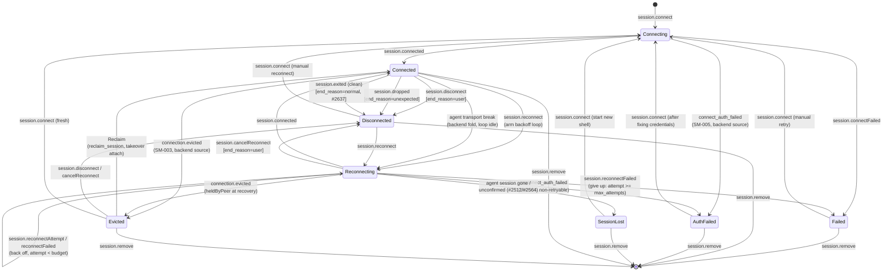
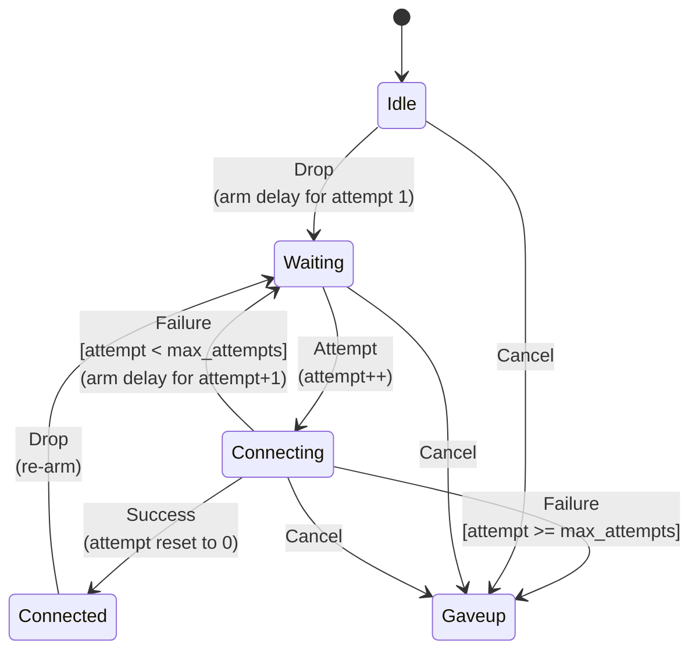

# Session Lifecycle State Machine — Reference

> **Current, authoritative reference.** This document describes the session
> connect / reconnect / disconnect state machine **as it is implemented today**.
> It is derived directly from the backend source and kept alongside
> [`architecture.md`](./architecture.md).
>
> The authority is the backend projection store — the stateless-UI / reducer
> inversion (#2283) made the `session-lifecycle` region authoritative and removed
> the former frontend `appStore` lifecycle reducers. The point-in-time audit
> snapshots under [`docs/audits/`](./audits/) (SSH tunnel, remote-agent
> lifecycle, etc.) predate that inversion and carry "Historical" banners; they
> are **not** current. Prefer this document (and the cited code) for session
> lifecycle behavior.

## 1. Where the state lives

| Layer                             | Carrier                                                          | Location                                                 |
| --------------------------------- | ---------------------------------------------------------------- | -------------------------------------------------------- |
| Coarse per-session status (enum)  | `SessionStatus`                                                  | `src-tauri/src/session_projection/store.rs:47-83`        |
| Composed auto-reconnect sub-state | `ReconnectState { phase, attempt, delay_ms }`                    | `core/src/reconnect_backoff.rs:80-88`                    |
| Authoritative store               | `SessionLifecycleStore` (`HashMap<sessionId, SessionLifecycle>`) | `src-tauri/src/session_projection/store.rs:251-256`      |
| Full lifecycle record             | `SessionLifecycle`                                               | `src-tauri/src/session_projection/store.rs:139-189`      |
| Intent routing (`session.*`)      | `register_session_intents`                                       | `src-tauri/src/session_projection/projection.rs:389-544` |
| Backend reconnect timer driver    | `ReconnectTimerDriver`                                           | `src-tauri/src/session_projection/timer.rs:153-237`      |
| Pure backoff reducer              | `reconnect_reducer`                                              | `core/src/reconnect_backoff.rs:185-262`                  |

The store is keyed by the frontend **tab id** (stable across a reconnect), which
carries the current **backend** session id (`sessionId` field) the client should
attach terminal I/O to. The single shared `session-lifecycle` projection region
mirrors the map to every subscribing client (Open Design Decision #4: a session's
lifecycle is a property of the session, not of a viewing client).

## 2. The coarse states (`SessionStatus`)

Serialized `lowercase` on the wire, except the two `#[serde(rename)]` cases noted.

| State          | Wire value     | Meaning                                                                                                                                                                                                  | Terminal?       |
| -------------- | -------------- | -------------------------------------------------------------------------------------------------------------------------------------------------------------------------------------------------------- | --------------- |
| `Connecting`   | `connecting`   | An initial connect attempt is in flight (the "Connecting…" overlay).                                                                                                                                     | no              |
| `Connected`    | `connected`    | A live session.                                                                                                                                                                                          | no              |
| `Disconnected` | `disconnected` | Ended and idle, no retry loop running. `end_reason` says why (`user` / `unexpected` / `normal`).                                                                                                         | terminal (idle) |
| `Reconnecting` | `reconnecting` | An auto-reconnect loop is active (or an agent's in-task transport re-establish is in flight).                                                                                                            | no              |
| `Failed`       | `failed`       | Terminal failure: the initial connect errored, or the reconnect loop exhausted its attempts. `error` carries the message; the user may manually reconnect.                                               | terminal        |
| `AuthFailed`   | `authFailed`   | Terminal, **non-retryable** failure (SM-005): the connect was rejected by authentication. The loop is never armed / is stopped immediately. The user must fix credentials and reconnect.                 | terminal        |
| `SessionLost`  | `sessionLost`  | Terminal (#2512): a resilient **agent** tab re-established its transport, but the live agent session could not be recovered. The frontend shows a "session lost" notice with a manual "start new shell". | terminal        |
| `Evicted`      | `evicted`      | Sticky (SM-003, single-attach): the session is **alive**, but another desktop/window took control of it. No input is sent; nothing auto-reconnects. Left only by an explicit Reclaim or a user action.   | until user      |

`SessionLifecycle` additionally carries: `reconnect` (the composed
`ReconnectState`), `end_reason`, `error`, `reconnect_error` (the "why we are
reconnecting" note, #2442), `sessionId` (the live backend session id, #2457),
and `exit` (the classified exit cause + code, #2615).

`EndReason` (`store.rs:87-103`): `User` (graceful user teardown), `Unexpected`
(a drop, a candidate for reconnect), `Error` (a connect/reconnect attempt
errored), `Normal` (a clean process exit / `exit 0`, #2637).

## 3. The `session.*` intents (triggers)

Every transition is a `session.*` intent (or a backend-source fold, see §6),
routed in `projection.rs:389-544`; each calls the matching `SessionLifecycleStore`
method, publishes the region diff, and reconciles the backend timer.

| Intent                     | Store method            | Effect                                                                                           |
| -------------------------- | ----------------------- | ------------------------------------------------------------------------------------------------ |
| `session.connect`          | `connect`               | Insert a fresh `Connecting` record, clearing any prior state.                                    |
| `session.connected`        | `connected`             | Settle `Connected`; feed the loop `Success` if a reconnect was in flight.                        |
| `session.connectFailed`    | `connect_failed`        | Terminal `Failed` with the message; loop reset to idle.                                          |
| `session.disconnect`       | `disconnect`            | Graceful user disconnect → idle `Disconnected` (`user`).                                         |
| `session.dropped`          | `dropped`               | Unexpected link drop → idle `Disconnected` (`unexpected`). Does **not** arm the loop.            |
| `session.reconnect`        | `reconnect`             | Arm/restart the auto-reconnect loop (engine `Drop` → `Waiting`); status `Reconnecting`.          |
| `session.reconnectAttempt` | `reconnect_attempt`     | The backoff timer fired: engine `Attempt` (`Waiting → Connecting`, attempt++).                   |
| `session.reconnectFailed`  | `reconnect_failed`      | The in-flight attempt failed: engine `Failure` → back off (`Waiting`) or give up (`Failed`).     |
| `session.cancelReconnect`  | `cancel_reconnect`      | User stopped the loop: engine `Cancel` (`Gaveup`) → idle `Disconnected` (`user`).                |
| `session.reconnectTrigger` | `set_reconnect_trigger` | Metadata-only: record/clear the reconnect-trigger cause (#2442).                                 |
| `session.exited`           | `set_exit`              | Record the exit cause/code; a **clean** exit additionally folds `Disconnected`/`normal` (#2637). |
| `session.remove`           | `remove`                | The tab/session is gone; drop it from the region.                                                |

There is no `session.*` intent for the two auth-rejection folds
(`connect_auth_failed` / `reconnect_auth_failed`, SM-005) or for the transient
agent-transport-break fold — those are applied at the backend source (§6).

**Phantom-entry guard (SM-006).** Only `connect`, `agent_transport_reconnecting`,
and `set_exit` create a record (the latter two lazily). Every other method is a
**no-op for an unknown/removed session**, so a late `connected` / `dropped` /
`disconnect` / `sessionLost` arriving after the user already closed a tab can
never resurrect a phantom entry.

## 4. Top-level state machine

**Single-attach / `Evicted` (SM-003).** The region is keyed per desktop tab, so
two desktops attached to the same daemon session do **not** converge on one
status — the maintainer decision (2026-09-26) is single-attach: the daemon evicts
the previous owner when another desktop attaches, and the evicted desktop folds
the sticky `Evicted` state. Every **automatic** fold is a no-op from `Evicted`
(`connected`, `dropped`, `reconnect`, `agent_transport_reconnecting`,
`session_lost`, `connect_failed`) — an auto-reconnect would re-attach (a
takeover) and ping-pong control. Only the explicit Reclaim (`reclaimed`), a fresh
`connect`, a user `disconnect` / `cancelReconnect`, or `remove` leave it.

**Window takeover (#3368).** The same rule holds between windows of one desktop,
but window eviction is **window-local**, not a region status: the region is shared
by every window of the desktop. The backend `session → window` ownership map
(`WindowManager`, SM-026 / #1900) is the single source of truth — a
`claim_session` atomically supersedes the previous owner, and `send_input` /
`resize_terminal` from any other window are dropped (`may_send_input` /
`may_resize`). A window whose session is owned elsewhere shows "Taken over by
another window" with Reclaim; Reclaim is `claim_session` from that window.
Re-binding the same session id never claims it back automatically.

**Graphical tabs (#3388).** VNC/RDP sessions follow the same ownership map. The
`remote_desktop_send_input` / `_resize` / `_send_clipboard` commands are gated in
the command layer, and so are the remote-clipboard reads (`_get_clipboard`,
`_remote_clipboard_files`, `_bind_clipboard_files`) — a non-owning window can
neither drive the desktop nor read its clipboard. Frame, cursor, clipboard and
cert-prompt events go only to the owning window (broadcast while unclaimed);
lifecycle `remote-desktop-state` stays broadcast. The evicted window keeps its
canvas frozen on the last frame, dimmed under the shared "Taken over by another
window" overlay, which supersedes the reconnect overlay, cert prompt and toolbar
(their actions would drive a session this window does not control). On regaining
control the tab re-sends its last requested size and requests a full frame.

**Held input (#3402).** The backend keeps the authoritative set of keys and
pointer buttons held on each graphical session's remote, tagged with the window
that pressed them, and synthesises the matching key-ups / button-up so nothing
stays stuck: on takeover (`claim_session` releases the previous controller's
input — the evicted window can no longer send), before input from a different
window, on the fresh connection after an auto-reconnect re-dial, and on the
owner-gated `remote_desktop_release_input`, which the canvas sends on canvas
blur, window blur and when the document is hidden. Releases are idempotent.

**Closing an evicted tab (#3401).** An evicted window or desktop owns nothing, so
closing its tab only drops its view — the session the controller uses stays
alive. The backend enforces it: `close_terminal` (a tab close, not an intentional
kill) and `remote_desktop_disconnect` are no-ops from a window that may not
control the session (`WindowManager::may_close`), and a tab close of an agent
session in `Evicted` releases only this desktop's local view
(`release_evicted_session`) — no `connection.close` (or `connection.detach`)
reaches the agent. The owner's close is unchanged.

`Failed`, `AuthFailed`, `SessionLost`, and idle `Disconnected` are the resting
states. From any of them a fresh `session.connect` (a new connect / manual
retry / "start new shell") restarts the machine at `Connecting`; `session.remove`
drops the record entirely.

## 5. The auto-reconnect / backoff sub-machine

`SessionLifecycle.reconnect` composes a pure, timer-free backoff engine
(`core/src/reconnect_backoff.rs`, a faithful port of the frontend
`reconnectBackoff.ts`, #1962/#2144). The store folds coarse status from its phase;
the backend `ReconnectTimerDriver` (`timer.rs`) supplies the wall clock.

### Phases (`ReconnectPhase`, `reconnect_backoff.rs:69-77`)

- `Idle` — not auto-reconnecting.
- `Waiting` — a backoff timer is counting down `delay_ms` before the next attempt.
- `Connecting` — an attempt is in flight (transport being re-established).
- `Connected` — the transport came back; the loop settled successfully.
- `Gaveup` — attempts exhausted or the user cancelled; hand off to the manual overlay.

### Reducer (`reconnect_reducer`, `reconnect_backoff.rs:185-262`)

Unlisted (phase, event) pairs are no-ops — a stray event cannot corrupt the loop.
Notably `Drop` from `Waiting`/`Connecting` is ignored (the loop already runs), and
`Attempt` / `Success` / `Failure` outside their expected phase do nothing. The
store's `reconnect_attempt` / `reconnect_failed` / `reconnect_auth_failed` methods
add a **still-current-run guard** (TBE-011): they act only when the phase is
`Connecting`, so a stale outcome arriving after the loop was cancelled/superseded
never re-animates a stopped tab.

### Backoff schedule (`DEFAULT_BACKOFF`, `reconnect_backoff.rs:52-58`)

| Tunable         | Default | Meaning                                                                      |
| --------------- | ------- | ---------------------------------------------------------------------------- |
| `base_delay_ms` | `1000`  | Delay before the first retry.                                                |
| `factor`        | `2.0`   | Multiplier per attempt (doubles each time).                                  |
| `max_delay_ms`  | `30000` | Ceiling on any single delay (applied before jitter).                         |
| `max_attempts`  | `10`    | Attempt budget before giving up. `0` = retry forever (only Cancel stops it). |
| `jitter_ratio`  | `0.2`   | Symmetric random jitter (±20%) so a fleet of dropped tabs does not stampede. |

Per-attempt delay: `min(base * factor^(n-1), max) * (1 ± jitter)`, clamped `>= 0`
and rounded to whole ms (`backoff_delay` / `next_reconnect_delay`,
`reconnect_backoff.rs:142-165`). Give-up is `attempt >= max_attempts`
(`should_give_up`, `:171-176`).

### How the timer drives it (`ReconnectTimerDriver`, `timer.rs`)

After every transition the routes call `ReconnectTimerDriver::sync`
(`timer.rs:198-212`), which reconciles a per-session one-shot timer against the
current phase:

- **`Waiting`** → arm (replacing any prior) a one-shot for `delay_ms`. On elapse,
  `fire` (`timer.rs:223-236`) advances the store (`reconnect_attempt`:
  `Waiting → Connecting`, attempt++), publishes the diff, then invokes the
  optional backend redrive (#2454). The attempt's **outcome** (`session.connected`
  or `session.reconnectFailed`) comes from whoever owns the transport.
- **anything else** (`Connecting`, `Idle`, `Gaveup`, connected, disconnected,
  removed) → cancel any pending timer.

So the backend owns the retry _count_ and _schedule_; the connection redrive stays
where the sockets live. `max_attempts = 0` means the loop never self-terminates,
so only a user `Cancel` (→ `Gaveup` → `Disconnected`) stops it.

## 6. Backend-source folds (no client intent)

Some transitions are folded server-side, at the source, rather than mirrored by a
client `session.*` intent (`projection.rs:234-380`). They must only drive
transitions that **converge** with the client's same-event dispatch.

| Fold                                | Store method → status                     | Trigger                                                                                                                                                           |
| ----------------------------------- | ----------------------------------------- | ----------------------------------------------------------------------------------------------------------------------------------------------------------------- |
| `connect_auth_failed`               | `AuthFailed` (loop idle)                  | Initial connect rejected by auth (SM-005, `store.rs:366-378`).                                                                                                    |
| `reconnect_auth_failed`             | `AuthFailed` (engine `Cancel` → `Gaveup`) | A reconnect attempt rejected by auth: stop the loop immediately (`store.rs:397-417`).                                                                             |
| `fold_agent_transport_reconnecting` | `Reconnecting` (loop **stays idle**)      | An agent tab's transport hit a _transient_ break the agent I/O task is re-establishing in place (#2555/#2556). Keeps the `sessionId` (the live session survives). |
| `fold_agent_session_recovered`      | `Connected`                               | The agent recovered its live session in place after the transient break.                                                                                          |
| `fold_agent_session_lost`           | `SessionLost`                             | Transport back, but the hosted session is confirmed gone (#2564).                                                                                                 |
| `fold_agent_session_unconfirmed`    | `SessionLost`                             | Transport back, but `connection.list` never answered (SM-001) — session cannot be confirmed.                                                                      |
| `fold_agent_reconnect_failed`       | `Failed`                                  | The agent's own in-task reconnect loop exhausted its budget (#2612/#2564).                                                                                        |
| `fold_agent_session_evicted`        | `Evicted` (loop idle, `sessionId` kept)   | The agent reported `connection.evicted`: another desktop took the session over (SM-003).                                                                          |
| `fold_agent_session_reclaimed`      | `Evicted` → `Connected`                   | The user's explicit Reclaim (`reclaim_session`) takeover attach succeeded (SM-003).                                                                               |

Because the transient-break fold leaves the engine **idle**, the timer reconcile
cancels rather than arms — the agent I/O task is the single owner of that reconnect,
so the backend redrive never double-drives a transport already being re-established.

## 7. Related documents

- [`architecture.md`](./architecture.md) — full arc42 architecture.
- [`remote-protocol.md`](./remote-protocol.md) — desktop↔agent JSON-RPC (agent session semantics).
- [`docs/audits/`](./audits/) — **Historical** point-in-time state-machine audit
  snapshots (SSH tunnel, remote-agent lifecycle, credential store, embedded
  servers, HTTP monitor, remote system monitoring, SFTP, workspace). These predate
  the stateless-UI inversion (#2283) and are superseded for session lifecycle by
  this document. The closest in subject is
  [`remote-agent-lifecycle-state-machine.md`](./audits/remote-agent-lifecycle-state-machine.md).
