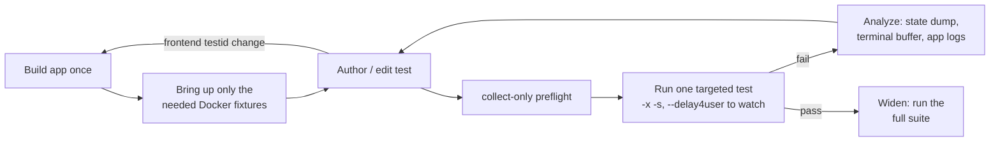

# System-Test Local Workflow & Improvement Strategy

A practical strategy for **running, implementing, and analyzing** the Python
bridge system tests (`tests/system/`) on a developer machine — and a prioritized
roadmap of tooling gaps that currently force tests to be authored "blind".

This complements [`tests/system/README.md`](../tests/system/README.md) (the
reference/how-to) with the _methodology_ for an efficient iteration loop and the
concrete improvements that would tighten it.

> **Why this exists.** The bridge harness runs the **real built app** over a
> WebSocket, so an integration test can only be _executed_ with (a) a built app
> and (b) the Docker fixtures up. Without those, the best a developer (or an AI
> agent) can do is `pytest --collect-only` — which validates imports, mixin MRO,
> and fixture wiring, but never proves a scenario passes. Two harness gaps make
> that loop slower and blinder than it needs to be (see
> [Improvement roadmap](#improvement-roadmap)).

---

## The loop at a glance



The expensive edges are **"Build app once"** (a full release build today) and
the **frontend-testid → rebuild** back-edge. Everything else is seconds.

---

## 1. Run — the efficient inner loop

### One-time per session

```sh
pnpm tauri build                    # repo root — build the app (release; slow, see roadmap)
cargo build --release -p termihub-agent   # only for agent tests
# Bring up ONLY the fixtures a suite needs (they stay up across runs):
docker compose -f tests/docker/docker-compose.yml up -d ssh-password ssh-keys
```

The harness will also bring fixtures up on demand (the session-scoped
`ssh_fixtures` / `telnet_fixtures`), but doing it once by hand keeps the first
test from eating the image-build time and makes the containers obviously "warm".

### Iterate (seconds each)

```sh
cd tests/system
./pytest.sh -m integration -k sftp_infra -x -s        # one suite, stop on first fail, stream logs
./pytest.sh tests/test_sftp_infra.py::TestSftpInfra::test_sftp_lists_remote_files -s
./pytest.sh --lf                                       # re-run only last-failed
```

Keep the loop tight:

- **`-k <substr>`** / a full **node id** to run exactly one suite or test.
- **`-x`** stops at the first failure so you read one error, not twenty.
- **`-s`** streams the app's own stdout (`Spawning local shell`, bridge connect
  lines) — the single most useful signal that the app actually did something.
- **`--lf`** / **`--ff`** to replay just the last failures while fixing.
- The fixtures **stay up** between runs (the harness never tears them down), so
  only the app relaunches — one per suite class.

### Watch it happen

```sh
./pytest.sh -m integration -k sftp_infra --delay4user -s
```

`--delay4user` turns on the `self.delay4user(seconds, reason=…)` sleeps so a
human can follow each step; it is a no-op without the flag (CI/agent runs stay
full speed). Sprinkle these calls while developing a flow you can't yet trust.

---

## 2. Implement — authoring a test

> **The WebdriverIO port is complete.** Every wdio spec was ported to the Python
> bridge harness (epic #799) and the wdio scaffold was fully retired in #1027, so
> there is no longer an "old spec" to inventory or delete. New coverage is
> written directly as `pytest` tests here. The porting-flavored guidance below is
> retained because the mechanics (reuse mixins, verify `data-testid`s against
> current source, assert on store state, preflight with `--collect-only`) apply
> equally to authoring a fresh test.

The original porting contract lived in **#803** (Docker fixtures stay; map each
`data-testid` interaction → a step and each assertion → a check; feed missing
checkers back into #800). The mechanics:

1. **Inventory the source spec first.** List its `it(...)` cases, the
   `data-testid`s it touches, the containers/ports it needs, and any interaction
   that may need a bridge verb (drag, context menu, key chord, file dialog).
   Split scenarios into **portable** vs **manual carve-out** up front.

2. **Reuse mixins, don't reinvent.** `tests/system/termihub_harness/ui/`
   already covers terminals, tabs, sidebar, connections, SSH, SFTP, the local
   file browser, the Monaco editor, credentials, monitoring, settings. A suite
   lists the mixins it drives ahead of `SystemTest` in its bases. The closest
   existing ported test is the best template (e.g. `test_ssh_sftp_cwd.py` for
   SFTP-browser flows).

3. **Verify every `data-testid` against current source.** Confirm each
   id still exists in `src/**` — many are **dynamic** (`${prefix}-download`,
   `file-row-${name}`), so a literal grep gives false negatives; grep the
   template and the prefix. Where the app lacks a stable id the test needs, add
   one (and note it), rather than scraping the DOM.

4. **Assert on store state, not pixels.** Prefer `driver.get_state("dot.path")`
   (`editorStatus`, `editorDirtyTabs`, `file-browser-current-path`,
   `terminalExitedTabs`) and `read_terminal()` (logical-line reconstruction, not
   canvas scraping) over visual checks. Anything that can _only_ be verified
   visually or via an OS-native dialog becomes a **manual test** — record it in
   `docs/testing.md`'s coverage map so coverage is never silently lost.

5. **Preflight with `--collect-only`** after every edit: it catches import
   errors, a bad mixin name, a typo'd fixture, and MRO mistakes in ~10 ms,
   without a build. This is the cheapest possible feedback and should run before
   any real execution.

6. **Record manual carve-outs.** Anything that can only be verified visually or
   via an OS-native dialog belongs in the manual coverage map in `docs/testing.md`
   so coverage is never silently lost.

---

## 3. Analyze — diagnosing a failure

When a targeted run fails, in order of cost:

| Signal                       | How                                              | Tells you                                              |
| ---------------------------- | ------------------------------------------------ | ------------------------------------------------------ |
| The assertion + `what=` text | `wait(..., what="the SFTP browser path")`        | _which_ condition timed out, in words                  |
| App stdout                   | `-s`                                             | did the app boot, connect the bridge, spawn the shell? |
| Store snapshot               | `self.driver.get_state()` (no path = whole tree) | the exact app state at the point of failure            |
| Terminal buffer              | `self.driver.read_terminal()`                    | what the shell actually printed                        |
| Element presence             | `self.driver.exists(testid)` / `get_text`        | is the id wrong/renamed, or just not there yet?        |
| Step-by-step replay          | `--delay4user -s`                                | _where_ in the flow the UI diverges, by eye            |

Rules of thumb:

- A `BridgeError` inside `wait()` (e.g. "no active terminal") usually means
  **"not ready yet"**, not a hard failure — `wait()` already retries it. A
  genuine timeout means the predicate never became true: dump `get_state()`.
- "Element not found" is almost always a **stale or dynamic testid** — confirm it
  in `src/**` and check whether it's name-suffixed.
- Re-run with `--lf -x` while fixing; widen back to the suite once green.

---

## Improvement roadmap

Concrete harness changes that would make the loop above faster and less blind,
roughly in priority order. None require new test content — they are tooling.

### P1 — Support a fast debug build (biggest loop win) ✅ done (#891)

`orchestrator.app_binary_path()` is hardcoded to `target/release/…`, so the only
runnable artifact is a **full release build** — minutes per frontend change.

- Add a `TERMIHUB_TEST_APP_BINARY` env override and fall back to the
  `target/debug/…` path when present, so `pnpm tauri build --debug` (far faster)
  feeds the same harness.
- Document the debug loop in the README.

**Impact:** turns the slow back-edge ("frontend testid change → rebuild") from
minutes into tens of seconds. **Effort:** small.

### P2 — Capture failure artifacts automatically ✅ done (#891)

The app subprocess inherits stdio and nothing is persisted, so a failure in CI
(or a headless agent run) leaves little to debug.

- A `conftest.py` pytest hook (`pytest_runtest_makereport`) that, on an
  **integration** test failure, writes an artifact bundle: `driver.get_state()`,
  `driver.read_terminal()`, and the app's captured stdout/stderr (redirect
  `AppInstance`'s `Popen` to a per-suite log file) into `tests/system/artifacts/`.

**Impact:** failures become diagnosable from the artifact alone — essential for
CI and for tests authored without a local run. **Effort:** small–medium.

### P3 — A one-command runner for the Python harness ✅ done (#898)

There was no top-level entry point for the **bridge** harness (the now-removed
`scripts/test-system.sh` drove the legacy `tauri-driver` flow, retired with the
wdio suites in #1015).
**[`scripts/test-system-py.sh`](../scripts/test-system-py.sh)** (+ `.cmd`)
builds the app if missing/stale (honoring `--debug`), brings up only the
requested `--fixtures`, then forwards args to `pytest.sh` — one command instead
of the three-step dance:

```sh
./scripts/test-system-py.sh --debug -k sftp_infra -x -s
```

`--dry-run` prints the resolved plan (profile, build action, fixtures, forwarded
args) without side effects. See
[`tests/system/README.md`](../tests/system/README.md#one-command--scriptstest-system-pysh).

**Impact:** removes setup friction and the "did I rebuild?" foot-gun.
**Effort:** small.

### P4 — A generated `data-testid` catalog ✅ done (#899)

Stale selectors are the most common authoring error.
**[`scripts/build-testid-catalog.py`](../scripts/build-testid-catalog.py)** scans
`src/**` for every `data-testid` and writes a catalog at
`tests/system/testid-catalog.md`, so an author can confirm an id (and its exact
form) without spelunking components. Dynamic ids (`file-row-${name}`,
`${testIdPrefix}-download`) are rendered as `*` glob patterns (`file-row-*`,
`*-download`); prop-supplied ids are listed as **indirect**. The catalog is a
**local, git-ignored artifact** — not committed. A single global committed file
went stale on every open branch the moment any testid changed on `develop`,
breaking unrelated PRs' CI (#1528); CI now regenerates the catalog from source
and verifies coverage instead of diffing a checked-in file.

```sh
python scripts/build-testid-catalog.py            # regenerate the local catalog
python scripts/build-testid-catalog.py --stdout    # print without writing
```

**Impact:** kills the #1 source of "element not found". **Effort:** medium.

### P5 — Optional screenshot verb for visual carve-outs ✅ done (#900)

Some carve-outs are manual only because the bridge can't _see_ the rendered UI.
A bridge `screenshot` verb rasterizes the live DOM (webview-side
[`html-to-image`](https://github.com/bubkoo/html-to-image), lazy-imported so it
stays a test-mode-only chunk) to a PNG data URL, available on both the TS and
Python `Driver`. The P2 failure-artifact bundle now writes a `screenshot.png`
when the app supports the verb, and `manual_observe` (#914) attaches one to its
report. The DOM path does not capture the xterm GPU canvas or native OS dialogs
(terminal text is read via `readTerminal`); a native window-capture backend
could lift that in future.

**Impact:** fewer manual carve-outs, richer failure bundles. **Effort:** larger
(platform capture path).

---

## TL;DR

- **Run:** build once, keep fixtures warm, iterate with
  `pytest -k <suite> -x -s --lf`; watch with `--delay4user`.
- **Implement:** inventory → reuse mixins → verify testids against `src/**` →
  assert on store state → `--collect-only` preflight → reach parity, then delete
  the old spec.
- **Analyze:** `what=` text → `-s` logs → `get_state()` → `read_terminal()`.
- **Fix the loop:** P1 debug-build support and P2 failure-artifact capture are
  the two changes that most reduce slow-and-blind iteration.
