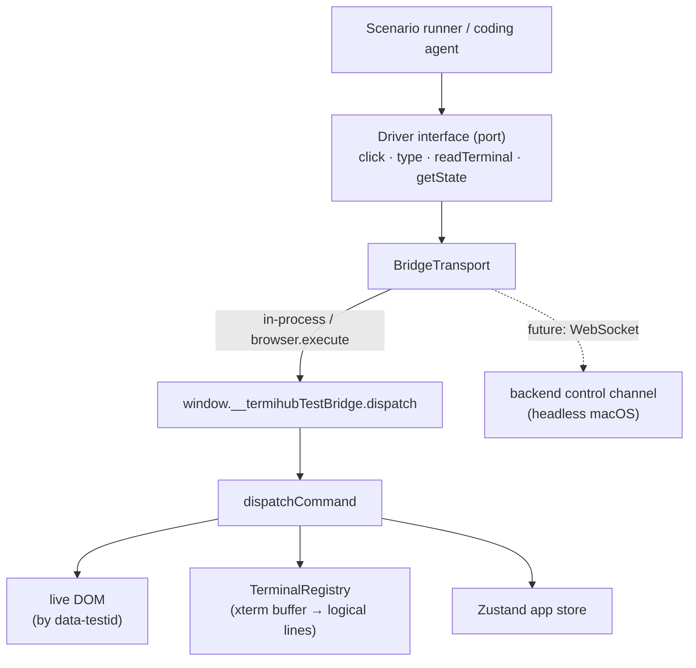

# In-App UI Test Bridge

The in-app test bridge drives and introspects the running termiHub UI **from
inside the webview**. Unlike WebDriver, it has no dependency on a platform
automation driver, so it works identically on **every platform — including
macOS**, where no WKWebView WebDriver exists (the `tauri-driver` E2E path is
Linux/Windows only; see ADR-5 in [architecture.md](architecture.md)).

It is the foundation for an AI-assisted development feedback loop: a human (or a
coding agent) writes a sequence of UI actions plus checks against displayed
terminal text and app state, and gets a structured pass/fail result back.

## Why not just WebDriver?

WebDriver automation needs a platform-specific driver that attaches to the
rendering engine:

| Platform | WebView       | WebDriver         | Status |
| -------- | ------------- | ----------------- | ------ |
| Linux    | WebKitGTK     | `WebKitWebDriver` | ✅     |
| Windows  | Edge WebView2 | `msedgedriver`    | ✅     |
| macOS    | WKWebView     | _none_            | ❌     |

`tauri-driver` is a proxy to whichever of those exists; on macOS there is nothing
to proxy to. The in-app bridge sidesteps this entirely by exposing the control
surface **inside the app** — the same idea as Qt's in-process test interfaces.

## Architecture



The `Driver` never knows which transport is underneath, so the same test runs
in-process, through WebDriver `browser.execute`, or (later) over a WebSocket to a
backend-hosted channel for headless macOS.

## Enabling test mode

The bridge is **inert and uninstalled** in normal use. It activates only when one
of these explicit opt-in signals is present:

- build flag `VITE_TEST_BRIDGE=1`,
- a `?testBridge=1` query parameter,
- `localStorage["termihub.testBridge"] === "1"`,
- a truthy `window.__TERMIHUB_TEST_BRIDGE__` global (e.g. injected by the backend
  in a test build before the app boots).

When active, `TestBridge` (mounted in `TerminalView`, inside
`TerminalPortalProvider`) installs `window.__termihubTestBridge` and removes it on
unmount.

## Command vocabulary

| Action         | Purpose                                                     |
| -------------- | ----------------------------------------------------------- |
| `click`        | Press the element with the given `data-testid`              |
| `type`         | Set an input/textarea value (native setter + `input` event) |
| `exists`       | Whether an element is present                               |
| `getText`      | Read an element's visible text                              |
| `getAttribute` | Read an element's attribute                                 |
| `readTerminal` | Read a terminal's reconstructed logical-line text           |
| `getState`     | Read app store state, optionally by dot-path                |

Every command returns a structured `BridgeResponse` (`{ ok, action, value?,
error? }`). Nothing throws across the bridge — failures are `ok: false` with an
agent-readable `error` — so a runner branches on results instead of catching.

## Programmatic use

```ts
import { InAppBridgeDriver } from "@/testbridge/driver";

const driver = new InAppBridgeDriver(); // defaults to the in-process transport

await driver.click("connection-item-abc");
await driver.type("connection-editor-name-input", "prod-box");
await driver.click("connection-editor-save");

const output = await driver.readTerminal({ joinFullWidthRows: true });
if (!output.includes("HELLO_MARKER")) {
  // ...the checker reports failure with the actual terminal text
}
```

From a WebdriverIO test, the same `dispatch` is reachable through the page realm:

```js
const res = await browser.execute((cmd) => window.__termihubTestBridge?.dispatch(cmd), {
  action: "readTerminal",
  joinFullWidthRows: true,
});
```

## Source layout

| File                            | Responsibility                                     |
| ------------------------------- | -------------------------------------------------- |
| `src/testbridge/protocol.ts`    | Command + response types (the contract)            |
| `src/testbridge/dispatcher.ts`  | Pure, dependency-injected command executor         |
| `src/testbridge/testMode.ts`    | Opt-in detection                                   |
| `src/testbridge/TestBridge.tsx` | Live component that installs the window bridge     |
| `src/testbridge/driver.ts`      | `Driver` abstraction + `InAppBridgeDriver` adapter |

## Not covered

The bridge injects **synthetic** DOM events, so it faithfully tests app logic,
rendering, terminal I/O, and state — but **not** the native OS input pipeline
(native drag-and-drop coordinates, IME, real keyboard focus). Those remain the
domain of the real-input `tauri-driver` path on Linux/Windows and manual macOS
testing.
