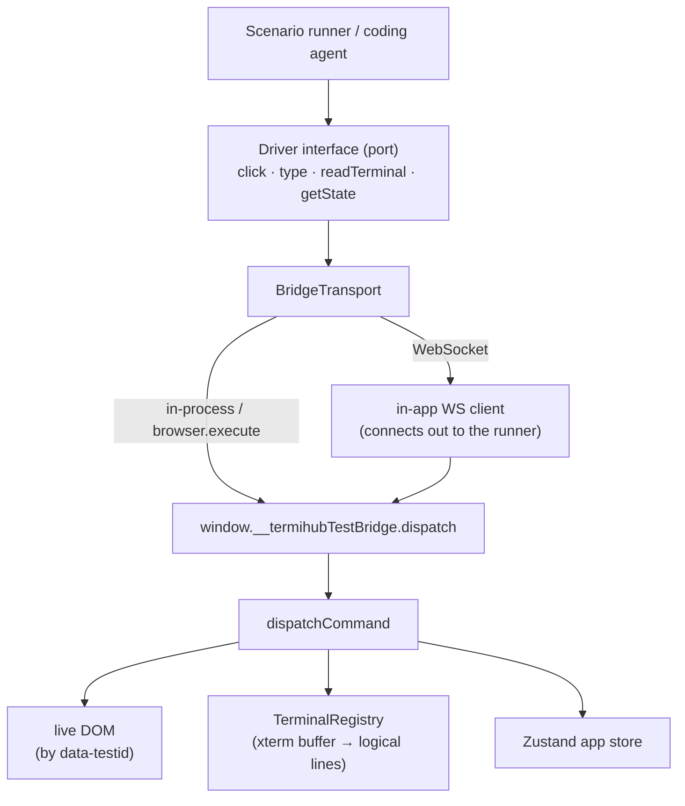
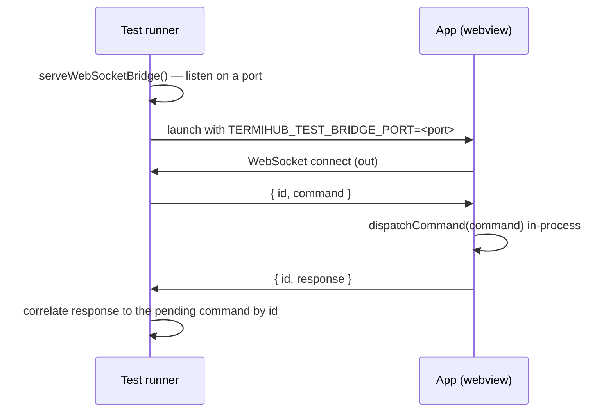

# In-App UI Test Bridge

The in-app test bridge drives and introspects the running termiHub UI **from
inside the webview**. Unlike WebDriver, it has no dependency on a platform
automation driver, so it works identically on **every platform — including
macOS**, where no WKWebView WebDriver exists (the `tauri-driver` E2E path is
Linux/Windows only; see ADR-5 in [architecture.md](architecture.md)).

It is the foundation for an AI-assisted development feedback loop: a human (or a
coding agent) writes a sequence of UI actions plus checks against displayed
terminal text and app state, and gets a structured pass/fail result back.

## Why not just WebDriver?

WebDriver automation needs a platform-specific driver that attaches to the
rendering engine:

| Platform | WebView       | WebDriver         | Status |
| -------- | ------------- | ----------------- | ------ |
| Linux    | WebKitGTK     | `WebKitWebDriver` | ✅     |
| Windows  | Edge WebView2 | `msedgedriver`    | ✅     |
| macOS    | WKWebView     | _none_            | ❌     |

`tauri-driver` is a proxy to whichever of those exists; on macOS there is nothing
to proxy to. The in-app bridge sidesteps this entirely by exposing the control
surface **inside the app** — the same idea as Qt's in-process test interfaces.

## Architecture



The `Driver` never knows which transport is underneath, so the same test runs
in-process, through WebDriver `browser.execute`, or over a WebSocket to an
external test runner — the last of which works on **every** platform, including
headless macOS.

## Cross-platform WebSocket transport

The WebSocket transport is the one path that runs identically on Linux, Windows,
and macOS, because no platform automation driver is involved at all. The app is
the WebSocket **client** and the test runner is the **server**:



Because several commands may be in flight at once, each message is wrapped in an
envelope carrying a monotonic `id` (`{ id, command }` / `{ id, response }`); the
runner's `WebSocketBridgeTransport` matches each response back to its pending
promise by `id`. Nothing new crosses the bridge semantically — only the bytes
travel over a socket — so the command vocabulary and `ok/error` contract are
unchanged.

```ts
import { serveWebSocketBridge } from "@/testbridge/wsServer";
import { InAppBridgeDriver } from "@/testbridge/driver";

const server = await serveWebSocketBridge(); // ephemeral port
// launch the app with TERMIHUB_TEST_BRIDGE_PORT=server.port …
const transport = await server.waitForApp(); // resolves once the app connects
const driver = new InAppBridgeDriver(transport.transport);

const output = await driver.readTerminal({ joinFullWidthRows: true });
await server.close();
```

### Sequential connections (kill/restart within one run)

A single runner session can drive **several app instances in sequence** — kill the
app, launch a fresh one, and keep driving — so system tests can assert restart and
recovery (issue #817). The server tracks a monotonic **connection generation** and
applies **last-writer-wins**: a newly connected app becomes the live one and
supersedes any predecessor, so exactly one app drives the run at a time and a
restarted app always re-acquires the bridge (even if its connection races the old
socket's close). Both the TS `wsServer.ts` and the Python harness (#802) expose
this same contract:

| Call             | Resolves with                                                                                                                                                |
| ---------------- | ------------------------------------------------------------------------------------------------------------------------------------------------------------ |
| `waitForApp()`   | The current app's transport; once it disconnects, waits for the next to connect. Repeated calls return the same transport while one app stays connected.     |
| `awaitNextApp()` | A fresh transport for the **next** connection after the one last handed out — the restart seam. Resolves immediately if that connection has already arrived. |

```ts
const a = await server.waitForApp(); // drive instance A …
killApp(); // A's socket closes
const b = await server.awaitNextApp(); // launch + drive instance B over the same server
```

The in-app `wsClient` detaches all its socket listeners on `close()` (idempotently),
so a restarted app boots cleanly with no listeners leaked from a prior connection.

The backend enables test mode and supplies the port by injecting two globals into
the webview before any page script runs (a Tauri plugin `js_init_script`, only
registered when `TERMIHUB_TEST_BRIDGE_PORT` is set):
`window.__TERMIHUB_TEST_BRIDGE__ = true` and
`window.__TERMIHUB_TEST_BRIDGE_PORT__ = <port>`. The app's `TestBridge` then opens
the WebSocket client alongside the in-process bridge.

## Enabling test mode

The bridge is **inert and uninstalled** in normal use. It activates only when one
of these explicit opt-in signals is present:

- build flag `VITE_TEST_BRIDGE=1`,
- a `?testBridge=1` query parameter,
- `localStorage["termihub.testBridge"] === "1"`,
- a truthy `window.__TERMIHUB_TEST_BRIDGE__` global (e.g. injected by the backend
  in a test build before the app boots).

When active, `TestBridge` (mounted in `TerminalView`, inside
`TerminalPortalProvider`) installs `window.__termihubTestBridge` and removes it on
unmount.

## Command vocabulary

| Action                | Purpose                                                        |
| --------------------- | -------------------------------------------------------------- |
| `click`               | Press the element (full pointer sequence, so Radix menus open) |
| `doubleClick`         | Double-click to "activate" (open connection / dir / file)      |
| `type`                | Set an input/textarea value (native setter + `input` event)    |
| `select`              | Choose a native `<select>` option (native setter + `change`)   |
| `contextMenu`         | Open an element's right-click menu (`contextmenu` event)       |
| `resizeWindow`        | Resize the app window (Tauri `setSize` → xterm fit → PTY size) |
| `pressKey`            | Dispatch a key + optional modifiers (`Ctrl+S`, `ArrowDown`)    |
| `terminalInput`       | Send a command into a terminal **session** (see below)         |
| `scrollTerminal`      | Scroll a terminal's viewport by lines / to the bottom          |
| `drag`                | Drag an element by a pixel delta (resize handles)              |
| `dragTo`              | Drag one element onto another (pointer-based, e.g. @dnd-kit)   |
| `exists`              | Whether an element is present                                  |
| `getText`             | Read an element's visible text                                 |
| `getAttribute`        | Read an element's markup attribute                             |
| `getValue`            | Read the live `value` of an `<input>`/`<textarea>`/`<select>`  |
| `getComputedStyle`    | Read a _computed_ CSS property — incl. theme custom properties |
| `readTerminal`        | Read a terminal's reconstructed logical-line text              |
| `getTerminalViewport` | Read a terminal's `{ viewportY, baseY }` scroll position       |
| `getState`            | Read app store state, optionally by dot-path                   |
| `screenshot`          | Capture a PNG of the rendered app as a data URL (see below)    |
| `emitEvent`           | Inject a Tauri event to drive event-only UI (see below)        |
| `severAgentTransport` | Test-only: sever a connected agent's transport (see below)     |

Every command returns a structured `BridgeResponse` (`{ ok, action, value?,
error? }`). Nothing throws across the bridge — failures are `ok: false` with an
agent-readable `error` — so a runner branches on results instead of catching.

### Writing into a terminal (`terminalInput`)

`type` targets `<input>`/`<textarea>` elements, but an xterm terminal renders to
a **canvas**, not a form field — so `type` cannot drive a shell. `terminalInput`
fills that gap: `{ action: "terminalInput", text, tabId? }` routes `text` to the
session's backend `send_input` — the **same choke point** interactive keystrokes
and paste use — rather than synthesizing canvas key events. When `tabId` is
omitted the active terminal tab is used.

A **trailing newline is appended for you**, and the backend normalizes it to the
session's configured line ending, exactly like pressing Enter. So
`terminalInput("ls")` runs `ls`. This "honor the session line ending" ergonomics
choice mirrors interactive input and the workspace `initialCommand` path; callers
pass the command, not the newline.

```ts
await driver.terminalInput("echo HELLO_MARKER"); // runs in the active terminal
const output = await driver.readTerminal();
output.includes("HELLO_MARKER"); // assert on the result
```

### Double-clicking (`doubleClick`)

`click` fires a single click, but several "activate" gestures are bound to
`onDoubleClick`: opening a connection's session from the sidebar, entering a
directory in the file browser, and opening a file in the editor. `{ action:
"doubleClick", testId }` fires **two full click sequences followed by a
`dblclick`** event — what a real double-click produces — so React's
`onDoubleClick` handler runs (a bare `element.click()` never emits a `dblclick`).

```ts
await driver.doubleClick("connection-item-<id>"); // open the connection's session
await driver.doubleClick("file-row-src"); // enter the src/ directory
```

### Terminal scrolling (`scrollTerminal`, `getTerminalViewport`)

An xterm terminal renders to a **canvas** with no scrollable DOM box, so neither
`click` nor a synthetic wheel event reliably moves its viewport — and its scroll
position is not in the DOM to read back. These two verbs drive and observe scroll
through xterm's own API so a test can assert the **auto-scroll** behavior (#504:
new output must not yank a user who has scrolled up back to the bottom):

- `{ action: "scrollTerminal", lines?, toBottom?, tabId? }` calls
  `xterm.scrollLines(lines)` (signed — negative scrolls up into the scrollback) or
  `xterm.scrollToBottom()` when `toBottom` is set. Either way it fires the **same
  `onScroll` event a mouse wheel would**, which is exactly what the terminal's
  auto-scroll guard keys off — so the gesture exercises production code, not a
  test-only path.
- `{ action: "getTerminalViewport", tabId? }` returns `{ viewportY, baseY }` from
  `xterm.buffer.active`. `viewportY < baseY` means scrolled up into the scrollback
  (auto-scroll suppressed); `viewportY === baseY` means pinned to the bottom.

Both default to the active terminal tab and fail (`ok: false`) when no terminal
is registered for the tab.

```ts
await driver.scrollTerminal({ lines: -100 }); // scroll up 100 lines
const before = await driver.getTerminalViewport(); // { viewportY < baseY }
await driver.terminalInput("seq 1 100"); // more output arrives…
const after = await driver.getTerminalViewport(); // …viewportY stays put
await driver.scrollTerminal({ toBottom: true }); // re-arm auto-scroll
```

The scenario runner (#800) exposes these as the `scrollTerminal` step and the
`terminalAtBottom` check (`{ assert: "terminalAtBottom", atBottom?, tolerance? }`).

### Keyboard chords (`pressKey` modifiers)

`pressKey` takes optional `ctrl` / `meta` / `shift` / `alt` flags for chords like
`Ctrl+S` or `Ctrl+End`. Crucially, the dispatched event also carries a real legacy
**`keyCode`** (the deprecated numeric, set via `Object.defineProperty` since it is
read-only and absent from `KeyboardEventInit`): a synthetic event leaves it `0`,
and Monaco's `StandardKeyboardEvent` reads `e.keyCode` to resolve keybindings — so
without it, `Ctrl+S` would resolve to `Unknown` and do nothing. With it, keybinding
-driven editors respond as they do to real input. This is what lets a test target
Monaco's hidden input (tagged `editor-input` by `FileEditor`) to drive **cursor
movement** (`ArrowDown` updates `editorStatus.line`) and the **Save keybinding**
(`Cmd+S`/`Ctrl+S` clears the dirty flag).

```ts
await driver.pressKey("ArrowDown", "editor-input"); // caret moves; Ln/Col updates
await driver.pressKey("s", "editor-input", { meta: true }); // Cmd+S → save
```

### Dragging (`drag`) and computed styles (`getComputedStyle`)

`click` cannot drive drag-to-resize handles or pointer reordering, and
`getAttribute` only sees markup attributes — not the _effective_ `cursor`, a
theme color, or a CSS variable resolved from a stylesheet. Two verbs close those
gaps:

- `{ action: "drag", testId, dx, dy? }` dispatches `mousedown` on the element,
  then `mousemove`/`mouseup` on the document offset by `(dx, dy)` from the
  element's center — the sequence handlers like `useSidebarResize` listen for
  (they read `event.clientX`). Only the delta matters, so absolute coordinates
  need not be known.
- `{ action: "getComputedStyle", testId?, property }` returns
  `getComputedStyle(el).getPropertyValue(property).trim()`. Omit `testId` to read
  the document root (`:root`), where theme custom properties like `--bg-primary`
  are defined.

```ts
// Widen the sidebar and confirm the handle advertises a resize cursor.
await driver.drag("sidebar-resize-handle", 100);
await driver.getComputedStyle("cursor", { testId: "sidebar-resize-handle" }); // "col-resize"
await driver.getComputedStyle("--bg-primary"); // active theme background
```

### Screenshots (`screenshot`)

`getComputedStyle` proves an individual style resolves, but some carve-outs need
to _see_ the rendered result (overall pixel geometry, theme rendering). The
`screenshot` verb rasterizes the live DOM to a PNG and returns it as a
`data:image/png;base64,…` URL:

- `{ action: "screenshot" }` → `value` is the PNG data URL. The live bridge
  lazy-imports [`html-to-image`](https://github.com/bubkoo/html-to-image) (a
  test-mode-only chunk, kept out of the normal bundle) and rasterizes
  `document.body`; unit tests inject a stub via the `screenshot` dep.
- **Limitation:** DOM rasterization does **not** capture the xterm GPU canvas or
  native OS dialogs — read terminal text via `readTerminal` instead. A native
  window-capture backend could lift this in future.

```ts
const dataUrl = await driver.screenshot(); // "data:image/png;base64,…"
```

The Python harness exposes the same verb (`driver.screenshot()`), and the
failure-artifact bundle writes a `screenshot.png` alongside `state.json` /
`terminal.txt` whenever the app supports the verb — visual evidence of the moment
a test failed. Decode the data URL with `screenshot_to_png_bytes`.

It fails (`ok: false`) when there is no active terminal, or when the target tab
has no backend session bound (e.g. the shell has exited).

### Injecting backend events (`emitEvent`)

Every other verb drives the UI from the _outside_ — DOM events, terminal input.
That leaves a gap: UI reachable **only** via a backend-originated event cannot be
surfaced at all. The motivating case (#1520) is the deferred-update banner, which
renders from the `agentUpdates` store slice fed exclusively by the
`agent-update-available` event an agent's 24h update timer raises. It is not
replayed on attach, so no amount of clicking brings it up.

`emitEvent` dispatches through the same Tauri event bus the backend emits on, so
the app's real `listen` subscriptions and store-folding hooks run untouched — the
test injects the **stimulus**, not the state. Prefer it over writing the store
directly: the app's own event handling stays covered.

- `{ action: "emitEvent", event, payload? }` → `ok: true` once dispatched. An
  empty `event` fails fast (`ok: false`) rather than surfacing an opaque plugin
  error from the bus. Omit `payload` for a payload-less event.
- Payload keys must match the event's wire shape — the backend's
  `snake_case`/`camelCase` mix is deliberate, so copy it from the emitter.

```ts
await driver.emitEvent("agent-update-available", {
  agent_id: agentId,
  currentVersion: "0.1.0",
  availableVersion: "0.2.0",
  staged: true,
});
```

The Python harness exposes the same verb as `driver.emit_event(event, payload=None)`.

**Test-mode gating.** This is the bridge's only non-DOM injector — the one verb
whose blast radius reaches the backend — so it is gated twice: the bridge as a
whole is installed only under the opt-in signals above, and the live `TestBridge`
**re-checks `isTestBridgeEnabled()` at the call site** before touching the bus.
The guarantee "inert outside the harness" then holds locally, independent of how
the deps object was obtained. Unit tests inject a stub via the `emitEvent` dep.

### Severing an agent transport (`severAgentTransport`)

The bridge has no generic "invoke a Tauri command" verb by design. The one
test-only command the automated **agent-reconnect UI grade** (#2574) needs — a
deterministic, in-process transport sever (#2573) — is therefore exposed as its
own named verb, mirroring `emitEvent` as the only other verb whose blast radius
reaches the backend.

`severAgentTransport` drives the automated reconnect grade
([`tests/system/tests/test_agent_reconnect_ui.py`](../tests/system/tests/test_agent_reconnect_ui.py)):
it drops a connected agent's russh transport in-process so the peer sees an
abrupt EOF/RST — a faithful analog of a real transport loss — while the agent's
I/O task stays alive and takes the reconnect path (unlike a clean
`disconnect_agent`, which is a user-cancel). This replaces the retired
`lsof`/process-title shell drop, which false-passed.

- `{ action: "severAgentTransport", agentId }` → `ok: true`, `value: true` when a
  live agent received the sever, `value: false` for an unknown/dead agent. An
  empty `agentId` fails fast (`ok: false`).

```ts
const severed = await driver.severAgentTransport(agentId); // boolean
```

The Python harness exposes it as `driver.sever_agent_transport(agent_id)`.

**Test-mode gating (doubly).** Like `emitEvent`, the live `TestBridge` re-checks
`isTestBridgeEnabled()` at the call site before invoking. The underlying
`test_sever_agent_transport` Tauri command **also** refuses unless the test bridge
is enabled (`TERMIHUB_TEST_BRIDGE_PORT` set), so a production launch can never
reach the sever. Unit tests inject a stub via the `severAgentTransport` dep.

### Element-to-element drag (`dragTo`) and @dnd-kit

`drag` moves by a blind pixel delta (resize handles); `dragTo` drags one element
onto another and is the verb for **@dnd-kit** reordering (tabs use
`useSortable` + a `PointerSensor`). Driving @dnd-kit with synthetic events has
two requirements that a naive "fire pointerdown → moves → pointerup in one go"
does not meet, so `dragTo` handles both:

- **Activation distance** — the `PointerSensor` ignores a press until a
  `pointermove` travels past its activation distance (5px for tabs). `dragTo`
  begins with a short **wake move** that clears it before stepping to the target.
- **Measurement timing** — on activation, `DndContext` measures droppable rects
  in a React render/effect cycle, and the drop target (`over`) is recomputed from
  those rects. If every pointer event fires in one synchronous task, that cycle
  never runs: collision detection sees no rects, `over` stays `null`, and the
  drop reorders nothing. `dragTo` therefore **yields a frame** after the wake
  move and **between each step**, so dnd-kit activates, measures, and resolves
  the target before `pointerup`.

```ts
const [first, , last] = (await driver.getState("rootPanel")).tabs.map((t) => t.id);
await driver.dragTo(`tab-${last}`, `tab-${first}`); // reorder: last → first slot
```

Because `dragTo` awaits real frames, it is async like every command; assert the
result from state (e.g. `rootPanel` tab order) rather than scraping the DOM. It
still injects **synthetic** events — it exercises dnd-kit's app logic, not the
native OS drag pipeline (see [Not covered](#not-covered)).

- **Drag-only drop targets** — some droppables mount _only while a drag is
  active_, so they cannot be resolved before `pointerdown`. The `PanelDropZone`
  edge/center overlays (`panel-drop-edge-<panelId>-<edge>`,
  `panel-drop-center-<panelId>`, #2583) are the case: they render only when a tab
  drag is in progress. When `toTestId` is absent up front, `dragTo` presses on the
  source and fires the wake move first — which activates the drag and mounts the
  zones — then resolves the target and steps to it. So dragging a `tab-<id>` onto a
  `panel-drop-edge-<panelId>-<edge>` zone splits that panel, and onto a
  `panel-drop-center-<panelId>` zone moves the tab into it — exactly as a real
  edge/center drop would.

- **Post-drag settle** — on `pointerup` dnd-kit's `PointerSensor.detach()` removes
  its document listeners on a `setTimeout(…, 50)`, and one of them is a
  capture-phase `click` listener (installed on activation) that `stopPropagation`s
  every click. So a `click` verb fired within ~50 ms of a drop is **swallowed** —
  the drop itself lands, but the immediate follow-up click does nothing (the #2609
  flake: clicking the tab-group chip a tab was just dropped onto never activated
  it). `dragTo` therefore waits past that teardown window before resolving, so a
  click (or any verb) issued right after a drag sees a settled DOM.

### Reading form values (`getValue` vs `getAttribute`)

A React-**controlled** `<input>`/`<select>` updates the DOM _property_ `.value`,
not the markup `value` _attribute_. So `getAttribute("field-port", "value")`
reads the stale initial value (or `null`), while `getValue` reads what the
user/code actually set — the assertion you almost always want for form fields:

- `{ action: "getValue", testId }` returns `el.value` for `<input>`,
  `<textarea>`, and `<select>`. It fails (`ok: false`) for any other element or
  a missing testid.

```ts
await driver.getValue("field-port"); // "22" — the live, controlled value
```

The scenario runner exposes this as the `valueEquals` check
(`{ assert: "valueEquals", testId, value }`), alongside `textEquals`.

## Programmatic use

```ts
import { InAppBridgeDriver } from "@/testbridge/driver";

const driver = new InAppBridgeDriver(); // defaults to the in-process transport

await driver.click("connection-item-abc");
await driver.type("connection-editor-name-input", "prod-box");
await driver.click("connection-editor-save");

const output = await driver.readTerminal({ joinFullWidthRows: true });
if (!output.includes("HELLO_MARKER")) {
  // ...the checker reports failure with the actual terminal text
}
```

From a WebdriverIO test, the same `dispatch` is reachable through the page realm:

```js
const res = await browser.execute((cmd) => window.__termihubTestBridge?.dispatch(cmd), {
  action: "readTerminal",
  joinFullWidthRows: true,
});
```

## Authoring scenarios

For test authors (and coding agents), the ergonomic layer is the **declarative
scenario**: a sequence of UI actions followed by checks, run by `runScenario`,
which returns a structured `ScenarioResult` instead of throwing. `passed` is the
only field that must be checked; on failure each step/check carries detail and a
terminal snapshot is attached for diagnostics.

```ts
import { runScenario } from "@/testbridge/runner";
import { InAppBridgeDriver } from "@/testbridge/driver";

const result = await runScenario(
  {
    name: "Initial command runs on connect",
    requirement: "A connection's initial command is sent once the shell is ready.",
    steps: [
      { action: "click", testId: "connection-item-abc" },
      { action: "waitFor", testId: "tab-abc", timeoutMs: 5000 },
      { action: "pause", ms: 300 },
    ],
    checks: [
      { assert: "terminalContains", value: "HELLO_MARKER" },
      { assert: "stateEquals", path: "activePanelId", value: "panel-1" },
    ],
  },
  new InAppBridgeDriver()
);

if (!result.passed) {
  // result.requirement, result.checks[*].expected/actual, result.terminalSnapshot
}
```

### Steps

| Step                                                               | Effect                                            |
| ------------------------------------------------------------------ | ------------------------------------------------- |
| `{ action: "click", testId }`                                      | Press the control                                 |
| `{ action: "doubleClick", testId }`                                | Double-click to activate (open conn / dir / file) |
| `{ action: "resizeWindow", width, height }`                        | Resize the app window (logical px) via Tauri      |
| `{ action: "type", testId, text }`                                 | Set an input/textarea value                       |
| `{ action: "select", testId, value }`                              | Choose a native `<select>` option                 |
| `{ action: "contextMenu", testId }`                                | Open the element's right-click context menu       |
| `{ action: "pressKey", key, testId?, ctrl?, meta?, shift?, alt? }` | Dispatch a key + optional modifiers               |
| `{ action: "drag", testId, dx, dy? }`                              | Drag an element by a pixel delta                  |
| `{ action: "dragTo", fromTestId, toTestId }`                       | Drag one element onto another                     |
| `{ action: "terminalInput", text, tabId? }`                        | Send a command into a terminal session            |
| `{ action: "scrollTerminal", lines?, toBottom?, tabId? }`          | Scroll a terminal's viewport (lines / to bottom)  |
| `{ action: "waitFor", testId, timeoutMs?, intervalMs? }`           | Poll until the element exists, or fail on timeout |
| `{ action: "pause", ms }`                                          | Wait a fixed duration for output to settle        |

The first failing step aborts the rest (steps are sequential preconditions) and
the checks are skipped.

### Checker catalog

| Check                                                           | Passes when                                                  |
| --------------------------------------------------------------- | ------------------------------------------------------------ |
| `{ assert: "terminalContains", value, tabId? }`                 | The terminal text contains `value`                           |
| `{ assert: "terminalMatches", pattern, flags?, tabId? }`        | The terminal text matches the regex                          |
| `{ assert: "textEquals", testId, value }`                       | The element's visible text equals `value`                    |
| `{ assert: "exists", testId, present? }`                        | The element is present (or absent if `present: false`)       |
| `{ assert: "computedStyleEquals", property, value, testId? }`   | A computed CSS property equals `value` (root if no `testId`) |
| `{ assert: "terminalAtBottom", atBottom?, tolerance?, tabId? }` | The terminal is pinned to the bottom (auto-scroll active)    |
| `{ assert: "stateEquals", path, value }`                        | The app-state value at dot-`path` deep-equals `value`        |

When all steps succeed, **every** check is evaluated (even after one fails) so a
single run reports all assertions at once. A check that cannot be evaluated (e.g.
no terminal to read) is recorded with an `error` rather than throwing.

## Source layout

| File                            | Responsibility                                       |
| ------------------------------- | ---------------------------------------------------- |
| `src/testbridge/protocol.ts`    | Command + response types (the contract)              |
| `src/testbridge/dispatcher.ts`  | Pure, dependency-injected command executor           |
| `src/testbridge/testMode.ts`    | Opt-in detection                                     |
| `src/testbridge/TestBridge.tsx` | Live component that installs the window bridge       |
| `src/testbridge/driver.ts`      | `Driver` abstraction + `InAppBridgeDriver` adapter   |
| `src/testbridge/scenario.ts`    | Declarative scenario + result types                  |
| `src/testbridge/runner.ts`      | `runScenario` — runs scenarios, returns feedback     |
| `src/testbridge/wsProtocol.ts`  | `{ id, command/response }` correlation envelope      |
| `src/testbridge/wsClient.ts`    | In-app WS client (connects out, dispatches, replies) |
| `src/testbridge/wsTransport.ts` | Runner-side `WebSocketBridgeTransport` (correlation) |
| `src/testbridge/wsServer.ts`    | `ws`-backed runner server (`serveWebSocketBridge`)   |

## Not covered

The bridge injects **synthetic** DOM events, so it faithfully tests app logic,
rendering, terminal I/O, and state — but **not** the native OS input pipeline
(native drag-and-drop coordinates, IME, real keyboard focus). Those remain the
domain of the real-input `tauri-driver` path on Linux/Windows and manual macOS
testing.
