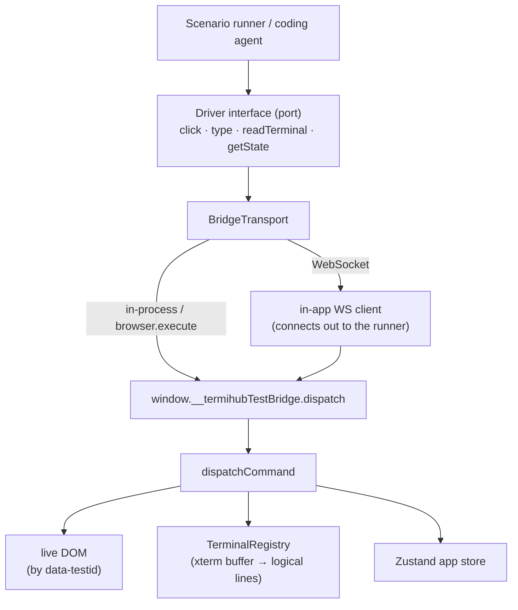
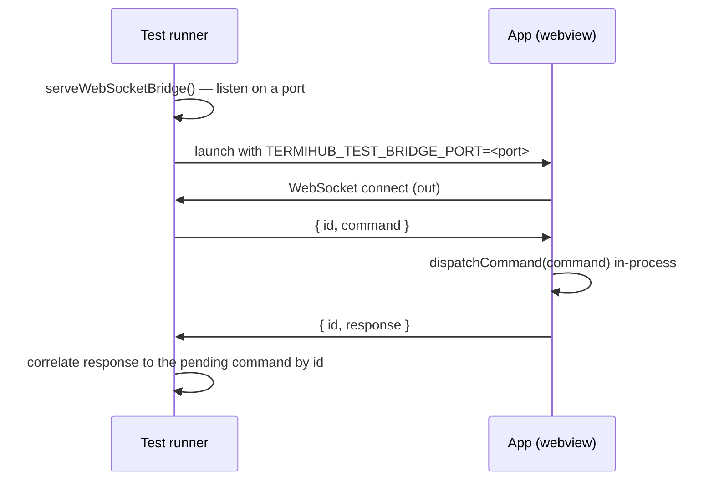

# In-App UI Test Bridge

The in-app test bridge drives and introspects the running termiHub UI **from
inside the webview**. Unlike WebDriver, it has no dependency on a platform
automation driver, so it works identically on **every platform — including
macOS**, where no WKWebView WebDriver exists (the `tauri-driver` E2E path is
Linux/Windows only; see ADR-5 in [architecture.md](architecture.md)).

It is the foundation for an AI-assisted development feedback loop: a human (or a
coding agent) writes a sequence of UI actions plus checks against displayed
terminal text and app state, and gets a structured pass/fail result back.

## Why not just WebDriver?

WebDriver automation needs a platform-specific driver that attaches to the
rendering engine:

| Platform | WebView       | WebDriver         | Status |
| -------- | ------------- | ----------------- | ------ |
| Linux    | WebKitGTK     | `WebKitWebDriver` | ✅     |
| Windows  | Edge WebView2 | `msedgedriver`    | ✅     |
| macOS    | WKWebView     | _none_            | ❌     |

`tauri-driver` is a proxy to whichever of those exists; on macOS there is nothing
to proxy to. The in-app bridge sidesteps this entirely by exposing the control
surface **inside the app** — the same idea as Qt's in-process test interfaces.

## Architecture



The `Driver` never knows which transport is underneath, so the same test runs
in-process, through WebDriver `browser.execute`, or over a WebSocket to an
external test runner — the last of which works on **every** platform, including
headless macOS.

## Cross-platform WebSocket transport

The WebSocket transport is the one path that runs identically on Linux, Windows,
and macOS, because no platform automation driver is involved at all. The app is
the WebSocket **client** and the test runner is the **server**:



Because several commands may be in flight at once, each message is wrapped in an
envelope carrying a monotonic `id` (`{ id, command }` / `{ id, response }`); the
runner's `WebSocketBridgeTransport` matches each response back to its pending
promise by `id`. Nothing new crosses the bridge semantically — only the bytes
travel over a socket — so the command vocabulary and `ok/error` contract are
unchanged.

```ts
import { serveWebSocketBridge } from "@/testbridge/wsServer";
import { InAppBridgeDriver } from "@/testbridge/driver";

const server = await serveWebSocketBridge(); // ephemeral port
// launch the app with TERMIHUB_TEST_BRIDGE_PORT=server.port …
const transport = await server.waitForApp(); // resolves once the app connects
const driver = new InAppBridgeDriver(transport.transport);

const output = await driver.readTerminal({ joinFullWidthRows: true });
await server.close();
```

### Sequential connections (kill/restart within one run)

A single runner session can drive **several app instances in sequence** — kill the
app, launch a fresh one, and keep driving — so system tests can assert restart and
recovery (issue #817). The server tracks a monotonic **connection generation** and
applies **last-writer-wins**: a newly connected app becomes the live one and
supersedes any predecessor, so exactly one app drives the run at a time and a
restarted app always re-acquires the bridge (even if its connection races the old
socket's close). Both the TS `wsServer.ts` and the Python harness (#802) expose
this same contract:

| Call             | Resolves with                                                                                                                                                |
| ---------------- | ------------------------------------------------------------------------------------------------------------------------------------------------------------ |
| `waitForApp()`   | The current app's transport; once it disconnects, waits for the next to connect. Repeated calls return the same transport while one app stays connected.     |
| `awaitNextApp()` | A fresh transport for the **next** connection after the one last handed out — the restart seam. Resolves immediately if that connection has already arrived. |

```ts
const a = await server.waitForApp(); // drive instance A …
killApp(); // A's socket closes
const b = await server.awaitNextApp(); // launch + drive instance B over the same server
```

The in-app `wsClient` detaches all its socket listeners on `close()` (idempotently),
so a restarted app boots cleanly with no listeners leaked from a prior connection.

The backend enables test mode and supplies the port by injecting two globals into
the webview before any page script runs (a Tauri plugin `js_init_script`, only
registered when `TERMIHUB_TEST_BRIDGE_PORT` is set):
`window.__TERMIHUB_TEST_BRIDGE__ = true` and
`window.__TERMIHUB_TEST_BRIDGE_PORT__ = <port>`. The app's `TestBridge` then opens
the WebSocket client alongside the in-process bridge.

## Enabling test mode

The bridge is **inert and uninstalled** in normal use. It activates only when one
of these explicit opt-in signals is present:

- build flag `VITE_TEST_BRIDGE=1`,
- a `?testBridge=1` query parameter,
- `localStorage["termihub.testBridge"] === "1"`,
- a truthy `window.__TERMIHUB_TEST_BRIDGE__` global (e.g. injected by the backend
  in a test build before the app boots).

When active, `TestBridge` (mounted in `TerminalView`, inside
`TerminalPortalProvider`) installs `window.__termihubTestBridge` and removes it on
unmount.

## Command vocabulary

| Action          | Purpose                                                        |
| --------------- | -------------------------------------------------------------- |
| `click`         | Press the element (full pointer sequence, so Radix menus open) |
| `type`          | Set an input/textarea value (native setter + `input` event)    |
| `contextMenu`   | Open an element's right-click menu (`contextmenu` event)       |
| `selectOption`  | Choose a `<select>` option by value (`change` event)           |
| `pressKey`      | Dispatch a key (`keydown`+`keyup`), e.g. `Escape`, `Enter`     |
| `terminalInput` | Send a command into a terminal **session** (see below)         |
| `exists`        | Whether an element is present                                  |
| `getText`       | Read an element's visible text                                 |
| `getAttribute`  | Read an element's attribute                                    |
| `readTerminal`  | Read a terminal's reconstructed logical-line text              |
| `getState`      | Read app store state, optionally by dot-path                   |

Every command returns a structured `BridgeResponse` (`{ ok, action, value?,
error? }`). Nothing throws across the bridge — failures are `ok: false` with an
agent-readable `error` — so a runner branches on results instead of catching.

### Writing into a terminal (`terminalInput`)

`type` targets `<input>`/`<textarea>` elements, but an xterm terminal renders to
a **canvas**, not a form field — so `type` cannot drive a shell. `terminalInput`
fills that gap: `{ action: "terminalInput", text, tabId? }` routes `text` to the
session's backend `send_input` — the **same choke point** interactive keystrokes
and paste use — rather than synthesizing canvas key events. When `tabId` is
omitted the active terminal tab is used.

A **trailing newline is appended for you**, and the backend normalizes it to the
session's configured line ending, exactly like pressing Enter. So
`terminalInput("ls")` runs `ls`. This "honor the session line ending" ergonomics
choice mirrors interactive input and the workspace `initialCommand` path; callers
pass the command, not the newline.

```ts
await driver.terminalInput("echo HELLO_MARKER"); // runs in the active terminal
const output = await driver.readTerminal();
output.includes("HELLO_MARKER"); // assert on the result
```

It fails (`ok: false`) when there is no active terminal, or when the target tab
has no backend session bound (e.g. the shell has exited).

## Programmatic use

```ts
import { InAppBridgeDriver } from "@/testbridge/driver";

const driver = new InAppBridgeDriver(); // defaults to the in-process transport

await driver.click("connection-item-abc");
await driver.type("connection-editor-name-input", "prod-box");
await driver.click("connection-editor-save");

const output = await driver.readTerminal({ joinFullWidthRows: true });
if (!output.includes("HELLO_MARKER")) {
  // ...the checker reports failure with the actual terminal text
}
```

From a WebdriverIO test, the same `dispatch` is reachable through the page realm:

```js
const res = await browser.execute((cmd) => window.__termihubTestBridge?.dispatch(cmd), {
  action: "readTerminal",
  joinFullWidthRows: true,
});
```

## Authoring scenarios

For test authors (and coding agents), the ergonomic layer is the **declarative
scenario**: a sequence of UI actions followed by checks, run by `runScenario`,
which returns a structured `ScenarioResult` instead of throwing. `passed` is the
only field that must be checked; on failure each step/check carries detail and a
terminal snapshot is attached for diagnostics.

```ts
import { runScenario } from "@/testbridge/runner";
import { InAppBridgeDriver } from "@/testbridge/driver";

const result = await runScenario(
  {
    name: "Initial command runs on connect",
    requirement: "A connection's initial command is sent once the shell is ready.",
    steps: [
      { action: "click", testId: "connection-item-abc" },
      { action: "waitFor", testId: "tab-abc", timeoutMs: 5000 },
      { action: "pause", ms: 300 },
    ],
    checks: [
      { assert: "terminalContains", value: "HELLO_MARKER" },
      { assert: "stateEquals", path: "activePanelId", value: "panel-1" },
    ],
  },
  new InAppBridgeDriver()
);

if (!result.passed) {
  // result.requirement, result.checks[*].expected/actual, result.terminalSnapshot
}
```

### Steps

| Step                                                     | Effect                                            |
| -------------------------------------------------------- | ------------------------------------------------- |
| `{ action: "click", testId }`                            | Press the control                                 |
| `{ action: "type", testId, text }`                       | Set an input/textarea value                       |
| `{ action: "terminalInput", text, tabId? }`              | Send a command into a terminal session            |
| `{ action: "waitFor", testId, timeoutMs?, intervalMs? }` | Poll until the element exists, or fail on timeout |
| `{ action: "pause", ms }`                                | Wait a fixed duration for output to settle        |

The first failing step aborts the rest (steps are sequential preconditions) and
the checks are skipped.

### Checker catalog

| Check                                                    | Passes when                                            |
| -------------------------------------------------------- | ------------------------------------------------------ |
| `{ assert: "terminalContains", value, tabId? }`          | The terminal text contains `value`                     |
| `{ assert: "terminalMatches", pattern, flags?, tabId? }` | The terminal text matches the regex                    |
| `{ assert: "textEquals", testId, value }`                | The element's visible text equals `value`              |
| `{ assert: "exists", testId, present? }`                 | The element is present (or absent if `present: false`) |
| `{ assert: "stateEquals", path, value }`                 | The app-state value at dot-`path` deep-equals `value`  |

When all steps succeed, **every** check is evaluated (even after one fails) so a
single run reports all assertions at once. A check that cannot be evaluated (e.g.
no terminal to read) is recorded with an `error` rather than throwing.

## Source layout

| File                            | Responsibility                                       |
| ------------------------------- | ---------------------------------------------------- |
| `src/testbridge/protocol.ts`    | Command + response types (the contract)              |
| `src/testbridge/dispatcher.ts`  | Pure, dependency-injected command executor           |
| `src/testbridge/testMode.ts`    | Opt-in detection                                     |
| `src/testbridge/TestBridge.tsx` | Live component that installs the window bridge       |
| `src/testbridge/driver.ts`      | `Driver` abstraction + `InAppBridgeDriver` adapter   |
| `src/testbridge/scenario.ts`    | Declarative scenario + result types                  |
| `src/testbridge/runner.ts`      | `runScenario` — runs scenarios, returns feedback     |
| `src/testbridge/wsProtocol.ts`  | `{ id, command/response }` correlation envelope      |
| `src/testbridge/wsClient.ts`    | In-app WS client (connects out, dispatches, replies) |
| `src/testbridge/wsTransport.ts` | Runner-side `WebSocketBridgeTransport` (correlation) |
| `src/testbridge/wsServer.ts`    | `ws`-backed runner server (`serveWebSocketBridge`)   |

## Not covered

The bridge injects **synthetic** DOM events, so it faithfully tests app logic,
rendering, terminal I/O, and state — but **not** the native OS input pipeline
(native drag-and-drop coordinates, IME, real keyboard focus). Those remain the
domain of the real-input `tauri-driver` path on Linux/Windows and manual macOS
testing.
