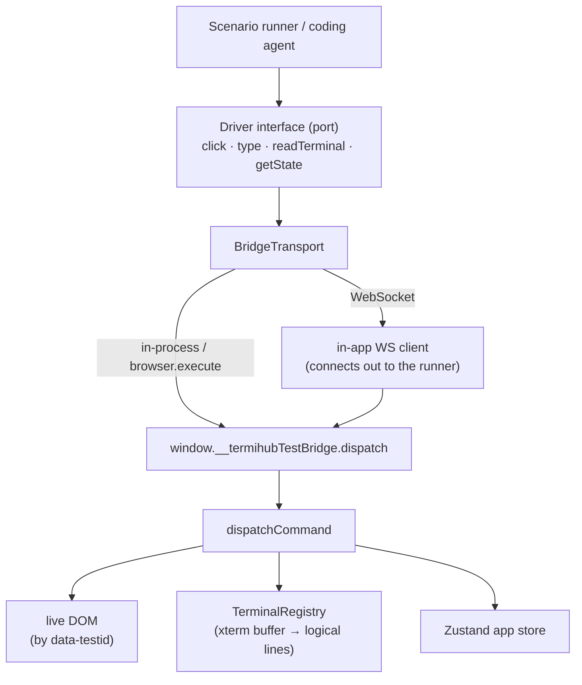
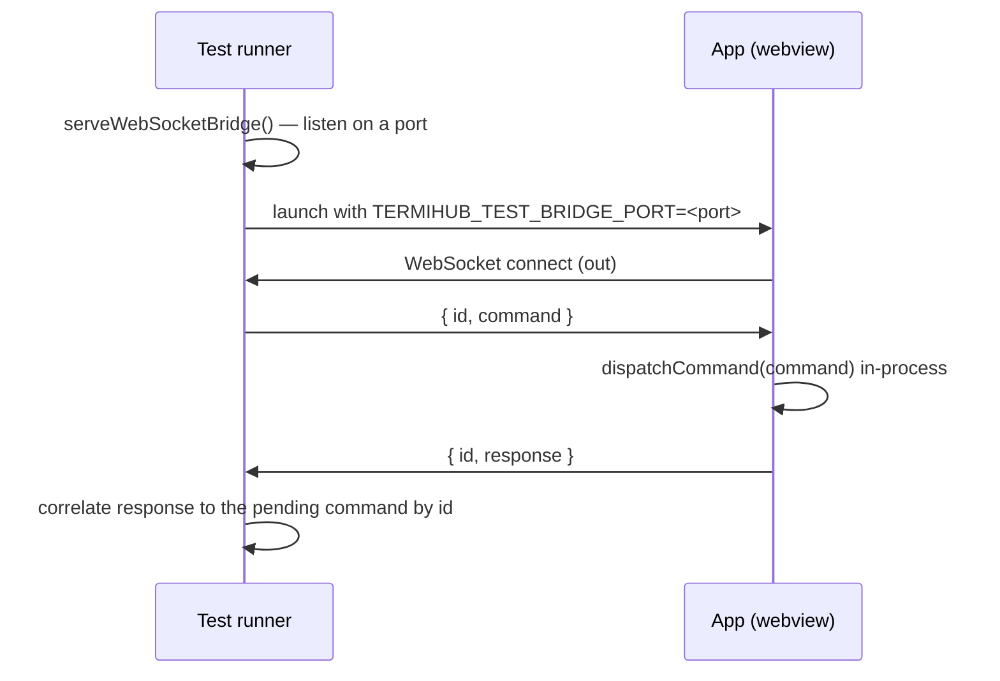

# In-App UI Test Bridge

The in-app test bridge drives and introspects the running termiHub UI **from
inside the webview**. Unlike WebDriver, it has no dependency on a platform
automation driver, so it works identically on **every platform — including
macOS**, where no WKWebView WebDriver exists (the `tauri-driver` E2E path is
Linux/Windows only; see ADR-5 in [architecture.md](architecture.md)).

It is the foundation for an AI-assisted development feedback loop: a human (or a
coding agent) writes a sequence of UI actions plus checks against displayed
terminal text and app state, and gets a structured pass/fail result back.

## Why not just WebDriver?

WebDriver automation needs a platform-specific driver that attaches to the
rendering engine:

| Platform | WebView       | WebDriver         | Status |
| -------- | ------------- | ----------------- | ------ |
| Linux    | WebKitGTK     | `WebKitWebDriver` | ✅     |
| Windows  | Edge WebView2 | `msedgedriver`    | ✅     |
| macOS    | WKWebView     | _none_            | ❌     |

`tauri-driver` is a proxy to whichever of those exists; on macOS there is nothing
to proxy to. The in-app bridge sidesteps this entirely by exposing the control
surface **inside the app** — the same idea as Qt's in-process test interfaces.

## Architecture


```mermaid
flowchart TD
    R["Scenario runner / coding agent"] --> D["Driver interface (port)<br/>click · type · readTerminal · getState"]
    D --> T["BridgeTransport"]
    T -->|in-process / browser.execute| G["window.__termihubTestBridge.dispatch"]
    T -->|WebSocket| WSC["in-app WS client<br/>(connects out to the runner)"]
    WSC --> G
    G --> DP["dispatchCommand"]
    DP --> DOM["live DOM<br/>(by data-testid)"]
    DP --> REG["TerminalRegistry<br/>(xterm buffer → logical lines)"]
    DP --> ST["Zustand app store"]
```

The `Driver` never knows which transport is underneath, so the same test runs
in-process, through WebDriver `browser.execute`, or over a WebSocket to an
external test runner — the last of which works on **every** platform, including
headless macOS.

## Cross-platform WebSocket transport

The WebSocket transport is the one path that runs identically on Linux, Windows,
and macOS, because no platform automation driver is involved at all. The app is
the WebSocket **client** and the test runner is the **server**:


```mermaid
sequenceDiagram
    participant Runner as Test runner
    participant App as App (webview)
    Runner->>Runner: serveWebSocketBridge() — listen on a port
    Runner->>App: launch with TERMIHUB_TEST_BRIDGE_PORT=<port>
    App->>Runner: WebSocket connect (out)
    Runner->>App: { id, command }
    App->>App: dispatchCommand(command) in-process
    App->>Runner: { id, response }
    Runner->>Runner: correlate response to the pending command by id
```

Because several commands may be in flight at once, each message is wrapped in an
envelope carrying a monotonic `id` (`{ id, command }` / `{ id, response }`); the
runner's `WebSocketBridgeTransport` matches each response back to its pending
promise by `id`. Nothing new crosses the bridge semantically — only the bytes
travel over a socket — so the command vocabulary and `ok/error` contract are
unchanged.

```ts
import { serveWebSocketBridge } from "@/testbridge/wsServer";
import { InAppBridgeDriver } from "@/testbridge/driver";

const server = await serveWebSocketBridge(); // ephemeral port
// launch the app with TERMIHUB_TEST_BRIDGE_PORT=server.port …
const transport = await server.waitForApp(); // resolves once the app connects
const driver = new InAppBridgeDriver(transport.transport);

const output = await driver.readTerminal({ joinFullWidthRows: true });
await server.close();
```

### Sequential connections (kill/restart within one run)

A single runner session can drive **several app instances in sequence** — kill the
app, launch a fresh one, and keep driving — so system tests can assert restart and
recovery (issue #817). The server tracks a monotonic **connection generation** and
applies **last-writer-wins**: a newly connected app becomes the live one and
supersedes any predecessor, so exactly one app drives the run at a time and a
restarted app always re-acquires the bridge (even if its connection races the old
socket's close). Both the TS `wsServer.ts` and the Python harness (#802) expose
this same contract:

| Call             | Resolves with                                                                                                                                                |
| ---------------- | ------------------------------------------------------------------------------------------------------------------------------------------------------------ |
| `waitForApp()`   | The current app's transport; once it disconnects, waits for the next to connect. Repeated calls return the same transport while one app stays connected.     |
| `awaitNextApp()` | A fresh transport for the **next** connection after the one last handed out — the restart seam. Resolves immediately if that connection has already arrived. |

```ts
const a = await server.waitForApp(); // drive instance A …
killApp(); // A's socket closes
const b = await server.awaitNextApp(); // launch + drive instance B over the same server
```

The in-app `wsClient` detaches all its socket listeners on `close()` (idempotently),
so a restarted app boots cleanly with no listeners leaked from a prior connection.

### Multi-window

Every native window of termiHub (#1900) is its own page, with its own store and
its own `TestBridge` — and so its own runner socket. The injected bridge globals
reach every window (the plugin init script runs in each webview), so each window
dials the runner, **tagged with its window label** in the URL query:

```text
ws://127.0.0.1:<port>/?window=main
ws://127.0.0.1:<port>/?window=win-1
```

The runner reads the label at the handshake, before any frame, so there is no
racy "hello" message and the `{ id, command }` / `{ id, response }` envelope is
unchanged (TIN-014, #3720). The rules are backward compatible:

- **Only the main window takes part in the connection-generation contract.**
  `waitForApp()` / `awaitNextApp()` (TS) and `wait_for_app()` (Python) only ever
  hand out a `main` connection, so single-window tests are unchanged — and a
  secondary window (opened by a test, or respawned by a windowed-layout restore
  at boot) can no longer supersede, or be mistaken for, the app. Before this, a
  second window's socket would have replaced the main one under last-writer-wins.
- **An untagged connection is the main window**, so an older app build still
  works with a newer runner.
- **A malformed label is refused** (the socket is closed with 1008) rather than
  guessed at. Labels use Tauri's label alphabet (`A–Z a–z 0–9 - / : _`, ≤128).

The Python `Driver` addresses windows by label:

| Call                                         | Does                                                                                            |
| -------------------------------------------- | ----------------------------------------------------------------------------------------------- |
| `driver.window_label`                        | The label of the window this driver drives (`main` for the suite's driver)                      |
| `driver.windows()`                           | Labels of every window with a live bridge connection, main first                                |
| `driver.window(label)`                       | A `Driver` for that window, waiting for it to connect; `window("main")` is `self`               |
| `driver.wait_for_window(predicate)`          | Wait for a window whose label matches (e.g. one not in an earlier `windows()` snapshot)         |
| `driver.wait_until_closed()`                 | Block until this window's socket closes (the window was destroyed)                              |
| `driver.close_window()`                      | The `closeWindow` verb — close this window through the OS close path                            |
| `driver.list_windows()`                      | The `listWindows` verb — the backend window registry                                            |
| `driver.read_coverage_chunk(offset)`         | The `readCoverage` verb — one chunk of this window's coverage (coverage builds)                 |
| `driver.exit_app()`                          | The `exitApp` verb — quit the app normally so coverage profiles are written                     |
| `driver.stub_native_dialog(kind, path=None)` | The `stubNativeDialog` verb — answer the next native open/save dialog with `path` (or a cancel) |

```python
before = self.driver.windows()                      # ["main"]
self.driver.press_key("N", "activity-bar-settings", ctrl=True, shift=True)
second = self.driver.wait_for_window(lambda label: label not in before)
second.get_state("windowLabel")                     # "win-1"
second.close_window()                               # empty → closes at once
second.wait_until_closed()
```

The TS server mirrors this with `server.windows()` and
`server.waitForWindow(label)`. The `WindowsUi` mixin
(`tests/system/termihub_harness/ui/windows.py`) wraps the journeys — open a
window, move a live tab into another window via the tab context menu, resolve the
close-with-live-tabs dialog — and `tests/system/tests/test_multi_window.py`
drives them in the nightly lane. Everything stays behind the same gates as the
rest of the bridge: the `test-bridge` cargo feature, the `VITE_TEST_BRIDGE=1`
build flag, and a loopback-only runner.

The backend enables test mode and supplies the port by injecting two globals into
the webview before any page script runs (a Tauri plugin `js_init_script`, only
registered when `TERMIHUB_TEST_BRIDGE_PORT` is set):
`window.__TERMIHUB_TEST_BRIDGE__ = true` and
`window.__TERMIHUB_TEST_BRIDGE_PORT__ = <port>`. The app's `TestBridge` then opens
the WebSocket client alongside the in-process bridge.

## Enabling test mode

> **Compiled out of release builds (SEC-005).** The entire bridge — the backend
> `utils::test_bridge` module, its CSP relaxation, and the frontend activation —
> is gated so it cannot ship in, or be switched on within, a release binary:
>
> - **Backend:** gated behind the non-default `test-bridge` cargo feature. A
>   release build compiles none of it, so `TERMIHUB_TEST_BRIDGE_PORT` is inert and
>   the CSP is never relaxed. Opt in for test builds with `--features test-bridge`.
> - **Frontend:** in a production build the runtime signals below are ignored
>   unless the build was compiled with `VITE_TEST_BRIDGE=1`.
>
> Any hand-built test app therefore needs **both**:
> `VITE_TEST_BRIDGE=1 pnpm tauri build --features test-bridge` (plus the usual
> `--features mock-remote-desktop`). No `--config` CSP overlay is needed: the
> bridge widens `connect-src` itself at startup (#3628).
> `scripts/internal/build-system-test-app.sh` is the one place this recipe lives;
> `./scripts/test-system-py.sh` and the nightly `system-integration.yml` both call
> it (#3664). The harness also refuses a bridgeless binary up front: the Rust
> `TEST_BRIDGE_BUILD_MARKER` is only compiled into a `test-bridge` build, and
> the harness scans the binary for it before launch.

With the bridge compiled in, it is **inert and uninstalled** in normal use. It
activates only when one of these explicit opt-in signals is present:

- build flag `VITE_TEST_BRIDGE=1`,
- a `?testBridge=1` query parameter,
- `localStorage["termihub.testBridge"] === "1"`,
- a truthy `window.__TERMIHUB_TEST_BRIDGE__` global (e.g. injected by the backend
  in a test build before the app boots).

When active, `TestBridge` (mounted in `TerminalView`, inside
`TerminalPortalProvider`) installs `window.__termihubTestBridge` and removes it on
unmount.

## Command vocabulary

| Action                     | Purpose                                                        |
| -------------------------- | -------------------------------------------------------------- |
| `click`                    | Press the element (full pointer sequence, so Radix menus open) |
| `doubleClick`              | Double-click to "activate" (open connection / dir / file)      |
| `type`                     | Set an input/textarea value (native setter + `input` event)    |
| `select`                   | Choose a native `<select>` option (native setter + `change`)   |
| `contextMenu`              | Open an element's right-click menu (`contextmenu` event)       |
| `resizeWindow`             | Resize the app window (Tauri `setSize` → xterm fit → PTY size) |
| `pressKey`                 | Dispatch a key + optional modifiers (`Ctrl+S`, `ArrowDown`)    |
| `editorCursor`             | Move the file editor's caret via Monaco's cursor command API   |
| `terminalInput`            | Send a command into a terminal **session** (see below)         |
| `scrollTerminal`           | Scroll a terminal's viewport by lines / to the bottom          |
| `drag`                     | Drag an element by a pixel delta (resize handles)              |
| `dragTo`                   | Drag one element onto another (pointer-based, e.g. @dnd-kit)   |
| `exists`                   | Whether an element is present                                  |
| `getText`                  | Read an element's visible text                                 |
| `getAttribute`             | Read an element's markup attribute                             |
| `getValue`                 | Read the live `value` of an `<input>`/`<textarea>`/`<select>`  |
| `getComputedStyle`         | Read a _computed_ CSS property — incl. theme custom properties |
| `readTerminal`             | Read a terminal's reconstructed logical-line text              |
| `getTerminalViewport`      | Read a terminal's `{ viewportY, baseY }` scroll position       |
| `inspectTerminal`          | Read a terminal's OSC 133 marks and inline-image store         |
| `measureTerminal`          | Read a terminal's real fit, cell size, renderer and thumb      |
| `readTerminalCells`        | Read xterm's buffer cells: characters and column width         |
| `compose`                  | Test-only: replay an IME composition on a control (see below)  |
| `loseTerminalWebglContext` | Test-only: force a WebGL context loss (see below)              |
| `sampleCanvas`             | Read RGBA pixels of a `<canvas>` (remote-desktop frames)       |
| `getState`                 | Read app store state, optionally by dot-path                   |
| `screenshot`               | Capture a PNG of the rendered app as a data URL (see below)    |
| `emitEvent`                | Inject a Tauri event to drive event-only UI (see below)        |
| `severAgentTransport`      | Test-only: sever a connected agent's transport (see below)     |
| `closeWindow`              | Close this window through the OS close path (see below)        |
| `listWindows`              | Read the backend window registry (`[{ label, tabCount? }]`)    |
| `readCoverage`             | Read a chunk of `window.__coverage__` (coverage builds only)   |
| `exitApp`                  | Test-only: quit the app normally (coverage profiles, below)    |
| `stubNativeDialog`         | Test-only: answer the next native open/save dialog (below)     |

Every command returns a structured `BridgeResponse` (`{ ok, action, value?,
error? }`). Nothing throws across the bridge — failures are `ok: false` with an
agent-readable `error` — so a runner branches on results instead of catching.

**Adding a command** means touching every place the vocabulary is declared: the
`BridgeCommand` union (`src/testbridge/protocol.ts`), the dispatcher switch, the
Python mirror `BRIDGE_ACTIONS` (`tests/system/termihub_harness/protocol.py`), a
Driver verb in `bridge.py`, and the fake app (`tests/system/tests/fake_app.py` —
fake it, or list it in `UNHANDLED_ACTIONS`). The per-PR machinery suite's
`test_bridge_protocol_contract.py` fails on drift between them in either
direction (MOCK-010).

### Writing into a terminal (`terminalInput`)

`type` targets `<input>`/`<textarea>` elements, but an xterm terminal renders to
a **canvas**, not a form field — so `type` cannot drive a shell. `terminalInput`
fills that gap: `{ action: "terminalInput", text, tabId? }` routes `text` to the
session's backend `send_input` — the **same choke point** interactive keystrokes
and paste use — rather than synthesizing canvas key events. When `tabId` is
omitted the active terminal tab is used.

A **trailing newline is appended for you**, and the backend normalizes it to the
session's configured line ending, exactly like pressing Enter. So
`terminalInput("ls")` runs `ls`. This "honor the session line ending" ergonomics
choice mirrors interactive input and the workspace `initialCommand` path; callers
pass the command, not the newline.

```ts
await driver.terminalInput("echo HELLO_MARKER"); // runs in the active terminal
const output = await driver.readTerminal();
output.includes("HELLO_MARKER"); // assert on the result
```

### Double-clicking (`doubleClick`)

`click` fires a single click, but several "activate" gestures are bound to
`onDoubleClick`: opening a connection's session from the sidebar, entering a
directory in the file browser, and opening a file in the editor. `{ action:
"doubleClick", testId }` fires **two full click sequences followed by a
`dblclick`** event — what a real double-click produces — so React's
`onDoubleClick` handler runs (a bare `element.click()` never emits a `dblclick`).

```ts
await driver.doubleClick("connection-item-<id>"); // open the connection's session
await driver.doubleClick("file-row-src"); // enter the src/ directory
```

### Terminal scrolling (`scrollTerminal`, `getTerminalViewport`)

An xterm terminal renders to a **canvas** with no scrollable DOM box, so neither
`click` nor a synthetic wheel event reliably moves its viewport — and its scroll
position is not in the DOM to read back. These two verbs drive and observe scroll
through xterm's own API so a test can assert the **auto-scroll** behavior (#504:
new output must not yank a user who has scrolled up back to the bottom):

- `{ action: "scrollTerminal", lines?, toBottom?, tabId? }` calls
  `xterm.scrollLines(lines)` (signed — negative scrolls up into the scrollback) or
  `xterm.scrollToBottom()` when `toBottom` is set. Either way it fires the **same
  `onScroll` event a mouse wheel would**, which is exactly what the terminal's
  auto-scroll guard keys off — so the gesture exercises production code, not a
  test-only path.
- `{ action: "getTerminalViewport", tabId? }` returns `{ viewportY, baseY }` from
  `xterm.buffer.active`. `viewportY < baseY` means scrolled up into the scrollback
  (auto-scroll suppressed); `viewportY === baseY` means pinned to the bottom.

Both default to the active terminal tab and fail (`ok: false`) when no terminal
is registered for the tab.

```ts
await driver.scrollTerminal({ lines: -100 }); // scroll up 100 lines
const before = await driver.getTerminalViewport(); // { viewportY < baseY }
await driver.terminalInput("seq 1 100"); // more output arrives…
const after = await driver.getTerminalViewport(); // …viewportY stays put
await driver.scrollTerminal({ toBottom: true }); // re-arm auto-scroll
```

The scenario runner (#800) exposes these as the `scrollTerminal` step and the
`terminalAtBottom` check (`{ assert: "terminalAtBottom", atBottom?, tolerance? }`).

### Command marks and inline images (`inspectTerminal`)

Two pieces of terminal state never reach the reconstructed text: the **OSC 133
command marks** (#3415) a shell with termiHub's shell integration emits around
every command, and the **inline images** (SIXEL / iTerm2, PROD-057) the image
addon stores beside the text buffer. `{ action: "inspectTerminal", tabId? }`
returns both (#4013):

```jsonc
{
  "commandMarks": {
    "commands": [{ "state": "finished", "exitCode": 0 }], // oldest first
    "lastCommandOutput": "1\n2\n3", // what "Copy Last Command Output" copies
  },
  "inlineImages": { "active": true, "storageUsage": 0.0001 }, // MB stored
}
```

`commands` is empty when the shell emits no marks (e.g. `sh`); `exitCode` is
`null` when unknown or still running. `inlineImages.active` is `false` with the
Inline Images setting off, and `storageUsage` is above `0` once an image was
stored. Either part is `null` when the tab has no tracker / image controller.
It defaults to the active terminal tab and fails when no terminal is registered
for the tab. Python: `driver.inspect_terminal(tab_id=None)`.

### Render-path measurements (`measureTerminal`, `loseTerminalWebglContext`)

jsdom has no layout engine and no canvas, so the measured and painted half of
xterm — what `FitAddon.proposeDimensions()` proposes, the renderer's sub-pixel
cell width, the WebGL canvas, the rows the DOM renderer paints, and the gutter
scrollbar's thumb against a laid-out track — only exists in a real WebView.
`{ action: "measureTerminal", tabId? }` reads all of it (#2988, read-only):

```jsonc
{
  "grid": { "cols": 120, "rows": 40 }, // xterm (and PTY) size
  "proposed": { "cols": 120, "rows": 40 }, // null when FitAddon cannot measure
  "cell": { "width": 7.83, "height": 17 }, // renderer's CSS cell px
  "container": { "width": 960, "height": 690 },
  "renderer": "webgl", // or "dom"
  "webglCanvas": { "width": 1880, "height": 1360 }, // null on the DOM renderer
  "domRows": null, // painted row text on the DOM renderer
  "scrollbar": { "trackHeight": 690, "thumbVisible": true, "thumbHeight": 98, "thumbTop": 592 },
  "viewportY": 260,
  "baseY": 260,
}
```

`{ action: "loseTerminalWebglContext", tabId? }` loses the WebGL renderer's
context through `WEBGL_lose_context` — the same `webglcontextlost` path a GPU
driver reset takes — so the production fallback to the DOM renderer runs about
three seconds later (xterm waits for a restore first). It answers `false` when
the terminal has no live WebGL context. Both default to the active terminal tab
and fail when no terminal is registered for it. Python:
`driver.measure_terminal(tab_id=None)` and
`driver.lose_terminal_webgl_context(tab_id=None)`; the suite is
`tests/system/tests/test_xterm_render_paths.py`.

### Glyph cells and IME composition (`readTerminalCells`, `compose`)

`readTerminal` returns text, which cannot tell a CJK character stored as one
wide cell from two narrow ones, or a combining mark attached to its base from
one in a cell of its own. `{ action: "readTerminalCells", tabId?, contains? }`
reads xterm's buffer cell model (#3059, read-only): every buffer row whose text
contains `contains` (scrollback too), or the visible viewport rows without it.

```jsonc
[
  {
    "y": 12, // absolute buffer line
    "text": "日e\u0301",
    "cells": [
      { "x": 0, "chars": "日", "width": 2 }, // wide character head
      { "x": 1, "chars": "", "width": 0 }, // its spacer cell
      { "x": 2, "chars": "e\u0301", "width": 1 }, // base + attached mark
    ],
  },
]
```

`{ action: "compose", testId?, tabId?, updates, commit }` replays an input
method's DOM sequence on a control: `keydown` 229, `compositionstart`, then per
preedit in `updates` a `compositionupdate` and `input`, and finally the commit's
`input` and `compositionend` — updating the control's value in place as an IME
does, because xterm and Monaco read the value, not just `event.data`. The
target is the input or textarea tagged `testId` (Monaco's `editor-input`), else
the input textarea of the terminal in `tabId` (the active tab). It proves the
commit arrives once; the native preedit and candidate window are not involved
and stay manual (MT-NIN-10 … 14). Python: `driver.read_terminal_cells(contains,
tab_id=None)` and `driver.compose(updates, commit, test_id=None, tab_id=None)`;
the suites are `tests/system/tests/test_terminal_glyph_shaping.py` and
`tests/system/tests/test_ime_composition.py`.

### Canvas pixels (`sampleCanvas`)

A graphical remote-desktop tab (VNC/RDP) paints the remote framebuffer into a
`<canvas>`, so no DOM verb can tell whether a frame actually reached the screen,
and the `screenshot` DOM rasterizer does not capture canvas content reliably.
`{ action: "sampleCanvas", testId, points? }` reads `getImageData` at each
integer `{ x, y }` of the canvas's **backing store** and returns
`{ width, height, pixels }`, with one `[r, g, b, a]` per point in request order.
With no points it returns only the size. It fails (`ok: false`) for a missing
element, a non-canvas element, a canvas without a 2D context, or a point that is
fractional or outside the canvas. Like the other query verbs it only reads the
DOM.

The VNC suite (`tests/system/tests/test_vnc.py`, TIN-006) uses it to check that
each quadrant of the fixture's test pattern shows the server's colour. It maps
framebuffer points to canvas pixels with the same Fit / Match / 1:1 geometry the
canvas draws with (`termihub_harness/ui/remote_desktop.py`).

```python
sample = driver.sample_canvas("remote-desktop-canvas", [(120, 80)])
sample["pixels"][0]  # [255, 0, 0, 255] — the red top-left quadrant
```

### Keyboard chords (`pressKey` modifiers)

`pressKey` takes optional `ctrl` / `meta` / `shift` / `alt` flags for chords like
`Ctrl+S` or `Ctrl+End`. Crucially, the dispatched event also carries a real legacy
**`keyCode`** (the deprecated numeric, set via `Object.defineProperty` since it is
read-only and absent from `KeyboardEventInit`): a synthetic event leaves it `0`,
and Monaco's `StandardKeyboardEvent` reads `e.keyCode` to resolve keybindings — so
without it, `Ctrl+S` would resolve to `Unknown` and do nothing. With it, keybinding
-driven editors respond as they do to real input. This is what lets a test target
Monaco's hidden input (tagged `editor-input` by `FileEditor`) to drive the **Save
keybinding** (`Cmd+S`/`Ctrl+S` clears the dirty flag).

```ts
await driver.pressKey("s", "editor-input", { meta: true }); // Cmd+S → save
```

### Moving the editor caret (`editorCursor`)

Cursor navigation does **not** go through `pressKey`. A synthetic arrow keydown
only moves Monaco's caret when its `textInputFocus` context key is set, which
needs the hidden input genuinely focused — and an occluded/headless CI webview
(ubuntu/macOS) cannot guarantee that focus, so the keydown fired but the caret
never moved (the deterministic #2694 failure that survived three key/focus/input
-mode fixes). Instead, `editorCursor` invokes Monaco's core cursor command
(`cursorUp`/`cursorDown`/…) directly through the store's `editorActions.moveCursor`
— no keybinding resolution, no focus precondition — while still firing
`onDidChangeCursorPosition` → `editorStatus` (Ln/Col) exactly as a real arrow key
would, which is the app wiring the test actually asserts.

```ts
await driver.editorCursor("down", { times: 2 }); // caret to line 3; Ln/Col updates
```

### Dragging (`drag`) and computed styles (`getComputedStyle`)

`click` cannot drive drag-to-resize handles or pointer reordering, and
`getAttribute` only sees markup attributes — not the _effective_ `cursor`, a
theme color, or a CSS variable resolved from a stylesheet. Two verbs close those
gaps:

- `{ action: "drag", testId, dx, dy? }` presses on the element's center, then
  moves and releases on the document offset by `(dx, dy)`. Each step fires the
  pointer event (`pointerdown`/`pointermove`/`pointerup`, with the button held on
  the move) followed by its compatibility mouse event, as a real browser does —
  so both mouse-based handlers like `useSidebarResize` and the pointer-based
  split separators (react-resizable-panels, `split-view-resize-handle-<panelId>`)
  respond. Only the delta matters, so absolute coordinates need not be known.
- `{ action: "getComputedStyle", testId?, property }` returns
  `getComputedStyle(el).getPropertyValue(property).trim()`. Omit `testId` to read
  the document root (`:root`), where theme custom properties like `--bg-primary`
  are defined.

```ts
// Widen the sidebar and confirm the handle advertises a resize cursor.
await driver.drag("sidebar-resize-handle", 100);
await driver.getComputedStyle("cursor", { testId: "sidebar-resize-handle" }); // "col-resize"
await driver.getComputedStyle("--bg-primary"); // active theme background
```

### Screenshots (`screenshot`)

`getComputedStyle` proves an individual style resolves, but some carve-outs need
to _see_ the rendered result (overall pixel geometry, theme rendering). The
`screenshot` verb rasterizes the live DOM to a PNG and returns it as a
`data:image/png;base64,…` URL:

- `{ action: "screenshot" }` → `value` is the PNG data URL. The live bridge
  lazy-imports [`html-to-image`](https://github.com/bubkoo/html-to-image) (a
  test-mode-only chunk, kept out of the normal bundle) and rasterizes
  `document.body`; unit tests inject a stub via the `screenshot` dep.
- **Limitation:** DOM rasterization does **not** capture the xterm GPU canvas or
  native OS dialogs — read terminal text via `readTerminal` instead. A native
  window-capture backend could lift this in future.

```ts
const dataUrl = await driver.screenshot(); // "data:image/png;base64,…"
```

The Python harness exposes the same verb (`driver.screenshot()`), and the
failure-artifact bundle writes a `screenshot.png` alongside `state.json` /
`terminal.txt` whenever the app supports the verb — visual evidence of the moment
a test failed. Decode the data URL with `screenshot_to_png_bytes`.

It fails (`ok: false`) when there is no active terminal, or when the target tab
has no backend session bound (e.g. the shell has exited).

### Injecting backend events (`emitEvent`)

Every other verb drives the UI from the _outside_ — DOM events, terminal input.
That leaves a gap: UI reachable **only** via a backend-originated event cannot be
surfaced at all. The motivating case (#1520) is the deferred-update banner, which
renders from the `agentUpdates` store slice fed exclusively by the
`agent-update-available` event an agent's 24h update timer raises. It is not
replayed on attach, so no amount of clicking brings it up.

`emitEvent` dispatches through the same Tauri event bus the backend emits on, so
the app's real `listen` subscriptions and store-folding hooks run untouched — the
test injects the **stimulus**, not the state. Prefer it over writing the store
directly: the app's own event handling stays covered.

- `{ action: "emitEvent", event, payload? }` → `ok: true` once dispatched. An
  empty `event` fails fast (`ok: false`) rather than surfacing an opaque plugin
  error from the bus. Omit `payload` for a payload-less event.
- Payload keys must match the event's wire shape — the backend's
  `snake_case`/`camelCase` mix is deliberate, so copy it from the emitter.

```ts
await driver.emitEvent("agent-update-available", {
  agent_id: agentId,
  currentVersion: "0.1.0",
  availableVersion: "0.2.0",
  staged: true,
});
```

The Python harness exposes the same verb as `driver.emit_event(event, payload=None)`.

**Test-mode gating.** This is the bridge's only non-DOM injector — the one verb
whose blast radius reaches the backend — so it is gated twice: the bridge as a
whole is installed only under the opt-in signals above, and the live `TestBridge`
**re-checks `isTestBridgeEnabled()` at the call site** before touching the bus.
The guarantee "inert outside the harness" then holds locally, independent of how
the deps object was obtained. Unit tests inject a stub via the `emitEvent` dep.

### Severing an agent transport (`severAgentTransport`)

The bridge has no generic "invoke a Tauri command" verb by design. The one
test-only command the automated **agent-reconnect UI grade** (#2574) needs — a
deterministic, in-process transport sever (#2573) — is therefore exposed as its
own named verb, mirroring `emitEvent` as the only other verb whose blast radius
reaches the backend.

`severAgentTransport` drives the automated reconnect grade
([`tests/system/tests/test_agent_reconnect_ui.py`](../tests/system/tests/test_agent_reconnect_ui.py)):
it drops a connected agent's russh transport in-process so the peer sees an
abrupt EOF/RST — a faithful analog of a real transport loss — while the agent's
I/O task stays alive and takes the reconnect path (unlike a clean
`disconnect_agent`, which is a user-cancel). This replaces the retired
`lsof`/process-title shell drop, which false-passed.

- `{ action: "severAgentTransport", agentId }` → `ok: true`, `value: true` when a
  live agent received the sever, `value: false` for an unknown/dead agent. An
  empty `agentId` fails fast (`ok: false`).

```ts
const severed = await driver.severAgentTransport(agentId); // boolean
```

The Python harness exposes it as `driver.sever_agent_transport(agent_id)`.

**Test-mode gating (doubly).** Like `emitEvent`, the live `TestBridge` re-checks
`isTestBridgeEnabled()` at the call site before invoking. The underlying
`test_sever_agent_transport` Tauri command **also** refuses unless the test bridge
is enabled (`TERMIHUB_TEST_BRIDGE_PORT` set), so a production launch can never
reach the sever. Unit tests inject a stub via the `severAgentTransport` dep.

### Closing a window (`closeWindow`) and listing windows (`listWindows`)

A native window's close has no DOM control, so the close-with-live-tabs decision
(#1903) and the per-OS quit policy were unreachable from the DOM verbs.

- `{ action: "closeWindow" }` calls Tauri's `getCurrentWindow().close()` on the
  window whose bridge received it. That emits the same `close-requested` event
  the title-bar button does, so the app's own interceptor decides: an empty or
  all-persistent window is destroyed, a window that would lose a live session
  raises the "Close this window?" dialog. The bridge never force-destroys. The
  close is **deferred** (~50 ms) until after the `ok` response is sent — a window
  that closes at once would otherwise tear its socket down before replying.
- `{ action: "listWindows" }` returns the backend window registry
  (`list_windows`, #1900) — the authoritative set of native windows, including
  one whose page has not connected to the runner yet.

Like `emitEvent`, `closeWindow` acts past the DOM, so the live `TestBridge`
re-checks `isTestBridgeEnabled()` at the call site. Unit tests inject stubs via
the `closeWindow` / `listWindows` deps.

### Stubbing native file dialogs (`stubNativeDialog`)

A native OS open/save dialog is not part of the webview, so no DOM verb can pick
a file in it. Instead the harness pre-programs the dialog's result (#4122):

- `{ action: "stubNativeDialog", kind: "open" | "save", path? }` makes the next
  `open` / `save` from [`src/services/nativeDialog.ts`](../src/services/nativeDialog.ts)
  return `path` without showing a dialog. An absent `path` is a cancel (`null`).
  A folder picker is an `open` dialog. One stub per kind is pending at a time; a
  newer one replaces it, and each is used once.
- For a path, the live `TestBridge` first calls the test-bridge-only
  `test_allow_dialog_path` Tauri command. A real pick adds the chosen path to the
  fs plugin's scope, and the stub has to do the same, or the app's following
  `writeTextFile` / `readTextFile` is refused. An existing directory is granted
  recursively; anything else (including a save target that does not exist yet)
  as a single file. The path must be absolute.

```python
target = tmp_dir / "connections-export.json"
self.driver.stub_native_dialog("save", target)   # before the click
self.driver.click("export-submit")               # the dialog "returns" target
```

Every dialog call site imports `open` / `save` from `@/services/nativeDialog`;
an ESLint rule rejects importing them from `@tauri-apps/plugin-dialog` anywhere
else, so a new dialog cannot bypass the seam. `window.__TAURI_INTERNALS__.invoke`
cannot be wrapped instead: Tauri defines it non-writable and non-configurable.

**Gating.** A stub is honoured only while `isTestBridgeEnabled()` is true, which a
production build without `VITE_TEST_BRIDGE=1` can never be. `test_allow_dialog_path`
is compiled only with the `test-bridge` cargo feature and refuses unless the test
bridge is enabled at runtime. `scripts/internal/assert-no-test-bridge.sh` fails
when a release binary carries the test-bridge build marker, and runs on every
release build. The stubbed suite is
[`tests/system/tests/test_native_dialogs.py`](../tests/system/tests/test_native_dialogs.py).

### Coverage collection (`readCoverage`, `exitApp`)

The harness uses these two verbs to collect coverage from an instrumented test
build (#3657). See [testing.md → Harness coverage](testing.md#harness-coverage-nightly-bridge-harness-lane).

- `{ action: "readCoverage", offset?: n }` returns one chunk of the page's
  Istanbul coverage as `{ total, offset, chunk }`. The value is `null` when the
  build is not instrumented (no `window.__coverage__`). `offset: 0` (or no offset)
  serializes a fresh snapshot, and later offsets page through that same snapshot
  in 4 MiB chunks, well under the runner's frame limit. The harness helper is
  `termihub_harness.coverage.read_frontend_coverage(driver)`.
- `{ action: "exitApp" }` quits the whole app through the test-bridge-only
  `test_exit_app` Tauri command (`AppHandle::exit(0)`), so an LLVM-instrumented
  app writes its `.profraw`. The harness normally kills the app, and a killed
  process writes no profile. Like `closeWindow` the exit is deferred until after
  the response is sent, and both the `TestBridge` wiring and the Rust command
  refuse unless the test bridge is enabled. The command is compiled out of
  release builds with the rest of the `test-bridge` feature.

### Element-to-element drag (`dragTo`) and @dnd-kit

`drag` moves by a blind pixel delta (resize handles); `dragTo` drags one element
onto another and is the verb for **@dnd-kit** reordering (tabs use
`useSortable` + a `PointerSensor`). Driving @dnd-kit with synthetic events has
two requirements that a naive "fire pointerdown → moves → pointerup in one go"
does not meet, so `dragTo` handles both:

- **Activation distance** — the `PointerSensor` ignores a press until a
  `pointermove` travels past its activation distance (5px for tabs). `dragTo`
  begins with a short **wake move** that clears it before stepping to the target.
- **Measurement timing** — on activation, `DndContext` measures droppable rects
  in a React render/effect cycle, and the drop target (`over`) is recomputed from
  those rects. If every pointer event fires in one synchronous task, that cycle
  never runs: collision detection sees no rects, `over` stays `null`, and the
  drop reorders nothing. `dragTo` therefore **yields a frame** after the wake
  move and **between each step**, so dnd-kit activates, measures, and resolves
  the target before `pointerup`.

```ts
const [first, , last] = (await driver.getState("rootPanel")).tabs.map((t) => t.id);
await driver.dragTo(`tab-${last}`, `tab-${first}`); // reorder: last → first slot
```

Because `dragTo` awaits real frames, it is async like every command; assert the
result from state (e.g. `rootPanel` tab order) rather than scraping the DOM. It
still injects **synthetic** events — it exercises dnd-kit's app logic, not the
native OS drag pipeline (see [Not covered](#not-covered)).

- **Drag-only drop targets** — some droppables mount _only while a drag is
  active_, so they cannot be resolved before `pointerdown`. The `PanelDropZone`
  edge/center overlays (`panel-drop-edge-<panelId>-<edge>`,
  `panel-drop-center-<panelId>`, #2583) are the case: they render only when a tab
  drag is in progress. When `toTestId` is absent up front, `dragTo` presses on the
  source and fires the wake move first — which activates the drag and mounts the
  zones — then resolves the target and steps to it. So dragging a `tab-<id>` onto a
  `panel-drop-edge-<panelId>-<edge>` zone splits that panel, and onto a
  `panel-drop-center-<panelId>` zone moves the tab into it — exactly as a real
  edge/center drop would.

- **Post-drag settle** — on `pointerup` dnd-kit's `PointerSensor.detach()` removes
  its document listeners on a `setTimeout(…, 50)`, and one of them is a
  capture-phase `click` listener (installed on activation) that `stopPropagation`s
  every click. So a `click` verb fired within ~50 ms of a drop is **swallowed** —
  the drop itself lands, but the immediate follow-up click does nothing (the #2609
  flake: clicking the tab-group chip a tab was just dropped onto never activated
  it). `dragTo` therefore waits past that teardown window before resolving, so a
  click (or any verb) issued right after a drag sees a settled DOM.

- **Target on top of the source** — when both endpoints are laid out and their
  centers coincide (a virtualized list mid-re-layout can briefly stack two rows),
  a wake "toward the target" has no direction: it used to be a zero move, so the
  sensor stayed pending and the release aborted the press without a drag, a drop
  or an error (#4110). `dragTo` now waits up to 30 frames for the two to separate,
  re-reads the press point, and otherwise wakes in a fixed direction. Each
  `dragTo` writes one durable `test_bridge` line to `termihub.log` with both
  rects, so a failure artifact shows where the bridge pressed and aimed. A drag
  of an element onto **itself** (`fromTestId === toTestId` — a folder dropped on
  its own row, the refused self-drop) skips that wait: it wakes in a fixed
  direction and comes back to release over the element.

- **Held modifiers** — `modifiers: { alt?, ctrl?, shift?, meta? }` holds those
  keys for the whole gesture: every pointer event from the press to the release
  carries the matching `*Key` flag, as a real held key would. The file browser
  reads `altKey` off the drag's pointer events, so `{ alt: true }` turns a
  drag-to-move into a copy (PROD-006). Python: `driver.drag_to(a, b, alt=True)`.

- **Mid-drag observations** — the drop-target highlight and the floating drag
  chip exist only while the drag is held, so no verb issued after `dragTo` can
  see them. `observe: [testId, …]` snapshots those elements after the last move
  over the target (one frame later) and before the release, and the response
  `value` is `{ [testId]: { exists, text, attributes } }`. File-browser rows
  carry `data-drop-highlight="valid" | "invalid"` on their own `file-row-<name>`
  testid, and each breadcrumb segment is `file-browser-crumb-<label>`:

  ```python
  seen = driver.drag_to("file-row-a.txt", "file-row-docs",
                        observe=["file-row-docs", "file-browser-drag-chip"])
  assert seen["file-row-docs"]["attributes"]["data-drop-highlight"] == "valid"
  assert seen["file-browser-drag-chip"]["text"] == 'Move "a.txt"'
  ```

### Reading form values (`getValue` vs `getAttribute`)

A React-**controlled** `<input>`/`<select>` updates the DOM _property_ `.value`,
not the markup `value` _attribute_. So `getAttribute("field-port", "value")`
reads the stale initial value (or `null`), while `getValue` reads what the
user/code actually set — the assertion you almost always want for form fields:

- `{ action: "getValue", testId }` returns `el.value` for `<input>`,
  `<textarea>`, and `<select>`. It fails (`ok: false`) for any other element or
  a missing testid.

```ts
await driver.getValue("field-port"); // "22" — the live, controlled value
```

The scenario runner exposes this as the `valueEquals` check
(`{ assert: "valueEquals", testId, value }`), alongside `textEquals`.

## Programmatic use

```ts
import { InAppBridgeDriver } from "@/testbridge/driver";

const driver = new InAppBridgeDriver(); // defaults to the in-process transport

await driver.click("connection-item-abc");
await driver.type("connection-editor-name-input", "prod-box");
await driver.click("connection-editor-save");

const output = await driver.readTerminal({ joinFullWidthRows: true });
if (!output.includes("HELLO_MARKER")) {
  // ...the checker reports failure with the actual terminal text
}
```

From a WebdriverIO test, the same `dispatch` is reachable through the page realm:

```js
const res = await browser.execute((cmd) => window.__termihubTestBridge?.dispatch(cmd), {
  action: "readTerminal",
  joinFullWidthRows: true,
});
```

## Authoring scenarios

For test authors (and coding agents), the ergonomic layer is the **declarative
scenario**: a sequence of UI actions followed by checks, run by `runScenario`,
which returns a structured `ScenarioResult` instead of throwing. `passed` is the
only field that must be checked; on failure each step/check carries detail and a
terminal snapshot is attached for diagnostics.

```ts
import { runScenario } from "@/testbridge/runner";
import { InAppBridgeDriver } from "@/testbridge/driver";

const result = await runScenario(
  {
    name: "Initial command runs on connect",
    requirement: "A connection's initial command is sent once the shell is ready.",
    steps: [
      { action: "click", testId: "connection-item-abc" },
      { action: "waitFor", testId: "tab-abc", timeoutMs: 5000 },
      { action: "pause", ms: 300 },
    ],
    checks: [
      { assert: "terminalContains", value: "HELLO_MARKER" },
      { assert: "stateEquals", path: "activePanelId", value: "panel-1" },
    ],
  },
  new InAppBridgeDriver()
);

if (!result.passed) {
  // result.requirement, result.checks[*].expected/actual, result.terminalSnapshot
}
```

### Steps

| Step                                                               | Effect                                            |
| ------------------------------------------------------------------ | ------------------------------------------------- |
| `{ action: "click", testId }`                                      | Press the control                                 |
| `{ action: "doubleClick", testId }`                                | Double-click to activate (open conn / dir / file) |
| `{ action: "resizeWindow", width, height }`                        | Resize the app window (logical px) via Tauri      |
| `{ action: "type", testId, text }`                                 | Set an input/textarea value                       |
| `{ action: "select", testId, value }`                              | Choose a native `<select>` option                 |
| `{ action: "contextMenu", testId }`                                | Open the element's right-click context menu       |
| `{ action: "pressKey", key, testId?, ctrl?, meta?, shift?, alt? }` | Dispatch a key + optional modifiers               |
| `{ action: "drag", testId, dx, dy? }`                              | Drag an element by a pixel delta                  |
| `{ action: "dragTo", fromTestId, toTestId, modifiers?, observe? }` | Drag one element onto another                     |
| `{ action: "terminalInput", text, tabId? }`                        | Send a command into a terminal session            |
| `{ action: "scrollTerminal", lines?, toBottom?, tabId? }`          | Scroll a terminal's viewport (lines / to bottom)  |
| `{ action: "waitFor", testId, timeoutMs?, intervalMs? }`           | Poll until the element exists, or fail on timeout |
| `{ action: "pause", ms }`                                          | Wait a fixed duration for output to settle        |

The first failing step aborts the rest (steps are sequential preconditions) and
the checks are skipped.

### Checker catalog

| Check                                                           | Passes when                                                  |
| --------------------------------------------------------------- | ------------------------------------------------------------ |
| `{ assert: "terminalContains", value, tabId? }`                 | The terminal text contains `value`                           |
| `{ assert: "terminalMatches", pattern, flags?, tabId? }`        | The terminal text matches the regex                          |
| `{ assert: "textEquals", testId, value }`                       | The element's visible text equals `value`                    |
| `{ assert: "exists", testId, present? }`                        | The element is present (or absent if `present: false`)       |
| `{ assert: "computedStyleEquals", property, value, testId? }`   | A computed CSS property equals `value` (root if no `testId`) |
| `{ assert: "terminalAtBottom", atBottom?, tolerance?, tabId? }` | The terminal is pinned to the bottom (auto-scroll active)    |
| `{ assert: "stateEquals", path, value }`                        | The app-state value at dot-`path` deep-equals `value`        |

When all steps succeed, **every** check is evaluated (even after one fails) so a
single run reports all assertions at once. A check that cannot be evaluated (e.g.
no terminal to read) is recorded with an `error` rather than throwing.

## Source layout

| File                            | Responsibility                                       |
| ------------------------------- | ---------------------------------------------------- |
| `src/testbridge/protocol.ts`    | Command + response types (the contract)              |
| `src/testbridge/dispatcher.ts`  | Pure, dependency-injected command executor           |
| `src/testbridge/testMode.ts`    | Opt-in detection                                     |
| `src/testbridge/TestBridge.tsx` | Live component that installs the window bridge       |
| `src/testbridge/driver.ts`      | `Driver` abstraction + `InAppBridgeDriver` adapter   |
| `src/testbridge/scenario.ts`    | Declarative scenario + result types                  |
| `src/testbridge/runner.ts`      | `runScenario` — runs scenarios, returns feedback     |
| `src/testbridge/wsProtocol.ts`  | `{ id, command/response }` envelope + window tagging |
| `src/testbridge/wsClient.ts`    | In-app WS client (connects out, dispatches, replies) |
| `src/testbridge/wsTransport.ts` | Runner-side `WebSocketBridgeTransport` (correlation) |
| `src/testbridge/wsServer.ts`    | `ws`-backed runner server (`serveWebSocketBridge`)   |

## Not covered

The bridge injects **synthetic** DOM events, so it faithfully tests app logic,
rendering, terminal I/O, and state — but **not** the native OS input pipeline
(native drag-and-drop coordinates, IME, real keyboard focus). The real-input
`tauri-driver` path that once ran on Linux/Windows was retired (#1027), so these
are gated by hand on every OS: the guided-manual `test_input_routing.py` suite
and the release-gating
[`tests/manual/native-input.yaml`](../tests/manual/native-input.yaml) matrix.
See [testing.md → Native input the bridge cannot drive](testing.md#native-input-the-bridge-cannot-drive-tin-017-3764)
for the coverage and why reviving `tauri-driver` would not close the gap.
