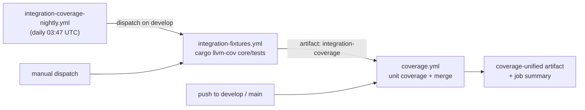
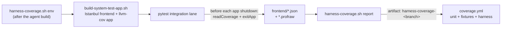

# Testing Strategy for termiHub

## Overview

termiHub uses a multi-layered testing approach to ensure quality across the entire stack.

## Testing Layers

```text
┌──────────────────────────────────────────┐
│   System / E2E Tests (Python bridge)      │  ← User flows, click automation
├──────────────────────────────────────────┤
│   Integration Tests (Rust + React)        │  ← Component + Backend integration
├──────────────────────────────────────────┤
│   Unit Tests                               │  ← Individual functions
│   - Rust (cargo test)                     │
│   - React (Vitest)                         │
└──────────────────────────────────────────┘
```

## 1. System / E2E Testing (Python bridge harness)

**What it does**: Automates complete user workflows by driving a built app over
the in-app test bridge (see [test-bridge.md](test-bridge.md)).
**Use for**:

- Creating terminal connections
- Opening multiple tabs
- Split view operations
- File browser / SFTP interactions
- Infrastructure coverage against Docker fixtures (SSH, telnet, serial, …)

The system/E2E layer is the **Python bridge harness** under `tests/system/`. It supersedes the retired WebdriverIO/`tauri-driver` suites: all previously-shipped wdio specs (UI, local, infrastructure, performance) were ported to it under epic #799, the last suite retired in #1015, and the empty scaffold (`wdio.conf.js`, `tests/e2e/`, the `@wdio/*` devDependencies) was removed in #1027. Unlike the old wdio path, the Python harness works on **macOS, Linux, and Windows** — it talks to the app over a WebSocket bridge rather than a native WebView driver, so it needs no `tauri-driver`.

### Platform Support

The only remaining `tauri-driver` consumer is the smoke test (`scripts/smoke-test.sh`), which drives it directly over the W3C WebDriver protocol on Linux/Windows and falls back to process and app-log checks on macOS. `tauri-driver` still has no macOS WKWebView driver ([tauri-apps/tauri#7068](https://github.com/tauri-apps/tauri/issues/7068)); macOS-specific rendering behavior (WKWebView quirks) must be verified via [manual testing](#manual-testing). See ADR-5 in [architecture.md](architecture.md).

### Running System / E2E Tests

See [tests/system/README.md](../tests/system/README.md) for the full harness
docs and the [Comprehensive System Tests](#comprehensive-system-tests) section
below.

```bash
# Python bridge system-test harness — builds the app if needed, brings up the
# named Docker fixtures, then runs pytest
./scripts/test-system-py.sh --debug -k ssh -x -s
./scripts/test-system-py.sh --fixtures "ssh-password ssh-keys" -m integration -k ssh

# Per-machine orchestration (unit + Rust integration tests against Docker infra)
./scripts/test-system-linux.sh
./scripts/test-system-windows.sh
```

Selectors and UI-driving verbs live in the harness mixins (`tests/system/`); the
bridge dispatcher in `src/testbridge/` exposes the DOM to those verbs. New E2E
coverage is written as `pytest` tests there, not as native WebView specs.

The dispatcher is otherwise **DOM-only**, so UI that renders solely from a
backend-originated event needs `driver.emit_event(event, payload)` — a
test-mode-gated verb that injects a Tauri event through the real event bus, so
the app's own `listen` subscriptions and store-folding hooks still run. See
[Injecting backend events](test-bridge.md#injecting-backend-events-emitevent)
for the gating and payload rules.

#### Harness deadlines and timing policy (#3660)

Every harness deadline is a **named, per-operation** value in
[`tests/system/termihub_harness/deadlines.py`](../tests/system/termihub_harness/deadlines.py),
sized from timings observed in CI. There is **no global timeout multiplier**: the
old `TERMIHUB_WAIT_SCALE=2` that the macOS/Windows nightly legs set (#2690)
doubled every budget, which hid genuinely slow operations and made a real hang
take twice as long to fail (audit finding WA-CI-006, tracked together with
WA-CI-005).

| Deadline              | Value              | Applies to                                                                            |
| --------------------- | ------------------ | ------------------------------------------------------------------------------------- |
| `APP_CONNECT`         | 60 s               | `Bridge.wait_for_app`: a launched app's bridge client dialling in                     |
| `COMMAND`             | 10 s               | one bridge command round trip (`Driver` default)                                      |
| `LIVE_COMMAND`        | 60 s               | commands of the live-connect / SFTP suites (#2460)                                    |
| `UI_WAIT`             | 20 s               | default `SystemTest.wait` poll budget (call sites pass their own)                     |
| `DIAGNOSTIC_PROBE`    | 60 s               | failure-artifact probes, which must outlive `LIVE_COMMAND`                            |
| `CONTENDED_UI_FACTOR` | 2× (slow category) | commands and UI poll loops on a macOS/Windows process that is one of >1 xdist workers |

- **Headroom rule.** A deadline is at least `HEADROOM` (2) × the largest duration
  observed for that operation in CI, rounded up to 5 s, and never below its
  serial-tuned base. Never size one from a single fast run.
- **Slow categories must be earned by data.** The only one is the
  contended-webview category above: on the 2-worker macOS/Windows bulk legs, UI
  waits and commands hit their deadline 5.8 (macOS) / 12.6 (Windows) times per
  job at 1× but 0.7 / 1.8 at 2×. Serial runs — Linux, the display-critical
  grades, local — get no factor: their 1× failures were real bugs. The harness
  detects the category itself (`sys.platform` + `PYTEST_XDIST_WORKER_COUNT`), so
  no workflow sets anything. `APP_CONNECT` has no slow category: the slowest
  passing class setup was 28.3 s (Linux), within 2 s of the old 30 s budget.
- **Timing lines.** The harness records every app-connect, bridge command
  (`command:<action>`) and `wait` (`wait:<what>`, dynamic parts collapsed) and,
  in CI (or locally with `TERMIHUB_TEST_TIMING=1`), prints one
  `[termihub-test-timing] {json}` line per operation at session end
  (`n`/`p50`/`p95`/`max`/`deadline`/`timeouts`; xdist workers are merged).
- **Resizing.** Summarise recent runs and resize from the p95/max columns:

  ```bash
  python scripts/system-test-timing.py --runs 10            # successful jobs only
  python scripts/system-test-timing.py --runs 30 --all-jobs # + deadline hits in failed jobs
  ```

- **Local debugging override.** `TERMIHUB_WAIT_SCALE` still multiplies every
  budget when running locally — `0.5` makes a suspected hang fail fast, `3` gives
  a slow VM slack. It is **ignored in CI** (`GITHUB_ACTIONS=true`, with a
  warning), so no lane can reintroduce a global multiplier.

#### Display-backed runner (frontend-dependent live E2E, macOS)

Some live suites drive a **frontend** flow that only advances while the app's JS
event loop runs. (The agent-reconnect grade used to be the sharpest such case,
but it is now backend-driven and runs headlessly — see
[the automated reconnect grade](#backend-driven-agent-reconnect-across-a-prolonged-transport-drop-24762512).)
On macOS, WKWebView
**occlusion/foreground-throttles** the page's timers / `requestAnimationFrame`
whenever the window is not part of an _actively composited, foreground_ display
session, so these flows never fire headlessly. The in-app anti-throttle
mitigations (always-on-top pin #957, App-Nap defeat +
`NSWindowOcclusionDetectionEnabled=false` + `document.hidden` override #2523) are
necessary but **not sufficient** — the missing ingredient is external to the app
process.

These suites therefore require a **display-backed runner**: a live, unlocked,
composited GUI (Aqua) session, with `tests/system` run from **inside** it (never
over a plain SSH shell). The harness detects this
(`termihub_harness.display_runner.probe_display_runner`) and **skips cleanly with
a precise reason** when it is absent, rather than timing out; on a runner it
holds the display awake (`caffeinate`) and makes the app the foreground/key
application so WebKit ticks un-throttled.

To turn a **headless CI Mac** (no attached display) into a runner, give it a real
composited session — a **virtual display** WindowServer treats as real
(dummy-display driver / `BetterDummy`-style CoreDisplay virtual display), a
**Screen-Sharing / VNC** connection (which allocates a virtual framebuffer), or a
**dedicated auto-login GUI session** (loginwindow auto-login + screen-lock
disabled, runner started via a LaunchAgent or `launchctl asuser <uid>`). See the
module docstring of `tests/system/termihub_harness/display_runner.py` for the
full rationale and provisioning notes (#2526).

#### Backend-driven agent reconnect across a prolonged transport drop (#2476/#2512)

**Now automated — no operator, no display (#2574).** The full-app agent-reconnect
UI grade is an automated bridge system-test:
[`tests/system/tests/test_agent_reconnect_ui.py`](../tests/system/tests/test_agent_reconnect_ui.py).
It drives the real app through the complete cycle — connect a key-auth agent at a
harness-controlled loopback sshd, open a shell, start a 1 Hz counter, **sever the
transport in-process** (the deterministic `test_sever_agent_transport` bridge
command from #2573), assert the **same** tab shows **Reconnecting** (never
vanishes or spawns a duplicate), let it re-attach the **same** live session with
the counter caught up **past** its pre-drop value (never restart-from-0), confirm
the re-attached shell is interactive, then hold the endpoint down for a
**permanent** sever that parks in Reconnecting and settles a clean **Disconnected**.

It runs on the nightly `-m integration` lane:

```bash
./scripts/test-system-py.sh -m integration -k test_agent_reconnect_ui
```

On CI the grade carries a skip-guard (#2631): it needs a live app→agent SSH
connect (not merely an `sshd` binary), so it stays skipped unless
`TERMIHUB_LIVE_AGENT=1` is exported. The nightly `system-integration.yml` lane
sets that flag in its `display-grades` job on all three legs. On **macOS**
(#2579) and **Linux** (#2669, the intent of the closed #2634) the harness
`LocalAgentSshd` stands up its own loopback `sshd` and deploys the release
`termihub-agent` built earlier in the job, so the grade runs unattended there, no
operator and no foreground display. The Linux leg was enabled once #2646 restored
the headless ubuntu app launch. On **Windows** (CI-020, TIN-007) Win32-OpenSSH
cannot run as a throwaway unprivileged process, so the job first provisions the
[native sshd fixture](#native-sshd-fixture-macos-windows-linux--ci-020-tin-007)
(a service, a local test user and a copy of the agent that user can run). The
harness then drives it through `NativeSshdFixture` / `local_agent_endpoint()`,
and the counter runs as a PowerShell loop, since the Windows agent's shell is
PowerShell. Once a leg opts in, an unavailable endpoint **fails** the grade
instead of skipping. A dev box (no `CI` env) always runs it.

Unlike the retired manual grade it does **not** need a foreground display: the
client reconnect engine was deleted (#2558) and reconnect is backend-driven
(#2560), so the outcome cannot be webview-stalled, and the test-bridge
anti-throttle (`macos_unthrottle`) keeps the projection-mirror overlay ticking
headless. The retired operator harness (`scripts/internal/verify-agent-reconnect.sh`

- `agent-reconnect-transport.sh`) and the log-based `test_agent_reconnect_live.py`
  are removed. Correctness at the process level is additionally proven headlessly by
  the Rust real-sshd continuity tests (#2553/#2573) and the frontend component tests
  (`TerminalDisconnectOverlay.projection.test.tsx`, `Terminal.agent-reconnect.test.tsx`,
  `Terminal.agent-reattach-scrollback.test.tsx`).

## 2. Component Integration Tests

**What it does**: Tests React components with backend integration
**Use for**: Terminal component, connection settings, file browser

### Setup (Vitest + React Testing Library)

```bash
npm install --save-dev \
  vitest \
  @testing-library/react \
  @testing-library/user-event \
  @testing-library/jest-dom \
  @vitest/ui
```

### Example Component Test

```typescript
// src/components/Terminal/Terminal.test.tsx
import { render, screen, waitFor } from '@testing-library/react';
import userEvent from '@testing-library/user-event';
import { Terminal } from './Terminal';
import { mockIPC } from '@tauri-apps/api/mocks';

describe('Terminal Component', () => {
  beforeEach(() => {
    // Mock Tauri IPC
    mockIPC((cmd, args) => {
      if (cmd === 'create_terminal') {
        return Promise.resolve('session-123');
      }
      if (cmd === 'send_input') {
        return Promise.resolve();
      }
      return Promise.reject('Unknown command');
    });
  });

  it('renders terminal and accepts input', async () => {
    render(<Terminal sessionId="test-session" />);

    const terminal = screen.getByTestId('terminal-viewport');
    expect(terminal).toBeInTheDocument();

    // Simulate typing
    await userEvent.type(terminal, 'ls -la{Enter}');

    // Verify input was sent to backend
    await waitFor(() => {
      expect(mockIPC).toHaveBeenCalledWith('send_input', {
        sessionId: 'test-session',
        data: expect.stringContaining('ls -la')
      });
    });
  });

  it('handles terminal resize correctly', async () => {
    const { container } = render(<Terminal sessionId="test-session" />);

    // Simulate window resize
    window.innerWidth = 1920;
    window.innerHeight = 1080;
    window.dispatchEvent(new Event('resize'));

    await waitFor(() => {
      const terminal = container.querySelector('.xterm-viewport');
      expect(terminal).toHaveStyle({ width: '100%' });
    });
  });
});
```

### Running Component Tests

```bash
# Run all component tests
pnpm test

# Watch mode (during development)
pnpm test:watch

# With UI (visual test runner)
pnpm test:ui

# Coverage report
pnpm test:coverage
```

### Accessibility (a11y) regression net (TFE-012)

Component tests double as an **automated accessibility net**: `jest-axe` + `axe-core`
run the [axe](https://github.com/dequelabs/axe-core) rule set against a rendered
component under jsdom and fail when a role, accessible name, `aria-*`, or invalid-attribute
regression appears. The matcher (`toHaveNoViolations`) is registered globally in
`src/test/setup.ts`; the shared helper lives in `src/test/axe.ts`.

Add an a11y test alongside a component's other tests — render it, then assert zero
violations:

```tsx
import { checkA11y } from "@/test/axe";

it("has no a11y violations", async () => {
  act(() => root.render(<MyComponent aria-label="…" />));
  expect(await checkA11y()).toHaveNoViolations();
});
```

`checkA11y()` audits `document.body` by default, which also covers Radix content that
portals out of the render container (Modal, Select, dialogs). It disables only the
page-scope landmark/heading rules (`region`, `landmark-one-main`, `page-has-heading-one`),
which don't apply to a component rendered in isolation; every content rule stays on.
`color-contrast` needs layout jsdom lacks, so axe reports it as _incomplete_ (never a false
violation). The seed covers the shared `ui/` primitives plus key dialogs
(`ShortcutsOverlay`, `TrustPrompt`) — extend it as components change. **Real violations
must be fixed, never suppressed**: if one is too large to fix in scope, leave that component
out of the net and file a `Ready2Implement` follow-up rather than shipping a red suite.

### Console output guard and `act()` (#3356)

Component tests drive React directly (`createRoot` + `act` from `"react"`).
`src/test/setup.ts` sets `IS_REACT_ACT_ENVIRONMENT = true` once for the whole suite;
do not toggle it per file. Before #3356 the flag was unset, and the resulting
"not configured to support act(...)" warnings (~1 GB of stderr per run) pushed the
Windows `Run Tests` CI log past 900 MB.

`src/test/consoleGuard.ts` (installed from the setup file) keeps the log from
regrowing:

- a test **fails** if it logs an environment-misconfiguration warning (the
  act-environment warning above);
- a test **file fails** when its combined console output exceeds a per-file
  budget (96 KiB). A budget rather than zero-tolerance, because React's
  "update … not wrapped in act(...)" warning is timing-dependent and a strict
  check would flake on a loaded Windows runner.

The suite prints no "not wrapped in act(...)" warnings (#3860). When checking
for them, run vitest with `--reporter=default`: when vitest detects a coding
agent (for example `AI_AGENT` or `CLAUDECODE` is set) it picks a reporter that
hides console output from passing tests, so a plain `pnpm exec vitest run <file>`
can show zero warnings for a file that does emit them.

Output a test silences on purpose (`vi.spyOn(console, "error").mockImplementation(…)`)
is not counted. When a file goes over budget, rerun it with
`TERMIHUB_TEST_CONSOLE_TRACE=1` to append the JavaScript stack to every console
call. For an "update … not wrapped in act(...)" warning, that stack names the
promise, timer, or subscription that updated state after `act()` returned. The
usual fixes are:

- mount inside `await act(async () => root.render(…))` followed by `await flushAsync()`
  (from `src/test/flushAsync.ts`) so mount-time async work (region subscriptions,
  fetches) settles inside `act`;
- resolve a test-controlled deferred promise inside `act`, not after the last assertion;
- wrap store updates (`useAppStore.setState`) and dispatched DOM events that
  re-render a mounted component in `act`.

Locally, vitest hides console output of passing tests when it detects an AI agent
(`AI_AGENT`, `CLAUDECODE`); use `--reporter=default` to see what CI prints.

## 3. Rust Backend Tests

**What it does**: Unit and integration tests for Rust code
**Use for**: Terminal backends, SSH logic, serial port handling

### Example Rust Test

```rust
// src-tauri/src/terminal/local_shell.rs
#[cfg(test)]
mod tests {
    use super::*;

    #[test]
    fn test_shell_detection() {
        let shells = detect_available_shells();
        assert!(!shells.is_empty(), "Should detect at least one shell");
    }

    #[tokio::test]
    async fn test_local_shell_spawn() {
        let config = ShellConfig {
            shell_type: ShellType::Bash,
        };

        let mut backend = LocalShell::new(config).unwrap();
        let session_id = backend.spawn().await.unwrap();

        assert!(!session_id.is_empty());
    }

    #[tokio::test]
    async fn test_terminal_input_output() {
        let mut backend = LocalShell::new(ShellConfig::default()).unwrap();
        backend.spawn().await.unwrap();

        // Send command
        backend.send_input(b"echo test\n").await.unwrap();

        // Read output
        let output = backend.read_output().await.unwrap();
        assert!(String::from_utf8_lossy(&output).contains("test"));
    }
}
```

### Running Rust Tests

```bash
cd src-tauri

# Run all tests
cargo test

# Run specific test
cargo test test_shell_detection

# Run with output
cargo test -- --nocapture

# Run in parallel
cargo test -- --test-threads=4
```

#### How CI runs the Rust tests

The _Run Tests_ legs do not run a single `cargo test --workspace`. They call
[`scripts/internal/ci-rust-tests.sh`](../scripts/internal/ci-rust-tests.sh), which splits
the run in two (CI-013): a **bulk** phase at default parallelism (plus doc-tests), then a
**heavy** phase with `--test-threads=2` that runs only the contention-sensitive suites
(PTY shells, the embedded russh reconnect tests, the reconnect redrive, remote-forward
relays). One filter list drives both phases, so every test runs exactly once. If a
suite flakes only under load, add its module path to `HEAVY_FILTERS` in the script,
then run `scripts/internal/ci-rust-tests.sh list` to confirm the partition is still
exact.

All phases share one build: a later phase must find every workspace crate fresh. The
bulk phase builds first and fails if a workspace build script emits a
`rerun-if-changed` path that does not exist, because cargo treats a missing path as
always stale and would recompile that crate, and every crate above it, on each cargo
invocation (#3909). To see why cargo rebuilds a crate, run the same command again with
`CARGO_LOG=cargo::core::compiler::fingerprint=info`.

## 4. Visual Regression Testing (Optional)

**What it does**: Detects unintended UI changes
**Use for**: Ensuring UI consistency across updates

### Setup with Playwright

```bash
npm install --save-dev @playwright/test
```

### Example Visual Test

```javascript
// tests/visual/terminal.spec.js
import { test, expect } from "@playwright/test";

test("terminal UI should match baseline", async ({ page }) => {
  await page.goto("http://localhost:1420");

  // Wait for app to load
  await page.waitForSelector('[data-testid="terminal-view"]');

  // Take screenshot and compare
  await expect(page).toHaveScreenshot("terminal-view.png", {
    maxDiffPixels: 100, // Allow small differences
  });
});
```

## Test Data Attributes

**Critical**: Add `data-testid` attributes to all interactive elements!

### In React Components

```tsx
// Good
<button
  data-testid="new-connection-btn"
  onClick={handleNewConnection}
>
  New Connection
</button>

// Better (dynamic IDs)
<div data-testid={`connection-${connection.id}`}>
  {connection.name}
</div>

// Best (multiple selectors)
<input
  data-testid="ssh-host-input"
  aria-label="SSH Host"
  name="host"
  type="text"
/>
```

### Naming Convention

```text
data-testid="<component>-<element>-<action>"

Examples:
- terminal-tab-close
- connection-list-item
- settings-ssh-host-input
- file-browser-upload-btn
```

## CI Integration

The system/E2E suite runs in **two lanes**, split so per-PR CI stays fast while
the app-launching suites still run on a cadence:

- **Per-PR — collection + non-integration** ([`code-quality.yml`](../.github/workflows/code-quality.yml) → _System-Test Harness_). Every PR that touches the harness (`tests/system/`) runs it with `-m "not integration"` — every push to `develop`/`main` runs it regardless (#3325), so it proves the harness _collects_ all ~360 tests and the non-integration checks pass. It deliberately does **not** launch the built app or bring up Docker, keeping the check quick.
- **Nightly — integration lane on all three platforms** ([`system-integration.yml`](../.github/workflows/system-integration.yml)). A scheduled + `workflow_dispatch` job builds the app (debug) and runs `-m integration`, which launches the **real per-platform build** and drives it through the bridge. Because the bridge needs no `tauri-driver`/WKWebView driver, this lane carries **Linux, macOS, and Windows** legs (#804/#1649) — macOS app-UI integration testing that used to be manual-only now runs in CI.

> **Reading the coverage-gap report honestly (#2050).** Because the per-PR lane
> runs `-m "not integration"`, an `integration`-marked test is **not** merge-gate
> coverage — it only runs nightly. The test-inventory report
> ([`scripts/build-test-inventory.py`](../scripts/build-test-inventory.py))
> therefore classifies each test into three lanes (`automated` = per-PR,
> `integration` = nightly, `manual` = operator) and leads with **"feature areas
> the per-PR merge gate does not exercise"** — areas covered only by integration
> or manual tests, where a regression can merge green. Do not read a `0` in that
> section as "fully tested"; it means the per-PR gate touches every area, not
> that every path is exercised. The section is **ratcheted** (#3755): CI fails
> when an area joins it that the committed
> [`tests/system/test-inventory-baseline.json`](../tests/system/test-inventory-baseline.json)
> does not list, so the gap count can only shrink
> (`python3 scripts/build-test-inventory.py --update-baseline` locks in a closed gap).

The lane runs the app natively on each OS; only the **Docker fixtures** are
Linux-only:

| Leg                            | App launch + UI suites            | Docker-fixture suites (SSH/telnet/serial/agent)                            |
| ------------------------------ | --------------------------------- | -------------------------------------------------------------------------- |
| **Linux** (`ubuntu-latest`)    | Run headless under Xvfb           | Run — Docker Compose fixtures brought up in-job                            |
| **macOS** (`macos-latest`)     | Run natively (WKWebView, no Xvfb) | **Self-skip** — hosted runner has no Linux Docker daemon                   |
| **Windows** (`windows-latest`) | Run natively (WebView2, no Xvfb)  | **Self-skip** — runner's Docker daemon runs Windows, not Linux, containers |

The fixture-backed suites `pytest.skip()` cleanly when no Docker runtime is
present (`conftest.py` → `docker_compose`), so a macOS/Windows leg is green on
the coverage it _can_ run rather than failing on fixtures it cannot reach. This
Docker-daemon boundary is the same one behind the [SSH-tunnel macOS
carve-out](#per-feature-walkthrough-triage-3695) (live tunnel UI tests skip on
macOS; moving them onto the native sshd fixture is #4005) and ADR-5.

### Agent-crate Docker Rust tests — nightly `agent-docker-integration` job (TIN-008)

Separate from the Python bridge lane above, the agent crate has **Rust**
real-daemon Docker integration suites: `agent/tests/docker_integration.rs` (7
tests, including session monitoring of a distroless and a `/proc` container
from #3871, and browsing files inside a container through its session daemon
from #3242), `agent/tests/docker_deferred_update_integration.rs` (1 test), and the
Docker case in `agent/tests/self_update_integration.rs`
(`active_docker_session_is_never_interrupted`). Each carries a `#[ignore]`, so
the per-PR `cargo test --workspace` gate ([`code-quality.yml`](../.github/workflows/code-quality.yml)
→ _Run Tests_) never runs them — real-daemon tests are slow and must not flake
the fast merge gate. They also keep a `docker_available()` self-skip as a safety
net for a host with no Docker.

The [`system-integration.yml`](../.github/workflows/system-integration.yml)
`agent-docker-integration` job (Linux-only; the suites are `#![cfg(unix)]` and
the macOS/Windows runners have no usable Linux Docker daemon) is where they
actually execute. It first asserts `docker info` succeeds — failing loudly
rather than letting the suites self-skip to a false green — then runs
`cargo test -p termihub-agent --test docker_integration --test docker_deferred_update_integration --test self_update_integration -- --ignored`.
`--ignored` selects exactly those 6 Docker tests (the three files carry no other
`#[ignore]`; the 5 non-Docker `self_update` tests are filtered out). This is the
`#[ignore]`-plus-dedicated-`-- --ignored`-job pattern.

### `require_docker!` — visible skips and enforceable presence (TBE-006)

The `core/tests` integration suites (SSH/telnet/monitoring/tunnel/SFTP/…) and
the desktop `src-tauri/tests/sftp_transfer.rs` / `sftp_transfer_resume.rs` suites gate each test behind a
runtime `require_docker!` / `require_sftp_stress!` guard rather than `#[ignore]`,
so they compile and self-skip when the Docker fixtures are not up. The desktop
crate's in-crate Docker tests — the elevated-save tests in
`src-tauri/src/files/sftp.rs` and the agent-deploy test in
`src-tauri/src/utils/remote_exec.rs` — use the same gate through
`utils::docker_fixture_gate::fixture_ready` (#3978). Two
properties keep a skip from hiding a broken lane:

- **Skips are visible.** A skipped test prints a `SKIPPED: <fixture> not
reachable on port <n> …` line to stderr, so a human or CI scanning the output
  sees a skip — a skip is never silently green.
- **Presence is enforceable.** Setting the env var **`TERMIHUB_REQUIRE_DOCKER=1`**
  flips the guard from _skip_ to _hard-fail_: an absent/unreachable fixture then
  **panics** the test instead of returning early. A CI lane that brings the
  fixtures up sets it, so a fixture that never came up (or a container serving
  nothing) reds the lane rather than skipping to a false green. Local and per-PR
  runs leave the var unset and keep skipping gracefully. Truthy values are `1`,
  `true`, `yes`, `on` (case-insensitive).

`sftp_transfer_resume.rs` (PARITY-004, #3567) also injects faults: it kills the
fixture's `sftp-server` serving a transfer mid-flight through a long-lived
`docker exec --privileged` shell into `$TERMIHUB_TEST_PROJECT-sftp-stress`
(privileged because OpenSSH marks `sftp-server` non-dumpable, hiding its
`/proc/<pid>/fd`), then asserts the queue's auto-retry resumed rather than
restarted and the file is byte-exact. Without `docker exec` access those tests
print `SKIPPED:` (or fail under `TERMIHUB_REQUIRE_DOCKER=1`).

The [`integration-fixtures.yml`](../.github/workflows/integration-fixtures.yml)
lane (nightly, on `tests/docker`/`core/tests`/backend and core session-plumbing
changes, and via the release candidate run on every release commit — see
[Release integration gate](contributing.md#release-integration-gate)) brings the
fixtures up and runs these suites with `TERMIHUB_REQUIRE_DOCKER=1` (#2970), so a
missing fixture reds the lane. It brings up every profile a gated test needs
(default, `stress`, `fault`, `network`, `ftp`, `vnc`, `rdp`) and runs both
`cargo test -p termihub-core --all-features` and the desktop
`sftp_transfer` / `sftp_transfer_resume` suites (#3039) and the in-crate
`elevated_save` / `agent_deploy` tests (#3978), each with `--test-threads=1`. A new gated suite whose fixture sits in another profile must
add that profile to the lane's bring-up in the same PR, or it will hard-fail
there.

### Native sshd fixture (macOS, Windows, Linux) — CI-020, TIN-007

The Docker fixtures cannot run on the hosted macOS and Windows runners, so the
**sshd-only** journeys also run against the platform's **own** OpenSSH server:

- **Fixture:** [`scripts/internal/native-sshd-fixture.sh`](../scripts/internal/native-sshd-fixture.sh)
  `up | stop | start | env | down`.
  - On **macOS/Linux** it runs `/usr/sbin/sshd` **unprivileged** as the current
    user on a loopback port (`22400 + TERMIHUB_TEST_PORT_OFFSET` or the next free
    one). It uses a temporary ed25519 host key, a temporary client key, and an
    `authorized_keys` of `tests/fixtures/ssh-keys` plus that client key, with
    `UsePAM no` / `StrictModes no`. There is no root and no change to the
    system sshd.
  - On **Windows** (Git Bash) it hands over to
    [`native-sshd-fixture.ps1`](../scripts/internal/native-sshd-fixture.ps1),
    which needs an elevated shell. It uses the preinstalled Win32-OpenSSH (or
    adds the `OpenSSH.Server` capability), creates the local user `termihubssh`
    (key auth only), and runs `sshd.exe -D` as SYSTEM from its own
    `termihub-native-sshd` scheduled task with the fixture config (no extra
    Windows service). The system `sshd` service is left untouched. A failed
    start prints the sshd log, `sshd -t` and the OpenSSH event log.
  - `up` proves a real `ssh` login and `sftp` subsystem, then prints
    `export TERMIHUB_NATIVE_SSHD=1 … _PORT _USER _KEY _HOST_PUBKEY _DIR` (and
    `_AGENT_BIN` with `--agent-binary`). `--github-env` also writes them to
    `$GITHUB_ENV`. `down` kills only the recorded sshd (verified by its command
    line) and removes all state.
- **Suite:** [`core/tests/ssh_native.rs`](../core/tests/ssh_native.rs) covers
  key login, the whole fixture key-type matrix, rejection of an unauthorized key
  and a wrong passphrase, exec stdout/stderr/exit status/stdin, an interactive
  shell round trip, a byte-exact SFTP file journey (mkdir, upload, stat,
  download, rename, list, delete) and a local TCP forward. It gates on
  `require_native_sshd!()`. With `TERMIHUB_NATIVE_SSHD` unset and no fixture it
  prints `SKIPPED:`. Once the flag is set, a missing fixture **panics** (the
  native twin of `TERMIHUB_REQUIRE_DOCKER`).
- **Nightly:** the `native-sshd` job in
  [`integration-fixtures.yml`](../.github/workflows/integration-fixtures.yml)
  runs [`scripts/internal/run-native-sshd-suites.sh`](../scripts/internal/run-native-sshd-suites.sh)
  (fixture up → suite → sshd log on failure → teardown) on `ubuntu-latest`,
  `macos-latest` and `windows-latest`. It also runs on manual dispatch and in the
  release gate, but not on the path-filtered PR runs. The Windows agent
  reconnect grade uses the same fixture (see
  [the agent reconnect grade](#backend-driven-agent-reconnect-across-a-prolonged-transport-drop-24762512)). Scheduled runs use
  `main`'s copy of the workflow, so these jobs start running nightly once this
  workflow reaches `main`. Until then, dispatch the workflow on a branch.
  Nothing in the recipe lives in the workflow file, so it cannot drift from the
  code it runs.

Run it locally:

```bash
scripts/internal/run-native-sshd-suites.sh            # up → ssh_native → down
# or by hand:
eval "$(scripts/internal/native-sshd-fixture.sh up)"
cargo test -p termihub-core --features ssh --test ssh_native
scripts/internal/native-sshd-fixture.sh down
```

**What stays Linux-only, and why.** Only suites that need **nothing but an
sshd** moved to the native fixture. These stay on the Linux Docker lane:

| Suite(s)                                                                                                        | Why it needs a Linux container                                                                                                                                      |
| --------------------------------------------------------------------------------------------------------------- | ------------------------------------------------------------------------------------------------------------------------------------------------------------------- |
| `telnet.rs`                                                                                                     | needs a telnet daemon; neither hosted macOS nor Windows ships one                                                                                                   |
| `ftp_*.rs`                                                                                                      | needs the `ftp-server` fixture (plain FTP + explicit FTPS with its test certs and data)                                                                             |
| `vnc.rs`                                                                                                        | needs Xvfb + x11vnc / TigerVNC VeNCrypt servers with a fixed test pattern                                                                                           |
| `rdp.rs`                                                                                                        | needs xrdp + xorgxrdp and the FreeRDP shadow server (NLA)                                                                                                           |
| `ssh_auth.rs`, `ssh_banner.rs`, `ssh_compat.rs`, `ssh_advanced.rs`, `ssh_x11.rs`, `monitoring.rs`               | fixture-specific servers: password auth for `testuser`, a pre-auth banner, OpenSSH 7.x, a jump host, an rbash-restricted shell, X11 forwarding, Linux `/proc` stats |
| `sftp_stress.rs`, `ssh_exec_with_stdin.rs` (SFTP-only case), `tunnel_local_forward.rs`, `network_resilience.rs` | a pre-populated SFTP tree, a `ForceCommand internal-sftp` server, tunnel-target services, `tc`/netem fault injection                                                |

The portable parts of those (key auth for every key type, exec/stdin, SFTP
round trips, local forwarding) are exactly what `ssh_native.rs` re-covers on
all three OSes.

### Linux polkit D-Bus path (#3553)

The Linux OS re-auth verifier's result mapping is unit-tested against a fake
authority; the **real** D-Bus transport
([`polkit/dbus.rs`](../src-tauri/src/credential/os_auth/polkit/dbus.rs):
`EnumerateActions`, `CheckAuthorization` with a `system-bus-name` subject,
`CancelCheckAuthorization` on timeout) is covered headlessly by
[`tests/docker/polkit/`](../tests/docker/polkit/). A Debian container runs a
system bus + `polkitd` (no desktop session), and the `termihub-polkit-probe`
workspace member — which compiles the shipped `authority.rs` + `dbus.rs` by
path, so no Tauri build is needed — is driven as an unprivileged user through:

| Scenario                                         | Expected                                                                                |
| ------------------------------------------------ | --------------------------------------------------------------------------------------- |
| `polkitd` not running                            | `ServiceUnavailable`                                                                    |
| Policy file not installed (AppImage / portable)  | not registered; `check` → `ActionNotRegistered`                                         |
| Shipped `com.termihub.app.policy` installed      | registered                                                                              |
| Shipped defaults, subject outside a session      | denied (`allow_any = no`)                                                               |
| Rules file returns `YES` / `NO`                  | authorized / denied                                                                     |
| Rules `AUTH_SELF`, no agent                      | `is_challenge` (the "no agent" outcome)                                                 |
| `pkttyagent` + right / wrong password (real PAM) | authorized / denied                                                                     |
| Agent answers `Error.Cancelled` (dialog Cancel)  | `polkit.dismissed`                                                                      |
| Agent never answers, 3 s prompt bound            | `TimedOut`; `dbus-monitor` sees polkit accept the verifier's `CancelCheckAuthorization` |

Run it from any OS with Docker (it builds the probe in a
`rust:<.github/rust-version>-slim-trixie` container and names everything after
this checkout's `TERMIHUB_TEST_PROJECT`):

```bash
tests/docker/polkit/run.sh          # keeps the cargo cache volumes for fast reruns
tests/docker/polkit/run.sh --clean  # also removes the image and volumes (CI)
```

It runs in the `polkit-dbus` job of the
[`integration-fixtures.yml`](../.github/workflows/integration-fixtures.yml) lane
(nightly, and on PRs touching `tests/docker/**`, the polkit module or the policy
file) — not in the per-PR lane, since it needs a system bus. The real desktop
agents' dialogs (GNOME Shell, KDE) remain a manual check — MT-CRED-14 on the
[release-gating checklist](#release-gating-manual-checklist).

### Per-PR app-shell smoke (#2065)

To give the merge gate _some_ app-boot coverage without the nightly lane's build
cost, the frontend Vitest job runs a lightweight shell-mount smoke
([`src/App.smoke.test.tsx`](../src/App.smoke.test.tsx)). It mounts the whole
`App` component tree in jsdom against the default store state and asserts every
top-level region (activity bar, terminal view, status bar, sidebar) renders and
the `ErrorBoundary` did not trip. This catches a **broad boot/wiring break** — a
bad import, a removed provider, a hook that throws on mount, a store selector
that crashes on the initial state — on every frontend PR (on the Ubuntu `pnpm test:coverage` leg) and on all three
OSes post-merge (#3325 — see docs/contributing.md → "CI lanes"). It runs in a fraction of a second: a single
React-DOM `createRoot` mount, no app build, no Docker, all Tauri IPC stubbed in
[`src/test/setup.ts`](../src/test/setup.ts). It deliberately asserts only the
coarse shell (fast, non-flaky); backend hydration and deep behavior stay with
the per-component tests and the nightly integration lane. The real per-platform
boot under CSP (#2059,
[`tests/system/tests/test_csp.py`](../tests/system/tests/test_csp.py)) remains a
nightly integration check — the two are complementary, not a substitute.

### Windows Agent CI Coverage

The remote agent (`agent/`) is built and tested on Windows via dedicated CI jobs:

- **Build + test** ([`agent.yml`](../.github/workflows/agent.yml)): the `build-windows` job (post-merge only, on push to `develop`/`main` — #3325) runs on `windows-latest`, builds the agent for `x86_64-pc-windows-msvc` (native MSVC — cross-rs cannot build the MSVC ABI), and runs `cargo test -p termihub-agent -p termihub-core --all-features`. The full workspace test suite (a superset of those tests) also runs on `windows-latest` via the [`code-quality.yml`](../.github/workflows/code-quality.yml) `tests` matrix — on every PR that changes Rust, and post-merge.
- **Release artifact** ([`release.yml`](../.github/workflows/release.yml)): the `agent-binaries-windows` job ships `termihub-agent-windows-x64.exe` and `termihub-agent-windows-arm64.exe` (cross-compiled from the x64 runner) alongside the Linux and macOS agent binaries on every tagged release.

#### Live-agent-TCP tests run serially on Windows (#2495, #3615)

16 live-agent-TCP tests — 15 in `agent/tests/local_agent_integration.rs` and 1 in `agent/tests/tcp_listener_readiness.rs`, all named `live_agent_tcp_*` — each spawn a real `termihub-agent --listen` process and drive it over TCP. They flaked **only on the Windows CI leg** with a random `Os { code: 10060, kind: TimedOut }`: the shared Windows test legs cold-start many agents at once **and** run them alongside the rest of the suite, oversubscribing the runner's few cores until an agent answers past even a generous deadline. Transport fixes (#2492, #2494) and per-process/aggregate concurrency gates (#2501, #2528) reduced but never eliminated it. The root cause is environmental, so the fix is isolation:

- **The shared Windows legs skip them.** Code Quality's `Run Tests (windows-latest)` and `agent.yml`'s post-merge `build-windows` set `CI_RUST_TESTS_SPLIT_SERIAL=1`, which makes [`ci-rust-tests.sh`](../scripts/internal/ci-rust-tests.sh) `bulk`/`heavy` pass `--skip live_agent_tcp_`.
- **A dedicated, blocking job runs exactly them, serially.** Code Quality's **`Agent Live Tests (Windows, serial)`** job runs `ci-rust-tests.sh serial`, i.e. only the `live_agent_tcp_*` tests with `--test-threads=1` (one agent cold-start at a time, nothing else on the runner) and `TERMIHUB_TEST_TIMING=1`, so a failure names the slow phase (gate wait, cold start or first RPC). It runs on every PR that changes what the agent builds from (the `agent` area in [`ci-changes.mjs`](../scripts/internal/ci-changes.mjs): `agent/`, `core/`, `plugin-api/`, `vendor/`, `.cargo/`, `Cargo.toml`/`Cargo.lock`, the toolchain, and `ci-rust-tests.sh` itself) and on every push to `develop`/`main`. Its non-blocking predecessor was green on 29 of 29 non-cancelled runs before it was made blocking.
- **It cannot go green by running nothing.** The `serial` phase sums libtest's results and fails if any selected test was ignored or if fewer than `SERIAL_MIN_TESTS` ran — 17 on Linux/macOS, 11 on Windows, where six daemon-recovery tests are `#[cfg(unix)]`. The `live_agent_tcp_` prefix is a naming contract: a new live-agent test must use it (or it runs in the shared parallel leg again), and bump `SERIAL_MIN_TESTS` when you add one.
- **Linux and macOS are unchanged**: the variable is unset there, so these tests run in the normal `bulk` phase.

Reproduce the Windows split locally with `CI_RUST_TESTS_SPLIT_SERIAL=1 scripts/internal/ci-rust-tests.sh list -p termihub-agent -p termihub-core` (proves bulk + heavy + serial partition the suite exactly) and `scripts/internal/ci-rust-tests.sh serial -p termihub-agent`.

> **Platform caveat (ADR-5):** the Python bridge system-test harness runs on all three OSes, but its Docker-backed **infrastructure** fixtures (SSH/telnet/serial containers) run against a Linux Docker daemon, and the smoke test's UI checks use `tauri-driver`, which has no macOS WKWebView driver. Windows **agent** verification is therefore limited to unit/integration tests (the jobs above) plus the manual tests in [`tests/manual/remote-agent.yaml`](../tests/manual/remote-agent.yaml). There is no automated end-to-end coverage of the Windows agent over a live SSH connection.

## Coverage Goals

Coverage is gated by a **fail-on-decrease ratchet** (see [Coverage ratchet](#coverage-ratchet)):
the frontend, `core`, `agent`, and `src-tauri` line coverage may not drop below the committed
baseline. The guideline levels below are targets to grow toward, not gates:

- **Rust Backend**: aim for high line coverage (guideline ~80%) — ratcheted per crate
- **React Components**: aim for ~70% coverage — ratcheted, plus the vitest floors in `vitest.config.ts`
- **E2E Critical Paths**: cover all main user flows

### Measuring coverage

Run `./scripts/coverage.sh` (or `scripts\coverage.cmd`) for a **unified whole-app
number**: it runs the frontend suite under vitest/v8, the Rust workspace under
[`cargo-llvm-cov`](https://github.com/taiki-e/cargo-llvm-cov) (`--workspace
--all-features`), merges both lcov tracefiles, and prints one repo-wide line/
function/branch percentage plus a merged `coverage-unified/merged.lcov`. It then
runs the [coverage ratchet](#coverage-ratchet) and exits non-zero on a drop. Install
the Rust tool once with `cargo install cargo-llvm-cov` (it needs the
`llvm-tools-preview` rustup component).

- The **frontend** vitest gate (`pnpm test:coverage`, thresholds in
  `vitest.config.ts`) counts both `.ts` and `.tsx` — the include glob was
  `src/**/*.ts`, which silently excluded every React component from the
  percentage; it is now `src/**/*.{ts,tsx}`.
- CI runs the unified report in the [`coverage.yml`](../.github/workflows/coverage.yml)
  workflow on every push to `develop`/`main` (post-merge only since #3325) and uploads
  the merged lcov + summary as an artifact. The job is **blocking**: a ratchet failure
  reds the `develop`/`main` run (not the PR that caused it — the job does not run per PR).
- The nightly integration lanes contribute too — see
  [Integration coverage](#integration-coverage-nightly-fixtures-lane) and
  [Harness coverage](#harness-coverage-nightly-bridge-harness-lane) below.
- `release-check.sh` / `release-check.cmd` run the same script, so a coverage drop (or a
  missing `cargo-llvm-cov`) fails the release gate.

### Coverage ratchet

`scripts/internal/coverage-ratchet.mjs` (called at the end of `coverage.sh`/`.cmd`) grades
the **unit-test** line coverage of five components against
[`scripts/coverage-baseline.json`](../scripts/coverage-baseline.json):

| Component   | Source files                                              |
| ----------- | --------------------------------------------------------- |
| `frontend`  | `src/**` (vitest lcov)                                    |
| `core`      | `core/**`                                                 |
| `agent`     | `agent/**`                                                |
| `src-tauri` | `src-tauri/**`                                            |
| `unified`   | every unit lcov record (also `plugin-api`, `vendor`, ...) |

- **Fail rule:** a component fails when its line % is more than `tolerance` (0.25 percentage
  points) below its baseline. Recent `develop` runs vary by at most ~0.02 pp on unchanged
  code, so the tolerance absorbs noise without hiding a real drop. The per-component table
  lands in `coverage-unified/ratchet.md` and in the CI job summary.
- **Per platform:** baselines are keyed by `process.platform` (`linux`, `darwin`, `win32`)
  because `cfg`-gated Rust code makes the numbers OS-dependent. CI grades `linux`; the
  release check grades the machine it runs on. A platform with no baseline fails with the
  command that records one.
- **Not gated:** the nightly integration overlay (its availability and staleness vary run to
  run) and function/branch percentages (reported only).
- **Raising the baseline (one command):** when coverage improves — the ratchet prints
  `ok (raise baseline)` / "lock it in" — run

  ```bash
  ./scripts/coverage.sh --update-baseline      # scripts\coverage.cmd --update-baseline on Windows
  ```

  and commit the updated `scripts/coverage-baseline.json`. It raises each value to the
  measured one (rounded down to 2 decimals) and **never lowers** one, so a bump on a worse
  tree cannot loosen the gate. For the CI (`linux`) values, take the numbers from the
  `develop` Coverage run's job summary. An intentional decrease is a deliberate, reviewed
  edit of the JSON (or `node scripts/internal/coverage-ratchet.mjs --update --allow-decrease`).

- **Truncated profiles:** the Rust tests run with `--no-report` and the report is produced by
  `scripts/internal/llvm-cov-report.mjs`, which drops a truncated `.profraw` that
  `llvm-profdata` rejects ("no profile can be merged") and retries, so that intermittent
  failure cannot red the gate.

### Integration coverage (nightly fixtures lane)

Paths that only the live-fixture suites reach (`core/tests` against the Docker
fixtures — SSH/SFTP/telnet/FTP/VNC/RDP backends, reconnect, transfer) never run
in the unit suite, so without this they would read as uncovered (TOOL-005, see
[#3656](https://github.com/armaxri/termiHub/issues/3656)).



- **Measured:** manually dispatched runs of
  [`integration-fixtures.yml`](../.github/workflows/integration-fixtures.yml) run
  the `core/tests` suite under `cargo llvm-cov` and upload
  `integration-coverage/integration.lcov` (14-day retention);
  [`integration-coverage-nightly.yml`](../.github/workflows/integration-coverage-nightly.yml)
  dispatches it on `develop` daily. The lane's own cron is not instrumented: it
  fires from the default branch (`main`) but checks out `develop` (#3664), so
  its run's branch and commit would not match the code it measured. PR-triggered fixture runs stay a plain
  `cargo test`, so PR runtime is unchanged.
  [`release-candidate.yml`](../.github/workflows/release-candidate.yml) calls
  this lane with `measure_coverage: true` for the
  [release coverage summary](#release-coverage-summary-advisory). That artifact
  sits on the candidate run, which the nightly merge step never reads.
- **Activation:** scheduled runs execute the workflow files of the default
  branch (`main`), so `integration-coverage-nightly.yml`'s cron starts firing
  only once develop's workflows have reached `main`. Until then, dispatch
  `integration-fixtures.yml` on `develop` by hand to produce an instrumented run.
- **Merged:** each `coverage.yml` run fetches the newest instrumented run's
  artifact for its own branch
  (`scripts/internal/fetch-integration-coverage.mjs`) and hands it to
  `scripts/coverage.sh` via `TERMIHUB_INTEGRATION_LCOV`. `lcov-merge.mjs` merges
  it per source file: hits are summed, and the unit report keeps its own
  denominator, so integration runs can only turn uncovered lines covered and
  never add files or lines.
- **Stale files are skipped:** the nightly lcov was measured on an older commit.
  Every file that changed between that commit and the one being reported
  (`git diff --name-only`) keeps its unit-only coverage, because its line numbers
  may have moved. The gap report shows how many were skipped.
- **Reading it:** the Coverage run's job summary shows the unified number
  (unit + integration) and a table of the files with lines covered **only** by
  the integration lane. The `coverage-unified` artifact holds `merged.lcov`
  (unit + integration), `unit.lcov` (unit only), `summary.txt` and
  `integration-gap.md`. When no instrumented run is available (none yet, or the
  artifact expired) the report is unit-only and the summary says so.
- **Locally:** `TERMIHUB_INTEGRATION_LCOV=<file> ./scripts/coverage.sh` merges any
  lcov you produced yourself, e.g. with
  `cargo llvm-cov --no-report -p termihub-core --all-features -- --test-threads=1`
  against running fixtures, then
  `cargo llvm-cov report -p termihub-core --lcov --output-path int.lcov`.
- The Python bridge harness lane is measured too, see
  [Harness coverage](#harness-coverage-nightly-bridge-harness-lane). The whole
  report stays advisory; it gates nothing.

### Harness coverage (nightly bridge harness lane)

The Python bridge harness (`system-integration.yml`) drives the real app, so it
reaches frontend components and desktop-backend (`src-tauri`) paths that no unit
test does. Its Linux leg measures both and feeds the same unified report
([#3657](https://github.com/armaxri/termiHub/issues/3657)). Advisory, like the
fixtures overlay: it never gates anything, and every coverage step is
`continue-on-error`, so only a failing test can red the lane.



- **Instrumented build, opt-in only:** `TERMIHUB_FRONTEND_COVERAGE=1` adds an
  Istanbul plugin to the Vite build
  ([`vite-coverage-plugin.mjs`](../scripts/internal/vite-coverage-plugin.mjs),
  `istanbul-lib-instrument`). It instruments `src/**` (the files vitest measures)
  before esbuild strips the types, so the recorded locations are already
  TypeScript source lines and no source-map remapping is needed. With the flag
  unset the plugin list is empty and the instrumenter is never loaded: the dev
  and release bundles are byte-identical to a build without the plugin. The
  backend is built under `cargo llvm-cov show-env`, which instruments only the
  workspace crates.
- **Collection:** with `TERMIHUB_HARNESS_COVERAGE_DIR` set,
  [`termihub_harness/coverage.py`](../tests/system/termihub_harness/coverage.py)
  runs just before every app shutdown (suite teardown, `app.restart()`, or a
  bridge closing first). It reads each window's `window.__coverage__` through
  the bridge's `readCoverage` verb (in 4 MiB chunks) into
  `frontend/<suite>-<window>-<pid>-<id>.json`. When `LLVM_PROFILE_FILE` is set it
  then asks the app to quit normally (`exitApp` → the test-bridge-only
  `test_exit_app` command → `AppHandle::exit(0)`), because a killed process never
  writes its `.profraw`. The harness waits up to 20 s and then kills it as
  before. Without the variable, nothing changes.
- **Report:** `harness-coverage.sh report` converts the dumps to lcov
  ([`istanbul-to-lcov.mjs`](../scripts/internal/istanbul-to-lcov.mjs):
  repo-relative `src/**` paths, the same shape as vitest's lcov), exports the
  backend profiles with `cargo llvm-cov report`, and writes `harness.lcov` plus
  `harness-coverage.json`, which records the commit that was measured.
- **When:** scheduled and manually dispatched `system-integration.yml` runs, on
  the Linux leg only. macOS/Windows and the display-critical grades stay
  uninstrumented. The release gate (`release-candidate.yml`) also runs the harness
  uninstrumented, so it tests the exact frontend bundle and binary that ship.
  Harness coverage is therefore **nightly only**.
- **Merged:** `coverage.yml` fetches the newest `harness-coverage-<branch>`
  artifact. It picks the artifact by name because scheduled runs are recorded
  against `main` even when they grade `develop`. The stale-file list comes from
  the sha in `harness-coverage.json`. `coverage.sh` merges it after the fixtures
  lane (`TERMIHUB_HARNESS_LCOV` / `TERMIHUB_HARNESS_STALE`), and
  `integration-gap.md` gets a second section listing the lines only the harness
  reached. Frontend branch ids from Istanbul and from vitest's V8 report can
  number the same `if` differently, so the merged branch figure is approximate.
  Lines and functions merge exactly.
- **Locally:**

  ```bash
  set -a; eval "$(scripts/internal/harness-coverage.sh env)"; set +a
  scripts/internal/build-system-test-app.sh --debug
  ./tests/system/pytest.sh -m integration tests/test_local_shell.py
  scripts/internal/harness-coverage.sh report --out-dir target/harness-report
  TERMIHUB_HARNESS_LCOV=target/harness-report/harness.lcov ./scripts/coverage.sh
  ```

  Rebuild without the `env` variables before any non-coverage run: the
  instrumented app is slower.

### Release coverage summary (advisory)

A release run shows the unified coverage and the integration coverage gap for the
**exact release commit** (#3658). Both come from runs keyed to that commit, so no
file is stale and nothing is re-run:

- **Unit:** `coverage-unified/unit.lcov` from the `coverage-unified` artifact of
  the newest [`coverage.yml`](../.github/workflows/coverage.yml) push (or
  dispatch) run on the commit.
- **Integration:** `integration.lcov` from the `integration-coverage` artifact of
  the instrumented fixtures lane that
  [`release-candidate.yml`](../.github/workflows/release-candidate.yml) runs.
- **Bridge harness: nightly only.** The release gate runs the harness lane
  uninstrumented (#3657), so no `harness-coverage-<sha>` artifact normally
  exists for the release commit, and the summary notes "harness coverage: nightly
  only". The harness lane's coverage appears in the Coverage workflow on
  `develop`/`main` instead. If an artifact does exist for the sha, it is merged
  after the fixtures lane with its own gap section.

[`scripts/internal/release-coverage-summary.mjs`](../scripts/internal/release-coverage-summary.mjs)
merges them the same way `coverage.sh` does (`lcov-merge.mjs`: the unit report
owns the denominator). It writes a summary with the unit and unified
line/function/branch coverage, the per-component line coverage next to the
[ratchet baseline](#coverage-ratchet), and the files with lines only the
integration lane covers.

**Where to read it:** the **job summary** of the _Release coverage summary
(advisory)_ job in the Release Candidate run, and of the _Release Coverage Summary
(advisory)_ job in the Release run. Both runs also upload a `release-coverage`
artifact with `release-coverage.md`, `integration-gap.md` and `merged.lcov`.

**Advisory only:** both jobs are `continue-on-error`, no job needs them, and the
script exits 0 when an input is missing. It then prints a note instead of the
number. A missing Coverage run is produced with
`gh workflow run coverage.yml --ref <release ref>`. In the Release Candidate run,
a failed `cargo-llvm-cov` install makes the fixtures lane run uninstrumented and
does not fail it. Whether release coverage should ever block is a separate
maintainer decision.

## Testing Best Practices

### 1. Test Pyramid

```text
        /\
       /  \     Few E2E tests (slow, expensive)
      /____\
     /      \   More integration tests
    /________\
   /          \ Many unit tests (fast, cheap)
  /____________\
```

**Ratio**: ~70% Unit, ~20% Integration, ~10% E2E

### 2. Test Naming

```javascript
// Good
it("should create local bash terminal when user clicks new connection");

// Bad
it("test1");
```

### 3. AAA Pattern (Arrange, Act, Assert)

```javascript
it("should send terminal input to backend", async () => {
  // Arrange
  const terminal = render(<Terminal sessionId="123" />);
  const input = "echo test";

  // Act
  await userEvent.type(terminal, input);

  // Assert
  expect(mockBackend.sendInput).toHaveBeenCalledWith(input);
});
```

### 4. Isolate Tests

- Each test should be independent
- Clean up after tests (close connections, clear state)
- Use beforeEach/afterEach hooks

### 5. Mock External Dependencies

```typescript
// Mock Tauri APIs
vi.mock("@tauri-apps/api/tauri", () => ({
  invoke: vi.fn(),
}));

// Mock file system
vi.mock("@tauri-apps/api/fs", () => ({
  readTextFile: vi.fn().mockResolvedValue("mock content"),
}));
```

#### IPC wire-contract fixtures (MOCK-005)

A hand-typed `invoke` response only proves the frontend handles what the test
author _thinks_ the backend sends. For the main IPC wrappers, use the golden
JSON in `src/test/fixtures/wire/` instead. The `ipc_wire_fixtures` Rust test
(`src-tauri/src/ipc_wire_fixtures.rs`) serializes the real DTOs into those
files. `src/services/wireContract.test.ts` feeds them to the wrappers and pins
the output: null vs absent keys, enum strings, numbers and flattened maps.

After a serde change to one of those DTOs, regenerate the fixtures and commit
them:

```bash
cargo test -p termihub --lib ipc_wire_fixtures
```

The `code-quality` CI job fails if the fixtures are stale. A regenerated
fixture that changes the wire shape then fails the frontend suite until the
frontend handles the new shape.

### 6. Component-test timeout (Windows CI flake, #1025)

The global Vitest `testTimeout` is raised to **15000ms** in `vitest.config.ts`
(the default is 5000ms). The React-DOM `createRoot` component tests are otherwise
instant — immediately-resolving mocks, no real timers — but the `windows-latest`
CI runner has been observed spending 240s+ on environment setup alone, starving
those tests enough to trip the 5s default (originally seen in
`HttpMonitorPanel.race.test.tsx`). The larger budget absorbs that runner jitter
without masking genuine hangs. If a test legitimately needs to run longer, prefer
a per-`it` override (`it("…", async () => { … }, 30000)`) over lowering the global.

## Test Scripts for package.json

```json
{
  "scripts": {
    "test": "vitest run",
    "test:watch": "vitest",
    "test:ui": "vitest --ui",
    "test:coverage": "vitest run --coverage",
    "test:visual": "playwright test"
  }
}
```

System / E2E tests are not a `package.json` script — they run through the Python
bridge harness via `./scripts/test-system-py.sh` (see
[tests/system/README.md](../tests/system/README.md)).

## Debugging Tests

### System-harness debugging

Run the Python harness with `--debug` to keep the app window visible and stream
bridge traffic, and pass pytest flags through for a single test:

```bash
./scripts/test-system-py.sh --debug -k terminal_creation -x -s
```

### Vitest UI

```bash
pnpm test:ui
```

Opens interactive test runner in browser with:

- Live test results
- Component inspection
- Coverage visualization

### VS Code Integration

Install the recommended VS Code extensions (already configured in `.vscode/extensions.json`):

- **Vitest**: Run and debug tests from the editor with inline results
- **Test Explorer UI**: Visual test tree in the sidebar

## Performance Testing

termiHub includes an automated performance test suite that validates 40 concurrent terminals, running on the cross-platform Python bridge harness:

```bash
# Run the performance suite (requires a built app; runs on all platforms)
TERMIHUB_TEST_APP_BINARY=<path-to-built-app> \
  ./tests/system/pytest.sh tests/test_performance.py -s
```

The suite (`tests/system/tests/test_performance.py`) covers:

- **PERF-01**: Create 40 terminals via the toolbar, verify tab count, log creation throughput
- **PERF-02**: Tab-switch latency to the first / middle / last tab with 40 open (each <2s)
- **PERF-03**: Terminal input still works with 40 open, and the 41st terminal opens promptly (<5s)
- **PERF-04**: Cleanup after closing all terminals, log close timing

The JS-heap check from the original WebdriverIO suite is dropped — it read a Chromium-only `performance.memory` metric via `browser.execute`, which the cross-platform bridge has no verb for (tracked back to #800).

For detailed profiling instructions, baseline metrics, and memory leak detection, see the [Performance Profiling section in Contributing](contributing.md#performance-profiling).

## Accessibility Testing

```javascript
import { axe, toHaveNoViolations } from "jest-axe";
expect.extend(toHaveNoViolations);

it("should have no accessibility violations", async () => {
  const { container } = render(<Terminal />);
  const results = await axe(container);
  expect(results).toHaveNoViolations();
});
```

## Comprehensive System Tests

termiHub includes a comprehensive test infrastructure with a Docker container fleet (SSH variants, jump-host, telnet, serial, SFTP stress, network fault injection, and more) and Rust integration tests that exercise the app's backends directly. See the [concept document](concepts/implemented/comprehensive-test-infrastructure.html) for the full design.

### Quick Start

```bash
# Start all containers (Docker or Podman — auto-detected)
docker compose -f tests/docker/docker-compose.yml up -d
# Or with Podman:
podman compose -f tests/docker/docker-compose.yml up -d

# Run all Rust integration tests
cargo test -p termihub-core --all-features -- --nocapture

# Run a specific test suite
cargo test -p termihub-core --all-features --test ssh_auth -- --nocapture

# Include fault injection tests (requires fault profile)
docker compose -f tests/docker/docker-compose.yml --profile fault up -d
cargo test -p termihub-core --all-features --test network_resilience -- --nocapture --test-threads=1

# Include SFTP stress tests (requires stress profile)
docker compose -f tests/docker/docker-compose.yml --profile stress up -d
cargo test -p termihub-core --all-features --test sftp_stress -- --nocapture

# Include the VNC servers (requires vnc profile) + drive the vnc backend.
# The vnc profile brings up BOTH the plain VncAuth server (vnc-server) and the
# VeNCrypt X509 TLS server (vnc-vencrypt-server), which the full suite needs.
docker compose -f tests/docker/docker-compose.yml --profile vnc up -d
cargo test -p termihub-core --features vnc --test vnc -- --nocapture

# Include the RDP servers (requires rdp profile) + drive the rdp backend through
# the real sidecar, which must be built first (workspace-excluded crate).
./scripts/build-rdp-sidecar.sh
docker compose -f tests/docker/docker-compose.yml --profile rdp up -d --wait rdp-server
cargo test -p termihub-core --features rdp-sidecar --test rdp -- --test-threads=1

# Include the FTP/FTPS server (requires ftp profile) + backend-independent smoke
docker compose -f tests/docker/docker-compose.yml --profile ftp up -d --wait ftp-server
bash tests/docker/ftp-server/smoke-test.sh   # lists /pub over plain/explicit/implicit FTPS

# Stop all containers
docker compose -f tests/docker/docker-compose.yml --profile all down
```

> **Podman users:** The test system scripts auto-detect Podman when Docker is not available.
> You can also force a specific runtime: `CONTAINER_CMD=podman ./scripts/test-system-linux.sh`

### Test Suites

| Suite                  | File                                                | Docker Containers                                                                            | Description                                                                                                                                                                                                                                                                                                                                                                                                                                                                                                                                                                                                                                                                                                                                                                                                                                                                                                                                                                                                                                                                                                                                                                                                                                                                                                                                                                                                                                                                                                                                                                                                                                                                                                                                                      |
| ---------------------- | --------------------------------------------------- | -------------------------------------------------------------------------------------------- | ---------------------------------------------------------------------------------------------------------------------------------------------------------------------------------------------------------------------------------------------------------------------------------------------------------------------------------------------------------------------------------------------------------------------------------------------------------------------------------------------------------------------------------------------------------------------------------------------------------------------------------------------------------------------------------------------------------------------------------------------------------------------------------------------------------------------------------------------------------------------------------------------------------------------------------------------------------------------------------------------------------------------------------------------------------------------------------------------------------------------------------------------------------------------------------------------------------------------------------------------------------------------------------------------------------------------------------------------------------------------------------------------------------------------------------------------------------------------------------------------------------------------------------------------------------------------------------------------------------------------------------------------------------------------------------------------------------------------------------------------------------------- |
| SSH Auth               | `core/tests/ssh_auth.rs`                            | ssh-password:2201, ssh-keys:2203                                                             | Password, 6 key types, 5 passphrase keys, wrong credentials, wrong passphrase                                                                                                                                                                                                                                                                                                                                                                                                                                                                                                                                                                                                                                                                                                                                                                                                                                                                                                                                                                                                                                                                                                                                                                                                                                                                                                                                                                                                                                                                                                                                                                                                                                                                                    |
| SSH Compat             | `core/tests/ssh_compat.rs`                          | ssh-legacy:2202                                                                              | Legacy OpenSSH 7.x compatibility                                                                                                                                                                                                                                                                                                                                                                                                                                                                                                                                                                                                                                                                                                                                                                                                                                                                                                                                                                                                                                                                                                                                                                                                                                                                                                                                                                                                                                                                                                                                                                                                                                                                                                                                 |
| SSH Advanced           | `core/tests/ssh_advanced.rs`                        | bastion:2204, restricted:2205, tunnel:2207                                                   | Jump host, restricted shell, TCP tunneling                                                                                                                                                                                                                                                                                                                                                                                                                                                                                                                                                                                                                                                                                                                                                                                                                                                                                                                                                                                                                                                                                                                                                                                                                                                                                                                                                                                                                                                                                                                                                                                                                                                                                                                       |
| SSH Banner             | `core/tests/ssh_banner.rs`                          | ssh-banner:2206, ssh-password:2201                                                           | Pre-auth banner text, no-banner on standard server, banner on failed auth                                                                                                                                                                                                                                                                                                                                                                                                                                                                                                                                                                                                                                                                                                                                                                                                                                                                                                                                                                                                                                                                                                                                                                                                                                                                                                                                                                                                                                                                                                                                                                                                                                                                                        |
| SSH Agent Forwarding   | `core/tests/ssh_agent_forward.rs`                   | bastion:2204 (+ the internal jump target)                                                    | ssh-agent forwarding (#1699) through termiHub's connector: a private `ssh-agent`'s key is listed by `ssh-add -l` on the bastion and on the ProxyJump target; no local agent connects cleanly; forwarding off exposes nothing. Unix only                                                                                                                                                                                                                                                                                                                                                                                                                                                                                                                                                                                                                                                                                                                                                                                                                                                                                                                                                                                                                                                                                                                                                                                                                                                                                                                                                                                                                                                                                                                          |
| Agent ssh-agent Relay  | `agent/tests/agent_forward_integration.rs`          | bastion:2204                                                                                 | The real `termihub-agent` over `--stdio` (#1719) and `--listen` TCP (#1727) relays the test desktop's ssh-agent (`agent.forward.*`) to an SSH session; `ssh-add -l` on the bastion lists its key; no desktop agent is a clean no-op. Unix only                                                                                                                                                                                                                                                                                                                                                                                                                                                                                                                                                                                                                                                                                                                                                                                                                                                                                                                                                                                                                                                                                                                                                                                                                                                                                                                                                                                                                                                                                                                   |
| Telnet                 | `core/tests/telnet.rs`                              | telnet:2301                                                                                  | Connect, output subscribe, login flow                                                                                                                                                                                                                                                                                                                                                                                                                                                                                                                                                                                                                                                                                                                                                                                                                                                                                                                                                                                                                                                                                                                                                                                                                                                                                                                                                                                                                                                                                                                                                                                                                                                                                                                            |
| VNC                    | `core/tests/vnc.rs`                                 | vnc-server:2501, vnc-vencrypt-server:2502 (profile `vnc`)                                    | Live RFB path of the `vnc` graphical backend against real servers serving a static four-quadrant pattern. **Plain VncAuth** (vnc-server, x11vnc, #1681/#1713): connect + VncAuth, decode a real framebuffer end to end (asserts each quadrant's colour), input/clipboard round-trip over the wire, wrong-password rejection, and the same pattern decoded at **16-bit color** over Tight/ZRLE and Raw and at lossy **Tight quality** levels (VNC-08, #3464), and a **dynamic resolution** session whose `SetDesktopSize` x11vnc refuses as prohibited — reported by `resize`, session kept (VNC-10, #3463). **VeNCrypt X509 over TLS** (vnc-vencrypt-server, TigerVNC Xvnc, #1714/#1770): connect + decode with `tlsVerify=insecure` (accept self-signed) and `tlsVerify=ca` (trust the fixture CA), exercising the vendored `vnc-rs` fork's VeNCrypt X509Vnc negotiate → TLS handshake → VNC-password → decode path against a real server. The same fixture covers **remote resolution** over RFB ExtendedDesktopSize (VNC-09, #3463): a fixed 800x600 session is resized right after the handshake and a dynamic one follows `resize`, then the fixture is restored to 1024x768 (VNC-06/07/09/11 are serialized because they share that desktop). **Multi-monitor** (#3696): Xvnc accepts a two-screen `SetDesktopSize` and reports both screens (VNC-11); x11vnc keeps its single screen and the session degrades to it (VNC-12). **Extended Clipboard** (#3472): the Xvnc fixture owns a non-Latin-1 selection that must arrive intact as UTF-8 (VNC-13). Requires the `vnc` compose profile; ports via `TERMIHUB_TEST_VNC_PORT` (default 2501) / `TERMIHUB_TEST_VNC_VENCRYPT_PORT` (default 2502) — see [Parallel test isolation](#parallel-test-isolation) |
| RDP                    | `core/tests/rdp.rs`                                 | rdp-server:2601 (xrdp), :2602 (NLA) (profile `rdp`)                                          | Live path of the `rdp` graphical backend **through the real `termihub-rdp-helper` sidecar** (#3609): TLS logon with the Client Info credentials and the first decoded frame at the requested dynamic size (RDP-01), a fixed 1024x768 resolution honoured by the server (RDP-02), a dynamic resize over Display Control that xrdp applies with a Deactivation-Reactivation Sequence and a 6-byte Deactivate All PDU, run twice with the session surviving both reactivations (RDP-03, #3611), a wrong password ending the session without a desktop and the sidecar exiting on its own (xrdp, RDP-04) or being reported as the typed `AuthFailed` after a CredSSP rejection (NLA, RDP-04b, #3612), a clipboard text round trip over CLIPRDR (RDP-05), the untrusted-certificate prompt + accept (RDP-06), an NLA logon (RDP-08), a **two-monitor layout** sent as `TS_UD_CS_MONITOR` at connect (combined 2048x768 desktop; `xrandr` inside the container confirms two monitors) and re-laid to three monitors over Display Control (RDP-09, #3696), and after every session a **PID check** that no sidecar child of the test process is left running — also when the backend is dropped without a disconnect (RDP-07). Frames are asserted pixel-wise against each server's solid desktop colour. Requires the `rdp` compose profile and a built sidecar (`./scripts/build-rdp-sidecar.sh`, or `TERMIHUB_RDP_HELPER`); ports via `TERMIHUB_TEST_RDP_PORT` (default 2601) / `TERMIHUB_TEST_RDP_NLA_PORT` (default 2602) — see [Parallel test isolation](#parallel-test-isolation)                                                                                                                                                                                |
| SFTP Stress            | `core/tests/sftp_stress.rs`                         | sftp-stress:2210                                                                             | Large files, deep trees, symlinks, special filenames, permissions                                                                                                                                                                                                                                                                                                                                                                                                                                                                                                                                                                                                                                                                                                                                                                                                                                                                                                                                                                                                                                                                                                                                                                                                                                                                                                                                                                                                                                                                                                                                                                                                                                                                                                |
| Network Resilience     | `core/tests/network_resilience.rs`                  | network-fault:2209                                                                           | Latency, packet loss, throttle, disconnect, jitter, corruption                                                                                                                                                                                                                                                                                                                                                                                                                                                                                                                                                                                                                                                                                                                                                                                                                                                                                                                                                                                                                                                                                                                                                                                                                                                                                                                                                                                                                                                                                                                                                                                                                                                                                                   |
| Monitoring             | `core/tests/monitoring.rs`                          | ssh-password:2201                                                                            | CPU, memory, disk stats, stats under load                                                                                                                                                                                                                                                                                                                                                                                                                                                                                                                                                                                                                                                                                                                                                                                                                                                                                                                                                                                                                                                                                                                                                                                                                                                                                                                                                                                                                                                                                                                                                                                                                                                                                                                        |
| Agent Deploy SFTP      | `src-tauri/src/utils/remote_exec.rs`                | ssh-password:2201                                                                            | Uploads a file over SFTP and reads it back, exercising the agent auto-deploy `block_in_place` path from `spawn_blocking` (#828/#837). In the desktop crate: `cargo test -p termihub --lib agent_deploy`. Pinned to password auth; port is per-checkout offset aware (`TERMIHUB_TEST_SSH_PASSWORD_PORT`, else `2201 + TERMIHUB_TEST_PORT_OFFSET`), so parallel checkouts hit their own container (#2448) — see [Parallel test isolation](#parallel-test-isolation)                                                                                                                                                                                                                                                                                                                                                                                                                                                                                                                                                                                                                                                                                                                                                                                                                                                                                                                                                                                                                                                                                                                                                                                                                                                                                                |
| Elevated Save SFTP     | `src-tauri/src/files/sftp.rs`                       | ssh-sudo:2212, ssh-nosudo:2213                                                               | Live `SftpSession::write_file_content_elevated` over real SSH (#1494/#1328): correct password → `Success` (root-owned file rewritten, owner/mode preserved), wrong password → `IncorrectPassword`, no-sudo → `Other`; every path confirms no `/tmp/termihub-*` temp leaks. In the desktop crate: `cargo test -p termihub --lib elevated_save`. Ports via `TERMIHUB_TEST_SSH_SUDO_PORT` (2212) / `TERMIHUB_TEST_SSH_NOSUDO_PORT` (2213) — see [Parallel test isolation](#parallel-test-isolation)                                                                                                                                                                                                                                                                                                                                                                                                                                                                                                                                                                                                                                                                                                                                                                                                                                                                                                                                                                                                                                                                                                                                                                                                                                                                 |
| Agent Self-Update      | `agent/tests/self_update_integration.rs`            | alpine (one case; self-managed)                                                              | Live-agent self-update auto-apply-on-idle (#1401/#1534): a real `--allow-self-update` child agent polls a `wiremock` GitHub mock, driving poll -> download -> SHA-256-verify -> binary-swap -> re-exec. Asserts the deferred apply re-execs and returns, the `coordinated` gate stages without applying, an active session (shell + real Docker) is never cut, and a failed apply keeps `pending_update`. Unix-only; the Docker case (`active_docker_session_is_never_interrupted`) is `#[ignore]`d and runs in the nightly `agent-docker-integration` lane (TIN-008), self-skipping only as a safety net.                                                                                                                                                                                                                                                                                                                                                                                                                                                                                                                                                                                                                                                                                                                                                                                                                                                                                                                                                                                                                                                                                                                                                       |
| Deferred Update Hook   | `agent/tests/deferred_update_hook_integration.rs`   | none                                                                                         | The env-gated pending-update hook (#1546) against a real child `--listen` agent: armed, it announces `agent.update_available` on attach (and on every re-attach) and makes `agent.request_deferred_update` take the **deferred/busy** branch with an active session; unarmed, it stages nothing, announces nothing, and rejects the apply. Also pins that the hook can never swap the agent binary. No Docker and no network. Unix-only. See [Agent deferred-update E2E hook (#1546)](#agent-deferred-update-e2e-hook-1546)                                                                                                                                                                                                                                                                                                                                                                                                                                                                                                                                                                                                                                                                                                                                                                                                                                                                                                                                                                                                                                                                                                                                                                                                                                      |
| Docker Deferred Update | `agent/tests/docker_deferred_update_integration.rs` | alpine (self-managed)                                                                        | The deferred-update apply-on-last-disconnect cycle (#1519) driven through the `agent.request_deferred_update` RPC against a real **Docker** container session: staging a real newer binary while the session is busy **defers** (`applied: false`) and leaves the binary untouched; closing the last session performs a genuine **binary swap + re-exec** and the agent returns on the same port; the successful apply leaves no `pending_update` (#1551). The missing intersection of the self-update (idle-poll swap) and hook (never-swap) suites. Unix-only; `#[ignore]`d and run in the nightly `agent-docker-integration` lane (TIN-008), self-skipping only as a safety net when Docker is unavailable.                                                                                                                                                                                                                                                                                                                                                                                                                                                                                                                                                                                                                                                                                                                                                                                                                                                                                                                                                                                                                                                   |
| SSH Banner (system)    | `tests/system/tests/test_ssh_banner.py`             | ssh-banner:2206                                                                              | Pre-auth banner / MOTD display (ported from `ssh-banner.test.js`)                                                                                                                                                                                                                                                                                                                                                                                                                                                                                                                                                                                                                                                                                                                                                                                                                                                                                                                                                                                                                                                                                                                                                                                                                                                                                                                                                                                                                                                                                                                                                                                                                                                                                                |
| SSH Keys (system)      | `tests/system/tests/test_ssh_keys.py`               | ssh-keys:2203                                                                                | Key-based auth flows (ported from `ssh-keys.test.js`)                                                                                                                                                                                                                                                                                                                                                                                                                                                                                                                                                                                                                                                                                                                                                                                                                                                                                                                                                                                                                                                                                                                                                                                                                                                                                                                                                                                                                                                                                                                                                                                                                                                                                                            |
| SSH Infra (system)     | `tests/system/tests/test_ssh.py`                    | ssh-password:2201, ssh-keys:2203                                                             | Password/key auth, password-prompt modal, connection failure, session output, monitoring show/hide (ported from `ssh.test.js`)                                                                                                                                                                                                                                                                                                                                                                                                                                                                                                                                                                                                                                                                                                                                                                                                                                                                                                                                                                                                                                                                                                                                                                                                                                                                                                                                                                                                                                                                                                                                                                                                                                   |
| VNC UI (system)        | `tests/system/tests/test_vnc.py`                    | vnc-server:2501, vnc-vencrypt-server:2502 (profile `vnc`, brought up on demand by the suite) | A VNC session through the real UI (TIN-006): the tab opens and mounts its canvas, and the `sampleCanvas` bridge verb checks that each quadrant of the four-quadrant pattern shows the server's colour; the status bar shows `1024×768`. A window resize rescales the canvas locally (Fit, x11vnc keeps its size). A **dynamic-resolution** session in Match Window follows the tab on TigerVNC (#3556). Stopping the container shows the "Connection lost" overlay (Auto-Reconnect off) or the reconnecting overlay (on); after a restart the session reconnects and paints the pattern again. Skips cleanly without a container runtime (the macOS/Windows nightly legs)                                                                                                                                                                                                                                                                                                                                                                                                                                                                                                                                                                                                                                                                                                                                                                                                                                                                                                                                                                                                                                                                                        |
| Win Shells (system)    | `tests/system/tests/test_windows_shells.py`         | none                                                                                         | PowerShell / cmd.exe selection, rendering, input, the shell selector, and WSL sessions (cwd / `/mnt` path translation). Windows-only; WSL cases skip without WSL2 (ported from `windows-shells.test.js`, #975)                                                                                                                                                                                                                                                                                                                                                                                                                                                                                                                                                                                                                                                                                                                                                                                                                                                                                                                                                                                                                                                                                                                                                                                                                                                                                                                                                                                                                                                                                                                                                   |
| Projection (system)    | `tests/system/tests/test_projection_bridge.py`      | none                                                                                         | Projection substrate assertions over the bridge (#2164): snapshot-on-attach, intent → diff (baseVersion/version + JSON-Patch ops + resulting view), forced gap → resync re-baseline, multi-subscriber identical version sequence, intent rejection. Drives the test-only `diag.counter` region. See [Projection-assertion harness (#2164)](#projection-assertion-harness-2164)                                                                                                                                                                                                                                                                                                                                                                                                                                                                                                                                                                                                                                                                                                                                                                                                                                                                                                                                                                                                                                                                                                                                                                                                                                                                                                                                                                                   |

### Skip Behavior

All Rust integration tests use the `require_docker!` macro which checks TCP port connectivity at runtime. If the required Docker container is not running, the test prints a message and returns early (no failure). This means you can run `cargo test` without Docker and only the tests requiring containers will be skipped.

#### Agent Docker-probe skip hatch (#2495)

On every `initialize` the agent probes Docker (`docker info`, bounded by a 2 s
timeout) to decide whether it advertises Docker container sessions. The
live-agent integration tests (`agent/tests/local_agent_integration.rs`,
`agent/tests/tcp_listener_readiness.rs`) spawn many agent processes at once, and
one `docker info` child per connection oversubscribed the Windows CI runners
(the `os error 10060` flake). Two environment variables tune the probe:

| Variable                           | Effect                                                                                                                          |
| ---------------------------------- | ------------------------------------------------------------------------------------------------------------------------------- |
| `TERMIHUB_AGENT_SKIP_DOCKER_PROBE` | `1`/`true`/`yes` → skip the probe and report Docker **unavailable** without spawning a child. Any other value or unset → probe. |
| `TERMIHUB_DOCKER_PROBE_TIMEOUT_MS` | Override the probe timeout in milliseconds (default 2000).                                                                      |

- **Test/CI only (audit finding WA-CI-028).** The integration-test harness sets
  `TERMIHUB_AGENT_SKIP_DOCKER_PROBE=1` on each agent it spawns. None of those tests needs Docker.
- **Ignored by release builds.** The skip variable is only honoured under
  `debug_assertions` (every `cargo test` / dev build) or with the agent's
  `test-hooks` cargo feature — the same gate as the deferred-update hook below.
  A default `cargo build --release` agent always runs the real probe, so a stray
  variable on a user's host can never silently hide Docker support.
- **Unit tests skip unconditionally** (`cfg(test)`, CI-013 / #3350), with no
  variable needed; the probe itself is covered by shim-binary tests that call it
  directly.

#### Agent deferred-update E2E hook (#1546)

The desktop's agent-update banner has two branches, and the **agent** decides
which one a test sees: with sessions open, "Apply Now" is _deferred_; idle, it
applies. A live agent under test never took the deferred branch, because it never
held a `pending_update` — `state.json` is read once at startup, the only runtime
seeder is `#[cfg(test)]` (so absent from the shipped binary), a staged update is
not replayed on attach, and the real signal comes only from the 24-hour
self-update timer behind `--allow-self-update`.

`TERMIHUB_AGENT_TEST_PENDING_UPDATE` closes that gap. Set it on the agent process
and the agent stages a `pending_update` at startup and emits an
`agent.update_available` notification to **every** client that attaches — the
same notification, over the same channel, as a real self-update detection:

| Variable                                    | Value                                                                                                                                    |
| ------------------------------------------- | ---------------------------------------------------------------------------------------------------------------------------------------- |
| `TERMIHUB_AGENT_TEST_PENDING_UPDATE`        | The version to advertise (e.g. `1.2.3`), or `1`/`true`/`yes` for the default `99.99.99`. Unset, empty, `0`/`false`/`no` → hook disarmed. |
| `TERMIHUB_AGENT_TEST_PENDING_UPDATE_BINARY` | Optional. Path recorded as the staged binary. **Only set this if you want a real binary swap** — see below.                              |

Notes worth knowing before you use it:

- **Test-only, and env-only.** Deliberately not a CLI flag, so it can never
  appear in `--help` or in a desktop-built SSH exec command. Unset, the agent's
  behaviour is unchanged and the code path is never entered.
- **Compiled out of release builds (audit finding AGT-008).** The hook is only
  present under `debug_assertions` (every `cargo test` / dev build) or when the
  `test-hooks` cargo feature is enabled — a default `cargo build --release` ships
  neither the hook nor the env lookup. A **release** agent for the system tests
  therefore has to be built with the feature: `stage_remote_agent_binary` (the
  harness) passes `scripts/build-agents.sh --features test-hooks`. Building a
  release agent by hand for the armed container needs the same flag.
- **It does not swap the binary.** The default staged path points at a file the
  agent never writes. A `pending_update` is live — closing the last session fires
  a real deferred apply — so this matters: the apply fails, logs, and keeps the
  record (#1401), and the agent keeps running. Point
  `…_BINARY` at a real binary only if a swap + re-exec is what you are testing.
- **It survives an agent restart.** The #1551 startup sweep drops a
  `pending_update` the running agent has already applied. The default version is
  newer than any real release and the staged path cannot match the running
  executable, so both of that sweep's tests agree the record is unapplied and it
  is kept. Override the version with something _not_ newer than the agent and you
  opt out of this: the sweep will correctly drop it on the next startup.

`agent/tests/deferred_update_hook_integration.rs` drives all of the above against
a real child agent, including the unarmed (production) case.

The desktop-UI consumer is `tests/system/tests/test_agent_update_apply_now_live.py`
(#1520): it arms a **dedicated** deployed-agent container,
`remote-agent-pending-update` (compose profile `agent`, host port 2214), by
building the `remote-agent` image with `PENDING_UPDATE_VERSION` set — which bakes
`PermitUserEnvironment yes` and `~testuser/.ssh/environment` so the env var reaches
the desktop-launched `termihub-agent --stdio` process (the var can never be a CLI
flag). It is a separate service from `remote-agent` on purpose: the on-attach
update announcement would otherwise surface a banner in the banner-_surfacing_
suite, whose gating tests assert none appears until they announce one.

#### Projection-assertion harness (#2164)

The stateless-UI projection substrate (#2149) pushes per-region **versioned diff
frames** over a Tauri IPC channel: a client subscribes to a region and gets a
`snapshot` baseline, then an ordered stream of `diff` frames as intents mutate
it; a detected version gap is recovered by a `resync` that re-baselines from a
fresh snapshot. Those frames never touch the DOM or the Zustand store, so the
bridge's usual introspection verbs cannot see them. The projection-assertion
harness closes that gap:

- **App side** — a page-scoped `ProjectionRecorder` (`src/testbridge/projectionRecorder.ts`)
  subscribes through the **real** transport + `ProjectionClient` cache and buffers
  every raw frame, exposed via six bridge verbs
  (`projectionSubscribe`/`Dispatch`/`State`/`DropNext`/`Resync`/`Unsubscribe`). A
  **forced gap** is produced honestly: `dropNext` swallows the next delivered diff
  before it reaches the client, so the following diff trips the real gap → resync
  path — exactly what a lost/reordered frame triggers in production.
- **Harness side** — `ProjectionHarness` (`tests/system/termihub_harness/projection.py`)
  wraps those verbs with polling (`wait_for_frame_count` / `wait_for_version`) and
  frame-shape / version-sequence assertions (`assert_snapshot`, `assert_diff`,
  `assert_version_sequence`). It is **reusable**: a Phase-2 domain (tunnels,
  layout, session) mixes it in and asserts _its_ projection the same way, rather
  than re-rolling frame assertions.

Phase 1 migrates no domain onto the substrate, so `test_projection_bridge.py`
drives a **test-only diagnostic region** (`diag.counter`) with `diag.*` intent
routes. It is installed **only** in test-bridge mode
(`src-tauri/src/commands/projection_diag.rs`, gated on `TERMIHUB_TEST_BRIDGE_PORT`
in the app's `setup`, beside the real tunnel pilot); it is also compiled out of
release builds entirely (behind the `test-bridge` cargo feature, SEC-005), so
production launches register neither the diagnostic routes nor the region. Run it
locally — it needs no Docker:

```bash
./scripts/test-system-py.sh -m integration -k projection_bridge
```

#### Python system-test harness — cross-platform shells (#886)

The local UI system suites author and clean up files **through the terminal**, and on Windows the local-shell backend defaults to **PowerShell** (no `printf`/`rm -f`/`touch`). File authoring/cleanup therefore goes through `ShellCommands` / `ShellFsUi` (`tests/system/termihub_harness/shell.py`), which emits the POSIX **or** PowerShell command for the host's default shell — so `test_editor.py` and the file-authoring half of `test_file_browser_local.py` run on every platform.

The cwd/`pwd`/path checks are cross-platform too (#902): `ShellCommands` builds the `pwd`-equality markers (POSIX `[ "$(pwd)" = … ]` vs PowerShell `if ((Get-Location).Path -eq …)`), supplies per-platform scratch directories for the cwd-following tests (`/tmp`,`/etc` vs `$env:TEMP`,`$env:WINDIR`) and starting-directory values, and `is_absolute_path()` accepts a POSIX root, a Windows drive, or a UNC path — so `test_local_shell.py` and the cwd-aware `test_file_browser_local.py` tests run on every platform with no `@skip_on_windows` gate.

### Parallel Test Isolation

Several checkouts of termiHub can run **all** of their test environments at the
same time on one machine — the full Docker container set, the Python bridge
harness, the Rust integration tests, the serial fixtures, and the E2E driver —
without any cross-checkout side effects. Every shared host resource (container
names, published ports, Docker networks, the `tauri-driver` port, the virtual
serial device paths) is derived from a single per-checkout config file so two
checkouts never contend for the same resource.

#### Disk cost per checkout

Ports and container names are isolated, but **disk is shared** — it is what
actually caps how many checkouts fit on one machine. Each checkout carries its
own `target/`, and nothing is shared between them. Measured on macOS
(aarch64, rustc 1.93) with the workspace `[profile.dev] debug = 0` set in the
root `Cargo.toml`:

| Checkout state                                   | `target/debug` |
| ------------------------------------------------ | -------------- |
| Cold (never built)                               | 0              |
| After `cargo build --workspace` (or `setup.sh`)  | **3.3 GB**     |
| After the test binaries are built (`cargo test`) | **5.0 GB**     |

So budget **~5 GB per checkout** — a primed-but-untested checkout starts at
3.3 GB and grows toward 5 GB as soon as its suites run. Five parallel checkouts
need ~25 GB of free disk, ten need ~50 GB.

> Without the `[profile.dev]` setting these were **6.7 GB / 9.4 GB** — Cargo's
> default `debug = true` emits full DWARF for every crate in the dependency
> graph ([#1537](https://github.com/armaxri/termiHub/issues/1537)).
>
> `debug = 0` is a deliberate trade: dev/test builds emit **no debug info**, so
> a panic backtrace names its frames but gives **no file/line for them**. The
> panic site itself is still reported with file and line — that comes from
> `#[track_caller]`, not from debug info — so a failing test still points at
> where it blew up. If you need full backtraces or a step-debugger for a
> session, build with `RUSTFLAGS="-C debuginfo=2"` (or `=1` for file/line
> only); the disk cost above then reverts for that checkout.

Two things worth knowing before provisioning N checkouts:

- **A cold checkout pulls its whole `target/` the first time anything builds
  it** — including the first time a test run builds it. Several cold checkouts
  can therefore exhaust the disk mid-run and fail builds in **every** checkout
  at once, including ones that were already working. If builds start failing
  across unrelated checkouts, check free space before reading any diff.
- **Reclaim with `cargo clean`** in an idle checkout (at the cost of a full
  rebuild). Never `git clean -xfd` — `dev.local.json` is gitignored, so that
  would delete this checkout's isolation config (see below).

#### Setup

Each checkout owns a gitignored `dev.local.json`. Create it from the committed
template and edit the values:

```bash
cp default.dev.local.json dev.local.json
```

| Key                | Default    | Purpose                                                                                                                                                       |
| ------------------ | ---------- | ------------------------------------------------------------------------------------------------------------------------------------------------------------- |
| `dev_port`         | `1420`     | Vite dev-server port (HMR uses `dev_port + 1`). Honoured by `./scripts/dev.sh` **and** by a bare `pnpm tauri dev`.                                            |
| `dev_agent_port`   | `2222`     | Local `sshd` port `./scripts/dev.sh` starts for the dev agent (Unix only). **Only `dev.sh` starts it** — `pnpm tauri dev` does not.                           |
| `dev_name`         | —          | Label for the dev-agent connection entry in the termiHub sidebar (optional).                                                                                  |
| `compose_project`  | `termihub` | Docker Compose project name for the test containers. Namespaces every **container, network and volume**, so parallel checkouts never share a container.       |
| `test_port_offset` | `0`        | Integer added to **every** published / looked-up test infrastructure port. Keep it a multiple of `1000` and unique per checkout so port ranges never overlap. |

Every key is optional. An **omitted** key (or no `dev.local.json` at all) falls
back to the default above — which reproduces the historical single-checkout
behaviour exactly (project `termihub`, ports `2201…`, etc.), so CI and a lone
checkout need no config.

#### Recommended per-checkout values

Give each parallel checkout a distinct row:

| Checkout | `dev_port` | `dev_agent_port` | `compose_project` | `test_port_offset` |
| -------- | ---------- | ---------------- | ----------------- | ------------------ |
| dev0     | `1420`     | `2222`           | `termihub-test-0` | `0`                |
| dev1     | `1430`     | `2232`           | `termihub-test-1` | `1000`             |
| dev2     | `1440`     | `2242`           | `termihub-test-2` | `2000`             |
| dev3     | `1450`     | `2252`           | `termihub-test-3` | `3000`             |

Note the different step per key: `test_port_offset` jumps by **1000** (it is
added to _every_ base test port; the scheme is collision-free **not** because
`1000` exceeds the `2201…8080` base-port span — it does not — but because no two
base ports differ by an exact multiple of `1000`, so no checkout's offset port
ever lands on another checkout's. Keep that invariant in mind when adding a base
port); `dev_port` and
`dev_agent_port` step by **10** (`dev_port` reserves `dev_port + 1` for Vite HMR);
and `compose_project` just increments its numeric suffix (a name, not a port
range). With offset `1000` the SSH containers move to `3201…3211`, telnet to
`3301`, and the network-tools HTTP target to `9080`; offset `2000` moves them to
`4201…`, `4301`, `10080`; offset `3000` to `5201…`, `5301`, `11080`.

Rather than hand-editing values, copy a ready-made row from the committed
examples — one fully-filled, non-colliding file per checkout:

```bash
cp examples/dev0.dev.local.json dev.local.json   # or dev1 / dev2 / dev3
```

#### Running the app in a parallel checkout

Both launch paths honour this checkout's `dev_port`, so neither one collides
with checkout 0's dev server:

```bash
./scripts/dev.sh     # preferred
pnpm tauri dev       # same dev port, but no dev agent
```

Prefer **`./scripts/dev.sh`**. It is the only one that also starts this
checkout's `dev_agent_port` `sshd` and registers the dev-agent connection, frees
a stale `dev_port`, and takes a one-off port override (`./scripts/dev.sh 1499`).

`pnpm tauri dev` is isolated by construction rather than by convention
([#1588](https://github.com/armaxri/termiHub/issues/1588)): it routes through
`scripts/internal/tauri.mjs`, which resolves `dev_port` and merges a matching
`build.devUrl` over the static `http://localhost:1420` in `tauri.conf.json`.
Both halves have to agree — Vite binds the port, Tauri loads the URL — so the
wrapper and `vite.config.ts` read the same resolver. Before that, `pnpm tauri dev`
bound **1420 in every checkout**, silently squatting on checkout 0's dev server;
it only ever failed loudly when something already held the port.

#### What is isolated, and how

`dev.local.json` resolves into a canonical set of environment variables that
every entry point honours. The resolver lives in three mirrored forms:

- **Shell:** `scripts/internal/dev-local-env.sh` — sourced by `test.sh`,
  `test-system*.sh`, and the E2E runner; exports `COMPOSE_PROJECT_NAME`,
  `TERMIHUB_TEST_PORT_OFFSET`, the per-service `TERMIHUB_TEST_*_PORT` values, the
  serial device paths, and `TERMIHUB_TAURI_DRIVER_PORT`.
- **Python:** `termihub_harness.dev_local` — read by the bridge-harness Docker
  fixtures so the harness publishes/looks up the same offset ports and runs
  `compose` under the same project name.
- **Node:** `scripts/internal/dev-local.mjs` — read by `vite.config.ts` and the
  `pnpm tauri` wrapper to resolve `dev_port`.

All three apply the same precedence: an explicit **environment variable** wins,
then the `dev.local.json` key, then the built-in default. So `dev.sh` keeps
overriding via `TERMIHUB_DEV_PORT`, and a checkout with no `dev.local.json` — a
fresh clone, or CI — behaves exactly as it always did.

| Resource                         | Base (offset 0)                     | Derivation                                                                    |
| -------------------------------- | ----------------------------------- | ----------------------------------------------------------------------------- |
| Docker container / network names | `termihub-*` / `termihub-*-net`     | Prefixed with `compose_project` (`COMPOSE_PROJECT_NAME`).                     |
| SSH / telnet / HTTP host ports   | `2201–2213`, `2301`, `8080`         | `base + test_port_offset`, published by `tests/docker/docker-compose.yml`.    |
| VNC host ports                   | `2501` (VncAuth), `2502` (VeNCrypt) | `base + test_port_offset`, published by `tests/docker/docker-compose.yml`.    |
| RDP host ports                   | `2601` (xrdp), `2602` (NLA)         | `base + test_port_offset`, published by `tests/docker/docker-compose.yml`.    |
| FTP / FTPS host ports            | `2401`, `2402`, PASV `30000–30019`  | `base + test_port_offset`, published by `tests/docker/docker-compose.yml`.    |
| Quick-start (E2E) host ports     | `2214` (SSH), `2323` (telnet)       | `base + test_port_offset`, published by `examples/docker/docker-compose.yml`. |
| SSH-tunnel test ports            | `18081–18088`                       | `base + test_port_offset`.                                                    |
| Virtual serial device paths      | `/tmp/termihub-serial-{a,b}`        | Suffixed with `compose_project`.                                              |
| `tauri-driver` (E2E) port        | `4444`                              | `4444 + test_port_offset`.                                                    |

The Rust integration tests reach the jump-host target through its **Compose
service-name network alias** (`ssh-jumphost-target`, `ssh-jumphost-bastion`),
which is stable across projects, and the network-fault container is addressed via
`compose exec` under the active project — so namespacing the containers does not
break them.

#### Verifying isolation

```bash
# Render the compose file with a checkout's project + offset applied:
COMPOSE_PROJECT_NAME=termihub-test-1 TERMIHUB_TEST_SSH_PASSWORD_PORT=3201 \
  docker compose -f tests/docker/docker-compose.yml config | grep -E 'name:|published'

# Bring this checkout's isolated containers up / down (the scripts do this for you):
docker compose -p termihub-test-1 -f tests/docker/docker-compose.yml up -d ssh-password
docker compose -p termihub-test-1 -f tests/docker/docker-compose.yml down
```

#### Note: sharing vs. isolating containers

The **Agent Deploy SFTP** test
(`agent_deploy_sftp_upload_round_trips_over_real_ssh`) targets the `ssh-password`
container on `TERMIHUB_TEST_SSH_PASSWORD_PORT` (default `2201`, or `2201 +
test_port_offset` once the resolver is sourced). It self-skips when that port is
unreachable, and every upload uses a UUID-suffixed remote path, so even checkouts
that **share** one container never collide on the remote `/tmp` file. With a
per-checkout `test_port_offset` each checkout instead gets its **own** container,
which is required for the mutating fixtures — e.g. the network-fault tests apply
`tc` qdisc faults to the whole container, so two checkouts must not share it.

> The per-checkout `dev_agent_port` `sshd` that `./scripts/dev.sh` starts is **not**
> used by the agent-deploy test: it is key-auth only (`PasswordAuthentication no`),
> so it is incompatible with the password-auth path the test pins to.

#### Pre-run stale-fixture reaper (self-healing from a crash)

A normal run tears its containers down via the run script's `EXIT` trap, but a
crash, a `SIGKILL`, or `--keep-infra` bypasses that trap and leaves this
checkout's containers running — where they pin the Docker VM and cause flaky
failures on the **next** run. Both entry points therefore reap this checkout's
stale fixture containers **before** bring-up, so a normal run self-heals:

- the Python harness (`ComposeFixture.ensure` → `reap_stale_fixtures`, run once
  per pytest process), and
- `scripts/test-system-linux.sh` (just before `compose up`).

The reap is scoped **strictly** to this checkout via the
`com.docker.compose.project=<compose_project>` label, so with up to ten parallel
checkouts it never touches a sibling's containers or any unrelated Docker
workload. The app's own `termihub-<ts>-<pid>` connection containers are **not**
reaped here — they carry no compose label and no per-checkout identifier, so they
cannot be scoped safely (session-SFTP orphans are covered separately by
`test_session_sftp_no_orphan_on_quit.py`).

### Per-Machine Test Scripts

Platform-specific orchestration scripts that start Docker containers, run all applicable tests, and tear down infrastructure:

```bash
# macOS (unit + Rust integration tests)
./scripts/test-system-mac.sh
./scripts/test-system-mac.sh --with-all --keep-infra

# Linux (unit + Rust integration tests)
./scripts/test-system-linux.sh
./scripts/test-system-linux.sh --with-fault --with-stress

# Windows (via WSL or Git Bash)
./scripts/test-system-windows.sh
```

> UI/infrastructure E2E coverage moved to the Python bridge harness — run it
> with [`./scripts/test-system-py.sh`](../scripts/test-system-py.sh) (see
> [tests/system/README.md](../tests/system/README.md)).

Common flags: `--skip-build`, `--skip-unit`, `--skip-serial`, `--with-fault`, `--with-stress`, `--with-all`, `--keep-infra`.

### Network Resilience Tests

The network resilience suite (`network_resilience.rs`) must run single-threaded because tests modify shared container state via `docker exec`:

```bash
cargo test -p termihub-core --all-features --test network_resilience -- --nocapture --test-threads=1
```

Each test uses a `FaultGuard` that automatically resets faults on drop (including panics).

## Smoke Testing

The smoke test script (`scripts/smoke-test.sh` / `.cmd`) provides a quick post-install verification that the built app launches, renders its UI, and shuts down cleanly. It is intended to run after `pnpm tauri build` or after installing a release binary.

### Usage

```bash
# Linux — built binary
./scripts/smoke-test.sh ./src-tauri/target/release/termihub

# macOS — installed app bundle
./scripts/smoke-test.sh /Applications/termiHub.app

# Windows — built binary
scripts\smoke-test.cmd src-tauri\target\release\termihub.exe
```

### What It Checks

| Check | Description            | Linux/Windows (WebDriver)                | Linux/Windows (fallback) | macOS                 |
| ----- | ---------------------- | ---------------------------------------- | ------------------------ | --------------------- |
| 1     | App launches           | WebDriver session create                 | Process start            | Run bundle executable |
| 2     | Window/UI visible      | Activity bar element found               | Process stable after 10s | IPC marker in app log |
| 3     | Create local shell     | Click new-connection, fill form, connect | Skipped                  | Skipped               |
| 4     | Terminal I/O           | Send `echo smoke-test-ok`, verify output | Skipped                  | Skipped               |
| 5     | Open Settings          | Click activity-bar-settings              | Skipped                  | Skipped               |
| 6     | Open connection editor | Click new-connection button              | Skipped                  | Skipped               |
| 7     | Clean shutdown         | WebDriver session delete                 | SIGTERM + verify exit    | SIGTERM + verify exit |

### Platform Details

- **Linux/Windows with tauri-driver**: Full 7-check suite using W3C WebDriver protocol via `curl` (no Node.js required). Requires `tauri-driver` installed (`cargo install tauri-driver`).
- **Linux/Windows without tauri-driver**: Falls back to process-based checks — verifies app launches, stays alive, and exits cleanly. UI interaction checks (3-6) are skipped.
- **macOS**: Reads the process name from the bundle's `Info.plist` (`CFBundleExecutable`, which is `termihub` — lowercase, unlike the display name) and runs `Contents/MacOS/<executable>` directly, so the script owns the PID. Check 2 waits for the frontend's first IPC call (`Loading connections and folders`) to appear in the durable app log (`~/Library/Logs/<CFBundleIdentifier>/termihub.log`), the same signal the release smokes use; an `osascript` System Events window query is added as a best-effort extra and skipped when Automation permission is unavailable (e.g. hosted CI runners). The script refuses to run while any instance of the app is already running, so quit termiHub first. UI interaction checks (3-6) are skipped because tauri-driver does not support macOS (no WKWebView driver). See [E2E platform constraint](testing.md#platform-support).

### Release Install Smokes (CI)

Every published release is install- and launch-smoked on hosted runners by five
workflows that fire after the Release workflow: Linux x64 and arm64 (which run this
script or `--version`), macOS arm64 + Intel (DMG), Windows x64 (MSI), and the
Windows arm64 agent binary (checksum, provenance, `--version`). The
macOS and Windows smokes do not use this script — they launch the installed app and
wait for its frontend's first IPC call to reach the backend in the durable app log,
which works without WebDriver or System Events access. See
[Post-Release Install Smokes](contributing.md#post-release-install-smokes) for what
each one asserts.

## Related Documentation

- [Contributing](contributing.md) — Development setup, building, workflow, coding standards, and performance profiling
- [Test bridge protocol](test-bridge.md) — how the Python harness drives the app
- [Tauri Testing Guide](https://tauri.app/v1/guides/testing/)
- [React Testing Library](https://testing-library.com/react)
- [Vitest](https://vitest.dev/)

---

## Manual Testing

Manual test procedures for verifying user-facing features before releases and after major changes. The project rule is **automate where possible**: an item stays manual only when it genuinely cannot be automated (a real OS store or window, real hardware, a paint-timing or subjective visual grade).

### Manual test triage (TIN-015, #3681)

All 169 legacy YAML items in [`tests/manual/`](../tests/manual/) were triaged in #3681. (The previous version of this section claimed 100 items; the files actually held 169, including a duplicate `MT-SER-06`.)

| Decision                                           | Items   | What happened                                                                                      |
| -------------------------------------------------- | ------- | -------------------------------------------------------------------------------------------------- |
| Already automated (vitest / Rust / bridge harness) | 62      | Deleted from the YAML; the pointer is in the triage table below                                    |
| Automated in #3681                                 | 9       | Deleted; new vitest / harness tests (see the table)                                                |
| Walked by a guided-manual pytest                   | 41      | Deleted from the YAML; the guided suite is on the release checklist                                |
| Automatable, tracked by a follow-up issue          | 46      | Kept in the YAML with `automation_issue: <N>`; deleted once its issue lands (see the triage table) |
| Genuinely manual                                   | 11      | Kept in the YAML with `release_gate: true` + `manual_reason`; on the release checklist             |
| **Total triaged**                                  | **169** | Snapshot of the #3681 triage; the current corpus is the generated inventory below, not this table  |

The current corpus, per category, is generated from the YAMLs — never hand-edit
the block between the markers. After adding or deleting a YAML item, run
`python3 scripts/manual-inventory.py --write`; on a merge conflict in the block,
take either side and re-run the same command. CI (`--check`) fails if it is stale.

<!-- manual-inventory:start -->

<!-- Generated from tests/manual/*.yaml by scripts/manual-inventory.py; do not edit by hand.
     On a merge conflict here, take either side and run: python3 scripts/manual-inventory.py --write -->

| Category (`--category`)   | Display name          | Platforms      | Release-gating | Pending automation |  Total |
| ------------------------- | --------------------- | -------------- | -------------: | -----------------: | -----: |
| `app`                     | App                   | all            |              4 |                  0 |      4 |
| `connection-management`   | Connection Management | all            |              0 |                  1 |      1 |
| `credential-store`        | Credential Store      | all            |              8 |                  0 |      8 |
| `editor`                  | Editor                | all            |              1 |                  0 |      1 |
| `file-browser`            | File Browser          | all            |              2 |                  0 |      2 |
| `local-shell`             | Local Shell           | macos, windows |              4 |                  0 |      4 |
| `multi-window`            | Multi-Window          | macos          |              2 |                  0 |      2 |
| `native-input`            | Native Input          | all            |             21 |                  0 |     21 |
| `network-tools`           | network-tools         | all            |              2 |                  2 |      4 |
| `portable-mode`           | Portable Mode         | all            |              0 |                  2 |      2 |
| `remote-agent`            | Remote Agent          | all            |              0 |                 12 |     12 |
| `remote-desktop`          | Remote Desktop        | all            |              9 |                  0 |      9 |
| `serial`                  | Serial                | windows        |              1 |                  0 |      1 |
| `shell-integration`       | Shell Integration     | all            |              6 |                  0 |      6 |
| `ssh`                     | SSH                   | all            |              4 |                  1 |      5 |
| `ui-layout`               | UI / Layout           | all            |              8 |                  0 |      8 |
| **Total (16 categories)** |                       |                |         **72** |             **18** | **90** |

<!-- manual-inventory:end -->

`tests/system/tests/test_manual_corpus.py` (normal, non-integration lane) enforces this: every remaining YAML item must carry exactly one of `release_gate: true` + `manual_reason`, or `automation_issue: <N>`, and ids must be unique. Follow-up issues: #3682 (serial socat echo fixture — #859 was closed by removing the unreachable container fixture, not by adding one), #3683 (serial prefixes), #3684 (Windows agent host fixture), #3685 (Windows agent CI), #3686 (agent wake/park UI), #3687 (SSH small items — done), #3688 (jump-host reconnect fixture), #3689 (connection management — done except MT-CONN-34, split to #4000), #3690 (credential auto-lock seam — landed: MT-CRED-04 is now covered by fake-clock unit tests in `src-tauri/src/credential/auto_lock.rs`), #3691 (portable launch), #3692 (network tools fixtures), #3693 (layout / restore — done: MT-TAB-11/12/16 and MT-UI-10/11/12/14/15/37 are covered by `App.openSavedFile.test.tsx`, `test_split_views.py`, `test_settings.py` and `test_session_restore_ui.py`, emptying the `tab-management` category), #3694 (file-browser CWD follow — done: MT-FB-08/09/10 are covered in `FileBrowser.test.tsx`, emptying the `file-browser` category; #3695 later refilled it with two OS-native drag items). The per-feature prose walkthroughs that used to follow were triaged the same way in #3695; see [Per-feature walkthrough triage](#per-feature-walkthrough-triage-3695). The other two follow-ups the audit named were already done: #1230 (monitoring auto-reconnect) is covered by fault-injection tests over a scripted `MonitoringTransport` in `core/src/backends/ssh/monitoring.rs` (`collect_loop_emits_stale_reconnecting_then_live_on_recovery`, `collect_loop_emits_offline_when_reconnect_exhausted`), and #1336 (FTP transfer queue) by the live `core/tests/ftp_transfer.rs` / `ftp_reconnect.rs` integration tests.

<details>
<summary>Triage table: every former YAML item → decision → pointer or issue</summary>

| Item            | Name                                                                                    | Decision              | Pointer / issue                                                                                                                     |
| --------------- | --------------------------------------------------------------------------------------- | --------------------- | ----------------------------------------------------------------------------------------------------------------------------------- |
| MT-CONN-01      | Drag connection onto folder                                                             | Guided-manual pytest  | test_input_routing.py::test_drag_connection_into_folder                                                                             |
| MT-CONN-08      | Import connections from file                                                            | Guided-manual pytest  | test_native_dialogs.py::test_import_connections_adds_the_connection                                                                 |
| MT-CONN-09      | Export connections to file                                                              | Guided-manual pytest  | test_native_dialogs.py::test_export_connections_writes_a_json_file                                                                  |
| MT-CONN-13      | Import encrypted — correct password                                                     | Guided-manual pytest  | test_native_dialogs.py::test_encrypted_export_import_round_trip (+ Rust round-trip in manager_move_credential_tests.rs)             |
| MT-CONN-17      | SSH key browse button opens file dialog                                                 | Automated (already)   | src/components/Settings/KeyPathInput.test.tsx (Browse opens at ~/.ssh)                                                              |
| MT-CONN-18      | SSH key browse — select file populates path                                             | Automated (already)   | KeyPathInput.test.tsx 'Browse dialog success reports the chosen path upward'                                                        |
| MT-CONN-19      | SSH key browse — cancel leaves field unchanged                                          | Automated (already)   | KeyPathInput.test.tsx 'Browse dialog cancel leaves the value untouched'                                                             |
| MT-CONN-23      | Add File — select existing JSON                                                         | Guided-manual pytest  | test_native_dialogs.py::test_add_external_connection_file                                                                           |
| MT-CONN-24      | Drag external connections into local folders                                            | Automated (#3689)     | manager_move_credential_tests.rs (external → main folder survives reload) + connectionDropTarget.test.ts                            |
| MT-CONN-33      | Delete multiple selected connections                                                    | Automated (#3689)     | ConnectionList.multiselect.test.tsx 'Ctrl+Click two of three, context-menu Delete, confirm'                                         |
| MT-CONN-34      | Connection changes sync across parallel instances                                       | Tracked issue         | #4000 (live bridge test)                                                                                                            |
| MT-CONN-32      | Drag connection out of folder to root                                                   | Automated (#3689)     | src/utils/connectionDropTarget.test.ts 'root drop (MT-CONN-32)'                                                                     |
| MT-CRED-01      | Windows Credential Manager stores credentials                                           | Release-gating manual | Windows Credential Manager inspection (real OS store)                                                                               |
| MT-CRED-02      | macOS Keychain stores credentials                                                       | Release-gating manual | macOS Keychain Access inspection (real OS store)                                                                                    |
| MT-CRED-03      | Linux Secret Service stores credentials                                                 | Release-gating manual | Linux Secret Service inspection (real OS store)                                                                                     |
| MT-CRED-04      | Master-password store auto-locks after the timeout                                      | Automated (#3690)     | src-tauri credential/auto_lock.rs fake-clock tests (expiry locks the store + emits both events)                                     |
| MT-XPLAT-03     | X11 forwarding on macOS/Linux                                                           | Guided-manual pytest  | test_external_app.py::test_x11_forwarding_window_appears                                                                            |
| MT-SVC-04       | FTP server basic transfer                                                               | Automated (already)   | tests/system/tests/test_embedded_services.py::test_ftp_file_transfer                                                                |
| MT-SVC-05       | TFTP server read request                                                                | Automated (already)   | test_embedded_services.py::test_tftp_file_transfer                                                                                  |
| MT-SVC-06       | Auto-start on application launch                                                        | Automated (this PR)   | test_embedded_services.py::test_auto_start_server_runs_after_app_restart                                                            |
| MT-FB-04        | Open in VS Code from file browser                                                       | Guided-manual pytest  | test_external_app.py::test_open_in_vscode_local (duplicate of MT-FB-14)                                                             |
| MT-FB-07        | WSL tab — file browser shows WSL path                                                   | Automated (already)   | src/components/Sidebar/FileBrowser.test.tsx (WSL UNC path) + test_windows_shells.py::test_wsl_file_browser_follows_cwd              |
| MT-FB-08        | PowerShell tab — file browser shows Windows home                                        | Automated (#3694)     | FileBrowser.test.tsx useFileBrowserSync 'shows the Windows home … (MT-FB-08/09)'                                                    |
| MT-FB-09        | Switch back to WSL — file browser returns                                               | Automated (#3694)     | FileBrowser.test.tsx useFileBrowserSync 'shows the Windows home … (MT-FB-08/09)'                                                    |
| MT-FB-10        | Bash tab — file browser shows home directory                                            | Automated (#3694)     | FileBrowser.test.tsx useFileBrowserSync 'shows home, not the previous tab's path … (MT-FB-10)'                                      |
| MT-FB-12        | New File button in SFTP mode                                                            | Automated (already)   | tests/system/tests/test_sftp_infra.py::test_sftp_new_file_via_browser                                                               |
| MT-FB-14        | Open in VS Code — local mode                                                            | Guided-manual pytest  | test_external_app.py::test_open_in_vscode_local                                                                                     |
| MT-FB-15        | Open in VS Code — SFTP edit and re-upload                                               | Guided-manual pytest  | test_external_app.py::test_open_in_vscode_sftp + FileBrowser.vscode-feedback.test.tsx                                               |
| MT-FB-16        | VS Code not installed — menu item hidden                                                | Automated (this PR)   | FileBrowser.os-integration.test.tsx 'shows Open in VS Code for a file only when VS Code is available'                               |
| MT-FB-21        | Open OS file manager at the current local folder                                        | Guided-manual pytest  | test_external_app.py::test_open_file_manager_local (+ dispatch in FileBrowser.os-integration.test.tsx)                              |
| MT-FB-22        | Open the current local folder as a VS Code workspace                                    | Guided-manual pytest  | test_external_app.py::test_open_folder_in_vscode_local (+ dispatch in FileBrowser.os-integration.test.tsx)                          |
| MT-FB-23        | Open-folder-in-VS-Code action tracks availability                                       | Automated (already)   | FileBrowser.os-integration.test.tsx 'hides the VS Code action when VS Code is unavailable'                                          |
| MT-FB-20        | Editor tab drag-and-drop between panels                                                 | Guided-manual pytest  | test_input_routing.py::test_drag_editor_tab_between_panels                                                                          |
| MT-KB-01        | macOS: Cmd+C copies terminal selection                                                  | Guided-manual pytest  | test_external_app.py::test_terminal_clipboard_copy_paste                                                                            |
| MT-KB-02        | macOS: Cmd+V pastes into terminal                                                       | Guided-manual pytest  | test_external_app.py::test_terminal_clipboard_copy_paste                                                                            |
| MT-KB-03        | Windows/Linux: Ctrl+Shift+C copies terminal selection                                   | Guided-manual pytest  | test_external_app.py::test_terminal_clipboard_copy_paste (+ keybindings.test.ts)                                                    |
| MT-KB-04        | Windows/Linux: Ctrl+Shift+V pastes into terminal                                        | Guided-manual pytest  | test_external_app.py::test_terminal_clipboard_copy_paste (+ keybindings.test.ts)                                                    |
| MT-KB-05        | Large paste confirmation dialog                                                         | Automated (this PR)   | TerminalRegistry.saveAndPaste.test.tsx 'large paste confirmation (MT-KB-05)' + LargePasteDialog.test.tsx                            |
| MT-KB-06        | Keyboard shortcuts overlay via chord                                                    | Automated (already)   | keybindings.test.ts chord + F1; useKeyboardShortcuts.test.ts 'opens the shortcuts overlay'; ShortcutsOverlay.test.tsx               |
| MT-KB-07        | Keyboard settings panel                                                                 | Automated (already)   | src/components/Settings/KeyboardSettings.test.tsx (record, chord, reset) + keybindings.test.ts checkConflict                        |
| MT-KB-08        | Platform-aware modifier keys                                                            | Automated (already)   | src/services/keybindings.test.ts (platform defaults, macDefault)                                                                    |
| MT-KB-09        | Windows/Linux: Ctrl+W in shell deletes a word (not Close Tab)                           | Automated (already)   | keybindings.test.ts 'does not match close-tab for Ctrl+W' (+ guided test_input_routing.py::test_shell_keys_pass_through_to_pty)     |
| MT-KB-10        | Windows/Linux: Ctrl+B reaches tmux prefix on remote SSH session                         | Automated (already)   | keybindings.test.ts Ctrl+B pass-through (+ guided test_input_routing.py::test_shell_keys_pass_through_to_pty)                       |
| MT-KB-11        | Windows/Linux: Ctrl+\ sends SIGQUIT (does not split panel)                              | Automated (already)   | keybindings.test.ts 'does not match split-right for Ctrl+\\' (+ guided pass-through test)                                           |
| MT-KB-12        | Pass-through toggle in Settings disables shell-key forwarding                           | Automated (already)   | src/hooks/useKeyboardShortcuts.test.ts 'terminal-focus pass-through'                                                                |
| MT-KB-13        | macOS: Cmd+F opens Monaco find in an editor tab, terminal search in a terminal tab      | Automated (already)   | useKeyboardShortcuts.test.ts find routing (#787) (+ guided test_input_routing.py::test_context_aware_find_routing)                  |
| MT-KB-14        | Editor-delegation toggle reverts to global-first behavior                               | Automated (already)   | useKeyboardShortcuts.test.ts 'reverts to global-first behavior…' + KeyboardSettings.test.tsx                                        |
| MT-LOCAL-03     | WSL connection — no welcome banner flash                                                | Release-gating manual | WSL welcome-banner paint timing on real Windows + WSL                                                                               |
| MT-LOCAL-05     | SSH connection — no setup command flash                                                 | Guided-manual pytest  | test_visual_rendering.py::test_no_ssh_connect_setup_flash                                                                           |
| MT-LOCAL-09     | Enter key submits commands (default CR line ending)                                     | Automated (already)   | tests/system/tests/test_enter_submits_command.py + src-tauri line_ending.rs::bare_enter_stays_cr_by_default                         |
| MT-LOCAL-08     | macOS key repeat works                                                                  | Release-gating manual | real macOS key repeat / press-and-hold accent picker                                                                                |
| MT-NET-10       | Ping — live latency chart and stats                                                     | Automated (already)   | tests/system/tests/test_network_tools_live.py::test_ping_streams_stats_and_chart                                                    |
| MT-NET-11       | Ping — TCP fallback notice                                                              | Automated (this PR)   | PingPanel.live-stats.test.tsx 'shows the TCP fallback notice…' + core ping.rs                                                       |
| MT-NET-12       | Port Scanner — results stream in                                                        | Automated (already)   | test_network_tools_live.py::test_port_scan_finds_open_port                                                                          |
| MT-NET-13       | Port Scanner — large-range warning                                                      | Automated (already)   | src/components/NetworkTools/PortScannerPanel.large-scan.test.tsx (now a confirm modal)                                              |
| MT-NET-14       | DNS Lookup — A record resolution                                                        | Automated (already)   | test_network_tools_live.py::test_dns_resolves_localhost                                                                             |
| MT-NET-15       | DNS Lookup — multiple record types                                                      | Tracked issue         | #3692                                                                                                                               |
| MT-NET-16       | Traceroute — hops stream in                                                             | Release-gating manual | traceroute needs raw ICMP (root); hop rendering is unit-tested                                                                      |
| MT-NET-17       | HTTP Monitor — periodic checks and chart                                                | Automated (already)   | test_network_tools_live.py::test_http_monitor_check_and_chart                                                                       |
| MT-NET-18       | HTTP Monitor — sidebar monitor row                                                      | Automated (already)   | test_network_tools_live.py::test_http_monitor_shows_in_sidebar                                                                      |
| MT-NET-19       | Remote agent — network.open_ports via JSON-RPC                                          | Tracked issue         | #3692                                                                                                                               |
| MT-NET-21       | Ping / HTTP Monitor — readable latency chart (uPlot)                                    | Release-gating manual | chart stroke/hover readability is visual; data in latencyChartData.test.ts                                                          |
| MT-NET-22       | Traceroute / Port Scanner — error on unresolvable host (Stop works)                     | Automated (already)   | TraceroutePanel.error.test.tsx + PortScannerPanel.error.test.tsx + TraceroutePanel.footer.test.tsx                                  |
| MT-NET-20       | Port Scanner — CIDR / multi-target scan                                                 | Automated (already)   | core/src/network/port_scan.rs (CIDR / comma-list parse + per-host results)                                                          |
| MT-PORT-01      | Portable mode activates via portable.marker                                             | Tracked issue         | #3691                                                                                                                               |
| MT-PORT-02      | Portable mode activates via data/ directory                                             | Tracked issue         | #3691                                                                                                                               |
| MT-PORT-03      | Installed mode shows no badge                                                           | Automated (already)   | PortableBadge.test.tsx + PortableModeSettings.test.tsx + portable.rs::detect_mode_at_installed_when_empty                           |
| MT-PORT-04      | Config export and import via Settings                                                   | Guided-manual pytest  | test_native_dialogs.py::test_portable_export_to_directory (import half: #3691)                                                      |
| MT-AGENT-04     | Setup commands injected into terminal                                                   | Automated (already)   | src-tauri/src/terminal/agent_install.rs::posix_plan_preserves_legacy_commands                                                       |
| MT-AGENT-07     | Connect after setup                                                                     | Automated (already)   | tests/system/tests/test_remote_agent_live.py::test_connect_shows_available_shells                                                   |
| MT-AGENT-08     | Agent reconnect: spinner overlay shown while auto-reconnecting                          | Automated (already)   | tests/system/tests/test_agent_reconnect_ui.py::test_agent_reconnect_ui_cycle                                                        |
| MT-AGENT-09     | Agent reconnect failure: error message in overlay                                       | Automated (already)   | agent_manager/tests.rs::golden_vector_agent_backoff_sequence_then_give_up + TerminalDisconnectOverlay.test.tsx                      |
| MT-AGENT-10     | Agent session auto-retries with spinner while agent is unavailable                      | Automated (already)   | terminalConnectionPlan.test.ts + TerminalConnectionOverlay(.timeout).test.tsx (stale: no longer retries indefinitely)               |
| MT-AGENT-11     | Waiting-for-agent state: session auto-starts when agent connects                        | Tracked issue         | #3686                                                                                                                               |
| MT-AGENT-12     | Agent update dialog does not hang when SSH is unresponsive                              | Automated (already)   | core/src/backends/ssh/auth.rs::connect_times_out_on_silent_server                                                                   |
| MT-AGENT-13     | Double-clicking a stopped persistent agent shell turns the state dot green              | Tracked issue         | #3686                                                                                                                               |
| MT-AGENT-14     | Reattaching via Active Sessions preserves scrollback buffer                             | Automated (already)   | agent local_agent_integration.rs buffer replay + Terminal.agent-reattach-scrollback.test.tsx                                        |
| MT-AGENT-15     | Build the Windows agent binary natively (MSVC)                                          | Automated (#3685)     | `agent.yml` build-windows runs `build-agents.cmd --native`, asserts exe/sidecar/summary                                             |
| MT-AGENT-16     | Reconnecting a destroyed persistent session restarts it (no endless loop)               | Automated (already)   | Terminal.reconnect-fresh.test.tsx + appStore.terminalReconnect.test.ts                                                              |
| MT-AGENT-17     | Reconnecting after the agent connection is destroyed re-establishes the agent           | Tracked issue         | #3686                                                                                                                               |
| MT-AGENT-18     | Deploy + install agent to a Windows host (cmd.exe default shell)                        | Tracked issue         | #3684                                                                                                                               |
| MT-AGENT-19     | Deploy + install agent to a Windows host (PowerShell default shell)                     | Tracked issue         | #3684                                                                                                                               |
| MT-AGENT-20     | Connect (--stdio) to a freshly installed Windows agent                                  | Tracked issue         | #3684                                                                                                                               |
| MT-AGENT-21     | Windows agent binary ships with releases                                                | Automated (already)   | .github/workflows/release-windows-smoke.yml (downloads + verifies the Windows agent)                                                |
| MT-AGENT-22     | PowerShell session through the Windows agent (ConPTY spawn / resize / teardown)         | Automated (#3685)     | agent `live_agent_tcp_windows_powershell_session_echo_resize_close_reaps_shell`                                                     |
| MT-AGENT-23     | cmd.exe session through the Windows agent (ConPTY spawn / resize / teardown)            | Automated (already)   | core local_shell.rs::windows_cmd_spawn_echo_resize_teardown (Windows CI)                                                            |
| MT-AGENT-24     | Persistent session on a Windows agent survives disconnect/reconnect (named-pipe daemon) | Tracked issue         | #3684                                                                                                                               |
| MT-AGENT-25     | File browser through a Windows agent (local filesystem, forward-slash paths)            | Automated (#3685)     | core `files/local.rs` tilde list/stat tests + read/write round-trip (Windows CI)                                                    |
| MT-AGENT-26     | SSH / Docker jump session originating from a Windows agent                              | Tracked issue         | #3684                                                                                                                               |
| MT-AGENT-27     | SSH jump-host backend from a Windows-hosted agent (default key / agent auth)            | Tracked issue         | #3684                                                                                                                               |
| MT-AGENT-28     | Docker backend via named pipe from a Windows-hosted agent                               | Tracked issue         | #3684                                                                                                                               |
| MT-AGENT-29     | Cancel an in-progress agent setup aborts the upload and rolls back                      | Tracked issue         | #3686                                                                                                                               |
| MT-AGENT-30     | Agent tab that drops while still spawning shows waiting/reconnecting feedback           | Tracked issue         | #3686                                                                                                                               |
| MT-SER-01       | Powerline glyphs render in SSH with agnoster                                            | Guided-manual pytest  | test_visual_rendering.py::test_powerline_glyphs_render                                                                              |
| MT-SER-02       | Glyphs render on clean Windows without Nerd Font                                        | Release-gating manual | needs a clean Windows install without a Nerd Font                                                                                   |
| MT-SER-03       | Serial port not found shows descriptive error overlay                                   | Automated (already)   | core session/serial.rs error classification + TerminalConnectionOverlay.test.tsx serial not-found hint                              |
| MT-SER-04       | Serial port permission denied shows dialout hint                                        | Automated (already)   | serial.rs EACCES + permission_hint_mentions_dialout_on_linux + overlay test                                                         |
| MT-SER-06       | Serial port scan prefixes appear in Settings → General                                  | Automated (#3683)     | SerialPortSettings.test.tsx badge / per-prefix toggles + settingsRegistry Serial category                                           |
| MT-SER-07       | Disabling a prefix removes its ports from the serial dropdown                           | Automated (#3683)     | core session/serial.rs disabled-prefix tests (scan + serial2-enumerated ports)                                                      |
| MT-SER-08       | Adding a custom prefix discovers matching ports                                         | Automated (#3683)     | core serial.rs custom_prefix_discovers_matching_ports + SerialPortSettings.test.tsx delete                                          |
| MT-SER-05       | Serial port busy shows 'already in use' hint                                            | Automated (already)   | serial.rs EBUSY classification + overlay 'serial busy hint' test                                                                    |
| MT-SER-09       | Connect to a virtual serial port, echo data, and handle disconnect                      | Automated (#3682)     | tests/system/tests/test_serial.py::TestSerialLiveEcho (host socat fixture)                                                          |
| MT-SER-10       | Losing the serial/COM port flips the tab out of green and notifies                      | Automated (already)   | serial.rs::reader_drops_sender_and_closes_channel_on_fatal_error + live TestSerialLiveEcho (#3682)                                  |
| MT-SER-06 (2nd) | Per-connection line ending controls what serial sends on Enter and paste                | Automated (already)   | src-tauri session/line_ending.rs + manager/tests.rs::send_input_normalizes_to_session_line_ending + lineEndings.test.ts             |
| MT-SSH-01       | Agnoster theme renders without black rectangle                                          | Release-gating manual | zsh + Agnoster prompt look on a real remote                                                                                         |
| MT-SSH-02       | Default bash prompt renders correctly                                                   | Guided-manual pytest  | test_visual_rendering.py::test_no_ssh_connect_setup_flash                                                                           |
| MT-SSH-03       | Local shell ANSI colors unaffected                                                      | Guided-manual pytest  | test_visual_rendering.py::test_ansi_colours_render / test_256_colour_swatches_render                                                |
| MT-SSH-07       | SSH agent auth still works                                                              | Guided-manual pytest  | test_external_app.py::test_ssh_agent_auth_connects                                                                                  |
| MT-SSH-09       | Setup SSH Agent button opens PowerShell                                                 | Guided-manual pytest  | test_external_app.py::test_setup_agent_launcher_opens_helper                                                                        |
| MT-SSH-14       | Docker SSH + X11 connection works                                                       | Automated (already)   | core/tests/ssh_x11.rs::x11_forwarding_delivers_channel_to_local_server                                                              |
| MT-SSH-15       | X11 app window appears on local display                                                 | Guided-manual pytest  | test_external_app.py::test_x11_forwarding_window_appears                                                                            |
| MT-SSH-16       | DISPLAY variable set correctly                                                          | Automated (#3687)     | test_ssh.py::TestSshX11Display::test_x11_session_sets_forwarded_display                                                             |
| MT-SSH-18       | X11 graceful degradation without X server                                               | Automated (#3687)     | core/tests/ssh_x11.rs::x11_forwarding_degrades_gracefully_without_x_server                                                          |
| MT-SSH-23       | High values show warning/critical colors                                                | Automated (this PR)   | src/components/StatusBar/monitoringSeverity.test.ts + PerCoreCpuBars.test.tsx                                                       |
| MT-SSH-24       | Disconnect overlay view mode: browse scrollback after dismiss                           | Automated (#3687)     | test_ssh.py::TestSshServerDisconnect::test_view_mode_keeps_scrollback_and_enter_offers_reconnect                                    |
| MT-SSH-25       | View mode: Enter key triggers reconnect prompt                                          | Automated (#3687)     | test_ssh.py::TestSshServerDisconnect::test_view_mode_keeps_scrollback_and_enter_offers_reconnect                                    |
| MT-SSH-26       | Reconnect failure shows error details                                                   | Automated (already)   | TerminalDisconnectOverlay.test.tsx 'error (reconnect failed) state'                                                                 |
| MT-SSH-36       | Connecting overlay shown while SSH session is being established                         | Automated (already)   | TerminalConnectionOverlay.test.tsx 'renders spinner and Connecting heading…'                                                        |
| MT-SSH-37       | Failed SSH connection shows error overlay with Retry                                    | Automated (already)   | TerminalConnectionOverlay.test.tsx 'shows error box and Retry + Cancel…'                                                            |
| MT-SSH-38       | Pasting multi-line Windows text into SSH does not insert blank lines                    | Automated (already)   | src-tauri session/line_ending.rs::crlf_collapses_to_single_lf + mixed_endings_collapse_to_one_each                                  |
| MT-SSH-39       | Line-ending setting changes what Enter sends and is overridable per connection          | Automated (#3687)     | src/components/Terminal/Terminal.line-ending.test.tsx                                                                               |
| MT-SSH-40       | Unreachable SSH host fails fast and tunnel Stop is prompt while connecting              | Automated (already)   | core ssh/auth.rs::connect_times_out_on_silent_server + tunnel_manager.rs::stop_before_build_completes…                              |
| MT-SSH-41       | Jump-host connections show a hop badge with full-path tooltip                           | Automated (already)   | src/components/Sidebar/ConnectionList.jump-badge.test.tsx                                                                           |
| MT-SSH-42       | Status bar shows the hop chain for the active jump-host terminal                        | Automated (already)   | src/components/StatusBar/StatusBar.jump-host.test.tsx                                                                               |
| MT-SSH-43       | Jump-host context menu: Open Jump Host Terminal & Show Connection Path                  | Automated (already)   | src/components/Sidebar/ConnectionList.jump-menu.test.tsx                                                                            |
| MT-SSH-44       | Jump-host reconnection re-establishes the chain through the shared gateway              | Tracked issue         | #3688                                                                                                                               |
| MT-SSH-45       | Cancel aborts a slow/blocked SSH connect instead of waiting the timeout                 | Automated (already)   | core ssh/auth.rs::connect_aborts_when_token_cancelled + jump_host.rs + OpenConnectionsModal.connecting.test.tsx                     |
| MT-SSH-46       | Show Connection Path popover live-probes each hop's status                              | Automated (already)   | src/components/Sidebar/ConnectionPathDialog.test.tsx                                                                                |
| MT-TAB-06       | Drag tab to edge creates new split                                                      | Automated (already)   | tests/system/tests/test_layout_scrollback_ui.py::test_drag_to_edge_preserves_scrollback                                             |
| MT-TAB-07       | Drag tab between groups                                                                 | Automated (already)   | test_layout_scrollback_ui.py::test_tab_move_across_groups_preserves_scrollback                                                      |
| MT-TAB-08       | Save to File — native dialog opens                                                      | Automated (this PR)   | TerminalRegistry.saveAndPaste.test.tsx (default name) + guided test_native_dialogs.py::test_save_terminal_to_file_writes_the_output |
| MT-TAB-09       | Save to File — file is written                                                          | Guided-manual pytest  | test_native_dialogs.py::test_save_terminal_to_file_writes_the_output                                                                |
| MT-TAB-10       | Save to File — cancel does nothing                                                      | Automated (this PR)   | TerminalRegistry.saveAndPaste.test.tsx 'writes nothing and offers no tab when the dialog is cancelled'                              |
| MT-TAB-11       | Save to File — opens the saved file in an editor tab                                    | Automated (#3693)     | src/App.openSavedFile.test.tsx 'Open opens an editor tab for the saved file'                                                        |
| MT-TAB-12       | Save to File — Cancel does not open a tab                                               | Automated (#3693)     | src/App.openSavedFile.test.tsx 'Cancel closes the dialog and leaves the tab count unchanged'                                        |
| MT-TAB-13       | Save to File — 'Ask again' off suppresses the dialog                                    | Automated (this PR)   | TerminalRegistry.saveAndPaste.test.tsx (ask-again off / on cases)                                                                   |
| MT-TAB-14       | Save to File — width-wrapped lines are saved as logical lines                           | Automated (already)   | src/utils/terminalBuffer.test.ts 'joins soft-wrapped rows back into one logical line'                                               |
| MT-TAB-16       | Drag divider resizes split panels                                                       | Automated (#3693)     | tests/system/tests/test_split_views.py::test_dragging_the_vertical_divider_resizes_left_right_panels                                |
| MT-TAB-17       | Open in Editor — captures terminal output to an unsaved Monaco tab                      | Guided-manual pytest  | test_native_dialogs.py::test_open_in_editor_save_as_and_unsaved_warning                                                             |
| MT-TAB-18       | Open in Editor — Save As writes the buffer and clears the unsaved state                 | Guided-manual pytest  | test_native_dialogs.py::test_open_in_editor_save_as_and_unsaved_warning                                                             |
| MT-TAB-19       | Open in Editor — closing an unsaved capture warns before discarding                     | Guided-manual pytest  | test_native_dialogs.py::test_open_in_editor_save_as_and_unsaved_warning                                                             |
| MT-UI-01        | No white flash on startup                                                               | Guided-manual pytest  | test_visual_rendering.py::test_no_startup_white_flash                                                                               |
| MT-UI-02        | No white transitions during startup                                                     | Guided-manual pytest  | test_visual_rendering.py::test_no_startup_white_flash                                                                               |
| MT-UI-03        | Dark theme restart — no white flash                                                     | Guided-manual pytest  | test_visual_rendering.py::test_no_startup_white_flash (dark is the default theme)                                                   |
| MT-UI-04        | System theme follows OS preference                                                      | Automated (already)   | src/themes/engine.test.ts 'resolves system mode to dark when OS prefers dark' (and light)                                           |
| MT-UI-05        | OS theme toggle — app switches automatically                                            | Release-gating manual | real OS appearance toggle (listener logic in engine.test.ts)                                                                        |
| MT-UI-09        | System theme applies immediately                                                        | Automated (already)   | engine.test.ts system mode + test_theme_layout.py::test_switching_theme_updates_state_and_css_variables                             |
| MT-UI-10        | Settings tab drag between panels                                                        | Automated (#3693)     | tests/system/tests/test_settings.py::test_settings_tab_drags_to_another_panel_keeping_its_icon                                      |
| MT-UI-11        | Vertical resize handle works                                                            | Automated (#3693)     | test_split_views.py::test_dragging_the_vertical_divider_resizes_left_right_panels (+ horizontal twin)                               |
| MT-UI-12        | 1px line between split panels                                                           | Automated (#3693)     | test_split_views.py::test_left_right_split_draws_a_1px_border_between_panels                                                        |
| MT-UI-13        | Single panel — border blends with sidebar                                               | Release-gating manual | subjective 'border blends with sidebar' look                                                                                        |
| MT-UI-14        | Horizontal split border                                                                 | Automated (#3693)     | test_split_views.py::test_left_right_split_draws_a_1px_border_between_panels                                                        |
| MT-UI-15        | Vertical split border                                                                   | Automated (#3693)     | test_split_views.py::test_top_bottom_split_draws_a_1px_border_between_panels                                                        |
| MT-UI-16        | No black bar at bottom of terminal                                                      | Guided-manual pytest  | test_visual_rendering.py::test_no_black_bar_at_terminal_bottom                                                                      |
| MT-UI-19        | App icon in dock/taskbar                                                                | Guided-manual pytest  | test_visual_rendering.py::test_app_icon_in_dock_or_taskbar                                                                          |
| MT-UI-26        | Right-click shows context menu by default on macOS/Linux                                | Guided-manual pytest  | test_input_routing.py::test_terminal_context_menu_and_quick_copy_paste                                                              |
| MT-UI-27        | Quick Copy/Paste copies selected text on right-click                                    | Guided-manual pytest  | test_input_routing.py::test_terminal_context_menu_and_quick_copy_paste                                                              |
| MT-UI-28        | Quick Copy/Paste pastes when no text is selected                                        | Guided-manual pytest  | test_input_routing.py::test_terminal_context_menu_and_quick_copy_paste                                                              |
| MT-UI-29        | Right-Click Behavior setting persists across restarts                                   | Automated (this PR)   | tests/system/tests/test_ui_state.py::test_right_click_behavior_persists_across_an_app_restart                                       |
| MT-UI-30        | Switching back to Context Menu restores right-click menu                                | Guided-manual pytest  | test_input_routing.py::test_terminal_context_menu_and_quick_copy_paste                                                              |
| MT-UI-31        | Box-drawing characters render without gaps                                              | Guided-manual pytest  | test_visual_rendering.py::test_box_drawing_characters_render                                                                        |
| MT-UI-32        | Zoom overlay follows panel focus switching                                              | Automated (already)   | src/store/appStore.test.ts 'follows zoom to the new panel's active tab…'                                                            |
| MT-UI-33        | Zoom overlay follows tab switching within the zoomed panel                              | Automated (already)   | appStore.test.ts 'follows zoom to any tab type when switching in the same panel'                                                    |
| MT-UI-34        | OS file drop targets the individual pane under the cursor                               | Guided-manual pytest  | test_input_routing.py::test_os_file_drop_onto_pane                                                                                  |
| MT-UI-35        | Terminal right-edge scrollbar shows only when scrollback exceeds viewport               | Guided-manual pytest  | test_visual_rendering.py::test_vertical_scrollbar_appearance                                                                        |
| MT-UI-36        | Vertical scrollbar is the same in normal and horizontal-scroll modes                    | Guided-manual pytest  | test_visual_rendering.py::test_vertical_scrollbar_appearance                                                                        |
| MT-UI-37        | Open tabs and layout are restored after an app restart                                  | Automated (#3693)     | tests/system/tests/test_session_restore_ui.py::test_tabs_split_and_groups_are_restored_after_restart                                |
| MT-UI-38        | Disabling Restore Last Session starts the app fresh                                     | Automated (already)   | src/store/appStore.lastSession.test.ts + appStore.restoreMode.test.ts                                                               |
| MT-UI-39        | Disconnect overlay explains the exit cause and suppresses for user kills                | Automated (already)   | src/components/Terminal/TerminalDisconnectOverlay.test.tsx (+ .exitInfo.test.tsx)                                                   |

</details>

### Per-feature walkthrough triage (#3695)

Until #3695 this section also carried **107 per-feature prose walkthroughs**
(one heading per PR, about 3,200 lines). They were PR-verification notes, not
part of the release gate. Each was triaged with the #3681 rules and removed:

| Decision                                                                 | Walkthroughs |
| ------------------------------------------------------------------------ | -----------: |
| Automated already: deleted, pointer below                                |           20 |
| Partly automated; the automatable rest is tracked by a follow-up issue   |           42 |
| Partly automated; the genuinely manual rest is on the release gate       |           20 |
| Partly automated; automatable gaps tracked and a manual rest on the gate |           25 |
| **Total before → after**                                                 |  **107 → 0** |

- **Release gate.** The genuinely manual residue (OS-native windows and dialogs,
  real hardware or hosts, visual paint) became **40 new `release_gate: true`
  YAML items** (the corpus grew by 40; see the inventory above
  and the [checklist](#release-gating-manual-checklist)). Two residues were
  already walked by guided tests in `test_external_app.py`; five colour/legibility
  checks were merged into MT-UI-40, and duplicate shell-integration steps into
  MT-SHI-05/06.
- **Follow-up issues (automatable gaps).** #4004 (remote desktop), #4005 (SSH
  fixtures: agent forwarding, keyboard-interactive, macOS tunnels, X11), #4006
  (FTP/FTPS/symlink fixtures, monitoring fault injection), #4007 (file-browser
  journeys, editor permission flows), #4008 (live WSL on the Windows lane), #4009
  (agent update journeys), #4010 (external spawn, shell-integration CLI), #4011
  (app: log redaction, install smokes, CSP, guided dialogs), #4012 (persistence
  across restart), #4013 (UI vitest/bridge gaps); existing issues #3685, #3691
  and #3692 took the rest.
- **New manual steps go in YAML, not prose.** A PR whose test plan has a step
  that cannot be automated adds a `tests/manual/*.yaml` item (`release_gate: true`
  - `manual_reason`, or `automation_issue: <N>`) and re-runs
    `python3 scripts/manual-inventory.py --write`. Do not add a walkthrough heading
    here.

<details>
<summary>Triage list: every former walkthrough → decision → pointer, issue or gate item</summary>

- **Dark theme renders the modern design-system palette (UI-001)** — Automated + Release gate. src/themes/darkTokenParity.test.ts (every dark.ts token equals its variables.css :root value; index.html pre-paint, bgPrimary and --bg-primary are #0f1117); src/themes/contrast.test.ts 'theme text contrast (WCAG 2.2 AA)' (muted/secondary text legibility); src/themes/themes.test.ts 'darkTheme' / 'lightTheme' (key completeness, light differs from dark) · gate: MT-UI-40
- **Scrollbars are persistently visible on all platforms (#3144)** — Automated + Release gate. src/styles/tokenDiscipline.test.ts 'persistent scrollbar (#3144)' › 'shows the webkit thumb at rest via the token, not transparent'; src/styles/tokenDiscipline.test.ts 'persistent scrollbar (#3144)' › 'shows the Firefox thumb at rest and drops the host-hover reveal'; … · gate: MT-UI-41
- **Multi-window journeys — automated (#1900, #1903, #1925; TIN-014 #3720)** — Automated. tests/system/tests/test_multi_window.py::TestMultiWindow::test_new_window_opens_an_addressable_second_window; tests/system/tests/test_multi_window.py::TestMultiWindow::test_closing_an_empty_window_needs_no_decision; …
- **VNC VeNCrypt / TLS authentication (#1714)** — Automated + Tracked. core/tests/vnc.rs::vnc_06_vencrypt_insecure_connect_and_decode; core/tests/vnc.rs::vnc_07_vencrypt_custom_ca_connect_and_decode; … · gaps: #4004
- **RDP via the IronRDP sidecar (#1747)** — Automated + Tracked + Release gate. core/tests/rdp.rs::rdp_01_connect_and_first_frame; core/tests/rdp.rs::rdp_08_nla_connect_and_first_frame; … · gaps: #4004 · gate: MT-RD-01
- **Fixed resolution and color depth (#3460, PROD-026)** — Automated. core/tests/rdp.rs::rdp_02_fixed_resolution; core/tests/rdp.rs::rdp_03_dynamic_resize; …
- **Multi-monitor sessions (#3696)** — Automated + Release gate. core/tests/rdp.rs::rdp_09_multi_monitor_layout; core/tests/vnc.rs::vnc_11_multi_monitor_layout / vnc_12_multi_monitor_degrades_to_the_server_layout; … · gate: MT-RD-02
- **Drive redirection (RDPDR, #1757)** — Automated + Tracked + Release gate. rdp-sidecar/src/drive.rs (15 unit tests: filesystem backend + sandbox against a temp dir); core/src/backends/rdp_sidecar/config.rs::drive_redirection_resolves_an_existing_directory · gaps: #4004 · gate: MT-RD-03
- **Audio output redirection (rdpsnd, #1764)** — Automated + Tracked + Release gate. rdp-sidecar/src/audio.rs (12 unit tests: PCM decode + format advertisement); rdp-sidecar/src/rdpsnd_fork_tests.rs · gaps: #4004 · gate: MT-RD-04
- **Clipboard file transfer (CLIPRDR, #1765 receive / #1778 serve)** — Automated + Tracked + Release gate. rdp-sidecar/src/clipboard.rs (unit tests: sandboxing, size/range serving, name dedup/skip rules, view-only no-offer) · gaps: #4004 · gate: MT-RD-05
- **Clipboard images (CLIPRDR `CF_DIB`, PROD-021 / #3469)** — Automated + Tracked + Release gate. core/src/connection/clipboard_dib.rs + clipboard_image.rs (DIB↔RGBA, size caps); rdp-sidecar/src/clipboard_image_tests.rs; … · gaps: #4004 · gate: MT-RD-06
- **Delayed-render paste to the host OS clipboard (macOS, #1804)** — Automated + Tracked + Release gate. src-tauri/src/macos_clipboard.rs (selection/index unit tests); src-tauri graphical_manager unit tests · gaps: #4004 · gate: MT-RD-07
- **Delayed-render paste to the host OS clipboard (Windows, #1814)** — Automated + Tracked + Release gate. src-tauri/src/windows_clipboard.rs (CF_HDROP builder round-trip, pasteable-index selection); src-tauri graphical_manager unit tests · gaps: #4004 · gate: MT-RD-08
- **Delayed-render paste to the host OS clipboard (Linux X11 + Wayland, #1815/#1847)** — Automated + Tracked + Release gate. src-tauri/src/linux_clipboard/mod.rs + x11.rs + wayland.rs (index selection, file:// URI encoding, uri-list/gnome/mate formatting, MIME mapping, session detection) · gaps: #4004 · gate: MT-RD-09
- **Deferred agent update (apply on last disconnect) (#1352)** — Automated + Tracked. agent/tests/self_update_integration.rs::active_shell_session_is_never_interrupted / active_docker_session_is_never_interrupted; agent/tests/self_update_integration.rs::deferred_strategy_auto_applies_on_idle_and_comes_back; … · gaps: #4009
- **Backend-driven agent reconnect across a prolonged transport drop (#2476/#2512)** — Automated. tests/system/tests/test_agent_reconnect_ui.py::TestAgentReconnectUi::test_agent_reconnect_ui_cycle; src/components/Terminal/TerminalDisconnectOverlay.projection.test.tsx; …
- **Layout GUI-smoke — live terminal scrollback survives a structural op (#2561)** — Automated. src/components/Terminal/TerminalView.layout-scrollback.test.tsx 'TerminalHost — a layout op preserves live terminal scrollback (#2561)'; src/store/appStore.layoutBridge.test.ts 'E2 — tab id preservation (no live-terminal remount)'; …
- **Coordinated desktop-push Update deploy (#1616)** — Automated + Tracked. agent/src/update/coordinate.rs::peers_that_disconnect_release_the_update_early / a_peer_that_never_leaves_does_not_block_the_update / the_broadcast_carries_the_notification_verbatim / the_documented_window_is_the_issues_ten_seconds; agent/tests/self_update_integration.rs::coordinated_strategy_stages_without_applying; … · gaps: #4009, #3685
- **Command palette (#1484)** — Automated. src/components/CommandPalette/CommandPalette.shortcut.test.tsx (Cmd+P / Ctrl+Shift+P open the palette, bare Ctrl+P does not); src/components/CommandPalette/CommandPalette.test.tsx 'shows the command's effective accelerator on its row (#4013)' / 'shows the connection-type badge on a saved connection's row (#4013)'; CommandPalette.test.tsx 'ranks a fuzzy-matched command to the top'; …
- **FTP insecure-connection warning & editor behaviors (#1338)** — Automated. src/components/DynamicForm/ConnectionSettingsForm.ftp.test.tsx 'shows the TLS warning notice only when tlsMode is none'; src/components/DynamicForm/ConnectionSettingsForm.ftp.test.tsx 'hides the TLS warning notice for FTPS'; …
- **Toast close button — light/dark rendering (#1504)** — Automated + Release gate. src/components/ui/Toast/ToastProvider.test.tsx 'renders the close button on a %s toast (#4013)' (success/error/info), 'renders no close button on a loading toast (#4013)', 'dismisses the toast when %s is pressed on the focused close button (#4013)' (Enter/Space); ToastProvider.test.tsx 'dismisses the toast immediately when the close button is clicked' · gate: MT-UI-40
- **Credential vault export / import (PROD-063, #3432)** — Automated + Tracked + Release gate. src-tauri/src/credential/vault/tests.rs::round_trip_export_then_import_into_empty_store; src-tauri/src/credential/vault/tests.rs::no_plaintext_reaches_disk_during_export_and_import; … · gaps: #4011 · gate: MT-CRED-10
- **Shared named credentials (#3557, PROD-065)** — Automated + Tracked. src-tauri/src/credential/named/tests.rs::create_stores_secret_under_named_owner_and_lists_metadata; src-tauri/src/credential/named/tests.rs::rotate_changes_the_secret_for_every_reference; … · gaps: #4012
- **OS re-authentication and biometric unlock (#3433, PROD-064)** — Automated. src-tauri/src/credential/vault/tests.rs::keychain_export_prompts_every_time_without_caching; src-tauri/src/credential/vault/tests.rs::keychain_export_refused_when_os_verification_cancelled_or_failed; …
- **macOS — keychain export (Touch ID or login password)** — Automated + Release gate. src-tauri/src/credential/vault/tests.rs::keychain_export_allowed_after_successful_os_verification; src-tauri/src/credential/vault/tests.rs::keychain_export_prompts_every_time_without_caching; … · gate: MT-CRED-11
- **macOS — biometric unlock (Touch ID only)** — Automated + Release gate. src-tauri/src/credential/biometric_unlock_tests.rs::enable_then_unlock_round_trip; src-tauri/src/credential/biometric_unlock_tests.rs::enable_requires_the_correct_master_password_before_prompting; … · gate: MT-CRED-12
- **Windows — keychain export and biometric unlock (Windows Hello)** — Automated + Release gate. src-tauri/src/credential/vault/tests.rs::keychain_export_refused_when_os_verification_unavailable; src-tauri/src/credential/biometric_unlock_tests.rs::enable_then_unlock_round_trip; … · gate: MT-CRED-13
- **Linux — keychain export via polkit (#3535)** — Automated + Release gate. src-tauri/src/credential/os_auth/polkit.rs::authorized_is_the_only_success; src-tauri/src/credential/os_auth/polkit.rs::dismissed_dialog_is_cancelled; … · gate: MT-CRED-14
- **Unified backup and restore (PROD-068, #3509)** — Automated + Tracked + Release gate. src-tauri/src/backup/tests.rs::round_trip_every_section_encrypted; src-tauri/src/backup/tests.rs::preview_counts_new_and_conflicting_items; … · gaps: #4012 · gate: MT-APP-01
- **Backup of trusted host keys and plugins (#3515)** — Automated + Tracked. src-tauri/src/backup/tests_trust.rs::trust_stores_round_trip_and_load_in_the_real_stores; src-tauri/src/backup/tests_trust.rs::merge_is_a_union_that_keeps_existing_keys_on_conflict; … · gaps: #4012
- **Zoomed tab repaints terminal content immediately (#1823)** — Automated + Release gate. src/components/Terminal/TerminalRegistry.test.tsx 'fits the addon and forces a full viewport repaint so reparented content shows'; src/components/Terminal/TerminalRegistry.test.tsx 'fits once the container is laid out at a sane size' · gate: MT-UI-42
- **OSC 133 command marks: gutter marks and prompt jumps (#3415)** — Automated + Tracked + Release gate. src/services/commandMarks.test.ts 'tracks a full A/B/C/D cycle with its exit code and output lines'; src/services/commandMarks.test.ts 'jumps back through prompts from the bottom, then forward again'; … · gaps: #4013 · gate: MT-UI-43
- **Terminal output stays in order under scrolling output (#1849)** — Automated + Release gate. src/components/Terminal/Terminal.output-repaint.test.tsx 'forces a full-viewport refresh after appended output'; src/components/Terminal/Terminal.output-repaint.test.tsx 'still refreshes when the user has scrolled up (stale rows stay correct)' · gate: MT-LOCAL-30
- **Terminal inline images render (SIXEL / iTerm2, PROD-057, PR #3442)** — Automated + Tracked + Release gate. src/components/Terminal/Terminal.inline-images.test.tsx 'loads the image addon by default with the conservative memory limits'; src/components/Terminal/Terminal.inline-images.test.tsx 'toggles the addon live when the setting changes'; … · gaps: #4013 · gate: MT-UI-44
- **Shipped CSP: no violations in the editor, terminal and plugin UI (WA-CI-035, #3627)** — Automated + Tracked + Release gate. src/security/cspConfig.test.ts 'carries only allow-listed directives and sources'; src/security/cspConfig.test.ts 'allows exactly this platform's plugin origin in script-src (#2266/#3627)'; … · gaps: #4011 · gate: MT-APP-02
- **Browse Plugins and Install from URL (PROD-048, #3715)** — Automated + Release gate. src-tauri/src/commands/plugin_fetch_tests.rs::strict_fetch_refuses_plain_http_before_any_request; src-tauri/src/commands/plugin_fetch_tests.rs::download_verified_stores_only_a_matching_file; … · gate: MT-APP-03
- **Right-click paste inserts the clipboard exactly once (Windows/WebView2, #2595)** — Automated + Release gate. src/components/Terminal/Terminal.native-paste.test.tsx 'does NOT let a native textarea paste reach onData/sendInput'; src/components/Terminal/Terminal.native-paste.test.tsx 'still forwards ordinary typed input via onData'; … · gate: MT-NIN-30
- **Connections sidebar renders fully on first paint (#1828)** — Automated + Release gate. src/hooks/useSectionResize.test.tsx 'never yields a hole or short array on the render where the count grows'; src/hooks/useSectionResize.test.tsx 'returns one flex value per expanded section on the initial render'; … · gate: MT-UI-45
- **Agent binary SHA-256 checksums (release dry-run, #1350)** — Automated + Tracked. .github/workflows/release.yml 'Verify expected asset set and release notes' (every agent asset + .sha256 + .sig must exist); .github/workflows/release.yml agent-binaries-\* jobs (sha256sum -c on each sidecar before signing); … · gaps: #4011
- **Keyboard-shortcuts menu discoverability (#1353)** — Automated. src/components/ActivityBar/ActivityBar.shortcuts.test.tsx 'offers a Keyboard Shortcuts item that opens the shortcuts overlay'; src/components/ActivityBar/ActivityBar.shortcuts.test.tsx 'renders the show-shortcuts accelerator on the Keyboard Shortcuts row'; …
- **Docker/Podman directory-mount container spawn — Podman variant (#1372)** — Automated + Tracked. core/tests/docker_spawn.rs::docker_spawn_mounts_directory_and_opens_cd_to_mount (Docker only, needs --features docker and a daemon; not wired into any CI workflow) · gaps: #4010
- **Container spawn opens a Spawned Docker tab (frontend consumption, #1446)** — Automated + Tracked. src/hooks/useSpawnRequests.test.ts 'opens a Docker tab with the resolved settings and title, marked spawned'; src/hooks/useSpawnRequests.test.ts 'shows a confirmation toast on a successful spawn'; … · gaps: #4010
- **Session Picker dialog (SI-3, #1366)** — Automated + Tracked + Release gate. src/components/Spawn/SpawnPicker.test.tsx 'renders a row per detected shell and shows the resolved path'; src/components/Spawn/SpawnPicker.test.tsx 'omits the WSL section when no distributions exist (every non-Windows host)'; … · gaps: #4010 · gate: MT-SHI-01
- **External local/WSL/SSH spawn opens a shell tab (frontend consumption, #1365)** — Automated + Tracked + Release gate. src-tauri/src/spawn/handler.rs::existing_directory_resolves_to_itself; src-tauri/src/spawn/handler.rs::existing_file_resolves_to_parent_directory; … · gaps: #4010 · gate: MT-SHI-02
- **External WSL/SSH spawn opens its real backend (#1511)** — Automated + Tracked + Release gate. src-tauri/src/commands/spawn.rs::wsl_spawn_uses_default_distro_and_mount_path; src-tauri/src/commands/spawn.rs::wsl_spawn_prefers_saved_connection_distribution; … · gaps: #4010 · gate: MT-SHI-03
- **Spawned container grouping survives tab close (#1466)** — Automated. src/components/OpenConnections/OpenConnectionsModal.spawned.test.tsx 'lists the spawned container in its own section'; src/components/OpenConnections/OpenConnectionsModal.spawned.test.tsx 'does not double-list the spawned session under Local Sessions'; …
- **Shell-integration registration — per-OS file-manager entries (SI-5/6/7)** — Automated + Tracked + Release gate. src-tauri/src/spawn/registry.rs::install_writes_three_key_families_with_correct_command_lines (windows); src-tauri/src/spawn/registry.rs::extended_entry_carries_extended_value (windows); … · gaps: #4010, #3691 · gate: MT-SHI-04, MT-SHI-05, MT-SHI-06
- **Native-dialog → Modal migration (#1348)** — Automated + Tracked + Release gate. src/components/Sidebar/FileBrowser.rename.test.tsx 'starts an inline edit on F2 with the base name pre-selected'; src/components/Sidebar/FileBrowser.rename.test.tsx 'commits the rename via the backend on Enter'; … · gaps: #4007 · gate: MT-FB-30
- **File browser rename / new-file / new-folder / copy feedback (#1399)** — Automated. src/components/Sidebar/FileBrowser.actionfeedback.test.tsx 'shows a success toast when a new folder is created'; src/components/Sidebar/FileBrowser.actionfeedback.test.tsx 'shows an error toast when new folder creation fails'; …
- **File browser drag-to-move (#3454, PROD-006)** — Automated + Tracked. src/components/Sidebar/FileBrowser.drag-move.test.tsx 'moves a file dropped on a folder with a single rename (no copy)'; src/components/Sidebar/FileBrowser.drag-move.test.tsx 'copies instead when Alt/Option is held'; … · gaps: #4007
- **Dual-pane transfer view (#3558, PROD-007)** — Automated + Tracked. src/components/TransferView/TransferView.test.tsx 'lists the local home and the remote session side by side'; src/components/TransferView/TransferView.test.tsx 'copies the local selection to the remote folder'; … · gaps: #4007
- **Remote → local paste in the file browser (#3563)** — Automated + Tracked. src/hooks/useFileMoveTransfer.test.ts 'pastes a remote clipboard into a local folder after a conflict check (#3563)'; src/hooks/useFileMoveTransfer.test.ts 'confirms a name clash before a remote → local paste'; … · gaps: #4007
- **File browser drag-out to the OS file manager (#3457)** — Automated + Release gate. src/components/Sidebar/FileBrowserDndProvider.dragout.test.tsx 'reports the dragged rows once when the pointer leaves the window'; src/hooks/useFileDragOut.test.ts 'starts the native drag with the real paths and ends the in-app drag'; … · gate: MT-FB-31
- **Network Tools shared field validation (#1381)** — Automated. src/components/NetworkTools/PingPanel.host-validation.test.tsx 'renders the host through the shared field and flags it inline once cleared'; src/components/NetworkTools/PingPanel.host-validation.test.tsx 'blocks Start when the host is empty'; …
- **Embedded-server delete confirmation (#1393)** — Automated + Tracked. src/components/EmbeddedServerSidebar/EmbeddedServerSidebar.delete.test.tsx 'does not delete until the user confirms'; src/components/EmbeddedServerSidebar/EmbeddedServerSidebar.delete.test.tsx 'leaves the server untouched when the user cancels'; … · gaps: #4012
- **Embedded-server delete backend-failure toast (#1427)** — Automated. src/components/EmbeddedServerSidebar/EmbeddedServerSidebar.delete.test.tsx 'shows an error toast and keeps the server when the backend delete fails'
- **Remote-agent update-strategy settings persist (#1354)** — Automated. src/components/DynamicForm/agentSchema.updateStrategy.test.ts 'exposes an updateStrategy select with only the active options (no deferred)'; src/components/DynamicForm/agentSchema.updateStrategy.test.ts 'does NOT expose the non-functional allowSelfUpdate toggle (WA-FE-002)'; …
- **Connected-host update guard + Update dialog (#1349)** — Automated + Tracked. src/components/Sidebar/UpdateAgentDialog.test.tsx 'renders installed and available versions'; src/components/Sidebar/UpdateAgentDialog.test.tsx 'renders the other-hosts warning listing connected hosts when non-empty'; … · gaps: #4009
- **Guided Git for Windows install (#1672)** — Automated + Release gate. src/components/ConnectionEditor/ConnectionEditor.gitbash-setup.test.tsx 'offers the setup affordance on Windows when no Unix shell is detected'; src/components/ConnectionEditor/ConnectionEditor.gitbash-setup.test.tsx 'hides the affordance once a Unix shell (Git Bash) is present'; … · gate: MT-LOCAL-31
- **Windows Explorer context-menu registration (#1368)** — Automated + Tracked. src-tauri/src/spawn/registry.rs::install_writes_three_key_families_with_correct_command_lines (windows); src-tauri/src/spawn/registry.rs::only_selected_target_families_are_written (windows); … · gaps: #4010
- **Linux file-manager detection in Shell Integration settings (#1397)** — Automated + Tracked. src-tauri/src/spawn/registry.rs::nautilus_version_extracted; src-tauri/src/spawn/registry.rs::dolphin_version_extracted; … · gaps: #4010
- **macOS app-level Services provider (#1409)** — Automated + Release gate. src-tauri/src/macos_services.rs::maps_each_path_to_a_location_only_request; src-tauri/src/macos_services.rs::trims_paths_and_drops_blank_entries; … · gate: MT-SHI-05
- **Agent GitHub self-update (opt-in, #1355)** — Automated. src-tauri/src/terminal/backend.rs::agent_exec_command_omits_self_update_flag_by_default; src-tauri/src/terminal/backend.rs::agent_exec_command_appends_self_update_flag_when_enabled; …
- **Agent self-update auto-apply on idle (#1401)** — Automated + Tracked. src-tauri/src/terminal/backend.rs::agent_exec_command_passes_configured_update_strategy; agent/src/main.rs::update_strategy_parses_from_flag; … · gaps: #4009
- **Agent version + update-state badge — light/dark colors (#1347)** — Automated + Tracked + Release gate. src/components/AgentVersionBadge/AgentVersionBadge.test.tsx 'renders the version chip prefixed with v'; src/components/AgentVersionBadge/AgentVersionBadge.test.tsx 'applies the %s state modifier class'; … · gaps: #4009 · gate: MT-UI-40
- **File editor read-only badge + banner (#1325)** — Automated + Tracked + Release gate. src/components/FileEditor/FileEditor.test.tsx 'renders the badge + banner and shows the parsed permissions in the tooltip'; src/components/FileEditor/FileEditor.test.tsx 'dismisses the banner while keeping the badge'; … · gaps: #4007 · gate: MT-UI-40
- **File editor elevated (sudo) edit mode (#1329)** — Automated + Tracked. src/components/FileEditor/FileEditor.test.tsx 'offers 'Edit with sudo' only when the file is read-only and exec-capable'; src/components/FileEditor/FileEditor.test.tsx 'routes an authorized save through the elevated command and shows the sudo marker'; … · gaps: #4007
- **Open remote file in VS Code over the session path (#2307)** — Automated. src-tauri/src/session/manager/tests.rs::session_sftp_ops_error_when_browser_not_sftp_backed; src-tauri/src/session/manager/tests.rs::session_sftp_ops_error_when_session_unknown; … · guided: `test_external_app.py::test_open_in_vscode_sftp`
- **Local folder OS integration: file manager + VS Code workspace (#2656)** — Automated. src/components/Sidebar/FileBrowser.os-integration.test.tsx 'renders both OS-integration actions in local mode'; src/components/Sidebar/FileBrowser.os-integration.test.tsx 'hides both actions in session mode'; … · guided: `test_external_app.py::test_open_file_manager_local` / `::test_open_folder_in_vscode_local`
- **File editor SFTP-only read-only fallback (#1330)** — Automated + Tracked + Release gate. src/components/FileEditor/FileEditor.test.tsx 'shows the fallback banner, disables Save, and offers copy/download without Edit-with-sudo'; src/components/FileEditor/FileEditor.test.tsx 'writes the buffer to the chosen writable remote path via Save a copy'; … · gaps: #4007 · gate: MT-EDIT-01
- **Caps Lock warning on password fields (PR #1465, #1360)** — Automated + Release gate. src/components/PasswordInput/PasswordInput.test.tsx 'shows the caps-lock warning when Caps Lock is active during a keystroke'; src/components/PasswordInput/PasswordInput.test.tsx 'hides the caps-lock warning again once Caps Lock is released'; … · gate: MT-NIN-31
- **SSH tunnel start/stop on macOS (manual carve-out, #933)** — Automated + Tracked. tests/system/tests/test_ssh_tunnels.py::test_save_and_start_connects (Linux lane); tests/system/tests/test_ssh_tunnels.py::test_start_then_stop (Linux lane); … · gaps: #4005
- **Per-connection port forwards (PROD-023, #3449)** — Automated + Tracked. src/components/ConnectionEditor/ConnectionPortForwardingSection.test.tsx; src/components/TunnelEditor/TunnelEditor.startWithConnection.test.tsx; … · gaps: #4005
- **SSH keyboard-interactive / OTP prompts (#3371)** — Automated + Tracked. core/src/backends/ssh/keyboard_interactive_tests.rs::single_otp_round_is_prompted_and_succeeds; core/src/backends/ssh/keyboard_interactive_tests.rs::password_is_auto_answered_but_otp_is_prompted; … · gaps: #4005
- **SSH agent forwarding (#1699)** — Automated. core/tests/ssh_agent_forward.rs::afwd_01_direct_connect_lists_forwarded_key / afwd_02_proxy_jump_target_lists_forwarded_key / afwd_03_no_local_agent_connects_cleanly / afwd_04_disabled_forwarding_does_not_expose_agent (live ssh-agent + bastion/ProxyJump fixtures); core/src/config/mod.rs::ssh_config_forward_agent_roundtrip; core/src/config/mod.rs::ssh_config_forward_agent_defaults_false_and_is_omitted; …
- **SSH agent forwarding through the remote agent (#1719)** — Automated. agent/tests/agent_forward_integration.rs::stdio_agent_forwards_desktop_key_to_target / stdio_agent_without_desktop_agent_connects_cleanly (real agent over --stdio, live bastion fixture); agent/src/daemon/process.rs::daemon_ssh_settings_carry_forward_agent; agent/src/daemon/process.rs::daemon_ssh_settings_default_forward_agent_off; …
- **SSH agent forwarding over the TCP agent transport (#1727)** — Automated + Tracked. agent/tests/agent_forward_integration.rs::tcp_agent_forwards_desktop_key_to_target / tcp_agent_without_desktop_agent_connects_cleanly (real agent over --listen TCP, live bastion fixture); agent/src/handler/dispatch.rs::agent_forward_connect_opens_and_disconnect_closes_the_stream; agent/src/handler/dispatch.rs::agent_forward_data_routes_and_succeeds; … · gaps: #3685
- **X11 / GUI forwarding** — Automated. core/tests/ssh_x11.rs::x11_fixture_render_check_maps_a_window (ssh-x11 render-check.sh, RENDER_CHECK_OK); src-tauri/src/terminal/xserver/manager.rs::adopts_external_server_without_spawning / two_sessions_share_one_process / idle_stop_terminates_managed_when_last_session_closes / drop_terminates_managed_process_no_orphan (lifecycle, refcount, no orphan); src-tauri/src/terminal/xserver/orchestrator.rs (per-platform decision tests, e.g. windows_auto_provisioning_without_vcxsrv_offers_the_winget_install); …
- **Linux X server detect-and-guide edge cases (#1055)** — Automated + Release gate. src-tauri/src/terminal/xserver/linux_gap.rs::detect_in_a_headless_container (real LinuxXEnv::detect() in a clean ubuntu container, integration-fixtures workflow); src-tauri/src/terminal/xserver/linux_gap.rs::wayland_session_without_xwayland_or_socket_is_wayland_gap / flatpak_hiding_socket_in_wayland_session_is_sandbox_gap / no_display_no_session_no_binaries_is_headless / normal_desktop_never_misclassifies_as_a_missing_dependency / sandbox_gap_hint_mentions_the_socket_grant / headless_gap_hint_mentions_headless_or_virtual_framebuffer; src-tauri/src/terminal/xserver/orchestrator.rs::linux_wayland_without_xwayland_returns_xwayland_dependency; … · gate: MT-SSH-50
- **macOS XQuartz detect + guided install (#1054)** — Automated + Release gate. src-tauri/src/terminal/xserver/macos.rs::missing_xquartz_with_brew_installs_via_brew / missing_xquartz_without_brew_requires_homebrew_first / already_installed_short_circuits_regardless_of_brew / brew_install_args_target_the_xquartz_cask / xquartz_paths_are_the_documented_locations; src-tauri/src/terminal/xserver/macos.rs::cancellation_short_cuts_the_wait / readiness_wait_bails_on_tripped_token / never_ready_gives_up_within_budget (#1260 cancellable readiness); … · gate: MT-SSH-51
- **VcXsrv install via winget (Windows, #1318)** — Automated + Release gate. src-tauri/src/terminal/xserver/windows.rs::missing_vcxsrv_with_winget_installs_via_winget / missing_vcxsrv_without_winget_requires_app_installer_first / already_installed_short_circuits_regardless_of_winget / winget_args_target_the_vcxsrv_package; src-tauri/src/terminal/xserver/types.rs::vcxsrv_missing_uses_backend_install_mode_with_winget_command / winget_required_uses_guided_external_install_mode; … · gate: MT-SSH-52
- **Connect-triggered X server consent + live progress (Windows, #1116)** — Automated. src-tauri/src/terminal/xserver/consent.rs::windows_undecided_prompts_only_when_no_server_present / enable_reply_resolves_to_proceed / not_now_reply_resolves_to_skip / cancelled_token_mid_prompt_aborts_promptly / non_windows_platforms_never_prompt / windows_already_decided_never_prompts; src/components/OpenConnections/XServerConnectConsent.test.tsx 'opens on the event, replies enable, provisions, and closes on ready', 'replies notNow and closes when the user declines', 'shows a recoverable error screen (not toast+close) on a failed step', 'retries provisioning via x_server_ensure from the error screen', 'offers Install on a dependencyMissing ensure failure after retry'; …
- **FTP client against the FTP fixture (#1333)** — Automated + Tracked. core/tests/ftp_file_browser.rs::ftp_01_list_seeded_tree / ftp_02_read_seeded_files / ftp_04_crud_round_trip / ftp_05_anonymous_read_only; core/tests/ftp_transfer.rs::ftp_transfer_01_download_byte_exact / ftp_transfer_02_upload_byte_exact; … · gaps: #4006
- **FTP symlink icon, navigation, and target in properties (#1513)** — Automated + Tracked. core/src/backends/ftp/listing_parser.rs::parses_symlink_target_from_posix_line / parses_symlink_flag_from_mlsd_line / non_symlink_entries_carry_no_symlink_metadata; src/components/Sidebar/FileBrowser.test.tsx 'renders a distinct symlink icon only on the link row', 'shows the link target in the row', 'follows the symlink to its resolved target on double-click' · gaps: #4006
- **Docker, WSL, and SFTP symlink icon and target (#1523)** — Automated + Tracked. core/src/backends/docker/file_browser.rs::parse_find_output_symlink_with_target / parse_find_output_symlink_to_directory_lists_as_dir / parse_stat_output_symlink; core/src/backends/ssh/sftp.rs::attrs_to_file_entry_symlink_keeps_target; … · gaps: #4006, #4008
- **WSL init script created inside the distro with mode 0600 (#2837)** — Automated + Tracked. core/src/backends/wsl_init_script.rs::creates_file_with_mode_0600_and_exact_content / rejects_pre_existing_file_without_touching_it / rejects_symlink_to_existing_file_without_following_it / contents_end_with_self_cleanup_and_source_line_matches / distro_args_use_exec_and_positional_path · gaps: #4008
- **FTP transfer queue: concurrency, pause/resume, retry, resume (#1336)** — Automated + Tracked. core/tests/ftp_transfer.rs::ftp_transfer_03_download_rest_resume / ftp_transfer_04_upload_rest_resume / ftp_transfer_05_concurrent_separate_connections / ftp_transfer_07_upload_relaunch_resumes_via_rest; core/tests/transfer_queue.rs::queue_promotes_next_transfer_when_one_completes / failure_then_backoff_retry_reruns_through_the_scheduler / resume_and_throughput_math_drive_a_partial_transfer; … · gaps: #4006
- **Queued local and WSL copies (#3567, PARITY-004)** — Automated + Tracked. core/src/files/transfer/local.rs::threshold_keeps_small_files_direct / partial_path_is_a_hidden_tagged_sibling / executor_pause_then_resume_completes / executor_cancel_removes_the_partial_and_keeps_the_destination / executor_restarts_when_the_source_changed_since_the_checkpoint; src/components/Sidebar/FileBrowser.paste-feedback.test.tsx (local_copy_start + 'Pasted "x.txt" to /home' toast); … · gaps: #4008
- **Queued local folder copies (#3605)** — Automated. core/src/files/transfer/local_folder_tests.rs::a_folder_copy_end_to_end_reproduces_the_tree / cancelling_one_file_cancels_the_rest_of_its_folder / layout_merges_into_an_existing_folder / plan_records_symlinks_without_following_them; src-tauri/src/files/local_copy.rs::plan_and_lay_out_copies_small_files_and_leaves_large_ones_queued / plan_and_lay_out_refuses_a_copy_into_itself_without_writing; …
- **Transfer Queue: restart gaps (#3629, #3630, #3643, #3912, #3983)** — Automated. src-tauri/src/files/transfer/persist_manager.rs::prune_local_paths_under_drops_staging_records_only (#3629); src-tauri/src/files/transfer/persist.rs::folder_paste_link_round_trips_and_drops_only_recorded_pastes / folder_pastes_round_trip_dedupe_and_cap; …
- **Transfer Queue panel: rows, controls, minimized state (#1337)** — Automated + Release gate. tests/system/tests/test_transfer_queue.py::test_active_row_shows_rising_percent_and_active_controls / test_paused_row_swaps_pause_for_resume / test_failed_row_offers_retry_and_remove / test_cancel_removes_the_row_when_the_backend_confirms / test_cancel_all_is_enabled_only_while_a_row_is_pending / test_clear_completed_keeps_unfinished_rows / test_minimize_collapses_to_the_indicator_and_restores / test_real_sftp_paste_populates_the_transfer_queue; src/components/TransferQueue/TransferQueue.test.tsx, TransferEntry.test.tsx, TransferControls.test.tsx; … · gate: MT-UI-40
- **Monitoring auto-reconnect on a mid-stream drop (#1230)** — Automated + Tracked. core/src/backends/ssh/monitoring.rs::collect_loop_emits_stale_reconnecting_then_live_on_recovery / collect_loop_emits_offline_when_reconnect_exhausted; core/src/monitoring/exec_provider.rs::mid_stream_drop_resolves_to_offline; … · gaps: #4006
- **Design tokens: pill radius + muted text (#1406)** — Automated. src/styles/tokenDiscipline.test.ts 'has no fallback-less var(--token) reference to an undefined token', 'has no fallback-bearing var(--token, …) reference to an undefined token', 'defines the core tokens it depends on (sanity check)'; src/themes/contrast.test.ts (AA contrast of --text-muted on dark/light; Solarized intentionally excluded)
- **WSL shell-integration note (`/mnt/&lt;drive>` translation, #1029)** — Automated. tests/system/tests/test_windows_shells.py::TestWsl::test_wsl_file_browser_follows_cwd (integration lane, Windows+WSL; MT-LOCAL-19 scalar PROMPT_COMMAND); core/src/session/shell.rs::osc7_bash_handles_array_prompt_command; …
- **macOS Finder Quick Actions / Services registration (#1369)** — Automated + Release gate. src-tauri/src/spawn/registry.rs::macos::tests (cfg macos): install_creates_one_workflow_bundle_per_entry, document_wflow_carries_the_spawn_command_and_service_metadata, info_plist_declares_nsservices_menu_item_and_owner_marker, send_file_types_map_show_for_targets, xml_special_characters_in_name_are_escaped, install_is_idempotent, reinstall_drops_removed_entries, uninstall_removes_our_bundles, uninstall_preserves_foreign_bundles (steps 2 and 5 file-level) · gate: MT-SHI-05
- **Linux file-manager registration (#1370)** — Automated + Release gate. src-tauri/src/spawn/registry.rs::linux::tests (cfg linux, Linux CI): install_writes_xdg_desktop_and_refreshes_database, xdg_desktop_only_for_directory_entries, nautilus_installed_when_detected_and_enabled, nautilus_skipped_when_toggle_off_and_foreign_scripts_preserved, kde_skipped_when_not_detected, thunar_appends_action_preserving_foreign, thunar_reinstall_keeps_single_owned_action, thunar_preserves_inter_action_comments_and_whitespace_on_edit_and_remove, uninstall_removes_all_four_and_preserves_foreign_thunar_action (file content, 0o755 mode, foreign preservation) · gate: MT-SHI-06
- **Sudo-elevated remote save over SFTP (#1328)** — Automated + Tracked. src-tauri/src/files/sftp.rs::elevated_save_success_rewrites_root_file_over_real_ssh (ssh-sudo Docker fixture; owner/mode preserved, no /tmp/termihub-\* leftover); src-tauri/src/files/sftp.rs::elevated_save_wrong_password_leaves_file_untouched (IncorrectPassword, file unchanged, temp cleaned); … · gaps: #4007
- **Application log file (#1570)** — Automated + Tracked. src-tauri/src/utils/file_log.rs tests: writes_land_in_the_live_file, reopening_appends_rather_than_truncating, rotates_once_the_size_cap_is_exceeded, generations_shift_and_the_oldest_is_dropped, total_disk_usage_stays_bounded_under_sustained_writes, log_dir_matches_platform_convention, the_default_file_directive_clamps_russh, raising_file_detail_does_not_unclamp_russh, file_filter_keeps_info_and_drops_debug; .github/workflows/release-macos-smoke.yml + release-windows-smoke.yml (installed build writes termihub.log at the platform path and logs startup IPC) · gaps: #4011
- **Local crash reports and Export Diagnostics (#3571, OBS-010)** — Automated + Tracked. core/src/diagnostics/crash_report_tests.rs, core/src/diagnostics/redact_tests.rs; src-tauri/src/utils/diagnostics_bundle_tests.rs::plan_lists_readme_system_info_logs_and_crash_reports_only, plan_never_includes_session_transcripts, written_bundle_matches_the_plan_and_is_redacted; … · gaps: #4009, #4011
- **Agent crashed since last connect notice (#3593, OBS-010)** — Automated + Tracked. src-tauri/src/utils/agent_crash_notice_tests.rs, src-tauri/src/utils/agent_crash_reports_tests.rs; agent/src/handler/dispatch/tests/crash_reports_tests.rs; … · gaps: #4009
- **Scheduled workflows and macros (#3523, PROD-043)** — Automated + Tracked. src-tauri/src/schedules/timing_tests.rs, manager_tests.rs, runner_tests.rs, manager_history_tests.rs, manager_connect_tests.rs; src/store/appStore.workflowRun.test.ts, src/store/scheduledConnect.test.ts, src/utils/connectSavedConnection.unattended.test.ts; … · gaps: #4012
- **Workflow editor menus are clickable inside the modal (#1868)** — Automated + Tracked. tests/system/tests/test_workflow_automation.py::test_add_step_menu_adds_every_kind (real webview clickability, all 5 kinds); tests/system/tests/test_workflow_automation.py::test_edit_reorder_remove_and_save; … · gaps: #4012
- **Network tool run history (PROD-032, #3456)** — Automated + Tracked. src-tauri/src/network/tool_history.rs, tool_history_manager.rs, tool_history_storage.rs tests; src/components/NetworkTools/runHistory.test.tsx, NetworkToolHistory.test.tsx, NetworkTools.history.test.tsx; … · gaps: #4012
- **Macro run history (#3543)** — Automated + Tracked. src-tauri/src/macros/history.rs, history_manager.rs, history_storage.rs tests; src/store/appStore.macroRunHistory.test.ts, src/store/appStore.workflowRun.test.ts; … · gaps: #4012
- **HTTP monitor check history (#3462)** — Automated + Tracked. src-tauri/src/network/monitor_history.rs, monitor_history_manager.rs, monitor_history_storage.rs tests; src/components/NetworkTools/httpMonitorHistory.test.ts, HttpMonitorPanel.history.test.tsx; … · gaps: #4012
- **Run-location "Run on" selector — Network Tools & Servers (#2191)** — Automated + Tracked. src/components/RunLocationSelect/RunLocationSelect.test.tsx; src/components/NetworkTools/NetworkToolRunLocation.test.tsx; … · gaps: #3692
- **Single-instance enforcement (findings PER-005, SM-025)** — Automated + Tracked + Release gate. src-tauri/src/utils/single_instance.rs::tests (enforces_for_installed_release, does_not_enforce_for_installed_debug, does_not_enforce_for_portable_release/debug — covers 'dev builds are not locked'); src-tauri/src/utils/single_instance_forward_tests.rs (long_workspace_flag_with_separate_value, relative_workspace_file_resolves_against_second_launch_cwd, unknown_flags_and_positionals_are_ignored_and_reported, forwarded_workspace_is_emitted_to_the_running_frontend); … · gaps: #4011, #3691 · gate: MT-APP-04

</details>

### Native input the bridge cannot drive (TIN-017, #3764)

The bridge injects synthetic DOM events inside the webview, so three things
never go through it. OS pointer drag-and-drop: Tauri takes OS file drops in the
native window and reports physical screen coordinates. IME composition: the OS
input method owns the preedit and the candidate window. Real window focus: only
the OS can move focus to another app and back. The drop zones have stable
testids and component tests, but the native half of these paths is covered only
by hand. Two places gate it for a release:

- **`test_input_routing.py`** (guided-manual) walks the plain drags on every OS:
  tab to a panel edge, tab across groups, connection into a folder, editor tab
  between panels, and a single-file OS drop onto a terminal pane.
- **[`tests/manual/native-input.yaml`](../tests/manual/native-input.yaml)**
  (`--category native-input`, all release-gating) covers the rest.

| Area          | Items          | What it checks                                                                                                                                                                                                                 |
| ------------- | -------------- | ------------------------------------------------------------------------------------------------------------------------------------------------------------------------------------------------------------------------------ |
| Drag-and-drop | MT-NIN-01 … 07 | Multi-file drop quoting (POSIX single quotes vs Windows double quotes), pane hit-testing on scaled and mixed-DPI displays, Wayland vs X11 (Linux), drop onto the file browser, native drag-out, a tab drag released off-window |
| IME           | MT-NIN-10 … 16 | Per-platform terminal composition (IMK / TSF / IBus-Fcitx5 under Wayland and X11), editor and form-field composition (the committing Enter must not submit, Escape must not close), dead keys, the OS emoji picker             |
| Focus         | MT-NIN-20 … 24 | Focus survives an app switch, returns after a native Save dialog, first click into an inactive window (macOS differs), per-window keyboard routing, remote-desktop key release on blur                                         |

#### Would reviving `tauri-driver` on Linux/Windows cover this?

**Why it was retired.** The WebdriverIO + `tauri-driver` suite (Feb 2026) was
replaced by the bridge harness under epic #799. The runner went in #804 and the
scaffold in #1027. `tauri-driver` has no macOS WKWebView driver
([tauri-apps/tauri#7068](https://github.com/tauri-apps/tauri/issues/7068)), so
the suite had to run the Linux build in Docker + Xvfb and never tested the
native macOS app (ADR-5 in [architecture.md](architecture.md)). The epic also set
an invariant: no mixed driver systems. The history matters here. **Even while the
suite was live, it never covered drag-and-drop.** When the tab and connection
tests moved to WebdriverIO in #458 and #459, the drags stayed manual because
"WebDriver drag-and-drop is unreliable".

**What it could reach, per area:**

- **In-app drags (dnd-kit tabs and panels): partly.** W3C Actions produce
  engine-level pointer events. msedgedriver sends them through CDP
  `Input.dispatchMouseEvent`, and WebKitWebDriver through WebKit's automation
  session, so a dnd-kit drag can work. It still never touches the OS pointer,
  and it is the path the project already found flaky.
- **OS file drop and drag-out: no.** WebDriver cannot start a drag outside the
  page. Tauri receives the drop in the native window (`IDropTarget` on Windows,
  a GTK drag destination on Linux) before the webview sees it, so
  `onDragDropEvent` is out of reach.
- **IME: no.** The W3C spec has no composition commands; the legacy JSON-wire
  IME endpoints were never carried over. Send Keys types characters that are
  already committed.
- **Focus: no.** A session cannot move OS focus to another app and back, and
  drivers generally keep the page focused. Native file dialogs are outside the
  webview.
- **macOS: nothing.** The IMK and WKWebView focus quirks this matrix most needs
  to catch are exactly where there is no driver.

**Recommendation: do not revive it.** It would bring back a second driver stack,
pinned per-OS driver versions and a CI dependency, against #799's invariant. In
return it would automate only the in-app drags, which the guided suite already
walks, and none of OS drop, IME or focus. The native-input manual matrix plus
`test_input_routing.py` stays the release gate. Only OS-level input injection
would automate the native pipeline: `xdotool`/`ydotool` on Linux, `SendInput`
on Windows, `CGEvent` on macOS. That is a separate project, not a `tauri-driver`
revival, and it still cannot drive a real IME candidate window. No follow-up is
filed for either.

### Release-gating manual checklist

This is the **single** manual gate for a release. Run it on each target OS (macOS, Linux, Windows); items scoped to one OS are marked.

**1. Guided-manual harness suites** — the harness does all the setup and asks only for the irreducible look / click. From `tests/system/`: `./pytest.sh --manual -s` (or `./scripts/run-guided-manual.sh` from the repo root), which writes a report to `tests/reports/`. See [Guided-Manual Tests in the Python Harness](#guided-manual-tests-in-the-python-harness-preferred) for the suites and the IDs they cover:

- [ ] `test_native_dialogs.py` — native file open/save dialogs (import/export, key browse, Save to File, Save As, portable export)
- [ ] `test_visual_rendering.py` — glyphs, ANSI colours, box drawing, scrollbar, startup / SSH-connect flash, black bottom bar, OS app icon
- [ ] `test_external_app.py` — VS Code / OS file manager launch, clipboard copy/paste keys, SSH agent, X11 window
- [ ] `test_input_routing.py` — real keypresses, drags, right-click and OS file drop

**2. Release-gating YAML items** — `python scripts/test-manual.py` walks them (it also presents the pending-automation items below):

- [ ] MT-CRED-01 (Windows) — a saved credential appears in Windows Credential Manager
- [ ] MT-CRED-02 (macOS) — a saved credential appears in Keychain Access
- [ ] MT-CRED-03 (Linux) — a saved credential appears in the Secret Service (`secret-tool`)
- [ ] MT-LOCAL-03 (Windows) — a WSL tab opens without a welcome-banner flash
- [ ] MT-LOCAL-08 (macOS) — key repeat works and no accent picker pops up
- [ ] MT-NET-16 — traceroute hops stream in (needs raw ICMP / root)
- [ ] MT-NET-21 — the ping / HTTP-monitor latency chart is readable
- [ ] MT-SER-02 (Windows) — glyphs render on a clean install without a Nerd Font
- [ ] MT-SSH-01 — a zsh + Agnoster prompt renders without a black rectangle
- [ ] MT-UI-05 — toggling the OS appearance switches the System theme live
- [ ] MT-UI-13 — a single panel's border blends with the sidebar
- [ ] MT-WIN-01 (macOS) — closing the last window keeps the app in the Dock; a Dock click reopens a window
- [ ] MT-WIN-02 (macOS) — Cmd+Q quits the app with several windows open
- [ ] MT-NIN-01 … MT-NIN-07 — native drag-and-drop: multi-file drop quoting, scaled and mixed-DPI pane hit-testing, file-browser drop, drag-out, off-window tab release; MT-NIN-04 (Linux) under Wayland and X11
- [ ] MT-NIN-10 (macOS), MT-NIN-11 (Windows), MT-NIN-12 (Linux) — IME composition in the terminal
- [ ] MT-NIN-13 … MT-NIN-16 — IME in the editor and in form fields, dead keys, the OS emoji picker
- [ ] MT-NIN-20 … MT-NIN-24 — native focus: app switch, native Save dialog, inactive-window click, two windows, remote-desktop key release

Folded in from the per-feature walkthroughs (#3695):

- [ ] MT-APP-01 — Backup and restore through native file dialogs with restart
- [ ] MT-APP-02 (macOS) — macOS production build has no CSP violations
- [ ] MT-APP-03 (macOS) — Plugin index and URL install over real HTTPS
- [ ] MT-APP-04 — Second launch raises the running window; portable double-launch refused
- [ ] MT-CRED-10 — Credential vault export and import through native file dialogs
- [ ] MT-CRED-11 (macOS) — macOS keychain export asks Touch ID every time
- [ ] MT-CRED-12 (macOS) — macOS Touch ID unlock of the master-password store
- [ ] MT-CRED-13 (Windows) — Windows Hello export and unlock
- [ ] MT-CRED-14 (Linux) — Linux polkit dialog for keychain export (GNOME and KDE)
- [ ] MT-EDIT-01 — Download a read-only SFTP file via the native save dialog
- [ ] MT-FB-30 — Large directory scrolls smoothly and accepts OS drops
- [ ] MT-FB-31 — Drag files out to the OS file manager
- [ ] MT-LOCAL-30 (Windows) — Windows CMD output paints in order
- [ ] MT-LOCAL-31 (Windows) — Guided Git for Windows install end to end
- [ ] MT-NIN-30 (Windows) — Windows right-click pastes once
- [ ] MT-NIN-31 — Real Caps Lock key toggles the password warning
- [ ] MT-RD-01 — RDP to a real Windows host (NLA + domain account)
- [ ] MT-RD-02 — RDP spans real local displays on a Windows host
- [ ] MT-RD-03 — Redirected drive appears in Windows Explorer
- [ ] MT-RD-04 (macOS, Windows) — RDP remote audio plays on local speakers
- [ ] MT-RD-05 — Clipboard files move both ways with a Windows host
- [ ] MT-RD-06 — Remote-desktop image clipboard with local image apps
- [ ] MT-RD-07 (macOS) — Remote files paste into Finder via delayed render
- [ ] MT-RD-08 (Windows) — Remote files paste into Explorer via delayed render
- [ ] MT-RD-09 (Linux) — Remote files paste into Linux file managers (X11 + Wayland)
- [ ] MT-SHI-01 (Windows) — Spawn picker WSL section and distro pick
- [ ] MT-SHI-02 — External spawn brings the window to the front
- [ ] MT-SHI-03 (Windows) — External WSL spawn opens the named distro at /mnt path
- [ ] MT-SHI-04 (Windows) — Explorer shows and removes Open in termiHub
- [ ] MT-SHI-05 (macOS) — macOS Finder Quick Actions and Services open termiHub
- [ ] MT-SHI-06 (Linux) — Linux file managers show and run Open in termiHub
- [ ] MT-SSH-50 (Linux) — X11 forwarding on a real Linux desktop
- [ ] MT-SSH-51 (macOS) — XQuartz install and X11 window on macOS
- [ ] MT-SSH-52 (Windows) — VcXsrv install, consent and X11 window on Windows
- [ ] MT-UI-40 — Light/dark look sweep: palette, toasts, badges, banners, Transfer Queue
- [ ] MT-UI-41 — Scrollbar thumb visible at rest in every theme
- [ ] MT-UI-42 (macOS) — Zoomed terminal repaints without scrolling
- [ ] MT-UI-43 (macOS) — OSC 133 gutter bars and jump highlight look right
- [ ] MT-UI-44 (macOS) — Inline SIXEL/iTerm2 images draw correctly
- [ ] MT-UI-45 (macOS) — Sidebar paints fully on cold launch

**3. Pending automation (interim)** — until its issue lands, each `automation_issue` item in the YAML is still walked by `scripts/test-manual.py` for a release. The issue removes it from the YAML when it automates it.

### E2E Automation Coverage

Manual tests that can be automated have been moved to the Python bridge system-test harness (`tests/system/`). See the [E2E Coverage Map](#e2e-coverage-map) below for the older mapping from manual test IDs to the automated test files, and the triage table above for the #3681 decisions.

E2E test coverage: all WebdriverIO specs have been ported to the cross-platform Python bridge harness in `tests/system/` (epic #799), and the wdio harness has been fully retired — the empty `wdio.conf.js` scaffold, the `tests/e2e/` helper tree, and the `@wdio/*` devDependencies were removed in #1027. The last specs ported and removed include the SSH tunnels editor/list and Network Tools panel-UI suites → `tests/system/tests/test_ssh_tunnels.py` / `test_network_tools.py` (#810), the live-network cases → `test_network_tools_live.py` (#946), the remote-agent and Windows-shells/WSL infrastructure suites (#974, #975), and finally the now-empty `infra` wdio suite itself (#1015).

### Test Environment Setup

- Build the release app with `pnpm tauri build`
- For SSH/Telnet testing: Docker containers from `tests/docker/` (see [tests/docker/README.md](../tests/docker/README.md))
- Pre-generated SSH test keys in `tests/fixtures/ssh-keys/`
- For serial port tests: host-side virtual serial ports via `socat` + echo server, set up by `scripts/test-system-linux.sh` (see also `examples/serial/`)
- Test on each target OS (macOS, Linux, Windows) for cross-platform items

### Guided-Manual Tests in the Python Harness (preferred)

Guided-manual tests are **first-class `pytest` tests** in the Python system-test harness (`tests/system/`). Each one does all the automatable setup through the existing mixins — launch the app, build connections/state — and then prompts the operator for only the irreducibly-manual step (a native OS dialog, xterm-canvas color fidelity, cursor blink). This is the key difference from the legacy YAML runner: the operator does just the un-automatable bit, and the test shares the harness's app/agent orchestration, fixtures, and reporting.

A guided test is marked `@pytest.mark.manual` and mixes in `ManualUi`, whose verbs (`manual_step`, `manual_confirm`, `manual_observe`) print the instruction + expected result and record pass/fail/skip.

```bash
# From tests/system/. Without --manual (or with no interactive TTY) these
# tests SKIP, so CI / AI-agent / normal runs stay green:
./pytest.sh -m manual                         # lists/skips manual tests
./pytest.sh --manual -k native_dialog -s      # walk an operator through one test
./pytest.sh --manual --manual-platform=windows -s   # select platform-scoped items
```

At the end of a `--manual` session a `manual-<ts>-<platform>-<arch>.{json,md}` report (pass/fail/skip + notes, platform, timestamps) is written to [`tests/reports/`](../tests/reports/). See the worked examples in [`tests/system/tests/test_manual_examples.py`](../tests/system/tests/test_manual_examples.py) and the harness [README](../tests/system/README.md#guided-manual-tests---manual).

Migrated guided-manual suites so far:

| Suite                                                                        | Covers (manual IDs)                                                              | The human step                                                                                                                                                                                                                             |
| ---------------------------------------------------------------------------- | -------------------------------------------------------------------------------- | ------------------------------------------------------------------------------------------------------------------------------------------------------------------------------------------------------------------------------------------ |
| [`test_manual_examples.py`](../tests/system/tests/test_manual_examples.py)   | worked examples (visual / dialog)                                                | eyeball colours / drive a save dialog / yes-no                                                                                                                                                                                             |
| [`test_native_dialogs.py`](../tests/system/tests/test_native_dialogs.py)     | MT-CONN-08/09/17/12..16/23, MT-TAB-08/17/18/19, MT-PORT-04                       | pick / save the path the harness names in the native OS dialog; the harness verifies the file / store (incl. encrypted import, Save As, portable export, external file — #1004)                                                            |
| [`test_visual_rendering.py`](../tests/system/tests/test_visual_rendering.py) | MT-SSH-02, MT-UI-31/35/36, MT-SER-01/02, MT-UI-02.., MT-UI-01/16/19, MT-LOCAL-05 | look and confirm the rendered result (glyphs, ANSI colours, box-drawing, theme, scrollbar, no startup/connect white-flash, no black bottom bar, OS app icon) — screenshot attached                                                         |
| [`test_external_app.py`](../tests/system/tests/test_external_app.py)         | MT-FB-04/14/15/16/21/22/23, MT-SSH-07/09/14/15/16/18, MT-XPLAT-03, MT-KB-01..04  | confirm the external result — VS Code launched, the OS file manager / VS Code workspace opened, the SSH-agent/X11 window appeared, the clipboard pasted (harness verifies the in-app side: menu item, persisted X11 flag, session connect) |
| [`test_input_routing.py`](../tests/system/tests/test_input_routing.py)       | MT-KB-09..14, MT-UI-26..30/34, MT-TAB-06/07/16, MT-CONN-01/24, MT-FB-20          | perform the real keypress / drag / right-click / OS file-drop the synthetic bridge cannot reproduce (harness verifies the in-app side: persisted pass-through flag, resulting leaf count / panel tree, the moved connection's folder)      |

> **MT-UI-01/16/19, MT-LOCAL-05 — startup/connect white-flash + app icon (#1003).**
> Follow-up to #915 (delivered in PR #943): the remaining timing- and OS-level
> visual items were added to
> [`test_visual_rendering.py`](../tests/system/tests/test_visual_rendering.py).
> They are paint-timing / OS-chrome artefacts the DOM/store bridge cannot assert,
> so each stays operator-confirmed, but the harness still automates everything
> around the look:
>
> - **MT-UI-01 (no startup white-flash).** The harness does a real
>   kill-and-relaunch (`restart_app`); the operator confirms the window came up
>   with the dark background (#1e1e1e) already painted — no white flash before the
>   app's first paint. Watch the window during the relaunch (re-run if you looked
>   away).
> - **MT-LOCAL-05 (no SSH connect / setup-command flash).** The harness drives the
>   full password-SSH connect (create → Save & Connect → answer the prompt → land
>   in the terminal); the operator confirms the remote prompt appeared cleanly with
>   no flash of setup/wrapper commands and no white/black flicker. Needs the Docker
>   SSH password container (`ssh_fixtures`); skips when no container runtime is
>   available.
> - **MT-UI-16 (no black bar at the terminal bottom).** The harness opens a
>   terminal and prints a line; the operator confirms the terminal background fills
>   to the bottom of the pane — no black strip between the last row and the pane
>   edge / status bar.
> - **MT-UI-19 (OS app icon).** The harness ensures the app is running and focused;
>   the operator checks the dock (macOS) / taskbar (Windows) / launcher (Linux) and
>   confirms the custom termiHub icon is shown, not a generic default.
>
> Run them under `./pytest.sh --manual -k visual -s` with an operator.

<!-- -->

> **MT-CRED-01/02/03 — OS credential stores (PR #956).** As of #956 the app has a
> native **OS Keychain** credential mode (alongside `master_password` and `none`),
> backed by the `keyring` crate. These are platform-scoped guided-manual checks —
> the harness can drive the in-app side (switch to OS Keychain mode in
> Settings → Security, save a connection with "Save password"), but confirming the
> secret actually landed in the OS store is the irreducibly-manual step:
>
> - **MT-CRED-02 (macOS Keychain).** After saving a credential in OS Keychain mode,
>   open **Keychain Access** and search for service **`termiHub`** — confirm an entry
>   exists whose account is `<connection-id>:password` (or `:key_passphrase`).
> - **MT-CRED-01 (Windows Credential Manager).** Open **Control Panel → Credential
>   Manager → Windows Credentials** (or `cmdkey /list`) and confirm a generic
>   credential under the **`termiHub`** target with the matching account.
> - **MT-CRED-03 (Linux Secret Service).** With a Secret Service provider running
>   (GNOME Keyring / KWallet), use **`secret-tool search service termiHub`** (or
>   Seahorse) and confirm the stored secret appears.
>
> The cross-platform saved-credential _behaviour_ (round-trips, re-prompt, removal)
> is covered by [`test_credential_store.py`](../tests/system/tests/test_credential_store.py);
> only the "appears in the OS store" assertion is manual. Migration _out of_ the OS
> Keychain mode is not yet implemented (the OS stores are not portably enumerable),
> so switching away from it does not migrate existing entries.

New irreducibly-manual checks should be written as guided-manual pytest tests. The legacy YAML runner below is being migrated into this flow incrementally (epic [#913](https://github.com/armaxri/termiHub/issues/913)).

### X11 / GUI forwarding

SSH X11 forwarding renders a remote GUI app as a native window on the machine
running termiHub; the local X server is provisioned per platform (epic #1047,
[X Server Provisioning](architecture.md#x-server-provisioning-ssh-x11-forwarding),
[ADR-10](architecture.md#adr-10-per-platform-x-server-provisioning)).

| Layer                                                                                                                                    | Coverage                                                                                                                            |
| ---------------------------------------------------------------------------------------------------------------------------------------- | ----------------------------------------------------------------------------------------------------------------------------------- |
| Per-platform decision, adopt/spawn lifecycle, session refcount, consent gate, Linux gap classifier, VcXsrv/XQuartz install, cancellation | Rust unit tests (`src-tauri/src/terminal/xserver/*`, `core/src/backends/ssh/x11.rs`)                                                |
| Setup dialog, connect-time consent, X Servers rows                                                                                       | Vitest (`XServerSetupDialog`, `XServerConnectConsent`, `OpenConnectionsModal.xservers`)                                             |
| Forwarded channel, `DISPLAY`, graceful degradation                                                                                       | `core/tests/ssh_x11.rs`, `test_ssh.py::TestSshX11Display` against the `ssh-x11` fixture                                             |
| In-container Xvfb render (`render-check.sh`)                                                                                             | `core/tests/ssh_x11.rs::x11_fixture_render_check_maps_a_window` runs it over a termiHub SSH session (integration-fixtures workflow) |
| A real window on the operator's display, per-OS install UX, no orphan server                                                             | Release gate: MT-SSH-50 (Linux, native X), MT-SSH-51 (macOS, XQuartz), MT-SSH-52 (Windows, VcXsrv via winget)                       |

### Legacy Guided Manual Test Runner (YAML)

The remaining manual test items are still defined as machine-readable YAML in [`tests/manual/*.yaml`](../tests/manual/). The standalone runner presents applicable tests one at a time, manages infrastructure, and generates a JSON report. It is being subsumed by the harness flow above:

```bash
# Run all manual tests for the current platform
python scripts/test-manual.py

# List applicable tests without running
python scripts/test-manual.py --list

# Run a specific category or single test
python scripts/test-manual.py --category ssh
python scripts/test-manual.py --test MT-LOCAL-03

# Resume an interrupted session
python scripts/test-manual.py --resume tests/reports/manual-*.json
```

See [scripts/README.md](../scripts/README.md) for all options. Reports are saved to `tests/reports/`.

### Test Categories

| Category              | YAML File                                                                  | ID Prefix  |
| --------------------- | -------------------------------------------------------------------------- | ---------- |
| Local Shell           | [`local-shell.yaml`](../tests/manual/local-shell.yaml)                     | `MT-LOCAL` |
| SSH                   | [`ssh.yaml`](../tests/manual/ssh.yaml)                                     | `MT-SSH`   |
| Serial                | [`serial.yaml`](../tests/manual/serial.yaml)                               | `MT-SER`   |
| Connection Management | [`connection-management.yaml`](../tests/manual/connection-management.yaml) | `MT-CONN`  |
| UI / Layout           | [`ui-layout.yaml`](../tests/manual/ui-layout.yaml)                         | `MT-UI`    |
| Remote Agent          | [`remote-agent.yaml`](../tests/manual/remote-agent.yaml)                   | `MT-AGENT` |
| Credential Store      | [`credential-store.yaml`](../tests/manual/credential-store.yaml)           | `MT-CRED`  |
| Portable Mode         | [`portable-mode.yaml`](../tests/manual/portable-mode.yaml)                 | `MT-PORT`  |
| Network Tools         | [`network-tools.yaml`](../tests/manual/network-tools.yaml)                 | `MT-NET`   |
| Multi-Window (macOS)  | [`multi-window.yaml`](../tests/manual/multi-window.yaml)                   | `MT-WIN`   |
| Native Input          | [`native-input.yaml`](../tests/manual/native-input.yaml)                   | `MT-NIN`   |
| Remote Desktop        | [`remote-desktop.yaml`](../tests/manual/remote-desktop.yaml)               | `MT-RD`    |
| Shell Integration     | [`shell-integration.yaml`](../tests/manual/shell-integration.yaml)         | `MT-SHI`   |
| File Browser          | [`file-browser.yaml`](../tests/manual/file-browser.yaml)                   | `MT-FB`    |
| Editor                | [`editor.yaml`](../tests/manual/editor.yaml)                               | `MT-EDIT`  |
| App                   | [`app.yaml`](../tests/manual/app.yaml)                                     | `MT-APP`   |

Prefer a guided-manual pytest for a new irreducibly-manual check. If you add a YAML item instead, it must carry `release_gate: true` plus a `manual_reason` (genuinely manual) or `automation_issue: <N>` (automatable, tracked) — `tests/system/tests/test_manual_corpus.py` fails otherwise.

### E2E Coverage Map

Mapping of manual test IDs that have been automated to their Python harness test files:

| Manual Test IDs                       | E2E Test File                                                                                                                                                                            |
| ------------------------------------- | ---------------------------------------------------------------------------------------------------------------------------------------------------------------------------------------- |
| MT-LOCAL-01, 07                       | `tests/system/tests/test_local_shell.py`                                                                                                                                                 |
| MT-LOCAL-09, 10                       | `tests/system/tests/test_cross_platform.py`                                                                                                                                              |
| MT-LOCAL-02, 04, 06, 11–20            | `tests/system/tests/test_windows_shells.py` (Windows-only; WSL cases skip without WSL2)                                                                                                  |
| MT-SSH-04–06, 10–12, 20–33, 35        | `tests/system/tests/test_ssh*.py`                                                                                                                                                        |
| MT-SSH-19 (X11 backward-compat)       | `tests/system/tests/test_connection_forms.py`                                                                                                                                            |
| MT-SSH-08 (agent-auth warning)        | _dropped_ (`agent` is no longer a selectable SSH auth method)                                                                                                                            |
| MT-SSH-13, 17, 34                     | `tests/system/tests/test_ssh_extended.py`                                                                                                                                                |
| SERIAL-01, 05 + custom path           | `tests/system/tests/test_serial.py`                                                                                                                                                      |
| MT-SER-09 (live serial I/O)           | `tests/system/tests/test_serial.py::TestSerialLiveEcho` (host `socat` fixture; Linux and macOS)                                                                                          |
| TELNET-01–03                          | `tests/system/tests/test_telnet.py`                                                                                                                                                      |
| MT-TAB-01–05, 15, 18                  | `tests/system/tests/test_tab_management.py`                                                                                                                                              |
| MT-TAB-08–14, 19–21                   | `tests/system/tests/test_tab_horizontal_scroll.py`                                                                                                                                       |
| MT-CONN-02–07, 25–30                  | `test_connection_crud.py`, `test_connection_forms.py`, `test_connection_editor.py`                                                                                                       |
| MT-CONN-10–11, 13                     | `tests/system/tests/test_export_import.py`                                                                                                                                               |
| MT-CONN-12, 14–16 (enc. import)       | _manual_ (import opens a native OS file picker)                                                                                                                                          |
| MT-CONN-20–22, 31                     | `tests/system/tests/test_external_files.py`                                                                                                                                              |
| MT-FB-01, 02                          | `tests/system/tests/test_file_browser_local.py`                                                                                                                                          |
| MT-FB-03, 13, 19                      | `tests/system/tests/test_sftp_infra.py`                                                                                                                                                  |
| MT-FB-06, 17                          | _manual_ (serial not bridge-selectable; SFTP fault injection)                                                                                                                            |
| MT-FB-05, 11, 18                      | `tests/system/tests/test_file_browser_local.py`                                                                                                                                          |
| MT-FB-21, 22, 23                      | `tests/system/tests/test_external_app.py` (open OS file manager / VS Code workspace at the current local folder, #2656)                                                                  |
| EDITOR-01/STATUS/INDENT/LANG          | `tests/system/tests/test_editor.py`                                                                                                                                                      |
| #504 (terminal auto-scroll)           | `tests/system/tests/test_terminal_auto_scroll.py`                                                                                                                                        |
| MT-UI-06–08                           | `tests/system/tests/test_ui_state.py`                                                                                                                                                    |
| MT-UI-17, 18, 20                      | _manual_ (OS window resize / dev favicon — not bridge-drivable)                                                                                                                          |
| MT-UI-21                              | `tests/system/tests/test_sidebar_sections.py`                                                                                                                                            |
| MT-UI-22–25                           | _manual_ (separator size/cursor, overflow scroll — visual)                                                                                                                               |
| MT-AGENT (create/error/setup)         | `tests/system/tests/test_remote_agent.py` (create, error dialog, setup wizard vs. the password container)                                                                                |
| MT-AGENT (live connect/sessions)      | `tests/system/tests/test_remote_agent_live.py` (live connect + shells, child shell session, persistent-session reconnect, connected-agent menu — vs. the deployed-agent container, #995) |
| MT-AGENT (update banner)              | `test_agent_update_banner_live.py` (surfacing, gates, dismiss) + `test_agent_update_apply_now_live.py` (Apply Now live deferred/busy vs. armed container — #1520/#1546)                  |
| MT-CRED-04–08                         | `tests/system/tests/test_credential_store.py`                                                                                                                                            |
| MT-RECOVERY-01–06                     | `tests/system/tests/test_config_recovery.py`                                                                                                                                             |
| MT-RECOVERY-07–12                     | covered by `test_connection_crud.py` / `test_credential_store.py` / `test_export_import.py` / `test_external_files.py`                                                                   |
| MT-XPLAT-01, 02                       | `tests/system/tests/test_cross_platform.py`                                                                                                                                              |
| MT-SVC-01, 02, 03                     | `tests/system/tests/test_embedded_services.py` (SVC-01..11)                                                                                                                              |
| MT-SVC-04, 05 (transfer)              | `tests/system/tests/test_embedded_services.py` (SVC-12 FTP, SVC-13 TFTP via curl)                                                                                                        |
| MT-NET-01–09                          | `tests/system/tests/test_network_tools.py`                                                                                                                                               |
| Multi-window (#1900/#1903/#1925)      | `tests/system/tests/test_multi_window.py` (open, move a live tab, restore after restart, close-with-live-tabs, Linux/Windows last-window quit — #3720)                                   |
| Workspace / session restore (TIN-013) | `tests/system/tests/test_workspace_restore_ui.py` (split + tabs + groups → last-session restore, `--workspace` CLI launch, sidebar launch, multi-window workspace — #3778)               |
| MT-NET-10, 12, 14, 17, 18             | `tests/system/tests/test_network_tools_live.py` (loopback + local stdlib servers; no Docker `network` profile)                                                                           |
| MT-NET-13                             | `src/components/NetworkTools/PortScannerPanel.large-scan.test.tsx` (the warning is now a confirm modal, #1348)                                                                           |
